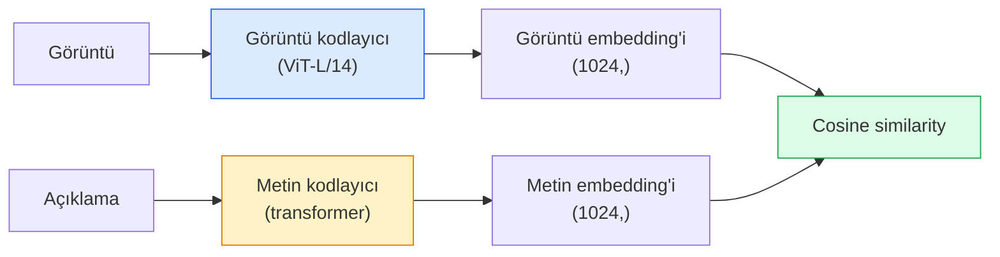

# Open-Vocabulary Vision — CLIP

> Bir görüntü kodlayıcı (image encoder) ile bir metin kodlayıcıyı (text encoder) birlikte eğitin; öyle ki eşleşen (görüntü, açıklama) çiftleri ortak bir uzayda aynı noktaya düşsün. Bütün numara bu.

**Tür:** Build + Use
**Diller:** Python
**Ön Koşullar:** Phase 4 Lesson 14 (ViT), Phase 4 Lesson 17 (Self-Supervised)
**Süre:** ~45 dakika

## Öğrenme Hedefleri

- CLIP'in iki kuleli mimarisini (two-tower architecture) ve contrastive learning (zıtlaşmalı öğrenme) hedef fonksiyonunu açıklamak
- Önceden eğitilmiş bir CLIP (veya SigLIP) kullanarak hiçbir göreve özel eğitim yapmadan zero-shot (sıfır-atış) sınıflandırma yapmak
- Zero-shot sınıflandırmayı sıfırdan uygulamak: sınıf prompt'larını kodlamak, cosine similarity (kosinüs benzerliği) hesaplamak, argmax almak
- CLIP, SigLIP, OpenCLIP ve LLaVA/LLaMA-vision modellerini ayırt etmek — 2026'da her birinin ne için kullanıldığını bilmek

## Problem

Geleneksel sınıflandırıcılar closed-vocabulary (kapalı sözlük) yapısındadır: 1000 sınıflı bir ImageNet modeli yalnızca 1000 etiket tahmin edebilir. Her yeni kategori, etiketlenmiş veri ve yeniden eğitilmiş bir başlık (head) gerektirir.

CLIP (Radford ve ark., OpenAI 2021), web'den toplanmış 400 milyon (görüntü, açıklama) çiftiyle eğitimin, çıkarım (inference) anında tamamen doğal dille tanımlanmış herhangi bir kategori kümesinde sınıflandırma yapabilen bir model ürettiğini gösterdi. Yeni bir sınıfı bir cümle yazarak eklersiniz.

Bu yetenek — zero-shot transfer (sıfır-atış aktarımı) — günümüzdeki her modern görüş sisteminin bir CLIP ailesi checkpoint'iyle başlamasının nedenidir. Detection (Görüntüde nesne tespiti) (Grounding DINO, OWL-ViT), segmentation (bölütleme) (CLIPSeg, SAM), geri getirim (retrieval), içerik denetleme (content moderation), VLM'ler (vision-language models) ve metinden görüntü üretimi (text-to-image generation) — hepsi CLIP tarzı ortak gömülü temsiller (joint embeddings) üzerine inşa edilmiştir.

## Konsept

### İki kule (Two towers)



Her iki kodlayıcı da aynı embedding boyutuna (CLIP-B/32 için 512, CLIP-L/14 için 1024) bir lineer izdüşüm (linear projection) ile biter. L2-normalizasyon uygulanır ve cosine similarity hesaplanır.

### Hedef fonksiyon (Objective)

N adet (görüntü, açıklama) çiftinden oluşan bir batch verildiğinde, bir N×N benzerlik matrisi oluşturun. Her iki kodlayıcıyı, köşegen (eşleşen çiftler) yüksek benzerlik, köşegen dışı (eşleşmeyenler) düşük benzerlik gösterecek şekilde eğitin.

```
sim_matrix = image_embeddings @ text_embeddings.T / tau

loss_i2t = cross_entropy(sim_matrix,       targets=arange(N))
loss_t2i = cross_entropy(sim_matrix.T,     targets=arange(N))
loss = (loss_i2t + loss_t2i) / 2
```

Simetriktir çünkü hem görüntüden metne hem de metinden görüntüye geri getirim (retrieval) çalışmalıdır. `tau` (sıcaklık/temperature) genellikle öğrenilen bir skaler parametredir ve 0.07 ile başlatılır.

#### Açıklama
Contrastive learning'de kullanılan simetrik kayıp fonksiyonu. Image-to-text ve text-to-image yönlerinde aynı anda öğrenmeyi sağlar.

### SigLIP: daha iyi bir kayıp

SigLIP (Zhai ve ark., 2023) softmax'ı, çift başına sigmoid ile değiştirdi:

```
loss = mean over pairs of log(1 + exp(-y_ij * sim_ij))
y_ij = +1 if matching, -1 otherwise
```

#### Açıklama
Çift başına loss (per-pair loss), CLIP'in gerektirdiği batch düzeyindeki normalizasyonu kaldırır. SigLIP, küçük batch boyutlarında daha iyi eğitilir ve eşit veride CLIP'i yakalar veya geçer.

### Zero-shot sınıflandırma

Eğitilmiş bir CLIP verildiğinde:

1. Her sınıf için bir prompt oluşturun: "a photo of a {class}".
2. Tüm sınıf prompt'larını metin kodlayıcı ile kodlayın -> `T` boyutu (C, d).
3. Test görüntüsünü kodlayın -> `I` boyutu (1, d).
4. Benzerlik = `I @ T.T` boyutu (1, C).
5. Argmax -> tahmin edilen sınıf.

Prompt mühendisliği önemlidir. OpenAI, ImageNet için 80 prompt şablonu yayınlamıştır ("a photo of a {}", "a blurry photo of a {}", "a sketch of a {}", ...). Sınıf başına tüm şablonların embedding'lerinin ortalamasını almak, ek %1-3 top-1 doğruluk kazandırır.

### CLIP tarzı modellerin 2026'da kullanıldığı yerler

- **Zero-shot sınıflandırma** — doğrudan kullanım.
- **Görüntü geri getirim (Image retrieval)** — tüm görüntüleri bir kez kodla, çıkarımda sorguyu embed et.
- **Metin koşullu tespit (Text-conditioned detection)** — Grounding DINO, OWL-ViT bir CLIP metin kulesini dedektörün etrafına sarar.
- **Metin koşullu bölütleme (Text-conditioned segmentation)** — CLIPSeg; SAM, metin prompt girdileri için CLIP kullanır.
- **VLM'ler** — LLaVA, Qwen-VL, InternVL bir CLIP ailesi görüntü kodlayıcısını bir LLM'ye bağlar.
- **Metinden görüntü üretimi (Text-to-image gen)** — Stable Diffusion, DALL-E 3, CLIP metin embedding'leriyle koşullanır.

Ortak bir embedding uzayına (shared embedding space) sahip olduğunuzda, her görüntü-dil görevi bir uzaklık hesaplamasına dönüşür.

## Build It (Sıfırdan Kodla)

### Adım 1: Küçük bir iki kuleli model

Gerçek CLIP, ViT + transformer'dır. Bu ders için kuleler, önceden çıkarılmış öznitelikler üzerinde çalışan küçük MLP'lerdir, böylece eğitim sinyali CPU'da görülebilir.

```python
import torch
import torch.nn as nn
import torch.nn.functional as F


class TwoTower(nn.Module):
    def __init__(self, img_in=128, txt_in=64, emb=64):
        super().__init__()
        self.image_proj = nn.Sequential(nn.Linear(img_in, 128), nn.ReLU(), nn.Linear(128, emb))
        self.text_proj = nn.Sequential(nn.Linear(txt_in, 128), nn.ReLU(), nn.Linear(128, emb))
        self.logit_scale = nn.Parameter(torch.ones([]) * 2.6592)  # ln(1/0.07)

    def forward(self, img_feats, txt_feats):
        i = F.normalize(self.image_proj(img_feats), dim=-1)
        t = F.normalize(self.text_proj(txt_feats), dim=-1)
        return i, t, self.logit_scale.exp()
```

#### Açıklama
İki izdüşüm katmanı, paylaşılan çıktı boyutu ve öğrenilebilir sıcaklık parametresi. Gerçek CLIP API'siyle aynı yapıda.

### Adım 2: Contrastive loss (Zıtlaşmalı kayıp)

```python
def clip_loss(image_emb, text_emb, logit_scale):
    N = image_emb.size(0)
    sim = logit_scale * image_emb @ text_emb.T
    targets = torch.arange(N, device=sim.device)
    l_i = F.cross_entropy(sim, targets)
    l_t = F.cross_entropy(sim.T, targets)
    return (l_i + l_t) / 2
```

#### Açıklama
Simetrik yapı. Yüksek logit_scale = daha keskin softmax = daha yüksek güven ama kararsızlık riski.

### Adım 3: Zero-shot sınıflandırıcı

```python
@torch.no_grad()
def zero_shot_classify(model, image_feats, class_text_feats, class_names):
    """
    image_feats:      (N, img_in)
    class_text_feats: (C, txt_in)   her sınıf için tek bir ortalama embedding
    """
    i = F.normalize(model.image_proj(image_feats), dim=-1)
    t = F.normalize(model.text_proj(class_text_feats), dim=-1)
    sim = i @ t.T
    pred = sim.argmax(dim=-1)
    return [class_names[p] for p in pred.tolist()]
```

#### Açıklama
Adım başına tek satır. Bu, üretimdeki bir CLIP checkpoint'i ile kullanılan zero-shot prosedürünün aynısıdır.

### Adım 4: Doğrulama (Sanity check)

```python
torch.manual_seed(0)
model = TwoTower()

img = torch.randn(8, 128)
txt = torch.randn(8, 64)
i, t, scale = model(img, txt)
loss = clip_loss(i, t, scale)
print(f"batch size: {i.size(0)}   loss: {loss.item():.3f}")
```

#### Açıklama
Rastgele başlatılmış bir model için loss, `log(N) = log(8) = 2.08` değerine yakın olmalıdır — henüz hiçbir yapı öğrenilmediğinde simetrik cross-entropy hedefi.

## Use It (Kullan)

OpenCLIP, 2026'da topluluk standardıdır:

```python
import open_clip
import torch
from PIL import Image

model, _, preprocess = open_clip.create_model_and_transforms("ViT-B-32", pretrained="laion2b_s34b_b79k")
tokenizer = open_clip.get_tokenizer("ViT-B-32")

image = preprocess(Image.open("dog.jpg")).unsqueeze(0)
text = tokenizer(["a photo of a dog", "a photo of a cat", "a photo of a car"])

with torch.no_grad():
    image_features = model.encode_image(image)
    text_features = model.encode_text(text)
    image_features = image_features / image_features.norm(dim=-1, keepdim=True)
    text_features = text_features / text_features.norm(dim=-1, keepdim=True)
    probs = (100.0 * image_features @ text_features.T).softmax(dim=-1)

print(probs)
```

#### Açıklama
OpenCLIP ile önceden eğitilmiş bir model yüklenir, görüntü ve metin aynı embedding uzayına kodlanır ve cosine similarity ile sınıf olasılıkları hesaplanır.

SigLIP daha yenidir, küçük ölçeklerde daha iyi eğitilir ve yeni çalışmalar için tercih edilir: `google/siglip-base-patch16-224`. Hugging Face her ikisini de sunar.

## Ship It (Çıktılar)

Bu ders şunları üretir:

- `outputs/prompt-zero-shot-class-picker.md` — bir sınıf listesi ve alan (domain) verildiğinde, zero-shot CLIP için sınıf şablonları tasarlayan bir prompt.
- `outputs/skill-image-text-retriever.md` — herhangi bir CLIP checkpoint'i ile görüntü embedding indeksi oluşturan, metinle ve görüntüyle sorgulamayı destekleyen bir beceri.

## Alıştırmalar

1. **(Kolay)** Önceden eğitilmiş bir OpenCLIP ViT-B/32 kullanarak CIFAR-10 üzerinde 80 şablonlu prompt seti ile zero-shot sınıflandırma yapın. Top-1 doğruluğu raporlayın; yaklaşık %85-90 olmalıdır.
2. **(Orta)** Aynı CIFAR-10 görevinde tek şablonlu ("a photo of a {}") ile 80 şablonlu ortalama embedding'i karşılaştırın. Farkı ölçün ve şablonların neden yardımcı olduğunu açıklayın.
3. **(Zor)** Bir zero-shot görüntü geri getirim indeksi oluşturun: 1.000 görüntüyü CLIP ile embed edin, bir FAISS indeksi kurun, doğal dil açıklamasıyla sorgulayın. Kendi yazdığınız 20 ayrılmış sorgu için recall@5 değerini raporlayın.

## Anahtar Terimler

| Terim | Söylenişi | Gerçek anlamı |
|-------|-----------|---------------|
| Two-tower (İki kule) | "Çift kodlayıcı" | Ayrı görüntü ve metin kodlayıcıları; paylaşılan boyutlu bir izdüşüm başlığında birleşir |
| Zero-shot | "Göreve özel eğitim yok" | Çıkarımda yalnızca metinle tanımlanan sınıflara göre sınıflandırma; hiçbir etikete dokunulmaz |
| Temperature / logit_scale | "tau" | Softmax öncesi benzerlik matrisini ölçekleyen öğrenilebilir skaler |
| Prompt template (Prompt şablonu) | "Bir {} fotoğrafı" | Sınıf isimlerini saran doğal dil ifadesi; çoklu şablonların ortalaması zero-shot doğruluğunu artırır |
| CLIP | "Görüntü+metin modeli" | 2021 OpenAI modeli; 2026'da alanın sözlüğü |
| SigLIP | "Sigmoid CLIP" | Softmax'ı çift başına sigmoid ile değiştirir; küçük batch'lerde daha iyi eğitilir |
| OpenCLIP | "Açık yeniden üretim" | LAION üzerinde topluluk tarafından eğitilmiş CLIP varyantları; açık kaynaklı pipeline'lar için üretim standardı |
| VLM | "Vision-language model" | CLIP ailesi kodlayıcı artı bir LLM; görüntüler hakkında soruları yanıtlamak üzere eğitilmiş |

## İleri Okuma

- [CLIP: Learning Transferable Visual Models from Natural Language Supervision (Radford et al., 2021)](https://arxiv.org/abs/2103.00020)
- [SigLIP: Sigmoid Loss for Language-Image Pre-Training (Zhai et al., 2023)](https://arxiv.org/abs/2303.15343)
- [OpenCLIP](https://github.com/mlfoundations/open_clip) — topluluk kod tabanı
- [DINOv2 vs CLIP vs MAE: a features comparison](https://huggingface.co/blog/dinov2) — HF rehberi, yan yana kullanım senaryoları
