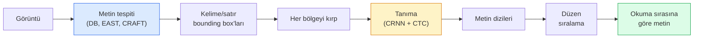

# OCR & Document Understanding (Belge Anlama)

> OCR, üç aşamalı bir pipeline'dır — metin kutularını tespit et, karakterleri tanı, sonra düzenle. Her modern OCR sistemi bu aşamaları yeniden sıralar veya birleştirir.

**Tür:** Learn + Use
**Diller:** Python
**Ön Koşullar:** Phase 4 Lesson 06 (Detection), Phase 7 Lesson 02 (Self-Attention)
**Süre:** ~45 dakika

## Öğrenme Hedefleri

- Klasik OCR pipeline'ını (tespit et -> tanı -> düzenle) ve modern uçtan uca alternatifleri (Donut, Qwen-VL-OCR) izlemek
- CTC loss (Connectionist Temporal Classification) ile sequence-to-sequence OCR eğitimini uygulamak
- Eğitim gerektirmeden üretim belge ayrıştırma (document parsing) için PaddleOCR veya EasyOCR kullanmak
- OCR, layout parsing (düzen ayrıştırma) ve document understanding (belge anlama) arasındaki farkı ayırt etmek ve görev başına doğru aracı seçmek

## Problem

Metin dolu görüntüler her yerde: fişler, faturalar, kimlikler, taranmış kitaplar, formlar, beyaz tahtalar, tabelalar, ekran görüntüleri. Bunlardan yapılandırılmış veri çıkarmak — sadece karakterleri değil, "bu toplam tutar" demek — en yüksek değerli uygulamalı görüş (applied vision) problemlerinden biridir.

Alan, üç beceri katmanına ayrılır:

1. **OCR'un kendisi**: pikselleri metne dönüştürmek.
2. **Layout parsing (Düzen ayrıştırma)**: OCR çıktısını bölgelere (başlık, gövde, tablo, üstbilgi) gruplamak.
3. **Document understanding (Belge anlama)**: Düzenden yapılandırılmış alanlar çıkarmak ("invoice_total = 42.50 $").

Her katmanın klasik ve modern yaklaşımları vardır ve "bir görüntüden metin istiyorum" ile "bu fişten toplam tutarı almam gerek" arasındaki fark, çoğu ekibin fark ettiğinden daha büyüktür.

## Konsept

### Klasik pipeline



- **Metin tespiti (Text detection)**, satır veya kelime başına dörtgenler (quadrilaterals) üretir.
- **Tanıma (Recognition)**, her bölgeyi sabit bir yüksekliğe kırpar, bir CNN + BiLSTM + CTC ile karakter dizisi üretir.
- **Düzen (Layout)**, okuma sırasını yeniden oluşturur (Latin alfabesi için yukarıdan aşağıya, soldan sağa; Arapça, Japonca için farklı).

### CTC tek paragrafta

OCR tanımada, sabit uzunluklu bir öznitelik haritasından (feature map) değişken uzunluklu bir dizi üretilir. CTC (Graves ve ark., 2006), bunu karakter düzeyinde hizalama (alignment) olmadan eğitmenizi sağlar. Model her zaman adımında (vocab + blank) üzerinden bir dağılım çıktısı verir; CTC loss, tekrarları birleştirip blank'leri çıkardıktan sonra hedef metne indirgenen tüm hizalamalar üzerinden marjinalleşir (marginalise).

```
ham çıktı: "h h h _ _ e e l l _ l l o _ _"
tekrarlar birleştirilip blank'ler çıkarılınca: "hello"
```

#### Açıklama
CTC, CRNN'in 2015'te çalışmasını sağlayan ve 2026'da hâlâ çoğu üretim OCR modelini eğiten yöntemdir.

### Modern uçtan uca modeller

- **Donut** (Kim ve ark., 2022) — bir ViT kodlayıcı + bir metin kod çözücü; görüntüyü okur ve doğrudan JSON üretir. Metin dedektörü veya düzen modülü yoktur.
- **TrOCR** — satır düzeyinde OCR için ViT + transformer decoder.
- **Qwen-VL-OCR / InternVL** — OCR görevleri için ince ayar yapılmış tam vision-language modelleri; 2026'da karmaşık belgelerde en iyi doğruluk.
- **PaddleOCR** — olgun bir üretim paketinde klasik DB + CRNN pipeline'ı; hâlâ açık kaynaklı iş makinesi.

Uçtan uca modeller daha fazla veri ve hesaplama gücü gerektirir ancak çok aşamalı pipeline'ların hata birikimini (error accumulation) atlar.

### Layout parsing (Düzen ayrıştırma)

Yapılandırılmış belgeler için, her bölgeyi etiketleyen bir düzen dedektörü (LayoutLMv3, DocLayNet) çalıştırılır: Başlık, Paragraf, Şekil, Tablo, Dipnot. Okuma sırası daha sonra "düzen sırasındaki bölgeleri yinele, birleştir" haline gelir.

Formlar için **Anahtar-Değer çıkarımı (Key-Value extraction)** modelleri kullanılır (görsel açıdan zengin belgeler için Donut, düz taramalar için LayoutLMv3). Bunlar görüntü + tespit edilen metin + konumları alır ve yapılandırılmış anahtar-değer çiftleri tahmin eder.

### Değerlendirme metrikleri

- **Character Error Rate - CER (Karakter Hata Oranı)** — Levenshtein uzaklığı / referans uzunluğu. Düşük daha iyidir. Üretim hedefi: temiz taramalarda < %2.
- **Word Error Rate - WER (Kelime Hata Oranı)** — aynısı, kelime düzeyinde.
- **Yapılandırılmış alanlarda F1** — anahtar-değer görevleri için; `{invoice_total: 42.50}`'nin doğru görünüp görünmediğini ölçer.
- **JSON üzerinde Edit distance** — uçtan uca belge ayrıştırma için; Donut makalesi normalize edilmiş ağaç düzenleme mesafesini (normalised tree edit distance) tanıtmıştır.

## Build It (Sıfırdan Kodla)

### Adım 1: CTC loss + greedy decoder (açgözlü kod çözücü)

```python
import torch
import torch.nn as nn
import torch.nn.functional as F


def ctc_loss(log_probs, targets, input_lengths, target_lengths, blank=0):
    """
    log_probs:      (T, N, C) indeks 0'da blank dahil vocab üzerinde log-softmax
    targets:        (N, S) int hedefler (blank yok)
    input_lengths:  (N,) örnek başına kullanılan zaman adımları
    target_lengths: (N,) örnek başına hedef uzunluğu
    """
    return F.ctc_loss(log_probs, targets, input_lengths, target_lengths,
                      blank=blank, reduction="mean", zero_infinity=True)


def greedy_ctc_decode(log_probs, blank=0):
    """
    log_probs: (T, N, C) log-softmax
    döndürür: indeks dizilerinin listesi (blank'ler silinmiş, tekrarlar birleştirilmiş)
    """
    preds = log_probs.argmax(dim=-1).transpose(0, 1).cpu().tolist()
    out = []
    for seq in preds:
        decoded = []
        prev = None
        for idx in seq:
            if idx != prev and idx != blank:
                decoded.append(idx)
            prev = idx
        out.append(decoded)
    return out
```

#### Açıklama
`F.ctc_loss`, mevcut olduğunda verimli CuDNN implementasyonunu kullanır. Greedy decoder, beam search'ten daha basittir ve genellikle onun %1 CER içindedir.

### Adım 2: Küçük CRNN tanıyıcı

Satır OCR'si için minimum CNN + BiLSTM.

```python
class TinyCRNN(nn.Module):
    def __init__(self, vocab_size=40, hidden=128, feat=32):
        super().__init__()
        self.cnn = nn.Sequential(
            nn.Conv2d(1, feat, 3, 1, 1), nn.BatchNorm2d(feat), nn.ReLU(inplace=True),
            nn.MaxPool2d(2),
            nn.Conv2d(feat, feat * 2, 3, 1, 1), nn.BatchNorm2d(feat * 2), nn.ReLU(inplace=True),
            nn.MaxPool2d(2),
            nn.Conv2d(feat * 2, feat * 4, 3, 1, 1), nn.BatchNorm2d(feat * 4), nn.ReLU(inplace=True),
            nn.MaxPool2d((2, 1)),
            nn.Conv2d(feat * 4, feat * 4, 3, 1, 1), nn.BatchNorm2d(feat * 4), nn.ReLU(inplace=True),
            nn.MaxPool2d((2, 1)),
        )
        self.rnn = nn.LSTM(feat * 4, hidden, bidirectional=True, batch_first=True)
        self.head = nn.Linear(hidden * 2, vocab_size)

    def forward(self, x):
        # x: (N, 1, H, W)
        f = self.cnn(x)                # (N, C, H', W')
        f = f.mean(dim=2).transpose(1, 2)  # (N, W', C)
        h, _ = self.rnn(f)
        return F.log_softmax(self.head(h).transpose(0, 1), dim=-1)  # (W', N, vocab)
```

#### Açıklama
Sabit yükseklikli girdi (CNN max-pooling ile yüksekliği 1'e indirir). Genişlik, CTC için zaman boyutudur.

### Adım 3: Sentetik OCR

Uçtan uca bir doğrulama (smoke test) için siyah-beyaz rakam dizileri üretin.

```python
import numpy as np

def synthetic_line(text, height=32, char_width=16):
    W = char_width * len(text)
    img = np.ones((height, W), dtype=np.float32)
    for i, c in enumerate(text):
        x = i * char_width
        shade = 0.0 if c.isalnum() else 0.5
        img[6:height - 6, x + 2:x + char_width - 2] = shade
    return img


def build_batch(strings, vocab):
    H = 32
    W = 16 * max(len(s) for s in strings)
    imgs = np.ones((len(strings), 1, H, W), dtype=np.float32)
    target_lengths = []
    targets = []
    for i, s in enumerate(strings):
        imgs[i, 0, :, :16 * len(s)] = synthetic_line(s)
        ids = [vocab.index(c) for c in s]
        targets.extend(ids)
        target_lengths.append(len(ids))
    return torch.from_numpy(imgs), torch.tensor(targets), torch.tensor(target_lengths)


vocab = ["_"] + list("0123456789abcdefghijklmnopqrstuvwxyz")
imgs, targets, lengths = build_batch(["hello", "world"], vocab)
print(f"images: {imgs.shape}   targets: {targets.shape}   lengths: {lengths.tolist()}")
```

#### Açıklama
Gerçek bir OCR veri kümesi fontlar, gürültü, döndürme, bulanıklık ve renk ekler. Yukarıdaki pipeline aynıdır.

### Adım 4: Eğitim taslağı

```python
model = TinyCRNN(vocab_size=len(vocab))
opt = torch.optim.Adam(model.parameters(), lr=1e-3)

for step in range(200):
    strings = ["abc" + str(step % 10)] * 4 + ["xyz" + str((step + 1) % 10)] * 4
    imgs, targets, target_lens = build_batch(strings, vocab)
    log_probs = model(imgs)  # (W', 8, vocab)
    input_lens = torch.full((8,), log_probs.size(0), dtype=torch.long)
    loss = ctc_loss(log_probs, targets, input_lens, target_lens, blank=0)
    opt.zero_grad(); loss.backward(); opt.step()
```

#### Açıklama
Bu basit sentetik veri üzerinde loss, 200 adımda ~3'ten ~0.2'ye düşmelidir.

## Use It (Kullan)

Üç üretim yolu:

- **PaddleOCR** — olgun, hızlı, çok dilli. Tek satırlık kullanım: `paddleocr.PaddleOCR(lang="en").ocr(image_path)`.
- **EasyOCR** — Python-native, çok dilli, PyTorch altyapılı.
- **Tesseract** — klasik; modellerin zorlandığı eski taranmış belgeler için hâlâ kullanışlı.

Uçtan uca belge ayrıştırma için Donut veya bir VLM kullanın:

```python
from transformers import DonutProcessor, VisionEncoderDecoderModel

processor = DonutProcessor.from_pretrained("naver-clova-ix/donut-base-finetuned-cord-v2")
model = VisionEncoderDecoderModel.from_pretrained("naver-clova-ix/donut-base-finetuned-cord-v2")
```

#### Açıklama
Tekrarlanabilir yapıya sahip fişler, faturalar ve formlar için Donut'u ince ayar yapın. Rastgele belgeler veya akıl yürütme gerektiren OCR için Qwen-VL-OCR gibi bir VLM, 2026'daki varsayılan seçenektir.

## Ship It (Çıktılar)

Bu ders şunları üretir:

- `outputs/prompt-ocr-stack-picker.md` — belge türü, dil ve yapıya göre Tesseract / PaddleOCR / Donut / VLM-OCR seçen bir prompt.
- `outputs/skill-ctc-decoder.md` — greedy ve beam-search CTC decoder'larını sıfırdan yazan, uzunluk normalizasyonu içeren bir beceri.

## Alıştırmalar

1. **(Kolay)** TinyCRNN'yi 5 basamaklı rastgele sayısal dizilerde 500 adım eğitin. Ayrılmış bir test setinde CER raporlayın.
2. **(Orta)** Greedy decoding'i beam search (beam_width=5) ile değiştirin. CER farkını raporlayın. Beam search hangi girdilerde kazanır?
3. **(Zor)** PaddleOCR'ı 20 fiş üzerinde kullanın, satır öğelerini çıkarın ve {item_name, price} çiftleri için elle etiketlenmiş doğruluk verisine karşı F1 hesaplayın.

## Anahtar Terimler

| Terim | Söylenişi | Gerçek anlamı |
|-------|-----------|---------------|
| OCR | "Piksellerden metin" | Görüntü bölgelerini karakter dizilerine dönüştürmek |
| CTC | "Hizalama gerektirmeyen kayıp" | Zaman adımı etiketleri olmadan dizi modeli eğiten kayıp; hizalamalar üzerinden marjinalleşir |
| CRNN | "Klasik OCR modeli" | CNN öznitelik çıkarıcı + BiLSTM + CTC; 2015'ten beri üretimde kullanılan temel mimari |
| Donut | "Uçtan uca OCR" | ViT kodlayıcı + metin kod çözücü; görüntüden doğrudan JSON üretir |
| Layout parsing (Düzen ayrıştırma) | "Bölgeleri bul" | Belgedeki Başlık/Tablo/Şekil/Paragraf bölgelerini tespit et ve etiketle |
| Reading order (Okuma sırası) | "Metin sırası" | Tanınan bölgelerin bir cümle halinde sıralanması; Latin alfabesi için basit, karmaşık düzenler için zor |
| CER / WER | "Hata oranları" | Karakter veya kelime düzeyinde Levenshtein uzaklığı / referans uzunluğu |
| VLM-OCR | "Okuyan LLM" | OCR görevleri için eğitilmiş veya prompt'lanmış bir vision-language modeli; karmaşık belgelerde güncel SOTA |

## İleri Okuma

- [CRNN (Shi ve ark., 2015)](https://arxiv.org/abs/1507.05717) — orijinal CNN+RNN+CTC mimarisi
- [CTC (Graves ve ark., 2006)](https://www.cs.toronto.edu/~graves/icml_2006.pdf) — orijinal CTC makalesi; algoritmik fikirlerle yoğun
- [Donut (Kim ve ark., 2022)](https://arxiv.org/abs/2111.15664) — OCR'siz belge anlama transformer'ı
- [PaddleOCR](https://github.com/PaddlePaddle/PaddleOCR) — açık kaynaklı üretim OCR yığını
