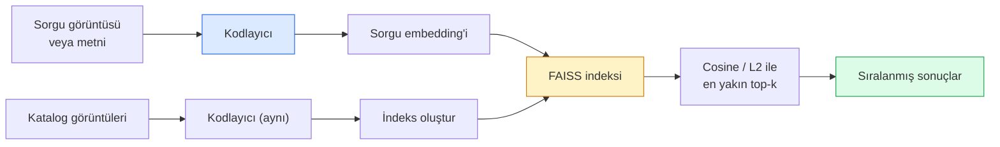

# Image Retrieval (Görüntü Geri Getirim) & Metric Learning (Metrik Öğrenme)

> Bir geri getirim sistemi, adayları embedding uzayındaki bir uzaklığa göre sıralar. Metric learning, bu uzayı, mesafelerin istediğiniz anlama gelmesi için şekillendirme disiplinidir.

**Tür:** Build
**Diller:** Python
**Ön Koşullar:** Phase 4 Lesson 14 (ViT), Phase 4 Lesson 18 (CLIP)
**Süre:** ~45 dakika

## Öğrenme Hedefleri

- Triplet loss, contrastive loss ve proxy-based metric learning kayıplarını açıklamak ve belirli bir veri kümesi için doğru olanı seçmek
- L2-normalizasyon ve cosine similarity (kosinüs benzerliği) hesaplamalarını doğru şekilde uygulamak ve "aynı öğe" ile "aynı sınıf" geri getirimi arasındaki farkı denetlemek
- Bir FAISS indeksi oluşturmak, metinle ve görüntüyle sorgulamak ve ayrılmış bir sorgu seti için recall@K raporlamak
- DINOv2, CLIP ve SigLIP'yi hazır embedding omurgaları (backbone) olarak kullanmak ve her birinin ne zaman kazandığını bilmek

## Problem

Geri getirim (retrieval), üretim görüş sistemlerinde her yerde karşımıza çıkar: kopya tespiti (duplicate detection), tersine görsel arama (reverse image search), görsel arama ("benzer ürünleri bul"), yüz yeniden tanımlama (face re-identification), gözetim için kişi yeniden tanımlama (person re-ID), e-ticaret için örnek düzeyinde eşleme (instance-level matching). Ürün sorusu her zaman aynıdır: "bu sorgu görüntüsü verildiğinde, kataloğumu sırala."

Tüm sistemi şekillendiren iki tasarım kararı vardır. Embedding — vektörleri hangi model üretir. İndeks — en yakın komşuları ölçekte nasıl buluruz. 2026'da her ikisi de standartlaşmıştır (DINOv2 embedding için, FAISS indeks için), bu da çıtayı yükseltir: zor kısım, uygulamanız için *benzerliğin ne anlama geldiğini* tanımlamak ve ardından embedding uzayını mesafeler buna uyacak şekilde şekillendirmektir.

Bu şekillendirme işine metric learning (metrik öğrenme) denir. Küçük ama yüksek etkili bir disiplindir.

## Konsept

### Geri getirime kuşbakışı



### Dört kayıp ailesi

| Kayıp | Gerektirir | Artıları | Eksileri |
|-------|-----------|----------|----------|
| **Contrastive** | (anchor, positive) + negative'ler | Basit, herhangi bir çift etiketiyle çalışır | Çok sayıda negative olmadan yavaş yakınsar |
| **Triplet** | (anchor, positive, negative) | Sezgisel; doğrudan margin kontrolü | Hard-triplet madenciliği pahalıdır |
| **NT-Xent / InfoNCE** | Çiftler + batch-mined negative'ler | Büyük batch'lere ölçeklenir | Büyük batch veya momentum kuyruğu gerektirir |
| **Proxy-based (ProxyNCA)** | Yalnızca sınıf etiketleri | Hızlı, kararlı, madencilik yok | Küçük veri kümelerinde proxy'lere aşırı uyabilir |

Çoğu üretim kullanım durumu için, önceden eğitilmiş bir omurga (backbone) ile başlayın ve hazır embedding'ler test setinizde yetersiz kalıyorsa yalnızca metric learning ince ayarı ekleyin.

### Triplet loss resmi olarak

```
L = max(0, ||f(a) - f(p)||^2 - ||f(a) - f(n)||^2 + margin)
```

#### Açıklama
Anchor `a`'yı pozitif `p`'ye yaklaştır, negatif `n`'den uzaklaştır ve arayı açacak bir `margin` (marj) kullan. Üç görüntülü yapı, herhangi bir benzerlik sıralamasına genellenebilir.

Madencilik önemlidir: kolay triplet'ler (`n` zaten `a`'dan uzaktır) sıfır loss üretir; yalnızca zor triplet'ler ağı öğretir. Semi-hard madencilik (`n`, `p`'den daha uzak ama margin içinde) 2016 FaceNet tarifi olup hâlâ baskındır.

### Cosine similarity ve L2

İki metrik, iki gelenek:

- **Cosine**: vektörler arasındaki açı. L2-normalize edilmiş embedding'ler gerektirir.
- **L2**: Öklid mesafesi. Ham veya normalize edilmiş embedding'lerle çalışır, ancak genellikle L2-normalize + kareli L2 ile eşleştirilir.

Çoğu modern ağ için ikisi eşdeğerdir: `||a - b||^2 = 2 - 2 cos(a, b)` olduğunda `||a|| = ||b|| = 1`. Embedding eğitiminizle eşleşen geleneği seçin; karıştırmak "en yakın"ın anlamını sessizce değiştirir.

### Recall@K

Standart geri getirim metriği:

```
recall@K = en az bir doğru eşleşmenin ilk K sonuç içinde olduğu sorguların oranı
```

#### Açıklama
Recall@1, @5, @10'u yan yana raporlayın. Recall@10'un 0.95'in üzerinde ama recall@1'in 0.5'in altında olması, embedding uzayının doğru yapıya sahip olduğu ancak sıralamanın gürültülü olduğu anlamına gelir — daha uzun ince ayarlar veya bir yeniden sıralama (re-ranking) adımı deneyin.

Kopya tespitinde precision@K daha önemlidir çünkü her yanlış pozitif (false positive) kullanıcı tarafından görünen bir hatadır. Görsel aramada recall@K ürün sinyalidir.

### FAISS tek paragrafta

Facebook AI Similarity Search. En yakın komşu arama için fiili standart kütüphane. Üç indeks seçeneği:

- `IndexFlatIP` / `IndexFlatL2` — kaba kuvvet, kesin, eğitim gerektirmez. Yaklaşık 1M vektöre kadar kullanın.
- `IndexIVFFlat` — K hücreye böl, yalnızca en yakın birkaç hücrede ara. Yaklaşık, hızlı, eğitim verisi gerektirir.
- `IndexHNSW` — grafik tabanlı, çok sayıda sorgu için en hızlısı, büyük indeks boyutu.

100k vektör için muhtemelen cosine similarity üzerinde `IndexFlatIP` istersiniz. 10M için `IndexIVFFlat`. 100M+ için ürün nicelemesi (product quantisation) ile birlikte `IndexIVFPQ`.

### Örnek düzeyi vs kategori düzeyi geri getirim

Aynı ada sahip iki çok farklı problem:

- **Kategori düzeyi** — "kataloğumda kedileri bul." Sınıf koşullu benzerlik; hazır CLIP / DINOv2 embedding'leri iyi çalışır.
- **Örnek düzeyi (Instance-level)** — "kataloğumda *bu tam ürünü* bul." Aynı sınıftaki görsel olarak benzer nesneler arasında ince ayrım yapma gerektirir; hazır embedding'ler yetersiz kalır; metric learning ile ince ayar önemlidir.

Bir model seçmeden önce hangisini çözdüğünüzü her zaman sorgulayın.

## Build It (Sıfırdan Kodla)

### Adım 1: Triplet loss

```python
import torch
import torch.nn.functional as F

def triplet_loss(anchor, positive, negative, margin=0.2):
    d_ap = F.pairwise_distance(anchor, positive, p=2)
    d_an = F.pairwise_distance(anchor, negative, p=2)
    return F.relu(d_ap - d_an + margin).mean()
```

#### Açıklama
Tek satır. L2-normalize veya ham embedding'lerle çalışır.

### Adım 2: Semi-hard madencilik

Bir batch embedding ve etiket verildiğinde, her anchor için en zor semi-hard negative'i bulun.

```python
def semi_hard_negatives(emb, labels, margin=0.2):
    dist = torch.cdist(emb, emb)
    same_class = labels[:, None] == labels[None, :]
    diff_class = ~same_class
    N = emb.size(0)

    positives = dist.clone()
    positives[~same_class] = float("-inf")
    positives.fill_diagonal_(float("-inf"))
    pos_idx = positives.argmax(dim=1)

    semi_hard = dist.clone()
    semi_hard[same_class] = float("inf")
    d_ap = dist[torch.arange(N), pos_idx].unsqueeze(1)
    semi_hard[dist <= d_ap] = float("inf")
    neg_idx = semi_hard.argmin(dim=1)

    fallback_mask = semi_hard[torch.arange(N), neg_idx] == float("inf")
    if fallback_mask.any():
        hardest = dist.clone()
        hardest[same_class] = float("inf")
        neg_idx = torch.where(fallback_mask, hardest.argmin(dim=1), neg_idx)
    return pos_idx, neg_idx
```

#### Açıklama
Her anchor, sınıf içindeki en zor pozitifi ve pozitiften daha uzak ama margin içinde olan bir semi-hard negative alır.

### Adım 3: Recall@K

```python
def recall_at_k(query_emb, gallery_emb, query_labels, gallery_labels, k=1):
    sim = query_emb @ gallery_emb.T
    _, top_k = sim.topk(k, dim=-1)
    matches = (gallery_labels[top_k] == query_labels[:, None]).any(dim=-1)
    return matches.float().mean().item()
```

#### Açıklama
L2-normalize embedding'ler üzerinde iç çarpım ile top-k, cosine ile top-k'ye eşittir. En az bir doğru komşusu olan sorguların ortalama oranını raporlayın.

### Adım 4: Bir araya getirme

```python
import torch
import torch.nn as nn
from torch.optim import Adam

class Encoder(nn.Module):
    def __init__(self, in_dim=128, emb_dim=64):
        super().__init__()
        self.net = nn.Sequential(
            nn.Linear(in_dim, 128), nn.ReLU(),
            nn.Linear(128, emb_dim),
        )

    def forward(self, x):
        return F.normalize(self.net(x), dim=-1)

torch.manual_seed(0)
num_classes = 6
protos = F.normalize(torch.randn(num_classes, 128), dim=-1)

def sample_batch(bs=32):
    labels = torch.randint(0, num_classes, (bs,))
    x = protos[labels] + 0.15 * torch.randn(bs, 128)
    return x, labels

enc = Encoder()
opt = Adam(enc.parameters(), lr=3e-3)

for step in range(200):
    x, y = sample_batch(32)
    emb = enc(x)
    pos_idx, neg_idx = semi_hard_negatives(emb, y)
    loss = triplet_loss(emb, emb[pos_idx], emb[neg_idx])
    opt.zero_grad(); loss.backward(); opt.step()
```

#### Açıklama
Birkaç yüz adımdan sonra embedding kümeleri (clusters) sınıf başına bir küme oluşturacaktır.

## Use It (Kullan)

2026'da üretim yığınları:

- **DINOv2 + FAISS** — genel amaçlı görsel geri getirim. Hazır çalışır.
- **CLIP + FAISS** — sorgular metin olduğunda.
- **İnce ayarlı DINOv2 + FAISS** — örnek düzeyinde geri getirim, yüz yeniden tanımlama, moda, e-ticaret.
- **Milvus / Weaviate / Qdrant** — FAISS veya HNSW etrafında yönetilen vektör DB sarmalayıcıları.

SOTA örnek geri getirimi için tarif: DINOv2 omurgası, bir embedding başlığı ekle, örnek etiketli çiftlerde triplet veya InfoNCE kaybı ile ince ayar yap, FAISS'te indeksle.

## Ship It (Çıktılar)

Bu ders şunları üretir:

- `outputs/prompt-retrieval-loss-picker.md` — belirli bir geri getirim problemi için triplet / InfoNCE / ProxyNCA seçen bir prompt.
- `outputs/skill-recall-at-k-runner.md` — train/val/gallery ayrımı ve doğru veri sözleşmesi ile recall@K için temiz bir değerlendirme düzeneği yazan bir beceri.

## Alıştırmalar

1. **(Kolay)** Yukarıdaki oyuncak örneğini çalıştırın. Eğitim öncesi ve sonrası embedding'leri PCA ile görselleştirerek altı kümenin oluşumunu gözlemleyin.
2. **(Orta)** Bir ProxyNCA kaybı implementasyonu ekleyin: sınıf başına bir öğrenilmiş "proxy", cosine similarity üzerinde standart cross-entropy. Yakınsama hızını oyuncak veride triplet loss ile karşılaştırın.
3. **(Zor)** HuggingFace üzerinden DINOv2 ile 1.000 ImageNet doğrulama görüntüsünü embed edin, bir FAISS düz indeks oluşturun ve recall@{1, 5, 10}'u aynı görüntülerle sorgu olarak (1.0 olmalı) ve ayrılmış bir bölmeye karşı ImageNet etiketleriyle gerçek referans olarak raporlayın.

## Anahtar Terimler

| Terim | Söylenişi | Gerçek anlamı |
|-------|-----------|---------------|
| Metric learning | "Uzayı şekillendir" | Çıktı uzayındaki mesafelerin hedef benzerliği yansıtması için kodlayıcı eğitmek |
| Triplet loss | "Çek ve it" | L = max(0, d(a, p) - d(a, n) + margin); kanonik metric-learning kaybı |
| Semi-hard mining | "Kullanışlı negative'ler" | Anchor'dan pozitiften daha uzak ama margin içindeki negative'ler; ampirik olarak en bilgilendiriciler |
| Proxy-based loss | "Sınıf prototipleri" | Sınıf başına bir öğrenilmiş proxy; proxy'lere benzerlik üzerinden cross-entropy; çift madenciliği yok |
| Recall@K | "Top-K isabet oranı" | İlk K'da en az bir doğru sonucu olan sorguların oranı |
| Instance retrieval | "Bu tam şeyi bul" | İnce taneli eşleme; hazır öznitelikler genellikle yetersiz kalır |
| FAISS | "NN kütüphanesi" | Facebook'un en yakın komşu kütüphanesi; kesin ve yaklaşık indeksleri destekler |
| HNSW | "Grafik indeksi" | Hiyerarşik gezinebilir küçük dünya; küçük bellek yüküyle hızlı yaklaşık NN |

## İleri Okuma

- [FaceNet: A Unified Embedding for Face Recognition (Schroff ve ark., 2015)](https://arxiv.org/abs/1503.03832) — triplet loss / semi-hard mining makalesi
- [In Defense of the Triplet Loss for Person Re-Identification (Hermans ve ark., 2017)](https://arxiv.org/abs/1703.07737) — triplet ince ayarı için pratik rehber
- [FAISS documentation](https://github.com/facebookresearch/faiss/wiki) — her indeks, her takas
- [SMoT: Metric Learning Taxonomy (Kim ve ark., 2021)](https://arxiv.org/abs/2010.06927) — modern kayıplar ve bağlantıları üzerine bir tarama
