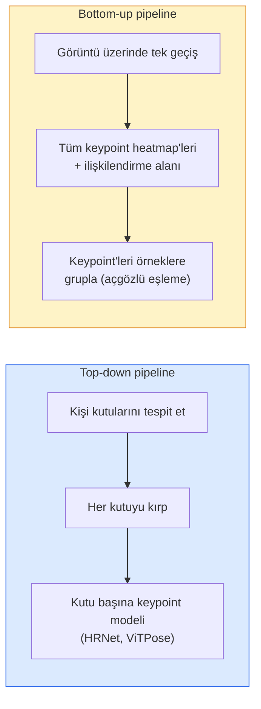

# Keypoint Detection (Anahtar Nokta Tespiti) & Pose Estimation (Duruş Tahmini)

> Bir pose (duruş), sıralı bir dizi anahtar noktadır (keypoint). Bir keypoint dedektörü, bir heatmap (ısı haritası) regresyoncusudur. Gerisi defter tutmadır.

**Tür:** Build
**Diller:** Python
**Ön Koşullar:** Phase 4 Lesson 06 (Detection), Phase 4 Lesson 07 (U-Net)
**Süre:** ~45 dakika

## Öğrenme Hedefleri

- Top-down ve bottom-up pose estimation (duruş tahmini) arasındaki farkı ayırt etmek ve her birinin ne zaman kullanıldığını belirtmek
- K adet keypoint için Gauss blob'lu heatmap'ler hedefleyerek heatmap regresyonu yapmak ve çıkarımda anahtar nokta koordinatlarını çıkarmak
- Part Affinity Fields (PAF'ler) ve bottom-up pipeline'ların keypoint'leri örneklere nasıl ilişkilendirdiğini açıklamak
- Üretim keypoint tahmini için MediaPipe Pose veya MMPose kullanmak ve çıktı formatlarını anlamak

## Problem

Keypoint görevleri birçok isim altında gizlenir: insan duruşu (17 vücut eklemi), yüz landmark'ları (68 veya 478 nokta), el (21 nokta), hayvan duruşu, robotik nesne duruşu, tıbbi anatomi landmark'ları. Hepsi aynı yapıyı paylaşır: bir nesne üzerinde K ayrık nokta tespit et ve (x, y) koordinatlarını çıktıla.

Pose estimation, hareket yakalama (motion capture), fitness uygulamaları, spor analitiği, jest kontrolü (gesture control), animasyon, AR deneme ve robotik kavramanın temelidir. 2B durum olgundur; 3B pose (tek kameradan dünya koordinatlarında eklem pozisyonlarını tahmin etme) güncel araştırma sınırıdır.

Mühendislik sorusu ölçektir. Tek görüntülü, tek kişilik pose 20 ms'lik bir problemdir. 30 fps'de kalabalık içinde çok kişili pose, farklı mimariler gerektiren farklı bir problemdir.

## Konsept

### Top-down ve bottom-up



- **Top-down** — önce insanları tespit et, sonra her kırpılan bölgede kişi başına bir keypoint modeli çalıştır. En yüksek doğruluk; kişi sayısıyla doğrusal olarak ölçeklenir.
- **Bottom-up** — tek bir ileri geçiş tüm keypoint'leri artı bir ilişkilendirme alanı (association field) tahmin eder; bunları grupla. Kalabalık boyutundan bağımsız olarak sabit süreli.

Top-down (HRNet, ViTPose) doğruluk lideridir; bottom-up (OpenPose, HigherHRNet) kalabalık sahneler için iş çıkışı (throughput) lideridir.

### Heatmap regresyonu

Doğrudan `(x, y)` regresyonu yapmak yerine, anahtar nokta başına, gerçek konumda Gauss blob'u olan bir `H x W` heatmap tahmin edin.

```
target[k, y, x] = exp(-((x - cx_k)^2 + (y - cy_k)^2) / (2 sigma^2))
```

#### Açıklama
Çıkarımda, her heatmap'in argmax değeri tahmin edilen anahtar nokta konumudur.

Heatmap'lerin doğrudan regresyondan daha iyi çalışmasının nedeni: ağın uzamsal yapısı (conv feature map) doğal olarak uzamsal çıktıyla hizalanır. Gauss hedefleri ayrıca düzenlileştirir (regularise) — küçük bir konumlandırma hatası küçük bir loss üretir, sıfır değil.

### Alt piksel konumlandırma (Sub-pixel localisation)

Argmax tam sayı koordinatları verir. Alt piksel hassasiyeti için, argmax ve komşularına bir parabol uydurarak veya iyi bilinen offset `(dx, dy) = 0.25 * (heatmap[y, x+1] - heatmap[y, x-1], ...)` yönünü kullanarak iyileştirin.

### Part Affinity Fields (PAF'ler)

OpenPose'un bottom-up ilişkilendirme numarası. Bağlı her keypoint çifti (ör. sol omuzdan sol dirseğe) için, birinden diğerine işaret eden birim vektörü kodlayan 2 kanallı bir alan tahmin edin. Bir omuzu dirseğiyle ilişkilendirmek için, aday çiftleri birleştiren çizgi boyunca PAF'ın çizgi integralini alın; en yüksek integrale sahip çift eşleştirilir.

```
Her bağlantı (uzuv) için:
  PAF kanalları: 2 (birim vektör x, y)
  Çizgi integrali: örnekleme noktalarında (PAF . line_direction) toplamı
  Yüksek integral = daha güçlü eşleşme
```

#### Açıklama
Zarif bir yöntemdir ve kişi başına kırpma yapmadan herhangi bir kalabalık boyutuna ölçeklenir.

### COCO keypoint'leri

Standart vücut duruşu veri kümesi: kişi başına 17 keypoint, PCK (Percentage of Correct Keypoints) ve OKS (Object Keypoint Similarity) metrikleri. OKS, keypoint'lerin IoU benzeridir ve COCO mAP@OKS'nin raporladığı metriktir.

### 2B ve 3B

- **2B pose** — görüntü koordinatları; üretim kalitesinde çözülmüştür (MediaPipe, HRNet, ViTPose).
- **3B pose** — dünya/kamera koordinatları; hâlâ aktif araştırma alanı. Yaygın yaklaşımlar:
  - 2B tahminleri küçük bir MLP ile 3B'ye kaldırma (VideoPose3D).
  - Görüntüden doğrudan 3B regresyonu (PyMAF, MHFormer).
  - Gerçek referans (ground truth) için çoklu görüş düzenekleri (CMU Panoptic).

## Build It (Sıfırdan Kodla)

### Adım 1: Gaussian heatmap hedefi

```python
import numpy as np
import torch

def gaussian_heatmap(size, cx, cy, sigma=2.0):
    yy, xx = np.meshgrid(np.arange(size), np.arange(size), indexing="ij")
    return np.exp(-((xx - cx) ** 2 + (yy - cy) ** 2) / (2 * sigma ** 2)).astype(np.float32)

hm = gaussian_heatmap(64, 32, 32, sigma=2.0)
print(f"peak: {hm.max():.3f} at ({hm.argmax() % 64}, {hm.argmax() // 64})")
```

#### Açıklama
Anahtar nokta başına heatmap'ler kanal ekseni boyunca istiflenerek tam hedef tensor'ünü oluşturur.

### Adım 2: Küçük keypoint başlığı

K adet heatmap kanalı çıktılayan U-Net tarzı bir model.

```python
import torch.nn as nn
import torch.nn.functional as F

class TinyKeypointNet(nn.Module):
    def __init__(self, num_keypoints=4, base=16):
        super().__init__()
        self.down1 = nn.Sequential(nn.Conv2d(3, base, 3, 2, 1), nn.ReLU(inplace=True))
        self.down2 = nn.Sequential(nn.Conv2d(base, base * 2, 3, 2, 1), nn.ReLU(inplace=True))
        self.mid = nn.Sequential(nn.Conv2d(base * 2, base * 2, 3, 1, 1), nn.ReLU(inplace=True))
        self.up1 = nn.ConvTranspose2d(base * 2, base, 2, 2)
        self.up2 = nn.ConvTranspose2d(base, num_keypoints, 2, 2)

    def forward(self, x):
        h1 = self.down1(x)
        h2 = self.down2(h1)
        h3 = self.mid(h2)
        u1 = self.up1(h3)
        return self.up2(u1)
```

#### Açıklama
Girdi `(N, 3, H, W)`, çıktı `(N, K, H, W)`. Loss, Gaussian hedeflerine karşı piksel başına MSE'dir.

### Adım 3: Çıkarım — keypoint koordinatlarını çıkarma

```python
def heatmap_to_coords(heatmaps):
    """
    heatmaps: (N, K, H, W)
    döndürür: (N, K, 2) görüntü piksellerinde float koordinatlar
    """
    N, K, H, W = heatmaps.shape
    hm = heatmaps.reshape(N, K, -1)
    idx = hm.argmax(dim=-1)
    ys = (idx // W).float()
    xs = (idx % W).float()
    return torch.stack([xs, ys], dim=-1)

coords = heatmap_to_coords(torch.randn(2, 4, 32, 32))
print(f"coords: {coords.shape}")  # (2, 4, 2)
```

#### Açıklama
Çıkarımda tek satır. Alt piksel iyileştirme için argmax etrafında interpolasyon yapılır.

### Adım 4: Sentetik keypoint veri kümesi

Basit: beyaz bir tuval üzerine dört nokta çizin ve onları tahmin etmeyi öğrenin.

```python
def make_synthetic_sample(size=64):
    img = np.ones((3, size, size), dtype=np.float32)
    rng = np.random.default_rng()
    kps = rng.integers(8, size - 8, size=(4, 2))
    for cx, cy in kps:
        img[:, cy - 2:cy + 2, cx - 2:cx + 2] = 0.0
    hms = np.stack([gaussian_heatmap(size, cx, cy) for cx, cy in kps])
    return img, hms, kps
```

#### Açıklama
Küçük bir modelin bir dakikada öğrenebileceği kadar basit.

### Adım 5: Eğitim

```python
model = TinyKeypointNet(num_keypoints=4)
opt = torch.optim.Adam(model.parameters(), lr=3e-3)

for step in range(200):
    batch = [make_synthetic_sample() for _ in range(16)]
    imgs = torch.from_numpy(np.stack([b[0] for b in batch]))
    hms = torch.from_numpy(np.stack([b[1] for b in batch]))
    pred = model(imgs)
    # Tahmini tam çözünürlüğe yükselt
    pred = F.interpolate(pred, size=hms.shape[-2:], mode="bilinear", align_corners=False)
    loss = F.mse_loss(pred, hms)
    opt.zero_grad(); loss.backward(); opt.step()
```

#### Açıklama
Model, Gaussian heatmap hedeflerine karşı MSE kaybı ile eğitilir. Tahmin edilen heatmap'ler hedef boyuta yükseltilir.

## Use It (Kullan)

- **MediaPipe Pose** — Google'ın üretim pose tahmin edicisi; WebGL ve mobil çalışma zamanlarında 10ms altı gecikmeyle çalışır.
- **MMPose** (OpenMMLab) — kapsamlı araştırma kod tabanı; önceden eğitilmiş ağırlıklarla her SOTA mimarisi.
- **YOLOv8-pose** — tek bir ileri geçişle en hızlı gerçek zamanlı çok kişili pose.
- **transformers HumanDPT / PoseAnything** — open-vocabulary pose (herhangi bir nesne, herhangi bir keypoint seti) için daha yeni vision-language yaklaşımları.

## Ship It (Çıktılar)

Bu ders şunları üretir:

- `outputs/prompt-pose-stack-picker.md` — gecikme, kalabalık boyutu ve 2B'ye karşı 3B ihtiyacına göre MediaPipe / YOLOv8-pose / HRNet / ViTPose seçen bir prompt.
- `outputs/skill-heatmap-to-coords.md` — her üretim pose modelinin kullandığı alt piksel heatmap'ten koordinata dönüşüm rutinini yazan bir beceri.

## Alıştırmalar

1. **(Kolay)** Küçük keypoint modelini sentetik 4 noktalı veri kümesinde eğitin. 200 adımdan sonra tahmin edilen ve gerçek keypoint'ler arasındaki ortalama L2 hatasını raporlayın.
2. **(Orta)** Alt piksel iyileştirme ekleyin: argmax konumundan itibaren x ve y boyunca komşu piksellerden 1B parabol uydurun. Tam sayı argmax'a göre doğruluk kazancını raporlayın.
3. **(Zor)** Her görüntünün 4-keypoint deseninin iki örneğini gösterdiği 2 kişilik sentetik bir veri kümesi oluşturun. Hangi keypoint'in hangi örneğe ait olduğunu tahmin eden PAF'lar ile bir bottom-up pipeline eğitin ve OKS ile değerlendirin.

## Anahtar Terimler

| Terim | Söylenişi | Gerçek anlamı |
|-------|-----------|---------------|
| Keypoint (Anahtar nokta) | "Bir landmark" | Bir nesne üzerinde belirli, sıralı bir nokta (eklem, köşe, öznitelik) |
| Pose (Duruş) | "İskelet" | Bir örneğe ait sıralı keypoint'ler kümesi |
| Top-down | "Önce tespit, sonra duruş" | İki aşamalı pipeline: kişi dedektörü + kırpma başına keypoint modeli; en yüksek doğruluk |
| Bottom-up | "Önce duruş, sonra grupla" | Tek geçişte tüm keypoint tahmini + gruplama; kalabalık boyutunda sabit süre |
| Heatmap (Isı haritası) | "Gauss hedefi" | Keypoint başına H x W tensor; gerçek konumda tepe noktası; tercih edilen regresyon hedefi |
| PAF | "Part Affinity Field" | Uzuv yönlerini kodlayan 2 kanallı birim vektör alanı; keypoint'leri örneklere gruplamak için kullanılır |
| OKS | "Keypoint IoU'su" | Object Keypoint Similarity; pose için COCO metriği |
| HRNet | "High-Resolution Net" | Baskın top-down keypoint mimarisi; yüksek çözünürlüklü öznitelikleri tüm ağ boyunca korur |

## İleri Okuma

- [OpenPose (Cao ve ark., 2017)](https://arxiv.org/abs/1812.08008) — PAF'lar ile bottom-up; yaklaşımın hâlâ en iyi yazılı anlatımı
- [HRNet (Sun ve ark., 2019)](https://arxiv.org/abs/1902.09212) — top-down referans mimarisi
- [ViTPose (Xu ve ark., 2022)](https://arxiv.org/abs/2204.12484) — pose omurgası olarak düz ViT; birçok benchmark'ta güncel SOTA
- [MediaPipe Pose](https://developers.google.com/mediapipe/solutions/vision/pose_landmarker) — üretim gerçek zamanlı pose; 2026'daki en hızlı dağıtılmış yığın
