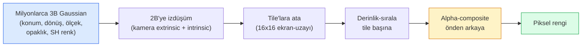

# 3D Gaussian Splatting Sıfırdan

> Bir sahne, milyonlarca 3 boyutlu Gaussian bulutudur. Her birinin konumu, yönelimi, ölçeği, opaklığı ve bakış yönüne bağlı bir rengi vardır. Bunları rasterize edin, rasterizasyon üzerinden geri yayılım yapın, işte bu kadar.

**Tür:** Build
**Diller:** Python
**Ön Koşullar:** Phase 4 Ders 13 (3D Vision & NeRF), Phase 1 Ders 12 (Tensor Operations), Phase 4 Ders 10 (Diffusion basics opsiyonel)
**Süre:** ~90 dakika

## Öğrenme Hedefleri

- 3D Gaussian Splatting'in 2026'da NeRF'i neden fotogerçekçi 3B rekonstrüksiyonda üretim varsayılanı olarak değiştirdiğini açıklamak
- Altı adet Gauss parametresini (konum, rotasyon kuaterniyonu, ölçek, opaklık, küresel harmonik katsayıları, opsiyonel özellik) ve her birinin kaç float katkıda bulunduğunu ifade etmek
- `alpha` compositing kullanarak sıfırdan bir 2B Gaussian splatting rasterizer uygulamak ve 3B durumun aynı döngüye nasıl izdüştüğünü göstermek
- `nerfstudio`, `gsplat` veya `SuperSplat` ile 20-50 fotoğraftan bir sahne rekonstrükte etmek ve `KHR_gaussian_splatting` glTF eklentisine veya OpenUSD 26.03 `UsdVolParticleField3DGaussianSplat` şemasına dışa aktarmak

## Problem

Bir NeRF, sahneyi bir MLP'nin ağırlıkları olarak saklar. Render edilen her piksel, bir ışın boyunca yüzlerce MLP sorgusudur. Eğitim saatler alır, render saniyeler sürer ve ağırlıklar düzenlenemez — sahnedeki bir sandalyeyi taşımak isterseniz, yeniden eğitmek zorunda kalırsınız.

3D Gaussian Splatting (Kerbl, Kopanas, Leimkühler, Drettakis, SIGGRAPH 2023) tüm bunların yerini aldı. Bir sahne, açık bir 3B Gauss kümesidir. Render, GPU rasterizasyonu ile 100+ fps'de gerçekleşir. Eğitim dakikalar alır. Düzenleme doğrudandır: bir Gauss altkümesini öteleyin, sandalyeyi taşımış olursunuz. 2026 itibarıyla Khronos Group, Gaussian splat'lar için bir glTF eklentisini onaylamıştır, OpenUSD 26.03 bir Gaussian splat şeması göndermektedir, Zillow ve Apartments.com gayrimenkulü bunlarla render etmektedir ve 3B rekonstrüksiyon üzerine yeni araştırma makalelerinin çoğu temel 3DGS fikrinin varyantlarıdır.

Zihinsel model basittir; matematik, çoğu tanıtımın rasterizasyondan başlayıp izdüşümleri ve küresel harmonikleri atlamasına yetecek kadar hareketli parçaya sahiptir. Bu ders her şeyi inşa eder — önce 2B versiyonu, sonra 3B genişlemesi.

## Konsept

### Bir Gaussian'ın taşıdıkları

Bir 3B Gaussian, uzayda şu niteliklere sahip parametrik bir bulanıklıktır:

```
position         mu         (3,)    dünya koordinatlarında merkez
rotation         q          (4,)    yönelimi kodlayan birim kuaterniyon
scale            s          (3,)    eksen başına log-ölçekler (render anında üstel)
opacity          alpha      (1,)    sigmoid sonrası opaklık [0, 1]
SH coefficients  c_lm       (3 * (L+1)^2,)   bakışa bağlı renk
```

Dönüş + ölçek, 3x3'lük bir kovaryans oluşturur: `Sigma = R S S^T R^T`. Bu, Gaussian'ın 3B'deki şeklidir. Küresel harmonikler (spherical harmonics), rengin bakış yönüyle değişmesini sağlar — speküler vurgular, ince parlaklık, bakışa bağlı ışıltı — görüş başına doku saklamadan. SH derece 3 ile kanal başına 16 katsayı, sadece renk için Gauss başına 48 float elde edilir.

Bir sahne tipik olarak 1-5 milyon Gaussian içerir. Her biri yaklaşık 60 float (3 + 4 + 3 + 1 + 48 + çeşitli) depolar. Bu, beş milyon Gauss'luk bir sahne için 240 MB'tır — nokta başına doku içeren eşdeğer nokta bulutundan (point cloud) çok daha küçük ve yüksek çözünürlükte yeniden render edilmiş bir NeRF'in MLP ağırlıklarından bir büyüklük sırası daha küçüktür.

### Rasterizasyon, ray marching değil



Beş adım, tamamı GPU dostu. Piksel başına MLP sorgusu yok. Tek bir RTX 3080 Ti, 6 milyon splat'ı 147 fps'de render eder.

### İzdüşüm adımı

Dünya konumu `mu` ve 3B kovaryans `Sigma`'daki 3B Gaussian, ekran konumu `mu'` ve 2B kovaryans `Sigma'` ile bir 2B Gaussian'a izdüşer:

```
mu' = project(mu)
Sigma' = J W Sigma W^T J^T          (2 x 2)

W = görüntü dönüşümü (kameranın rotasyon + translasyonu)
J = mu'deki perspektif izdüşümün Jacobian'ı
```

2B Gaussian'ın ayak izi, eksenleri `Sigma'`nın özvektörleri olan bir elipstir. Bu elipsin içindeki her piksel, Gaussian'ın `exp(-0.5 * (p - mu')^T Sigma'^-1 * (p - mu'))` ile ağırlıklandırılmış katkısını alır.

### Alpha-compositing kuralı

Bir piksel için, onu kaplayan Gaussian'lar arkadan öne (veya eşdeğer olarak önden arkaya ters formülle) sıralanır. Renk, 1980'lerden beri her yarı-saydam rasterizer ile aynı denklemle birleştirilir:

```
C_pixel = sum_i alpha_i * T_i * c_i

T_i = prod_{j < i} (1 - alpha_j)       i'ye kadar geçirgenlik
alpha_i = opacity_i * exp(-0.5 * d^T Sigma'^-1 d)   yerel katkı
c_i = eval_SH(SH_i, view_direction)    bakışa bağlı renk
```

Bu, **NeRF'in volümetrik render'ı (volumetric rendering) ile aynı denklemdir**, sadece bir ışın boyunca yoğun örnekler yerine açık bir seyrek Gauss kümesi üzerinde. Bu özdeşlik, render kalitesinin NeRF ile eşleşmesinin nedenidir — her ikisi de aynı radyans-alanı denklemini entegre eder.

### Bunun neden differentiable (türevlenebilir) olduğu

Her adım — izdüşüm, tile ataması, alpha compositing, SH değerlendirmesi — Gauss parametrelerine göre differentiable'dır. Gerçek bir görüntü verildiğinde, render edilmiş piksel kaybını hesaplayın, rasterizer üzerinden geri yayılım yapın, tüm `(mu, q, s, alpha, c_lm)` parametrelerini gradyan inişiyle güncelleyin. Yaklaşık ~30.000 iterasyonda Gaussian'lar doğru konumlarını, ölçeklerini ve renklerini bulur.

### Yoğunlaştırma ve budama

Sabit bir Gauss kümesi karmaşık bir sahneyi kaplayamaz. Eğitim iki uyarlamalı mekanizma içerir:

- **Clone**: Gradyan büyüklüğü yüksek ama ölçeği küçük olduğunda bir Gaussian'ı mevcut konumunda kopyala — rekonstrüksiyon burada daha fazla detaya ihtiyaç duyar.
- **Split**: Gradyanı yüksek olduğunda büyük ölçekli bir Gaussian'ı iki küçük olana böl — tek bir büyük Gaussian bölgeyi sığdıramayacak kadar yumuşaktır.
- **Prune**: Opaklığı bir eşiğin altına düşen Gaussian'ları sil — katkıda bulunmuyorlardır.

Yoğunlaştırma her N iterasyonda bir çalışır. Bir sahne tipik olarak ~100k başlangıç Gaussian'ından (SfM noktalarından tohumlanır) eğitim sonunda 1-5M'ye büyür.

### Küresel harmonikler tek paragrafta

Bakışa bağlı renk, birim küre üzerinde bir `c(direction)` fonksiyonudur. Küresel harmonikler (spherical harmonics — SH coefficients), kürenin Fourier tabanıdır. `L` derecesinde kesin ve kanal başına `(L+1)^2` temel fonksiyon elde edin. Yeni bir görüş için rengi değerlendirmek, öğrenilmiş SH katsayıları ile bakış yönünde değerlendirilen taban arasında bir nokta çarpımıdır. Derece 0 = bir katsayı = sabit renk. Derece 3 = 16 katsayı = Lambertian gölgeleme, speküler ve hafif yansıma yakalamak için yeterlidir. Standart 3DGS makaleleri varsayılan olarak derece 3 kullanır.

### 2026 üretim yığını

```
1. Yakalama        akıllı telefon / DJI drone / el tarayıcısı
2. SfM / MVS       COLMAP veya GLOMAP kamera pozlarını + seyrek noktaları türetir
3. 3DGS eğitimi    nerfstudio / gsplat / inria official / PostShot (~10-30 dk RTX 4090'da)
4. Düzenleme       SuperSplat / SplatForge (yüzen nesneleri temizle, segmentle)
5. Dışa aktarım    .ply -> glTF KHR_gaussian_splatting veya .usd (OpenUSD 26.03)
6. Görüntüleme     Cesium / Unreal / Babylon.js / Three.js / Vision Pro
```

### 4D ve üretken varyantlar

- **4D Gaussian Splatting** — Gaussian'lar zamanın fonksiyonlarıdır; volümetrik video için kullanılır (Superman 2026, A$AP Rocky'nin "Helicopter"ı).
- **Generative splats** — metinden splat'a modeller (World Labs'dan Marble) tüm sahneleri hayal eder.
- **3D Gaussian Unscented Transform** — NVIDIA NuRec'in otonom sürüş simülasyonu için varyantı.

## Build It

### Adım 1: 2B Gaussian

Önce bir 2B rasterizer oluşturuyoruz. 3B durum, izdüşümden sonra buna indirgenir.

```python
import torch
import torch.nn as nn
import torch.nn.functional as F


def eval_2d_gaussian(means, covs, points):
    """
    means:  (G, 2)      merkezler
    covs:   (G, 2, 2)   kovaryans matrisleri
    points: (H, W, 2)   piksel koordinatları
    returns: (G, H, W)  her Gaussian için her pikseldeki yoğunluk
    """
    G = means.size(0)
    H, W, _ = points.shape
    flat = points.view(-1, 2)
    inv = torch.linalg.inv(covs)
    diff = flat[None, :, :] - means[:, None, :]
    d = torch.einsum("gpi,gij,gpj->gp", diff, inv, diff)
    density = torch.exp(-0.5 * d)
    return density.view(G, H, W)
```
#### Açıklama
`einsum`, `diff^T Sigma^-1 diff` kuadratik formunu her (Gaussian, piksel) çifti için hesaplar.

### Adım 2: 2B splatting rasterizer

Alpha-compositing önden arkaya. 2B'de derinlik anlamsızdır, bu nedenle sıralama için öğrenilmiş Gauss başına skaler kullanırız.

```python
def rasterise_2d(means, covs, colours, opacities, depths, image_size):
    """
    means:     (G, 2)
    covs:      (G, 2, 2)
    colours:   (G, 3)
    opacities: (G,)     [0, 1] aralığında
    depths:    (G,)     sıralama için Gauss başına skaler
    image_size: (H, W)
    returns:   (H, W, 3) render edilmiş görüntü
    """
    H, W = image_size
    yy, xx = torch.meshgrid(
        torch.arange(H, dtype=torch.float32, device=means.device),
        torch.arange(W, dtype=torch.float32, device=means.device),
        indexing="ij",
    )
    points = torch.stack([xx, yy], dim=-1)

    densities = eval_2d_gaussian(means, covs, points)
    alphas = opacities[:, None, None] * densities
    alphas = alphas.clamp(0.0, 0.99)

    order = torch.argsort(depths)
    alphas = alphas[order]
    colours_sorted = colours[order]

    T = torch.ones(H, W, device=means.device)
    out = torch.zeros(H, W, 3, device=means.device)
    for i in range(means.size(0)):
        a = alphas[i]
        out += (T * a)[..., None] * colours_sorted[i][None, None, :]
        T = T * (1.0 - a)
    return out
```
#### Açıklama
Hızlı değil — gerçek bir uygulama tile tabanlı CUDA çekirdekleri kullanır — ancak matematik olarak tamamen doğru ve tamamen differentiable'dır.

### Adım 3: Eğitilebilir bir 2B splat sahnesi

```python
class Splats2D(nn.Module):
    def __init__(self, num_splats=128, image_size=64, seed=0):
        super().__init__()
        g = torch.Generator().manual_seed(seed)
        H, W = image_size, image_size
        self.means = nn.Parameter(torch.rand(num_splats, 2, generator=g) * torch.tensor([W, H]))
        self.log_scale = nn.Parameter(torch.ones(num_splats, 2) * math.log(2.0))
        self.rot = nn.Parameter(torch.zeros(num_splats))  # 2B'de tek açı
        self.colour_logits = nn.Parameter(torch.randn(num_splats, 3, generator=g) * 0.5)
        self.opacity_logit = nn.Parameter(torch.zeros(num_splats))
        self.depth = nn.Parameter(torch.rand(num_splats, generator=g))

    def covs(self):
        s = torch.exp(self.log_scale)
        c, si = torch.cos(self.rot), torch.sin(self.rot)
        R = torch.stack([
            torch.stack([c, -si], dim=-1),
            torch.stack([si, c], dim=-1),
        ], dim=-2)
        S = torch.diag_embed(s ** 2)
        return R @ S @ R.transpose(-1, -2)

    def forward(self, image_size):
        covs = self.covs()
        colours = torch.sigmoid(self.colour_logits)
        opacities = torch.sigmoid(self.opacity_logit)
        return rasterise_2d(self.means, covs, colours, opacities, self.depth, image_size)
```
#### Açıklama
`log_scale`, `opacity_logit` ve `colour_logits` tümü kısıtlanmamış parametrelerdir ve render anında doğru aktivasyonla eşlenir. Bu, her 3DGS uygulamasındaki standart desendir.

### Adım 4: 2B Gaussian'ları hedef bir görüntüye uydurma

```python
import math
import numpy as np

def make_target(size=64):
    yy, xx = np.meshgrid(np.arange(size), np.arange(size), indexing="ij")
    img = np.zeros((size, size, 3), dtype=np.float32)
    # Kırmızı daire
    mask = (xx - 20) ** 2 + (yy - 20) ** 2 < 10 ** 2
    img[mask] = [1.0, 0.2, 0.2]
    # Mavi kare
    mask = (np.abs(xx - 45) < 8) & (np.abs(yy - 40) < 8)
    img[mask] = [0.2, 0.3, 1.0]
    return torch.from_numpy(img)


target = make_target(64)
model = Splats2D(num_splats=64, image_size=64)
opt = torch.optim.Adam(model.parameters(), lr=0.05)

for step in range(200):
    pred = model((64, 64))
    loss = F.mse_loss(pred, target)
    opt.zero_grad(); loss.backward(); opt.step()
    if step % 40 == 0:
        print(f"step {step:3d}  mse {loss.item():.4f}")
```
#### Açıklama
200 adımda 64 Gaussian iki şekle yerleşir. Bütün fikir budur — açık geometrik ilkeller üzerinde gradyan inişi.

### Adım 5: 2B'den 3B'ye

3B genişlemesi aynı döngüyü korur. Eklemeler:

1. Gauss başına dönüş, tek bir açı yerine bir kuaterniyondur.
2. Kovaryans `R S S^T R^T` şeklindedir; `R` kuaterniyondan ve `S = diag(exp(log_scale))` ile oluşturulur.
3. İzdüşüm `(mu, Sigma) -> (mu', Sigma')`, kamera extrinsic'lerini ve `mu`'daki perspektif izdüşümün Jacobian'ını kullanır.
4. Renk, küresel harmonik açılımı haline gelir; bakış yönünde değerlendirin.
5. Derinlik sıralaması, öğrenilmiş bir skaler yerine gerçek kamera-uzayı z'sindendir.

Her üretim uygulaması (`gsplat`, `inria/gaussian-splatting`, `nerfstudio`) tam olarak bunu tile tabanlı CUDA çekirdekleriyle GPU'da yapar.

### Adım 6: Küresel harmonik değerlendirmesi

Derece 3'e kadar SH tabanı, kanal başına 16 terime sahiptir. Değerlendirme:

```python
def eval_sh_degree_3(sh_coeffs, dirs):
    """
    sh_coeffs: (..., 16, 3)   son boyut RGB kanalları
    dirs:      (..., 3)       birim vektörler
    returns:   (..., 3)
    """
    C0 = 0.282094791773878
    C1 = 0.488602511902920
    C2 = [1.092548430592079, 1.092548430592079,
          0.315391565252520, 1.092548430592079,
          0.546274215296039]
    x, y, z = dirs[..., 0], dirs[..., 1], dirs[..., 2]
    x2, y2, z2 = x * x, y * y, z * z
    xy, yz, xz = x * y, y * z, x * z

    result = C0 * sh_coeffs[..., 0, :]
    result = result - C1 * y[..., None] * sh_coeffs[..., 1, :]
    result = result + C1 * z[..., None] * sh_coeffs[..., 2, :]
    result = result - C1 * x[..., None] * sh_coeffs[..., 3, :]

    result = result + C2[0] * xy[..., None] * sh_coeffs[..., 4, :]
    result = result + C2[1] * yz[..., None] * sh_coeffs[..., 5, :]
    result = result + C2[2] * (2.0 * z2 - x2 - y2)[..., None] * sh_coeffs[..., 6, :]
    result = result + C2[3] * xz[..., None] * sh_coeffs[..., 7, :]
    result = result + C2[4] * (x2 - y2)[..., None] * sh_coeffs[..., 8, :]

    # derece 3 terimleri kısalık için burada atlanmıştır; tam 16-katsayılı versiyon kod dosyasında
    return result
```
#### Açıklama
Öğrenilen `sh_coeffs`, o Gaussian için "her yöndeki rengi" saklar. Render anında mevcut bakış yönüne karşı değerlendirilir ve bir 3-vektörlü RGB elde edilir.

## Use It

Gerçek 3DGS çalışmaları için `gsplat` (Meta) veya `nerfstudio` kullanın:

```bash
pip install nerfstudio gsplat
ns-download-data example
ns-train splatfacto --data path/to/data
```
#### Açıklama
`splatfacto`, nerfstudio'nun 3DGS eğiticisidir. Tipik bir sahne için RTX 4090'da 10-30 dakika sürer.

2026'da önemli dışa aktarım seçenekleri:

- `.ply` — ham Gaussian bulutu (taşınabilir, en büyük dosya).
- `.splat` — PlayCanvas / SuperSplat nicelenmiş formatı.
- glTF `KHR_gaussian_splatting` — Khronos standardı, görüntüleyiciler arasında taşınabilir (Şubat 2026 RC).
- OpenUSD `UsdVolParticleField3DGaussianSplat` — USD-native, NVIDIA Omniverse ve Vision Pro hatları için.

4D / dinamik sahneler için `4DGS` ve `Deformable-3DGS`, zamanla değişen araçlar ve opaklıklarla aynı mekanizmayı genişletir.

## Ship It

Bu ders şunları üretir:

- `outputs/prompt-3dgs-capture-planner.md` — belirli bir sahne türü için bir yakalama oturumu planlayan bir prompt (fotoğraf sayısı, kamera yolu, aydınlatma).
- `outputs/skill-3dgs-export-router.md` — verilen downstream görüntüleyici veya motor için doğru dışa aktarım formatını (`.ply` / `.splat` / glTF / USD) seçen bir skill.

## Alıştırmalar

1. **(Kolay)** 2B splat eğiticisini farklı bir sentetik görüntüde çalıştırın. `num_splats` değerini `[16, 64, 256]` arasında değiştirin ve her biri için MSE'yi adıma karşı çizin. Azalan getiri noktasını belirleyin.
2. **(Orta)** 2B rasterizer'ı, Gauss başına RGB renklerin bir skaler "görüş açısına" derece-2 harmonik aracılığıyla bağlı olmasını destekleyecek şekilde genişletin. Bir çift hedef görüntü üzerinde eğitin ve modelin her ikisini de yeniden yapılandırdığını doğrulayın.
3. **(Zor)** `nerfstudio`'yu klonlayın ve sahip olduğunuz herhangi bir sahnenin (masa, bitki, yüz, oda) 20 fotoğraflık yakalamasında `splatfacto` eğitin. glTF `KHR_gaussian_splatting`'e dışa aktarın ve bir görüntüleyicide (Three.js `GaussianSplats3D`, SuperSplat, Babylon.js V9) açın. Eğitim süresini, Gauss sayısını ve render fps'sini raporlayın.

## Anahtar Terimler

| Terim | İnsanların söylediği | Gerçekte anlamı |
|-------|---------------------|-----------------|
| 3DGS | "Gaussian splat'lar" | Milyonlarca 3B Gaussian olarak açık sahne temsili; Gauss başına konum, dönüş, ölçek, opaklık, SH rengi |
| Covariance (kovaryans) | "Gaussian'ın şekli" | `Sigma = R S S^T R^T`; bir Gaussian'ın yönelimi ve anizotropik ölçeği |
| Alpha compositing | "Arkadan öne karıştırma" | NeRF'in volümetrik render'ı ile aynı denklem, şimdi açık seyrek bir küme üzerinde |
| Densification (yoğunlaştırma) | "Klonla ve böl" | Rekonstrüksiyonun yetersiz kaldığı yerde yeni Gaussian'ların uyarlamalı eklenmesi |
| Pruning (budama) | "Düşük opaklığı sil" | Eğitim sırasında sıfıra yakın opaklığa çöken Gaussian'ları kaldırma |
| Spherical harmonics (küresel harmonikler) | "Bakışa bağlı renk" | Küre üzerinde Fourier tabanı; rengi bakış yönünün fonksiyonu olarak saklar |
| Splatfacto | "nerfstudio'nun 3DGS'si" | 2026'da 3DGS eğitmek için en kolay yol |
| `KHR_gaussian_splatting` | "glTF standardı" | 3DGS'yi görüntüleyiciler ve motorlar arasında taşınabilir yapan Khronos 2026 eklentisi |

## İleri Okumalar

- [3D Gaussian Splatting for Real-Time Radiance Field Rendering (Kerbl et al., SIGGRAPH 2023)](https://repo-sam.inria.fr/fungraph/3d-gaussian-splatting/) — orijinal makale
- [gsplat (Meta/nerfstudio)](https://github.com/nerfstudio-project/gsplat) — üretim kalitesinde CUDA rasterizer
- [nerfstudio Splatfacto](https://docs.nerf.studio/nerfology/methods/splat.html) — referans eğitim tarifi
- [Khronos KHR_gaussian_splatting extension](https://github.com/KhronosGroup/glTF/blob/main/extensions/2.0/Khronos/KHR_gaussian_splatting/README.md) — 2026 taşınabilir format
- [OpenUSD 26.03 release notes](https://openusd.org/release/) — `UsdVolParticleField3DGaussianSplat` şeması
- [THE FUTURE 3D State of Gaussian Splatting 2026](https://www.thefuture3d.com/blog-0/2026/4/4/state-of-gaussian-splatting-2026) — endüstriye genel bakış
