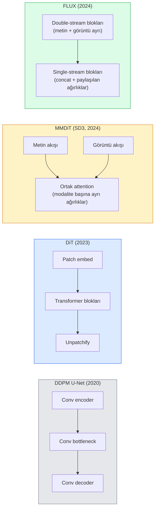

# Diffusion Transformers & Rectified Flow

> U-Net, difüzyonun sırrı değildir. Onu bir transformer ile değiştirin, gürültü programını düz bir çizgi akışıyla takas edin ve birdenbire SD3, FLUX ve 2026'nın her metin-görüntü modeline sahip olursunuz.

**Tür:** Learn + Build
**Diller:** Python
**Ön Koşullar:** Phase 4 Ders 10 (Diffusion DDPM), Phase 4 Ders 14 (ViT), Phase 7 Ders 02 (Self-Attention)
**Süre:** ~75 dakika

## Öğrenme Hedefleri

- U-Net DDPM'den (Ders 10) Diffusion Transformer (DiT), MMDiT (SD3) ve single+double-stream DiT'ye (FLUX) evrimi izlemek
- Rectified flow'u açıklamak: gürültü ve veri arasında düz bir çizgi yörüngesinin (trajectory) modellerin 1000 adım yerine 20 adımda örnekleme yapmasını neden sağladığı
- Küçük bir DiT bloğu ve bir rectified flow eğitim döngüsü uygulamak, her ikisi de 100 satırın altında
- Model varyantlarını (SD3, FLUX.1-dev, FLUX.1-schnell, Z-Image, Qwen-Image) mimari, parametre sayısı ve lisanslama açısından ayırt etmek

## Problem

Ders 10, bir U-Net gürültü giderici ile bir DDPM inşa etti. Bu tarif 2020-2023'e hakim oldu: U-Net + beta programı + gürültü-tahmin kaybı. Stable Diffusion 1.5 ve 2.1 ile DALL-E 2'yi üretti.

2026'daki her son teknoloji metin-görüntü modeli bunun ötesine geçmiştir. Stable Diffusion 3, FLUX, SD4, Z-Image, Qwen-Image, Hunyuan-Image — hiçbiri U-Net kullanmaz. Diffusion Transformers (DiT) kullanırlar. SD3 ve FLUX ayrıca DDPM gürültü programını rectified flow ile değiştirir; bu, gürültüden veriye giden yolu düzleştirir ve consistency veya distilled varyantlarla 1-4 adımlı çıkarımı mümkün kılar.

Bu değişim önemlidir çünkü difüzyon tabanlı görüntü üretiminin kontrol edilebilir, prompt-hassas (SD3/SD4 metin render'ını çözdü) ve üretim-hızlı hale gelmesinin nedenidir. DiT + rectified flow'u anlamak, 2026 üretken-görüntü yığınını anlamaktır.

## Konsept

### U-Net'ten transformer'a



- **DiT** (Peebles & Xie, 2023) — U-Net'i, latent patch'ler üzerinde ViT benzeri bir transformer ile değiştirin. Koşullandırma, adaptive layer norm (AdaLN) aracılığıyla.
- **MMDiT** (SD3, Esser ve ark., 2024) — ortak bir attention'ı paylaşan metin ve görüntü token'ları için ayrı ağırlıklara sahip iki akış.
- **FLUX** (Black Forest Labs, 2024) — ilk N blok SD3 gibi çift akışlı, sonraki bloklar daha yüksek derinlikte verimlilik için birleştirir ve ağırlıkları paylaşır (single-stream).
- **Z-Image** (2025) — 6B parametrede "her ne pahasına ölçeklendirme"ye meydan okuyan verimli bir single-stream DiT.

### Rectified flow tek paragrafta

DDPM, ileri süreci `x_t`'nin giderek daha fazla bozulduğu gürültülü bir SDE olarak tanımlar. Öğrenilen ters süreç, 1000 küçük adımda çözülen ikinci bir SDE'dir.

Rectified flow, temiz veri ile saf gürültü arasında **düz bir çizgi** interpolasyonu tanımlar:

```
x_t = (1 - t) * x_0 + t * epsilon,     t in [0, 1]
```

Ağı, hızı (velocity field) `v_theta(x_t, t) = epsilon - x_0` — temiz veriden gürültüye doğru düz çizgi yolu boyunca ileri yön (`dx_t/dt`) — tahmin edecek şekilde eğitin. Örnekleme sırasında, bu hızı gürültüden veriye doğru geriye doğru adım atmak için entegre edersiniz. Ortaya çıkan ODE düz bir çizgiye çok daha yakındır, bu nedenle örneklemek için çok daha az entegrasyon adımı gerekir.

SD3 buna **Rectified Flow Matching** adını verir. FLUX, Z-Image ve 2026 modellerinin çoğu aynı hedefi kullanır. Tipik çıkarım: 20-30 Euler adımı (deterministik), eski DDPM rejimindeki 50+ DDIM adımına karşı. Distilled / turbo / schnell / LCM varyantları bunu 1-4 adıma indirir.

### AdaLN koşullandırması

DiT'ler, zaman adımı ve sınıf/metin koşullandırmasını **adaptive layer norm** aracılığıyla yapar: koşullandırma vektöründen `scale` ve `shift` tahmin edin ve bunları LayerNorm'dan sonra uygulayın. U-Net'lerdeki FiLM tarzı modülasyondan çok daha temizdir ve her modern DiT'de varsayılandır.

```
cond -> MLP -> (scale, shift, gate)
norm(x) * (1 + scale) + shift, then residual add * gate
```

### SD3 ve FLUX'ta metin kodlayıcıları

- **SD3** üç metin kodlayıcısı kullanır: iki CLIP modeli + T5-XXL. Gömmeler birleştirilir ve metin koşullandırması olarak görüntü akışına beslenir.
- **FLUX** bir CLIP-L + T5-XXL kullanır.
- **Qwen-Image / Z-Image** varyantları, temel LLM'leriyle uyumlu kendi kurumsal metin kodlayıcılarını kullanır.

Metin kodlayıcısı, SD3/FLUX'un SD1.5'ten prompt'lar hakkında çok daha iyi akıl yürütmesinin büyük bir nedenidir. T5-XXL tek başına 4.7B parametredir.

### Classifier-free guidance hâlâ geçerli

Rectified flow, örnekleyiciyi değiştirir, koşullandırmayı değil. Classifier-free guidance (CFG — eğitim sırasında metni %10 olasılıkla düşürme, çıkarımda koşullu ve koşulsuz tahminleri karıştırma) rectified flow ile aynı şekilde çalışır. 2026 modellerinin çoğu 3.5-5 rehberlik ölçeği kullanır — SD1.5'in 7.5'inden daha düşüktür çünkü rectified-flow modelleri prompt'ları varsayılan olarak daha sıkı takip eder.

### Consistency, Turbo, Schnell, LCM

Aynı fikir için dört isim: yavaş çok-adımlı bir modeli hızlı az-adımlı bir modele damıtmak.

- **LCM (Latent Consistency Model)** — herhangi bir ara `x_t`'den son `x_0`'ı tek adımda tahmin eden bir öğrenci eğitir.
- **SDXL Turbo / FLUX schnell** — çekişmeli difüzyon damıtma ile eğitilmiş 1-4 adımlı modeller.
- **SD Turbo** — OpenAI tarzı Consistency Models'in latent difüzyona uyarlanmış hali.

Herhangi bir yeni modelin üretim sunumu, hem "tam kalite" kontrol noktası hem de "turbo / schnell" varyantı gönderir. Schnell ("hızlı" Almanca, Black Forest Labs geleneği) 1-4 adımda çalışır ve gerçek zamanlı hatlara uyar.

### 2026'da model manzarası

| Model | Boyut | Mimari | Lisans |
|-------|-------|--------|--------|
| Stable Diffusion 3 Medium | 2B | MMDiT | SAI Community |
| Stable Diffusion 3.5 Large | 8B | MMDiT | SAI Community |
| FLUX.1-dev | 12B | Double + Single Stream DiT | ticari olmayan |
| FLUX.1-schnell | 12B | aynı, distilled | Apache 2.0 |
| FLUX.2 | — | FLUX.1'in tekrarı | karma |
| Z-Image | 6B | S3-DiT (Ölçeklenebilir Tek Akış) | izin verici |
| Qwen-Image | ~20B | DiT + Qwen metin kulesi | Apache 2.0 |
| Hunyuan-Image-3.0 | ~80B | DiT | araştırma |
| SD4 Turbo | 3B | DiT + distillation | SAI Commercial |

FLUX.1-schnell, 2026 açık kaynak varsayılanıdır. Z-Image, verimlilik lideridir. FLUX.2 ve SD4, mevcut kalite zirveleridir.

### Bu faz değişimi neden önemli

DDPM + U-Net işe yaradı. DiT + rectified flow **daha iyi, daha hızlı ve daha temiz ölçekleniyor**. Geçiş, NLP'de RNN'lerden transformerlara geçişe paraleldir: her iki mimari de aynı sorunu çözdü, ancak transformerlarlar ölçeklendi ve şimdi hakim durumda. 2026'daki görüntü, video veya 3B üretimiyle ilgili her makale, DiT şeklinde bir gürültü giderici ve genellikle bir rectified flow hedefi kullanır. U-Net DDPM artık esas olarak pedagojiktir (Ders 10).

## Build It

### Adım 1: AdaLN ile bir DiT bloğu

```python
import torch
import torch.nn as nn


class AdaLNZero(nn.Module):
    """
    Bir kapı ile Uyarlamalı LayerNorm. Koşullandırmadan (scale, shift, gate) tahmin eder.
    Tüm blok kimlik olarak başlayacak şekilde başlatılır ("sıfır başlatma").
    """

    def __init__(self, dim, cond_dim):
        super().__init__()
        self.norm = nn.LayerNorm(dim, elementwise_affine=False)
        self.mlp = nn.Linear(cond_dim, dim * 3)
        nn.init.zeros_(self.mlp.weight)
        nn.init.zeros_(self.mlp.bias)

    def forward(self, x, cond):
        scale, shift, gate = self.mlp(cond).chunk(3, dim=-1)
        h = self.norm(x) * (1 + scale.unsqueeze(1)) + shift.unsqueeze(1)
        return h, gate.unsqueeze(1)


class DiTBlock(nn.Module):
    def __init__(self, dim=192, heads=3, mlp_ratio=4, cond_dim=192):
        super().__init__()
        self.adaln1 = AdaLNZero(dim, cond_dim)
        self.attn = nn.MultiheadAttention(dim, heads, batch_first=True)
        self.adaln2 = AdaLNZero(dim, cond_dim)
        self.mlp = nn.Sequential(
            nn.Linear(dim, dim * mlp_ratio),
            nn.GELU(),
            nn.Linear(dim * mlp_ratio, dim),
        )

    def forward(self, x, cond):
        h, gate1 = self.adaln1(x, cond)
        a, _ = self.attn(h, h, h, need_weights=False)
        x = x + gate1 * a
        h, gate2 = self.adaln2(x, cond)
        x = x + gate2 * self.mlp(h)
        return x
```
#### Açıklama
`AdaLNZero`, MLP ağırlıkları sıfıra başlatıldığı için bir kimlik eşlemesi olarak başlar. Eğitim, bloğu kimlikten uzaklaştırır; bu, derin transformer difüzyon modellerini önemli ölçüde dengeler.

### Adım 2: Küçük bir DiT

```python
def timestep_embedding(t, dim):
    import math
    half = dim // 2
    freqs = torch.exp(-math.log(10000) * torch.arange(half, device=t.device) / half)
    args = t[:, None].float() * freqs[None]
    return torch.cat([args.sin(), args.cos()], dim=-1)


class TinyDiT(nn.Module):
    def __init__(self, image_size=16, patch_size=2, in_channels=3, dim=96, depth=4, heads=3):
        super().__init__()
        self.patch_size = patch_size
        self.num_patches = (image_size // patch_size) ** 2
        self.patch = nn.Conv2d(in_channels, dim, kernel_size=patch_size, stride=patch_size)
        self.pos = nn.Parameter(torch.zeros(1, self.num_patches, dim))
        self.time_mlp = nn.Sequential(
            nn.Linear(dim, dim * 2),
            nn.SiLU(),
            nn.Linear(dim * 2, dim),
        )
        self.blocks = nn.ModuleList([DiTBlock(dim, heads, cond_dim=dim) for _ in range(depth)])
        self.norm_out = nn.LayerNorm(dim, elementwise_affine=False)
        self.head = nn.Linear(dim, patch_size * patch_size * in_channels)

    def forward(self, x, t):
        n = x.size(0)
        x = self.patch(x)
        x = x.flatten(2).transpose(1, 2) + self.pos
        t_emb = self.time_mlp(timestep_embedding(t, self.pos.size(-1)))
        for blk in self.blocks:
            x = blk(x, t_emb)
        x = self.norm_out(x)
        x = self.head(x)
        return self._unpatchify(x, n)

    def _unpatchify(self, x, n):
        p = self.patch_size
        h = w = int(self.num_patches ** 0.5)
        x = x.view(n, h, w, p, p, -1).permute(0, 5, 1, 3, 2, 4).reshape(n, -1, h * p, w * p)
        return x
```
#### Açıklama
TinyDiT, görüntüyü patch'lere ayırır, konum kodlaması ekler, transformer bloklarından geçirir ve tekrar bir görüntüye birleştirir. Zaman koşullandırması AdaLN aracılığıyla enjekte edilir.

### Adım 3: Rectified flow eğitimi

```python
import torch.nn.functional as F

def rectified_flow_train_step(model, x0, optimizer, device):
    model.train()
    x0 = x0.to(device)
    n = x0.size(0)
    t = torch.rand(n, device=device)
    epsilon = torch.randn_like(x0)
    x_t = (1 - t[:, None, None, None]) * x0 + t[:, None, None, None] * epsilon

    target_velocity = epsilon - x0
    pred_velocity = model(x_t, t)

    loss = F.mse_loss(pred_velocity, target_velocity)
    optimizer.zero_grad()
    loss.backward()
    optimizer.step()
    return loss.item()
```
#### Açıklama
DDPM'in gürültü-tahmin kaybıyla (Ders 10) karşılaştırın: aynı yapı, farklı hedef. Gürültü `epsilon`'u tahmin etmek yerine, düz çizgi interpolasyonu boyunca veriden gürültüye işaret eden **velocity** `epsilon - x_0`'ı tahmin ederiz.

### Adım 4: Euler örnekleyici

Rectified flow bir ODE'dir. Euler yöntemi en basitidir ve iyi eğitilmiş bir rectified-flow modeli için 20+ adımda yüksek mertebeden çözücüler kadar hassastır.

```python
@torch.no_grad()
def rectified_flow_sample(model, shape, steps=20, device="cpu"):
    model.eval()
    x = torch.randn(shape, device=device)
    dt = 1.0 / steps
    t = torch.ones(shape[0], device=device)
    for _ in range(steps):
        v = model(x, t)
        x = x - dt * v
        t = t - dt
    return x
```
#### Açıklama
20 adım. Eğitilmiş bir modelde bu, 1000 adımlı DDPM ile karşılaştırılabilir örnekler üretir.

### Adım 5: Uçtan uca smoke test

```python
import numpy as np

def synthetic_blobs(num=200, size=16, seed=0):
    rng = np.random.default_rng(seed)
    out = np.zeros((num, 3, size, size), dtype=np.float32)
    yy, xx = np.meshgrid(np.arange(size), np.arange(size), indexing="ij")
    for i in range(num):
        cx, cy = rng.uniform(4, size - 4, size=2)
        r = rng.uniform(2, 4)
        mask = (xx - cx) ** 2 + (yy - cy) ** 2 < r ** 2
        colour = rng.uniform(-1, 1, size=3)
        for c in range(3):
            out[i, c][mask] = colour[c]
    return torch.from_numpy(out)
```
#### Açıklama
Bunun üzerinde rectified flow ile bir `TinyDiT` eğitin. 500 adımdan sonra, örneklenen çıktılar soluk renk lekeleri gibi görünmelidir.

## Use It

FLUX / SD3 / Z-Image ile gerçek görüntü üretimi için `diffusers` her birini birleşik bir API ile sunar:

```python
from diffusers import FluxPipeline, StableDiffusion3Pipeline
import torch

pipe = FluxPipeline.from_pretrained(
    "black-forest-labs/FLUX.1-schnell",
    torch_dtype=torch.bfloat16,
).to("cuda")

out = pipe(
    prompt="a golden retriever surfing a tsunami, hyperrealistic, studio lighting",
    guidance_scale=0.0,           # schnell CFG olmadan eğitildi
    num_inference_steps=4,
    max_sequence_length=256,
).images[0]
out.save("surf.png")
```
#### Açıklama
Üç satır. `FLUX.1-schnell` dört adımda. Daha yüksek kalite için model kimliğini `black-forest-labs/FLUX.1-dev` ile değiştirin (CFG ile 20-30 adım).

SD3 için:

```python
pipe = StableDiffusion3Pipeline.from_pretrained(
    "stabilityai/stable-diffusion-3.5-large",
    torch_dtype=torch.bfloat16,
).to("cuda")
out = pipe(prompt, guidance_scale=3.5, num_inference_steps=28).images[0]
```
#### Açıklama
SD3.5-Large, 28 adımda yüksek kaliteli üretim için 8B parametreli MMDiT modelidir.

## Ship It

Bu ders şunları üretir:

- `outputs/prompt-dit-model-picker.md` — kalite, gecikme ve lisans kısıtlamalarına göre SD3, FLUX.1-dev, FLUX.1-schnell, Z-Image, SD4 Turbo arasından seçim yapar.
- `outputs/skill-rectified-flow-trainer.md` — AdaLN DiT ve Euler örnekleme ile rectified flow için tam bir eğitim döngüsü yazar.

## Alıştırmalar

1. **(Kolay)** TinyDiT'yi yukarıdaki sentetik blob veri kümesinde 500 adım eğitin. 10, 20 ve 50 Euler adımıyla üretilen örnekleri karşılaştırın.
2. **(Orta)** Zaman gömme işlemine öğrenilmiş bir sınıf gömme ekleyerek (renge göre 10 blob "sınıfı") metin koşullandırması ekleyin. Sınıf 0, 5 ve 9 ile örnekleyin ve renklerin eşleştiğini doğrulayın.
3. **(Zor)** Aynı boyuttaki ağın rectified-flow ve DDPM versiyonlarından aynı veride aynı sayıda adım eğitilmiş olarak üretilen örnekler arasında Fréchet mesafesini (FID proxy) hesaplayın. Hangisinin daha hızlı yakınsadığını raporlayın.

## Anahtar Terimler

| Terim | İnsanların söylediği | Gerçekte anlamı |
|-------|---------------------|-----------------|
| DiT | "Diffusion transformer" | Difüzyon gürültü giderici olarak U-Net'in yerini alan transformer; patch'lenmiş latent'ler üzerinde çalışır |
| AdaLN | "Adaptive layer norm" | LayerNorm sonrası uygulanan öğrenilmiş scale, shift, gate aracılığıyla zaman adımı/metin koşullandırması |
| MMDiT | "Multi-modal DiT (SD3)" | Ortak bir self-attention paylaşan metin ve görüntü token'ları için ayrı ağırlık akışları |
| Single-stream / double-stream | "FLUX taktiği" | İlk N blok çift akışlı (modalite başına ayrı ağırlıklar), sonraki bloklar tek akışlı (concat + paylaşılan ağırlıklar) |
| Rectified flow | "Düz çizgi gürültüden-veriye" | Veri ve gürültü arasında doğrusal interpolasyon; ağ hızı tahmin eder; çıkarımda daha az ODE adımı gerekir |
| Velocity target | "epsilon - x_0" | Rectified flow'ta regresyon hedefi; temiz veriden gürültüye işaret eder |
| CFG guidance | "classifier-free guidance" | Koşullu ve koşulsuz tahminleri karıştırma; rectified-flow modellerinde hâlâ kullanılır |
| Schnell / turbo / LCM | "1-4 adım damıtma" | Tam kaliteli modellerden damıtılmış az-adımlı varyantlar; üretim gerçek zamanlı |

## İleri Okumalar

- [Scalable Diffusion Models with Transformers (Peebles & Xie, 2023)](https://arxiv.org/abs/2212.09748) — DiT makalesi
- [Scaling Rectified Flow Transformers (Esser et al., SD3 paper)](https://arxiv.org/abs/2403.03206) — ölçekte MMDiT ve rectified-flow
- [FLUX.1 model card and technical report (Black Forest Labs)](https://huggingface.co/black-forest-labs/FLUX.1-dev) — double + single-stream detayları
- [Z-Image: Efficient Image Generation Foundation Model (2025)](https://arxiv.org/html/2511.22699v1) — 6B'de single-stream DiT
- [Elucidating the Design Space of Diffusion (Karras et al., 2022)](https://arxiv.org/abs/2206.00364) — her difüzyon tasarım takası için referans
- [Latent Consistency Models (Luo et al., 2023)](https://arxiv.org/abs/2310.04378) — LCM-LoRA'nın size 4 adımlı çıkarımı nasıl verdiği
