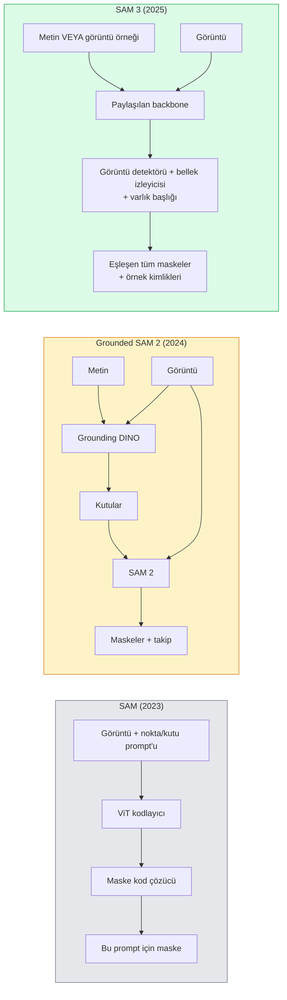

# SAM 3 & Açık-Kelime Dağarcıklı Segmentasyon

> Bir modele bir metin prompt'u ve bir görüntü verin, eşleşen her nesne için maskeler alın. SAM 3 bunu tek bir ileri geçiş yaptı.

**Tür:** Use + Build
**Diller:** Python
**Ön Koşullar:** Phase 4 Ders 07 (U-Net), Phase 4 Ders 08 (Mask R-CNN), Phase 4 Ders 18 (CLIP)
**Süre:** ~60 dakika

## Öğrenme Hedefleri

- SAM (yalnızca görsel prompt'lar), Grounded SAM / SAM 2 (detektör + SAM) ve SAM 3'ü (Promptable Concept Segmentation aracılığıyla yerel metin prompt'ları) ayırt etmek
- SAM 3 mimarisini açıklamak: paylaşılan backbone + görüntü detektörü + bellek tabanlı video izleyici + varlık başlığı + ayrıştırılmış detektör-izleyici tasarımı
- Hugging Face `transformers` SAM 3 entegrasyonunu metin-prompt'lu tespit, segmentasyon ve video takibi için kullanmak
- Gecikme, konsept karmaşıklığı ve dağıtım hedefine göre SAM 3, Grounded SAM 2, YOLO-World ve SAM-MI arasında seçim yapmak

## Problem

2023 SAM, yalnızca görsel-prompt'lu bir modeldi: bir noktaya tıklar veya bir kutu çizerdiniz, o da bir maske döndürürdü. "Bu fotoğraftaki tüm portakalları ver" için bir dedektöre (Grounding DINO) kutular üretmesi, ardından her birini segmentlemek için SAM'e ihtiyacınız vardı. Grounded SAM bunu bir hattı dönüştürdü, ancak kaçınılmaz hata birikimi olan iki donmuş modelin kaskadıydı.

SAM 3 (Meta, Kasım 2025, ICLR 2026) kaskadı çökertti. Kısa bir noun phrase veya bir görüntü örneğini prompt olarak kabul eder ve tek bir ileri geçişte eşleşen tüm maskeleri ve örnek kimliklerini döndürür. Buna **Promptable Concept Segmentation (PCS)** denir. Mart 2026 Object Multiplex güncellemesiyle (SAM 3.1), aynı konseptin birden fazla örneğini video boyunca verimli bir şekilde takip eder.

Bu ders, bunun temsil ettiği yapısal değişimle ilgilidir. 2B seg, tespit ve metin-görüntü grounding'i tek bir modelde birleşmiştir. Üretim sorusu artık "hangi hattı birbirine bağlamalıyım" değil, "hangi promptlanabilir model kullanım durumumu uçtan uca halleder."

## Konsept

### Üç nesil



### Promptable Concept Segmentation

Bir "konsept prompt'u", kısa bir noun phrase (`"sarı okul otobüsü"`, `"çizgili kırmızı şemsiye"`, `"fincan tutan el"`) veya bir görüntü örneğidir. Model, görüntüdeki konseptle eşleşen her örnek için segmentasyon maskeleri ve eşleşme başına benzersiz bir örnek kimliği döndürür.

Bu, klasik görsel-prompt'lu SAM'den üç şekilde ayrılır:

1. Örnek başına prompt'lama gerekmez — bir metin prompt'u tüm eşleşmeleri döndürür.
2. Açık kelime dağarcıklı (open-vocabulary) — konsept, doğal dilde tanımlanabilen herhangi bir şey olabilir.
3. Prompt başına bir maske yerine aynı anda birden fazla örnek döndürür.

### Ana mimari parçalar

- **Paylaşılan backbone** — tek bir ViT görüntüyü işler. Hem detektör başlığı hem de bellek tabanlı izleyici bundan okur.
- **Varlık başlığı (presence head)** — konseptin görüntüde bulunup bulunmadığını tahmin eder. "Bu burada mı?" sorusunu "Nerede?" sorusundan ayırır. Olmayan konseptlerde yanlış pozitifleri azaltır.
- **Ayrıştırılmış detektör-izleyici** — görüntü düzeyinde tespit ve video düzeyinde takibin ayrı başlıkları vardır, böylece birbirlerine karışmazlar.
- **Bellek bankası** — video takibi için örnek başına özellikleri kareler arasında saklar (SAM 2'nin kullandığı aynı mekanizma).

### Ölçekte eğitim

SAM 3, yapay zeka + insan incelemesi kullanarak yinelemeli olarak açıklama ve düzeltme yapan bir veri motoru tarafından oluşturulan **4 milyon benzersiz konsept** üzerinde eğitildi. Yeni **SA-CO** kıyaslaması, önceki kıyaslamalardan 50x daha büyük olan 270K benzersiz konsept içerir. SAM 3, SA-CO'da insan performansının %75-80'ine ulaşır ve görüntü + video PCS'de mevcut sistemleri ikiye katlar.

### SAM 3.1 Object Multiplex

Mart 2026 güncellemesi: **Object Multiplex**, aynı konseptin birçok örneğinin aynı anda ortak takibi için bir paylaşımlı bellek mekanizması sunar. Daha önce, N örneği takip etmek N ayrı bellek bankası anlamına geliyordu. Multiplex, bunu örnek başına sorgularla tek bir paylaşımlı belleğe daraltır. Sonuç: doğruluktan ödün vermeden önemli ölçüde daha hızlı çoklu-nesne takibi.

### Grounded SAM'in 2026'da hâlâ önemli olduğu yerler

- Belirli bir açık kelime dağarcıklı dedektörün takılması gerektiğinde (DINO-X, Florence-2).
- SAM 3 lisansı (HF'de kapılı) engel olduğunda.
- SAM 3'ün gösterdiğinden daha fazla detektör eşiği kontrolüne ihtiyaç duyulduğunda.
- Detektör bileşeni üzerinde araştırma / ablasyon çalışması için.

Modüler hatların hâlâ bir yeri vardır. Çoğu üretim çalışması için SAM 3 daha basit cevaptır.

### YOLO-World vs SAM 3

- **YOLO-World** — yalnızca açık kelime dağarcıklı dedektör (maske yok). Gerçek zamanlı. Yüksek fps'de kutular gerektiğinde en iyisi.
- **SAM 3** — tam segmentasyon + takip. Daha yavaş ama daha zengin çıktı.

Üretim ayrımı: YOLO-World hızlı deteksiyon-only hatları için (robotik navigasyon, hızlı panolar), SAM 3 maskeler veya takip gerektiren her şey için.

### SAM-MI verimliliği

SAM-MI (2025-2026), SAM'in kod çözücü darboğazını ele alır. Anahtar fikirler:

- **Seyrek nokta prompt'lama** — yoğun prompt'lar yerine birkaç iyi seçilmiş nokta kullanır; kod çözücü çağrılarını %96 azaltır.
- **Sığ maske birleştirme** — kaba maske tahminlerini tek bir keskin maskede birleştirir.
- **Ayrıştırılmış maske enjeksiyonu** — kod çözücü, yeniden çalıştırmak yerine önceden hesaplanmış maske özelliklerini alır.

Sonuç: açık kelime dağarcıklı kıyaslamalarda Grounded-SAM'a göre ~1.6× hızlanma.

### Üç model için çıktı formatı

Hepsi aynı genel yapıyı döndürür (kutular + etiketler + skorlar + maskeler + kimlikler) — bu yardımcıdır çünkü aşağı akış hattınızın hangi modelin çalıştığına göre dallanması gerekmez.

## Build It

### Adım 1: Prompt oluşturma

Kullanıcı cümlesini bir SAM 3 konsept prompt'ları listesine dönüştüren bir yardımcı oluşturun. Bu, "kullanıcının yazdığı" ile "modelin tükettiği" arasındaki sınırdır.

```python
def split_concepts(sentence):
    """
    Çoklu-konsept prompt'ları için sezgisel ayırıcı.
    Kısa isim tamlamaları listesi döndürür.
    """
    for sep in [",", ";", "and", "or", "&"]:
        if sep in sentence:
            parts = [p.strip() for p in sentence.replace("and ", ",").split(",")]
            return [p for p in parts if p]
    return [sentence.strip()]

print(split_concepts("cats, dogs and balloons"))
```
#### Açıklama
SAM 3, ileri geçiş başına bir konsept kabul eder; çoklu-konsept sorguları için döngüye alın veya toplu işleyin.

### Adım 2: İşlem sonrası yardımcıları

SAM 3'ün ham çıktılarını, Phase 4 Ders 16 hat sözleşmemizle eşleşen temiz bir tespit listesine dönüştürün.

```python
from dataclasses import dataclass
from typing import List

@dataclass
class ConceptDetection:
    concept: str
    instance_id: int
    box: tuple          # (x1, y1, x2, y2)
    score: float
    mask_rle: str       # run-length kodlanmış


def rle_encode(binary_mask):
    flat = binary_mask.flatten().astype("uint8")
    runs = []
    prev, count = flat[0], 0
    for v in flat:
        if v == prev:
            count += 1
        else:
            runs.append((int(prev), count))
            prev, count = v, 1
    runs.append((int(prev), count))
    return ";".join(f"{v}x{c}" for v, c in runs)
```
#### Açıklama
RLE, birçok yüksek çözünürlüklü maske için bile yanıt yüklerini küçük tutar. Aynı format SAM 2, SAM 3, Grounded SAM 2 arasında çalışır.

### Adım 3: Birleşik bir açık-kelime dağarcıklı segmentasyon arayüzü

Hangi arka uca sahip olursanız olun (SAM 3, Grounded SAM 2, YOLO-World + SAM 2) tek bir yöntemin arkasına sarın. Arka uç değiştiğinde aşağı akış kodunuz değişmez.

```python
from abc import ABC, abstractmethod
import numpy as np

class OpenVocabSeg(ABC):
    @abstractmethod
    def detect(self, image: np.ndarray, concept: str) -> List[ConceptDetection]:
        ...


class StubOpenVocabSeg(OpenVocabSeg):
    """
    Gerçek modeller yüklenmediğinde hat testi için kullanılan deterministik saplama.
    """
    def detect(self, image, concept):
        h, w = image.shape[:2]
        return [
            ConceptDetection(
                concept=concept,
                instance_id=0,
                box=(w * 0.2, h * 0.3, w * 0.5, h * 0.8),
                score=0.89,
                mask_rle="0x100;1x50;0x200",
            ),
            ConceptDetection(
                concept=concept,
                instance_id=1,
                box=(w * 0.55, h * 0.25, w * 0.85, h * 0.75),
                score=0.74,
                mask_rle="0x80;1x40;0x220",
            ),
        ]
```
#### Açıklama
Gerçek `SAM3OpenVocabSeg` alt sınıfı, `transformers.Sam3Model` ve `Sam3Processor`'ı sarar.

### Adım 4: Hugging Face SAM 3 kullanımı (referans)

Gerçek model için `transformers` entegrasyonu:

```python
from transformers import Sam3Processor, Sam3Model
import torch

processor = Sam3Processor.from_pretrained("facebook/sam3")
model = Sam3Model.from_pretrained("facebook/sam3").eval()

inputs = processor(images=pil_image, return_tensors="pt")
inputs = processor.set_text_prompt(inputs, "yellow school bus")

with torch.no_grad():
    outputs = model(**inputs)

masks = processor.post_process_masks(
    outputs.masks, inputs.original_sizes, inputs.reshaped_input_sizes
)
boxes = outputs.boxes
scores = outputs.scores
```
#### Açıklama
Tek prompt, tüm eşleşmeler tek bir çağrıda döndürülür.

### Adım 5: Grounded SAM 2'nin size bedava verdiğini ölçün

Dürüst bir kıyaslama: Gerçek bir hatta Grounded SAM 2'yi SAM 3 ile değiştirdiğinizde ne olur?

- Gecikme: SAM 3 bir ileri geçiş kurtarır (ayrı detektör yok) ancak modelin kendi daha ağırdır; genellikle nötr veya hafif hızlanma.
- Doğruluk: SAM 3, nadir veya bileşik konseptlerde ("çizgili kırmızı şemsiye") oldukça daha iyidir. Yaygın tek kelimelik konseptlerde benzer.
- Esneklik: Grounded SAM 2, detektörleri değiştirmenize izin verir (DINO-X, Florence-2, Grounding DINO 1.5); SAM 3 monolitiktir.

Sonuç: SAM 3, 2026 açık kelime dağarcıklı seg'i için varsayılandır. Grounded SAM 2, detektör esnekliği veya farklı lisans koşulları gerektiğinde hâlâ doğru cevaptır.

## Use It

Üretim dağıtım desenleri:

- **Gerçek zamanlı açıklama** — SAM 3 + CVAT'in metin-prompt'u olarak etiket özelliği. Açıklayıcılar bir etiket adı seçer; SAM 3 eşleşen her örneği önceden etiketler. Gözden geçirin ve düzeltin.
- **Video analitiği** — SAM 3.1 Object Multiplex çoklu-nesne takibi için; kareleri bellek tabanlı izleyiciye besleyin.
- **Robotik** — SAM 3 açık kelime dağarcıklı manipülasyon için ("kırmızı bardağı al"); bir planlama ilkeli olarak çalışır.
- **Tıbbi görüntüleme** — SAM 3 tıbbi konseptlerde ince ayarlanmış; HF'de erişim talebi gerektirir.

Ultralytics, SAM 3'ü Python paketinde sarar:

```python
from ultralytics import SAM

model = SAM("sam3.pt")
results = model(image_path, prompts="yellow school bus")
```
#### Açıklama
YOLO ve SAM 2 ile aynı arayüz.

## Ship It

Bu ders şunları üretir:

- `outputs/prompt-open-vocab-stack-picker.md` — gecikme, konsept karmaşıklığı ve lisanslamaya göre SAM 3 / Grounded SAM 2 / YOLO-World / SAM-MI arasından seçim yapan bir prompt.
- `outputs/skill-concept-prompt-designer.md` — kullanıcı ifadelerini iyi biçimlendirilmiş SAM 3 konsept prompt'larına dönüştüren bir skill (bölme, anlam belirsizliğini giderme, yedekler).

## Alıştırmalar

1. **(Kolay)** SAM 3'ü seçtiğiniz konsept prompt'larıyla 10 görüntüde çalıştırın. Aynı görüntülerde SAM 2 + Grounding DINO 1.5 ile karşılaştırın. Hangi modellerin hangi konseptleri kaçırdığını raporlayın.
2. **(Orta)** SAM 3 üzerinde bir "tıkla-dahil-et / tıkla-hariç-tut" arayüzü oluşturun: bir metin prompt'u aday örnekler döndürür; kullanıcı hangilerinin pozitif sayılacağını seçmek için tıklar. Nihai konsept kümesini JSON olarak çıktılayın.
3. **(Zor)** SAM 3'ü, her biri 20 etiketli görüntü içeren özel bir konsept kümesinde (örneğin 5 tip elektronik bileşen) ince ayar yapın. Aynı test kümesinde sıfır-atış SAM 3 ile karşılaştırın; maske IoU iyileşmesini ölçün.

## Anahtar Terimler

| Terim | İnsanların söylediği | Gerçekte anlamı |
|-------|---------------------|-----------------|
| Open-vocabulary segmentation | "Metinle segmentle" | Sabit bir etiket kümesi değil, doğal dilde tanımlanan nesneler için maskeler üretme |
| PCS | "Promptable Concept Segmentation" | SAM 3'ün temel görevi — bir isim tamlaması veya görüntü örneği verildiğinde tüm eşleşen örnekleri segmentleme |
| Concept prompt | "Metin girdisi" | Kısa isim tamlaması veya görüntü örneği; tam cümle değil |
| Presence head (varlık başlığı) | "Burada mı?" | Konumlandırmadan önce konseptin görüntüde var olup olmadığına karar veren SAM 3 modülü |
| SA-CO | "SAM 3 kıyaslaması" | 270K-konseptli açık kelime dağarcıklı segmentasyon kıyaslaması; önceki açık kelime dağarcıklı kıyaslamalardan 50x daha büyük |
| Object Multiplex | "SAM 3.1 güncellemesi" | Paylaşımlı bellek çoklu-nesne takibi; birçok örneğin hızlı ortak takibi |
| Grounded SAM 2 | "Modüler hat" | Detektör + SAM 2 kaskadı; detektör değişimi önemli olduğunda hâlâ geçerli |
| SAM-MI | "Verimli SAM varyantı" | Grounded-SAM üzerinde 1.6x hızlanma için Maske Enjeksiyonu |

## İleri Okumalar

- [SAM 3: Segment Anything with Concepts (arXiv 2511.16719)](https://arxiv.org/abs/2511.16719)
- [SAM 3.1 Object Multiplex (Meta AI, March 2026)](https://ai.meta.com/blog/segment-anything-model-3/)
- [SAM 3 model page on Hugging Face](https://huggingface.co/facebook/sam3)
- [Grounded SAM 2 tutorial (PyImageSearch)](https://pyimagesearch.com/2026/01/19/grounded-sam-2-from-open-set-detection-to-segmentation-and-tracking/)
- [Ultralytics SAM 3 docs](https://docs.ultralytics.com/models/sam-3/)
- [SAM3-I: Instruction-aware SAM (arXiv 2512.04585)](https://arxiv.org/abs/2512.04585)
