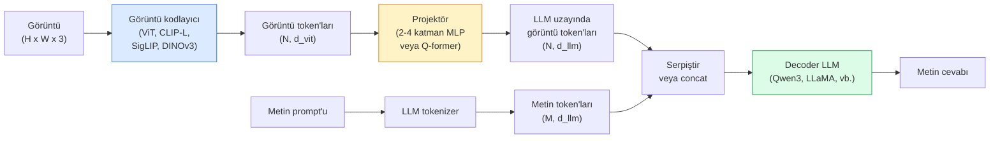

# Görsel-Dil Modelleri — ViT-MLP-LLM Deseni

> Bir görüntü kodlayıcı, bir görüntüyü token'lara dönüştürür. Bir MLP projektör, bu token'ları LLM'in gömme uzayına eşler. Bir dil modeli gerisini halleder. Bu desen — ViT-MLP-LLM — 2026'daki her üretim VLM'sidir.

**Tür:** Learn + Use
**Diller:** Python
**Ön Koşullar:** Phase 4 Ders 14 (ViT), Phase 4 Ders 18 (CLIP), Phase 7 Ders 02 (Self-Attention)
**Süre:** ~75 dakika

## Öğrenme Hedefleri

- ViT-MLP-LLM mimarisini ifade etmek ve üç bileşenin her birinin neye katkıda bulunduğunu açıklamak
- Qwen3-VL, InternVL3.5, LLaVA-Next ve GLM-4.6V'yi parametre sayısı, bağlam uzunluğu ve kıyaslama performansına göre karşılaştırmak
- DeepStack'i açıklamak: çok seviyeli ViT özelliklerinin neden tek bir son katman özelliğinden daha iyi görsel-dil hizalaması sağladığı
- Üretimde VLM halüsinasyonunu Cross-Modal Error Rate (CMER) ile ölçmek ve sinyale göre hareket etmek

## Problem

CLIP (Phase 4 Ders 18) size görüntüler ve metin için paylaşılan bir gömme uzayı verir; bu, sıfır-atış sınıflandırma ve alma için yeterlidir. Ancak "bu görüntüde kaç tane kırmızı araba var?" sorusunu cevaplayamaz çünkü CLIP metin üretmez — yalnızca benzerlikleri puanlar.

Görsel-Dil Modelleri (Vision-Language Models — VLMs) — Qwen3-VL, InternVL3.5, LLaVA-Next, GLM-4.6V — bir CLIP ailesi görüntü kodlayıcısını tam bir dil modeline bağlar. Model, bir görüntü artı bir soru görür ve bir cevap üretir. 2026'da açık kaynak VLMs, multimodal kıyaslamalarda (MMMU, MMBench, DocVQA, ChartQA, MathVista, OSWorld) GPT-5 ve Gemini-2.5-Pro'ya rakip olur veya onları geçer.

Üç parçalı yapı (ViT, projektör, LLM) standarttır. Modeller arasındaki farklar, hangi ViT, hangi projektör, hangi LLM, eğitim verileri ve hizalama tarifindedir. Deseni anladığınızda, herhangi bir bileşeni değiştirmek mekaniktir.

## Konsept

### ViT-MLP-LLM mimarisi



1. **Görüntü kodlayıcı** — önceden eğitilmiş bir ViT (CLIP-L/14, SigLIP, DINOv3 veya ince ayarlanmış bir varyant). Patch token'ları üretir.
2. **Projektör** — görüntü token'larını LLM'in gömme boyutuna eşleyen küçük bir modül (2-4 katmanlı MLP veya bir Q-Former). İnce ayarın çoğu burada gerçekleşir.
3. **LLM** — yalnızca kod çözücü bir dil modeli (Qwen3, Llama, Mistral, GLM, InternLM). Görsel + metin token'larını sırayla okur, metin üretir.

Her üç parça da prensipte eğitilebilir. Pratikte, görüntü kodlayıcı ve LLM çoğunlukla donuk kalırken projektör eğitilir — birkaç milyar parametrelik sinyal ucuza.

### DeepStack

Sade projektör yalnızca son ViT katmanını kullanır. DeepStack (Qwen3-VL), özellikleri birden çok ViT derinliğinden örnekler ve üst üste koyar. Daha derin katmanlar üst düzey anlambilim taşır; daha sığ katmanlar ince taneli uzamsal ve doku bilgisi taşır. Her ikisini de LLM'e beslemek, "görüntü ne içeriyor" (anlambilim) ile "tam olarak nerede" (uzamsal grounding) arasındaki boşluğu kapatır.

### Üç eğitim aşaması

Modern VLM'ler aşamalar halinde eğitilir:

1. **Alignment (hizalama)** — ViT ve LLM'i dondurun. Yalnızca projektörü görüntü-altyazı çiftleri üzerinde eğitin. Projektöre görsel uzayı dil uzayına eşlemeyi öğretir.
2. **Pre-training (ön eğitim)** — her şeyi çözün. Büyük ölçekli serpiştirilmiş görüntü-metin verileri (500M+ çift) üzerinde eğitin. Modelin görsel bilgisini oluşturur.
3. **Instruction tuning (talimat ayarı)** — küratörlü (görüntü, soru, cevap) üçlüleri üzerinde ince ayar yapın. Sohbet davranışını ve görev formatlarını öğretir. Bu, "görme yeteneğine sahip bir DM"yi kullanılabilir bir asistana dönüştürendir.

Çoğu LoRA ince ayarı, küçük bir etiketli veri kümesiyle 3. aşamayı hedefler.

### Model ailesi karşılaştırması (2026 başı)

| Model | Parametre | Görüntü kodlayıcı | LLM | Bağlam | Güçlü yönler |
|-------|-----------|-------------------|-----|--------|--------------|
| Qwen3-VL-235B-A22B (MoE) | 235B (22B aktif) | custom ViT + DeepStack | Qwen3 | 256K | Genel SOTA, GUI ajanı |
| Qwen3-VL-30B-A3B (MoE) | 30B (3B aktif) | custom ViT + DeepStack | Qwen3 | 256K | Daha küçük MoE alternatifi |
| Qwen3-VL-8B (dense) | 8B | custom ViT | Qwen3 | 128K | Üretim yoğun varsayılanı |
| InternVL3.5-38B | 38B | InternViT-6B | Qwen3 + GPT-OSS | 128K | Güçlü MMBench / MMVet |
| InternVL3.5-241B-A28B | 241B (28B aktif) | InternViT-6B | Qwen3 | 128K | GPT-4o ile rekabetçi |
| LLaVA-Next 72B | 72B | SigLIP | Llama-3 | 32K | Açık, ince ayarı kolay |
| GLM-4.6V | ~70B | custom | GLM | 64K | Açık kaynak, güçlü OCR |
| MiniCPM-V-2.6 | 8B | SigLIP | MiniCPM | 32K | Uç cihaz dostu |

### Görsel ajanlar

Qwen3-VL-235B, OSWorld'de küresel en iyi performansa ulaşır — GUI'leri (masaüstü, mobil, web) çalıştıran **görsel ajanlar (visual agents)** için bir kıyaslama. Model bir ekran görüntüsü görür, UI'yi anlar ve eylemler yayar (tıkla, yaz, kaydır). Araçlarla birleştiğinde, yaygın masaüstü görevlerinde döngüyü kapatır. 2026 "AI PC" demolarının çoğu perde arkasında bunu çalıştırır.

### Ajan yetenekleri + RoPE varyantları

VLM'ler bir karenin videoda **ne zaman** olduğunu bilmelidir. Qwen3-VL, T-RoPE'den (geçici döner konum gömmeleri) **metin tabanlı zaman hizalamasına** evrildi — video kareleriyle serpiştirilmiş açık zaman damgası metin token'ları. Model "`<timestamp 00:32>` kare, prompt" görür ve zamansal ilişkiler hakkında akıl yürütebilir.

### Hizalama sorunu

Taranmış bir veri kümesindeki görüntü-metin çiftlerinin %12'si, görüntüde tam olarak temellendirilmemiş açıklamalar içerir. Bunun üzerine eğitilen bir VLM sessizce halüsinasyon görmeyi öğrenir — nesneler uydurur, sayıları yanlış okur, ilişkiler icat eder. Üretimde bu baskın hata modudur.

Skywork.ai bunu izlemek için **Cross-Modal Error Rate (CMER)**'ı tanıttı:

```
CMER = metin güveninin yüksek olduğu ancak görüntü-metin benzerliğinin (bir CLIP ailesi denetleyicisi aracılığıyla) düşük olduğu çıktıların oranı
```

Yüksek CMER, modelin görüntüde temellendirilmemiş şeyleri güvenle söylediği anlamına gelir. CMER'i izlemek ve bir üretim KPI'sı olarak ele almak, dağıtımlarında halüsinasyon oranını ~%35 oranında azalttı. İşin püf noktası "modeli düzeltmek" değil, "yüksek CMER'li çıktıları insan incelemesine yönlendirmek"tir.

### LoRA / QLoRA ile ince ayar

70B'lik bir VLM'nin tam ince ayarı çoğu ekip için ulaşılamaz. Dikkat + projektör katmanlarında LoRA (rank 16-64) veya 4-bit temel ağırlıklarla QLoRA, tek bir A100 / H100'e sığar. Maliyet: 5.000-50.000 örnek, 100$-5.000$ bilgi işlem, 2-10 saat eğitim.

### Uzamsal akıl yürütme hâlâ zayıf

Mevcut VLM'ler uzamsal akıl yürütme kıyaslamalarında (yukarıda-aşağıda, sol-sağ, sayma, mesafe) %50-60 puan alır. Kullanım durumunuz "hangi nesne hangisinin üstünde"ye bağlıysa, kapsamlı doğrulama yapın — genel VLM performansı insanın altındadır. Saf uzamsal görevler için VLM'lerden daha iyi alternatifler: özel bir anahtar nokta / duruş tahmincisi, bir derinlik modeli veya kutu geometrisi işlem sonrası ile bir tespit modeli.

## Build It

### Adım 1: Projektör

En sık eğiteceğiniz kısım. GELU ile 2-4 katmanlı MLP.

```python
import torch
import torch.nn as nn


class Projector(nn.Module):
    def __init__(self, vit_dim=768, llm_dim=4096, hidden=4096):
        super().__init__()
        self.net = nn.Sequential(
            nn.Linear(vit_dim, hidden),
            nn.GELU(),
            nn.Linear(hidden, llm_dim),
        )

    def forward(self, x):
        return self.net(x)
```
#### Açıklama
Girdi bir `(N_patches, d_vit)` token tensörüdür. Çıktı `(N_patches, d_llm)` şeklindedir. LLM, her çıktı satırını başka bir token olarak ele alır.

### Adım 2: ViT-MLP-LLM'i uçtan uca birleştirin

Minimal bir VLM için ileri geçişin iskeleti. Gerçek kod `transformers` kullanır; bu kavramsal düzendir.

```python
class MinimalVLM(nn.Module):
    def __init__(self, vit, projector, llm, image_token_id):
        super().__init__()
        self.vit = vit
        self.projector = projector
        self.llm = llm
        self.image_token_id = image_token_id  # metin prompt'unda yer tutucu token

    def forward(self, image, input_ids, attention_mask):
        # 1. görüntü özellikleri
        vision_tokens = self.vit(image)                     # (B, N_patches, d_vit)
        vision_embeds = self.projector(vision_tokens)       # (B, N_patches, d_llm)

        # 2. metin gömmeleri
        text_embeds = self.llm.get_input_embeddings()(input_ids)  # (B, M, d_llm)

        # 3. görüntü yer tutucu token'larını görüntü gömmeleriyle değiştir
        merged = self._merge(text_embeds, vision_embeds, input_ids)

        # 4. LLM'i çalıştır
        return self.llm(inputs_embeds=merged, attention_mask=attention_mask)

    def _merge(self, text_embeds, vision_embeds, input_ids):
        out = text_embeds.clone()
        expected = vision_embeds.size(1)
        for b in range(input_ids.size(0)):
            positions = (input_ids[b] == self.image_token_id).nonzero(as_tuple=True)[0]
            if len(positions) != expected:
                raise ValueError(
                    f"batch öğesi {b}'de {len(positions)} görüntü token'ı var ancak vision_embeds'de {expected} patch var."
                    " Gruptaki her örnek aynı sayıda görüntü yer tutucu token'ına önceden dolgulanmalıdır.")
            out[b, positions] = vision_embeds[b]
        return out
```
#### Açıklama
Metindeki `<image>` yer tutucu token'ı, gerçek görüntü gömmeleriyle değiştirilir — LLaVA, Qwen-VL ve InternVL'nin kullandığı desenin aynısı.

### Adım 3: CMER hesaplaması

Hafif bir çalışma zamanı kontrolü.

```python
import torch.nn.functional as F


def cross_modal_error_rate(image_emb, text_emb, text_confidence, sim_threshold=0.25, conf_threshold=0.8):
    """
    image_emb, text_emb: görüntü ve üretilen metnin gömmeleri (içten normalize edilir)
    text_confidence:     [0, 1] aralığında token başına ortalama olasılık
    Returns:             görüntü-metin hizalaması düşük olan yüksek güvenli çıktıların oranı
    """
    image_emb = F.normalize(image_emb, dim=-1)
    text_emb = F.normalize(text_emb, dim=-1)
    sim = (image_emb * text_emb).sum(dim=-1)        # kosinüs benzerliği
    high_conf_low_sim = (text_confidence > conf_threshold) & (sim < sim_threshold)
    return high_conf_low_sim.float().mean().item()
```
#### Açıklama
CMER'i bir üretim KPI'sı olarak ele alın. Uç nokta başına, prompt türü başına, müşteri başına izleyin. Yükselen CMER, modelin bazı girdi dağılımlarında halüsinasyon görmeye başladığını gösterir.

### Adım 4: Oyuncak VLM sınıflandırıcı (çalıştırılabilir)

Projektörün eğitildiğini gösterin. Sahte "ViT özellikleri" girer; küçük bir LLM tarzı token bir sınıf tahmin eder.

```python
class ToyVLM(nn.Module):
    def __init__(self, vit_dim=32, llm_dim=64, num_classes=5):
        super().__init__()
        self.projector = Projector(vit_dim, llm_dim, hidden=64)
        self.head = nn.Linear(llm_dim, num_classes)

    def forward(self, vision_tokens):
        projected = self.projector(vision_tokens)
        pooled = projected.mean(dim=1)
        return self.head(pooled)
```
#### Açıklama
Bunu sentetik (özellik, sınıf) çiftleri üzerinde 200 adımın altında oturtmak mümkündür — projektör deseninin çalıştığını göstermek için yeterlidir.

## Use It

2026'da üretim ekiplerinin VLM'leri kullanmasının üç yolu:

- **Barındırılan API** — OpenAI Vision, Anthropic Claude Vision, Google Gemini Vision. Sıfır altyapı, satıcı riski.
- **Açık kaynak kendi barındırma** — Qwen3-VL veya InternVL3.5 `transformers` ve `vllm` ile. Tam kontrol, daha yüksek başlangıç çabası.
- **Alana ince ayar** — Qwen2.5-VL-7B veya LLaVA-1.6-7B yükleyin, 5k-50k özel örnekte LoRA, `vllm` veya `TGI` ile sunun.

```python
from transformers import AutoProcessor, AutoModelForVision2Seq
import torch
from PIL import Image

model_id = "Qwen/Qwen3-VL-8B-Instruct"
processor = AutoProcessor.from_pretrained(model_id)
model = AutoModelForVision2Seq.from_pretrained(model_id, torch_dtype=torch.bfloat16, device_map="auto")

messages = [{
    "role": "user",
    "content": [
        {"type": "image", "image": Image.open("plot.png")},
        {"type": "text", "text": "What does this chart show?"},
    ],
}]
inputs = processor.apply_chat_template(messages, add_generation_prompt=True, tokenize=True, return_dict=True, return_tensors="pt").to("cuda")
generated = model.generate(**inputs, max_new_tokens=256)
answer = processor.decode(generated[0][inputs["input_ids"].shape[1]:], skip_special_tokens=True)
```
#### Açıklama
`apply_chat_template`, `<image>` yer tutucu tokenizasyonunu gizler; model birleştirmeyi dahili olarak halleder.

## Ship It

Bu ders şunları üretir:

- `outputs/prompt-vlm-selector.md` — doğruluk, gecikme, bağlam uzunluğu ve bütçeye göre Qwen3-VL / InternVL3.5 / LLaVA-Next / API arasından seçim yapar.
- `outputs/skill-cmer-monitor.md` — bir üretim VLM uç noktasını cross-modal error rate, uç nokta başına panolar ve uyarı eşikleriyle enstrümante eden kodu yayar.

## Alıştırmalar

1. **(Kolay)** Herhangi bir açık VLM'de beş görüntü üzerinde üç prompt ("bu nedir?", "nesneleri say", "sahneyi tanımla") çalıştırın. Her cevabı elle doğru / kısmen doğru / halüsinasyon olarak puanlayın. İlk geçiş CMER benzeri bir oran hesaplayın.
2. **(Orta)** Qwen2.5-VL-3B veya LLaVA-1.6-7B'yi, altyazılı bir hedef alandan 500 görüntü ile LoRA (rank 16) kullanarak ince ayar yapın. Sıfır-atış ile ince ayarlı MMBench tarzı doğruluğu karşılaştırın.
3. **(Zor)** VLM'nin görüntü kodlayıcısını varsayılan SigLIP/CLIP yerine DINOv3 ile değiştirin. Yalnızca projektörü yeniden eğitin (donuk LLM + donuk DINOv3). Yoğun tahmin görevlerinin (sayma, uzamsal akıl yürütme) iyileşip iyileşmediğini ölçün.

## Anahtar Terimler

| Terim | İnsanların söylediği | Gerçekte anlamı |
|-------|---------------------|-----------------|
| ViT-MLP-LLM | "VLM deseni" | Görüntü kodlayıcı + projektör + dil modeli; 2026'daki her VLM |
| Projector (projektör) | "Köprü" | Görüntü token'larını LLM gömme uzayına eşleyen 2-4 katmanlı MLP (veya Q-Former) |
| DeepStack | "Qwen3-VL özellik taktiği" | Yalnızca son katman yerine üst üste yığılmış çok seviyeli ViT özellikleri |
| Image token | "<image> yer tutucu" | İzdüşürülmüş görüntü gömmeleriyle değiştirilen metin akışındaki özel token |
| CMER | "Halüsinasyon KPI'sı" | Çapraz-Modal Hata Oranı; metin güveni yüksek ama görüntü-metin benzerliği düşük olduğunda yüksektir |
| Visual agent (görsel ajan) | "Tıklayan VLM" | Araç çağrılarıyla GUI'leri (OSWorld, mobil, web) çalıştıran VLM |
| Q-Former | "Sabit-sayılı token köprüsü" | Sabit sayıda görsel sorgu token'ı üreten BLIP-2 tarzı projektör |
| Alignment / pre-training / instruction tuning | "Üç aşama" | Standart VLM eğitim hattı |

## İleri Okumalar

- [Qwen3-VL Technical Report (arXiv 2511.21631)](https://arxiv.org/abs/2511.21631)
- [InternVL3.5 Advancing Open-Source Multimodal Models (arXiv 2508.18265)](https://arxiv.org/html/2508.18265v1)
- [LLaVA-Next series](https://llava-vl.github.io/blog/2024-05-10-llava-next-stronger-llms/)
- [BentoML: Best Open-Source VLMs 2026](https://www.bentoml.com/blog/multimodal-ai-a-guide-to-open-source-vision-language-models)
- [MMMU: Multi-discipline Multimodal Understanding benchmark](https://mmmu-benchmark.github.io/)
- [VLMs in manufacturing (Robotics Tomorrow, March 2026)](https://www.roboticstomorrow.com/story/2026/03/when-machines-learn-to-see-like-experts-the-rise-of-vision-language-models-in-manufacturing/26335/)
