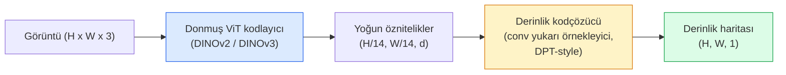

> **Orijinal İçerik:** [docs/en.md](https://github.com/rohitg00/ai-engineering-from-scratch/blob/main/phases/04-computer-vision/26-monocular-depth/docs/en.md)

# Monocular Depth & Geometry Estimation

> Derinlik haritası (depth map), her pikselin kameraya olan uzaklığını gösteren tek kanallı bir görüntüdür. Bunu tek bir RGB kareden tahmin etmek, stereo veya LiDAR olmadan eskiden imkânsızdı. 2026'da donmuş bir ViT kodlayıcı (encoder) ve hafif bir başlık (head), gerçeğe yalnızca birkaç yüzde puan yaklaşıyor.

**Tür:** Build + Use
**Diller:** Python
**Ön Koşullar:** Phase 4 Ders 14 (ViT), Phase 4 Ders 17 (Self-Supervised Vision), Phase 4 Ders 07 (U-Net)
**Süre:** ~60 dakika

## Öğrenme Hedefleri

- Göreceli derinlik (relative depth) ve metrik derinlik (metric depth) arasındaki farkı ayırt etmek ve her bir üretim modelinin (MiDaS, Marigold, Depth Anything V3, ZoeDepth) hangisini çözdüğünü belirtmek
- Depth Anything V3'ü (DINOv2 omurgası) kullanarak herhangi bir tek görüntü için kalibrasyonsuz derinlik tahmini yapmak
- Monoküler derinliğin (monocular depth) tek bir görüntüden neden çalıştığını (perspektif ipuçları, doku gradyanları, öğrenilmiş öncelikler) ve neyi kurtaramadığını (mutlak ölçek, gizli geometri) açıklamak
- Bir derinlik haritası ve iğne deliği kamera iç parametreleri (pinhole camera intrinsics) kullanarak 2D tespitleri 3D noktalara yükseltmek

## Problem

Derinlik, 2D bilgisayarlı görünün eksik eksenidir. RGB verildiğinde, nesnelerin görüntü düzleminde nerede göründüğünü bilirsiniz; ne kadar uzakta olduklarını bilemezsiniz. Derinlik sensörleri (stereo düzenekler, LiDAR, time-of-flight) bunu doğrudan çözer ancak pahalı, kırılgan ve menzil açısından sınırlıdır.

Monoküler derinlik kestirimi (monocular depth estimation) — tek bir RGB kareden derinlik tahmini — eskiden bulanık ve güvenilmez çıktı üretirdi. 2026 itibarıyla büyük önceden eğitilmiş kodlayıcılar (pretrained encoders) bunu değiştirdi: Depth Anything V3, donmuş bir DINOv2 omurgası kullanır ve iç mekân, dış mekân, tıbbi ve uydu alanlarında genelleme yapan derinlik haritaları üretir. Marigold, derinliği koşullu bir difüzyon problemi olarak yeniden çerçeveler. ZoeDepth ise gerçek metrik mesafeleri tahmin eder.

Derinlik aynı zamanda 2D tespit ile 3D anlayış arasındaki köprüdür: tespit edilen bir kutunun piksellerini derinlikle çarparsanız, 2D nesneyi bir 3D nokta bulutuna (point cloud) yükseltirsiniz. Bu, her AR tıkama (occlusion) sisteminin, her engelden kaçınma hattının ve her "bardağı al" robotunun temelidir.

## Konsept

### Göreceli vs metrik derinlik

- **Göreceli derinlik (relative depth)** — gerçek dünya birimi olmadan sıralı `z` değerleri. "A pikseli B pikselinden daha yakın, ancak mesafelerin oranı metreye sabitlenmemiş."
- **Metrik derinlik (metric depth)** — kameradan metre cinsinden mutlak uzaklık. Modelin, görüntü ipuçları ile gerçek mesafe arasındaki istatistiksel ilişkiyi öğrenmesini gerektirir.

MiDaS ve Depth Anything V3 göreceli derinlik üretir. Marigold göreceli derinlik üretir. ZoeDepth, UniDepth ve Metric3D metrik derinlik üretir. Metrik modeller kamera iç parametrelerine duyarlıdır; göreceli modeller değildir.

### Kodlayıcı-kodçözücü deseni



Depth Anything V3 kodlayıcıyı dondurur ve yalnızca DPT tarzı kodçözücüyü (decoder) eğitir. Kodlayıcı zengin öznitelikler sağlar; kodçözücü bunları görüntü çözünürlüğüne geri enterpole eder ve derinliği tahmin eder.

### Tek bir görüntü neden derinlik üretebilir

2D bir görüntü, derinlikle ilişkili birçok monoküler ipucu içerir:

- **Perspektif** — 3D'deki paralel çizgiler 2D'de birleşir.
- **Doku gradyanı (texture gradient)** — uzaktaki yüzeyler daha küçük ve yoğun dokuya sahiptir.
- **Tıkama sırası (occlusion order)** — yakındaki nesneler uzaktakileri gizler.
- **Boyut sabitliği (size constancy)** — bilinen nesneler (arabalar, insanlar) yaklaşık ölçek verir.
- **Atmosferik perspektif (atmospheric perspective)** — uzaktaki nesneler dış mekân sahnelerinde daha puslu ve mavi görünür.

Milyarlarca görüntüyle eğitilmiş bir ViT bu ipuçlarını içselleştirir. Yeterli veri ve güçlü bir omurga ile monoküler derinlik, herhangi bir açık 3D denetimi olmadan makul doğruluğa ulaşır.

### Monoküler derinliğin yapamadıkları

- **İç parametreler veya sahnede bilinen bir nesne olmadan mutlak metrik ölçek.** Ağ, "bardak kaşıktan iki kat uzakta" olduğunu tahmin edebilir ancak bardağın 1 m mi yoksa 10 m mi uzakta olduğunu bilemez.
- **Gizli geometri (occluded geometry)** — bir sandalyenin arkası görünmez ve güvenilir şekilde çıkarılamaz.
- **Gerçekten dokusuz / yansıtıcı yüzeyler** — aynalar, cam, düz duvarlar. Ağ makul ancak yanlış derinlik bildirir.

### 2026'da Depth Anything V3

- Vanilya DINOv2 ViT-L/14 kodlayıcı olarak (donmuş).
- DPT kodçözücü.
- Çeşitli kaynaklardan pozlanmış görüntü çiftleriyle eğitilmiş (fotometrik tutarlılık ötesinde açık derinlik denetimi gerekmez).
- **Bilinenden veya bilinmeyenden herhangi bir sayıda görsel girdi ile kamera pozlarıyla veya pozsuz** uzamsal olarak tutarlı geometri tahmin eder.
- Monoküler derinlik, her açıdan geometri, görsel işleme, kamera pozu kestiriminde SOTA.

2026'da derinliğe ihtiyacınız olduğunda çağıracağınız hazır model budur.

### Marigold — derinlik için difüzyon

Marigold (Ke ve ark., CVPR 2024), derinlik kestirimini koşullu görüntüden-görüntüye difüzyon olarak yeniden çerçeveler. Koşullandırma: RGB. Hedef: derinlik haritası. Önceden eğitilmiş bir Stable Diffusion 2 U-Net omurgası kullanır. Çıktı derinlik haritaları nesne sınırlarında olağanüstü keskindir. Ödünleşim: ileri beslemeli modellere göre daha yavaş çıkarım (10-50 gürültü giderme adımı).

### İç parametreler ve iğne deliği kamera

Bir pikseli `(u, v)` derinlik `d` ile 3D noktaya `(X, Y, Z)` kamera koordinatlarında yükseltmek için:

```
fx, fy, cx, cy = kamera iç parametreleri
X = (u - cx) * d / fx
Y = (v - cy) * d / fy
Z = d
```

İç parametreler EXIF metaverisinden, bir kalibrasyon deseninden veya bir monoküler iç parametre kestiriciden (Perspective Fields, UniDepth) gelir. İç parametreler olmadan, 60-70° görüş alanı ve orta çözünürlük varsayarak bir nokta bulutu oluşturabilirsiniz — görselleştirme için kullanılabilir, ölçüm için değil.

### Değerlendirme

İki standart metrik:

- **AbsRel** (mutlak göreceli hata): `mean(|d_tahmin - d_gerçek| / d_gerçek)`. Düşük daha iyidir. Üretim modelleri için 0.05-0.1.
- **delta < 1.25** (eşik doğruluğu): `max(d_tahmin/d_gerçek, d_gerçek/d_tahmin) < 1.25` olan piksellerin oranı. Yüksek daha iyidir. SOTA için 0.9+.

Göreceli derinlik için (Depth Anything V3, MiDaS), değerlendirme her iki metriğin ölçek-kaydırma değişmez (scale-and-shift invariant) sürümlerini kullanır.

## Build It

### Adım 1: Derinlik metrikleri

```python
import torch

def abs_rel_error(pred, target, mask=None):
    if mask is not None:
        pred = pred[mask]
        target = target[mask]
    return (torch.abs(pred - target) / target.clamp(min=1e-6)).mean().item()


def delta_accuracy(pred, target, threshold=1.25, mask=None):
    if mask is not None:
        pred = pred[mask]
        target = target[mask]
    ratio = torch.maximum(pred / target.clamp(min=1e-6), target / pred.clamp(min=1e-6))
    return (ratio < threshold).float().mean().item()
```

#### Açıklama
Değerlendirmeden önce geçersiz derinlik piksellerini (sıfır, NaN, doymuş) her zaman maskeleyin.

### Adım 2: Ölçek-kaydırma hizalaması

Göreceli derinlik modelleri için, metrikleri hesaplamadan önce tahmini gerçek değere hizalayın. `a * pred + b = target` için en küçük kareler uyumu:

```python
def align_scale_shift(pred, target, mask=None):
    if mask is not None:
        p = pred[mask]
        t = target[mask]
    else:
        p = pred.flatten()
        t = target.flatten()
    A = torch.stack([p, torch.ones_like(p)], dim=1)
    coeffs, *_ = torch.linalg.lstsq(A, t.unsqueeze(-1))
    a, b = coeffs[:2, 0]
    return a * pred + b
```

#### Açıklama
MiDaS / Depth Anything değerlendirirken `abs_rel_error`'dan önce `align_scale_shift`'i çalıştırın.

### Adım 3: Derinliği nokta bulutuna yükseltme

```python
import numpy as np

def depth_to_point_cloud(depth, intrinsics):
    H, W = depth.shape
    fx, fy, cx, cy = intrinsics
    v, u = np.meshgrid(np.arange(H), np.arange(W), indexing="ij")
    z = depth
    x = (u - cx) * z / fx
    y = (v - cy) * z / fy
    return np.stack([x, y, z], axis=-1)


depth = np.random.uniform(0.5, 4.0, (240, 320))
intr = (320.0, 320.0, 160.0, 120.0)
pc = depth_to_point_cloud(depth, intr)
print(f"point cloud shape: {pc.shape}  (H, W, 3)")
```

#### Açıklama
Tek bir fonksiyon, her 3D yükseltilmiş uygulama. Nokta bulutunu `.ply` olarak dışa aktarıp MeshLab veya CloudCompare'de açın.

### Adım 4: Sentetik derinlik sahnesi ile smoke test

```python
def synthetic_depth(size=96):
    yy, xx = np.meshgrid(np.arange(size), np.arange(size), indexing="ij")
    # Zemin: yakından (üst) uzağa (alt) doğrusal gradyan
    depth = 1.0 + (yy / size) * 4.0
    # Ortada kutu: daha yakın
    mask = (np.abs(xx - size / 2) < size / 6) & (np.abs(yy - size * 0.6) < size / 6)
    depth[mask] = 2.0
    return depth.astype(np.float32)


gt = torch.from_numpy(synthetic_depth(96))
pred = gt + 0.3 * torch.randn_like(gt)  # simüle edilmiş tahmin
aligned = align_scale_shift(pred, gt)
print(f"hizalama öncesi  absRel = {abs_rel_error(pred, gt):.3f}")
print(f"hizalama sonrası absRel = {abs_rel_error(aligned, gt):.3f}")
```

#### Açıklama
Sentetik bir derinlik haritası oluşturur, üzerine gürültü ekler ve ölçek-kaydırma hizalamasının hatayı nasıl düzelttiğini gösterir.

### Adım 5: Depth Anything V3 kullanımı (referans)

```python
import torch
from transformers import pipeline
from PIL import Image

pipe = pipeline(task="depth-estimation", model="LiheYoung/depth-anything-v2-large")

image = Image.open("street.jpg").convert("RGB")
out = pipe(image)
depth_np = np.array(out["depth"])
```

#### Açıklama
Üç satır. `out["depth"]` bir PIL gri tonlamalıdır; matematik için numpy'a dönüştürün. Depth Anything V3 için, model kimliğini yayınlandığında değiştirin; API değişmez.

## Use It

- **Depth Anything V3** (Meta AI / ByteDance, 2024-2026) — göreceli derinlik için varsayılan. Üretimdeki en hızlı ViT-large-omurga modeli.
- **Marigold** (ETH, 2024) — en yüksek görsel kalite, yavaş çıkarım.
- **UniDepth** (ETH, 2024) — kamera iç parametre kestirimi ile metrik derinlik.
- **ZoeDepth** (Intel, 2023) — metrik derinlik; eski ancak hâlâ güvenilir.
- **MiDaS v3.1** — eski ama kararlı; karşılaştırma için iyi bir temel.

Tipik entegrasyon deseni:

1. RGB karesi gelir.
2. Derinlik modeli derinlik haritası üretir.
3. Dedektör kutular üretir.
4. Kutu merkezlerini derinlik üzerinden 3D'ye yükseltin; varsa nokta bulutu ile birleştirin.
5. Aşağı akış: AR tıkama, yol planlaması, nesne boyutu tahmini, stereo yedekleme.

Gerçek zamanlı kullanım için, Depth Anything V2 Small (INT8 nicelenmiş) tüketici GPU'sunda 518x518'de ~30 fps'ye ulaşır.

## Ship It

Bu ders şunları üretir:

- `outputs/prompt-depth-model-picker.md` — gecikme, metrik-vs-göreceli ihtiyacı ve sahne türüne göre Depth Anything V3, Marigold, UniDepth, MiDaS arasında seçim yapar.
- `outputs/skill-depth-to-pointcloud.md` — doğru iç parametre işleme ve `.ply` dışa aktarma ile derinlik haritalarından nokta bulutları oluşturan bir beceri.

## Alıştırmalar

1. **(Kolay)** Depth Anything V2'yi masanızdaki herhangi 10 görüntüde çalıştırın. Derinliği gri tonlamalı PNG olarak kaydedin ve inceleyin. Tahmini yanlış görünen bir nesne belirleyin ve monoküler ipuçlarının neden başarısız olduğunu açıklayın.
2. **(Orta)** RGB + Depth Anything V2 derinliği verildiğinde, bir nokta bulutuna yükseltin ve `open3d` ile işleyin. İki sahneyi (iç mekân / dış mekân) karşılaştırın ve hangisinin daha inandırıcı göründüğünü not edin.
3. **(Zor)** Yalnızca bilinen bir nesnenin konumuyla farklılaşan beş görüntü çifti alın (ör. şişe 30 cm yaklaştırılmış). Her ikisinde de metrik derinlik tahmini için UniDepth kullanın. Tahmin edilen mesafe farkını gerçek 30 cm ile karşılaştırın.

## Anahtar Terimler

| Terim | Ne denir | Gerçekte ne anlama gelir |
|-------|----------|--------------------------|
| Monocular depth | "Tek görüntülü derinlik" | Stereo veya LiDAR olmadan tek RGB kareden derinlik kestirimi |
| Relative depth | "Sıralı derinlik" | Gerçek dünya birimleri olmadan sıralı z-değerleri |
| Metric depth | "Mutlak mesafe" | Metre cinsinden derinlik; kalibrasyon veya metrik denetimle eğitilmiş model gerektirir |
| AbsRel | "Mutlak göreceli hata" | |d_tahmin - d_gerçek| / d_gerçek ortalaması; standart derinlik metriği |
| Delta accuracy | "delta < 1.25" | Tahmini gerçek değerin %25'i içinde olan piksellerin oranı |
| Pinhole camera | "fx, fy, cx, cy" | (u, v, d)'yi (X, Y, Z)'ye yükseltmek için kullanılan kamera modeli |
| DPT | "Dense Prediction Transformer" | Donmuş ViT kodlayıcılarının üzerinde derinlik için kullanılan conv tabanlı kodçözücü |
| DINOv2 backbone | "Çalışmasının sebebi" | Derinlik etiketleri olmadan alanlar arasında genelleme yapan kendinden denetimli öznitelikler |

## Daha Fazla Okuma

- [Depth Anything V3 makale sayfası](https://depth-anything.github.io/) — DINOv2 kodlayıcı ile SOTA monoküler derinlik
- [Marigold (Ke ve ark., CVPR 2024)](https://marigoldmonodepth.github.io/) — difüzyon tabanlı derinlik kestirimi
- [UniDepth (Piccinelli ve ark., 2024)](https://arxiv.org/abs/2403.18913) — iç parametrelerle metrik derinlik
- [MiDaS v3.1 (Intel ISL)](https://github.com/isl-org/MiDaS) — kanonik göreceli derinlik temeli
- [DINOv3 blog yazısı (Meta)](https://ai.meta.com/blog/dinov3-self-supervised-vision-model/) — derinlik doğruluğunu yükselten kodlayıcı ailesi
