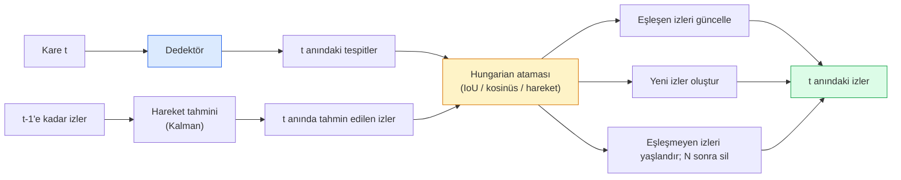

> **Orijinal İçerik:** [docs/en.md](https://github.com/rohitg00/ai-engineering-from-scratch/blob/main/phases/04-computer-vision/27-multi-object-tracking/docs/en.md)

# Multi-Object Tracking & Video Memory

> İzleme (tracking), tespit artı ilişkilendirmedir (association). Her kareyi tespit et. Bu karenin tespitlerini bir önceki karenin izlerine (track) ID'lerle eşle.

**Tür:** Build
**Diller:** Python
**Ön Koşullar:** Phase 4 Ders 06 (YOLO Detection), Phase 4 Ders 08 (Mask R-CNN), Phase 4 Ders 24 (SAM 3)
**Süre:** ~60 dakika

## Öğrenme Hedefleri

- İzleme-yoluyla-tespit (tracking-by-detection) ile sorgu-tabanlı izleme (query-based tracking) arasındaki farkı ayırt etmek ve algoritma ailelerini (SORT, DeepSORT, ByteTrack, BoT-SORT, SAM 2 memory tracker, SAM 3.1 Object Multiplex) adlandırmak
- Klasik izleme-yoluyla-tespit için IoU + Hungarian atamasını sıfırdan uygulamak
- SAM 2'nin bellek bankasını (memory bank) ve IoU tabanlı ilişkilendirmeden neden daha iyi tıkama (occlusion) yönettiğini açıklamak
- Üç izleme metriğini (MOTA, IDF1, HOTA) okumak ve belirli bir kullanım durumu için hangisinin önemli olduğunu seçmek

## Problem

Bir dedektör, nesnelerin tek bir karede nerede olduğunu söyler. Bir izleyici (tracker), `t` karesindeki hangi tespitin `t-1` karesindeki bir tespitle aynı nesne olduğunu söyler. Bu olmadan, bir çizgiyi geçen nesneleri sayamaz, bir topu tıkama boyunca takip edemez veya "4 numaralı araç 8 saniyedir şeritte" diyemezsiniz.

İzleme, video odaklı her ürün için hayatidir: spor analitiği, gözetim, otonom sürüş, tıbbi video analizi, yaban hayatı izleme, nesne sayımı. Temel yapı taşları ortaktır: kare başına bir dedektör, bir hareket modeli (Kalman filter veya daha zengini), bir ilişkilendirme adımı (IoU / kosinüs / öğrenilmiş öznitelikler üzerinde Hungarian algorithm) ve bir iz yaşam döngüsü (doğum, güncelleme, ölüm).

2026 iki yeni desen getirdi: **SAM 2 bellek tabanlı izleme** (hareket modeli ilişkilendirmesi yerine öznitelik belleği) ve **SAM 3.1 Object Multiplex** (aynı kavramın birçok örneği için paylaşımlı bellek). Bu ders önce klasik yığını, ardından bellek tabanlı yaklaşımı ele alır.

## Konsept

### İzleme-yoluyla-tespit



2026'da karşılaşacağınız her izleyici bu döngünün bir varyasyonudur. Farklar:

- **SORT** (2016): Kalman filtresi + IoU Hungarian. Basit, hızlı, görünüm modeli yok.
- **DeepSORT** (2017): SORT + iz başına CNN tabanlı görünüm özniteliği (ReID embedding). Geçişleri daha iyi yönetir.
- **ByteTrack** (2021): düşük güvenli tespitleri ikinci aşamada ilişkilendirir; görünüm özniteliği gerekmez ancak MOT17'de en iyi performans.
- **BoT-SORT** (2022): Byte + kamera hareketi telafisi + ReID.
- **StrongSORT / OC-SORT** — ByteTrack türevleri, daha iyi hareket ve görünüm.

### Kalman filtresi tek paragrafta

Bir Kalman filtresi, iz başına bir durum `(x, y, w, h, dx, dy, dw, dh)` ve bir kovaryans tutar. Her karede, sabit-hız modelini kullanarak durumu **tahmin eder (predict)**, ardından eşleşen tespitle **günceller (update)**. Tahmin belirsizliği yüksek olduğunda güncelleme tespitlere daha çok güvenir. Bu, düzgün yörüngeler ve kısa tıkamalar (1-5 kare) boyunca izi sürdürme yeteneği sağlar.

Her klasik izleyici, hareket tahmin adımında bir Kalman filtresi kullanır.

### Hungarian algoritması

Bir `M x N` maliyet matrisi (izler x tespitler) verildiğinde, toplam maliyeti minimize eden bire-bir atamayı bulur. Maliyet genellikle `1 - IoU(iz_kutusu, tespit_kutusu)` veya görünüm özniteliklerinin negatif kosinüs benzerliğidir. Çalışma süresi O((M+N)^3)'tür; M, N ~1000'e kadar Python'da `scipy.optimize.linear_sum_assignment` ile yeterince hızlıdır.

### ByteTrack'in ana fikri

Standart izleyiciler düşük güvenli tespitleri (< 0.5) atar. ByteTrack bunları **ikinci aşama adayı** olarak tutar: izler yüksek güvenli tespitlerle eşleştikten sonra, eşleşmeyen izler biraz daha gevşek bir IoU eşiğiyle düşük güvenli tespitlerle eşleşmeyi dener. Kısa tıkamaları ve kalabalık yakınındaki ID değişimlerini kurtarır.

### SAM 2 bellek tabanlı izleme

SAM 2, video için **bellek bankası** (memory bank) tutar: örnek başına uzamsal-zamansal (spatio-temporal) öznitelikler. Bir karede bir istem (tıklama, kutu, metin) verildiğinde, örneği belleğe kodlar. Sonraki karelerde, bellek yeni karenin özniteliklerine çapraz-dikkat (cross-attention) uygulanır ve kodçözücü aynı örnek için yeni karede bir maske üretir.

Kalman filtresi yok, Hungarian ataması yok. İlişkilendirme, bellek-dikkat işleminde örtüktür.

Artıları:
- Büyük tıkamalara karşı dayanıklı (bellek, örnek kimliğini birçok kare boyunca taşır).
- SAM 3'ün metin istemleriyle birleştiğinde açık-kelime dağarcığı (open-vocabulary).
- Ayrı bir hareket modeli gerektirmez.

Eksileri:
- Çok nesneli izleme için ByteTrack'ten yavaştır.
- Bellek bankası büyür; bağlam penceresini sınırlar.

### SAM 3.1 Object Multiplex

Önceki SAM 2 / SAM 3 izleme, örnek başına ayrı bir bellek bankası tutar. 50 nesne için 50 bellek bankası. Object Multiplex (Mart 2026) bunları **örnek başına sorgu token'ları (per-instance query tokens)** ile tek bir paylaşımlı bellekte birleştirir. Maliyet, örnek sayısıyla alt-doğrusal (sub-linear) ölçeklenir.

Multiplex, 2026'da kalabalık izleme için yeni varsayılandır: konser kalabalıkları, depo işçileri, trafik kavşakları.

### Bilinmesi gereken üç metrik

- **MOTA (Multi-Object Tracking Accuracy)** — 1 - (YN + YP + ID değişimi) / GT. Hata türüne göre ağırlıklandırılır; tespit ve ilişkilendirme başarısızlıklarını birleştiren tek bir metrik.
- **IDF1 (ID F1)** — ID kesinliği ve duyarlılığının harmonik ortalaması. Her bir gerçek izin zaman içinde ID'sini ne kadar iyi koruduğuna odaklanır. ID değişimine duyarlı görevler için MOTA'dan daha iyidir.
- **HOTA (Higher Order Tracking Accuracy)** — tespit doğruluğu (DetA) ve ilişkilendirme doğruluğuna (AssA) ayrışır. 2020'den beri topluluk standardı; en kapsamlı olanıdır.

Gözetim için (kim kim): IDF1 raporlanır. Spor analitiği için (pas sayma): HOTA. Genel akademik karşılaştırma için: HOTA.

## Build It

### Adım 1: IoU tabanlı maliyet matrisi

```python
import numpy as np


def bbox_iou(a, b):
    """
    a, b: (N, 4) dizileri [x1, y1, x2, y2].
    (N_a, N_b) IoU matrisi döndürür.
    """
    ax1, ay1, ax2, ay2 = a[:, 0], a[:, 1], a[:, 2], a[:, 3]
    bx1, by1, bx2, by2 = b[:, 0], b[:, 1], b[:, 2], b[:, 3]
    inter_x1 = np.maximum(ax1[:, None], bx1[None, :])
    inter_y1 = np.maximum(ay1[:, None], by1[None, :])
    inter_x2 = np.minimum(ax2[:, None], bx2[None, :])
    inter_y2 = np.minimum(ay2[:, None], by2[None, :])
    inter = np.clip(inter_x2 - inter_x1, 0, None) * np.clip(inter_y2 - inter_y1, 0, None)
    area_a = (ax2 - ax1) * (ay2 - ay1)
    area_b = (bx2 - bx1) * (by2 - by1)
    union = area_a[:, None] + area_b[None, :] - inter
    return inter / np.clip(union, 1e-8, None)
```

#### Açıklama
İki sınırlayıcı kutu kümesi arasında çiftli IoU hesaplar. Maliyet = 1 - IoU olarak Hungarian algoritmasına beslenir.

### Adım 2: Minimal SORT tarzı izleyici

Sabit-hız Kalman kısalık için atlanmıştır — burada basit IoU ilişkilendirmesi kullanıyoruz; üretimde Kalman tahmini elzemdir. `sort` Python paketi tam sürümü sağlar.

```python
from scipy.optimize import linear_sum_assignment


class Track:
    def __init__(self, tid, bbox, frame):
        self.id = tid
        self.bbox = bbox
        self.last_frame = frame
        self.hits = 1

    def update(self, bbox, frame):
        self.bbox = bbox
        self.last_frame = frame
        self.hits += 1


class SimpleTracker:
    def __init__(self, iou_threshold=0.3, max_age=5):
        self.tracks = []
        self.next_id = 1
        self.iou_threshold = iou_threshold
        self.max_age = max_age

    def step(self, detections, frame):
        if not self.tracks:
            for d in detections:
                self.tracks.append(Track(self.next_id, d, frame))
                self.next_id += 1
            return [(t.id, t.bbox) for t in self.tracks]

        track_boxes = np.array([t.bbox for t in self.tracks])
        det_boxes = np.array(detections) if len(detections) else np.empty((0, 4))

        iou = bbox_iou(track_boxes, det_boxes) if len(det_boxes) else np.zeros((len(track_boxes), 0))
        cost = 1 - iou
        cost[iou < self.iou_threshold] = 1e6

        matched_track = set()
        matched_det = set()
        if cost.size > 0:
            row, col = linear_sum_assignment(cost)
            for r, c in zip(row, col):
                if cost[r, c] < 1.0:
                    self.tracks[r].update(det_boxes[c], frame)
                    matched_track.add(r); matched_det.add(c)

        for i, d in enumerate(det_boxes):
            if i not in matched_det:
                self.tracks.append(Track(self.next_id, d, frame))
                self.next_id += 1

        self.tracks = [t for t in self.tracks if frame - t.last_frame <= self.max_age]
        return [(t.id, t.bbox) for t in self.tracks]
```

#### Açıklama
60 satır. Kare başına tespit alır, kare başına iz ID'leri döndürür. Gerçek sistemler Kalman tahmini, ByteTrack'in ikinci aşama yeniden eşlemesi ve görünüm özniteliklerini ekler.

### Adım 3: Sentetik yörünge testi

```python
def synthetic_frames(num_frames=20, num_objects=3, H=240, W=320, seed=0):
    rng = np.random.default_rng(seed)
    starts = rng.uniform(20, 200, size=(num_objects, 2))
    velocities = rng.uniform(-5, 5, size=(num_objects, 2))
    frames = []
    for f in range(num_frames):
        dets = []
        for i in range(num_objects):
            cx, cy = starts[i] + f * velocities[i]
            dets.append([cx - 10, cy - 10, cx + 10, cy + 10])
        frames.append(dets)
    return frames


tracker = SimpleTracker()
for f, dets in enumerate(synthetic_frames()):
    tracks = tracker.step(dets, f)
```

#### Açıklama
Düz çizgilerde hareket eden üç nesne, ID'lerini 20 kare boyunca korumalıdır.

### Adım 4: ID-değişim metriği

```python
def count_id_switches(tracks_per_frame, gt_per_frame):
    """
    tracks_per_frame:  (track_id, bbox) listelerinin listesi
    gt_per_frame:      (gt_id, bbox) listelerinin listesi
    ID değişimi sayısını döndürür.
    """
    prev_assignment = {}
    switches = 0
    for tracks, gts in zip(tracks_per_frame, gt_per_frame):
        if not tracks or not gts:
            continue
        t_boxes = np.array([b for _, b in tracks])
        g_boxes = np.array([b for _, b in gts])
        iou = bbox_iou(g_boxes, t_boxes)
        for g_idx, (gt_id, _) in enumerate(gts):
            j = iou[g_idx].argmax()
            if iou[g_idx, j] > 0.5:
                t_id = tracks[j][0]
                if gt_id in prev_assignment and prev_assignment[gt_id] != t_id:
                    switches += 1
                prev_assignment[gt_id] = t_id
    return switches
```

#### Açıklama
Bu, basitleştirilmiş bir IDF1 benzeri metriktir: bir gerçek nesnenin atanmış tahmin edilen iz ID'sini kaç kez değiştirdiğini sayar. Gerçek MOTA / IDF1 / HOTA araçları `py-motmetrics` ve `TrackEval`'da bulunur.

## Use It

2026 üretim izleyicileri:

- `ultralytics` — YOLOv8 + ByteTrack / BoT-SORT yerleşik. `results = model.track(source, tracker="bytetrack.yaml")`. Varsayılan.
- `supervision` (Roboflow) — ByteTrack sarmalayıcıları ve açıklama araçları.
- SAM 2 / SAM 3.1 — `processor.track()` ile bellek tabanlı izleme.
- Özel yığın: dedektör (YOLOv8 / RT-DETR) + `sort-tracker` / `OC-SORT` / `StrongSORT`.

Seçim:

- 30+ fps'de yayalar / arabalar / kutular: **ultralytics ile ByteTrack**.
- Bir kalabalıkta bir sınıfın birçok örneği: **SAM 3.1 Object Multiplex**.
- Tanımlanabilir görünüme sahip ağır tıkamalar: **DeepSORT / StrongSORT** (ReID öznitelikleri).
- Spor / karmaşık etkileşimler: **BoT-SORT** veya öğrenilmiş izleyiciler (MOTRv3).

## Ship It

Bu ders şunları üretir:

- `outputs/prompt-tracker-picker.md` — sahne türü, tıkama desenleri ve gecikme bütçesine göre SORT / ByteTrack / BoT-SORT / SAM 2 / SAM 3.1 arasında seçim yapar.
- `outputs/skill-mot-evaluator.md` — gerçek izlere karşı MOTA / IDF1 / HOTA için tam bir değerlendirme altyapısı yazar.

## Alıştırmalar

1. **(Kolay)** Yukarıdaki sentetik izleyiciyi 3, 10 ve 30 nesneyle çalıştırın. Her durumda ID-değişim sayısını raporlayın. Basit IoU ilişkilendirmesinin başarısız olmaya başladığı yeri belirleyin.
2. **(Orta)** İlişkilendirmeden önce sabit-hız Kalman tahmin adımı ekleyin. Kısa (2-3 kare) tıkamaların artık ID değişimine neden olmadığını gösterin.
3. **(Zor)** SAM 2'nin bellek tabanlı izleyicisini (`transformers` aracılığıyla) alternatif bir izleyici arka ucu olarak entegre edin. Hem SimpleTracker'ı hem de SAM 2'yi 30 saniyelik bir kalabalık klibinde çalıştırın ve ID-değişim sayılarını karşılaştırın; 5 belirgin kişi için gerçek ID'leri elle etiketleyin.

## Anahtar Terimler

| Terim | Ne denir | Gerçekte ne anlama gelir |
|-------|----------|--------------------------|
| Tracking-by-detection | "Tespit et sonra ilişkilendir" | Kare başına dedektör + IoU / görünüm üzerinde Hungarian ataması |
| Kalman filter | "Hareket tahmini" | Doğrusal dinamikler + kovaryans ile düzgün iz tahminleri ve tıkama yönetimi |
| Hungarian algorithm | "Optimal atama" | Minimum maliyetli iki-parçalı eşleme problemini çözer; `scipy.optimize.linear_sum_assignment` |
| ByteTrack | "Düşük güvenli ikinci geçiş" | Kısa tıkamaları kurtarmak için eşleşmeyen izleri düşük güvenli tespitlerle yeniden eşler |
| DeepSORT | "SORT + görünüm" | Kareler arası eşleme için ReID özniteliği ekler; ID koruma için daha iyidir |
| Memory bank | "SAM 2 taktiği" | Kareler boyunca depolanan örnek başına uzamsal-zamansal öznitelikler; çapraz-dikkat açık ilişkilendirmenin yerini alır |
| Object Multiplex | "SAM 3.1 paylaşımlı bellek" | Hızlı çok nesneli izleme için örnek başına sorgularla tek paylaşımlı bellek |
| HOTA | "Modern izleme metriği" | Tespit ve ilişkilendirme doğruluğuna ayrışır; topluluk standardı |

## Daha Fazla Okuma

- [SORT (Bewley ve ark., 2016)](https://arxiv.org/abs/1602.00763) — minimal izleme-yoluyla-tespit makalesi
- [DeepSORT (Wojke ve ark., 2017)](https://arxiv.org/abs/1703.07402) — görünüm özniteliği ekler
- [ByteTrack (Zhang ve ark., 2022)](https://arxiv.org/abs/2110.06864) — düşük güvenli ikinci geçiş
- [BoT-SORT (Aharon ve ark., 2022)](https://arxiv.org/abs/2206.14651) — kamera hareketi telafisi
- [HOTA (Luiten ve ark., 2020)](https://arxiv.org/abs/2009.07736) — ayrıştırılmış izleme metriği
- [SAM 2 video segmentasyonu (Meta, 2024)](https://ai.meta.com/sam2/) — bellek tabanlı izleyici
- [SAM 3.1 Object Multiplex (Meta, Mart 2026)](https://ai.meta.com/blog/segment-anything-model-3/)
