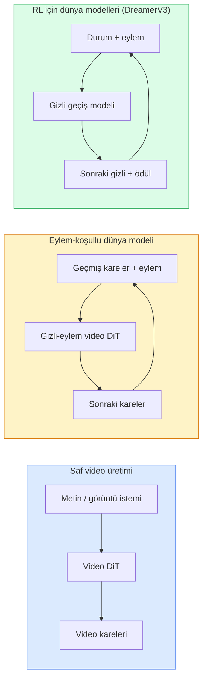

> **Orijinal İçerik:** [docs/en.md](https://github.com/rohitg00/ai-engineering-from-scratch/blob/main/phases/04-computer-vision/28-world-models-video-diffusion/docs/en.md)

# World Models & Video Diffusion

> Bir sahnenin sonraki saniyelerini tahmin eden bir video modeli, bir dünya simülatörüdür (world simulator). Bu tahmini eylemlerle koşullandırın ve öğrenilmiş bir oyun motorunuz (learned game engine) olur.

**Tür:** Learn + Build
**Diller:** Python
**Ön Koşullar:** Phase 4 Ders 10 (Diffusion), Phase 4 Ders 12 (Video Understanding), Phase 4 Ders 23 (DiT + Rectified Flow)
**Süre:** ~75 dakika

## Öğrenme Hedefleri

- Saf bir video üretim modeli (Sora 2) ile eylem-koşullu dünya modeli (Genie 3, DreamerV3) arasındaki farkı açıklamak
- Bir video DiT'yi tanımlamak: uzamsal-zamansal patch'ler (spatio-temporal patches), 3D pozisyon kodlaması, (T, H, W) token'ları arasında ortak dikkat (joint attention)
- Bir dünya modelinin robotiğe nasıl entegre olduğunu izlemek: VLM planlar → video modeli simüle eder → ters dinamik (inverse dynamics) eylemleri üretir
- Belirli bir kullanım durumu için Sora 2, Genie 3, Runway GWM-1 Worlds, Wan-Video ve HunyuanVideo arasında seçim yapmak (yaratıcı video, etkileşimli sim, otonom sürüş sentezi)

## Problem

Video üretimi ve dünya modellemesi (world modelling) 2026'da birleşti. Tutarlı bir dakikalık video üretebilen bir model, bir anlamda dünyanın nasıl hareket ettiğini öğrenmiştir: nesne sürekliliği (object permanence), yerçekimi, nedensellik, stil. Bu tahmini eylemlerle koşullandırırsanız (yürü sola, kapıyı aç), video modeli, bir oyun motorunun, sürüş simülatörünün veya robotik ortamının yerini alabilecek öğrenilebilir bir simülatöre dönüşür.

Riskler somuttur. Genie 3, tek bir görüntüden oynanabilir ortamlar üretir. Runway GWM-1 Worlds, sonsuz keşfedilebilir sahneler sentezler. Sora 2, senkronize ses ve modellenmiş fizikle dakikalık videolar üretir. NVIDIA Cosmos-Drive, Wayve Gaia-2 ve Tesla DrivingWorld, otonom araç eğitim verisi için gerçekçi sürüş videoları üretir. Dünya modeli paradigması, robotikte sim-to-real'in yerini sessizce devralıyor.

Bu ders, Phase 4 için "büyük resim" dersidir. Görüntü üretimi, video anlayışı ve ajan uslamlamasını, baskın araştırmanın yöneldiği mimari desende birleştirir.

## Konsept

### Üç dünya modelleme ailesi



- **Sora 2**, istemlerle koşullandırılmış saf video üretimidir. Eylem arayüzü yoktur. Orta yayılımda "yönlendiremezsiniz."
- **Genie 3**, **GWM-1 Worlds**, **Mirage / Magica** eylem-koşullu dünya modelleridir. Gözlemlenen videodan gizli eylemler (latent actions) çıkarır, ardından gelecek kare tahminlerini eylemlerle koşullandırır. Etkileşimlidir — tuşlara basar veya kamerayı hareket ettirirsiniz, sahne yanıt verir.
- **DreamerV3** ve klasik RL dünya modeli ailesi, açık eylem koşullandırmasıyla gizli uzayda (latent space) tahmin yapar ve bir ödül sinyaliyle eğitilir. Daha az görsel; örnek-verimli RL için daha kullanışlıdır.

### Video DiT mimarisi

```
Video gizli uzayı:     (C, T, H, W)
Patch'leme (uzamsal):  kare başına P_h x P_w patch ızgarası
Patch'leme (zamansal): P_t kareyi bir zamansal patche grupla
Sonuç token'ları:      (T / P_t) * (H / P_h) * (W / P_w) token
```

Pozisyon kodlaması 3D'dir: (t, h, w) koordinatı başına döner (rotary) veya öğrenilmiş bir yerleştirme (embedding). Dikkat şunlar olabilir:

- **Tam ortak (Full joint)** — tüm token'lar tüm token'lara bakar. N token için O(N^2). Uzun videolar için caydırıcı.
- **Bölünmüş (Divided)** — dönüşümlü olarak zamansal dikkat (aynı uzamsal pozisyon, zaman boyunca: `(H*W) * T^2`) ve uzamsal dikkat (aynı zaman adımı, uzay boyunca: `T * (H*W)^2`). TimeSformer ve çoğu video DiT tarafından kullanılır.
- **Pencere (Window)** — (t, h, w) içinde yerel pencereler. Video Swin tarafından kullanılır.

2026'daki her video difüzyon modeli, bu üç desenden birini artı AdaLN koşullandırması (Ders 23) ve rectified flow kullanır.

### Eylemlerle koşullandırma: gizli eylem modelleri

Genie, ardışık iki kare arasındaki eylemi ayırt edici (discriminatively) tahmin ederek kare başına bir **gizli eylem (latent action)** öğrenir. Modelin kodçözücüsü daha sonra çıkarılan gizli eylemle koşullandırılır — açık klavye tuşlarıyla değil. Çıkarım sırasında, kullanıcı bir gizli eylem belirtebilir (veya yeni bir önselden örnekleyebilir) ve model bu eylemle tutarlı bir sonraki kareyi üretir.

Sora, eylem arayüzünü tamamen atlar. Kodçözücüsü, geçmiş uzamsal-zamansal token'lardan sonraki uzamsal-zamansal token'ları tahmin eder. İstem başlangıcı koşullandırır; hiçbir şey onu orta üretimde yönlendirmez.

### Fiziksel inandırıcılık

Sora 2'nin 2026 sürümü açıkça **fiziksel inandırıcılık (physical plausibility)** reklamı yaptı: ağırlık, denge, nesne sürekliliği, neden-sonuç. Ekip tarafından elle derecelendirilen inandırıcılık puanlarıyla ölçülür; model, düşen nesneler, çarpışan karakterler ve amaçlı başarısızlıklar (kaçırılan bir atlama) konusunda Sora 1'e göre belirgin şekilde iyileşmiştir.

İnandırıcılık baskın başarısızlık modu olmaya devam ediyor. 2024-2025'te spagetti yiyen veya bardaktan içen insan videoları, modelin kalıcı nesne temsilinin eksikliğini ortaya çıkardı. 2026 modelleri (Sora 2, Runway Gen-5, HunyuanVideo) bunları azaltır ancak tamamen ortadan kaldırmaz.

### Otonom sürüş dünya modelleri

Sürüş dünya modelleri, yörüngeler, sınırlayıcı kutular veya navigasyon haritalarıyla koşullandırılmış gerçekçi yol sahneleri üretir. Kullanım:

- **Cosmos-Drive-Dreams** (NVIDIA) — RL eğitimi için dakikalarca sürüş videosu üretir.
- **Gaia-2** (Wayve) — politika değerlendirmesi için yörünge-koşullu sahne sentezi.
- **DrivingWorld** (Tesla) — değişen hava, gün-saati, trafik koşullarını simüle eder.
- **Vista** (ByteDance) — tepkisel sürüş sahnesi sentezi.

Bu modeller, aksi halde milyonlarca kilometre sürüş gerektirecek uç durumlar (gece yayanın aniden yola fırlaması, buzlu kavşaklar, alışılmadık araç türleri) için pahalı gerçek dünya veri toplamanın yerini alır.

### Robotik yığını: VLM + video modeli + ters dinamik

Ortaya çıkan üç bileşenli robotik döngüsü:

1. **VLM** hedefi ayrıştırır ("kırmızı bardağı al"), yüksek seviyeli bir eylem dizisi planlar.
2. **Video üretim modeli**, her eylemi yürütmenin nasıl görüneceğini simüle eder — N kare ilerideki gözlemleri tahmin eder.
3. **Ters dinamik modeli (inverse dynamics model)**, bu gözlemleri üretecek somut motor komutlarını çıkarır.

Bu, ödül şekillendirme (reward shaping) ve örnek-ağır RL'nin yerini alır. Dünya modeli hayal gücünü yapar; ters dinamik, eyleme geçme döngüsünü kapatır. Genie Envisioner bunun bir örneğidir; birçok araştırma grubu bu yapıda birleşmektedir.

### Değerlendirme

- **Görsel kalite** — FVD (Fréchet Video Distance), kullanıcı çalışmaları.
- **İstem uyumu** — Kare başına CLIPScore, VQA tarzı değerlendirme.
- **Fiziksel inandırıcılık** — bir kıyaslama paketinde elle derecelendirme (Sora 2'nin dahili kıyaslaması, VBench).
- **Kontrol edilebilirlik** (etkileşimli dünya modelleri için) — eylem → gözlem tutarlılığı; önceki bir duruma geri dönebilir misiniz?

### 2026'da model manzarası

| Model | Kullanım | Parametre | Çıktı | Lisans |
|-------|----------|-----------|-------|--------|
| Sora 2 | metinden-videoya, ses | — | 1-dk 1080p + ses | Yalnızca API |
| Runway Gen-5 | metin/görüntüden-videoya | — | 10sn klipler | API |
| Runway GWM-1 Worlds | etkileşimli dünya | — | sonsuz 3D yayılım | API |
| Genie 3 | görüntüden etkileşimli dünya | 11B+ | oynanabilir kareler | araştırma ön izleme |
| Wan-Video 2.1 | açık metinden-videoya | 14B | yüksek kaliteli klipler | ticari olmayan |
| HunyuanVideo | açık metinden-videoya | 13B | 10sn klipler | izinli |
| Cosmos / Cosmos-Drive | otonom sürüş sim | 7-14B | sürüş sahneleri | NVIDIA açık |
| Magica / Mirage 2 | AI-yerli oyun motoru | — | değiştirilebilir dünyalar | ürün |

## Build It

### Adım 1: Video için 3D patch'leme

```python
import torch
import torch.nn as nn


class VideoPatch3D(nn.Module):
    def __init__(self, in_channels=4, dim=64, patch_t=2, patch_h=2, patch_w=2):
        super().__init__()
        self.proj = nn.Conv3d(
            in_channels, dim,
            kernel_size=(patch_t, patch_h, patch_w),
            stride=(patch_t, patch_h, patch_w),
        )
        self.patch_t = patch_t
        self.patch_h = patch_h
        self.patch_w = patch_w

    def forward(self, x):
        # x: (N, C, T, H, W)
        x = self.proj(x)
        n, c, t, h, w = x.shape
        tokens = x.reshape(n, c, t * h * w).transpose(1, 2)
        return tokens, (t, h, w)
```

#### Açıklama
Adımı çekirdeğe eşit olan bir 3D evrişim (conv), uzamsal-zamansal patch'leyici olarak çalışır. `(T, H, W) -> (T/2, H/2, W/2)` token ızgarası.

### Adım 2: 3D döner pozisyon kodlaması

Döner Pozisyon Yerleştirmeleri (Rotary Position Embeddings — RoPE) `t`, `h`, `w` eksenleri boyunca ayrı ayrı uygulanır:

```python
def rope_3d(tokens, t_dim, h_dim, w_dim, grid):
    """
    tokens: (N, T*H*W, D)
    grid: (T, H, W) boyutları
    t_dim + h_dim + w_dim == D
    """
    T, H, W = grid
    n, seq, d = tokens.shape
    if t_dim + h_dim + w_dim != d:
        raise ValueError(f"t_dim+h_dim+w_dim ({t_dim}+{h_dim}+{w_dim}) D={d}'ye eşit olmalı")
    assert seq == T * H * W
    t_idx = torch.arange(T, device=tokens.device).repeat_interleave(H * W)
    h_idx = torch.arange(H, device=tokens.device).repeat_interleave(W).repeat(T)
    w_idx = torch.arange(W, device=tokens.device).repeat(T * H)
    # Basitleştirilmiş: kanalları frekanslarla ölçeklendir. Gerçek RoPE çiftleri döndürür.
    freqs_t = torch.exp(-torch.log(torch.tensor(10000.0)) * torch.arange(t_dim // 2, device=tokens.device) / (t_dim // 2))
    freqs_h = torch.exp(-torch.log(torch.tensor(10000.0)) * torch.arange(h_dim // 2, device=tokens.device) / (h_dim // 2))
    freqs_w = torch.exp(-torch.log(torch.tensor(10000.0)) * torch.arange(w_dim // 2, device=tokens.device) / (w_dim // 2))
    emb_t = torch.cat([torch.sin(t_idx[:, None] * freqs_t), torch.cos(t_idx[:, None] * freqs_t)], dim=-1)
    emb_h = torch.cat([torch.sin(h_idx[:, None] * freqs_h), torch.cos(h_idx[:, None] * freqs_h)], dim=-1)
    emb_w = torch.cat([torch.sin(w_idx[:, None] * freqs_w), torch.cos(w_idx[:, None] * freqs_w)], dim=-1)
    return tokens + torch.cat([emb_t, emb_h, emb_w], dim=-1)
```

#### Açıklama
Basitleştirilmiş toplamalı form. Gerçek RoPE, frekanslarda eşleştirilmiş kanalları döndürür; konumsal bilgi aynıdır.

### Adım 3: Bölünmüş dikkat bloğu

```python
class DividedAttentionBlock(nn.Module):
    def __init__(self, dim=64, heads=2):
        super().__init__()
        self.time_attn = nn.MultiheadAttention(dim, heads, batch_first=True)
        self.space_attn = nn.MultiheadAttention(dim, heads, batch_first=True)
        self.ln1 = nn.LayerNorm(dim)
        self.ln2 = nn.LayerNorm(dim)
        self.ln3 = nn.LayerNorm(dim)
        self.mlp = nn.Sequential(nn.Linear(dim, 4 * dim), nn.GELU(), nn.Linear(4 * dim, dim))

    def forward(self, x, grid):
        T, H, W = grid
        n, seq, d = x.shape
        # zaman dikkati: aynı (h, w), t boyunca
        xt = x.view(n, T, H * W, d).permute(0, 2, 1, 3).reshape(n * H * W, T, d)
        a, _ = self.time_attn(self.ln1(xt), self.ln1(xt), self.ln1(xt), need_weights=False)
        xt = (xt + a).reshape(n, H * W, T, d).permute(0, 2, 1, 3).reshape(n, seq, d)
        # uzay dikkati: aynı t, (h, w) boyunca
        xs = xt.view(n, T, H * W, d).reshape(n * T, H * W, d)
        a, _ = self.space_attn(self.ln2(xs), self.ln2(xs), self.ln2(xs), need_weights=False)
        xs = (xs + a).reshape(n, T, H * W, d).reshape(n, seq, d)
        xs = xs + self.mlp(self.ln3(xs))
        return xs
```

#### Açıklama
Zaman dikkati, her uzamsal pozisyon içinde zaman boyunca dikkat eder; uzay dikkati, her kare içinde pozisyonlar arasında dikkat eder. Bir O((THW)^2) yerine iki O(T^2 + (HW)^2) işlemi. Bu, TimeSformer'ın ve her modern video DiT'nin çekirdeğidir.

### Adım 4: Küçük bir video DiT oluşturma

```python
class TinyVideoDiT(nn.Module):
    def __init__(self, in_channels=4, dim=64, depth=2, heads=2):
        super().__init__()
        self.patch = VideoPatch3D(in_channels=in_channels, dim=dim, patch_t=2, patch_h=2, patch_w=2)
        self.blocks = nn.ModuleList([DividedAttentionBlock(dim, heads) for _ in range(depth)])
        self.out = nn.Linear(dim, in_channels * 2 * 2 * 2)

    def forward(self, x):
        tokens, grid = self.patch(x)
        for blk in self.blocks:
            tokens = blk(tokens, grid)
        return self.out(tokens), grid
```

#### Açıklama
Çalışan bir video üreteci değil; her parçanın doğru şekillendiğini gösteren yapısal bir demo.

### Adım 5: Şekilleri kontrol etme

```python
vid = torch.randn(1, 4, 8, 16, 16)  # (N, C, T, H, W)
model = TinyVideoDiT()
out, grid = model(vid)
print(f"girdi  {tuple(vid.shape)}")
print(f"token ızgarası {grid}")
print(f"çıktı {tuple(out.shape)}")
```

#### Açıklama
Patch'lemeden sonra `grid = (4, 8, 8)` ve `out = (1, 256, 32)` beklenir; başlık daha sonra token başına uzamsal-zamansal patch'lere yansıtır ve tekrar video haline getirilmeye (un-patchify) hazır hale gelir.

## Use It

2026 için üretim erişim desenleri:

- **Sora 2 API** (OpenAI) — metinden-videoya, senkronize ses. Premium fiyatlandırma.
- **Runway Gen-5 / GWM-1** (Runway) — görüntüden-videoya, etkileşimli dünyalar.
- **Wan-Video 2.1 / HunyuanVideo** — açık kaynak, kendi sunucunda çalıştır.
- **Cosmos / Cosmos-Drive** (NVIDIA) — sürüş simülasyonu açık ağırlıklar.
- **Genie 3** — araştırma ön izleme, erişim talep et.

Etkileşimli bir dünya modeli demosu oluşturmak için: kalite için Wan-Video ile başlayın, etkileşim için bir latent-action adapter ekleyin. Otonom sürüş simülasyonu için: Cosmos-Drive 2026'nın açık referansıdır.

Robotiğin gerçek dünyadaki yığını:

1. Dil hedefi -> VLM (Qwen3-VL) -> yüksek seviyeli plan.
2. Plan -> latent-action video modeli -> hayali yayılım (imagined rollout).
3. Yayılım -> ters dinamik modeli -> düşük seviyeli eylemler.
4. Eylemler yürütülür -> gözlem adım 1'e geri beslenir.

## Ship It

Bu ders şunları üretir:

- `outputs/prompt-video-model-picker.md` — görev, lisans ve gecikmeye göre Sora 2 / Runway / Wan / HunyuanVideo / Cosmos arasında seçim yapar.
- `outputs/skill-physical-plausibility-checks.md` — göndermeden önce herhangi bir üretilmiş videoda çalıştırılacak otomatik kontrolleri (nesne sürekliliği, yerçekimi, süreklilik) tanımlayan bir beceri.

## Alıştırmalar

1. **(Kolay)** 5 saniyelik 360p video için patch-t=2, patch-h=8, patch-w=8'de token sayısını hesaplayın. Bu boyutta dikkat için bellek hakkında akıl yürütün.
2. **(Orta)** Yukarıdaki bölünmüş dikkat bloğunu tam bir ortak dikkat bloğuyla değiştirin ve şekil ile parametre sayısını ölçün. Bölünmüş dikkatin gerçek video modelleri için neden gerekli olduğunu açıklayın.
3. **(Zor)** Minimal bir latent-action video modeli oluşturun: (frame_t, action_t, frame_{t+1}) üçlülerinden oluşan bir veri kümesi (herhangi bir basit 2D oyun) alın, eylem yerleştirmeleriyle koşullandırılmış küçük bir video DiT eğitin ve farklı eylemlerin farklı sonraki kareler ürettiğini gösterin.

## Anahtar Terimler

| Terim | Ne denir | Gerçekte ne anlama gelir |
|-------|----------|--------------------------|
| World model | "Öğrenilmiş simülatör" | Durum ve eylem verildiğinde gelecek gözlemleri tahmin eden model |
| Video DiT | "Uzayzaman transformerı" | 3D patch'leme ve bölünmüş dikkat ile difüzyon transformerı |
| Latent action | "Çıkarılmış kontrol" | Kare çiftlerinden çıkarılan ayrık veya sürekli eylem gizli değişkeni; sonraki kare üretimini koşullandırmak için kullanılır |
| Divided attention | "Önce zaman sonra uzay" | Blok başına iki dikkat işlemi — önce zaman boyunca, sonra uzay boyunca — O(N^2)'yi yönetilebilir tutmak için |
| Object permanence | "Şeyler gerçek kalır" | Video modellerinin öğrenmesi gereken sahne özelliği; yemek, cam eşyalarda klasik başarısızlık modu |
| FVD | "Fréchet Video Distance" | FID'in video karşılığı; birincil görsel kalite metriği |
| Inverse dynamics model | "Gözlemlerden eylemlere" | (Durum, sonraki durum) verildiğinde, bunları birbirine bağlayan eylemi çıktılar; robotik döngüsünü kapatır |
| Cosmos-Drive | "NVIDIA sürüş simi" | RL ve değerlendirme için açık ağırlıklı otonom-sürüş dünya modeli |

## Daha Fazla Okuma

- [Sora teknik raporu (OpenAI)](https://openai.com/index/video-generation-models-as-world-simulators/)
- [Genie: Generative Interactive Environments (Bruce ve ark., 2024)](https://arxiv.org/abs/2402.15391) — latent action dünya modelleri
- [TimeSformer (Bertasius ve ark., 2021)](https://arxiv.org/abs/2102.05095) — video transformerları için bölünmüş dikkat
- [DreamerV3 (Hafner ve ark., 2023)](https://arxiv.org/abs/2301.04104) — RL için dünya modelleri
- [Cosmos-Drive-Dreams (NVIDIA, 2025)](https://research.nvidia.com/labs/toronto-ai/cosmos-drive-dreams/) — sürüş dünya modeli
- [2026'nın En İyi 10 Video Üretim Modeli (DataCamp)](https://www.datacamp.com/blog/top-video-generation-models)
- [Video Üretiminden Dünya Modeline — anket reposu](https://github.com/ziqihuangg/Awesome-From-Video-Generation-to-World-Model/)
