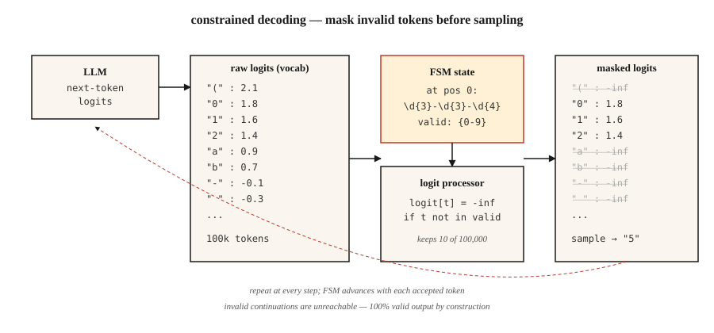

# Yapılandırılmış Çıktılar ve Kısıtlanmış Kodlama

> Bir LLM'den JSON isteyin. Çoğu zaman JSON alınır. Production'da "çoğu" sorundur. Kısıtlanmış kodlama (constrained decoding), örneklemeden önce logit'leri düzenleyerek "çoğu"yu her zaman" haline getirir.

**Tür:** İnşa
**Diller:** Python
**Ön koşullar:** Faz 5 · 17 (Sohbet Botları), Faz 5 · 19 (Subword Tokenizasyon)
**Süre:** ~60 dakika

## Problem

Bir sınıflandırıcı bir LLM'e prompt verir: "{positive, negative, neutral} değerlerinden birini döndürün." Model "Duygu positive — bu inceleme müşterinin açıkça belirttiği şekilde ... nedeniyle son derece olumlu" yanıtını döndürür. Parser'ınız çöker. Sınıflandırıcınızın F1'i 0.0 olur.

Serbest form üretimi bir sözleşme değildir. Bir öneridir. Bir production sisteminin bir sözleşmeye ihtiyacı vardır.

2026'da üç katman vardır.

1. **Promptlama.** Nazikçe isteyin. "Yalnızca JSON nesnesini döndürün." Öncü modellerde ~%80 çalışır, daha küçüklerde daha az.
2. **Yerel yapılandırılmış çıktı API'leri.** OpenAI `response_format`, Anthropic tool use, Gemini JSON modu. Desteklenen şemalarda güvenilir. Satıcıya kilitli.
3. **Kısıtlanmış kodlama.** Her üretim adımında logit'leri öyle değiştirin ki model *geçersiz token'lar üretemez*. Yapısal olarak %100 geçerli. Herhangi bir yerel modelde çalışır.

Bu ders üçü için de sezgi oluşturur ve hangisine ne zaman başvurulacağını belirtir.

## Kavram



**Kısıtlanmış kodlama nasıl çalışır.** Her üretim adımında LLM, tüm sözlük (~100k token) üzerine bir logit vektörü üretir. Bir *logit işleyici* (logit processor), model ve örnekleme (sampler) arasına oturur. Hedef dilbilgisindeki (JSON Schema, regex, bağlam-dilbilimsel dilbilgisi) mevcut konuma göre hangi token'ların geçerli olduğunu hesaplar ve tüm geçersiz token'ların logit'lerini sonsuz negatife ayarlar. Kalan logit'ler üzerindeki softmax olasılık kütlelerini yalnızca geçerli devamlara koyar.

2026'daki uygulamalar:

- **Outlines.** JSON Schema veya regex'i sonlu durum makinesine (finite-state machine) derler. Her token için O(1) geçerli-sonraki-token araması. FSM tabanlı, bu nedenle özyinelemeli şemalar düzleştirilme gerektirir.
- **XGrammar / llguidance.** Bağlam-dilbilimsel dilbilgisi motorları. Özyinelemeli JSON Schema'yı ele alır. Sıfıra yakın kodlama yükü. OpenAI, 2025 yapılandırılmış çıktı uygulamasında llguidance'a atıfta bulundu.
- **vLLM guided decoding.** Outlines, XGrammar veya lm-format-enforcer arka uçlarıyla yerleşik `guided_json`, `guided_regex`, `guided_choice`, `guided_grammar`.
- **Instructor.** Herhangi bir LLM üzerinde Pydantic tabanlı sarmalayıcı. Doğrulama hatasında yeniden dener. Sağlayıcılar arası, ancak logit'leri değiştirmez — yeniden deneme + yapılandırılmış çıktı-aware promptlara dayanır.

### Çelişkili sonuç

Kısıtlanmış kodlama genellikle kısıtlamasızcılıktan *daha hızlıdır*. İki neden. Birincisi, sonraki-token arama alanını daraltır. İkincisi, zekice uygulamalar zorunlu token'lar için (iskele `{"name": "` — her byte belirlenmiştir) token üretimini tamamen atlar.

### Maliyeti olan tuzak

Alan sırası önemlidir. `answer`'ı `reasoning`'den önce koyun ve model düşünmeden bir cevaba kendini bağlar. JSON geçerlidir. Cevap yanlıştır. Hiçbir doğrulama bunu yakalamaz.

```json
// KÖTÜ
{"answer": "yes", "reasoning": "because ..."}

// İYİ
{"reasoning": "... therefore ...", "answer": "yes"}
```

#### Açıklama
Şema alan sırası mantıksal bir karardır, biçimlendirme değil.

## İnşa Et

### Adım 1: sıfırdan regex-kısıtlanmış üretim

Bağımsız bir FSM uygulaması için `code/main.py`'ye bakın. 30 satırlık temel fikir:

```python
def mask_logits(logits, valid_token_ids):
    mask = [float("-inf")] * len(logits)
    for tid in valid_token_ids:
        mask[tid] = logits[tid]
    return mask


def generate_constrained(model, tokenizer, prompt, fsm):
    ids = tokenizer.encode(prompt)
    state = fsm.initial_state
    while not fsm.is_accept(state):
        logits = model.next_token_logits(ids)
        valid = fsm.valid_tokens(state, tokenizer)
        logits = mask_logits(logits, valid)
        tok = sample(logits)
        ids.append(tok)
        state = fsm.transition(state, tok)
    return tokenizer.decode(ids)
```

#### Açıklama
FSM, dilbilgisinin hangi kısımlarını şimdiye kadar tatmin ettiğimizi takip eder. `valid_tokens(state, tokenizer)`, FSM'i kabul yolundan çıkarmadan ilerletebilecek sözlük token'larını hesaplar.

### Adım 2: JSON Schema için Outlines

```python
from pydantic import BaseModel
from typing import Literal
import outlines


class Review(BaseModel):
    sentiment: Literal["positive", "negative", "neutral"]
    confidence: float
    evidence_span: str


model = outlines.models.transformers("meta-llama/Llama-3.2-3B-Instruct")
generator = outlines.generate.json(model, Review)

result = generator("Classify: 'The wait staff was attentive and the food arrived hot.'")
print(result)
# Review(sentiment='positive', confidence=0.93, evidence_span='attentive ... hot')
```

#### Açıklama
Sıfır doğrulama hatası. Asla. FSM, geçersiz çıktıyı erişilemez kılar.

### Adım 3: sağlayıcı-bağımsız Pydantic için Instructor

```python
import instructor
from anthropic import Anthropic
from pydantic import BaseModel, Field


class Invoice(BaseModel):
    vendor: str
    total_usd: float = Field(ge=0)
    line_items: list[str]


client = instructor.from_anthropic(Anthropic())
invoice = client.messages.create(
    model="claude-opus-4-7",
    max_tokens=1024,
    response_model=Invoice,
    messages=[{"role": "user", "content": "Extract from: 'Acme Corp $420. Widget, Gizmo.'"}],
)
```

#### Açıklama
Farklı mekanizma. Instructor logit'lere dokunmaz. Şemayı prompt'a biçimlendirir, çıktıyı ayrıştırır ve doğrulama hatasında yeniden dener (varsayılan 3 kez). Herhangi bir sağlayıcıyla çalışır. Yeniden denemeler gecikme ve maliyet ekler. Sağlayıcılar arası taşınabilirlik satış noktasıdır.

### Adım 4: yerel sağlayıcı API'leri

```python
from openai import OpenAI

client = OpenAI()
response = client.responses.create(
    model="gpt-5",
    input=[{"role": "user", "content": "Classify: 'The food was cold.'"}],
    text={"format": {"type": "json_schema", "name": "sentiment",
          "schema": {"type": "object", "required": ["sentiment"],
                     "properties": {"sentiment": {"type": "string",
                                                  "enum": ["positive", "negative", "neutral"]}}}}},
)
print(response.output_parsed)
```

#### Açıklama
Sunucu tarafı kısıtlanmış kodlama. Desteklenen şemalar için Outlines ile güvenilirlik eşitliği. Yerel model yönetimi yok. Sizi sağlayıcıya kilitler.

## Tuzaklar

- **Özyinelemeli şemalar.** Outlines递归lemeyi sabit bir derinliğe düzleştirir. Ağacı yapılandırılmış çıktılar (içe içe yorumlar, AST) XGrammar veya llguidance (CFG tabanlı) gerektirir.
- **Devasa enum'lar.** 10.000 seçeneğli enum yavaş derlenir veya zaman aşımına uğrar. Bir retriever'a geçin: önce üst-k adayları tahmin edin, bunlara kısıtlayın.
- **Dilbilgisi çok katı.** `date: "YYYY-MM-DD"` regex'i zorlayınca model eksik tarihler için "unknown" üretemez. Model bir tarih uydurarak telafi eder. `null` veya bir işaretçiye (sentinel) izin verin.
- **Erken karar verme.** Yukarıdaki alan-sırası tuzağına bakın. Her zaman reasoning'i önce koyun.
- **Şemasız sağlayıcı JSON modu.** Saf JSON modu yalnızca geçerli JSON garantiler, sizin kullanım durumunuz için geçerli olduğunu garanti ETMEZ. Her zaman tam bir şema sağlayın.

## Kullan

2026 stacki:

| Durum | Seçin |
|-----------|------|
| OpenAI/Anthropic/Google modeli, basit şema | Yerel sağlayıcı yapılandırılmış çıktısı |
| Herhangi bir sağlayıcı, Pydantic iş akışı, yeniden denemeler tolere edilebilir | Instructor |
| Yerel model, %100 geçerlilik gereksinimi, düz şema | Outlines (FSM) |
| Yerel model, özyinelemeli şema | XGrammar veya llguidance |
| Kendi barındırdığınız çıkarım sunucusu | vLLM guided decoding |
| Yeniden denemelerin kabul edildiği toplu işleme | Instructor + en ucuz model |

## Ürün Olarak Kullan

`outputs/skill-structured-output-picker.md` olarak kaydedin:

```markdown
---
name: structured-output-picker
description: Choose a structured output approach, schema design, and validation plan.
version: 1.0.0
phase: 5
lesson: 20
tags: [nlp, llm, structured-output]
---

Given a use case (provider, latency budget, schema complexity, failure tolerance), output:

1. Mechanism. Native vendor structured output, Instructor retries, Outlines FSM, or XGrammar CFG. One-sentence reason.
2. Schema design. Field order (reasoning first, answer last), nullable fields for "unknown", enum vs regex, required fields.
3. Failure strategy. Max retries, fallback model, graceful `null` handling, out-of-distribution refusal.
4. Validation plan. Schema compliance rate (target 100%), semantic validity (LLM-judge), field-coverage rate, latency p50/p99.

Refuse any design that puts `answer` or `decision` before reasoning fields. Refuse to use bare JSON mode without a schema. Flag recursive schemas behind an FSM-only library.
```

#### Açıklama
Verilen kullanım durumu için yapılandırılmış çıktı yaklaşımı, şema tasarımı ve doğrulama planı seçen bir skill tanımıdır.

## Alıştırmalar

1. **Kolay.** Kısıtlanmış kodlama olmadan küçük bir açık-ağırlık modeli (örn. Llama-3.2-3B) `Review(sentiment, confidence, evidence_span)` için promptlayın. 100 inceleme üzerinde kaç tanesinin geçerli JSON olarak ayrıştırıldığını ölçün.
2. **Orta.** Aynı corpus'u Outlines JSON moduyla çalıştırın. Uyumluluk oranını, gecikmeyi ve anlamsal doğruluğu karşılaştırın.
3. **Zor.** Telefon numaraları için (`\d{3}-\d{3}-\d{4}`) sıfırdan bir regex-kısıtlamalı kodlayıcı uygulayın. 1000 örnek üzerinde 0 geçersiz çıktı doğrulayın.

## Temel Terimler

| Terim | İnsanlar ne der | Aslında ne anlama gelir |
|------|-----------------|-----------------------|
| Kısıtlanmış kodlama (Constrained decoding) | Geçerli çıktı zorla | Her üretim adımında geçersiz token logit'lerini maskeleyin. |
| Logit işleyici (Logit processor) | Kısıtlayan şey | Fonksiyon: `(logits, state) -> masked_logits`. |
| FSM | Sonlu durum makinesi | Derlenmiş dilbilgisi temsili; O(1) geçerli-sonraki-token araması. |
| CFG | Bağlam-dilbilimsel dilbilgisi | Özyinelemeyi ele alan dilbilgisi; FSM'den daha yavaş ama daha ifade gücü yüksek. |
| Şema alan sırası | Önemi var mı? | Evet — ilk alan karar verir; her zaman reasoning'i cevaptan önce koyun. |
| Guided decoding | vLLM'nin adı | Aynı kavram, çıkarım sunucusuna entegre. |
| JSON modu | OpenAI'nin erken versiyonu | JSON sözdizimini garanti eder; şema uyumunu garanti ETMEZ. |

## İleri Okuma

- [Willard, Louf (2023). Efficient Guided Generation for LLMs](https://arxiv.org/abs/2307.09702) — Outlines makalesi.
- [XGrammar paper (2024)](https://arxiv.org/abs/2411.15100) — hızlı CFG tabanlı kısıtlanmış kodlama.
- [vLLM — Structured Outputs](https://docs.vllm.ai/en/latest/features/structured_outputs.html) — çıkarım sunucusu entegrasyonu.
- [OpenAI — Structured Outputs guide](https://platform.openai.com/docs/guides/structured-outputs) — API referansı + dikkat edilecekler.
- [Instructor library](https://python.useinstructor.com/) — Pydantic + sağlayıcılar arası yeniden denemeler.
- [JSONSchemaBench (2025)](https://arxiv.org/abs/2501.10868) — 6 kısıtlanmış kodlama çerçevesinin benchmark'ı.
