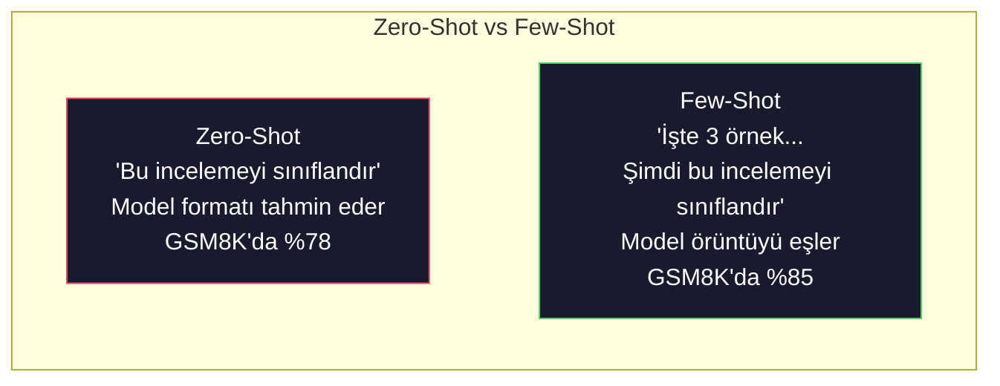
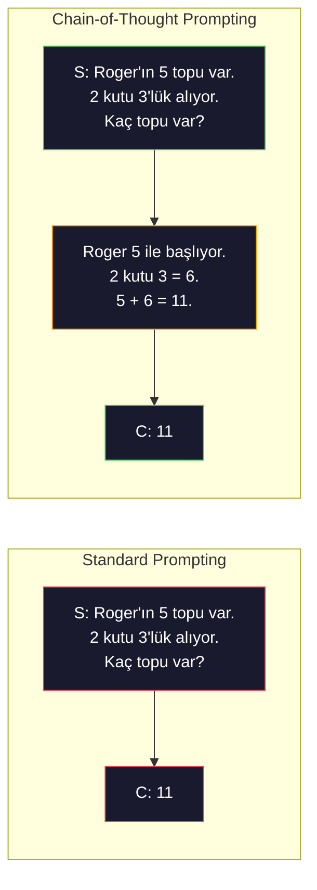
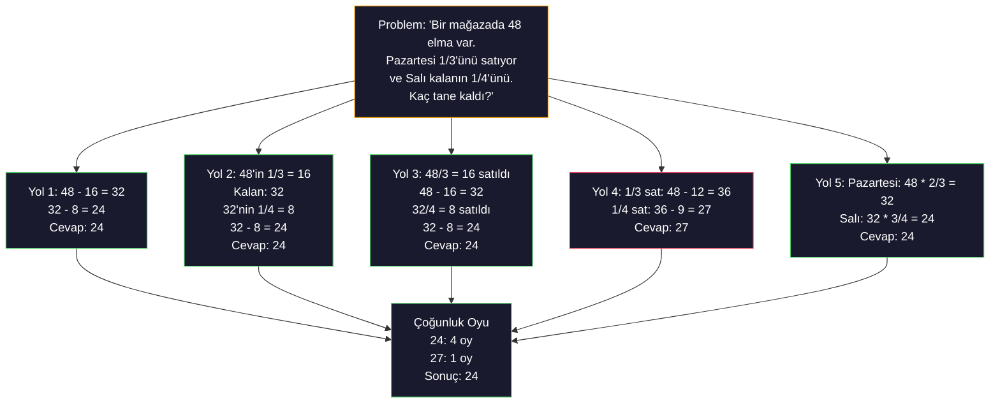
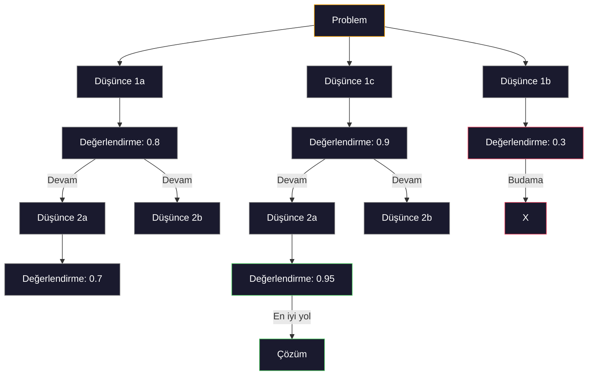
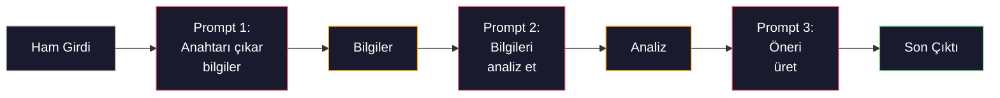

# Few-Shot, Chain-of-Thought, Tree-of-Thought

> Bir modele ne yapacağını söylemek prompt'tur. Nasıl düşüneceğini göstermek engineering'dir. Aynı modelde, aynı görevde, aynı veride %78 ve %91 doğruluk arasındaki fark daha iyi bir model değildir. Daha iyi bir muhakeme stratejisidir.

**Tür:** Build
**Diller:** Python
**Önkoşullar:** Lesson 11.01 (Prompt Engineering)
**Süre:** ~45 dakika

## Öğrenme Hedefleri

- Görev doğruluğunu maksimize eden örnek gösterimlerini seçerek ve formatlayarak few-shot prompting uygulamak
- Matematik sözel problemleri gibi çok adımlı sorularda doğruluğu artırmak için chain-of-thought (CoT) muhakemesini uygulamak
- Çoklu muhakeme yolunu keşfeden ve en iyisini seçen bir tree-of-thought prompt'u oluşturmak
- Zero-shot'a kıyasla few-shot ve CoT'un standart bir benchmark'ta doğruluk iyileştirmesini ölçmek

## Sorun

Bir matematik öğretici uygulaması geliştiriyorsunuz. Prompt'unuz diyor ki: "Bu sözel problemi çöz." GPT-5, standart ilkokul matematik benchmark'ı GSM8K'da bunu %94 doğru yapıyor. Zirvede olduğunuzu düşünüyorsunuz. Değilsiniz — chain-of-thought hala 3-4 puan ekler.

Beş kelime ekleyin — "Let's think step by step" — ve doğruluk %91'e fırlar. Birkaç worked örnek ekleyin %95'e ulaşır. Aynı model. Aynı temperature. Aynı API maliyeti. Tek fark, modele scratch paper vermeniz.

Bu bir hile değil. Muhakemenin nasıl çalıştığıdır. İnsanlar çok adımlı soruları tek bir zihinsel sıçramayla çözmez. Transformer'lar da çözmez. Bir modeli ara token'lar üretmeye zorladığınızda, bu token'lar bir sonraki token için bağlamın bir parçası olur. Her muhakeme adımı bir sonrakini besler. Model kelimenin tam anlamıyla hesaplayarak cevaba ulaşır.

Ama "adım adım düşün" başlangıçtır, son değil. Beş muhakeme yolu örnekleseydiniz ve çoğunluk oyu alsaydınız? Modelin olasılıkların bir ağacını keşfetmesine, dalgalanmasını ve budanmasını sağlasaydınız? Muhakemeyi araç kullanımıyla ördürseydiniz? Bunlar hayal ürünü değildir. Ölçülmüş iyileştirmeleri olan yayınlanmış tekniklerdir ve bunların hepsini bu derste inşa edeceksiniz.

## Kavram

### Zero-Shot vs Few-Shot: Ne Zaman Örnekler Talimatlardan Üstün Gelir

Zero-shot prompting modele bir görev ve başka hiçbir şey verir. Few-shot prompting önce örnekler verir.

Wei vd. (2022) bunu 8 benchmark'ta ölçmüştür. Duygu sınıflandırması gibi basit görevlerde, zero-shot ve few-shot birbirinin %2'si içinde çalıştı. Çok adımlı aritmetik ve sembolik muhakeme gibi karmaşık görevlerde, few-shot doğruluğu %10-25 artırdı.

 sezgi: örnekler sıkıştırılmış talimatlardır. Çıktı formatını açıklamak yerine gösteriyorsunuz. Muhakeme sürecini açıklamak yerine demonstrasyon yapıyorsunuz. Model soyut talimatlardan ziyade örüntülere daha güvenilir eşleşir.



#### Açıklama

**Few-shot'un kazandığı yerler:** format-duyarlı görevler, sınıflandırma, yapılandırılmış çıkarma, alana özgü jargon, modelin belirli bir örüntüyü eşleştirmesi gereken her görev.

**Zero-shot'ın kazandığı yerler:** basit olgusal sorular, örneklerin yaratıcılığı kısıtladığı yaratıcı görevler, iyi örneklerin iyi talimatlar yazmaktan daha zor olduğu görevler.

### Örnek Seçimi: Benzerlik Rastgelelikten Üstün Gelir

Tüm örnekler eşit değildir. Hedef input'a benzer örnekler seçmek, sınıflandırma görevlerinde rastgele seçimden %5-15 daha iyi çalışır (Liu vd., 2022). Üç ilke:

1. **Anlamsal benzerlik**: input'a embedding uzayında en yakın örnekleri seçin
2. **Etiket çeşitliliği**: örneklerinizde tüm çıktı kategorilerini kapsayın
3. **Zorluk eşleştirme**: hedef problemin karmaşıklık düzeyiyle eşleştirin

Çoğu görev için optimal örnek sayısı 3-5'tir. 3'ün altında, modelin örüntüyü çıkaracak kadar sinyali yoktur. 5'in üzerinde, azalan getirilere ulaşırsınız ve context window token'larını boşa harcarsınız. Çok etiketli sınıflandırmada, etiket başına bir örnek kullanın.

### Chain-of-Thought: Modellere Scratch Paper Vermek

Chain-of-Thought (CoT) prompting Wei vd. (2022) tarafından Google Brain'de tanıtılmıştır. Fikir basittir: modelden sadece cevap istemek yerine, önce muhakeme adımlarını göstermesini istersiniz.



#### Açıklama

Bu mekanik olarak neden çalışır? Bir transformer'ın ürettiği her token, bir sonraki token için bağlam haline gelir. CoT olmadan, model tüm muhakemeyi tek bir ileri geçişin gizli durumuna sıkıştırmalıdır. CoT ile, model ara hesaplamaları token olarak dışsallaştırır. Her muhakeme token'ı etkili hesaplama derinliğini uzatır.

**GSM8K benchmark'ları (ilkokul matematiği, 8.5K problem):**

| Model | Zero-Shot | Zero-Shot CoT | Few-Shot CoT |
|-------|-----------|---------------|--------------|
| GPT-4o | %78 | %91 | %95 |
| GPT-5 | %94 | %97 | %98 |
| o4-mini (reasoning) | %97 | — | — |
| Claude Opus 4.7 | %93 | %97 | %98 |
| Gemini 3 Pro | %92 | %96 | %98 |
| Llama 4 70B | %80 | %89 | %94 |
| DeepSeek-V3.1 | %89 | %94 | %96 |

**Reasoning modelleri hakkında not.** OpenAI'nin o-series (o3, o4-mini) ve DeepSeek-R1 gibi modeller cevaplarını vermeden önce chain-of-thought'u dahili olarak çalıştırır. Bir reasoning modele "Let's think step by step" eklemek gereksizdir ve bazen ters etkilidir — zaten yapmışlardır.

İki tür CoT:

**Zero-shot CoT**: prompt'a "Let's think step by step" ekleyin. Örnek gerekmez. Kojima vd. (2022) bu tek cümlenin aritmetik, ortak bilgi ve sembolik muhakeme görevlerinde doğruluğu artırdığını göstermiştir.

**Few-shot CoT**: muhakeme adımları içeren örnekler sağlayın. Zero-shot CoT'dan daha etkilidir çünkü model beklediğiniz tam muhakeme formatını görür.

**CoT'un zarar verdiği durumlar**: basit olgusal hatırlama ("Fransa'nın başkenti neresidir?"), tek adımlı sınıflandırma, hızın doğruluktan daha önemli olduğu görevler. CoT sorgu başına 50-200 token ek muhakeme yükü ekler. Yüksek throughput, düşük karmaşıklık görevleri için bu boşa harcanan maliyettir.

### Self-Consistency: Çok Örnekle, Bir Kez Oyla

Wang vd. (2023) self-consistency'yi tanıtmıştır. Tek bir CoT yolu muhakeme hataları içerebilir. Ama bağımsız N muhakeme yolu örneklerseniz (temperature > 0 kullanarak) ve nihai cevapta çoğunluk oyu alırsanız, hatalar birbirini götürür.



#### Açıklama

Self-consistency orijinal PaLM 540B deneylerinde N=40 ile GSM8K doğruluğunu tek CoT'dan %56.5'e %74.4 çıkarmıştır. GPT-5'te iyileşme küçüktür (%97'den %98'e) çünkü temel doğruluk zaten doygunluktadır. Teknik, %60-85 temel CoT doğruluğuna sahip modellerde en çok parlar — tek yol hatalarının sık ama sistematik olmadığı optimum nokta. Reasoning modelleri (o-series, R1) için self-consistency dahili örnekleme tarafından kapsanır.

Takas: N örnek, Nx API maliyeti ve gecikmesi demektir. Pratikte N=9大部分 faydayı yakalar. N=3 anlamlı bir oy için minimumdur. N > 10 çoğu görevde azalan getiri sağlar.

### Tree-of-Thought: Dalgalı Keşif

Yao vd. (2023) Tree-of-Thought'u (ToT) tanıtmıştır. CoT tek bir doğrusal muhakeme yolunu takip ederken, ToT birden fazla dalı keşfeder ve devam etmeden önce hangilerinin en umut verici olduğunu değerlendirir.



#### Açıklama

ToT'un üç bileşeni vardır:

1. **Düşünce üretimi**: birden fazla aday sonraki adım üretmek
2. **Durum değerlendirmesi**: her adayı puanlamak (LLM'in kendisini değerlendirici olarak kullanabilirsiniz)
3. **Arama algoritması**: ağaçta BFS veya DFS, düşük puanlı dalları budayarak

Game of 24 görevinde (4 sayıyı aritmetik kullanarak 24 yapma), standard promptlama ile GPT-4 problemlerin %7.3'ünü çözer. CoT ile %4.0 (CoT aslında burada zararlıdır çünkü arama alanı geniştir). ToT ile %74.

ToT pahalıdır. Ağaçtaki her düğüm bir LLM çağrısı gerektirir. 3 dallanma faktörlü ve 3 derinliğinde bir ağaç 39'a kadar LLM çağrısı gerektirir. Bunu sadece arama alanının geniş ama değerlendirilebilir olduğu problemlerde kullanın — planlama, bulmaca çözme, kısıtlamalı yaratıcı problem çözme.

### ReAct: Düşünme + Yapma

Yao vd. (2022) muhakeme izlerini eylemlerle birleştirdi. Model düşünme (muhakeme üretimi) ve eylem (araç çağrısı, arama, hesaplama) arasında dönüşümlü çalışır.

```mermaid
graph LR
    Q["Soru:\nEyfel Kulesi'nin\nbulunduğu ülkenin\nnüfusu nedir?"]
    T1["Düşünce: Hangi ülkede\nEyfel Kulesi var\nbulmalıyım"]
    A1["Eylem: ara\n'Eyfel Kulesi konumu'"]
    O1["Gözlem:\nParis, Fransa"]
    T2["Düşünce: Şimdi Fransa'nın\nnüfusuna ihtiyacım var"]
    A2["Eylem: ara\n'Fransa nüfusu 2024'"]
    O2["Gözlem:\n68.4 milyon"]
    T3["Düşünce: Cevabım\nvar"]
    F["Cevap:\n68.4 milyon"]

    Q --> T1 --> A1 --> O1 --> T2 --> A2 --> O2 --> T3 --> F

    style Q fill:#1a1a2e,stroke:#ffa500,color:#fff
    style T1 fill:#1a1a2e,stroke:#51cf66,color:#fff
    style A1 fill:#1a1a2e,stroke:#e94560,color:#fff
    style O1 fill:#1a1a2e,stroke:#808080,color:#fff
    style T2 fill:#1a1a2e,stroke:#51cf66,color:#fff
    style A2 fill:#1a1a2e,stroke:#e94560,color:#fff
    style O2 fill:#1a1a2e,stroke:#808080,color:#fff
    style T3 fill:#1a1a2e,stroke:#51cf66,color:#fff
    style F fill:#1a1a2e,stroke:#51cf66,color:#fff
```



#### Açıklama

ReAct, bilgi-yoğun görevlerde saf CoT'tan daha iyi çalışır çünkü muhakemesini gerçek verilere dayandırabilir. HotpotQA'da (çokluatlama cevaplama), GPT-4 ile ReAct %35.1 tam eşleşme sağlarken saf CoT %29.4'de kalır. Gerçek güç, muhakeme hatalarının gözlemlerle düzeltilmesindedir — model çalıştırma sırasında planını güncelleyebilir.

ReAct modern AI agent'larının temelidir. Her agent çerçeveisi (LangChain, CrewAI, AutoGen) Thought-Action-Observation döngüsünün bir çeşidini uygular. Phase 14'te tam agent'lar inşa edeceksiniz. Bu ders prompt örüntüsünü kapsar.

### Yapılandırılmış Promptlama: XML Etiketleri, Sınırlayıcılar, Başlıklar

Prompt'lar karmaşıklaştıkça, yapı modelin bölümleri karıştırmasını engeller. Üç yaklaşım:

**XML etiketleri** (Claude ile en iyi çalışır, her yerde sağlam):
```
<context>
You are reviewing a pull request.
The codebase uses TypeScript and React.
</context>

<task>
Review the following diff for bugs, security issues, and style violations.
</task>

<diff>
{diff_content}
</diff>

<output_format>
List each issue with: file, line, severity (critical/warning/info), description.
</output_format>
```

#### Açıklama

**Markdown başlıkları** (evrensel):
```
## Role
Senior security engineer at a fintech company.

## Task
Analyze this API endpoint for vulnerabilities.

## Input
{api_code}

## Rules
- Focus on OWASP Top 10
- Rate each finding: critical, high, medium, low
- Include remediation steps
```

#### Açıklama

**Sınırlayıcılar** (minimal ama etkili):
```
---INPUT---
{user_text}
---END INPUT---

---INSTRUCTIONS---
Summarize the above in 3 bullet points.
---END INSTRUCTIONS---
```

#### Açıklama

### Prompt Zincirleme: Ardışık Ayrıştırma

Bazı görevler tek prompt için çok karmaşıktır. Prompt zincirleme bunları adımlara böler, bir prompt'un çıktısı bir sonrakının girdisi haline gelir.



#### Açıklama

Zincirleme tek prompttan daha iyidir çünkü:

1. **Her adım daha basittir**: model her şeyi aynı anda halletmek yerine tek odaklı bir görevi ele alır
2. **Ara çıktılar denetlenebilir**: adımlar arasında doğrulayabilir ve düzeltebilirsiniz
3. **Farklı adımlar farklı modeller kullanabilir**: çıkarma için ucuz model, muhakeme için pahalı model kullanın

### Performans Karşılaştırması

| Teknik | En İyi Nerelerde | GSM8K Doğruluğu (GPT-5) | API Çağrıları | Token Yükü | Karmaşıklık |
|-----------|----------|------------------------|-----------|----------------|------------|
| Zero-Shot | Basit görevler | %94 | 1 | Yok | Trivial |
| Few-Shot | Format eşleştirme | %96 | 1 | 200-500 token | Düşük |
| Zero-Shot CoT | Hızlı muhakeme desteği | %97 | 1 | 50-200 token | Trivial |
| Few-Shot CoT | Maksimum tek çağrı doğruluğu | %98 | 1 | 300-600 token | Düşük |
| Self-Consistency (N=5) | Yüksek riskli muhakeme | %98.5 | 5 | 5x token maliyeti | Orta |
| Reasoning modeli (o4-mini) | Drop-in CoT ikamesi | %97 | 1 | gizli (2-10x dahili) | Trivial |
| Tree-of-Thought | Arama/planlama problemleri | Yok (Game of 24'te %74) | 10-40+ | 10-40x token maliyeti | Yüksek |
| ReAct | Bilgiye dayalı muhakeme | Yok (HotpotQA'da %35.1) | 3-10+ | Değişken | Yüksek |
| Prompt Zincirleme | Karmaşık çok adımlı görevler | %96 (pipeline) | 2-5 | 2-5x token maliyeti | Orta |

Doğru teknik üç faktöre bağlıdır: doğruluk gereksinimi, gecikme bütçesi ve maliyet toleransı. Çoğu üretim sistemi için, 3 örneklemeli self-consistency yedeği ile few-shot CoT kullanım senaryolarının %90'ını kapsar.

## İnşa Et

Bir few-shot promptlama, chain-of-thought muhakemesi ve self-consistency oylamasını tek bir pipeline'da birleştiren bir matematik problem çözücü inşa edeceğiz. Sonra zor problemler için tree-of-thought ekleyeceğiz.

Tam uygulama `code/advanced_prompting.py`'dedir. İşte ana bileşenler.

### Adım 1: Few-Shot Örnek Deposu

İlk bileşen few-shot örneklerini yönetir ve verilen bir problem için en alakalı olanları seçer.

```python
GSM8K_EXAMPLES = [
    {
        "question": "Janet's ducks lay 16 eggs per day. She eats three for breakfast every morning and bakes muffins for her friends every day with four. She sells every egg at the farmers' market for $2. How much does she make every day at the farmers' market?",
        "reasoning": "Janet's ducks lay 16 eggs per day. She eats 3 and bakes 4, using 3 + 4 = 7 eggs. So she has 16 - 7 = 9 eggs left. She sells each for $2, so she makes 9 * 2 = $18 per day.",
        "answer": "18"
    },
    ...
]
```

#### Açıklama

Her örneğin üç parçası vardır: soru, muhakeme zinciri ve nihai cevap. Muhakeme zinciri, normal bir few-shot örneğini CoT few-shot örneğine dönüştürendir.

### Adım 2: Chain-of-Thought Prompt Oluşturucu

Prompt oluşturucu bir system message, muhakeme zincirleriyle few-shot örnekleri ve hedef soruyu tek bir prompt'ta birleştirir.

```python
def build_cot_prompt(question, examples, num_examples=3):
    system = (
        "You are a math problem solver. "
        "For each problem, show your step-by-step reasoning, "
        "then give the final numerical answer on the last line "
        "in the format: 'The answer is [number]'."
    )

    example_text = ""
    for ex in examples[:num_examples]:
        example_text += f"Q: {ex['question']}\n"
        example_text += f"A: {ex['reasoning']} The answer is {ex['answer']}.\n\n"

    user = f"{example_text}Q: {question}\nA:"
    return system, user
```

#### Açıklama

Format kısıtlaması ("The answer is [number]") kritiktir. Olmadan, self-consistency örnekler arası cevapları çıkaramaz ve karşılaştıramaz.

### Adım 3: Self-Consistency Oylaması

N muhakeme yolu örnekleme ve çoğunluk cevabını alma.

```python
def self_consistency_solve(question, examples, client, model, n_samples=5):
    system, user = build_cot_prompt(question, examples)

    answers = []
    reasonings = []
    for _ in range(n_samples):
        response = client.chat.completions.create(
            model=model,
            messages=[
                {"role": "system", "content": system},
                {"role": "user", "content": user}
            ],
            temperature=0.7
        )
        text = response.choices[0].message.content
        reasonings.append(text)
        answer = extract_answer(text)
        if answer is not None:
            answers.append(answer)

    vote_counts = Counter(answers)
    best_answer = vote_counts.most_common(1)[0][0] if vote_counts else None
    confidence = vote_counts[best_answer] / len(answers) if best_answer else 0

    return best_answer, confidence, reasonings, vote_counts
```

#### Açıklama

Temperature 0.7 önemlidir. Temperature 0.0'da tüm N örnek birbirinin aynısı olur, amaca ters düşer. Çeşitli muhakeme yolları için yeterli rastgelelik gerekir ama modelin saçmalık üretmeyeceği kadar değil.

### Adım 4: Tree-of-Thought Çözücü

Doğrusal muhakemenin başarısız olduğu problemler için ToT çoklu yaklaşımı keşfeder ve hangi yönün en umut verici olduğunu değerlendirir.

```python
def tree_of_thought_solve(question, client, model, breadth=3, depth=3):
    thoughts = generate_initial_thoughts(question, client, model, breadth)
    scored = [(t, evaluate_thought(t, question, client, model)) for t in thoughts]
    scored.sort(key=lambda x: x[1], reverse=True)

    for current_depth in range(1, depth):
        next_thoughts = []
        for thought, score in scored[:2]:
            extensions = extend_thought(thought, question, client, model, breadth)
            for ext in extensions:
                ext_score = evaluate_thought(ext, question, client, model)
                next_thoughts.append((ext, ext_score))
        scored = sorted(next_thoughts, key=lambda x: x[1], reverse=True)

    best_thought = scored[0][0] if scored else ""
    return extract_answer(best_thought), best_thought
```

#### Açıklama

Değerlendirici LLM çağrısıdır. Modelden sorarsınız: "0.0 ile 1.0 arasında, bu muhakeme yolunun problemi çözme konusunda ne kadar umut verici olduğunu puanlayabilir misiniz?" Bu ToT'un temel anlayışıdır — model kendi kısmi çözümlerini değerlendirir.

### Adım 5: Tam Pipeline

Pipeline tüm teknikleri bir yükseltme stratejisiyle birleştirir.

```python
def solve_with_escalation(question, examples, client, model):
    system, user = build_cot_prompt(question, examples)
    single_response = call_llm(client, model, system, user, temperature=0.0)
    single_answer = extract_answer(single_response)

    sc_answer, confidence, _, _ = self_consistency_solve(
        question, examples, client, model, n_samples=5
    )

    if confidence >= 0.8:
        return sc_answer, "self_consistency", confidence

    tot_answer, _ = tree_of_thought_solve(question, client, model)
    return tot_answer, "tree_of_thought", None
```

#### Açıklama

Yükseltme mantığı: önce ucuzu (tek CoT) deneyin. Self-consistency güveni 0.8'in altındaysa (5 örneğin 4'ünden azı katılıyorsa), ToT'a yükseltin. Bu maliyet ve doğruluk arasında denge kurar — çoğu problem ucuza çözülür, zor problemler daha fazla hesaplama alır.

## Kullan

### LangChain ile

LangChain, few-shot ve CoT örüntülerini basitleştiren prompt şablonları ve çıktı ayrıştırma için yerleşik destek sağlar:

```python
from langchain_core.prompts import FewShotPromptTemplate, PromptTemplate
from langchain_openai import ChatOpenAI

example_prompt = PromptTemplate(
    input_variables=["question", "reasoning", "answer"],
    template="Q: {question}\nA: {reasoning} The answer is {answer}."
)

few_shot_prompt = FewShotPromptTemplate(
    examples=examples,
    example_prompt=example_prompt,
    suffix="Q: {input}\nA: Let's think step by step.",
    input_variables=["input"]
)

llm = ChatOpenAI(model="gpt-4o", temperature=0.7)
chain = few_shot_prompt | llm
result = chain.invoke({"input": "If a train travels 120 km in 2 hours..."})
```

#### Açıklama

LangChain'in anlamsal benzerlik seçimi için `ExampleSelector` sınıfları da vardır:

```python
from langchain_core.example_selectors import SemanticSimilarityExampleSelector
from langchain_openai import OpenAIEmbeddings

selector = SemanticSimilarityExampleSelector.from_examples(
    examples,
    OpenAIEmbeddings(),
    k=3
)
```

#### Açıklama

### DSPy ile

DSPy prompt stratejilerini optimize edilebilir modüller olarak ele alır. CoT prompt'larını elle oluşturmak yerine bir imza tanımlarsınız ve DSPy'nin prompt'u optimize etmesine izin verirsiniz:

```python
import dspy

dspy.configure(lm=dspy.LM("openai/gpt-4o", temperature=0.7))

class MathSolver(dspy.Module):
    def __init__(self):
        self.solve = dspy.ChainOfThought("question -> answer")

    def forward(self, question):
        return self.solve(question=question)

solver = MathSolver()
result = solver(question="Janet's ducks lay 16 eggs per day...")
```

#### Açıklama

DSPy'nin `ChainOfThought`'u otomatik olarak muhakeme izleri ekler. `dspy.majority` self-consistency'yi uygular:

```python
result = dspy.majority(
    [solver(question=q) for _ in range(5)],
    field="answer"
)
```

#### Açıklama

### Karşılaştırma: Sıfırdan vs Çerçeveler

| Özellik | Sıfırdan (bu ders) | LangChain | DSPy |
|---------|--------------------------|-----------|------|
| Prompt formatı kontrolü | Tam | Şablon tabanlı | Otomatik |
| Self-consistency | Elle oylama | Elle | Yerleşik (`dspy.majority`) |
| Örnek seçimi | Özel mantık | `ExampleSelector` | `dspy.BootstrapFewShot` |
| Tree-of-Thought | Özel ağaç araması | Topluluk zincirleri | Yerleşik değil |
| Prompt optimizasyonu | Elle iterasyon | Elle | Otomatik derleme |
| En iyi nerede | Öğrenme, özel pipeline'lar | Standart iş akışları | Araştırma, optimizasyon |

## Gönder

Bu ders iki çıktı üretir.

**1. Muhakeme Zinciri Promptu** (`outputs/prompt-reasoning-chain.md`): self-consistency ile few-shot CoT için üretim-hazır bir prompt şablonu. Örneklerinizi ve görev alanınızı ekleyin.

**2. CoT Örüntü Seçimi Becerisi** (`outputs/skill-cot-patterns.md`): görev türüne, doğruluk gereksinimlerine ve maliyet kısıtlamalarına göre doğru muhakeme tekniğini seçmek için bir karar çerçevesi.

## Alıştırmalar

1. **Farkı ölçün**: 10 GSM8K problemi alın. Her birini zero-shot, few-shot, zero-shot CoT ve few-shot CoT ile çözün. Her biri için doğruluğu kaydedin. Modelinizde hangi teknik en büyük artışı sağlar?

2. **Örnek seçimi deneyi**: Aynı 10 problem için rastgele örnek seçimi ile elle seçilmiş benzer örnekleri karşılaştırın. Doğruluk farkını ölçün. Örnek kalitesinin örnek miktarından ne zaman daha önemli hale geldiğini bulun.

3. **Self-consistency maliyet eğrisi**: 20 GSM8K problemi üzerinde N=1, 3, 5, 7, 10 ile self-consistency çalıştırın. Doğruluk vs maliyeti (toplam token) çizin. Modeliniz için eğrinin dirsek noktası nerede?

4. **Bir ReAct döngüsü inşa edin**: Pipeline'ı bir hesap makinesi aracıyla genişletin. Model bir matematik ifadesi ürettiğinde, Python'un `eval()`'i ile çalıştırın (sandbox'ta) ve sonucu geri besleyin. Araçla desteklenen muhakemenin saf CoT'tan daha iyi çalışıp çalışmadığını ölçün.

5. **Yaratıcı görevler için ToT**: Tree-of-Thought çözücüyü yaratıcı bir yazma görevi için uyarlayın: "Hem komik hem de üzücü olan 6 kelimelik bir hikaye yazın." LLM'i değerlendirici olarak kullanın. Dalgalı keşif, tek atışlı üretimden daha iyi yaratıcı çıktılar üretiyor mu?

## Anahtar Terimler

| Terim | İnsanlar ne söylüyor | Gerçekte ne anlama geliyor |
|------|----------------------|--------------------------|
| Few-shot prompting | "Biraz örnek ver" | Modelin çıktı formatını ve davranışını sabitlemek için prompt'a input-output gösterimleri eklemek |
| Chain-of-Thought | "Adım adım düşündürsün" | Nihai cevabı üretmeden önce modelin etkili hesaplama derinliğini uzatan ara muhakeme token'larını çıkarmak |
| Self-Consistency | "Birkaç kez çalıştır" | Temperature > 0 ile çeşitli muhakeme yollarını örnekleme ve çoğunluk oyuyla en sık rastlanan nihai cevabı seçme |
| Tree-of-Thought | "Seçenekleri keşfetsin" | Her kısmi çözümün değerlendirildiği ve sadece umut verici yolların genişletildiği muhakeme dalları üzerinde yapılandırılmış arama |
| ReAct | "Düşünme + araç kullanımı" | Thought-Action-Observing döngüsünde muhakeme izlerini dış eylemlerle (arama, hesaplama, API çağrıları) örmek |
| Prompt zincirleme | "Adımlara böl" | Karmaşık bir görevi ardışık prompt'lara ayırma, her çıktının bir sonraki girdiye beslenmesi |
| Zero-shot CoT | "Sadece 'adım adım düşün' ekle" | Herhangi bir örnek olmadan prompt'a bir muhakeme tetikleme ifadesi ekleyerek modelin gizli muhakeme kapasitesine güvenmek |

## İleri Okuma

- [Chain-of-Thought Prompting Elicits Reasoning in Large Language Models](https://arxiv.org/abs/2201.11903) — Wei vd. 2022. Google Brain'den orijinal CoT makalesi. Temel sonuçlar için bölümler 2-3'ü okuyun.
- [Self-Consistency Improves Chain of Thought Reasoning in Language Models](https://arxiv.org/abs/2203.11171) — Wang vd. 2023. Self-consistency makalesi. 1. tablo ihtiyacınız olan tüm sayıları içerir.
- [Tree of Thoughts: Deliberate Problem Solving with Large Language Models](https://arxiv.org/abs/2305.10601) — Yao vd. 2023. ToT makalesi. Bölüm 4'teki Game of 24 sonuçları öne çıkan noktadır.
- [ReAct: Synergizing Reasoning and Acting in Language Models](https://arxiv.org/abs/2210.03629) — Yao vd. 2022. Modern AI agent'larının temeli. Bölüm 3 Thought-Action-Observation döngüsünü açıklar.
- [Large Language Models are Zero-Shot Reasoners](https://arxiv.org/abs/2205.11916) — Kojima vd. 2022. "Let's think step by step" makalesi. Basitliğine rağmen şaşırtıcı derecede etkili.
- [DSPy: Compiling Declarative Language Model Calls into Self-Improving Pipelines](https://arxiv.org/abs/2310.03714) — Khattab vd. 2023. Promptlamayı bir derleme sorunu olarak ele alır. Manuel prompt engineering'den ötesine geçmek istiyorsanız okuyun.
- [OpenAI — Reasoning models guide](https://platform.openai.com/docs/guides/reasoning) — chain-of-thought'un dahili, token-başına ücretlendirilen "reasoning" modu mu yoksa prompt düzeyinde bir hile mi olduğu konusunda sağlayıcı rehberliği.
- [Lightman vd., "Let's Verify Step by Step" (2023)](https://arxiv.org/abs/2305.20050) — zincirin her adımlını notlandıran process reward modelleri (PRM); sadece sonuca dayalı ödülleri başaran muhakeme gözetim sinyali.
- [Snell vd., "Scaling LLM Test-Time Compute Optimally" (2024)](https://arxiv.org/abs/2408.03314) — CoT uzunluğu, self-consistency örnekleme ve MCTS'nin sistematik çalışması; "adım adım düşün"ün gecikmeden çok doğruluk önemli olduğunda gittiği yer.
