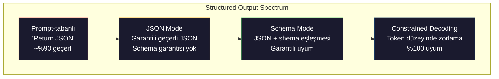
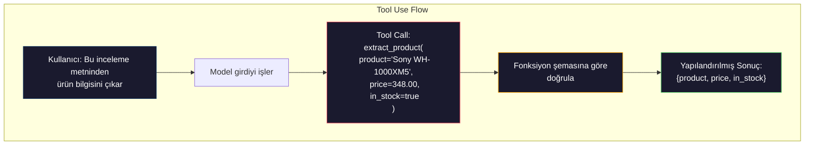

# Structured Outputs: JSON, Schema Validation, Constrained Decoding

> LLM'niz bir string döndürür. Uygulamanızın JSON'a ihtiyacı vardır. Bu boşluk, herhangi bir model hallucination'ından daha fazla üretim sistemi çökertmiştir. Yapılandırılmış çıktı, doğal dil ile tipli veri arasındaki köprüdür.

**Tür:** Build
**Diller:** Python
**Önkoşullar:** Phase 10, Lessons 01-05 (LLMs from Scratch)
**Süre:** ~90 dakika

## Öğrenme Hedefleri

- OpenAI ve Anthropic API parametreleri kullanarak JSON-mode ve schema-kısıtlı çıktılar uygulamak
- Hatalı LLM çıktılarını reddeden ve hata geri bildirimiyle yeniden deneyen bir Pydantic doğrulama katmanı oluşturmak
- Constrained decoding'in token düzeyinde geçerli JSON'u nasıl zorladığını açıklamak
- Yapılandırılmamış metni tipli veri yapılarına güvenilir olarak dönüştüren sağlam çıkarma prompt'ları tasarlamak

## Kavram

### Yapılandırılmış Çıktı Spektrumu

Dört düzey yapılandırılmış çıktı kontrolü vardır, her biri bir öncekinden daha güvenilirdir.



#### Açıklama

**Prompt-tabanlı** (`Respond in valid JSON`): zorlama yok. Model genellikle uyar ama her zaman uymaz. Güvenilirlik: ~%90. Hata modu: markdown çitleri, giriş metni, kesilmiş çıktı, yanlış yapı.

**JSON mode**: API çıktının geçerli JSON olduğunu garanti eder. OpenAI'nin `response_format: { type: "json_object" }` seçeneği bunu etkinleştirir. Çıktı hata olmadan ayrıştırılır. Ama beklenen şemanızla eşleşmeyebilir — ek anahtarlar, yanlış türler, eksik alanlar.

**Schema mode**: API bir JSON Schema alır ve çıktının onunla eşleştiğini garanti eder. 2026'da her büyük sağlayıcı bunu yerel olarak destekler: OpenAI'nin `response_format: { type: "json_schema", json_schema: {...} }` (ayrıca `tool_choice="required"` olarak), Anthropic'in `input_schema` ile tool use'u ve Gemini'nin `response_schema` + `response_mime_type: "application/json"` seçeneği. Çıktı, belirttiğiniz tam anahtarları, türleri ve kısıtlamaları içerir.

**Constrained decoding**: Üretim sırasında her token konumunda, decoder geçersiz çıktı üretecek tüm token'ları maskeler. Şema bir sayı gerektiriyorsa ve model bir harf çıkarmak üzereyse, o token'ın olasılığı sıfıra ayarlanır. Model sadece geçerli çıktıya götürebilecek token'ları üretebilir. Bu, OpenAI'nin structured output modu ve Outlines ile Guidance gibi kütüphanelerin altında yatan şeydir.

### JSON Schema: Sözleşme Dili

JSON Schema, modelin (veya doğrulama katmanının) çıktının ne tür bir forma sahip olması gerektiğini bildiği yoldur. Her büyük yapılandırılmış çıktı sistemi bunu kullanır.

```json
{
 "type": "object",
 "properties": {
 "product": { "type": "string" },
 "price": { "type": "number", "minimum": 0 },
 "in_stock": { "type": "boolean" },
 "categories": {
 "type": "array",
 "items": { "type": "string" }
 }
 },
 "required": ["product", "price", "in_stock"]
}
```

#### Açıklama

Bu şema şunu söylüyor: çıktı, bir string `product`, negatif olmayan bir number `price`, bir boolean `in_stock` ve isteğe bağlı bir string dizisi `categories` içeren bir nesne olmalıdır. Eşleşmeyen herhangi bir çıktı reddedilir.

### Pydantic Örüntüsü

Python'da JSON Schema'yı elle yazmazsınız. Bir Pydantic modeli tanımlarsınız ve şemayı sizin için otomatik olarak üretir.

```python
from pydantic import BaseModel

class Product(BaseModel):
 product: str
 price: float
 in_stock: bool
 categories: list[str] = []
```

#### Açıklama

Bu, yukarıdaki ile aynı JSON Schema'yı üretir. Instructor kütüphanesi (ve OpenAI'nin SDK'sı) Pydantic modellerini doğrudan kabul eder: model sınıfını geçirin, doğrulanmış bir örneği geri alın. LLM çıktısı eşleşmiyorsa, Instructor otomatik olarak yeniden dener.

### Fonksiyon Çağırmalı / Araç Kullanımı

Aynı sorun için alternatif bir arayüzdür. Modelden JSON'u doğrudan üretmesini istemek yerine, tipli parametreleri olan "araçlar" (fonksiyonlar) tanımlarsınız. Model, yapılandırılmış bağımsız değişkenlerle bir fonksiyon çağrısı çıktısı üretir. OpenAI buna "function calling" der. Anthropic buna "tool use" der. Sonuç aynıdır: yapılandırılmış veri.



#### Açıklama

Araç kullanımı, modelin sadece parametreleri doldurmak yerine hangi fonksiyonu çağırmaya ihtiyacı olduğuna karar vermesi gerektiğinde tercih edilir. 10 farklı çıkarma şemanız varsa ve model girdiye göre doğru olanı seçmelidir, araç kullanımı hem şema seçimini hem de yapılandırılmış çıktıyı sağlar.

## İnşa Et

### Adım 1: JSON Schema Doğrulayıcı

Bir Python nesnesinin bir JSON Schema ile eşleşip eşleşmediğini kontrol eden sıfırdan bir doğrulayıcı inşa edin.

```python
import json

def validate_schema(data, schema):
 errors = []
 _validate(data, schema, "", errors)
 return errors

def _validate(data, schema, path, errors):
 schema_type = schema.get("type")

 if schema_type == "object":
 if not isinstance(data, dict):
 errors.append(f"{path}: expected object, got {type(data).__name__}")
 return
 for key in schema.get("required", []):
 if key not in data:
 errors.append(f"{path}.{key}: required field missing")
 properties = schema.get("properties", {})
 for key, value in data.items():
 if key in properties:
 _validate(value, properties[key], f"{path}.{key}", errors)

 elif schema_type == "array":
 if not isinstance(data, list):
 errors.append(f"{path}: expected array, got {type(data).__name__}")
 return
 min_items = schema.get("minItems", 0)
 max_items = schema.get("maxItems", float("inf"))
 if len(data) < min_items:
 errors.append(f"{path}: array has {len(data)} items, minimum is {min_items}")
 if len(data) > max_items:
 errors.append(f"{path}: array has {len(data)} items, maximum is {max_items}")
 items_schema = schema.get("items", {})
 for i, item in enumerate(data):
 _validate(item, items_schema, f"{path}[{i}]", errors)

 elif schema_type == "string":
 if not isinstance(data, str):
 errors.append(f"{path}: expected string, got {type(data).__name__}")
 return
 enum_values = schema.get("enum")
 if enum_values and data not in enum_values:
 errors.append(f"{path}: '{data}' not in allowed values {enum_values}")

 elif schema_type == "number":
 if not isinstance(data, (int, float)):
 errors.append(f"{path}: expected number, got {type(data).__name__}")
 return
 minimum = schema.get("minimum")
 maximum = schema.get("maximum")
 if minimum is not None and data < minimum:
 errors.append(f"{path}: {data} is less than minimum {minimum}")
 if maximum is not None and data > maximum:
 errors.append(f"{path}: {data} is greater than maximum {maximum}")

 elif schema_type == "boolean":
 if not isinstance(data, bool):
 errors.append(f"{path}: expected boolean, got {type(data).__name__}")

 elif schema_type == "integer":
 if not isinstance(data, int) or isinstance(data, bool):
 errors.append(f"{path}: expected integer, got {type(data).__name__}")
```

#### Açıklama

## Anahtar Terimler

| Terim | İnsanlar ne söylüyor | Gerçekte ne anlama geliyor |
|------|----------------------|--------------------------|
| JSON mode | "JSON döndürür" | Sözdizimsel olarak geçerli JSON çıktısını garanti eden API bayrağı, ancak belirli bir şemayı zorlamaz |
| Yapılandırılmış çıktı | "Tipli JSON" | Belirli bir JSON Schema ile eşleşen, doğru anahtarlar, türler ve kısıtlamalara sahip çıktı |
| Constrained decoding | "Yönlendirilmiş üretim" | Her token konumunda, geçersiz çıktı üretecek token'ları maskeleyerek %100 şema uyumu garanti eder |
| JSON Schema | "Bir JSON şablonu" | JSON verisinin yapısını, türlerini ve kısıtlamalarını tanımlayan bildirimsel dil (OpenAPI, JSON Forms vb. tarafından kullanılır) |
| Pydantic | "Python dataclasses+" | Tür doğrulaması ile veri modelleri tanımlayan Python kütüphanesi, FastAPI ve Instructor tarafından JSON Schema üretmek için kullanılır |

## İleri Okuma

- [OpenAI Structured Outputs Guide](https://platform.openai.com/docs/guides/structured-outputs) — OpenAI API'sinde JSON Schema tabanlı constrained decoding için resmi belgeler
- [Willard & Louf, 2023 — "Efficient Guided Generation for Large Language Models"](https://arxiv.org/abs/2307.09702) — Outlines makalesi, JSON Schema'ların token düzeyinde kısıtlamalar için sonlu durum makinelerine nasıl derlendiğini açıklar
- [Instructor documentation](https://python.useinstructor.com/) — Pydantic doğrulaması ve yeniden denemelerle herhangi bir LLM'den yapılandırılmış çıktılar almak için standart kütüphane
- [Anthropic Tool Use Guide](https://docs.anthropic.com/en/docs/tool-use) — Claude'un JSON Schema input_schema ile tool use aracılığıyla nasıl yapılandırılmış çıktı uyguladığı
- [JSON Schema specification](https://json-schema.org/) — Her büyük yapılandırılmış çıktı sistemi tarafından kullanılan şema dilinin tam teknik özelliği