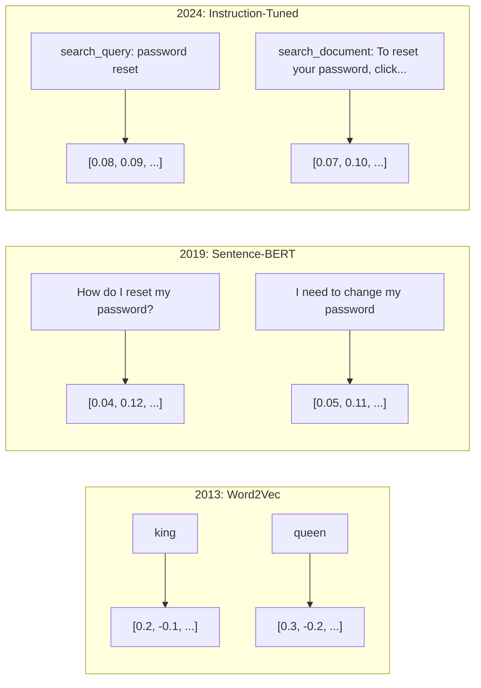
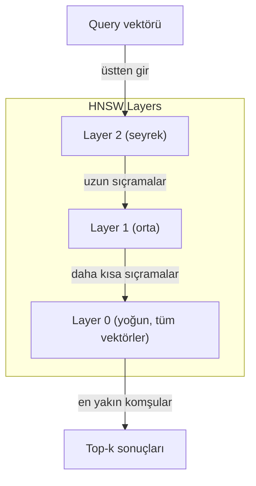

# Embeddings ve Vektör Temsilleri

> Metin diskretdir. Matematik sürekolidir. Her LLM'den "benzer" belgeleri bulmasını, anlamları karşılaştırmasını veya anahtar kelimelerin ötesinde arama yapmasını istediğinizde, bu iki dünya arasındaki bir köprüye güveniyorsunuz. O köprü bir embedding'dir. Embedding'leri anlamıyorsanız, modern AI'yı anlamıyorsunuz. Sadece kullanıyorsunuz.

**Tür:** Build
**Diller:** Python
**Önkoşullar:** Phase 11, Lesson 01 (Prompt Engineering)
**Süre:** ~75 dakika

## Öğrenme Hedefleri

- API sağlayıcıları ve açık kaynak modelleri kullanarak metin embedding'leri oluşturmak ve cosine similarity hesaplamak
- Embedding'lerin keyword search'un başaramadığı vocabulary mismatch sorununu neden çözdüğünü açıklamak
- Anlam, tam anahtar kelime eşleştirmesi yerine belgeleri getiren bir semantic search indeksi oluşturmak
- Retrieval benchmark'ları (precision@k, recall) kullanarak embedding kalitesini değerlendirmek ve göreviniz için doğru embedding modelini seçmek

## Kavram

### Embedding Nedir?

Bir embedding, metnin anlamını temsil eden yoğun (dense) bir浮点数 vektörüdür. "Yoğun" kelimesi önemlidir — her boyut bilgi taşır, çoğunda sıfır olan seyrek (sparse) temsillerden (bag-of-words, TF-IDF) farklıdır.

"The cat sat on the mat" şöyle bir şeye dönüşür: `[0.023, -0.041, 0.087, ..., 0.012]` — modele bağlı olarak 768'den 3072'ye kadar sayı listesi. Bu sayılar anlamı kodlar. Onları doğrudan incelemezsiniz. Karşılaştırırsınız.

### Word2Vec Atılımı

2013'te Tomas Mikolov ve Google'daki meslektaşları Word2Vec'i yayımladı. Temel anlayış: bir sinir ağını bir kelimeyi komşularından (veya kelimeden komşuları) tahmin etmek için eğitin ve gizli katman ağırlıkları anlamlı vektör temsilleri haline gelir.

Meşhur sonuç:

```
king - man + woman = queen
```

#### Açıklama

Kelime embedding'lerinde vektör aritmeti anlamsal ilişkileri yakalar. "man"'dan "woman"a giden yön yaklaşık olarak "king"'den "queen"e giden yönle aynıdır. Alanın geometrinin anlamı kodlayabileceğini fark ettiği andı.

Word2Vec 300 boyutlu vektörler üretti. Her kelime bağlamdan bağımsız olarak bir vektör aldı. "river bank" ve "bank account"'taki "bank" aynı embedding'e sahipti. Bu sınırlama bir sonraki on yılın araştırmasını yönlendirdi.

### Kelimelerden Cümlelere

Kelime embedding'leri tek tek token'ları temsil eder. Üretim sistemleri tüm cümleleri, paragrafları veya belgeleri embedding yapmalıdır. Dört yaklaşım ortaya çıktı:

**Ortalama**: cümledeki tüm kelime vektörlerinin ortalamasını alın. ucuz, kayıplı, kısa metin için şaşırtıcı derecede iyi. Kelime sırasını tamamen kaybeder — "dog bites man" ve "man bites dog" aynı embedding'leri alır.

**CLS token**: transformer modelleri (BERT, 2018) tüm girdiyi temsil eden özel bir [CLS] token embedding'i çıkarır. Ortalamadan daha iyi ama [CLS] token'ı benzerlik için değil, bir sonraki cümle tahmini için eğitilmişti.

**Contrastive learning**: modeli benzer çiftleri bir araya getirmek ve farklı çiftleri ayırmak için açıkça eğitin. Sentence-BERT (Reimers & Gurevych, 2019) bu yaklaşımı kullandı ve modern embedding modellerinin temeli haline geldi. "How do I reset my password?" ve "I need to change my password" verildiğinde, model bunların neredeyse aynı vektörlere sahip olması gerektiğini öğrenir.

**Instruction-tuned embeddings**: en son yaklaşım. E5 ve GTE gibi modeller, modele ne tür bir embedding üreteceğini söyleyen bir görev öneki ("search_query:", "search_document:") kabul eder. Bu, bir modelin birden fazla görevi hizmet vermesini sağlar.



#### Açıklama

### Benzerlik Metrikleri

İki embedding vektörü verildiğinde, ne kadar benzer olduklarını ölçmenin üç yolu:

**Cosine similarity**: iki vektör arasındaki açının cosinusu. -1'den (zıt) 1'e (aynı yön) kadar değişir. Büyüklüğü görmezden gelir — 10 kelimelik bir cümle ve 500 kelimelik bir belge, aynı yöne bakıyorsa 1.0 puan alabilir. Bu, kullanım durumlarının %90'ı için varsayılandır.

```
cosine_sim(a, b) = dot(a, b) / (||a|| * ||b||)
```

#### Açıklama

**Dot product**: iki vektörün ham iç çarpımı. Vektörler normalize edildiğinde (birim uzunluk) cosine similarity ile aynıdır. Daha hızlı hesaplanır. OpenAI'nin embedding'leri normalize edilmiştir, dolayısıyla dot product ve cosine aynı sıralamayı verir.

```
dot(a, b) = sum(a_i * b_i)
```

**Euclidean (L2) mesafesi**: vektör uzayında düz çizgi mesafesi. Daha küçük = daha benzer. Büyüklük farklarına duyarlıdır. Uzayda mutlak konumun önemli olduğu, sadece yönün değil, durumlarda kullanın.

```
L2(a, b) = sqrt(sum((a_i - b_i)^2))
```

#### Açıklama

Hangi durumda hangisi kullanılır:

| Metrik | Ne zaman kullanılır | Ne zaman kaçınılır |
|--------|----------|------------|
| Cosine similarity | Farklı uzunluktaki metinleri karşılaştırırken; çoğu retrieval görevi | Büyüklük bilgi taşıyorsa |
| Dot product | Embedding'ler zaten normalize edilmişse; maksimum hız | Vektörlerin farklı büyüklükleri varsa |
| Euclidean distance | Kümeleme; uzayda en yakın komşu problemleri | Çok farklı uzunluktaki belgeleri karşılaştırırken |

### Vektör Veritabanları ve HNSW

Kaba kuvvet benzerlik araması sorguyu her saklanan vektöre karşılaştırır. 1536 boyutlu 1 milyon vektörde, sorgu başına 1.5 milyar çarpma-toplama işlemi vardır. Çok yavaş.

Vektör veritabanları bunu Approximate Nearest Neighbor (ANN) algoritmalarıyla çözer. Baskın algoritma HNSW'dir (Hierarchical Navigable Small World):

1. Vektörlerden çok katmanlı bir grafik oluşturun
2. Üst katmanlar seyrektir — uzak kümeler arasındaki uzun mesafeli bağlantılar
3. Alt katmanlar yoğundur — yakın vektörler arasındaki ince taneli bağlantılar
4. Arama üst katmandan başlar, iyileştirmek için açgözlü olarak aşağı iner
5. O(n) yerine O(log n) süresinde yaklaşık top-k sonuçları döndürür

HNSW, küçük bir doğruluk kaybıyla (genellikle %95-99 recall) devasa hız kazançları sağlar. 10 milyon vektörde, kaba kuvvet saniye alır. HNSW milisaniye alır.



#### Açıklama

## Anahtar Terimler

| Terim | İnsanlar ne söylüyor | Gerçekte ne anlama geliyor |
|------|----------------------|--------------------------|
| Embedding | "Metinden sayılara" | Geometrik yakınlığın anlam benzerliğini kodladığı yoğun bir vektör |
| Word2Vec | "Embedding'in atası" | Bağlam kelimelerini tahmin ederek kelime vektörlerini öğrenen 2013 modeli; vektör aritmetiğinin anlamı kodladığını kanıtladı |
| Cosine similarity | "İki vektör ne kadar benzer" | Vektörler arasındaki açının cosinusu; 1 = aynı yön, 0 = dik, -1 = zıt |
| HNSW | "Hızlı vektör araması" | O(log n) yaklaşık en yakın komşu araması sağlayan hiyerarşik gezilebilir küçük dünya grafiği |
| Bi-encoder | "Ayrı embedding, hızlı karşılaştırma" | Sorguyu ve belgeyi bağımsız olarak vektörlere dönüştürür; önceden hesaplama ve hızlı retrieval sağlar |
| Cross-encoder | "Yavaş ama doğru reranker" | Sorgu-belge çiftini birlikte tam model üzerinden işler; daha yüksek doğruluk, önceden hesaplama yok |
| Binary quantization | "1-bit embedding'ler" | Float vektörleri binary'ye (sadece işareti) dönüştürerek 32x depolama azaltması sağlar |
| Chunking | "Belgeleri embedding için böl" | Belgeleri 256-512 tokenlık segmentlere bölerek her birinin bağımsız olarak embedding yapılıp getirilmesini sağlamak |

## İleri Okuma

- Mikolov vd., "Efficient Estimation of Word Representations in Vector Space" (2013) — king-queen benzetmesiyle embedding devrimini başlatan Word2Vec makalesi
- Reimers & Gurevych, "Sentence-BERT: Sentence Embeddings using Siamese BERT-Networks" (2019) — cümle düzeyinde benzerlik için bi-encoder'ların nasıl eğitildiği, modern embedding modellerinin temeli
- Kusupati vd., "Matryoshka Representation Learning" (2022) — OpenAI'nin text-embedding-3 için kullandığı değişken boyutlu embedding'lerin arkasındaki teknik
- Malkov & Yashunin, "Efficient and Robust Approximate Nearest Neighbor using Hierarchical Navigable Small World Graphs" (2018) — çoğu üretim vektör aramasının arkasındaki HNSW makalesi
