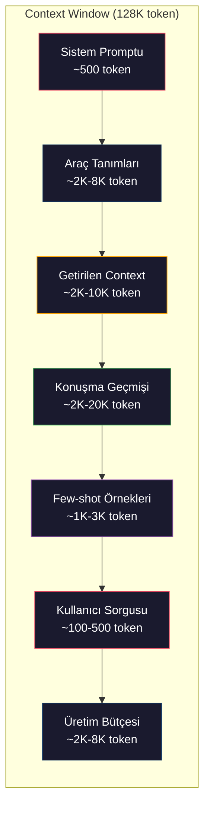
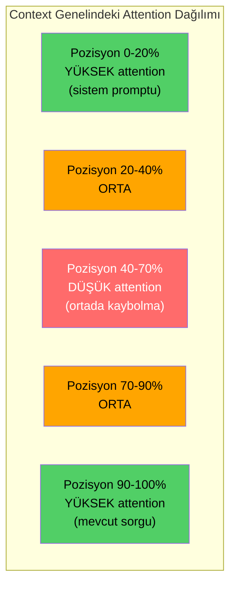
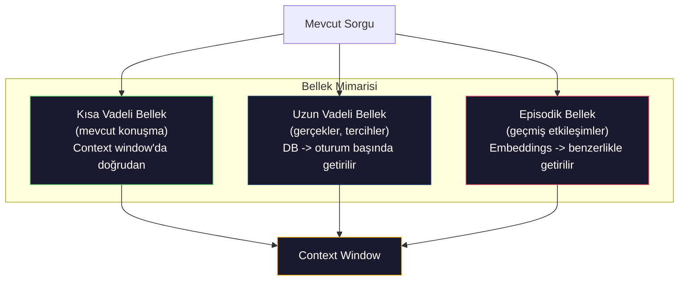

# Context Engineering: Pencereler, Bütçeler, Bellek ve Retrieval

> Prompt engineering bir alt kümedir. Context engineering ise tüm oyunun kendisidir. Prompt yazdığınız bir dizedir. Context ise modelin penceresine giren her şeydir: sistem talimatları, getirilen belgeler, araç tanımları, konuşma geçmişi, few-shot örnekleri ve prompt'un kendisi. 2026'daki en iyi AI mühendisleri context mühendisleridir. Neyin içeri gireceğine, neyin dışında kalacağına ve sıralamanın nasıl olacağına onlar karar verir.

**Tür:** Build
**Diller:** Python
**Önkoşullar:** Phase 10 (LLMs from Scratch), Phase 11 Lesson 01-02
**Süre:** ~90 dakika
**İlgili:** Phase 11 · 15 (Prompt Caching) — cache-dostu düzen, context engineering'in bir uzantısıdır. Phase 5 · 28 (Long-Context Evaluation) lost-in-the-middle'ın NIAH/RULER ile nasıl ölçüldüğünü kapsar.

## Öğrenme Hedefleri

- Tüm context window bileşenleri (sistem promptu, araçlar, geçmiş, getirilen belgeler, üretim bütçesi) genelinde token bütçeleri hesaplamak
- Context window yönetim stratejileri uygulamak: kesme (truncation), özetleme (summarization) ve konuşma geçmişi için kayan pencere (sliding window)
- Modelin dikkatini en alakalı bilgiyi en üst düzeye çıkarmak için context bileşenlerini önceliklendirmek ve sıralamak
- Sorgu türüne ve mevcut pencere alanına göre token'ları dinamik olarak dağıtan bir context assembler (birleştirici) oluşturmak

## Sorun

Claude Opus 4.7'nin 200K tokenlık bir penceresi var (beta'da 1M). GPT-5'in 400K'sı var. Gemini 3 Pro'nun 2M'si var. Llama 4 ise 10M iddiasında. Bu numbers kulağa devasa geliyor ama doldurana kadar.

İşte bir kodlama asistanı için gerçek bir dağılım: Sistem promptu: 500 token. 50 araç için araç tanımları: 8.000 token. Getirilen dokümantasyon: 4.000 token. Konuşma geçmişi (10 tur): 6.000 token. Mevcut kullanıcı sorgusu: 200 token. Üretim bütçesi (maksimum çıktı): 4.000 token. Toplam: 22.700 token. Bu, 128K pencerenin sadece %18'idir.

Ama dikkat (attention), context uzunluğuyla doğrusal olarak ölçeklenmez. 128K token context'e sahip bir model, karesel dikkat maliyeti (vanilla transformer'larda O(n^2)) öder (çoğu üretim modeli verimli attention varyantları kullanır). Daha da önemlisi, retrieval doğruluğu düşer. "Needle in a Haystack" testi, modellerin uzun context'lerin ortasına yerleştirilen bilgiyi bulmakta zorlandığını gösterir. Liu ve ark. (2023) tarafından yapılan araştırma, LLM'lerin uzun context'lerin başı ve sonuyla neredeyse mükemmel doğrulukla bilgi getirdiğini, ancak ortaya yerleştirilen bilgi için doğruluğun %10-20 düştüğünü ortaya koymuştur. Bu "lost-in-the-middle" (ortada kaybolma) etkisi modele göre değişir ama tüm güncel mimarileri etkiler.

Pratik ders: 200K token mevcut olmasının, 200K token kullanmanın etkili olduğu anlamına gelmez. Dikkatlice seçilmiş 10K tokenlık bir context genellikle dökülmüş 100K tokenlık context'ten daha iyi çalışır. Context engineering, context window içindeki sinyal-gürültü oranını maksimize etme disiplinidir.

Pencereye koyduğunuz her token, daha alakalı bilgi taşıyabilecek bir token'ı yerinden eder. Her alakasız araç tanımı, her eski konuşma turu, her soruyu yanıtlamayan getirilmiş metin parçası — her biri modelin görevde biraz daha kötü çalışmasına neden olur.

## Kavram

### Context Window Kıtkaynak Bir Kaynaktır

Context window'ı RAM olarak düşünün, disk olarak değil. Hızlıdır ve doğrudan erişilebilir, ama sınırlıdır. Her şeyi sığdıramazsınız. Seçim yapmalısınız.



Her bileşen alan için yarışır. Daha fazla araç tanımı eklemek, konuşma geçmişinden alan çalmak demektir. Daha fazla getirilen context eklemek, few-shot örneklerinden alan çalmak demektir. Context engineering, bu bütçeyi görev performansını en üst düzeye çıkarmak için dağıtma sanatıdır.

### Lost-in-the-Middle (Ortada Kaybolma)

Context engineering'deki en önemli ampirik bulgu. Modeller, context'in başı ve sonundaki bilgiye daha iyi dikkat eder. Ortadaki bilgi daha düşük attention skorları alır ve görmezden gelinme olasılığı daha yüksektir.

Liu ve ark. (2023) bunu sistematik olarak test etti. 20 alakasız belge arasında çeşitli konumlarda alakalı bir belge yerleştirdiler ve cevap doğruluğunu ölçtüler. Alakalı belge birinci veya sonuncu olduğunda doğruluk %85-90'dı. Ortada olduğunda (20'de 10. pozisyon) doğruluk %60-70'e düştü.

Bu durumun doğrudan mühendislik sonuçları vardır:

- En önemli bilgiyi başa koyun (sistem promptu, kritik talimatlar)
- Mevcut sorguyu ve en alakalı context'i sona koyun (yakınlık yanlılığı yardımcı olur)
- Context'in ortasını en düşük öncelikli bölge olarak düşünün
- Ortada bilgi eklemeniz gerekiyorsa, anahtar noktayı sonda tekrarlayın



### Context Bileşenleri

**Sistem promptu**: persona, kısıtlamalar ve davranış kurallarını belirler. Bu ilk olarak gelir ve turlar boyunca sabit kalır. Claude Code, araç tanımları ve davranış talimatları dahil sistem promptu için yaklaşık 6.000 token kullanır. Sıkı tutun. Sistem promptundaki her kelime her API çağrısında tekrarlanır.

**Araç tanımları**: her araç 50-200 token ekler (ad, açıklama, parametre şeması). 50 araç, herbiri 150 token olmak üzere, herhangi bir konuşma gerçekleşmeden 7.500 token eder. Dinamik araç seçimi — yalnızca mevcut sorguyla ilgili araçları dahil etmek — bunu %60-80 azaltabilir.

**Getirilen context**: vektör veritabanından belgeler, arama sonuçları, dosya içerikleri. Retrieval kalitesi doğrudan yanıt kalitesini belirler. Kötü retrieval, retrieval olmamasından daha kötüdür — window'ı gürültüyle doldurur ve modeli aktif olarak yanıltır.

**Konuşma geçmişi**: her önceki kullanıcı mesajı ve asistan yanıtı. Konuşma uzunluğuyla doğrusal olarak büyür. 200 token/tur hızında 50 turluk bir konuşma 10.000 token geçmiş demektir. Bunun çoğu mevcut sorguyla alakasızdır.

**Few-shot örnekleri**: istenen davranışı gösteren giriş/çıkış çiftleri. İki veya üç iyi seçilmiş örnek, binlerce tokenlık talimattan daha sık outputs kalitesini artırır. Ama alan harcarlar.

**Üretim bütçesi**: modelin yanıtı için ayrılan token'lar. Window'ı kapasiteye doldurursanız, modelin yanıtlama alanı kalmaz. Üretim için en az 2.000-4.000 token ayırın.

### Context Sıkıştırma Stratejileri

**Geçmiş özetleme**: tüm önceki turları kelimesi kelimesine tutmak yerine, konuşmayı periyodik olarak özetleyin. "X'i tartıştık, Y'ye karar verdik ve kullanıcı Z'yi istiyor" — 100 tokenla 2.000 token alan 10 turu değiştirir. Geçmiş bir eşiği aştığında özetleme çalıştırın (ör. 5.000 token).

**Alakalık filtreleme**: her getirilen belgeyi mevcut sorguya göre puanlayın ve eşik değerinin altındaki belgeleri düşürün. 10 chunk getirdiyseniz ama sadece 3'ü alakalıysa, diğer 7'yi atın. 10 vasat chunk'dan ziyade 3 son derece alakalı chunk'ınız olsun.

**Araç budama**: kullanıcı sorgusunu sınıflandırın ve yalnızca o niyetle ilgili araçları dahil edin. Bir kodlama sorusu takvim araçlarına ihtiyaç duymaz. Bir planlama sorusu dosya sistemi araçlarına ihtiyaç duymaz. Bu, araç tanımlarını 8.000 token'dan 1.000'e düşürebilir.

**Özyinelemeli özetleme**: çok uzun belgeler için kademeli olarak özetleyin. Önce her bölümü özetleyin, sonra özetlerin özetini yapın. 50 sayfalık bir belge, anahtar noktaları yakalayan 500 tokenlık bir özet haline gelir.

### Bellek Sistemleri

Context engineering üç zaman ufku kapsar.

**Kısa vadeli bellek**: mevcut konuşma. Context window'da doğrudan saklanır. Her tur ile büyür. Özetleme ve kesme ile yönetilir.

**Uzun vadeli bellek**: konuşmalar arası süregelen gerçekler ve tercihler. "Kullanıcı TypeScript'i tercih ediyor." "Proje PostgreSQL kullanıyor." Veritabanında saklanır, oturum başlangıcında getirilir. Claude Code bunu CLAUDE.md dosyalarında saklar. ChatGPT bunu memory özelliğinde saklar.

**Episodik bellek**: ilgili olabilecek geçmiş etkileşimler. "Geçen Salı, auth modülünde benzer bir sorunu hata ayıkladık." Embedding olarak saklanır, mevcut konuşma geçmişteki bir episodla eşleştiğinde getirilir.



### Dinamik Context Birleştirme

Anahtar içgörü: farklı sorgular farklı context'e ihtiyaç duyar. Statik sistem promptu + statik araçlar + statik geçmiş savurgancadır. En iyi sistemler sorgu başına dinamik olarak context birleştirir.

1. Sorgu niyetini sınıflandırın
2. İlgili araçları seçin (tüm araçları değil)
3. İlgili belgeleri getirin (sabit bir seti değil)
4. İlgili geçmiş turlarını dahil edin (tüm geçmişi değil)
5. Görev türüyle eşleşen few-shot örnekleri ekleyin
6. Her şeyi öneme göre sıralayın: kritik önce, önemli sonda, isteğe bağlı ortada

Bu, iyi bir AI uygulamasını harika bir uygulamadan ayıran şeydir. Model aynıdır. Context fark yaratır.

## Yap

### Adım 1: Token Sayacı

Bütçeyi hesaplayamıyorsanız harcayamazsınız. Basit bir token sayacı oluşturun (tam sayım tokenize ediciye bağlı olduğundan, whitespace bölerek yaklaşık hesaplama).

```python
import json
import numpy as np
from collections import OrderedDict

def count_tokens(text):
 if not text:
 return 0
 return int(len(text.split()) * 1.3)

def count_tokens_json(obj):
 return count_tokens(json.dumps(obj))
```

#### Açıklama

### Adım 2: Context Bütçe Yöneticisi

Temel soyutlama. Bütçe yöneticisi her bileşenin kaç token kullandığını takip eder ve sınırları uygular.

```python
class ContextBudget:
 def __init__(self, max_tokens=128000, generation_reserve=4000):
 self.max_tokens = max_tokens
 self.generation_reserve = generation_reserve
 self.available = max_tokens - generation_reserve
 self.allocations = OrderedDict()

 def allocate(self, component, content, max_tokens=None):
 tokens = count_tokens(content)
 if max_tokens and tokens > max_tokens:
 words = content.split()
 target_words = int(max_tokens / 1.3)
 content = " ".join(words[:target_words])
 tokens = count_tokens(content)

 used = sum(self.allocations.values())
 if used + tokens > self.available:
 allowed = self.available - used
 if allowed <= 0:
 return None, 0
 words = content.split()
 target_words = int(allowed / 1.3)
 content = " ".join(words[:target_words])
 tokens = count_tokens(content)

 self.allocations[component] = tokens
 return content, tokens

 def remaining(self):
 used = sum(self.allocations.values())
 return self.available - used

 def utilization(self):
 used = sum(self.allocations.values())
 return used / self.max_tokens

 def report(self):
 total_used = sum(self.allocations.values())
 lines = []
 lines.append(f"Context Bütçe Raporu ({self.max_tokens:,} token pencere)")
 lines.append("-" * 50)
 for component, tokens in self.allocations.items():
 pct = tokens / self.max_tokens * 100
 bar = "#" * int(pct / 2)
 lines.append(f" {component:<25} {tokens:>6} token ({pct:>5.1f}%) {bar}")
 lines.append("-" * 50)
 lines.append(f" {'Kullanılan':<25} {total_used:>6} token ({total_used/self.max_tokens*100:.1f}%)")
 lines.append(f" {'Üretim ayrılan':<25} {self.generation_reserve:>6} token")
 lines.append(f" {'Kalan':<25} {self.remaining():>6} token")
 return "\n".join(lines)
```

#### Açıklama

### Adım 3: Lost-in-the-Middle Yeniden Sıralama

En önemli öğelerin başına ve sonuna gittiği, en az önemli olanların ortaya gittiği yeniden sıralama stratejisini uygulayın.

```python
def reorder_lost_in_middle(items, scores):
 paired = sorted(zip(scores, items), reverse=True)
 sorted_items = [item for _, item in paired]

 if len(sorted_items) <= 2:
 return sorted_items

 first_half = sorted_items[::2]
 second_half = sorted_items[1::2]
 second_half.reverse()

 return first_half + second_half

def score_relevance(query, documents):
 query_words = set(query.lower().split())
 scores = []
 for doc in documents:
 doc_words = set(doc.lower().split())
 if not query_words:
 scores.append(0.0)
 continue
 overlap = len(query_words & doc_words) / len(query_words)
 scores.append(round(overlap, 3))
 return scores
```

#### Açıklama

### Adım 4: Konuşma Geçmişi Sıkıştırıcısı

Eski konuşma turlarını özetleyerek token bütçesini geri kazanın.

```python
class ConversationManager:
 def __init__(self, max_history_tokens=5000):
 self.turns = []
 self.summaries = []
 self.max_history_tokens = max_history_tokens

 def add_turn(self, role, content):
 self.turns.append({"role": role, "content": content})
 self._compress_if_needed()

 def _compress_if_needed(self):
 total = sum(count_tokens(t["content"]) for t in self.turns)
 if total <= self.max_history_tokens:
 return

 while total > self.max_history_tokens and len(self.turns) > 4:
 old_turns = self.turns[:2]
 summary = self._summarize_turns(old_turns)
 self.summaries.append(summary)
 self.turns = self.turns[2:]
 total = sum(count_tokens(t["content"]) for t in self.turns)

 def _summarize_turns(self, turns):
 parts = []
 for t in turns:
 content = t["content"]
 if len(content) > 100:
 content = content[:100] + "..."
 parts.append(f"{t['role']}: {content}")
 return "Önceki: " + " | ".join(parts)

 def get_context(self):
 parts = []
 if self.summaries:
 parts.append("[Konuşma Özeti]")
 for s in self.summaries:
 parts.append(s)
 parts.append("[Son Konuşma]")
 for t in self.turns:
 parts.append(f"{t['role']}: {t['content']}")
 return "\n".join(parts)

 def token_count(self):
 return count_tokens(self.get_context())
```

#### Açıklama

### Adım 5: Dinamik Araç Seçici

Yalnızca mevcut sorguyla ilgili araçları dahil edin. Niyeti sınıflandırın, sonra filtreleyin.

```python
TOOL_REGISTRY = {
 "read_file": {
 "description": "Read contents of a file",
 "tokens": 120,
 "categories": ["code", "files"],
 },
 "write_file": {
 "description": "Write content to a file",
 "tokens": 150,
 "categories": ["code", "files"],
 },
 "search_code": {
 "description": "Search for patterns in codebase",
 "tokens": 130,
 "categories": ["code"],
 },
 "run_command": {
 "description": "Execute a shell command",
 "tokens": 140,
 "categories": ["code", "system"],
 },
 "create_calendar_event": {
 "description": "Create a new calendar event",
 "tokens": 180,
 "categories": ["calendar"],
 },
 "list_emails": {
 "description": "List recent emails",
 "tokens": 160,
 "categories": ["email"],
 },
 "send_email": {
 "description": "Send an email message",
 "tokens": 200,
 "categories": ["email"],
 },
 "web_search": {
 "description": "Search the web for information",
 "tokens": 140,
 "categories": ["research"],
 },
 "query_database": {
 "description": "Run a SQL query on the database",
 "tokens": 170,
 "categories": ["code", "data"],
 },
 "generate_chart": {
 "description": "Generate a chart from data",
 "tokens": 190,
 "categories": ["data", "visualization"],
 },
}

def classify_intent(query):
 query_lower = query.lower()

 intent_keywords = {
 "code": ["code", "function", "bug", "error", "file", "implement", "refactor", "debug", "test"],
 "calendar": ["meeting", "schedule", "calendar", "appointment", "event"],
 "email": ["email", "mail", "send", "inbox", "message"],
 "research": ["search", "find", "what is", "how does", "explain", "look up"],
 "data": ["data", "query", "database", "chart", "graph", "analytics", "sql"],
 }

 scores = {}
 for intent, keywords in intent_keywords.items():
 score = sum(1 for kw in keywords if kw in query_lower)
 if score > 0:
 scores[intent] = score

 if not scores:
 return ["code"]

 max_score = max(scores.values())
 return [intent for intent, score in scores.items() if score >= max_score * 0.5]

def select_tools(query, token_budget=2000):
 intents = classify_intent(query)
 relevant = {}
 total_tokens = 0

 for name, tool in TOOL_REGISTRY.items():
 if any(cat in intents for cat in tool["categories"]):
 if total_tokens + tool["tokens"] <= token_budget:
 relevant[name] = tool
 total_tokens += tool["tokens"]

 return relevant, total_tokens
```

#### Açıklama

### Adım 6: Tam Context Birleştirme Hattı

Her şeyi birbirine bağlayın. Bir sorgu verildiğinde, optimum context'i dinamik olarak birleştirin.

```python
class ContextEngine:
 def __init__(self, max_tokens=128000, generation_reserve=4000):
 self.budget = ContextBudget(max_tokens, generation_reserve)
 self.conversation = ConversationManager(max_history_tokens=5000)
 self.system_prompt = (
 "You are a helpful AI assistant. You have access to tools for "
 "code editing, file management, web search, and data analysis. "
 "Use the appropriate tools for each task. Be concise and accurate."
 )
 self.knowledge_base = [
 "Python 3.12 introduced type parameter syntax for generic classes using bracket notation.",
 "The project uses PostgreSQL 16 with pgvector for embedding storage.",
 "Authentication is handled by Supabase Auth with JWT tokens.",
 "The frontend is built with Next.js 15 using the App Router.",
 "API rate limits are set to 100 requests per minute per user.",
 "The deployment pipeline uses GitHub Actions with Docker multi-stage builds.",
 "Test coverage must be above 80% for all new modules.",
 "The codebase follows the repository pattern for data access.",
 ]

 def assemble(self, query):
 self.budget = ContextBudget(self.budget.max_tokens, self.budget.generation_reserve)

 system_content, _ = self.budget.allocate("system_prompt", self.system_prompt, max_tokens=1000)

 tools, tool_tokens = select_tools(query, token_budget=2000)
 tool_text = json.dumps(list(tools.keys()))
 tool_content, _ = self.budget.allocate("tools", tool_text, max_tokens=2000)

 relevance = score_relevance(query, self.knowledge_base)
 threshold = 0.1
 relevant_docs = [
 doc for doc, score in zip(self.knowledge_base, relevance)
 if score >= threshold
 ]

 if relevant_docs:
 doc_scores = [s for s in relevance if s >= threshold]
 reordered = reorder_lost_in_middle(relevant_docs, doc_scores)
 doc_text = "\n".join(reordered)
 doc_content, _ = self.budget.allocate("retrieved_context", doc_text, max_tokens=3000)

 history_text = self.conversation.get_context()
 if history_text.strip():
 history_content, _ = self.budget.allocate("conversation_history", history_text, max_tokens=5000)

 query_content, _ = self.budget.allocate("user_query", query, max_tokens=500)

 return self.budget

 def chat(self, query):
 self.conversation.add_turn("user", query)
 budget = self.assemble(query)
 response = f"[Response to: {query[:50]}...]"
 self.conversation.add_turn("assistant", response)
 return budget


def run_demo():
 print("=" * 60)
 print(" Context Engineering Pipeline Demosu")
 print("=" * 60)

 engine = ContextEngine(max_tokens=128000, generation_reserve=4000)

 print("\n--- Sorgu 1: Kod görevi ---")
 budget = engine.chat("Fix the bug in the authentication module where JWT tokens expire too early")
 print(budget.report())

 print("\n--- Sorgu 2: Araştırma görevi ---")
 budget = engine.chat("What is the best approach for implementing vector search in PostgreSQL?")
 print(budget.report())

 print("\n--- Sorgu 3: Konuşma geçmişi birikiminden sonra ---")
 for i in range(8):
 engine.conversation.add_turn("user", f"Follow-up question number {i+1} about the implementation details of the system")
 engine.conversation.add_turn("assistant", f"Here is the response to follow-up {i+1} with technical details about the architecture")

 budget = engine.chat("Now implement the changes we discussed")
 print(budget.report())

 print("\n--- Araç Seçimi Örnekleri ---")
 test_queries = [
 "Fix the bug in auth.py",
 "Schedule a meeting with the team for Tuesday",
 "Show me the database query performance stats",
 "Search for best practices on error handling",
 ]

 for q in test_queries:
 tools, tokens = select_tools(q)
 intents = classify_intent(q)
 print(f"\n Sorgu: {q}")
 print(f" Niyetler: {intents}")
 print(f" Araçlar: {list(tools.keys())} ({tokens} token)")

 print("\n--- Lost-in-the-Middle Yeniden Sıralama ---")
 docs = ["Doc A (en alakalı)", "Doc B (biraz alakalı)", "Doc C (en az alakalı)",
 "Doc D (alakalı)", "Doc E (orta düzeyde alakalı)"]
 scores = [0.95, 0.60, 0.20, 0.80, 0.50]
 reordered = reorder_lost_in_middle(docs, scores)
 print(f" Orijinal sıra: {docs}")
 print(f" Skorlar: {scores}")
 print(f" Yeniden sıralanmış: {reordered}")
 print(f" (En alakalı başta ve sonda, en az alakalı ortada)")
```

#### Açıklama

## Kullan

### Claude Code'un Context Stratejisi

Claude Code, katmanlı bir yaklaşımla context'i yönetir. Sistem promptu davranış kuralları ve araç tanımları içerir (~6K token). Bir dosya açtığınızda içeriği context olarak enjekte edilir. Arama yaptığınızda sonuçlar eklenir. Eski konuşma turları özetlenir. CLAUDE.md, oturumlar arası süregelen uzun vadeli bellek sağlar.

Anahtar mühendislik kararı: Claude Code, tüm codebase'inizi context'e dökmez. Talep üzerine ilgili dosyaları getirir. Bu, pratikte context engineering'dir.

### Cursor'un Dinamik Context Yükleme

Cursor, tüm codebase'inizi embedding'lere indeksler. Bir sorgu yazdığınızda, vektör benzerliği kullanarak en alakalı dosyaları ve kod bloklarını getirir. Yalnızca bu parçalar context window'a girer. 500K satırlık bir codebase, 5-10 en alakalık kod bloğuna sıkıştırılır.

Bu kalıptır: her şeyi embed edin, talep üzerine getirin, yalnızca önemli olanı dahil edin.

### ChatGPT Memory

ChatGPT, kullanıcı tercihlerini ve gerçeklerini uzun vadeli bellek olarak saklar. Her konuşma başlangıcında, ilgili anılar getirilir ve sistem promptuna dahil edilir. "Kullanıcı Python'u tercih ediyor" 5 token harcar ama konuşmalar boyunca tekrarlanan yüzlerce tokenlık talimatı kurtarır.

### RAG Olarak Context Engineering

Retrieval-Augmented Generation (Retrieval ile Artırılmış Üretim), formalize edilmiş context engineering'dir. Bilgiyi modelin ağırlıklarına (eğitim) veya sistem promptuna (statik context) doldurmak yerine, sorgu zamanında ilgili belgeleri getirir ve context window'a enjekte edersiniz. Tüm RAG hattı — chunking, embedding, retrieval, reranking — tek bir sorunu çözmek için vardır: doğru bilgiyi context window'a koymak.

## Teslim Et

Bu ders `outputs/prompt-context-optimizer.md` üretir — bir context birleştirme stratejisini denetleyen ve optimizasyonlar öneren yeniden kullanılabilir bir prompt. Sistem promptunuzu, araç sayınızı, ortalama geçmiş uzunluğunuzu ve retrieval stratejinizi besleyin, token israfını tespit eder ve iyileştirmeler önerir.

Ayrıca `outputs/skill-context-engineering.md` üretir — görev türüne, context window boyutuna ve gecikme bütçesine göre context birleştirme hatları tasarlama karar çerçevesi.

## Alıştırmalar

1. ContextBudget sınıfına bir "token israfı dedektörü" ekleyin. Bütçenin %30'undan fazlasını kullanan bileşenleri işaretlemeli ve her bileşen türüne özgü sıkıştırma stratejileri önermelidir (geçmişi özetle, araçları budayın, belgeleri yeniden sıralayın).

2. Getirilen context için anlamsal (semantic) tekrar kaldırma uygulayın. İki getirilen belge %80'den fazla benzer kelime örtüşmesine veya embedding cosine benzerliğine sahipse, yalnızca daha yüksek puanlı olanı tutun. Bu ne kadar token bütçesi kurtarır?

3. Bir "context tekrarı" aracı oluşturun. Bir konuşma dökümü verildiğinde, ContextEngine üzerinden tekrarlayın ve bütçe dağılımının tur bazında nasıl değiştiğini görselleştirin. Zaman içinde bileşen başına token kullanımını çizin. Context'in sıkıştırılmaya başlandığı turu tespit edin.

4. Öncelik tabanlı bir araç seçici uygulayın. İkili dahil et hariç tut yerine, her araca mevcut sorguya göre bir alakalık skoru atayın. Araç bütçesi tükenene kadar azalan alakalık sırasıyla araçları dahil edin. 5, 10, 20 ve 50 araç dahil edildiğinde görev performansını karşılaştırın.

5. Çok stratejili bir context sıkıştırıcı oluşturun. Üç sıkıştırma stratejisi uygulayın (kesme, özetleme, anahtar cümle çıkarma) ve 20 belgeden oluşan bir kümede benchmark yapın. Sıkıştırma oranı ile bilgi korunması arasındaki ödünleşimi ölçün (sıkıştırılmış sürüm hâlâ sorunun cevabını içeriyor mu?).

## Anahtar Terimler

| Terim | İnsanlar ne söylüyor | Gerçekte ne anlama geliyor |
|------|----------------------|--------------------------|
| Context window | "Modelin ne okuyabildiği" | Modelin tek bir ileri geçişte işlediği maksimum token sayısı (girdi + çıktı) — GPT-5 için 400K, Claude Opus 4.7 için 200K (1M beta), Gemini 3 Pro için 2M |
| Context engineering | "İleri düzey prompt engineering" | Context window'a neyin, hangi sırayla ve hangi öncelikle gireceğine karar verme disiplini — retrieval, sıkıştırma, araç seçimi ve bellek yönetimini kapsar |
| Lost-in-the-middle | "Modeller ortadaki şeyleri unutur" | LLM'lerin context'in başı ve sonuna daha iyi odaklandığı ampirik bulgu; ortaya yerleştirilen bilgi için %10-20 doğruluk düşüşü |
| Token budget | "Kaç tokenınız kaldığı" | Context window kapasitesinin bileşenlere (sistem promptu, araçlar, geçmiş, retrieval, üretim) göre açıkça dağıtımı |
| Dinamik context | "Şeyleri çalışma zamanında yükleme" | Niyet sınıflandırmasına, ilgili araç seçimine ve retrieval sonuçlarına göre her sorgu için farklı şekilde context window'u birleştirme |
| Geçmiş özetleme | "Konuşmayı sıkıştırma" | Eski konuşma turlarını kelimesi kelimesine tutmak yerine özlü bir özetle değiştirme, temel bilgiyi korurken token maliyetini azaltma |
| Araç budama | "Yalnızca ilgili araçları dahil etme" | Sorgu niyetini sınıflandırma ve yalnızca eşleşen araç tanımlarını dahil etme, araç token maliyetini %60-80 azaltma |
| Uzun vadeli bellek | "Oturumlar arası hatırlama" | Veritabanında saklanan ve oturum başında getirilen gerçekler ve tercihler — CLAUDE.md, ChatGPT Memory ve benzeri sistemler |
| Episodik bellek | "Belirli geçmiş olaylarını hatırlama" | Geçmiş etkileşimlerin embedding olarak saklanması ve mevcut sorgu geçmişteki bir konuşmaya benzediğinde getirilmesi |
| Üretim bütçesi | "Cevap için alan" | Modelin çıktısı için ayrılan token'lar — context window tamamen dolarsa, modelin yanıtlama alanı kalmaz |

## İleri Okuma

- Liu ve ark., 2023 — "Lost in the Middle: How Language Models Use Long Contexts" — konum-bağımlı attention üzerine temel çalışma, modellerin uzun context'lerin ortasındaki bilgiyle zorlandığını gösteriyor
- Anthropic'in Contextual Retrieval blog yazısı — Anthropic'in context-aware chunk retrieval yaklaşımı, retrieval hata oranını %49 azaltıyor
- Simon Willison'ın "Context Engineering" yazısı — disipline adını veren ve prompt engineering'den ayıran blog yazısı
- LangChain RAG dokümantasyonu — retrieval-augmented generation'ın pratik uygulaması
- Greg Kamradt'ın Needle in a Haystack testi — tüm büyük modellerde konum-bağımlı retrieval hatalarını ortaya çıkaran benchmark
- Pope ve ark., "Efficiently Scaling Transformer Inference" (2022) — context uzunluğunun bellek ve gecikmeyi nasıl yönlendirdiği, KV cache, MQA ve GQA'nın bütçe hesaplamasını nasıl değiştirdiği
- Agrawal ve ark., "SARATHI: Efficient LLM Inference by Piggybacking Decodes with Chunked Prefills" (2023) — uzun promptları TTFT'de pahalı ama TPOT'ta ucuz yapan iki aşamalı inference
- Ainslie ve ark., "GQA: Training Generalized Multi-Query Transformer Models from Multi-Head Checkpoints" (EMNLP 2023) — KV belleğini üretim decoder'larında %8 kesen gruplu sorgu attention makalesi
