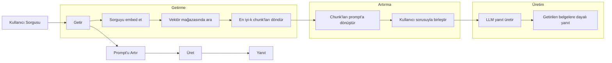
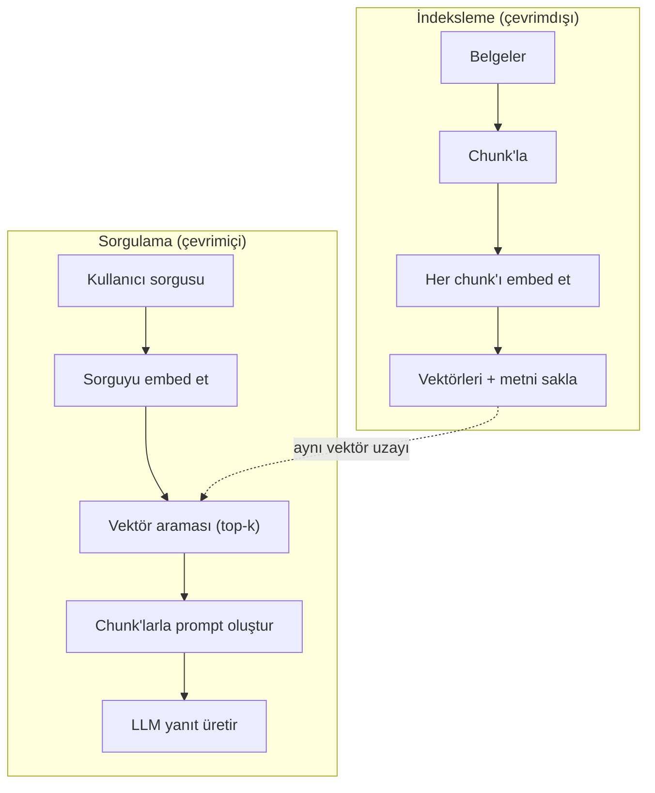

# RAG (Retrieval-Augmented Generation)

> LLM'niz eğitim kesim tarihine kadar her şeyi bilir. Şirketinizin belgelerini, codebase'inizi veya geçen haftaki toplantı notlarını bilmez. RAG bunu ilgili belgeleri getirip prompt'a yapıştırarak çözer. Üretimdeki en yaygın deploy edilen kalıptır. Bu kurstan bir şey yapacaksanız, bir RAG hattı yapın.

**Tür:** Build
**Diller:** Python
**Önkoşullar:** Phase 10 (LLMs from Scratch), Phase 11 Lessons 01-05
**Süre:** ~90 dakika
**İlgili:** Phase 5 · 23 (Chunking Strategies for RAG) altı chunking algoritmasını ve hangisinin ne zaman kazandığını kapsar. Phase 5 · 22 (Embedding Models Deep Dive) embedder seçimini kapsar. Phase 11 · 07 (Advanced RAG) hibrit arama, reranking ve query transformation'ı kapsar.

## Öğrenme Hedefleri

- Tam bir RAG hattı oluşturmak: belge yükleme, chunking, embedding, vektör depolama, retrieval ve üretim
- Vektör veritabanı (ChromaDB, FAISS veya Pinecone) kullanarak uygun indeksleme ile anlamsal arama uygulamak
- RAG'ın bilgi tabanlı uygulamalar için fine-tuning'den neden tercih edildiğini açıklamak (maliyet, tazelik, izlenebilirlik)
- Retrieval metrikleri (precision, recall) ve üretim metrikleri (faithfulness, relevance) kullanarak RAG kalitesini değerlendirmek

## Sorun

Şirketiniz için bir chatbot oluşturuyorsunuz. Bir müşteri "Enterprise planlar için iade politikası nedir?" diye soruyor. LLM tipik SaaS iade politikaları hakkında genel bir yanıt veriyor. Aslında 200 sayfalık iç wiki'de gizli olan politika, enterprise müşterilerin 60 günlük bir süre içinde orantılı iade hakkı olduğunu söylüyor. LLM bu belgeyi hiç görmemiş. Eğitim verilmemiş bir şeyi bilemez.

Fine-tuning bir çözümdür. LLM'yi alın, iç belgelerinizle eğitin ve güncellenmiş modeli deploy edin. Bu çalışır ama ciddi sorunları vardır. Fine-tuning binlerce dolar hesaplama maliyeti tutar. Bir belge değiştiğinde model hemen eskiyor. Hangi kaynaktan drew ettiğinizi bilmenin bir yolu yoktur. Ve şirket gelecek ay başka bir ürün hattını satın alırsa, tekrar fine-tuning yaparsınız.

RAG diğer çözümdür. Dokunulmamış bir model bırakın. Bir soru geldiğinde, belge mağazanızdan ilgili pasajları arayın, sorudan önce prompt'a yapıştırın ve modele bu pasajları context olarak kullanarak yanıt vermesini sağlayın. Belge mağazası dakikalar içinde güncellenebilir. Hangi belgelerin getirildiğini tam olarak görebilirsiniz. Modelin kendisi hiç değişmez. Bu yüzden RAG üretimde baskın kalıptır: daha ucuz, daha taze, daha denetlenebilir ve her LLM ile çalışır.

## Kavram

### RAG Kalıbı

Tüm kalıp dört adımda sığar:



Sorgu -> Getir -> Prompt'u artır -> Üret. Her RAG sistemi bu kalıbı izler. Üretim RAG sistemleri arasındaki farklar her adımın detaylarında yatar: nasıl chunk edersiniz, nasıl embed edersiniz, nasıl arama yaparsınız ve prompt'u nasıl oluşturursunuz.

### RAG'ın Fine-Tuning'i Neden Yendiği

| Endişe | Fine-tuning | RAG |
|---------|------------|-----|
| Maliyet | Eğitim çalışması başına $1.000-$100.000+ | Sorgu başına $0.01-$0.10 (embedding + LLM) |
| Tazelik | Yeniden eğitilene kadar eski | Belgeleri yeniden indeksleyerek dakikalar içinde güncellenir |
| Denetlenebilirlik | Yanıtı kaynağa izleyemez | Tam olarak getirilen pasajları gösterebilir |
| Halüsinasyon | Hâlâ özgürce halüsinasyon yapar | Getirilen belgelere dayanır |
| Veri gizliliği | Eğitim verileri ağırlıklara işlenir | Belgeler vektör mağazanızda kalır |

Fine-tuning modelin ağırlıklarını kalıcı olarak değiştirir. RAG modelin context'ini geçici olarak değiştirir. Çoğu uygulama için geçici context istediğiniz şeydir.

Fine-tuning'in kazandığı tek durum: modelin belirli bir stil, ton veya yalnızca promptlama ile elde edilemeyen muhakeme modelini benimsemesi gerektiğidir. Olgusal bilgi retrieval'ı için RAG her zaman kazanır.

### Embedding Modelleri

Bir embedding modeli metni yoğun bir vektöre dönüştürür. Benzer metinler bu yüksek boyutlu uzayda birbirine yakın vektörler üretir. "Şifremi nasıl sıfırlarım?" ve "Şifremi değiştirmem gerekiyor" kelimeleri az ortak kelimeye sahip olmalarına rağmen neredeyse aynı vektörleri üretir. "Kedi mindere oturdu" çok farklı bir vektör üretir.

Yaygın embedding modelleri (2026 listesi — tam analiz için Phase 5 · 22'ye bakın):

| Model | Boyutlar | Sağlayıcı | Notlar |
|-------|---------|-----------| Çoğu kullanım durumu için en iyi fiyat/performans |
| text-embedding-3-small | 1536 (Matryoshka) | OpenAI | Çoğu kullanım durumu için en iyi fiyat/performans |
| text-embedding-3-large | 3072 (Matryoshka) | OpenAI | Daha yüksek doğruluk, 256/512/1024'e kadar kısaltılabilir |
| Gemini Embedding 2 | 3072 (Matryoshka) | Google | En yüksek MTEB retrieval; 8K context |
| voyage-4 | 1024/2048 (Matryoshka) | Voyage AI | Alan varyantları (kod, finans, hukuk) |
| Cohere embed-v4 | 1024 (Matryoshka) | Cohere | Güçlü çok dilli, 128K context |
| BGE-M3 | 1024 (yoğun +seyrek + ColBERT) | BAAI (açık-ağırlıklı) | Tek modelden üç görünüm |
| Qwen3-Embedding | 4096 (Matryoshka) | Alibaba (açık-ağırlıklı) | En yüksek açık-ağırlıklı retrieval skoru |
| all-MiniLM-L6-v2 | 384 | Açık-ağırlıklı (Sentence Transformers) | Prototipleme temeli |

Bu ders için, TF-IDF kullanarak kendi basit embedding'imizi oluşturuyoruz. TF-IDF'in üretim sistemlerinin kullandığı şey olmasından değil, kavramı somutlaştırdığı için: metin girer, vektör çıkar, benzer metinler benzer vektörler üretir.

### Vektör Benzerliği

İki vektör verildiğinde, benzerliği nasıl ölçersiniz? Üç seçenek:

**Cosine similarity**: iki vektör arasındaki açının cosinusu. -1'den (zıt) 1'e (aynı) kadar değişir. Büyüklüğü görmezden gelir, yalnızca yönle ilgilenir. Bu RAG için varsayılandır.

```
cosine_sim(a, b) = dot(a, b) / (||a|| * ||b||)
```

**Dot product**: ham iç çarpım. Daha büyük vektörler daha yüksek skor alır. Büyüklük bilgi taşıdığında faydalıdır (daha uzun belgeler daha alakalı olabilir).

```
dot(a, b) = sum(a_i * b_i)
```

**L2 (Öklid) mesafesi**: vektör uzayında düz çizgi mesafesi. Daha küçük mesafe = daha benzer. Büyüklük farklarına duyarlıdır.

```
L2(a, b) = sqrt(sum((a_i - b_i)^2))
```

Cosine similarity standarttır. Farklı uzunluktaki belgeleri zarif bir şekilde ele alır çünkü büyüklüğe göre normalize eder. Birisi "vektör arama" dediğinde, neredeyse her zaman cosine similarity kastedilir.

### Chunking Stratejileri

Belgeler tek vektör olarak embed edilemeyecek kadar uzundur. 50 sayfalık bir PDF onlarca konu içerdiğinden kötü bir embedding üretebilir. Bunun yerine, belgeleri chunk'lara bölün ve her chunk'ı ayrı ayrı embed edin.

**Sabit boyutlu chunking**: her N token'da bölün. Basit ve öngörülebilir. 500 tokenlık bir chunk, 50 tokenlık örtüşme ile chunk 1 0-500 tokenları, chunk 2 451-951 tokenları kapsar. Örtüşme, bir cümleyi talihsiz bir sınırla bölmenizi önler.

**Anlamsal chunking**: doğal sınırlarda bölün. Paragraflar, bölümler veya markdown başlıkları. Her chunk tutarlı bir anlam birimidir. Uygulaması daha zor ama daha iyi retrieval sağlar.

**Özyinelemeli chunking**: önce en büyük sınırlarda bölmeyi deneyin (bölüm başlıkları). Bir bölüm hâlâ çok büyükse paragraf sınırlarında bölün. Bir paragraf hâlâ çok büyükse cümle sınırlarında bölün. Bu LangChain RecursiveCharacterTextSplitter yaklaşımıdır ve pratikte iyi çalışır.

Chunk boyutu insanların düşündüğünden daha önemlidir:

- Çok küçük (64-128 token): her chunk bağlamdan yoksundur. "Geçen çeyrekte %15 arttı" ifadesi "o"nun neye atıfta bulunduğunu bilmeden bir anlam ifade etmez.
- Çok büyük (2048+ token): her chunk birden fazla konuyu kapsar, alakayı seyreltir. Gelir verilerini aradığınızda, %10'u gelirle %90'ı personel sayıyla ilgili bir chunk alırsınız.
- İdeal nokta (256-512 token): bağımsız olacak kadar bağlam, alakalı olacak kadar odaklı.

Çoğu üretim RAG sistemi 50 tokenlık örtüşme ile 256-512 tokenlık chunk'lar kullanır. Anthropic'in RAG yönergeleri bu aralığı önermektedir.

### Vektör Veritabanları

Embedding'leriniz olduktan sonra, bunları saklayacak ve arayacak bir yere ihtiyacınız var. Seçenekler:

| Veritabanı | Tür | En İyisi İçin |
|----------|------|----------|
| FAISS | Kütüphane (süreç içi) | Prototipleme, küçük-orta veri setleri |
| Hafif DB | Hafif veritabanı | Yerel geliştirme, küçük deploy'lar |
| Pinecone | Yönetilen hizmet | Operasyon yükü olmadan üretim |
| Weaviate | Açık kaynak DB | Self-hosted üretim |
| pgvector | Postgres eklentisi | Zaten Postgres kullanıyorsanız |
| Qdrant | Açık kaynak DB | Yüksek performanslı self-hosted |

Bu ders için basit bir bellek içi vektör mağazası oluşturuyoruz. Vektörleri bir listede saklar ve brute-force cosine benzerlik araması yapar. Bu, düz indeksli FAISS'e eşdeğerdir. Yaklaşık 100.000 vektöre kadar ölçeklenir, sonra yavaşlar. Üretim sistemleri milyonlarca vektörü milisaniyede aramak için HNSW gibi Approximate Nearest Neighbor (ANN) algoritmaları kullanır.

### Tam Hat



İndeksleme aşaması belge başına bir kez çalışır (veya belgeler güncellendiğinde). Sorgulama aşaması her kullanıcı isteğinde çalışır. Üretimde, indeksleme milyonlarca belgeyi saatler boyunca işleyebilir. Sorgulama bir saniyenin altında yanıt vermelidir.

### Gerçek Sayılar

Çoğu üretim RAG sistemi bu parametreleri kullanır:

- **k = 5 ila 10** sorgu başına getirilen chunk
- **Chunk boyutu = 256 ila 500 token** 50 tokenlık örtüşme ile
- **Context bütçesi**: sorgu başına 2.500-5.000 token getirilen içerik
- **Toplam prompt**: ~8.000-16.000 token (sistem promptu + getirilen chunk'lar + konuşma geçmişi + kullanıcı sorgusu)
- **Embedding boyutu**: modele bağlı olarak 384-3072
- **İndeksleme verimi**: API embedding'leriyle saniyede 100-1.000 belge
- **Sorgu gecikmesi**: retrieval için 50-200ms, üretim için 500-3000ms

## Yap

### Adım 1: Belge Chunking'i

```python
def chunk_text(text, chunk_size=200, overlap=50):
    words = text.split()
    chunks = []
    start = 0
    while start < len(words):
        end = start + chunk_size
        chunk = " ".join(words[start:end])
        chunks.append(chunk)
        start += chunk_size - overlap
    return chunks
```

#### Açıklama

### Adım 2: TF-IDF Embedding'leri

Basit bir embedding fonksiyonu oluşturuyoruz. TF-IDF (Term Frequency-Inverse Document Frequency) sinirsel bir embedding değildir ama metni kelimenin önemini yakalayacak şekilde vektörlere dönüştürür. Bir belgede sık geçen kelimeler daha yüksek TF alır. Corpus genelinde nadir kelimeler daha yüksek IDF alır. Çarpım, önemli ve ayırt edici kelimelerin yüksek değerlere sahip olduğu bir vektör verir.

```python
import math
from collections import Counter

def build_vocabulary(documents):
    vocab = set()
    for doc in documents:
        vocab.update(doc.lower().split())
    return sorted(vocab)

def compute_tf(text, vocab):
    words = text.lower().split()
    count = Counter(words)
    total = len(words)
    return [count.get(word, 0) / total for word in vocab]

def compute_idf(documents, vocab):
    n = len(documents)
    idf = []
    for word in vocab:
        doc_count = sum(1 for doc in documents if word in doc.lower().split())
        idf.append(math.log((n + 1) / (doc_count + 1)) + 1)
    return idf

def tfidf_embed(text, vocab, idf):
    tf = compute_tf(text, vocab)
    return [t * i for t, i in zip(tf, idf)]
```

#### Açıklama

### Adım 3: Cosine Similarity Araması

```python
def cosine_similarity(a, b):
    dot = sum(x * y for x, y in zip(a, b))
    norm_a = math.sqrt(sum(x * x for x in a))
    norm_b = math.sqrt(sum(x * x for x in b))
    if norm_a == 0 or norm_b == 0:
        return 0.0
    return dot / (norm_a * norm_b)

def search(query_embedding, stored_embeddings, top_k=5):
    scores = []
    for i, emb in enumerate(stored_embeddings):
        sim = cosine_similarity(query_embedding, emb)
        scores.append((i, sim))
    scores.sort(key=lambda x: x[1], reverse=True)
    return scores[:top_k]
```

#### Açıklama

### Adım 4: Prompt Oluşturma

RAG'deki "artırılmış" kısım burada gerçekleşir. Getirilen chunk'ları alın, bir prompt'a dönüştürün ve LLM'den sağlanan context'e dayanarak yanıt vermesini isteyin.

```python
def build_rag_prompt(query, retrieved_chunks):
    context = "\n\n---\n\n".join(
        f"[Kaynak {i+1}]\n{chunk}"
        for i, chunk in enumerate(retrieved_chunks)
    )
    return f"""Answer the question based ONLY on the following context.
If the context doesn't contain enough information, say "I don't have enough information to answer that."

Context:
{context}

Question: {query}

Answer:"""
```

#### Açıklama

### Adım 5: Tam RAG Hattı

```python
class RAGPipeline:
    def __init__(self):
        self.chunks = []
        self.embeddings = []
        self.vocab = []
        self.idf = []

    def index(self, documents):
        all_chunks = []
        for doc in documents:
            all_chunks.extend(chunk_text(doc))
        self.chunks = all_chunks
        self.vocab = build_vocabulary(all_chunks)
        self.idf = compute_idf(all_chunks, self.vocab)
        self.embeddings = [
            tfidf_embed(chunk, self.vocab, self.idf)
            for chunk in all_chunks
        ]

    def query(self, question, top_k=5):
        query_emb = tfidf_embed(question, self.vocab, self.idf)
        results = search(query_emb, self.embeddings, top_k)
        retrieved = [(self.chunks[i], score) for i, score in results]
        prompt = build_rag_prompt(
            question, [chunk for chunk, _ in retrieved]
        )
        return prompt, retrieved
```

#### Açıklama

### Adım 6: Üretim (simüle edilmiş)

Üretimde, bu LLM API'sini çağırdığınız yerdir. Bu ders için, getirilen context'ten en alakalı cümleyi çıkararak üretimi simüle ediyoruz.

```python
def simple_generate(prompt, retrieved_chunks):
    query_words = set(prompt.lower().split("question:")[-1].split())
    best_sentence = ""
    best_score = 0
    for chunk in retrieved_chunks:
        for sentence in chunk.split("."):
            sentence = sentence.strip()
            if not sentence:
                continue
            words = set(sentence.lower().split())
            overlap = len(query_words & words)
            if overlap > best_score:
                best_score = overlap
                best_sentence = sentence
    return best_sentence if best_sentence else "I don't have enough information."
```

#### Açıklama

## Kullan

Gerçek bir embedding modeli ve LLM ile kod neredeyse hiç değişmez:

```python
from openai import OpenAI

client = OpenAI()

def embed(text):
    response = client.embeddings.create(
        model="text-embedding-3-small",
        input=text
    )
    return response.data[0].embedding

def generate(prompt):
    response = client.chat.completions.create(
        model="gpt-4o-mini",
        messages=[{"role": "user", "content": prompt}],
        temperature=0
    )
    return response.choices[0].message.content
```

Veya Anthropic ile:

```python
import anthropic

client = anthropic.Anthropic()

def generate(prompt):
    response = client.messages.create(
        model="claude-sonnet-4-20250514",
        max_tokens=1024,
        messages=[{"role": "user", "content": prompt}]
    )
    return response.content[0].text
```

Hattın kendisi aynıdır. Embedding fonksiyonunu değiştirin. Üretim fonksiyonunu değiştirin. Retrieval mantığı, chunking, prompt oluşturma — hangi modelleri kullanırsanız kullanın hepsi aynıdır.

Ölçekli vektör depolama için brute-force aramayı gerçek bir vektör veritabanıyla değiştirin:

```python
import chromadb

client = chromadb.Client()
collection = client.create_collection("my_docs")

collection.add(
    documents=chunks,
    ids=[f"chunk_{i}" for i in range(len(chunks))]
)

results = collection.query(
    query_texts=["What is the refund policy?"],
    n_results=5
)
```

Chroma embeding'i dahili olarak yönetir (varsayılan olarak all-MiniLM-L6-v2 kullanır) ve vektörleri yerel bir veritabanında saklar. Aynı kalıp, farklı boru tesisatı.

## Teslim Et

Bu ders şunları üretir:
- `outputs/prompt-rag-architect.md` — belirli kullanım durumları için RAG sistemleri tasarlama promptu
- `outputs/skill-rag-pipeline.md` — agent'lara RAG hatlarını nasıl oluşturacaklarını ve hata ayıklayacaklarını öğreten bir beceri

## Alıştırmalar

1. TF-IDF embedding'lerini basit bir bag-of-words yaklaşımıyla (ikili: kelime varsa 1, yoksa 0) değiştirin. Örnek belgeler üzerinde retrieval kalitesini karşılaştırın. TF-IDF nadir kelimelere daha yüksek ağırlık verdiğinden daha iyi performans göstermelidir.

2. Chunk boyutlarıyla deney yapın: aynı belge kümesi üzerinde 50, 100, 200 ve 500 kelime deneyin. Her boyut için aynı 5 sorguyu çalıştırın ve top-3'te kaç tane alakalı chunk döndürdüğünü sayın. Retrieval kalitesinin zirve yaptığı ideal noktayı bulun.

3. Her chunk'a metadata (kaynak belge adı, chunk konumu) ekleyin. Prompt şablonunu kaynak atfını içerecek şekilde değiştirin ki LLM kaynaklarını belirtebilsin.

4. Basit bir değerlendirme uygulayın: 10 soru-cevap çifti verildiğinde, her soruyu RAG hattından geçirin ve getirilen chunk'ların kaçta kaçının cevabı içerdiğini ölçün. Bu k retrieval recall'dur.

5. Konuşma farkında bir RAG hattı oluşturun: son 3 alışverişin geçmişini tutun ve getirilen chunk'larla birlikte prompt'a dahil edin. Fiyatlandırma hakkında sorduktan sonra "Peki enterprise için?" gibi takip sorularıyla test edin.

## Anahtar Terimler

| Terim | İnsanlar ne söylüyor | Gerçekte ne anlama geliyor |
|------|----------------------|--------------------------|
| RAG | "Belgelerinizi okuyan AI" | İlgili belgeleri getirip prompt'a yapıştırma ve bu belgelere dayalı yanıt üretme |
| Embedding | "Metni sayılara dönüştürme" | Benzer anlamların benzer vektörler ürettiği yoğun bir vektör temsili |
| Vektör veritabanı | "AI için arama motoru" | Vektörleri depolamak ve benzerliğe göre en yakın komşuları bulmak için optimize edilmiş veri mağazası |
| Chunking | "Belgeleri parçalara bölme" | Belgeleri daha küçük segmentlere (tipik olarak 256-512 token) bölerek her birinin bağımsız olarak embed edilip getirilmesini sağlama |
| Cosine similarity | "İki vektör ne kadar benzer" | İki vektör arasındaki açının cosinusu; 1 = aynı yön, 0 = dik, -1 = zıt |
| Top-k retrieval | "En iyi k eşleşmeyi al" | Vektör mağazasından sorguya en benzer k chunk'ı döndürme |
| Context window | "LLM'nin ne kadar metin görebildiği" | LLM'nin tek bir istekte işleyebileceği maksimum token sayısı; getirilen chunk'ların bunun içine sığması gerekir |
| Artırılmış üretim | "Verilen context ile yanıt verme" | Eğitim bilgisine yalnızca güvenmek yerine getirilen belgeleri context olarak kullanarak yanıt üretme |
| TF-IDF | "Kelime önem puanlama" | Term Frequency çarpı Inverse Document Frequency; kelimeleri corpus içinde ne kadar ayırt edici olduklarına göre ağırlıklandırma |
| İndeksleme | "Belgeleri arama için hazırlama" | Chunking, embedding ve depolama sürecini sorgu zamanında aranabilir hale getirme |

## İleri Okuma

- Lewis ve ark., "Retrieval-Augmented Generation for Knowledge-Intensive NLP Tasks" (2020) — Facebook AI Research'ten orijinal RAG makalesi
- Anthropic'in RAG dokümantasyonu (docs.anthropic.com) — chunk boyutları, prompt oluşturma ve değerlendirme için pratik yönergeler
- Pinecone Learning Center, "What is RAG?" — RAG hattının üretimi göz önünde bulunduran net görsel açıklamaları
- Sentence-BERT: Reimers & Gurevych (2019) — all-MiniLM embedding modellerinin arkasındaki makale
- Karpukhin ve ark., "Dense Passage Retrieval for Open-Domain Question Answering" (EMNLP 2020) — DPR makalesi, dense bi-encoder retrieval'ın açık alan soru-cevapta BM25'i yendiğini kanıtladı
- LlamaIndex Yüksek Düzey Kavramları — RAG hatları oluştururken bilinmesi gereken ana kavramlar
- LangChain RAG eğitimi — retrieve-then-generate kalıbının farklı bir bakış açısıyla sunumu
