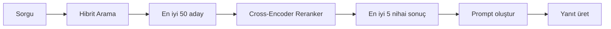
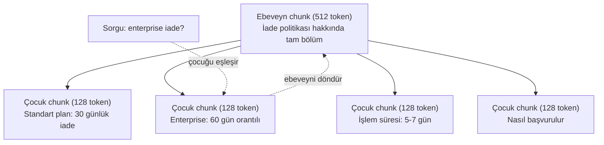
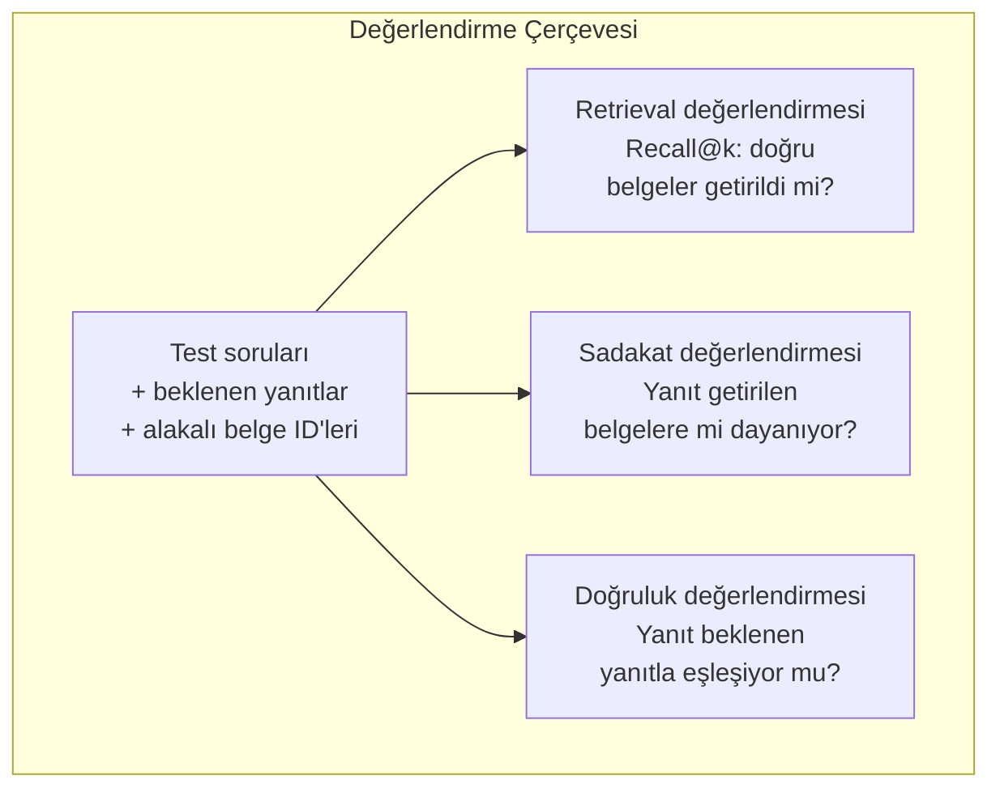

# Gelişmiş RAG (Chunking, Reranking, Hibrit Arama)

> Temel RAG, en benzer top-k chunk'ları getirir. Basit sorular için çalışır. Çoklu atlama muhakemesi, belirsiz sorgular ve büyük corpus'larda çöker. Gelişmiş RAG, 10 belge üzerinde çalışan bir demo ile 10 milyon belge üzerinde çalışan bir sistem arasındaki farktır.

**Tür:** Build
**Diller:** Python
**Önkoşullar:** Phase 11, Lesson 06 (RAG)
**Süre:** ~90 dakika
**İlgili:** Phase 5 · 23 (Chunking Strategies for RAG) altı chunking algoritmasını kapsar — recursive, semantic, sentence, parent-document, late chunking, contextual retrieval — Vectara/Anthropic benchmark'larıyla. Bu ders üzerine inşa eder: hibrit arama, reranking, query transformation.

## Öğrenme Hedefleri

- Belge yapısını ve bağlamı koruyan gelişmiş chunking stratejileri (anlamsal, özyinelemeli, ebeveyn-çocuk) uygulamak
- BM25 anahtar kelime eşleşmesini anlamsal vektör aramasıyla ve bir cross-encoder reranker ile birleştiren bir hibrit arama hattı oluşturmak
- Belirsiz veya karmaşık sorularda retrieval'ı iyileştirmek için query transformation teknikleri (HyDE, multi-query, step-back) uygulamak
- Yaygın RAG hatalarını teşhis etmek ve düzeltmek: yanlış chunk getirilmesi, yanıtın context'te olmaması, çoklu atlama muhakemesinin bozulması

## Sorun

Lesson 06'da temel bir RAG hattı oluşturdunuz. Küçük bir corpus üzerinde doğrudan sorular için çalışıyor. Şimdi bunları deneyin:

**Belirsiz sorgu**: "Geçen çeyrekte gelir ne oldu?" Anlamsal arama, gelir stratejisi, gelir projeksiyonları ve CFO'nun gelir büyümesi hakkındaki düşünceleri hakkında chunk'lar döndürür. Hepsi "gelir" kelimesine anlamsal olarak benzer. Hiçbiri gerçek sayıyı içermiyor. Doğru chunk "$47.2M in Q3 2025" diyor ama "gelir" yerine "kazanç" kelimesini kullanıyor. Embedding modeli "gelir stratejisi"nin "Q3 kazançları $47.2M idi" ifadesinden daha yakın olduğunu düşünüyor.

**Çoklu atlama sorusu**: "Hangi takım müşteri memnuniyet skorunda en yüksek iyileşmeyi gösterdi?" Bu, her takımın memnuniyet skorlarını bulmayı, karşılaştırmayı ve maksimumu belirlemeyi gerektirir. Tek bir chunk cevabı içermez. Bilgi takım raporlarına dağılmıştır.

**Büyük corpus sorunu**: 2 milyon chunk'ınız var. Doğru cevap chunk #1.847.293'te. Top-5 retrieval #14, #89.201, #1.200.000, #44 ve #901.333 chunk'larını getiriyor. Embedding uzayında yakın ama cevabı içeren none. Bu ölçekte, yaklaşık en yakın komşu araması yeterli hata getirir ve alakalı sonuçlar top-k'nın dışına itilir.

Temel RAG, vektör benzerliğinin alakalık ile aynı olmadığı için başarısız olur. Bir chunk, soruyu yanıtlamak için faydalı olmadan sorguyla anlamsal olarak benzer olabilir. Gelişmiş RAG bunu dört teknikle ele alır: hibrit arama (anahtar kelime eşleştirmesi ekleme), reranking (adayları daha dikkatli puanlama), query transformation (aramadan önce sorguyu düzeltme) ve daha iyi chunking (doğru granularity'da getirme).

## Kavram

### Hibrit Arama: Anlamsal + Anahtar Kelime

Anlamsal arama (vektör benzerliği) anlamı anlamada iyidir. "Aboneliğimi nasıl iptal ederim?" ifadesi "Planınızı sonlandırmanızın adımları" ile eşleşir ama hiçbir kelimeyi paylaşmaz. Ama tam eşleşmeleri kaçırır. "Hata kodu E-4021", embedding modeli bunu gürültü olarak değerlendirirse "E-4021" içeren bir chunk ile eşleşmeyebilir.

Anahtar kelime araması (BM25) tam tersidir. Tam eşleşmelerde mükemmeldir. "E-4021" mükemmel eşleşir. Ama belge "planınızı sonlandırın" diyorsa "aboneliğimi iptal ediyorum" sıfır sonuç verir.

Hibrit arama her ikisini de çalıştırır, sonra sonuçları birleştirir.

**BM25** (Best Matching 25) standart anahtar kelime arama algoritmasıdır. 1990'lardan beri arama motorlarının omurgası olmuştur. Formül:

```
BM25(q, d) = sum over terms t in q:
    IDF(t) * (tf(t,d) * (k1 + 1)) / (tf(t,d) + k1 * (1 - b + b * |d| / avgdl))
```

Burada tf(t,d) t teriminin belge d'deki terim sıklığıdır, IDF(t) ters belge sıklığıdır, |d| belge uzunluğudur, avgdl ortalama belge uzunluğudur, k1 terim sıklığı doygunluğunu kontrol eder (varsayılan 1.2), b ise uzunluk normalizasyonunu kontrol eder (varsayılan 0.75).

Düz bir ifadeyle: BM25, belgeleri sorgu terimlerini (özellikle nadir olanları) içerdiğinde daha yüksek puanlar, ama tekrar eden terimler için azalan getiri ile. "Gelir" kelimesini 50 kez içeren bir belge, bir kez içeren bir belgeden 50x daha alakalı değildir.

### Reciprocal Rank Fusion (RRF)

İki sıralı listeniz var: biri vektör aramasından, diğeri BM25'ten. Bunları nasıl birleştirirsiniz? Reciprocal Rank Fusion standart yaklaşımdır.

```
RRF_score(d) = sum over rankings R:
    1 / (k + rank_R(d))
```

Burada k, en yüksek sıralı sonucun baskın olmasını önleyen bir sabittir (tipik olarak 60).

Vektör aramasında #1 ve BM25'te #5 sıralı bir belge: 1/(60+1) + 1/(60+5) = 0.0164 + 0.0154 = 0.0318

Vektör aramasında #3 ve BM25'te #2 sıralı bir belge: 1/(60+3) + 1/(60+2) = 0.0159 + 0.0161 = 0.0320

RRF doğal olarak iki sinyali dengeler. Her iki listede de yüksek sıralanan bir belge en iyi skoru alır. Bir listede #1 olan ama diğerinde olmayan bir belge orta düzeyde bir skor alır. Bu dayanıklıdır çünkü sıralamaları kullanır, ham skorları değil, bu yüzden iki sistem arasındaki skor dağılımlarındaki farklar önemli değildir.

### Reranking

Retrieval (ister vektör, ister anahtar kelime, ister hibrit olsun) hızlı ama kesin değildir. Bi-encoder kullanır: sorgu ve her belge bağımsız olarak embed edilir, sonra karşılaştırılır. Embedding'ler bir kez hesaplanır ve cache'lenir. Bu milyonlarca belgeye kadar ölçeklenir.

Reranking cross-encoder kullanır: sorgu ve bir aday belge birlikte bir modele beslenir ve model bir alakalık skoru üretir. Model her iki metni aynı anda görür ve arasındaki ince etkileşimleri yakalayabilir. Bir cross-encoder, bi-encoder bağlantıyı kaçırmış olsa bile "Q3 kazançları neydi?" sorusunun "$47.2M in Q3" içeren bir chunk ile son derece alakalı olduğunu anlayabilir.

Ödünleşim: cross-encoder'lar bi-encoder'lardan 100-1000x daha yavaştır çünkü sorgu-belge çiftini birlikte işler. Bir milyon belge için cross-encoder skorları önceden hesaplayamazsınız. Çözüm: daha büyük bir aday kümesi getirin (hibrit aramadan top-50), sonra cross-encoder ile yeniden sıralayarak nihai top-5'i elde edin.



Yaygın reranking modelleri (2026 listesi):
- Cohere Rerank 3.5: yönetilen API, çok dilli, karmaşık corpus'larda en yüksek recall kazancı
- Voyage rerank-2.5: yönetilen API, barındırılan seçeneklerin en düşük gecikmesi
- Jina-Reranker-v2 Multilingual: açık-ağırlıklı, 100+ dil
- bge-reranker-v2-m3: açık-ağırlıklı, güçlü temel
- cross-encoder/ms-marco-MiniLM-L-6-v2: açık-ağırlıklı, prototipleme için CPU'da çalışır
- ColBERTv2 / Jina-ColBERT-v2: geç etkileşimli çoklu vektör reranker'ları — puanlama zamanında O(docs) değil O(tokens)

### Query Transformation

Bazen sorun retrieval'da değil sorgunun kendisindedir. "Yeni politika değişikliğiyle ilgili o şey neydi?" berbat bir arama sorgusudur. Hiçbir terim içermez. Embedding belirsizdir. Hiçbir retrieval sistemi doğru belgeleri bu sorgudan bulamaz.

**Sorgu yeniden yazma**: kullanıcının sorgusunu daha iyi bir arama sorgusuna yeniden yazın. Bir LLM bunu yapabilir:

```
User: "What was that thing about the new policy change?"
Yeniden yazılmış: "Recent policy changes and updates"
```

**HyDE (Hypothetical Document Embeddings)**: sorguyla arama yapmak yerine, hayali bir yanıt üretin, onu embed edin ve benzer gerçek belgeleri arayın.

```
Sorgu: "What is the refund policy for enterprise?"
Hayali yanıt: "Enterprise customers are eligible for a full refund
within 60 days of purchase. Refunds are pro-rated based on the remaining
subscription period and processed within 5-7 business days."
```

Hayali yanıtı embed edin ve ona benzer gerçek belgeleri arayın. sezgisel yaklaşım: hayali yanıt, orijinal sorudan ziyade gerçek yanıta embedding uzayında daha yakındır. Sorular ve yanıtlar farklı dilbilgisi yapılarına sahiptir. Hayali bir yanıt üreterek, embedding'deki "soru uzayı" ve "yanıt uzayı" arasındaki köprüyü kurarsınız.

HyDE, retrieval'dan önce bir LLM çağrısı ekler. Bu gecikmeyi 500-2000ms artırır. Ham sorgularda retrieval kalitesi düşük olduğunda buna değer.

### Ebeveyn-Çocuk Chunking'i

Standart chunking bir ödünleşimi zorunlu kılar: hassas retrieval için küçük chunk'lar, yeterli context için büyük chunk'lar. Ebeveyn-çocuk chunking'i bu ödünleşimi ortadan kaldırır.

Retrieval için küçük chunk'ları (128 token) indeksleyin. Bir küçük chunk getirildiğinde, prompt için ebeveyn chunk'ını (512 token) döndürün. Küçük chunk sorguyu hassas bir şekilde eşler. Ebeveyn chunk, LLM'in iyi bir yanıt üretmesi için yeterli context sağlar.



Sorgu "enterprise iade?" C2 çocuk chunk'ını hassas bir şekilde eşler. Ama prompt tam ebeveyn chunk P'yi alır, bu da işlem süresi ve başvuru süreci hakkındaki çevresel context'i içerir.

### Metadata Filtreleme

Vektör aramasından önce, corpus'u metadata'ya göre filtreleyin: tarih, kaynak, kategori, dil. Bu arama alanını daraltır ve alakasız sonuçları önler.

"Geçen ay güvenlik politikasında ne değişti?" yalnızca son 30 günün güvenlik kategorisindeki belgeleri aramalıdır. Metadata filtreleme olmadan, tüm corpus'u ararsınız ve tesadüfen anlamsal olarak benzer olan 2 yıllık bir güvenlik belgesini getirebilirsiniz.

Üretim RAG sistemleri her chunk'ın yanında metadata saklar: kaynak belge, oluşturma tarihi, kategori, yazar, versiyon. Vektör veritabanları, benzerlik aramasından önce metadata'ya göre ön filtrelemeyi destekler; bu, ölçekleme performansı için kritiktir.

### Değerlendirme

Bir RAG sistemi oluşturdunuz. Çalıştığını nereden biliyorsunuz? Üç metrik:

**Retrieval alakalılığı (Recall@k)**: bilinen alakalı belgeleri olan test soruları kümesi için, alakalı belgelerin yüzde kaçı top-k sonuçlarında görünür? Bir sorunun cevabı chunk #47'de ise, chunk #47 top-5'te görünür mü?

**Sadakat (Faithfulness)**: üretilen yanıt getirilen belgelere mi dayanıyor? Getirilen chunk'lar "60 günlük iade süresi" diyor ve model "90 günlük iade süresi" diyorsa, bu bir sadakat hatasıdır. Model doğru context'e sahip olmasına rağmen halüsinasyon yapmıştır.

**Yanıt doğruluğu**: üretilen yanıt beklenen yanıtla eşleşiyor mu? Bu uçtan uca metriktir. Retrieval kalitesini ve üretim kalitesini birleştirir.

Basit bir sadakat kontrolü: üretilen yanıttaki her iddiayı alın ve (özünde) getirilen chunk'larda görünüp görünmediğini doğrulayın. Yanıt herhangi bir getirilen chunk'ta olmayan bir olgu içeriyorsa, muhtemelen halüsinasyondur.



## Yap

### Adım 1: BM25 Uygulaması

```python
import math
from collections import Counter

class BM25:
    def __init__(self, k1=1.2, b=0.75):
        self.k1 = k1
        self.b = b
        self.docs = []
        self.doc_lengths = []
        self.avg_dl = 0
        self.doc_freqs = {}
        self.n_docs = 0

    def index(self, documents):
        self.docs = documents
        self.n_docs = len(documents)
        self.doc_lengths = []
        self.doc_freqs = {}

        for doc in documents:
            words = doc.lower().split()
            self.doc_lengths.append(len(words))
            unique_words = set(words)
            for word in unique_words:
                self.doc_freqs[word] = self.doc_freqs.get(word, 0) + 1

        self.avg_dl = sum(self.doc_lengths) / self.n_docs if self.n_docs else 1

    def score(self, query, doc_idx):
        query_words = query.lower().split()
        doc_words = self.docs[doc_idx].lower().split()
        doc_len = self.doc_lengths[doc_idx]
        word_counts = Counter(doc_words)
        score = 0.0

        for term in query_words:
            if term not in word_counts:
                continue
            tf = word_counts[term]
            df = self.doc_freqs.get(term, 0)
            idf = math.log((self.n_docs - df + 0.5) / (df + 0.5) + 1)
            numerator = tf * (self.k1 + 1)
            denominator = tf + self.k1 * (1 - self.b + self.b * doc_len / self.avg_dl)
            score += idf * numerator / denominator

        return score

    def search(self, query, top_k=10):
        scores = [(i, self.score(query, i)) for i in range(self.n_docs)]
        scores.sort(key=lambda x: x[1], reverse=True)
        return scores[:top_k]
```

### Adım 2: Reciprocal Rank Fusion

```python
def reciprocal_rank_fusion(ranked_lists, k=60):
    scores = {}
    for ranked_list in ranked_lists:
        for rank, (doc_id, _) in enumerate(ranked_list):
            if doc_id not in scores:
                scores[doc_id] = 0.0
            scores[doc_id] += 1.0 / (k + rank + 1)
    fused = sorted(scores.items(), key=lambda x: x[1], reverse=True)
    return fused
```

### Adım 3: Hibrit Arama Hattı

```python
def hybrid_search(query, chunks, vector_embeddings, vocab, idf, bm25_index, top_k=5, fusion_k=60):
    query_emb = tfidf_embed(query, vocab, idf)
    vector_results = search(query_emb, vector_embeddings, top_k=top_k * 3)
    bm25_results = bm25_index.search(query, top_k=top_k * 3)
    fused = reciprocal_rank_fusion([vector_results, bm25_results], k=fusion_k)
    return fused[:top_k]
```

### Adım 4: Basit Reranker

Üretimde bir cross-encoder modeli kullanırsınız. Burada, kelime örtüşmesi, terim önemi ve deyimsel eşleşme kullanarak sorgu-belge alakasını puanlayan bir reranker oluşturuyoruz.

```python
def rerank(query, candidates, chunks):
    query_words = set(query.lower().split())
    stop_words = {"the", "a", "an", "is", "are", "was", "were", "what", "how",
                  "why", "when", "where", "do", "does", "for", "of", "in", "to",
                  "and", "or", "on", "at", "by", "it", "its", "this", "that",
                  "with", "from", "be", "has", "have", "had", "not", "but"}
    query_terms = query_words - stop_words

    scored = []
    for doc_id, initial_score in candidates:
        chunk = chunks[doc_id].lower()
        chunk_words = set(chunk.split())

        term_overlap = len(query_terms & chunk_words)

        query_bigrams = set()
        q_list = [w for w in query.lower().split() if w not in stop_words]
        for i in range(len(q_list) - 1):
            query_bigrams.add(q_list[i] + " " + q_list[i + 1])
        bigram_matches = sum(1 for bg in query_bigrams if bg in chunk)

        position_boost = 0
        for term in query_terms:
            pos = chunk.find(term)
            if pos != -1 and pos < len(chunk) // 3:
                position_boost += 0.5

        rerank_score = (
            term_overlap * 1.0
            + bigram_matches * 2.0
            + position_boost
            + initial_score * 5.0
        )
        scored.append((doc_id, rerank_score))

    scored.sort(key=lambda x: x[1], reverse=True)
    return scored
```

### Adım 5: HyDE (Hypothetical Document Embeddings)

```python
def hyde_generate_hypothesis(query):
    templates = {
        "what": "The answer to '{query}' is as follows: Based on our documentation, {topic} involves specific policies and procedures that define how the process works.",
        "how": "To address '{query}': The process involves several steps. First, you need to initiate the request. Then, the system processes it according to the defined rules.",
        "default": "Regarding '{query}': Our records indicate specific details and policies related to this topic that provide a comprehensive answer."
    }
    query_lower = query.lower()
    if query_lower.startswith("what"):
        template = templates["what"]
    elif query_lower.startswith("how"):
        template = templates["how"]
    else:
        template = templates["default"]

    topic_words = [w for w in query.lower().split()
                   if w not in {"what", "is", "the", "how", "do", "does", "a", "an",
                                "for", "of", "to", "in", "on", "at", "by", "and", "or"}]
    topic = " ".join(topic_words) if topic_words else "this topic"

    return template.format(query=query, topic=topic)


def hyde_search(query, chunks, vector_embeddings, vocab, idf, top_k=5):
    hypothesis = hyde_generate_hypothesis(query)
    hypothesis_emb = tfidf_embed(hypothesis, vocab, idf)
    results = search(hypothesis_emb, vector_embeddings, top_k)
    return results, hypothesis
```

### Adım 6: Ebeveyn-Çocuk Chunking'i

```python
def create_parent_child_chunks(text, parent_size=200, child_size=50):
    words = text.split()
    parents = []
    children = []
    child_to_parent = {}

    parent_idx = 0
    start = 0
    while start < len(words):
        parent_end = min(start + parent_size, len(words))
        parent_text = " ".join(words[start:parent_end])
        parents.append(parent_text)

        child_start = start
        while child_start < parent_end:
            child_end = min(child_start + child_size, parent_end)
            child_text = " ".join(words[child_start:child_end])
            child_idx = len(children)
            children.append(child_text)
            child_to_parent[child_idx] = parent_idx
            child_start += child_size

        parent_idx += 1
        start += parent_size

    return parents, children, child_to_parent
```

### Adım 7: Sadakat Değerlendirmesi

```python
def evaluate_faithfulness(answer, retrieved_chunks):
    answer_sentences = [s.strip() for s in answer.split(".") if len(s.strip()) > 10]
    if not answer_sentences:
        return 1.0, []

    grounded = 0
    ungrounded = []
    context = " ".join(retrieved_chunks).lower()

    for sentence in answer_sentences:
        words = set(sentence.lower().split())
        stop_words = {"the", "a", "an", "is", "are", "was", "were", "and", "or",
                      "to", "of", "in", "for", "on", "at", "by", "it", "this", "that"}
        content_words = words - stop_words
        if not content_words:
            grounded += 1
            continue

        matched = sum(1 for w in content_words if w in context)
        ratio = matched / len(content_words) if content_words else 0

        if ratio >= 0.5:
            grounded += 1
        else:
            ungrounded.append(sentence)

    score = grounded / len(answer_sentences) if answer_sentences else 1.0
    return score, ungrounded


def evaluate_retrieval_recall(queries_with_relevant, retrieval_fn, k=5):
    total_recall = 0.0
    results = []

    for query, relevant_indices in queries_with_relevant:
        retrieved = retrieval_fn(query, k)
        retrieved_indices = set(idx for idx, _ in retrieved)
        relevant_set = set(relevant_indices)
        hits = len(retrieved_indices & relevant_set)
        recall = hits / len(relevant_set) if relevant_set else 1.0
        total_recall += recall
        results.append({
            "query": query,
            "recall": recall,
            "hits": hits,
            "total_relevant": len(relevant_set)
        })

    avg_recall = total_recall / len(queries_with_relevant) if queries_with_relevant else 0
    return avg_recall, results
```

## Kullan

Gerçek bir cross-encoder ile reranking:

```python
from sentence_transformers import CrossEncoder

reranker = CrossEncoder("cross-encoder/ms-marco-MiniLM-L-6-v2")

def rerank_with_cross_encoder(query, candidates, chunks, top_k=5):
    pairs = [(query, chunks[doc_id]) for doc_id, _ in candidates]
    scores = reranker.predict(pairs)
    scored = list(zip([doc_id for doc_id, _ in candidates], scores))
    scored.sort(key=lambda x: x[1], reverse=True)
    return scored[:top_k]
```

Cohere'nin yönetilen reranker'ı ile:

```python
import cohere

co = cohere.Client()

def rerank_with_cohere(query, candidates, chunks, top_k=5):
    docs = [chunks[doc_id] for doc_id, _ in candidates]
    response = co.rerank(
        model="rerank-english-v3.0",
        query=query,
        documents=docs,
        top_n=top_k
    )
    return [(candidates[r.index][0], r.relevance_score) for r in response.results]
```

Gerçek bir LLM ile HyDE:

```python
import anthropic

client = anthropic.Anthropic()

def hyde_with_llm(query):
    response = client.messages.create(
        model="claude-sonnet-4-20250514",
        max_tokens=256,
        messages=[{
            "role": "user",
            "content": f"Write a short paragraph that would be a good answer to this question. Do not say you don't know. Just write what the answer would look like.\n\nQuestion: {query}"
        }]
    )
    return response.content[0].text
```

Weaviate ile üretim hibrit araması:

```python
import weaviate

client = weaviate.connect_to_local()

collection = client.collections.get("Documents")
response = collection.query.hybrid(
    query="enterprise refund policy",
    alpha=0.5,
    limit=10
)
```

Alpha parametresi dengeyi kontrol eder: 0.0 = saf anahtar kelime (BM25), 1.0 = saf vektör, 0.5 = eşit ağırlık. Çoğu üretim sistemi 0.3 ile 0.7 arasında alpha kullanır.

## Teslim Et

Bu ders şunları üretir:
- `outputs/prompt-advanced-rag-debugger.md` — RAG kalitesi sorunlarını teşhis etme ve düzeltme promptu
- `outputs/skill-advanced-rag.md` — hibrit arama ve reranking ile üretim sınıfı RAG oluşturma becerisi

## Alıştırmalar

1. Örnek belgeler üzerinde BM25 vs vektör araması vs hibrit araması karşılaştırın. 5 test sorgusunun her biri için, hangi yaklaşımın 1. pozisyonda en alakalı chunk'ı getirdiğini kaydedin. Hibrit arama en az 5'te 3'ü kazanmalıdır.

2. Bir metadata filtresi uygulayın. Her belgeye bir "kategori" alanı ekleyin (güvenlik, faturalandırma, api, ürün). Vektör aramasından önce chunk'ları yalnızca ilgili kategoriye filtreleyin. "Hangi şifreleme kullanılıyor?" ile test edin ve yalnızca güvenlik kategorisindeki chunk'ları aradığını doğrulayın.

3. Lesson 06'daki basit generate fonksiyonunu kullanarak tam bir HyDE hattı oluşturun. Tüm 5 test sorgusu için doğrudan sorgu araması ile HyDE araması arasında retrieval kalitesini (top-3 alakalılık) karşılaştırın. HyDE belirsiz sorgularda sonuçları iyileştirmelidir.

4. Örnek belgeler üzerinde ebeveyn-çocuk chunking stratejisini uygulayın. child_size=30 ve parent_size=100 kullanın. Çocuk chunk'larla arama yapın ama prompt'ta ebeveyn chunk'ları döndürün. Oluşturulan yanıtları chunk_size=50 ile standart chunking ile karşılaştırın.

5. Bir değerlendirme veri seti oluşturun: bilinen yanıt chunk'larına sahip 10 soru. (a) yalnızca vektör araması, (b) yalnızca BM25, (c) hibrit arama, (d) hibrit + reranking için Recall@3, Recall@5 ve Recall@10 ölçün. Sonuçları çizin ve reranking'in en çok nerede yardımcı olduğunu belirleyin.

## Anahtar Terimler

| Terim | İnsanlar ne söylüyor | Gerçekte ne anlama geliyor |
|------|----------------------|--------------------------|
| BM25 | "Anahtar kelime araması" | Terim sıklığı, ters belge sıklığı ve belge uzunluğu normalizasyonu ile belgeleri puanlayan olasılıksal sıralama algoritması |
| Hibrit arama | "İki dünyanın en iyisi" | Anlamsal (vektör) ve anahtar kelime (BM25) aramasını paralel çalıştırma, sonra sonuçları sıralama füzyonu ile birleştirme |
| Reciprocal Rank Fusion | "Sıralı listeleri birleştirme" | Her belge için tüm listelerde 1/(k + rank) toplayarak birden fazla sıralı listeyi birleştirme |
| Reranking | "İkinci geçiş puanlama" | İlk retrieval'dan gelen bir aday kümesini yeniden puanlamak için daha pahalı bir cross-encoder modeli kullanma |
| Cross-encoder | "Ortak sorgu-belge modeli" | Sorguyu ve belgeyi tek bir girdi olarak alan, bir alakalık skoru üreten model; bi-encoder'lardan daha doğru ama tüm corpus araması için çok yavaş |
| Bi-encoder | "Bağımsız embedding modeli" | Sorguları ve belgeleri bağımsız olarak embed eden model; embedding'ler önceden hesaplandığı için hızlı ama cross-encoder'lardan daha az doğru |
| HyDE | "Sahte yanıtla arama" | Sorguya hayali bir yanıt üretme, onu embed etme ve ona benzer gerçek belgeleri arama |
| Ebeveyn-çocuk chunking | "Küçük arama, büyük context" | Hassas retrieval için küçük chunk'ları indeksleme ama yeterli context sağlamak için daha büyük ebeveyn chunk'ını döndürme |
| Metadata filtreleme | "Aramadan önce daraltma" | Vektör aramasından önce belgeleri özniteliklere (tarih, kaynak, kategori) göre filtreleyerek arama alanını daraltma |
| Sadakat | "Grounded kaldı mı" | Üretilen yanıtın modelin eğitim verisinden halüsinasyon yapmak yerine getirilen belgeler tarafından desteklenip desteklenmediği |

## İleri Okuma

- Robertson & Zaragoza, "The Probabilistic Relevance Framework: BM25 and Beyond" (2009) — BM25'in olasılıksal temellerini açıklayan temel referans
- Cormack ve ark., "Reciprocal Rank Fusion Outperforms Condorcet and Individual Rank Learning Methods" (2009) — RRF'in daha karmaşık füzyon yöntemlerini yendiğini gösteren orijinal makale
- Gao ve ark., "Precise Zero-Shot Dense Retrieval without Relevance Labels" (2022) — HyDE makalesi, hayali document embedding'lerin eğitim verisi olmadan retrieval'ı iyileştirdiğini gösteriyor
- Nogueira & Cho, "Passage Re-ranking with BERT" (2019) — BM25 üzerine cross-encoder reranking'in retrieval kalitesini önemli ölçüde artırdığını gösterdi
- Khattab ve ark., "DSPy: Compiling Declarative Language Model Calls into Self-Improving Pipelines" (2023) — prompt oluşturma ve ağırlık seçimini retrieval hatları üzerinde bir optimizasyon problemi olarak ele alıyor
- Edge ve ark., "From Local to Global: A Graph RAG Approach to Query-Focused Summarization" (Microsoft Research 2024) — GraphRAG makalesi: global vs local retrieval ayrımı
- Asai ve ark., "Self-RAG: Learning to Retrieve, Generate, and Critique through Self-Reflection" (ICLR 2024) — reflection token'larıyla kendi kendini değerlendiren RAG
- LangChain Query Construction blogu — doğal dil sorgularını yapılandırılmış veritabanı sorgularına nasıl çevireceğiniz
