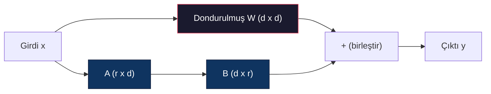
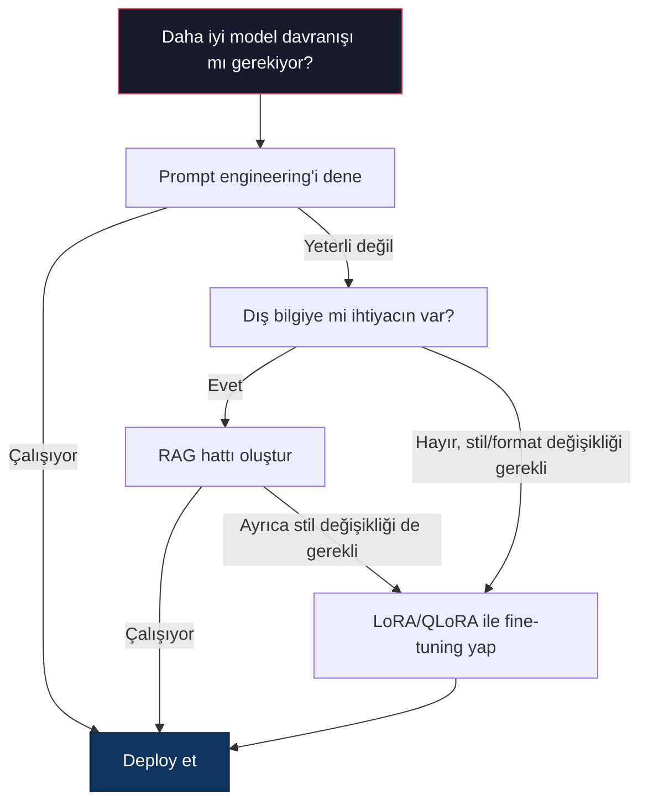

# LoRA ve QLoRA ile Fine-Tuning

> 7B modelin tam fine-tuning'i 56GB VRAM gerektirir. Sizin yok. Çoğu şirketin de yok. LoRA, parametrelerin %1'inden azını eğiterek aynı modeli 6GB'da fine-tuning yapmanızı sağlar. Bu bir uzlaşma değildir — çoğu görevde tam fine-tuning kalitesini eşler. Tüm açık kaynak fine-tuning ekosistemi bu tek numara üzerinde çalışır.

**Tür:** Build
**Diller:** Python
**Önkoşullar:** Phase 10, Lesson 06 (Instruction Tuning / SFT)
**Süre:** ~75 dakika
**İlgili:** Phase 10, SFT/DPO döngülerini sıfırdan kapsar. Bu ders bunları 2026 PEFT araç setlerine (PEFT, TRL, Unsloth, Axolotl, LLaMA-Factory) bağlar.

## Öğrenme Hedefleri

- LoRA'yı, düşük rank adapter matrislerini (A ve B) eğitilmiş bir modelin attention katmanlarına enjekte ederek uygulamak
- LoRA'nın tam fine-tuning'e göre parametre tasarrufunu hesaplamak: d_model boyutlarında rank r, d^2 yerine 2*r*d parametre eğitir
- QLoRA (4-bit quantized taban + LoRA adapter'ları) kullanarak consumer GPU belleğine sığacak şekilde modeli fine-tuning etmek
- Deploy için LoRA ağırlıklarını taban modele geri birleştirmek ve adapter'lı/adjaptersız inference hızını karşılaştırmak

## Sorun

Bir taban modeliniz var. Llama 3 8B. Bunu şirketinizin sesiyle müşteri destek taleplerine yanıtlamasını istiyorsunuz. SFT cevaptır. Ama SFT'nin bir maliyet sorunu var.

Tam fine-tuning, modeldeki her parametreyi günceller. Llama 3 8B'nin 8 milyar parametresi var. fp16'da her parametre 2 byte alır. Yalnızca ağırlıkları yüklemek 16GB demektir. Eğitim sırasında gradyanlara (16GB), Adam için optimize edici durumlarına (momentum + varyans için 32GB) ve aktivasyonlara ihtiyacınız vardır. Toplam: tek bir 8B model için yaklaşık 56GB VRAM.

Bir A100 80GB buna zor sığar. İki A100 bulut sağlayıcılarında saatte $3-4 tutar. 50.000 örnek üzerinde 3 epoch eğitim 6-10 saat sürer. Bu deney başına $30-40 demektir. Hiperparametreleri doğru bulmak için 10 deney çalıştırın, deploy etmeden $400 harcamış olursunuz.

Bunu Llama 3 70B'ye ölçekleyin, sayılar komikleşir. Yalnızca ağırlıklar için 140GB. Bir kümeye ihtiyacınız var. Deney başına $100+.

Daha derin bir sorun da var. Tam fine-tuning modeldeki her ağırlığı değiştirir. Müşteri desteği verisiyle fine-tuning yaparsanız, modelin genel yeteneklerini bozabilirsiniz. Buna catastrophic forgetting (felaket unutma) denir. Model görevinizde daha iyi, her şeyde daha kötü hale gelir.

Daha az parametre eğiten, daha az bellek kullanan ve mevcut bilgiyi yok etmeyen bir yöntem gerekiyor.

## Kavram

### LoRA: Düşük Rank Adaptasyonu

Edward Hu ve Microsoft'taki meslektaşları LoRA'yı Haziran 2021'de yayımladı. Makalenin içgörüsü: fine-tuning sırasında yapılan ağırlık güncellemelerinin düşük içsel rank'ı var. 4096x4096 ağırlık matrisindeki 16,7 milyon parametrenin tamamını güncellemenize gerek yok. Güncellemedeki yararlı bilgi 16 veya 32 rank'lı bir matrisle yakalanabilir.

İşte matematik. Standart bir doğrusal katman şunu hesaplar:

```
y = Wx
```

Burada W bir d_out x d_in matrisidir. 4096x4096 attention projeksiyonu için bu 16.777.216 parametre demektir.

LoRA'yı dondurur ve düşük rank bir ayrıştırma ekler:

```
y = Wx + BAx
```

Burada B (d_out x r) ve A (r x d_in) şeklindedir. Rank r, d'den çok daha küçüktür — tipik olarak 8, 16 veya 32.

4096x4096 katmanında r=16 için:
- Orijinal parametreler: 4096 x 4096 = 16.777.216
- LoRA parametreleri: (4096 x 16) + (16 x 4096) = 65.536 + 65.536 = 131.072
- Azalma: 131.072 / 16.777.216 = %0.78

Parametrelerin %0.78'ini eğitiyorsunuz ve kalitenin %95-100'ünü alıyorsunuz.



A rastgele Gauss ile başlatılır. B sıfırla başlatılır. Bu, LoRA katkısının sıfırla başlaması demektir — model orijinal davranışından başlar ve adaptasyonu kademeli olarak öğrenir.

### Ölçekleme Faktörü: Alpha

LoRA, düşük rank güncellemenin çıktıya ne kadar etki ettiğini kontrol eden bir alpha ölçekleme faktörü sunar:

```
y = Wx + (alpha / r) * BAx
```

alpha = r olduğunda, ölçekleme 1x'tir. alpha = 2r (ortak varsayılan) olduğunda, ölçekleme 2x'tir. Bu hiperparametre, LoRA yolunun öğrenme hızını taban öğrenme hızından bağımsız olarak kontrol eder.

Pratik rehberlik:
- alpha = 2 * rank topluluk tarafından sık kullanılan bir kuraldır (orijinal makale çoğu deneyde alpha = rank kullandı)
- alpha = rank 1x ölçekleme verir, muhafazakar ama kararlı
- Daha yüksek alpha, adım başına daha büyük güncellemeler demektir, yakınsamayı hızlandırabilir veya instabiliteye neden olabilir

### LoRA Nereye Uygulanır

Transformer birçok doğrusal katman içerir. Hepsine LoRA eklemenize gerek yok. Orijinal makale farklı kombinasyonları test etti:

| Hedef Katmanlar | Eğitilebilir Parametre (7B) | Kalite |
|--------------|----------------------|---------|
| Yalnızca q_proj | 4.7M | İyi |
| q_proj + v_proj | 9.4M | Daha iyi |
| q_proj + k_proj + v_proj + o_proj | 18.9M | Attention için en iyi |
| Tüm doğrusal (attention + MLP) | 37.7M | Önemsiz kazanç, 2x parametre |

Çoğu görev için ideal nokta: q_proj + v_proj. Bu, self-attention'daki query ve value projeksiyonlarını hedefler; modelin neye odaklandığını ve hangi bilgiyi çıkardığını kontrol eder. MLP katmanları eklemek kod üretimi gibi karmaşık görevlerde yardımcı olur ama daha basit görevlerde azalan getiriyle parametre sayısını ikiye katlar.

### Rank Seçimi

Rank r adaptasyonun ifade gücünü kontrol eder:

| Rank | Eğitilebilir Parametre (katman başına) | En İyisi İçin |
|------|---------------------------|----------|
| 4 | 32.768 | Basit sınıflandırma, duygu analizi |
| 8 | 65.536 | Tek alan Q&A, özetleme |
| 16 | 131.072 | Çok alanlı görevler, talimat takibi |
| 32 | 262.144 | Karmaşık muhakeme, kod üretimi |
| 64 | 524.288 | Çoğu görevde azalan getiri |
| 128 | 1.048.576 | Nadiren haklı |

Hu ve ark. r=4'ün basit görevler için adaptasyonun çoğunu zaten yakaladığını gösterdi. r=8 ve r=16 pratikte en yaygın seçimlerdir. r=64'ün üzerine çıkmak nadiren kaliteyi artırır ve LoRA'nın bellek avantajını kaybetmeye başlar.

### QLoRA: 4-Bit Quantization + LoRA

Tim Dettmers ve Washington Üniversitesi'ndeki meslektaşları QLoRA'yı Mayıs 2023'te yayımladı. Fikir: dondurulmuş taban modeli 4-bit hassasiyete quantize edin, sonra fp16'da LoRA adapter'larını üzerine ekleyin.

Bu denklemi dramatik bir şekilde değiştirir:

| Yöntem | Ağırlık Belleği (7B) | Eğitim Belleği (7B) | Gerekli GPU |
|--------|-------------------|---------------------|-------------|
| Tam fine-tune (fp16) | 14GB | ~56GB | 1x A100 80GB |
| LoRA (fp16 taban) | 14GB | ~18GB | 1x A100 40GB |
| QLoRA (4-bit taban) | 3.5GB | ~6GB | 1x RTX 3090 24GB |

QLoRA üç teknik katkı sağlar:

**NF4 (Normal Float 4-bit)**: Sinir ağı ağırlıkları için özel olarak tasarlanmış yeni bir veri türü. Sinir ağı ağırlıkları kabaca normal dağılım izler. NF4, 16 quantization seviyesini standart normal dağılımın quantile'larına yerleştirir. Bu, normal dağılmış veriler için bilgi kuramsal olarak optimaldir.

**Çift quantization**: Quantization sabitlerinin kendisi bellek harcar. 64 ağırlıktan her blok bir fp32 ölçek faktörü (4 byte) gerektirir. 7B model için bu ekstra 0.4GB demektir. Çift quantization bu sabitleri fp8'e quantize ederek overhead'i 0.1GB'a düşürür. Küçük ama birikir.

**Sayfalı optimize ediciler**: Eğitim sırasında, optimize edici durumları (Adam'ın momentumu ve varyansı) uzun dizilerde GPU belleğini aşabilir. Sayfalı optimize ediciler, GPU belleği tükendiğinde optimize edici durumlarını otomatik olarak CPU RAM'ine sayfalamak için NVIDIA'nın birleşik belleğini kullanır ve gerektiğinde geri sayfalar.

### Kalite Sorusu

Parametrelerin azaltılması veya tabanın quantize edilmesi kaliteyi bozar mı? Birden fazla makaleden gelen sonuçlar:

| Yöntem | MMLU (5-shot) | MT-Bench | HumanEval |
|--------|--------------|----------|-----------|
| Tam fine-tune (Llama 2 7B) | 48.3 | 6.72 | 14.6 |
| LoRA r=16 | 47.9 | 6.68 | 14.0 |
| QLoRA r=16 (NF4) | 47.5 | 6.61 | 13.4 |
| QLoRA r=64 (NF4) | 48.1 | 6.70 | 14.2 |

r=16'da LoRA, çoğu benchmark'ta tam fine-tuning'in %1'i içinde. r=16'da QLoRA bir fraction daha kaybeder. r=64'te QLoRA %90 daha az bellek kullanırken neredeyse tam fine-tuning'i eşler.

### Gerçek Dünya Maliyetleri

50.000 örnek üzerinde Llama 3 8B fine-tuning (3 epoch):

| Yöntem | GPU | Süre | Maliyet |
|--------|-----|------|------|
| Tam fine-tune | 2x A100 80GB | 8 saat | ~$32 |
| LoRA r=16 | 1x A100 40GB | 4 saat | ~$8 |
| QLoRA r=16 | 1x RTX 4090 24GB | 6 saat | ~$5 |
| QLoRA r=16 (Unsloth) | 1x RTX 4090 24GB | 2.5 saat | ~$2 |
| QLoRA r=16 | 1x T4 16GB | 12 saat | ~$4 |

Tek consumer GPU'da QLoRA, bir öğle yemeğinden daha az tutar. Bu yüzden açık ağırlıklı fine-tuning topluluğu 2023'te patladı ve aşağıdaki her eğitim çerçevesi 2026'da QLoRA'yı varsayılan olarak sunuyor.

### 2026 PEFT Yığını

| Çerçeve | Ne olduğu | Ne Zaman Seçilir |
|-----------|-----------|-----------|
| **Hugging Face PEFT** | Kanonik LoRA/QLoRA/DoRA/IA3 kütüphanesi | Ham kontrol istiyorsanız ve eğitim döngünüz zaten `transformers.Trainer` üzerindeyse |
| **TRL** | HF'nin geri bildirimden öğrenme eğitmenleri (SFT, DPO, GRPO, PPO, ORPO) | SFT'den sonra DPO/GRPO'ya ihtiyacınız varsa; PEFT üzerine inşa edilmiştir |
| **Unsloth** | İleri/geri geçişin Triton-kernel yeniden yazımı | %2-5x hızlanma + doğruluk kaybı olmadan yarı VRAM istiyorsanız; Llama/Mistral/Qwen ailesi |
| **Axolotl** | PEFT + TRL + DeepSpeed + Unsloth üzerinde YAML-yapılandırmalı sarmalayıcı | Tekrar üretilebilir, versiyon kontrollü eğitim chạyları istiyorsanız |
| **LLaMA-Factory** | PEFT + TRL üzerinde GUI/CLI/API | Sıfır kod fine-tuning istiyorsanız; 100+ model ailesi destekleniyor |
| **torchtune** | Yerel PyTorch tarifleri, `transformers` bağımlılığı yok | Minimum bağımlılık istiyorsanız ve kuruluşunuz zaten PyTorch standartlaştırılmışsa |

Kural: araştırma kullanımı veya tek seferlik deney → PEFT. Tekrarlanabilir üretim hattı → Unsloth kernel'ları etkinleştirilmiş Axolotl. Atılabilir prototipleme → LLaMA-Factory.

### Adapter'ları Birleştirme

Eğitimden sonra iki şeyiniz var: dondurulmuş taban model ve küçük bir LoRA adapter'ı (tipik olarak 10-100MB). İkisinden birini yapabilirsiniz:

1. **Ayrı tutun**: Taban modeli yükleyin, üzerine adapter'ı yükleyin. Farklı görevler için adapter'ları değiştirin. Bu, bir taban modelden birden fazla fine-tuned varyantı sunmanızın yoludur.

2. **Kalıcı olarak birleştirin**: W' = W + (alpha/r) * BA hesaplayın ve sonucu yeni bir tam model olarak kaydedin. Birleştirilmiş model orijinal ile aynı boyuttadır. Inference overhead'i yoktur. Yönetilecek adapter yoktur.

Birden fazla görev sunmak için (müşteri desteği adapter'ı, kod adapter'ı, çeviri adapter'ı) ayrı tutun. Tek bir uzmanlaşmış model deploy etmek için birleştirin.

Birleştirmiş multiple adapter'ları birleştirme teknikleri:

- **TIES-Merging** (Yadav vd. 2023): Küçük büyüklükteki parametreleri budar, işaret çakışmalarını çözer, sonra birleştirir. Adapter'lar arasındaki etkileşimi azaltır.
- **DARE** (Yu vd. 2023): Birleştirmeden önce adapter parametrelerini rastgele düşürür ve kalanları yeniden ölçekler. Yetenekleri birleştirmekte şaşırtıcı derecede etkilidir.
- **Görev aritmetiği**: Adapter ağırlıklarını basitçe ekleyin veya çıkarın. Bir "kod" adapter'ı ve bir "matematik" adapter'ı eklemek genellikle ikisinde de iyi bir model üretir.

### Ne Zaman Fine-Tuning Yapılmaz

Fine-tuning üçüncü seçenektir, birincisi değil.

**Birinci: prompt engineering.** Daha iyi bir sistem promptu yazın. Few-shot örnekleri ekleyin. Chain-of-thought kullanın. Bu hiçbir şeye mal olmaz ve birkaç dakika sürer. Promptlama sizi %80'e kadar götürüyorsa, muhtemelen fine-tuning yapmanıza gerek yoktur.

**İkinci: RAG.** Modelin belirli verilerinizi (belgeler, bilgi bankası, ürün kataloğu) bilmesi gerekiyorsa, retrieval ağırlıklara işlemekten daha ucuz ve daha sürdürülebilirdir. Lesson 06'ya bakın.

**Üçüncü: fine-tuning.** Yalnızca modelin yalnızca promptlama ile elde edilemeyen belirli bir stil, format veya muhakeme modelini benimsemesi gerektiğinde kullanın. Tutarlı yapılandırılmış çıktılara ihtiyacınız olduğunda. Daha büyük bir modeli daha küçüğüne damıtmak istediğinizde. Gecikme önemli olduğunda ve few-shot promptlamanın ekstra token'larını karşılayamadığınızda.



## Yap

LoRA'yı saf PyTorch ile sıfırdan uyguluyoruz. Kütüphane yok. Sihir yok. LoRA katmanını oluşturacak, modele enjekte edecek, eğitecek ve ağırlıkları geri birleştireceksiniz.

### Adım 1: LoRA Katmanı

```python
import torch
import torch.nn as nn
import math

class LoRALayer(nn.Module):
    def __init__(self, in_features, out_features, rank=8, alpha=16):
        super().__init__()
        self.rank = rank
        self.alpha = alpha
        self.scaling = alpha / rank

        self.A = nn.Parameter(torch.randn(in_features, rank) * (1 / math.sqrt(rank)))
        self.B = nn.Parameter(torch.zeros(rank, out_features))

    def forward(self, x):
        return (x @ self.A @ self.B) * self.scaling
```

A ölçekli rastgele değerlerle başlatılır. B sıfırla başlatılır. BA çarpımı sıfırla başlar, böylece model orijinal davranışıyla başlar.

### Adım 2: LoRA ile Sarılmış Doğrusal Katman

```python
class LinearWithLoRA(nn.Module):
    def __init__(self, linear, rank=8, alpha=16):
        super().__init__()
        self.linear = linear
        self.lora = LoRALayer(
            linear.in_features, linear.out_features, rank, alpha
        )

        for param in self.linear.parameters():
            param.requires_grad = False

    def forward(self, x):
        return self.linear(x) + self.lora(x)
```

Orijinal doğrusal katman dondurulmuştur. Yalnızca LoRA parametreleri (A ve B) eğitilebilir.

### Adım 3: LoRA'yı Modele Enjekte Etme

```python
def inject_lora(model, target_modules, rank=8, alpha=16):
    for param in model.parameters():
        param.requires_grad = False

    lora_layers = {}
    for name, module in model.named_modules():
        if isinstance(module, nn.Linear):
            if any(t in name for t in target_modules):
                parent_name = ".".join(name.split(".")[:-1])
                child_name = name.split(".")[-1]
                parent = dict(model.named_modules())[parent_name]
                lora_linear = LinearWithLoRA(module, rank, alpha)
                setattr(parent, child_name, lora_linear)
                lora_layers[name] = lora_linear
    return lora_layers
```

Önce modeldeki her parametreyi dondurun. Sonra model ağacında yürüyün, hedef ad eşleşen doğrusal katmanları bulun ve bunları LoRA ile sarılmış sürümlerle değiştirin. LoRA A ve B matrisleri tüm modeldeki tek eğitilebilir parametrelerdir.

### Adım 4: Parametreleri Sayma

```python
def count_parameters(model):
    total = sum(p.numel() for p in model.parameters())
    trainable = sum(p.numel() for p in model.parameters() if p.requires_grad)
    frozen = total - trainable
    return {
        "total": total,
        "trainable": trainable,
        "frozen": frozen,
        "trainable_pct": 100 * trainable / total if total > 0 else 0
    }
```

### Adım 5: Ağırlıkları Geri Birleştirme

```python
def merge_lora_weights(model):
    for name, module in model.named_modules():
        if isinstance(module, LinearWithLoRA):
            with torch.no_grad():
                merged = (
                    module.lora.A @ module.lora.B
                ) * module.lora.scaling
                module.linear.weight.data += merged.T
            parent_name = ".".join(name.split(".")[:-1])
            child_name = name.split(".")[-1]
            if parent_name:
                parent = dict(model.named_modules())[parent_name]
            else:
                parent = model
            setattr(parent, child_name, module.linear)
```

Birleştirmeden sonra LoRA katmanları gider. Model orijinal ile aynı boyuttadır, adaptasyon ağırlıklara işlenmiştir. Inference overhead'i yoktur.

### Adım 6: Simüle Edilmiş QLoRA Quantization

```python
def quantize_to_nf4(tensor, block_size=64):
    blocks = tensor.reshape(-1, block_size)
    scales = blocks.abs().max(dim=1, keepdim=True).values / 7.0
    scales = torch.clamp(scales, min=1e-8)
    quantized = torch.round(blocks / scales).clamp(-8, 7).to(torch.int8)
    return quantized, scales

def dequantize_from_nf4(quantized, scales, original_shape):
    dequantized = quantized.float() * scales
    return dequantized.reshape(original_shape)
```

Bu, ağırlıkları 64'lük bloklarda 16 ayrık seviyeye haritalayarak 4-bit quantization'ı simüle eder. Üretim QLoRA'sı GPU'da gerçek NF4 için bitsandbytes kütüphanesini kullanır.

### Adım 7: Eğitim Döngüsü

```python
def train_lora(model, data, epochs=5, lr=1e-3, batch_size=4):
    optimizer = torch.optim.AdamW(
        [p for p in model.parameters() if p.requires_grad], lr=lr
    )
    criterion = nn.MSELoss()

    losses = []
    for epoch in range(epochs):
        epoch_loss = 0.0
        n_batches = 0
        indices = torch.randperm(len(data["inputs"]))

        for i in range(0, len(indices), batch_size):
            batch_idx = indices[i:i + batch_size]
            x = data["inputs"][batch_idx]
            y = data["targets"][batch_idx]

            output = model(x)
            loss = criterion(output, y)

            optimizer.zero_grad()
            loss.backward()
            optimizer.step()

            epoch_loss += loss.item()
            n_batches += 1

        avg_loss = epoch_loss / n_batches
        losses.append(avg_loss)

    return losses
```

### Adım 8: Tam Demo

```python
def demo():
    torch.manual_seed(42)
    d_model = 256
    n_classes = 10

    model = nn.Sequential(
        nn.Linear(d_model, 512),
        nn.ReLU(),
        nn.Linear(512, 512),
        nn.ReLU(),
        nn.Linear(512, n_classes),
    )

    n_samples = 500
    x = torch.randn(n_samples, d_model)
    y = torch.randint(0, n_classes, (n_samples,))
    y_onehot = torch.zeros(n_samples, n_classes).scatter_(1, y.unsqueeze(1), 1.0)

    data = {"inputs": x, "targets": y_onehot}

    params_before = count_parameters(model)

    lora_layers = inject_lora(
        model, target_modules=["0", "2"], rank=8, alpha=16
    )

    params_after = count_parameters(model)

    losses = train_lora(model, data, epochs=20, lr=1e-3)

    merge_lora_weights(model)
    params_merged = count_parameters(model)

    return {
        "params_before": params_before,
        "params_after": params_after,
        "params_merged": params_merged,
        "losses": losses,
    }
```

Demo küçük bir model oluşturur, iki katmana LoRA enjekte eder, eğitir ve ağırlıkları geri birleştirir. Parametre sayısı LoRA eğitimi sırasında tam eğitilebilirden ~%1'e düşer, sonra birleştirmeden sonra orijinal mimariye geri döner.

## Kullan

Hugging Face ekosistemi ile, gerçek bir modelde LoRA yaklaşık 20 satırda yapılır:

```python
from transformers import AutoModelForCausalLM, AutoTokenizer
from peft import LoraConfig, get_peft_model, TaskType

model = AutoModelForCausalLM.from_pretrained("meta-llama/Llama-3.1-8B")
tokenizer = AutoTokenizer.from_pretrained("meta-llama/Llama-3.1-8B")

lora_config = LoraConfig(
    task_type=TaskType.CAUSAL_LM,
    r=16,
    lora_alpha=32,
    lora_dropout=0.05,
    target_modules=["q_proj", "v_proj"],
)

model = get_peft_model(model, lora_config)
model.print_trainable_parameters()
```

QLoRA için bitsandbytes quantization ekleyin:

```python
from transformers import BitsAndBytesConfig

bnb_config = BitsAndBytesConfig(
    load_in_4bit=True,
    bnb_4bit_quant_type="nf4",
    bnb_4bit_compute_dtype=torch.bfloat16,
    bnb_4bit_use_double_quant=True,
)

model = AutoModelForCausalLM.from_pretrained(
    "meta-llama/Llama-3.1-8B",
    quantization_config=bnb_config,
    device_map="auto",
)

model = get_peft_model(model, lora_config)
```

Hepsi bu kadar. Aynı eğitim döngüsü. Aynı veri hattı. Taban model artık 4-bit'te, LoRA adapter'ları fp16'da eğitiliyor ve her şey 6GB'a sığıyor.

Hugging Face Trainer ile eğitim için:

```python
from transformers import TrainingArguments, Trainer
from datasets import load_dataset

dataset = load_dataset("tatsu-lab/alpaca", split="train[:5000]")

training_args = TrainingArguments(
    output_dir="./lora-llama",
    num_train_epochs=3,
    per_device_train_batch_size=4,
    gradient_accumulation_steps=4,
    learning_rate=2e-4,
    fp16=True,
    logging_steps=10,
    save_strategy="epoch",
    optim="paged_adamw_8bit",
)

trainer = Trainer(
    model=model,
    args=training_args,
    train_dataset=dataset,
)

trainer.train()

model.save_pretrained("./lora-adapter")
```

Kaydedilen adapter 10-100MB'tır. Taban model dokunulmamış kalır. Adapter'ları tam modeli yeniden dağıtmadan Hugging Face Hub'da paylaşabilirsiniz.

## Teslim Et

Bu ders şunları üretir:
- `outputs/prompt-lora-advisor.md` — belirli göreviniz için LoRA rank'ı, hedef modülleri ve hiperparametreleri seçmenize yardımcı olan prompt
- `outputs/skill-fine-tuning-guide.md` — agent'lara ne zaman ve nasıl fine-tuning yapılacağına ilişkin karar ağacını öğreten beceri

## Alıştırmalar

1. **Rank ablasyon çalışması.** Demo'yu rank 2, 4, 8, 16, 32 ve 64 ile çalıştırın. Son loss vs rank'ı çizin. Rank'ı ikiye katlamanın artık loss'u yarıya indirmediği azalan getiri noktasını bulun. 256 boyutlu özelliklerde basit bir sınıflandırma görevi için bu r=8-16 civarında olmalıdır.

2. **Hedef modül karşılaştırması.** inject_lora'yı yalnızca "0" katmanını, yalnızca "2" katmanını, yalnızca "4" katmanını ve üçünü de hedefe alacak şekilde değiştirin. Her varyantı 20 epoch eğitin. Yakınsama hızını ve son loss'u karşılaştırın.

3. **Quantization hatası analizi.** Eğitilmiş modelin ağırlık matrislerini quantize_to_nf4 / dequantize_from_nf4 öncesi ve sonrasında alın. Ortalama kare hatası, maksimum mutlak hata ve orijinal ile yeniden yapılandırılmış ağırlıklar arasındaki korelasyonu hesaplayın. block_size değerleri olarak 32, 64, 128 ve 256 ile deney yapın.

4. **Çoklu adapter sunumu.** Verilerin farklı alt kümeleri üzerinde iki LoRA adapter'ı eğitin (çift indeksler ve tek indeksler). Her iki adapter'ı da kaydedin. Taban modeli bir kez yükleyin, sonra adapter'ları değiştirin ve her birinin aynı girdi üzerinde farklı çıktılar ürettiğini doğrulayın.

5. **Birleştirilmiş vs birleştirilmemiş inference.** Aynı 100 girdi üzerinde LoRA modelinin merge_lora_weights öncesi ve sonraki çıktısını karşılaştırın. Çıktıların aynı olduğunu (1e-5'lik kayan nokta toleransı içinde) doğrulayın. Sonra her ikisi için inference hızını benchmark edin — birleştirilmiş, iki matris çarpımı yerine tek matris çarpımı olduğu için biraz daha hızlı olmalıdır.

## Anahtar Terimler

| Terim | İnsanlar ne söylüyor | Gerçekte ne anlama geliyor |
|------|----------------------|--------------------------|
| LoRA | "Verimli fine-tuning" | Düşük Rank Adaptasyonu: taban ağırlıkları dondurun, tam ağırlık güncellemesini yakalayan iki küçük A ve B matrisi eğitin |
| QLoRA | "Dizüstü bilgisayarda fine-tuning" | Quantize LoRA: taban modeli 4-bit NF4'te yükleyin, fp16'da LoRA adapter'ları eğitin, 6GB VRAM'de 7B fine-tuning'i mümkün kılın |
| Rank (r) | "Modelin ne kadar öğrenebileceği" | A ve B matrislerinin iç boyutu; ifade gücü ile parametre sayısı arasında denge kurar |
| Alpha | "LoRA öğrenme hızı" | LoRA çıktısına uygulanan ölçekleme faktörü; adaptasyonun nihai katkısını alpha/r ile ölçekler |
| NF4 | "4-bit quantization" | Normal Float 4: normal dağılım quantile'larında quantization seviyelerine sahip 4-bit veri türü, sinir ağı ağırlıkları için optimal |
| Adapter | "Küçük eğitilmiş kısım" | LoRA A ve B matrislerinin ayrı bir dosya olarak kaydedilmesi (10-100MB), taban modelin herhangi bir kopyasının üzerine yüklenebilir |
| Hedef modüller | "Hangi katmanlara LoRA uygulanacak" | LoRA adapter'larının enjekte edildiği belirli doğrusal katmanlar (q_proj, v_proj vb.) |
| Birleştirme | "İçe gömme" | W + (alpha/r) * BA hesaplayarak orijinal ağırlığı değiştirme, inference'ta adapter overhead'ini ortadan kaldırma |
| Sayfalı optimize ediciler | "Eğitim sırasında OOM olma" | GPU belleği tükendiğinde optimize edici durumlarını (Adam momentum, varyans) CPU'ya aktarma |
| Catastrophic forgetting | "Fine-tuning her şeyi bozdu" | Tüm ağırlıkları güncelleme, modelin daha önce öğrenilmiş yeteneklerini kaybetmesine neden olduğunda |

## İleri Okuma

- Hu ve ark., "LoRA: Low-Rank Adaptation of Large Language Models" (2021) — düşük rank ayrıştırma yöntemini tanıtan orijinal makale
- Dettmers ve ark., "QLoRA: Efficient Finetuning of Quantized Language Models" (2023) — NF4, çift quantization ve sayfalı optimize edicileri tanıtıyor
- PEFT kütüphane dokümantasyonu (huggingface.co/docs/peft) — LoRA, QLoRA ve diğer parametre-etkin yöntemler için standart kütüphane
- Yadav ve ark., "TIES-Merging: Resolving Interference When Merging Models" (2023) — kalite kaybı olmadan birden fazla LoRA adapter'ını birleştirme teknikleri
- Rafailov ve ark., "Direct Preference Optimization: Your Language Model is Secretly a Reward Model" (NeurIPS 2023) — DPO türetmesi
- TRL dokümantasyonu — SFTTrainer, DPOTrainer, KTOTrainer ve PEFT/bitsandbytes/Unsloth ile entegrasyon için resmi referans
- Unsloth dokümantasyonu — fine-tuning verimini ikiye katlayan ve belleği yarıya indiren birleşik kernel'lar
- Axolotl dokümantasyonu — YAML-yapılandırmalı çoklu GPU SFT/DPO/QLoRA eğitmeni
