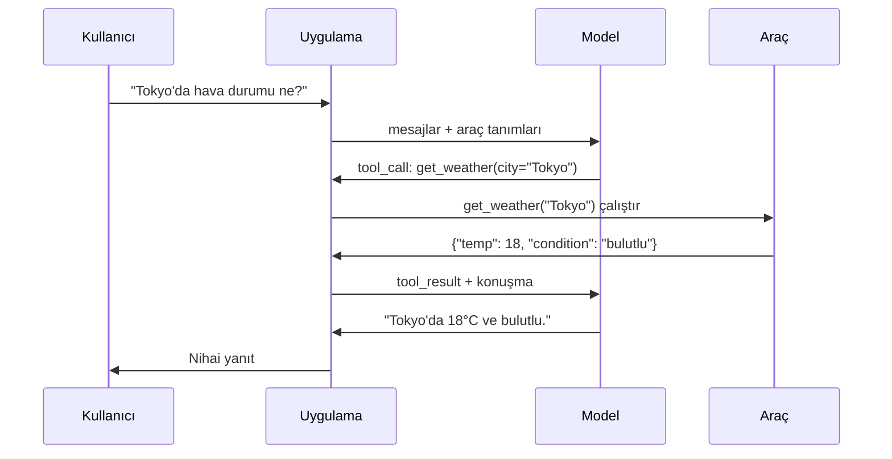

# Function Calling ve Araç Kullanımı

> LLM'ler hiçbir şey yapamaz. Metin üretirler. Tüm yetenek budur. Hava durumunu kontrol edemezler, veritabanı sorgulayamazlar, e-posta gönderemezler, kod çalıştıramazlar veya dosya okuyamazlar. Bugüne kadar gördüğünüz her "AI agent"ı, hangi fonksiyonu çağıracağını söyleyen JSON üreten bir LLM'dir — ve asıl çağıran sizin kodunuzdur. Model beyindir. Araçlar ellere. Function calling, onları birleştiren sinir sistemidir.

**Tür:** Build
**Diller:** Python
**Önkoşullar:** Phase 11 Lesson 03 (Structured Outputs)
**Süre:** ~75 dakika
**İlgili:** Phase 11 · 14 (Model Context Protocol) — bir araç birden fazla host arasında paylaşıldığında, inline function-calling'den MCP sunucusuna geçin. Bu ders inline durumu kapsar; MCP protokol durumunu kapsar.

## Öğrenme Hedefleri

- Bir function calling döngüsü uygulamak: araç şemaları tanımlamak, modelin tool-call JSON'ını ayrıştırmak, fonksiyonları çalıştırmak ve sonuçları döndürmek
- Modelin güvenilir bir şekilde çağırabileceği net açıklamalara ve tipli parametrelere sahip araç şemaları tasarlamak
- Birden fazla function call'ı zincirleyerek karmaşık soruları yanıtlayan çok turlu bir agent döngüsü oluşturmak
- Function calling uç durumlarını ele almak: paralel araç çağrıları, hata yayılımı ve sonsuz araç döngülerini önleme

## Sorun

Bir chatbot oluşturuyorsunuz. Bir kullanıcı soruyor: "Tokyo'da şu an hava durumu ne?"

Model yanıt veriyor: "Gerçek zamanlı hava durumu verilerine erişimim yok, ama mevsime göre Tokyo muhtemelen 15 derece civarında..."

Bu bir disclaimer giydirilmiş bir halüsinasyondur. Model hava durumunu bilmez. Hiçbir zaman bilemeyecektir. Hava durumu her saat değişir. Modelin eğitim verileri aylar eskidir.

Doğru yanıt OpenWeatherMap API'sini çağırmayı, güncel sıcaklığı almayı ve gerçek sayıyı döndürmeyi gerektirir. Model API'leri çağıramaz. Sizinkiler çağırabilir. Eksik parça: modelin "hava durumu API'sini bu argümanlarla çağırmam gerekiyor" demesini ve sizin kodunuzun bunu çalıştırıp sonucu geri beslemesini sağlayan yapılandırılmış bir protokoldür.

Bu function calling'dir. Model, hangi fonksiyonun hangi argümanlarla çağrılacağını tanımlayan yapılandırılmış JSON üretir. Uygulamanız fonksiyonu çalıştırır. Sonuç konuşmaya geri döner. Model sonucu nihai yanıtını üretmek için kullanır.

Function calling olmadan, LLM'ler ansiklopedilerdir. Onunla, agent olurlar.

## Kavram

### Function Calling Döngüsü

Her araç kullanımı etkileşimi aynı 5 adımlı döngüyü izler.



Adım 1: kullanıcı bir mesaj gönderir. Adım 2: model mesajı araç tanımlarıyla (mevcut fonksiyonları tanımlayan JSON Schema) birlikte alır. Adım 3: metin ile yanıtlamak yerine, model bir tool call — fonksiyon adı ve argümanlarını içeren yapılandırılmış bir JSON nesnesi — üretir. Adım 4: kodunuz fonksiyonu çalıştırır ve sonucu yakalar. Adım 5: sonuç modele geri döner ve artık nihai yanıtını üretmek için gerçek verilere sahiptir.

Model hiçbir zaman bir şeyi çalıştırmaz. Yalnızca neyi çağıracağını ve hangi argümanlarla karar verir. Sizinkiler çalıştırıcıdır.

### Araç Tanımları: JSON Schema Sözleşmesi

Her araç, modele fonksiyonun ne yaptığını, hangi argümanları aldığını ve bu argümanların türlerinin ne olması gerektiğini söyleyen bir JSON Schema ile tanımlanır.

```json
{
  "type": "function",
  "function": {
    "name": "get_weather",
    "description": "Get current weather for a city. Returns temperature in Celsius and conditions.",
    "parameters": {
      "type": "object",
      "properties": {
        "city": {
          "type": "string",
          "description": "City name, e.g. 'Tokyo' or 'San Francisco'"
        },
        "units": {
          "type": "string",
          "enum": ["celsius", "fahrenheit"],
          "description": "Temperature units"
        }
      },
      "required": ["city"]
    }
  }
}
```

`description` alanları kritiktir. Model, aracı ne zaman ve nasıl kullanacağına karar vermek için bunları okur. "hava durumunu alır" gibi belirsiz bir açıklama, "Get current weather for a city. Returns temperature in Celsius and conditions." açıklamasından daha kötü araç seçimine yol açar. Açıklama, araç seçimi için bir prompt'tur.

### Sağlayıcı Karşılaştırması

Her büyük sağlayıcı function calling'i destekler ama API yüzeyi farklıdır.

| Sağlayıcı | API Parametresi | Tool Call Formatı | Paralel Çağrılar | Zorunlu Çağrı |
|----------|--------------|-----------------|---------------|----------------|
| OpenAI (GPT-5, o4) | `tools` | `tool_calls[].function` | Evet (tur başına birden fazla) | `tool_choice="required"` |
| Anthropic (Claude 4.6/4.7) | `tools` | `content[].type="tool_use"` | Evet (birden fazla blok) | `tool_choice={"type":"any"}` |
| Google (Gemini 3) | `function_declarations` | `functionCall` | Evet | `function_calling_config` |
| Açık ağırlıklı (Llama 4, Qwen3, DeepSeek-V3) | Llama 4'te native `tools`; diğerlerinde Hermes veya ChatML | Karışık | Modele bağlı | Prompt tabanlı veya destekleniyorsa `tool_choice` |

2026'ya kadar üç kapalı sağlayıcı neredeyse aynı JSON-Schema tabanlı formatlarda birleşti. Llama 4, OpenAI'nin shape'ini eşleştiren native bir `tools` alanı ile geliyor. Açık ağırlıklı fine-tuning'ler hâlâ değişkenlik gösteriyor — Hermes formatı (NousResearch) üçüncü parti fine-tuning'ler için en yaygın olandır. Birden fazla host arasında paylaşılan araçlar için, inline function-calling'den ziyade MCP'yi (Phase 11 · 14) tercih edin — sunucu hepsi için aynıdır.

### Araç Seçimi: Otomatik, Zorunlu, Belirli

Modelin araçları ne zaman kullandığını kontrol edersiniz.

**Otomatik** (varsayılan): model bir aracı çağırmaya karar verir veya doğrudan yanıt verir. "2+2 kaç eder?" — doğrudan yanıt verir. "Hava durumu ne?" — aracı çağırır.

**Zorunlu**: model en az bir aracı çağırmak zorundadır. Kullanıcının niyetinin bir araç gerektirdiğini bildiğinizde bunu kullanın. Modelin gerçek verileri aramak yerine tahmin yapmasını önler.

**Belirli fonksiyon**: modeli belirli bir fonksiyonu çağırmaya zorlar. `tool_choice={"type":"function", "function": {"name": "get_weather"}}` sorguya bakılmaksızın hava durumu aracının çağrılmasını garanti eder. Yönlendirme için kullanın — üst düzey mantık zaten hangi araca ihtiyaç duyulduğuna karar verdiğinde.

### Paralel Function Calling

GPT-4o ve Claude tek turda birden fazla fonksiyon çağırabilir. Bir kullanıcı soruyor: "Tokyo ve New York'ta hava durumu ne?" Model iki tool call'ı aynı anda üretir:

```json
[
  {"name": "get_weather", "arguments": {"city": "Tokyo"}},
  {"name": "get_weather", "arguments": {"city": "New York"}}
]
```

Kodunuz ikisini de (tercihen eşzamanlı olarak) çalıştırır, her ikisinin sonucunu döndürür ve model tek bir yanıt sentezler. Bu round trip sayısını 2'den 1'e indirir. Sorgu başına 5-10 tool call yapan agent'lar için paralel çağırma gecikmeyi %60-80 azaltır.

### Structured Outputs vs Function Calling

Lesson 03 structured outputs'ı kapsadı. Function calling aynı JSON Schema mekanizmasını kullanır ama farklı bir amaçla.

**Structured outputs**: modeli belirli bir şekle sahip veri üretmeye zorlar. Çıktı nihai üründür. Örnek: metinden ürün bilgisini `{name, price, in_stock}` olarak çıkarma.

**Function calling**: model bir eylemi gerçekleştirme niyetini beyan eder. Çıktı ara bir adımdır. Örnek: `get_weather(city="Tokyo")` — model nihai yanıtı üretmek yerine bir eylem talep eder.

Veri çıkarmak istediğinizde structured outputs kullanın. Modelin harici sistemlerle etkileşime girmesini istediğinizde function calling kullanın.

### Güvenlik: Tartışılmaz Kurallar

Function calling, bir LLM'ye verebileceğiniz en tehlikeli yetenektir. Model neyi çalıştıracağına karar verir. Araç kümeniz veritabanı sorgularını içeriyorsa, model sorguları oluşturur. Kabuk komutlarını içeriyorsa, model bunları yazar.

**Kural 1: Model tarafından üretilen SQL'i doğrudan veritabanına asla göndermeyin.** Model DROP TABLE, UNION enjeksiyonları veya her satırı döndüren sorgular üretebilir ve üretecektir. Her zaman parametrik sorgu kullanın. Her zaman doğrulayın. Her zaman işlem izni listesi kullanın.

**Kural 2: Fonksiyonları izin listesine alın.** Model yalnızca açıkça tanımladığınız fonksiyonları çağırabilir. Asla genel bir "adı ile herhangi bir fonksiyonu çalıştır" aracı oluşturmayın. 50 iç fonksiyonunuz varsa, yalnızca kullanıcının ihtiyaç duyduğu 5'ini dışa açın.

**Kural 3: Argümanları doğrulayın.** Model `"; DROP TABLE users; --"` şeklinde bir şehir adı geçebilir. Çalıştırmadan önce her argümanı beklenen türler, aralıklar ve formatlar için doğrulayın.

**Kural 4: Araç sonuçlarını temizleyin.** Bir araç hassas veri (API anahtarları, PII, iç hatalar) döndürüyorsa, bunu modele geri göndermeden önce filtreleyin. Model araç sonuçlarını yanıtına kelimesi kelimesine dahil edecektir.

**Kural 5: Araç çağrılarını hız sınırlayın.** Döngüdeki bir model yüzlerce kez araç çağırabilir. Bir maksimum belirleyin (konuşma başına 10-20 çağrı makuldür). Sonsuz döngüleri kırın.

### Hata Yönetimi

Araçlar başarısız olur. API'ler zaman aşımına uğrar. Veritabanları çöker. Dosyalar mevcut değildir. Modelin bir aracın neden başarısız olduğunu bilmesi gerekir.

Hataları istisna olarak değil, yapılandırılmış araç sonuçları olarak döndürün:

```json
{
  "error": true,
  "message": "City 'Toky' not found. Did you mean 'Tokyo'?",
  "code": "CITY_NOT_FOUND"
}
```

Model bunu okur, argümanlarını ayarlar ve yeniden dener. Modeller yapılandırılmış hata mesajlarından kendi kendini düzeltmede iyidir. Boş yanıtlardan veya genel "bir şeyler yanlış gitti" hatalarından kurtulmada kötüdür.

### MCP: Model Context Protocol

MCP, Anthropic'in araç birlikte çalışabilirliği için açık standardıdır. Her uygulamanın kendi araçlarını tanımlaması yerine, MCP evrensel bir protokol sunar: araçlar MCP sunucuları tarafından sunulur, MCP istemcileri (Claude Code, Cursor veya uygulamanız gibi) tarafından tüketilir.

Tek bir MCP sunucusu araçları uyumlu herhangi bir istemciye sunabilir. Bir Postgres MCP sunucusu uyumlu herhangi bir agent'a veritabanı erişimi verir. Bir GitHub MCP sunucusu herhangi bir agent'a depo erişimi verir. Araçlar bir kez tanımlanır, her yerde kullanılır.

MCP, function calling için ne ise HTTP ağ iletişimi için de odur. Taşıma katmanını standartlaştırır, böylece araçlar taşınabilir hale gelir.

## Yap

### Adım 1: Araç Kayıt Defterini Tanımlama

Araç tanımlarını ve uygulamalarını saklayan bir kayıt defteri oluşturun. Her araç bir JSON Schema tanımı (modelin gördüğü) ve bir Python fonksiyonu (kodunuzun çalıştırdığı) sahiptir.

```python
import json
import math
import time
import hashlib


TOOL_REGISTRY = {}


def register_tool(name, description, parameters, function):
    TOOL_REGISTRY[name] = {
        "definition": {
            "type": "function",
            "function": {
                "name": name,
                "description": description,
                "parameters": parameters,
            },
        },
        "function": function,
    }
```

### Adım 2: 5 Araç Uygulama

Bir hesap makinesi, hava durumu sorgulama, web arama simülatörü, dosya okuyucu ve kod çalıştırıcı oluşturun.

```python
def calculator(expression, precision=2):
    allowed = set("0123456789+-*/.() ")
    if not all(c in allowed for c in expression):
        return {"error": True, "message": f"Invalid characters in expression: {expression}"}
    try:
        result = eval(expression, {"__builtins__": {}}, {"math": math})
        return {"result": round(float(result), precision), "expression": expression}
    except Exception as e:
        return {"error": True, "message": str(e)}


WEATHER_DB = {
    "tokyo": {"temp_c": 18, "condition": "cloudy", "humidity": 72, "wind_kph": 14},
    "new york": {"temp_c": 22, "condition": "sunny", "humidity": 45, "wind_kph": 8},
    "london": {"temp_c": 12, "condition": "rainy", "humidity": 88, "wind_kph": 22},
    "san francisco": {"temp_c": 16, "condition": "foggy", "humidity": 80, "wind_kph": 18},
    "sydney": {"temp_c": 25, "condition": "sunny", "humidity": 55, "wind_kph": 10},
}


def get_weather(city, units="celsius"):
    key = city.lower().strip()
    if key not in WEATHER_DB:
        suggestions = [c for c in WEATHER_DB if c.startswith(key[:3])]
        return {
            "error": True,
            "message": f"City '{city}' not found.",
            "suggestions": suggestions,
            "code": "CITY_NOT_FOUND",
        }
    data = WEATHER_DB[key].copy()
    if units == "fahrenheit":
        data["temp_f"] = round(data["temp_c"] * 9 / 5 + 32, 1)
        del data["temp_c"]
    data["city"] = city
    return data


SEARCH_DB = {
    "python function calling": [
        {"title": "OpenAI Function Calling Guide", "url": "https://platform.openai.com/docs/guides/function-calling", "snippet": "Learn how to connect LLMs to external tools."},
        {"title": "Anthropic Tool Use", "url": "https://docs.anthropic.com/en/docs/tool-use", "snippet": "Claude can interact with external tools and APIs."},
    ],
    "MCP protocol": [
        {"title": "Model Context Protocol", "url": "https://modelcontextprotocol.io", "snippet": "An open standard for connecting AI models to data sources."},
    ],
    "weather API": [
        {"title": "OpenWeatherMap API", "url": "https://openweathermap.org/api", "snippet": "Free weather API with current, forecast, and historical data."},
    ],
}


def web_search(query, max_results=3):
    key = query.lower().strip()
    for db_key, results in SEARCH_DB.items():
        if db_key in key or key in db_key:
            return {"query": query, "results": results[:max_results], "total": len(results)}
    return {"query": query, "results": [], "total": 0}


FILE_SYSTEM = {
    "data/config.json": '{"model": "gpt-4o", "temperature": 0.7, "max_tokens": 4096}',
    "data/users.csv": "name,email,role\nAlice,alice@example.com,admin\nBob,bob@example.com,user",
    "README.md": "# My Project\nA tool-use agent built from scratch.",
}


def read_file(path):
    if ".." in path or path.startswith("/"):
        return {"error": True, "message": "Path traversal not allowed.", "code": "FORBIDDEN"}
    if path not in FILE_SYSTEM:
        available = list(FILE_SYSTEM.keys())
        return {"error": True, "message": f"File '{path}' not found.", "available_files": available, "code": "NOT_FOUND"}
    content = FILE_SYSTEM[path]
    return {"path": path, "content": content, "size_bytes": len(content), "lines": content.count("\n") + 1}


def run_code(code, language="python"):
    if language != "python":
        return {"error": True, "message": f"Language '{language}' not supported. Only 'python' is available."}
    forbidden = ["import os", "import sys", "import subprocess", "exec(", "eval(", "__import__", "open("]
    for pattern in forbidden:
        if pattern in code:
            return {"error": True, "message": f"Forbidden operation: {pattern}", "code": "SECURITY_VIOLATION"}
    try:
        local_vars = {}
        exec(code, {"__builtins__": {"print": print, "range": range, "len": len, "str": str, "int": int, "float": float, "list": list, "dict": dict, "sum": sum, "min": min, "max": max, "abs": abs, "round": round, "sorted": sorted, "enumerate": enumerate, "zip": zip, "map": map, "filter": filter, "math": math}}, local_vars)
        result = local_vars.get("result", None)
        return {"success": True, "result": result, "variables": {k: str(v) for k, v in local_vars.items() if not k.startswith("_")}}
    except Exception as e:
        return {"error": True, "message": f"{type(e).__name__}: {e}"}
```

### Adım 3: Tüm Araçları Kaydetme

```python
def register_all_tools():
    register_tool(
        "calculator", "Evaluate a mathematical expression. Supports +, -, *, /, parentheses, and decimals. Returns the numeric result.",
        {"type": "object", "properties": {"expression": {"type": "string", "description": "Math expression, e.g. '(10 + 5) * 3'"}, "precision": {"type": "integer", "description": "Decimal places in result", "default": 2}}, "required": ["expression"]},
        calculator,
    )
    register_tool(
        "get_weather", "Get current weather for a city. Returns temperature, condition, humidity, and wind speed.",
        {"type": "object", "properties": {"city": {"type": "string", "description": "City name, e.g. 'Tokyo' or 'San Francisco'"}, "units": {"type": "string", "enum": ["celsius", "fahrenheit"], "description": "Temperature units, defaults to celsius"}}, "required": ["city"]},
        get_weather,
    )
    register_tool(
        "web_search", "Search the web for information. Returns a list of results with title, URL, and snippet.",
        {"type": "object", "properties": {"query": {"type": "string", "description": "Search query"}, "max_results": {"type": "integer", "description": "Maximum results to return", "default": 3}}, "required": ["query"]},
        web_search,
    )
    register_tool(
        "read_file", "Read the contents of a file. Returns the file content, size, and line count.",
        {"type": "object", "properties": {"path": {"type": "string", "description": "Relative file path, e.g. 'data/config.json'"}}, "required": ["path"]},
        read_file,
    )
    register_tool(
        "run_code", "Execute Python code in a sandboxed environment. Set a 'result' variable to return output.",
        {"type": "object", "properties": {"code": {"type": "string", "description": "Python code to execute"}, "language": {"type": "string", "enum": ["python"], "description": "Programming language"}}, "required": ["code"]},
        run_code,
    )
```

### Adım 4: Function Calling Döngüsünü Oluşturma

Bu çekirdek motordur. Modelin hangi aracı çağıracağına nasıl karar verdiğini simüle eder, aracı çalıştırır ve sonuçları geri besler.

```python
def simulate_model_decision(user_message, tools, conversation_history):
    msg = user_message.lower()

    if any(word in msg for word in ["weather", "temperature", "forecast"]):
        cities = []
        for city in WEATHER_DB:
            if city in msg:
                cities.append(city)
        if not cities:
            for word in msg.split():
                if word.capitalize() in [c.title() for c in WEATHER_DB]:
                    cities.append(word)
        if not cities:
            cities = ["tokyo"]
        calls = []
        for city in cities:
            calls.append({"name": "get_weather", "arguments": {"city": city.title()}})
        return calls

    if any(word in msg for word in ["calculate", "compute", "math", "what is", "how much"]):
        for token in msg.split():
            if any(c in token for c in "+-*/"):
                return [{"name": "calculator", "arguments": {"expression": token}}]
        if "+" in msg or "-" in msg or "*" in msg or "/" in msg:
            expr = "".join(c for c in msg if c in "0123456789+-*/.() ")
            if expr.strip():
                return [{"name": "calculator", "arguments": {"expression": expr.strip()}}]
        return [{"name": "calculator", "arguments": {"expression": "0"}}]

    if any(word in msg for word in ["search", "find", "look up", "google"]):
        query = msg.replace("search for", "").replace("look up", "").replace("find", "").strip()
        return [{"name": "web_search", "arguments": {"query": query}}]

    if any(word in msg for word in ["read", "file", "open", "cat", "show"]):
        for path in FILE_SYSTEM:
            if path.split("/")[-1].split(".")[0] in msg:
                return [{"name": "read_file", "arguments": {"path": path}}]
        return [{"name": "read_file", "arguments": {"path": "README.md"}}]

    if any(word in msg for word in ["run", "execute", "code", "python"]):
        return [{"name": "run_code", "arguments": {"code": "result = 'Hello from the sandbox!'", "language": "python"}}]

    return []


def execute_tool_call(tool_call):
    name = tool_call["name"]
    args = tool_call["arguments"]

    if name not in TOOL_REGISTRY:
        return {"error": True, "message": f"Unknown tool: {name}", "code": "UNKNOWN_TOOL"}

    tool = TOOL_REGISTRY[name]
    func = tool["function"]
    start = time.time()

    try:
        result = func(**args)
    except TypeError as e:
        result = {"error": True, "message": f"Invalid arguments: {e}"}

    elapsed_ms = round((time.time() - start) * 1000, 2)
    return {"tool": name, "result": result, "execution_time_ms": elapsed_ms}


def run_function_calling_loop(user_message, max_iterations=5):
    conversation = [{"role": "user", "content": user_message}]
    tool_definitions = [t["definition"] for t in TOOL_REGISTRY.values()]
    all_tool_results = []

    for iteration in range(max_iterations):
        tool_calls = simulate_model_decision(user_message, tool_definitions, conversation)

        if not tool_calls:
            break

        results = []
        for call in tool_calls:
            result = execute_tool_call(call)
            results.append(result)

        conversation.append({"role": "assistant", "content": None, "tool_calls": tool_calls})

        for result in results:
            conversation.append({"role": "tool", "content": json.dumps(result["result"]), "tool_name": result["tool"]})

        all_tool_results.extend(results)
        break

    return {"conversation": conversation, "tool_results": all_tool_results, "iterations": iteration + 1 if tool_calls else 0}
```

### Adım 5: Argüman Doğrulama

Araç çağrısı argümanlarını çalıştırmadan önce JSON Schema'ya göre kontrol eden bir doğrulayıcı oluşturun.

```python
def validate_tool_arguments(tool_name, arguments):
    if tool_name not in TOOL_REGISTRY:
        return [f"Unknown tool: {tool_name}"]

    schema = TOOL_REGISTRY[tool_name]["definition"]["function"]["parameters"]
    errors = []

    if not isinstance(arguments, dict):
        return [f"Arguments must be an object, got {type(arguments).__name__}"]

    for required_field in schema.get("required", []):
        if required_field not in arguments:
            errors.append(f"Missing required argument: {required_field}")

    properties = schema.get("properties", {})
    for arg_name, arg_value in arguments.items():
        if arg_name not in properties:
            errors.append(f"Unknown argument: {arg_name}")
            continue

        prop_schema = properties[arg_name]
        expected_type = prop_schema.get("type")

        type_checks = {"string": str, "integer": int, "number": (int, float), "boolean": bool, "array": list, "object": dict}
        if expected_type in type_checks:
            if not isinstance(arg_value, type_checks[expected_type]):
                errors.append(f"Argument '{arg_name}': expected {expected_type}, got {type(arg_value).__name__}")

        if "enum" in prop_schema and arg_value not in prop_schema["enum"]:
            errors.append(f"Argument '{arg_name}': '{arg_value}' not in {prop_schema['enum']}")

    return errors
```

### Adım 6: Demo'yu Çalıştırma

```python
def run_demo():
    register_all_tools()

    print("=" * 60)
    print("  Function Calling ve Araç Kullanımı Demosu")
    print("=" * 60)

    print("\n--- Kayıtlı Araçlar ---")
    for name, tool in TOOL_REGISTRY.items():
        desc = tool["definition"]["function"]["description"][:60]
        params = list(tool["definition"]["function"]["parameters"].get("properties", {}).keys())
        print(f"  {name}: {desc}...")
        print(f"    params: {params}")

    print(f"\n--- Argüman Doğrulama ---")
    validation_tests = [
        ("get_weather", {"city": "Tokyo"}, "Geçerli çağrı"),
        ("get_weather", {}, "Eksik zorunlu argüman"),
        ("get_weather", {"city": "Tokyo", "units": "kelvin"}, "Geçersiz enum değeri"),
        ("calculator", {"expression": 123}, "Yanlış tür (int yerine string)"),
        ("unknown_tool", {"x": 1}, "Bilinmeyen araç"),
    ]
    for tool_name, args, label in validation_tests:
        errors = validate_tool_arguments(tool_name, args)
        status = "GEÇERLİ" if not errors else f"HATALI: {errors}"
        print(f"  {label}: {status}")

    print(f"\n--- Araç Çalıştırma ---")
    direct_tests = [
        {"name": "calculator", "arguments": {"expression": "(10 + 5) * 3 / 2"}},
        {"name": "get_weather", "arguments": {"city": "Tokyo"}},
        {"name": "get_weather", "arguments": {"city": "Mars"}},
        {"name": "web_search", "arguments": {"query": "python function calling"}},
        {"name": "read_file", "arguments": {"path": "data/config.json"}},
        {"name": "read_file", "arguments": {"path": "../etc/passwd"}},
        {"name": "run_code", "arguments": {"code": "result = sum(range(1, 101))"}},
        {"name": "run_code", "arguments": {"code": "import os; os.system('rm -rf /')"}},
    ]
    for call in direct_tests:
        result = execute_tool_call(call)
        print(f"\n  {call['name']}({json.dumps(call['arguments'])})")
        print(f"    -> {json.dumps(result['result'], indent=None)[:100]}")
        print(f"    süre: {result['execution_time_ms']}ms")

    print(f"\n--- Tam Function Calling Döngüsü ---")
    test_queries = [
        "What's the weather in Tokyo?",
        "Calculate (100 + 250) * 0.15",
        "Search for MCP protocol",
        "Read the config file",
        "Run some Python code",
        "Tell me a joke",
    ]
    for query in test_queries:
        print(f"\n  Kullanıcı: {query}")
        result = run_function_calling_loop(query)
        if result["tool_results"]:
            for tr in result["tool_results"]:
                print(f"    Araç: {tr['tool']} ({tr['execution_time_ms']}ms)")
                print(f"    Sonuç: {json.dumps(tr['result'], indent=None)[:90]}")
        else:
            print(f"    [Araç çağrılmadı — doğrudan yanıt]")
        print(f"    İterasyonlar: {result['iterations']}")

    print(f"\n--- Paralel Araç Çağrıları ---")
    multi_city_query = "What's the weather in tokyo and london?"
    print(f"  Kullanıcı: {multi_city_query}")
    result = run_function_calling_loop(multi_city_query)
    print(f"  Yapılan tool call sayısı: {len(result['tool_results'])}")
    for tr in result["tool_results"]:
        city = tr["result"].get("city", "unknown")
        temp = tr["result"].get("temp_c", "N/A")
        print(f"    {city}: {temp}C, {tr['result'].get('condition', 'N/A')}")

    print(f"\n--- Güvenlik Kontrolleri ---")
    security_tests = [
        ("read_file", {"path": "../../etc/passwd"}),
        ("run_code", {"code": "import subprocess; subprocess.run(['ls'])"}),
        ("calculator", {"expression": "__import__('os').system('ls')"}),
    ]
    for tool_name, args in security_tests:
        result = execute_tool_call({"name": tool_name, "arguments": args})
        blocked = result["result"].get("error", False)
        print(f"  {tool_name}({list(args.values())[0][:40]}): {'ENGELENDİ' if blocked else 'İZİN VERİLDİ'}")
```

## Kullan

### OpenAI Function Calling

```python
# from openai import OpenAI
#
# client = OpenAI()
#
# tools = [{
#     "type": "function",
#     "function": {
#         "name": "get_weather",
#         "description": "Get current weather for a city",
#         "parameters": {
#             "type": "object",
#             "properties": {
#                 "city": {"type": "string"},
#                 "units": {"type": "string", "enum": ["celsius", "fahrenheit"]}
#             },
#             "required": ["city"]
#         }
#     }
# }]
#
# response = client.chat.completions.create(
#     model="gpt-4o",
#     messages=[{"role": "user", "content": "Weather in Tokyo?"}],
#     tools=tools,
#     tool_choice="auto",
# )
#
# tool_call = response.choices[0].message.tool_calls[0]
# args = json.loads(tool_call.function.arguments)
# result = get_weather(**args)
#
# final = client.chat.completions.create(
#     model="gpt-4o",
#     messages=[
#         {"role": "user", "content": "Weather in Tokyo?"},
#         response.choices[0].message,
#         {"role": "tool", "tool_call_id": tool_call.id, "content": json.dumps(result)},
#     ],
# )
# print(final.choices[0].message.content)
```

OpenAI tool call'ları `response.choices[0].message.tool_calls` olarak döndürür. Her çağrının, sonucu döndürdüğünüzde dahil etmeniz gereken bir `id`'si vardır. Model bu ID'yi sonuçları eşleştirmek için kullanır. GPT-4o tek bir yanıtta birden fazla tool call döndürebilir — hepsini yineleyin ve çalıştırın.

### Anthropic Tool Use

```python
# import anthropic
#
# client = anthropic.Anthropic()
#
# response = client.messages.create(
#     model="claude-sonnet-4-20250514",
#     max_tokens=1024,
#     tools=[{
#         "name": "get_weather",
#         "description": "Get current weather for a city",
#         "input_schema": {
#             "type": "object",
#             "properties": {
#                 "city": {"type": "string"},
#                 "units": {"type": "string", "enum": ["celsius", "fahrenheit"]}
#             },
#             "required": ["city"]
#         }
#     }],
#     messages=[{"role": "user", "content": "Weather in Tokyo?"}],
# )
#
# tool_block = next(b for b in response.content if b.type == "tool_use")
# result = get_weather(**tool_block.input)
#
# final = client.messages.create(
#     model="claude-sonnet-4-20250514",
#     max_tokens=1024,
#     tools=[...],
#     messages=[
#         {"role": "user", "content": "Weather in Tokyo?"},
#         {"role": "assistant", "content": response.content},
#         {"role": "user", "content": [{"type": "tool_result", "tool_use_id": tool_block.id, "content": json.dumps(result)}]},
#     ],
# )
```

Anthropic tool call'ları `type: "tool_use"` içeren content blokları olarak döndürür. Tool result, `type: "tool_result"` içeren bir kullanıcı mesajında yer alır. Temel fark: Anthropic araç parametre tanımları için `input_schema` kullanırken, OpenAI `parameters` kullanır.

### MCP Entegrasyonu

```python
# MCP sunucuları standartlaştırılmış bir protokol üzerinden araç sunar.
# Uyumlu her MCP istemcisi bu araçları keşfedebilir ve çağırabilir.
#
# Örnek: bir Postgres MCP sunucusuna bağlanma
#
# from mcp import ClientSession, StdioServerParameters
# from mcp.client.stdio import stdio_client
#
# server_params = StdioServerParameters(
#     command="npx",
#     args=["-y", "@modelcontextprotocol/server-postgres", "postgresql://localhost/mydb"],
# )
#
# async with stdio_client(server_params) as (read, write):
#     async with ClientSession(read, write) as session:
#         await session.initialize()
#         tools = await session.list_tools()
#         result = await session.call_tool("query", {"sql": "SELECT count(*) FROM users"})
```

MCP, araç uygulamasını araç tüketiminden ayırır. Postgres sunucusu SQL bilir. GitHub sunucusu API bilir. Agent'ınız yalnızca araçları keşfeder ve çağırır — her entegrasyon için sağlayıcıya özgü koda ihtiyaç duymaz.

## Teslim Et

Bu ders `outputs/prompt-tool-designer.md` üretir — araç tanımları tasarlama için yeniden kullanılabilir bir prompt şablonu. Bir aracın ne yapması gerektiğini açıklamanızı verin, açıklamalar, türler ve kısıtlamalarla tam JSON Schema tanımı üretir.

Ayrıca `outputs/skill-function-calling-patterns.md` üretir — üretimde function calling uygulama karar çerçevesi; araç tasarımı, hata yönetimi, güvenlik ve sağlayıcıya özgü kalıpları kapsar.

## Alıştırmalar

1. **6. aracı ekleyin: veritabanı sorgusu.** Bellek içi bir tabloya sahip simüle edilmiş bir SQL aracı uygulayın. Araç bir tablo adı ve filtre koşulları kabul eder (ham SQL değil). Tablo adının izin listesinde olduğunu ve filtre operatörlerinin `=`, `>`, `<`, `>=`, `<=` ile sınırlı olduğunu doğrulayın. Eşleşen satırları JSON olarak döndürün.

2. **Hata geri bildirimli yeniden deneme uygulayın.** Bir tool call başarısız olduğunda (ör. şehir bulunamadı), hata mesajını model karar fonksiyonuna geri besleyin ve argümanlarını düzeltmesine izin verin. Her çağrının kaç yeniden deneme aldığını takip edin. Tool call başına maksimum 3 yeniden deneme belirleyin.

3. **Çok adımlı bir agent oluşturun.** Bazı sorgular tool call'ları zincirlemeyi gerektirir: "Yapılandırma dosyasını oku ve hangi modelin yapılandırıldığını söyle, sonra o modelin fiyatlandırması hakkında web'de ara." Modelin daha fazla araca ihtiyaç duymadığına karar verene kadar çalıştırılan, biriken sonuçları her karar adımına aktaran bir döngü uygulayın. Sonsuz döngüleri önlemek için 10 iterasyonla sınırlayın.

4. **Araç seçim doğruluğunu ölçün.** Beklenen araç adlarıyla 30 test sorgusu oluşturun. Karar fonksiyonunuzu 30'unun da çalıştırın ve doğru aracı yüzde kaç zaman seçtiğini ölçün. Hangi sorguların araçlar arasında en fazla kafa karışıklığına neden olduğunu belirleyin.

5. **Tool call caching uygulayın.** Aynı araç 60 saniye içinde aynı argümanlarla çağrılıyorsa, yeniden çalıştırmak yerine cache'lenmiş sonucu döndürün. `(tool_name, frozenset(args.items()))` ile anahtarlanmış bir sözlük kullanın. 20 sorguluk bir konuşma boyunca cache isabet oranlarını ölçün.

## Anahtar Terimler

| Terim | İnsanlar ne söylüyor | Gerçekte ne anlama geliyor |
|------|----------------------|--------------------------|
| Function calling | "Araç kullanımı" | Belirli argümanlarla çağrılacak bir fonksiyonu tanımlayan yapılandırılmış JSON üreten model — çalıştıran sizin kodunuzdur |
| Araç tanımı | "Fonksiyon şeması" | Bir aracın adını, amacını, parametrelerini ve türlerini tanımlayan JSON Schema nesnesi |
| Araç seçimi | "Çağrı modu" | Modelin bir aracı çağırmak zorunda mu (zorunlu), çağırabilir mi (otomatik) veya belirli bir aracı çağırmak zorunda mu (adlandırılmış) kontrol eder |
| Paralel çağırma | "Çoklu araç" | Model tek turda birden fazla tool call üretir, round trip'leri azaltır |
| Araç sonucu | "Fonksiyon çıktısı" | Bir aracın çalıştırılmasından dönen değer, modele gerçek verileri kullanabilmesi için mesaj olarak geri gönderilir |
| Argüman doğrulama | "Girdi kontrolü" | Model tarafından üretilen argümanların araç çalıştırılmadan önce beklenen türlerle, aralıklarla ve kısıtlamalarla eşleştiğini doğrulama |
| MCP | "Araç protokolü" | Model Context Protocol — araçları sunucular aracılığıyla dışa açan Anthropic'in açık standardı |
| Agent döngüsü | "ReAct döngüsü" | Model-aracı-karar, kod-aracı-çalıştır, sonuç-geri-besle yinelemeli döngüsü |
| Araç zehirleme | "Araçlar aracılığıyla prompt enjeksiyonu" | Araç sonuçlarının modelin davranışını yönlendiren talimatlar içerdiği bir saldırı |
| Hız sınırlama | "Çağrı bütçesi" | Sonsuz döngüleri ve kontrolsüz API maliyetlerini önlemek için konuşma başına maksimum tool call sayısı belirleme |

## İleri Okuma

- OpenAI Function Calling Kılavuzu — GPT-4o ile araç kullanımı için temel referans
- Anthropic Tool Use Kılavuzu — Claude'un tool use uygulaması
- Model Context Protocol Özellikleri — AI uygulamaları arasında araç birlikte çalışabilirliği için açık standart
- Schick ve ark., 2023 — "Toolformer: Language Models Can Teach Themselves to Use Tools" — LLM'lerin harici araçları ne zaman ve nasıl çağıracağını öğrenmesi için temel makale
- Patil ve ark., 2023 — "Gorilla: Large Language Model Connected with Massive APIs" — 1.645 API üzerinde hassas API çağrısı için fine-tuning
- Berkeley Function Calling Liderlik Tablosu — GPT-4o, Claude, Gemini ve açık modeller üzerinde function calling doğruluğunu karşılaştıran benchmark
- Yao ve ark., "ReAct: Synergizing Reasoning and Acting in Language Models" (ICLR 2023) — Thought-Action-Observation döngüsü
- Anthropic — Building effective agents (Aralık 2024) — beş kompoze kalıp
