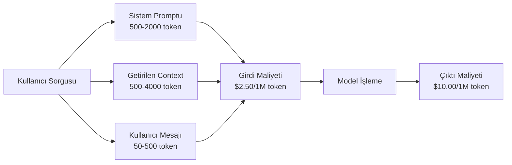
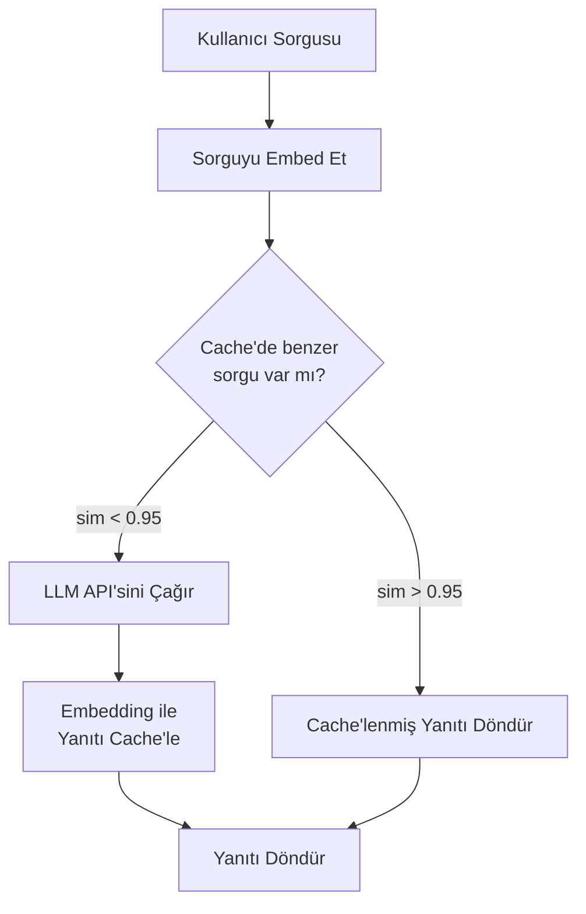
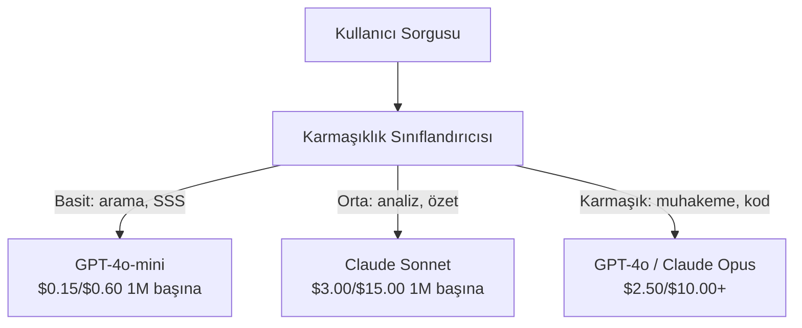

# Caching, Hız Sınırlama ve Maliyet Optimizasyonu

> Çoğu AI girişimi kötü modellerden ölmez. Kötü birim ekonomisinden ölür. Tek bir GPT-4o çağrısı birkaç kuruşa mal olur. Günde 10 kez çağrı yapan 10.000 kullanıcı, yalnızca girdi token'ları için $250 tutar — tek bir dolar bile tahsil etmeden. Hayatta kalan şirketler, her API çağrısını bir fonksiyon çağrısı değil, finansal bir işlem olarak ele alanlardır.

**Tür:** Build
**Diller:** Python
**Önkoşullar:** Phase 11 Lesson 09 (Function Calling)
**Süre:** ~45 dakika
**İlgili:** Phase 11 · 15 (Prompt Caching) — bu ders uygulama katmanı caching'i (anlamsal cache, tam hash cache, model yönlendirmesi) kapsar. Lesson 15 sağlayıcı katmanı prompt caching'i (Anthropic cache_control, OpenAI otomatik, Gemini CachedContent) kapsar. Her ikisini birleştirerek %50-95 maliyet azaltma elde edin.

## Öğrenme Hedefleri

- Tekrarlanan veya benzer sorguları yeni bir API çağrısı yapmak yerine cache'den hizmet veren anlamsal caching uygulamak
- Sağlayıcılar genelinde istek başına maliyetleri hesaplamak ve token farkında hız sınırlaması ve bütçe uyarıları uygulamak
- Prompt sıkıştırması, model yönlendirmesi (pahalı vs ucuz) ve yanıt caching'i ile bir maliyet optimizasyon katmanı oluşturmak
- Farklı sorgu türleri için tam eşleşme, anlamsal benzerlik ve prefix caching kullanan kademeli bir caching stratejisi tasarlamak

## Sorun

Bir RAG chatbot oluşturuyorsunuz. Muhteşem çalışıyor. Kullanıcılar bayılıyor.

Sonra fatura geliyor.

GPT-5, milyon girdi token'ı başına $5 ve milyon çıktı token'ı başına $15'e mal oluyor. Claude Opus 4.7 girdi $15 / çıktı $75. Gemini 3 Pro girdi $1.25 / çıktı $5. GPT-5-mini $0.25/$2. Aşağıdaki fiyatlar bilgilendiricidir; her zaman sağlayıcının güncel fiyat sayfasına bakın.

İşte girişimleri öldüren matematik:

- 10.000 günlük aktif kullanıcı
- Kullanıcı başına günde 10 sorgu
- Sorgu başına 1.000 girdi token'ı (sistem promptu + context + kullanıcı mesajı)
- Yanıt başına 500 çıktı token'ı

**Günlük girdi maliyeti:** 10.000 x 10 x 1.000 / 1.000.000 x $2.50 = **$250/gün**
**Günlük çıktı maliyeti:** 10.000 x 10 x 500 / 1.000.000 x $10.00 = **$500/gün**
**Aylık toplam:** **$22.500/ay**

Bu yalnızca LLM. Embedding'leri, vektör veritabanı barındırmayı, altyapıyı ekleyin. Bir chatbot için $30.000/ay bakıyorsunuz.

Acımasız kısım: bu sorguların %40-60'ı neredeyse tekrardır. Kullanıcılar aynı soruları biraz farklı kelimelerle sorar. Her istekle aynı olan sistem promptunuz — her seferinde faturalanır. Aynı konuyu soran kullanıcılar tarafından tekrarlanan RAG ile getirilen context belgeleri.

Fazla hesaplama için tam fiyat ödüyorsunuz.

## Kavram

### Bir LLM Çağrısının Maliyet Anatomisi

Her API çağrısının beş maliyet bileşeni vardır.



Sistem promptları sessiz katildir. 1.500 tokenlık bir sistem promptu her istekle gönderildiğinde, yalnızca bu prefix için milyon başına $3.75 tutar. Günde 100.000 istekle, bu $375/gün — $11.250/ay — hiç değişmeyen metin için.

### Sağlayıcı Caching'i: Dahili İndirimler

Üç büyük sağlayıcı 2026'da sağlayıcı tarafı prompt caching sunar ama mekanizmalar farklıdır. Detaylı bilgi için Phase 11 · 15'e bakın.

| Sağlayıcı | Mekanizma | İndirim | Minimum | Cache Süresi |
|----------|-----------|----------|---------|----------------|
| Anthropic | Açıkça `cache_control` işaretleyicileri | Cache isabetlerinde %90 indirim (yazmada %25 ek ücret) | 1.024 token (Sonnet/Opus), 2.048 (Haiku) | Varsayılan 5 dk; 1 saat uzatılabilir (2x yazma primi) |
| OpenAI | Otomatik prefix eşleme | Cache isabetlerinde %50 indirim | 1.024 token | 1 saate kadar en iyi çabayla |
| Google Gemini | Açıkça `CachedContent` API'si | ~%75 azaltma (depolama dahil) | 4.096 (Flash) / 32.768 (Pro) | Kullanıcı tarafından belirlenen TTL |

**Anthropic'in yaklaşımı** açıktır. Prompt'unuzun bölümlerini `cache_control: {"type": "ephemeral"}` ile işaretlersiniz. İlk istek %25 yazma primi öder. Aynı prefix'i sonraki istekler %90 indirim alır. Normalde $0.005'e mal olan 2.000 tokenlık bir sistem promptu, cache isabetlerinde $0.000625'e mal olur. 100.000 istek boyunca bu günde $437.50 tasarruf eder.

**OpenAI'nin yaklaşımı** otomatikdir. Bir önceki istekle eşleşen herhangi bir prompt prefix'i %50 indirim alır. İşaretleyici gerekmez. Ödünleşim: daha az indirim, daha az kontrol, ama sıfır uygulama çabası.

### Anlamsal Caching: Özel Katmanınız

Sağlayıcı caching'i yalnızca aynı prefix'ler için çalışır. Anlamsal caching daha zor durumu ele alır: aynı anlama sahip farklı sorgular.

"İade politikanız nedir?" ve "Bir ürünü nasıl iade ederim?" farklı dizilerdir ama aynı niyete sahiptir. Bir anlamsal cache her iki sorguyu da embed eder, cosine benzerliğini hesaplar ve benzerlik bir eşiği aştığında (tipik olarak 0.92-0.95) cache'lenmiş yanıtı döndürür.



Embedding maliyetleri ihmal edilebilir. OpenAI'nin text-embedding-3-small'u milyon token başına $0.02'dir. Cache'lemek, tam bir LLM çağrısına kıyasla neredeyse hiçbir şeye mal olmaz.

### Tam Caching: Hash ve Eşleme

Belirleyici çağrılar için (temperature=0, aynı model, aynı prompt) tam caching daha basit ve daha hızlıdır. Tam promptu hash'leyin, cache'de kontrol edin, bulunursa döndürün.

Şunun için mükemmel çalışır:
- Sistem promptu + sabit context + aynı kullanıcı sorguları
- Aynı araç tanımlarıyla function calling
- Aynı belgenin birden fazla kez işlendiği toplu işleme

### Hız Sınırlama: Bütçenizi Koruma

Hız sınırlama yalnızca adaletle ilgili değildir. Hayatta kalma ile ilgilidir.

**Token bucket algoritması:** her kullanıcı N token'lık bir kova alır ve saniyede R hızıyla yeniden dolar. Bir istek kovadan token harcar. Kova boşsa istek reddedilir. Bu patlamalara (tam kovanı bir kerede kullanmaya) izin verirken ortalama hızı uygular.

**Kullanıcı başına kotalar:** kullanıcı katmanına göre günlük/aylık token limitleri belirleyin.

| Katman | Günlük Token Limiti | Dakika Başına Maks İstek | Model Erişimi |
|------|------------------|------------------|-------------|
| Ücretsiz | 50.000 | 10 | Yalnızca GPT-4o-mini |
| Pro | 500.000 | 60 | GPT-4o, Claude Sonnet |
| Enterprise | 5.000.000 | 300 | Tüm modeller |

### Model Yönlendirmesi: Doğru İş İçin Doğru Model

Her sorgu GPT-5 gerektirmez.

"Mağaza saat kaçta kapanıyor?" $10/M-çıktılı bir model gerektirmez. $0.60/M çıktı ile GPT-4o-mini bunu mükemmel şekilde halleder. $1.25/M çıktı ile Claude Haiku bunu halleder. Basit bir sınıflandırıcı, basit sorguları ucuz modellere, karmaşık sorguları pahalı modellere yönlendirir.



İyi ayarlanmış bir yönlendirici yalnızca model maliyetlerinden %40-70 tasarruf eder.

### Maliyet Takibi: Paranın Nereye Gittiğini Bilme

Ölçemediğiniz şeyi optimize edemezsiniz. Her API çağrısını şunlarla kaydedin:

- Zaman damgası
- Model adı
- Girdi token'ları
- Çıktı token'ları
- Gecikme (ms)
- Hesaplanan maliyet ($)
- Kullanıcı ID'si
- Cache isabet/kaçırma
- İstek kategorisi

Bu veri, hangi özelliklerin pahalı olduğunu, hangi kullanıcıların ağır tüketiciler olduğunu ve caching'in en büyük etkiyi nerede yarattığını ortaya koyar.

### Toplu İşleme: Toplu İndirimler

OpenAI'nin Batch API'si istekleri %50 indirimle asenkron olarak işler. 50.000 isteğe kadar bir toplu iş gönderirsiniz ve sonuçlar 24 saat içinde gelir.

Toplu işlemeyi şunun için kullanın:
- Gecelik belge işleme
- Toplu sınıflandırma
- Değerlendirme çalıştırmaları
- Veri zenginleştirme hatları

Şunun için değil: gerçek zamanlı kullanıcıya yönelik sorgular (gecikme önemlidir).

### Bütçe Uyarıları ve Devre Kesiciler

Bir devre kesici bir limite ulaştığınızda harcamayı durdurur. Bir tane olmadan, bir hata veya suistimal aylık bütçenizi birkaç saat içinde tüketebilir.

Üç eşik belirleyin:
1. **Uyarı** (bütçenin %70'i): bir uyarı gönderin
2. **Kısıtlama** (bütçenin %85'i): yalnızca daha ucuz modellere geçin
3. **Durdur** (bütçenin %95'i): yeni istekleri reddedin, yalnızca cache'lenmiş yanıtları döndürün

### Optimizasyon Yığını

Bu teknikleri sırayla uygulayın. Her katman bir öncekinin üzerine biner.

| Katman | Teknik | Tipik Tasarruf | Uygulama Çabası |
|-------|-----------|----------------|----------------------|
| 1 | Sağlayıcı prompt caching | %30-50 | Düşük (cache işaretleyicileri ekle) |
| 2 | Tam caching | %10-20 | Düşük (hash + dict) |
| 3 | Anlamsal caching | %15-30 | Orta (embedding'ler + benzerlik) |
| 4 | Model yönlendirmesi | %40-70 | Orta (sınıflandırıcı) |
| 5 | Hız sınırlaması | Bütçe koruması | Düşük (token bucket) |
| 6 | Prompt sıkıştırma | %10-30 | Orta (prompt'ları yeniden yazma) |
| 7 | Toplu iş | Uygun olanlarda %50 | Düşük (batch API) |

1-5. katmanları uygulayan bir RAG uygulaması tipik olarak maliyetleri $22.500/ay'dan $4.000-6.000/ay'a düşürür. Bu, runway yakmak ile iş kurmak arasındaki farktır.

### Gerçek Tasarruflar: Önce ve Sonra

10.000 DAU'ya hizmet veren bir RAG chatbot için gerçek bir dağılım:

| Metrik | Optimizasyon Öncesi | Optimizasyon Sonrası | Tasarruf |
|--------|--------------------|--------------------|---------|
| Aylık LLM maliyeti | $22.500 | $5.200 | %77 |
| Sorgu başına ortalama maliyet | $0.0075 | $0.0017 | %77 |
| Cache isabet oranı | %0 | %52 | -- |
| Mini'ye yönlendirilen sorgular | %0 | %65 | -- |
| P95 gecikmesi | 2.800ms | 900ms (cache isabetleri: 50ms) | %68 |
| Aylık embedding maliyeti | $0 | $180 | (yeni maliyet) |
| Toplam aylık maliyet | $22.500 | $5.380 | %76 |

Anlamsal caching için embedding maliyeti ($180/ay), cache isabetlerinin ilk saatinde kendini amorti eder.

## Yap

### Adım 1: Maliyet Hesaplayıcısı

Büyük modellerin güncel fiyatlarını bilen bir token maliyet hesaplayıcısı oluşturun.

```python
import hashlib
import time
import json
import math
from dataclasses import dataclass, field


MODEL_PRICING = {
    "gpt-4o": {"input": 2.50, "output": 10.00, "cached_input": 1.25},
    "gpt-4o-mini": {"input": 0.15, "output": 0.60, "cached_input": 0.075},
    "gpt-4.1": {"input": 2.00, "output": 8.00, "cached_input": 0.50},
    "gpt-4.1-mini": {"input": 0.40, "output": 1.60, "cached_input": 0.10},
    "gpt-4.1-nano": {"input": 0.10, "output": 0.40, "cached_input": 0.025},
    "o3": {"input": 2.00, "output": 8.00, "cached_input": 0.50},
    "o3-mini": {"input": 1.10, "output": 4.40, "cached_input": 0.55},
    "o4-mini": {"input": 1.10, "output": 4.40, "cached_input": 0.275},
    "claude-opus-4": {"input": 15.00, "output": 75.00, "cached_input": 1.50},
    "claude-sonnet-4": {"input": 3.00, "output": 15.00, "cached_input": 0.30},
    "claude-haiku-3.5": {"input": 0.80, "output": 4.00, "cached_input": 0.08},
    "gemini-2.5-pro": {"input": 1.25, "output": 10.00, "cached_input": 0.3125},
    "gemini-2.5-flash": {"input": 0.15, "output": 0.60, "cached_input": 0.0375},
}


def calculate_cost(model, input_tokens, output_tokens, cached_input_tokens=0):
    if model not in MODEL_PRICING:
        return {"error": f"Unknown model: {model}"}
    pricing = MODEL_PRICING[model]
    non_cached = input_tokens - cached_input_tokens
    input_cost = (non_cached / 1_000_000) * pricing["input"]
    cached_cost = (cached_input_tokens / 1_000_000) * pricing["cached_input"]
    output_cost = (output_tokens / 1_000_000) * pricing["output"]
    total = input_cost + cached_cost + output_cost
    return {
        "model": model,
        "input_tokens": input_tokens,
        "output_tokens": output_tokens,
        "cached_input_tokens": cached_input_tokens,
        "input_cost": round(input_cost, 6),
        "cached_input_cost": round(cached_cost, 6),
        "output_cost": round(output_cost, 6),
        "total_cost": round(total, 6),
    }
```

### Adım 2: Tam Cache

Tam promptu hash'leyin ve aynı istekler için cache'lenmiş yanıtları döndürün.

```python
class ExactCache:
    def __init__(self, max_size=1000, ttl_seconds=3600):
        self.cache = {}
        self.max_size = max_size
        self.ttl = ttl_seconds
        self.hits = 0
        self.misses = 0

    def _hash(self, model, messages, temperature):
        key_data = json.dumps({"model": model, "messages": messages, "temperature": temperature}, sort_keys=True)
        return hashlib.sha256(key_data.encode()).hexdigest()

    def get(self, model, messages, temperature=0.0):
        if temperature > 0:
            self.misses += 1
            return None
        key = self._hash(model, messages, temperature)
        if key in self.cache:
            entry = self.cache[key]
            if time.time() - entry["timestamp"] < self.ttl:
                self.hits += 1
                entry["access_count"] += 1
                return entry["response"]
            del self.cache[key]
        self.misses += 1
        return None

    def put(self, model, messages, temperature, response):
        if temperature > 0:
            return
        if len(self.cache) >= self.max_size:
            oldest_key = min(self.cache, key=lambda k: self.cache[k]["timestamp"])
            del self.cache[oldest_key]
        key = self._hash(model, messages, temperature)
        self.cache[key] = {
            "response": response,
            "timestamp": time.time(),
            "access_count": 1,
        }

    def stats(self):
        total = self.hits + self.misses
        return {
            "hits": self.hits,
            "misses": self.misses,
            "hit_rate": round(self.hits / total, 4) if total > 0 else 0,
            "cache_size": len(self.cache),
        }
```

### Adım 3: Anlamsal Cache

Sorguları embed edin ve benzerlik bir eşiği aştığında cache'lenmiş yanıtları döndürün.

```python
def simple_embed(text):
    words = text.lower().split()
    vocab = {}
    for w in words:
        vocab[w] = vocab.get(w, 0) + 1
    norm = math.sqrt(sum(v * v for v in vocab.values()))
    if norm == 0:
        return {}
    return {k: v / norm for k, v in vocab.items()}


def cosine_similarity(a, b):
    if not a or not b:
        return 0.0
    all_keys = set(a) | set(b)
    dot = sum(a.get(k, 0) * b.get(k, 0) for k in all_keys)
    return dot


class SemanticCache:
    def __init__(self, similarity_threshold=0.85, max_size=500, ttl_seconds=3600):
        self.entries = []
        self.threshold = similarity_threshold
        self.max_size = max_size
        self.ttl = ttl_seconds
        self.hits = 0
        self.misses = 0

    def get(self, query):
        query_embedding = simple_embed(query)
        now = time.time()
        best_match = None
        best_sim = 0.0
        for entry in self.entries:
            if now - entry["timestamp"] > self.ttl:
                continue
            sim = cosine_similarity(query_embedding, entry["embedding"])
            if sim > best_sim:
                best_sim = sim
                best_match = entry
        if best_match and best_sim >= self.threshold:
            self.hits += 1
            best_match["access_count"] += 1
            return {"response": best_match["response"], "similarity": round(best_sim, 4), "original_query": best_match["query"]}
        self.misses += 1
        return None

    def put(self, query, response):
        if len(self.entries) >= self.max_size:
            self.entries.sort(key=lambda e: e["timestamp"])
            self.entries.pop(0)
        self.entries.append({
            "query": query,
            "embedding": simple_embed(query),
            "response": response,
            "timestamp": time.time(),
            "access_count": 1,
        })

    def stats(self):
        total = self.hits + self.misses
        return {
            "hits": self.hits,
            "misses": self.misses,
            "hit_rate": round(self.hits / total, 4) if total > 0 else 0,
            "cache_size": len(self.entries),
        }
```

### Adım 4: Hız Sınırlayıcı

Kullanıcı başına kotalı token bucket hız sınırlayıcısı.

```python
class TokenBucketRateLimiter:
    def __init__(self):
        self.buckets = {}
        self.tiers = {
            "free": {"capacity": 50_000, "refill_rate": 500, "max_requests_per_min": 10},
            "pro": {"capacity": 500_000, "refill_rate": 5_000, "max_requests_per_min": 60},
            "enterprise": {"capacity": 5_000_000, "refill_rate": 50_000, "max_requests_per_min": 300},
        }

    def _get_bucket(self, user_id, tier="free"):
        if user_id not in self.buckets:
            tier_config = self.tiers.get(tier, self.tiers["free"])
            self.buckets[user_id] = {
                "tokens": tier_config["capacity"],
                "capacity": tier_config["capacity"],
                "refill_rate": tier_config["refill_rate"],
                "last_refill": time.time(),
                "request_timestamps": [],
                "max_rpm": tier_config["max_requests_per_min"],
                "tier": tier,
                "total_tokens_used": 0,
            }
        return self.buckets[user_id]

    def _refill(self, bucket):
        now = time.time()
        elapsed = now - bucket["last_refill"]
        refill = int(elapsed * bucket["refill_rate"])
        if refill > 0:
            bucket["tokens"] = min(bucket["capacity"], bucket["tokens"] + refill)
            bucket["last_refill"] = now

    def check(self, user_id, tokens_needed, tier="free"):
        bucket = self._get_bucket(user_id, tier)
        self._refill(bucket)
        now = time.time()
        bucket["request_timestamps"] = [t for t in bucket["request_timestamps"] if now - t < 60]
        if len(bucket["request_timestamps"]) >= bucket["max_rpm"]:
            return {"allowed": False, "reason": "rate_limit", "retry_after_seconds": 60 - (now - bucket["request_timestamps"][0])}
        if bucket["tokens"] < tokens_needed:
            deficit = tokens_needed - bucket["tokens"]
            wait = deficit / bucket["refill_rate"]
            return {"allowed": False, "reason": "token_limit", "tokens_available": bucket["tokens"], "retry_after_seconds": round(wait, 1)}
        return {"allowed": True, "tokens_available": bucket["tokens"]}

    def consume(self, user_id, tokens_used, tier="free"):
        bucket = self._get_bucket(user_id, tier)
        bucket["tokens"] -= tokens_used
        bucket["request_timestamps"].append(time.time())
        bucket["total_tokens_used"] += tokens_used

    def get_usage(self, user_id):
        if user_id not in self.buckets:
            return {"error": "User not found"}
        b = self.buckets[user_id]
        return {
            "user_id": user_id,
            "tier": b["tier"],
            "tokens_remaining": b["tokens"],
            "capacity": b["capacity"],
            "total_tokens_used": b["total_tokens_used"],
            "utilization": round(b["total_tokens_used"] / b["capacity"], 4) if b["capacity"] else 0,
        }
```

### Adım 5: Maliyet Takipçisi

Her çağrıyı kaydedin ve toplamaları hesaplayın.

```python
class CostTracker:
    def __init__(self, monthly_budget=1000.0):
        self.logs = []
        self.monthly_budget = monthly_budget
        self.alerts = []

    def log_call(self, model, input_tokens, output_tokens, cached_input_tokens=0, latency_ms=0, user_id="anonymous", cache_status="miss"):
        cost = calculate_cost(model, input_tokens, output_tokens, cached_input_tokens)
        entry = {
            "timestamp": time.time(),
            "model": model,
            "input_tokens": input_tokens,
            "output_tokens": output_tokens,
            "cached_input_tokens": cached_input_tokens,
            "latency_ms": latency_ms,
            "cost": cost["total_cost"],
            "user_id": user_id,
            "cache_status": cache_status,
        }
        self.logs.append(entry)
        self._check_budget()
        return entry

    def _check_budget(self):
        total = self.total_cost()
        pct = total / self.monthly_budget if self.monthly_budget > 0 else 0
        if pct >= 0.95 and not any(a["level"] == "stop" for a in self.alerts):
            self.alerts.append({"level": "stop", "message": f"Budget 95% consumed: ${total:.2f}/${self.monthly_budget:.2f}", "timestamp": time.time()})
        elif pct >= 0.85 and not any(a["level"] == "throttle" for a in self.alerts):
            self.alerts.append({"level": "throttle", "message": f"Budget 85% consumed: ${total:.2f}/${self.monthly_budget:.2f}", "timestamp": time.time()})
        elif pct >= 0.70 and not any(a["level"] == "warning" for a in self.alerts):
            self.alerts.append({"level": "warning", "message": f"Budget 70% consumed: ${total:.2f}/${self.monthly_budget:.2f}", "timestamp": time.time()})

    def total_cost(self):
        return round(sum(e["cost"] for e in self.logs), 6)

    def cost_by_model(self):
        by_model = {}
        for e in self.logs:
            m = e["model"]
            if m not in by_model:
                by_model[m] = {"calls": 0, "cost": 0, "input_tokens": 0, "output_tokens": 0}
            by_model[m]["calls"] += 1
            by_model[m]["cost"] = round(by_model[m]["cost"] + e["cost"], 6)
            by_model[m]["input_tokens"] += e["input_tokens"]
            by_model[m]["output_tokens"] += e["output_tokens"]
        return by_model

    def cache_savings(self):
        cache_hits = [e for e in self.logs if e["cache_status"] == "hit"]
        if not cache_hits:
            return {"saved": 0, "cache_hits": 0}
        saved = 0
        for e in cache_hits:
            full_cost = calculate_cost(e["model"], e["input_tokens"], e["output_tokens"])
            saved += full_cost["total_cost"]
        return {"saved": round(saved, 4), "cache_hits": len(cache_hits)}

    def summary(self):
        if not self.logs:
            return {"total_calls": 0, "total_cost": 0}
        total_latency = sum(e["latency_ms"] for e in self.logs)
        cache_hits = sum(1 for e in self.logs if e["cache_status"] == "hit")
        return {
            "total_calls": len(self.logs),
            "total_cost": self.total_cost(),
            "avg_cost_per_call": round(self.total_cost() / len(self.logs), 6),
            "avg_latency_ms": round(total_latency / len(self.logs), 1),
            "cache_hit_rate": round(cache_hits / len(self.logs), 4),
            "cost_by_model": self.cost_by_model(),
            "cache_savings": self.cache_savings(),
            "budget_remaining": round(self.monthly_budget - self.total_cost(), 2),
            "budget_utilization": round(self.total_cost() / self.monthly_budget, 4) if self.monthly_budget > 0 else 0,
            "alerts": self.alerts,
        }
```

### Adım 6: Model Yönlendiricisi

Sorguları karşılayabilecek en ucuz modele yönlendirin.

```python
SIMPLE_KEYWORDS = ["what time", "hours", "address", "phone", "price", "return policy", "hello", "hi", "thanks", "yes", "no"]
COMPLEX_KEYWORDS = ["analyze", "compare", "explain why", "write code", "debug", "architect", "design", "trade-off", "evaluate"]


def classify_complexity(query):
    q = query.lower()
    if len(q.split()) <= 5 or any(kw in q for kw in SIMPLE_KEYWORDS):
        return "simple"
    if any(kw in q for kw in COMPLEX_KEYWORDS):
        return "complex"
    return "medium"


def route_model(query, tier="pro"):
    complexity = classify_complexity(query)
    routing_table = {
        "simple": {"free": "gpt-4.1-nano", "pro": "gpt-4o-mini", "enterprise": "gpt-4o-mini"},
        "medium": {"free": "gpt-4o-mini", "pro": "claude-sonnet-4", "enterprise": "claude-sonnet-4"},
        "complex": {"free": "gpt-4o-mini", "pro": "gpt-4o", "enterprise": "claude-opus-4"},
    }
    model = routing_table[complexity].get(tier, "gpt-4o-mini")
    return {"query": query, "complexity": complexity, "model": model, "tier": tier}
```

### Adım 7: Demo'yu Çalıştır

```python
def simulate_llm_call(model, query):
    input_tokens = len(query.split()) * 4 + 500
    output_tokens = 150 + (len(query.split()) * 2)
    latency = 200 + (output_tokens * 2)
    return {
        "model": model,
        "response": f"[Simulated {model} response to: {query[:50]}...]",
        "input_tokens": input_tokens,
        "output_tokens": output_tokens,
        "latency_ms": latency,
    }


def run_demo():
    print("=" * 60)
    print("  Caching, Hız Sınırlama ve Maliyet Optimizasyonu Demosu")
    print("=" * 60)

    print("\n--- Model Fiyatlandırma ---")
    for model, pricing in list(MODEL_PRICING.items())[:6]:
        cost_1k = calculate_cost(model, 1000, 500)
        print(f"  {model}: ${cost_1k['total_cost']:.6f} / 1K girdi + 500 çıktı")

    print("\n--- Maliyet Karşılaştırması: 100K İstek ---")
    for model in ["gpt-4o", "gpt-4o-mini", "claude-sonnet-4", "claude-haiku-3.5"]:
        cost = calculate_cost(model, 1000 * 100_000, 500 * 100_000)
        print(f"  {model}: ${cost['total_cost']:.2f}")

    print("\n--- Anthropic Cache Tasarrufu ---")
    no_cache = calculate_cost("claude-sonnet-4", 2000, 500, 0)
    with_cache = calculate_cost("claude-sonnet-4", 2000, 500, 1500)
    saving = no_cache["total_cost"] - with_cache["total_cost"]
    print(f"  Cache olmadan: ${no_cache['total_cost']:.6f}")
    print(f"  1500 cache'lenmiş token ile: ${with_cache['total_cost']:.6f}")
    print(f"  Çağrı başına tasarruf: ${saving:.6f} ({saving/no_cache['total_cost']*100:.1f}%)")

    exact_cache = ExactCache(max_size=100, ttl_seconds=300)
    semantic_cache = SemanticCache(similarity_threshold=0.75, max_size=100)
    rate_limiter = TokenBucketRateLimiter()
    tracker = CostTracker(monthly_budget=100.0)

    print("\n--- Tam Cache ---")
    messages_1 = [{"role": "user", "content": "What is the return policy?"}]
    result = exact_cache.get("gpt-4o-mini", messages_1, 0.0)
    print(f"  İlk arama: {'İSABET' if result else 'KAÇIRMA'}")
    exact_cache.put("gpt-4o-mini", messages_1, 0.0, "You can return items within 30 days.")
    result = exact_cache.get("gpt-4o-mini", messages_1, 0.0)
    print(f"  İkinci arama: {'İSABET' if result else 'KAÇIRMA'} -> {result}")
    result = exact_cache.get("gpt-4o-mini", messages_1, 0.7)
    print(f"  temp=0.7 ile: {'İSABET' if result else 'KAÇIRMA (belirleyici değil, cache atlandı)'}")
    print(f"  İstatistikler: {exact_cache.stats()}")

    print("\n--- Anlamsal Cache ---")
    test_queries = [
        ("What is the return policy?", "Items can be returned within 30 days with receipt."),
        ("How do I return an item?", None),
        ("What are your store hours?", "We are open 9am-9pm Monday through Saturday."),
        ("When does the store open?", None),
        ("Tell me about quantum computing", "Quantum computers use qubits..."),
        ("Explain quantum mechanics", None),
    ]
    for query, response in test_queries:
        cached = semantic_cache.get(query)
        if cached:
            print(f"  '{query[:40]}' -> CACHE İSABETİ (sim={cached['similarity']}, orijinal='{cached['original_query'][40]}')")
        elif response:
            semantic_cache.put(query, response)
            print(f"  '{query[:40]}' -> KAÇIRMA (saklandı)")
        else:
            print(f"  '{query[:40]}' -> KAÇIRMA (eşleşme yok)")
    print(f"  İstatistikler: {semantic_cache.stats()}")

    print("\n--- Hız Sınırlama ---")
    for i in range(12):
        check = rate_limiter.check("user_1", 1000, "free")
        if check["allowed"]:
            rate_limiter.consume("user_1", 1000, "free")
        status = "TAMAM" if check["allowed"] else f"ENGELLENDİ ({check['reason']})"
        if i < 5 or not check["allowed"]:
            print(f"  İstek {i+1}: {status}")
    print(f"  Kullanım: {rate_limiter.get_usage('user_1')}")

    print("\n--- Model Yönlendirmesi ---")
    routing_queries = [
        "What time do you close?",
        "Summarize this quarterly earnings report",
        "Analyze the trade-offs between microservices and monoliths",
        "Hello",
        "Write code for a binary search tree with deletion",
    ]
    for q in routing_queries:
        route = route_model(q, "pro")
        print(f"  '{q[:50]}' -> {route['model']} ({route['complexity']})")

    print("\n--- Tam Hat: Optimizasyon Öncesi ve Sonrası ---")
    queries = [
        "What is the return policy?",
        "How do I return something?",
        "What are your hours?",
        "When do you open?",
        "Explain the difference between TCP and UDP",
        "Compare TCP vs UDP protocols",
        "Hello",
        "What is your phone number?",
        "Write a Python function to sort a list",
        "Analyze the pros and cons of serverless architecture",
    ]

    print("\n  [Öncesi: cache yok, tek model (gpt-4o)]")
    tracker_before = CostTracker(monthly_budget=1000.0)
    for q in queries:
        result = simulate_llm_call("gpt-4o", q)
        tracker_before.log_call("gpt-4o", result["input_tokens"], result["output_tokens"], latency_ms=result["latency_ms"], cache_status="miss")
    before = tracker_before.summary()
    print(f"  Toplam maliyet: ${before['total_cost']:.6f}")
    print(f"  Ort maliyet/çağrı: ${before['avg_cost_per_call']:.6f}")
    print(f"  Ort gecikme: {before['avg_latency_ms']}ms")

    print("\n  [Sonrası: caching + yönlendirme + hız sınırlama]")
    exact_c = ExactCache()
    semantic_c = SemanticCache(similarity_threshold=0.75)
    tracker_after = CostTracker(monthly_budget=1000.0)

    for q in queries:
        messages = [{"role": "user", "content": q}]
        cached = exact_c.get("gpt-4o", messages, 0.0)
        if cached:
            tracker_after.log_call("gpt-4o-mini", 0, 0, latency_ms=5, cache_status="hit")
            continue
        sem_cached = semantic_c.get(q)
        if sem_cached:
            tracker_after.log_call("gpt-4o-mini", 0, 0, latency_ms=15, cache_status="hit")
            continue
        route = route_model(q)
        result = simulate_llm_call(route["model"], q)
        tracker_after.log_call(route["model"], result["input_tokens"], result["output_tokens"], latency_ms=result["latency_ms"], cache_status="miss")
        exact_c.put(route["model"], messages, 0.0, result["response"])
        semantic_c.put(q, result["response"])

    after = tracker_after.summary()
    print(f"  Toplam maliyet: ${after['total_cost']:.6f}")
    print(f"  Ort maliyet/çağrı: ${after['avg_cost_per_call']:.6f}")
    print(f"  Ort gecikme: {after['avg_latency_ms']}ms")
    print(f"  Cache isabet oranı: {after['cache_hit_rate']:.0%}")

    if before["total_cost"] > 0:
        savings_pct = (1 - after["total_cost"] / before["total_cost"]) * 100
        print(f"\n  TASARRUF: %{savings_pct:.1f} maliyet azaltma")
        print(f"  Gecikme iyileşmesi: %{(1 - after['avg_latency_ms'] / before['avg_latency_ms']) * 100:.1f} daha hızlı")

    print("\n--- Bütçe Uyarıları Demosu ---")
    alert_tracker = CostTracker(monthly_budget=0.01)
    for i in range(5):
        alert_tracker.log_call("gpt-4o", 5000, 2000, latency_ms=500)
    print(f"  Toplam harcama: ${alert_tracker.total_cost():.6f} / ${alert_tracker.monthly_budget}")
    for alert in alert_tracker.alerts:
        print(f"  UYARI [{alert['level'].upper()}]: {alert['message']}")

    print("\n--- Modellere Göre Maliyet Dağılımı ---")
    multi_tracker = CostTracker(monthly_budget=500.0)
    for _ in range(50):
        multi_tracker.log_call("gpt-4o-mini", 800, 200, latency_ms=150)
    for _ in range(30):
        multi_tracker.log_call("claude-sonnet-4", 1500, 500, latency_ms=400)
    for _ in range(10):
        multi_tracker.log_call("gpt-4o", 2000, 800, latency_ms=600)
    for _ in range(10):
        multi_tracker.log_call("claude-opus-4", 3000, 1000, latency_ms=1200)
    breakdown = multi_tracker.cost_by_model()
    for model, data in sorted(breakdown.items(), key=lambda x: x[1]["cost"], reverse=True):
        print(f"  {model}: {data['calls']} çağrı, ${data['cost']:.6f}, {data['input_tokens']:,} girdi / {data['output_tokens']:,} çıktı")
    print(f"  Toplam: ${multi_tracker.total_cost():.6f}")

    print("\n" + "=" * 60)
    print("  Demo tamamlandı.")
    print("=" * 60)


if __name__ == "__main__":
    run_demo()
```

## Kullan

### Anthropic Prompt Caching

```python
# import anthropic
#
# client = anthropic.Anthropic()
#
# response = client.messages.create(
#     model="claude-sonnet-4-20250514",
#     max_tokens=1024,
#     system=[
#         {
#             "type": "text",
#             "text": "You are a helpful customer support agent for Acme Corp...",
#             "cache_control": {"type": "ephemeral"},
#         }
#     ],
#     messages=[{"role": "user", "content": "What is the return policy?"}],
# )
#
# print(f"Girdi token'ları: {response.usage.input_tokens}")
# print(f"Cache oluşturma token'ları: {response.usage.cache_creation_input_tokens}")
# print(f"Cache okuma token'ları: {response.usage.cache_read_input_tokens}")
```

İlk çağrı cache'e yazar (%25 prim). Aynı sistem promptu prefix'ini içeren her sonraki çağrı cache'den okur (%90 indirim). Cache 5 dakika sürer ve her isabette zamanlayıcıyı sıfırlar.

### OpenAI Otomatik Caching

```python
# from openai import OpenAI
#
# client = OpenAI()
#
# response = client.chat.completions.create(
#     model="gpt-4o",
#     messages=[
#         {"role": "system", "content": "You are a helpful customer support agent..."},
#         {"role": "user", "content": "What is the return policy?"},
#     ],
# )
#
# print(f"Prompt token'ları: {response.usage.prompt_tokens}")
# print(f"Cache'lenmiş token'lar: {response.usage.prompt_tokens_details.cached_tokens}")
# print(f"Tamamlama token'ları: {response.usage.completion_tokens}")
```

OpenAI otomatik olarak cache'ler. 1.024+ tokenlık herhangi bir prompt prefix'i son bir istekle eşleşirse %50 indirim alır. Kod değişikliği gerekmez — çalıştığını doğrulamak için yanıtta `prompt_tokens_details.cached_tokens` alanına bakın.

### OpenAI Batch API

```python
# import json
# from openai import OpenAI
#
# client = OpenAI()
#
# requests = []
# for i, query in enumerate(queries):
#     requests.append({
#         "custom_id": f"request-{i}",
#         "method": "POST",
#         "url": "/v1/chat/completions",
#         "body": {
#             "model": "gpt-4o-mini",
#             "messages": [{"role": "user", "content": query}],
#         },
#     })
#
# with open("batch_input.jsonl", "w") as f:
#     for r in requests:
#         f.write(json.dumps(r) + "\n")
#
# batch_file = client.files.create(file=open("batch_input.jsonl", "rb"), purpose="batch")
# batch = client.batches.create(input_file_id=batch_file.id, endpoint="/v1/chat/completions", completion_window="24h")
# print(f"Batch ID: {batch.id}, Durum: {batch.status}")
```

Batch API tüm token'larda sabit %50 indirim sunar. Sonuçlar 24 saat içinde gelir. Gerçek zamanlı olmayan iş yükleri için mükemmeldir: değerlendirmeler, veri etiketleme, toplu özetleme.

### Redis ile Üretim Anlamsal Cache

```python
# import redis
# import numpy as np
# from openai import OpenAI
#
# r = redis.Redis()
# client = OpenAI()
#
# def get_embedding(text):
#     response = client.embeddings.create(model="text-embedding-3-small", input=text)
#     return response.data[0].embedding
#
# def semantic_cache_lookup(query, threshold=0.95):
#     query_emb = np.array(get_embedding(query))
#     keys = r.keys("cache:emb:*")
#     best_sim, best_key = 0, None
#     for key in keys:
#         stored_emb = np.frombuffer(r.get(key), dtype=np.float32)
#         sim = np.dot(query_emb, stored_emb) / (np.linalg.norm(query_emb) * np.linalg.norm(stored_emb))
#         if sim > best_sim:
#             best_sim, best_key = sim, key
#     if best_sim >= threshold and best_key:
#         response_key = best_key.decode().replace("cache:emb:", "cache:resp:")
#         return r.get(response_key).decode()
#     return None
```

Üretimde, doğrusal taramayı bir vektör indeksiyle (Redis Vector Search, Pinecone veya pgvector) değiştirin. Doğrusal tarama <1.000 giriş için çalışır. Ötesinde, O(log n) arama için ANN (approximate nearest neighbor) kullanın.

## Teslim Et

Bu ders `outputs/prompt-cost-optimizer.md` üretir — LLM uygulamanızı analiz eden ve tahmini tasarruflarla birlikte belirli maliyet optimizasyonları öneren yeniden kullanılabilir bir prompt.

Ayrıca `outputs/skill-cost-patterns.md` üretir — kullanım durumunuz için doğru caching stratejisi, hız sınırlama yapılandırması ve model yönlendirme kurallarını seçme karar çerçevesi.

## Alıştırmalar

1. **Anlamsal cache için LRU çıkarma uygulayın.** En eski çıkarmayı en az kullanılan son kullanıma göre değiştirin. Her giriş için son erişim zamanını takip edin ve cache dolduğunda en eski erişim zamanına sahip girişi çıkarın. 100 sorgu boyunca iki strateji arasındaki isabet oranlarını karşılaştırın.

2. **Maliyet projeksiyonu aracı oluşturun.** Bir API çağrısı günlüğü verildiğinde (CostTracker günlükleri), son 7 günlük ortalamaya göre aylık maliyeti projekte edin. Hafta içi/hafta sonu paternlerini hesaba katın. Projekte edilen aylık maliyet bütçeyi %20 aşıyorsa uyarı tetikleyin.

3. **Kademeli anlamsal caching uygulayın.** İki benzerlik eşiği kullanın: yüksek güvenilirlikli isabetler için 0.98 (hemen döndür) ve orta güvenilirlikli isabetler için 0.90 ("Benzer bir önceki soruya dayanarak..." uyarısıyla döndür). Her isabetin hangi katmandan geldiğini takip edin ve kullanıcı memnuniyeti farklarını ölçün.

4. **Model yönlendirme sınıflandırıcısı oluşturun.** Anahtar kelime tabanlı sınıflandırıcıyı embedding tabanlı olanla değiştirin. 50 etiketli sorguyu (basit/orta/karmaşık) embed edin, sonra en yakın etiketli örneği bularak yeni sorguları sınıflandırın. 20 sorguluk bir test seti üzerinde sınıflandırma doğruluğunu ölçün.

5. **Bozulma seviyeleriyle bir devre kesici uygulayın.** %70 bütçede uyarı kaydedin. %85'te tüm yönlendirmeyi otomatik olarak en ucuz modele (gpt-4o-mini) değiştirin. %95'te yalnızca cache'lenmiş yanıtlar sunun ve yeni sorguları reddedin. $1.00 bütçeye karşı 1.000 istek simüle ederek test edin ve her eşiğin doğru şekilde tetiklendiğini doğrulayın.

## Anahtar Terimler

| Terim | İnsanlar ne söylüyor | Gerçekte ne anlama geliyor |
|------|----------------------|--------------------------|
| Prompt caching | "Uzun prompt'ları ucuzla" | Eşleşen prefix'ler için sağlayıcı tarafı KV-cache kullanımı; %50-90 indirim |
| `cache_control` | "Anthropic işaretleyicisi" | Her şeye kadar olan kısmın cache'lenebilir olduğunu bildiren content-block özniteliği |
| Cache yazma | "Prim ödeme" | Cache'i dolduran ilk istek; Anthropic'te ~1.25x girdi hızıyla faturalanır |
| Cache okuma | "İndirim" | Prefix ile eşleşen sonraki istekler; Anthropic'te %10, OpenAI'da %50, Gemini'de ~%25 ile faturalanır |
| TTL | "Ne kadar yaşar" | Cache'in sıcak kaldığı saniyeler |
| Uzatılmış TTL | "1 saatlik Anthropic cache" | 2x yazma primi ama toplu kullanıma değer |
| Prefix eşleşmesi | "Cache neden kaçtı" | Başlangıçtan kesme noktasına kadar her token byte olarak aynı olduğunda yalnızca isabet olur |
| Context caching (Gemini) | "Açıkça olan" | Google'ın adlandırılmış, depolama ücretli cache nesnesi; büyük corpus'ların çok günlük kullanımı için en iyisi |

## İleri Okuma

- Anthropic — Prompt caching kılavuzu — `cache_control`, 1h TTL, denge tabloları
- OpenAI — Prompt caching — otomatik prefix eşleme
- Google — Context caching — `CachedContent` API'si ve depolama fiyatlandırması
- Anthropic mühendisliği — Uzun context iş yükleri için prompt caching — orijinal lansman yazısı
- Phase 11 · 05 (Context Engineering) — cache'in ineceği yer
- Phase 11 · 11 (Caching and Cost) — prompt caching'i kullanıcı mesajlarında anlamsal cache ile eşleştirme
- Pope ve ark., "Efficiently Scaling Transformer Inference" (2022) — KV-cache bellek modeli
- Agrawal ve ark., "SARATHI: Efficient LLM Inference by Piggybacking Decodes with Chunked Prefills" (2023) — prefill aşaması
- Leviathan ve ark., "Fast Inference from Transformers via Speculative Decoding" (2023) — tahmini çözümleme
