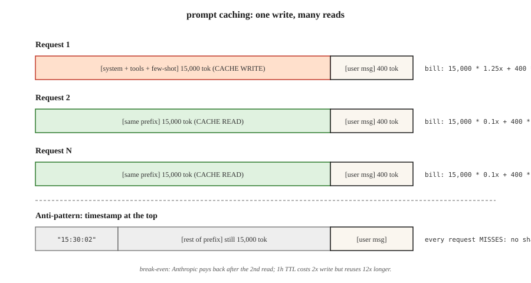

# Prompt Caching ve Context Caching (Prompt Önbellekleme ve Bağlam Önbellekleme)

> System prompt'unuz 4.000 token. RAG bağlamınız 20.000 token. Her istekte ikisini de gönderiyorsunuz. Her ikisi için de ödeme yapıyorsunuz — her seferinde. Prompt caching (prompt önbellekleme), sağlayıcının o prefix'i kendi tarafında sıcak tutmasını ve yeniden kullanımda normal oranın yalnızca %10'unu faturalandırmasını sağlar. Doğru kullanıldığında inference (çıkarsama) maliyetini %50-90, ilk token gecikmesini %40-85 oranında azaltır.

**Tür:** Build
**Diller:** Python
**Önkoşullar:** Phase 11 · 01 (Prompt Engineering), Phase 11 · 05 (Context Engineering), Phase 11 · 11 (Caching and Cost)
**Süre:** ~60 dakika

## Sorun

Bir kodlama agent'ı, her konuşmanın her turunda Claude'a aynı 15.000 token'lık system prompt'u gönderiyor. Giriş token'ları başına $3/M ile yirmi tur, yalnızca giriş maliyetinde $0.90 ediyor — kullanıcının gerçek mesajlarından önce. Bunu 10.000 günlük konuşmayla çarpın, fatura asla değişmeyen metin için $9.000/gün'e ulaşıyor.

Prompt'u küçütemiyorsunuz çünkü kaliteyi bozar. Göndermemek选项外 — model her turda buna ihtiyaç duyuyor. Tek seçenek, sağlayıcının daha önce gördüğü bir prefix için tam fiyat ödemeyi bırakmak.

O seçenek prompt caching. Anthropic bunu Ağustos 2024'te yayımladı (2025'te 1 saatlik uzatılmış TTL varyantıyla), OpenAI aynı yıl daha sonra otomatik hale getirdi, Google Gemini 1.5 ile birlikte açık context caching yayımladı ve üçü de 2026 itibarıyla frontier modellerinde birinci sınıf özellik olarak sunuyor.

## Kavram



**Mekanizma.** Bir isteğin prefix'i yakın bir istekle eşleştiğinde, sağlayıcı token'ları yeniden kodlamak yerine önceki çalıştırmanın KV-cache'inden (anahtar-değer önbelleği) sunar. İlk seferde küçük bir yazma primi, sonraki her seferde büyük bir okuma indirimi ödersiniz.

**2026'da üç sağlayıcı çeşidi.**

| Sağlayıcı | API stili | İndirim | Yazma primi | Varsayılan TTL | Minimum önbelleklenebilir |
|---------|-----------|--------------|---------------|-------------|---------------|
| Anthropic | İçerik bloklarında açık `cache_control` işaretleyicileri | Girişte %90 indirim | %25 ek ücret | 5 dakika (1 saate uzatılabilir) | 1.024 token (Sonnet/Opus), 2.048 (Haiku) |
| OpenAI | Otomatik prefix algılama | Girişte %50 indirim | yok | 1 saate kadar (best-effort) | 1.024 token |
| Google (Gemini) | Açık `CachedContent` API | Depolama ücretli; okuma normalin ~%25'i | Token·saat başına depolama ücreti | Kullanıcı tarafından belirlenir (varsayılan 1 saat) | 4.096 token (Flash), 32.768 (Pro) |

**Değişmez kural.** Üçü de yalnızca prefix'leri önbelleğe alır. İstekler arasındaki herhangi bir token farklıysa, ilk farklı tokandan sonraki her şey miss'tir (eşleşmez). *Sabit* kısımları üste, *değişken* kısımları alta koyun.

### Önbelleğe uygun düzen

```
[system prompt] <-- bunu önbelleğe al
[tool definitions] <-- bunu önbelleğe al
[few-shot examples] <-- bunu önbelleğe al
[retrieved documents] <-- yeniden kullanılıyorsa önbelleğe al, aksi takdirde alma
[conversation history] <-- son tur'a kadar önbelleğe al
[current user message] <-- asla önbelleğe alma (her seferinde farklı)
```

Düzeni ihlal edin — kullanıcı mesajını system prompt'un üstüne koyun, few-shot'lar arasında dinamik retrieval'ları harmanlayın — ve cache asla eşleşmez.

### Başa baş hesabı

Anthropic'in %25 yazma primi, bir önbellek bloğunun paradan tasarruf etmek için en az iki kez okunması gerektiği anlamına gelir. 1 yazma + 1 okuma ortalama 0.65x maliyet (tasarruf %35); 1 yazma + 10 okuma ortalama 0.325x (tasarruf %67.5). Kural: TTL içinde en az 3 kez yeniden kullanmayı beklediğiniz her şeyi önbelleğe alın.

## Yap

### Adım 1: Anthropic prompt caching açık işaretleyicilerle

```python
import anthropic

client = anthropic. Anthropic()

SYSTEM = [
 {
 "type": "text",
 "text": "You are a senior Python reviewer. Follow the rubric exactly.\n\n" + RUBRIC_15K_TOKENS,
 "cache_control": {"type": "ephemeral"},
 }
]

def review(code: str):
 return client.messages.create(
 model="claude-opus-4-7",
 max_tokens=1024,
 system=SYSTEM,
 messages=[{"role": "user", "content": code}],
 )
```

`cache_control` işaretleyicisi Anthropic'e bloğu 5 dakika süreyle depolamasını söyler. Pencere içinde yeniden kullanma eşleşir; sonra kullanma süresi dolar ve yeniden yazar.

**Yanıt usage alanları:**

```python
response = review(code_a)
response.usage
# InputTokensUsage(
# input_tokens=120,
# cache_creation_input_tokens=15023, # 1.25x ücretlendirilir
# cache_read_input_tokens=0,
# output_tokens=340,
# )

response_b = review(code_b)
response_b.usage
# cache_creation_input_tokens=0
# cache_read_input_tokens=15023 # 0.1x ücretlendirilir
```

CI'da her iki alanı da kontrol edin — `cache_read_input_tokens` istekler arasında sıfırdaysa, cache anahtarlarınız kayıyor demektir.

### Adım 2: 1 saatlik uzatılmış TTL

Uzun süren batch işleri için, 5 dakikalık varsayılan işler arasında dolar. `ttl`'yi ayarlayın:

```python
{"type": "text", "text": RUBRIC, "cache_control": {"type": "ephemeral", "ttl": "1h"}}
```

1 saatlik TTL, 2x yazma primi (yerine %25 yerine %50 ek maliyet) gerektirir ama prefix'i 5'ten fazla kez yeniden kullanan her batch'te hızlıca karşılığını verir.

### Adım 3: OpenAI otomatik caching

OpenAI hiçbir şey yapılandırmanızı gerektirmez. Son bir istekle eşleşen 1.024 token'ın üzerindeki her prefix otomatik olarak %50 indirim alır.

```python
from openai import OpenAI
client = OpenAI()

resp = client.chat.completions.create(
 model="gpt-5",
 messages=[
 {"role": "system", "content": SYSTEM_PROMPT}, # uzun ve sabit
 {"role": "user", "content": user_msg},
 ],
)
resp.usage.prompt_tokens_details.cached_tokens # indirimli kısım
```

Aynı önbelleğe uygun düzen kuralı geçerlidir. Anthropic'in cache'ini öldüren iki şey OpenAI'ninkini de öldürür: `user` alanını değiştirme (cache anahtarı bileşeni olarak kullanılır) ve araçları yeniden sıralama.

### Adım 4: Gemini açık context caching

Gemini, cache'i oluşturduğunuz ve adlandırdığınız bir birinci sınıf nesne olarak ele alır:

```python
from google import genai
from google.genai import types

client = genai. Client()

cache = client.caches.create(
 model="gemini-3-pro",
 config=types. CreateCachedContentConfig(
 display_name="rubric-v3",
 system_instruction=RUBRIC,
 contents=[FEW_SHOT_EXAMPLES],
 ttl="3600s",
 ),
)

resp = client.models.generate_content(
 model="gemini-3-pro",
 contents=["Review this code:\n" + code],
 config=types. GenerateContentConfig(cached_content=cache.name),
)
```

Gemini, cache yaşadığı sürece token·saat başına depolama ücreti alır ve normal giriş oranının ~%25'inde okur. Bu, aynı devasa prompt'u günlerce boyunca birçok oturumda yeniden kullandığınızda doğru formdur.

### Adım 5: üretimde hit oranının ölçülmesi

Üç sağlayıcı için simüle edilmiş bir muhasebeci ve write/read/miss sayılarını takip eden ve 1K istek başına karışık maliyet hesaplayan bir betik için `code/main.py` dosyasına bakın. Dağıtımları bir hedef hit oranına göre engelleyin — çoğu üretim Anthropic kurulumu ısınma sonrası >%80 okuma oranı görmelidir.

## 2026'da hâlâ karşılaşılan tuzaklar

- **Üstte dinamik zaman damgaları.** System prompt'un üstünde "Current time: 2026-04-22 15:30:02". Her istek eşleşmez. Zaman damgalarını cache kırılma noktasının altına taşıyın.
- **Araç sıralaması.** Araçları sabit bir sırayla seri hale getirin — deploy'lar arasında bir dict yeniden sıralaması her hit'i bozar.
- **Serbest metin yakın kopyalar.** "You are helpful." vs "You are a helpful assistant." — bir byte farkı = tam miss.
- **Çok küçük bloklar.** Anthropic 1.024 token tabanı uygular (Haiku için 2.048). Daha küçük bloklar sessizce önbelleğe alınmaz.
- **Kör maliyet panelleri.** "input tokens"ı önbelleğe alınmış vs alınmamış olarak bölün. Aksi takdirde bir trafik düşüşü cache kazanımı gibi görünür.

## Kullan

2026 önbellekleme yığını:

| Durum | Seçim |
|-----------|------|
| 10k+ system prompt'lu, çok turlu agent | Anthropic `cache_control`, 5 dakika TTL |
| 30+ dakika prefix yeniden kullanan batch işi | Anthropic `ttl: "1h"` ile |
| GPT-5 üzerinde sunucusuz endpoint, özel altyapı yok | OpenAI otomatik (yapmanız gereken tek şey prefix'i sabit ve uzun tutmak) |
| Devasa kod/doküman corpus'unun çok günlük yeniden kullanımı | Gemini açık `CachedContent` |
| Sağlayıcılar arası fallback | Önbelleklenebilir prefix düzenini sağlayıcılar arasında aynı tutun, böylece herhangi bir hit çalışsın |

Kullanıcı mesajı katmanıyla semantic caching (anlam önbellekleme) ile birleştirin (Phase 11 · 11): prompt caching *token-eşleşen* yeniden kullanmayı, semantic caching *anlam-eşleşen* yeniden kullanmayı ele alır.

## Teslim Et

`outputs/skill-prompt-caching-planner.md`'yi kaydedin:

```markdown
---
name: prompt-caching-planner
description: Design a cache-friendly prompt layout and pick the right provider caching mode.
version: 1.0.0
phase: 11
lesson: 15
tags: [llm-engineering, caching, cost]
---

Bir prompt (system + tools + few-shot + retrieval + history + user) ve kullanım profili (istek/saat, gerekli TTL, sağlayıcı) verildiğinde, şunları üretin:

1. Düzen. Tek bir cache kırılma noktası ile yeniden düzenlenmiş bölümler; hangi bölümlerin sabit, hangilerinin değişken olduğunu açıklayın.
2. Sağlayıcı modu. Anthropic cache_control, OpenAI otomatik veya Gemini CachedContent. TTL ve yeniden kullanma kalıbına göre gerekçelendirin.
3. Başa baş. TTL içinde yazma başına beklenen okuma sayısı; matematikle no-cache'e kıyasla net maliyet.
4. Doğrulama planı. İkinci özdeş istekte cache_read_input_tokens > 0 CI iddiası; önbelleğe alınmış vs alınmamış token'lara göre bölünmüş panel.
5. Başarısızlık modları. Bu kurulumda cache'in en olası 3 eşleşmeme nedenini (dinamik zaman damgası, araç sıralaması, yakın kopya metin) ve her birini nasıl önleyeceğinizi listeleyin.

Dinamik bir alanı kırılma noktasının üzerine koyan bir cache planı yayımlamayı reddedin. 2x yazma primini geri kazandıran bir yeniden kullanma sayısı olmadan 1h TTL'yi etkinleştirmeyi reddedin.
```

## Alıştırmalar

1. **Kolay.** 5.000 token'lık system prompt ile 10 tur’luk bir konuşma alın. `cache_control` olmadan ve sonra ile çalıştırın. Her biri için input token faturasını raporlayın.
2. **Orta.** Bir prompt şablonu ve istek logu verildiğinde, beklenen hit oranını ve dolar tasarrufunu (Anthropic 5m, Anthropic 1h, OpenAI otomatik, Gemini açık) hesaplayan bir test harness'ı yazın.
3. **Zor.** Bir düzen optimize edicisi oluşturun: bir prompt ve `stable=True/False` ile işaretlenmiş bir alan listesi verildiğinde, bilgi kaybetmeden maksimum önbelleğe uygun konuma tek bir cache kırılma noktası koyacak şekilde prompt'u yeniden yazın. Gerçek bir Anthropic endpoint'inde doğrulayın.

## Anahtar Terimler

| Terim | İnsanların Söylediği | Aslında Ne Anlama Geldiği |
|------|-----------------|-----------------------|
| Prompt caching | "Uzun prompt'ları ucuzlatır" | Eşleşen prefix'ler için sağlayıcı tarafında bir KV-cache'in yeniden kullanılması; tekrarlanan input token'larında %50-90 indirim. |
| `cache_control` | "Anthropic işaretleyicisi" | "Burasıya kadar olan her şey önbelleklenebilir" ilan eden içerik bloğu özniteliği; `{"type": "ephemeral"}`. |
| Cache write | "Prim ödemek" | Cache'i dolduran ilk istek; Anthropic'te ~1.25x giriş oranında, OpenAI'da ücretsiz ücretlendirilir. |
| Cache read | "İndirim" | Prefix'i eşleştiren sonraki istekler; Anthropic'te %10, OpenAI'da %50, Gemini'de ~%25 oranında ücretlendirilir. |
| TTL | "Ne kadar yaşar" | Cache'in sıcak kaldığı saniyeler; Anthropic varsayılan 5 dk (1 saate uzatılabilir), OpenAI 1 saate kadar best-effort, Gemini kullanıcı tarafından ayarlanır. |
| Uzatılmış TTL | "1 saatlik Anthropic cache'i" | `{"type": "ephemeral", "ttl": "1h"}`; 2x yazma primi ama batch yeniden kullanımı için değer. |
| Prefix eşleşmesi | "Neden cache'im eşleşmedi" | Önbellekler yalnızca başlangıçtan kırılma noktasına kadar her token byte olarak özdeş olduğunda eşleşir. |
| Context caching (Gemini) | "Açık olan" | Google'ın adlandırılmış, depolama ücretli cache nesnesi; büyük corpus'ların çok günlük yeniden kullanımı için en iyisi. |

## Ek Okuma

- [Anthropic — Prompt caching](https://docs.anthropic.com/en/docs/build-with-claude/prompt-caching) — `cache_control`, 1 saatlik TTL, başa baş tabloları.
- [OpenAI — Prompt caching](https://platform.openai.com/docs/guides/prompt-caching) — otomatik prefix eşleştirmesi.
- [Google — Context caching](https://ai.google.dev/gemini-api/docs/caching) — `CachedContent` API ve depolama fiyatlandırması.
- [Anthropic mühendisliği — Uzun context iş yükleri için prompt caching](https://www.anthropic.com/news/prompt-caching) — gecikme rakamlarıyla orijinal lansman yazısı.
- Phase 11 · 05 (Context Engineering) — cache'in ineceği yerde prompt'u nerede keseceğiniz.
- Phase 11 · 11 (Caching and Cost) — prompt caching'i kullanıcı mesajlarında semantic cache ile eşleştirin.
- [Pope vd., "Efficiently Scaling Transformer Inference" (2022)](https://arxiv.org/abs/2211.05102) — prompt caching'in kullanıcılara açtığı KV-cache bellek modeli; neden önbelleğe alınmış bir prefix'in yeniden okunmasının yeniden hesaplamaktan ~10x ucuz olduğunu açıklar.
- [Agrawal vd., "SARATHI: Efficient LLM Inference by Piggybacking Decodes with Chunked Prefills" (2023)](https://arxiv.org/abs/2308.16369) — prefill, prompt caching'in kısayol geçtiği fazdır; bu makale neden cache hit'te TTFT'nin dramatik düştüğünü ama TPOT'un etkilenmediğini açıklar.
- [Leviathan vd., "Fast Inference from Transformers via Speculative Decoding" (2023)](https://arxiv.org/abs/2211.17192) — prompt caching, speculative decoding, Flash Attention ve MQA/GQA ile birlikte inference maliyet eğrisini büken kaldıraçlar olarak oturur; diğer üçü için bunu okuyun.
