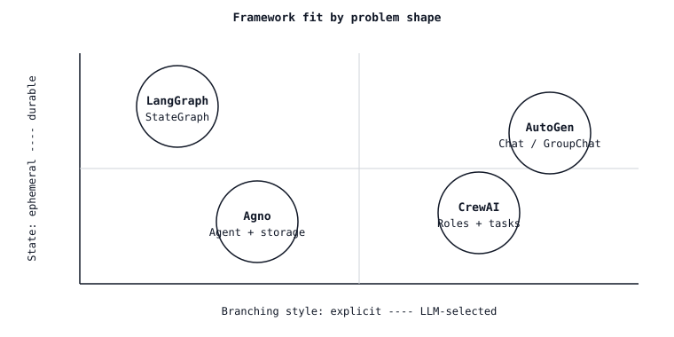

# Agent Framework Tradeoff'ları — LangGraph vs CrewAI vs AutoGen vs Agno

> Her framework aynı demo'yu satar (araştırma agent'ı bir rapor oluşturur) ve aynı hatayı gizler (durum şeması orkestrasyon katmanıyla savaşır). Soyutmaları sorununuzun şekliyle eşleşen framework'ü seçin; geri kalan her şey iki kez yazdığınız yapıştırıcıdır.

**Tür:** Learn
**Diller:** Python
**Önkoşullar:** Phase 11 · 09 (Function Calling), Phase 11 · 16 (LangGraph)
**Süre:** ~45 dakika

## Sorun

Birden fazla LLM çağrısı gerektiren bir göreviniz var. Belki bir araştırma iş akışıdır (planla, ara, özetle, alıntıla). Belki bir kod inceleme pipeline'ıdır (farkı ayrıştır, eleştir, yamala, doğrula). Belki de uçuşları ayırt eden, e-posta yazan ve harcama raporları sunan çok turlu bir asistandır. Bir framework seçiyorsunuz.

Üç gün sonra, framework'ün soyutmalarının sızdığını keşfediyorsunuz. CrewAI size roller veriyor ama "araştırmacı"nın "yazara" yapılandırılmış bir plan teslim etmesi gerektiğinde savaş çıkıyor. AutoGen size agent'lar arası sohbet veriyor ama birinci sınıf durumu yok, bu yüzden checkpoint'iniz bir konuşma kaydının pickle'ı. LangGraph size bir durum grafı veriyor ama agent'ın ne yapacağını bilmeden her geçişi adlandırmanızı zorluyor. Agno size tek agent soyutlaması veriyor ama üç paralel işçiye fanout yapmaya çalıştığınızda çığlık atıyor.

Düzeltme "en iyi framework'ü seç" değil. Framework'ün temel soyutmasını sorununuzun şekliyle eşleştirmektir. Bu ders o haritayı çizer.

## Kavram

Dört framework 2026 manzarasına hakimdir. Temel soyutmaları aynı değildir.

| Framework | Temel soyutma | En iyi uyum | En kötü uyum |
|-----------|------------------|----------|-----------|
| **LangGraph** | `StateGraph` — tipli durum, düğümler, koşullu kenarlar, checkpoint. | Açık durum ve insan döngüsü interrupt'ları olan iş akışları; zaman yolculuğu hata ayıklamasına ihtiyaç duyan üretim agent'ları. | Topolojinin bilinmediği gevşek, rol odaklı beyin fırtınası. |
| **CrewAI** | `Crew` — roller (amaç, backstory), görevler, süreç (sıralı veya hiyerarşik). | Kısa doğrusal/hiyerarşik planlı rol yapma veya persona odaklı iş akışları. | Crew'un turn geçmişi ötesinde herhangi bir durumlu şey; karmaşık dallanmalar. |
| **AutoGen** | `ConversableAgent` çifti — çıkış koşuluna kadar sırayla konuşan iki veya daha fazla agent. | Düşüncenin sohbetten çıktığı çoklu agent *diyalogu* (öğretmen-öğrenci, öneren-eleştiren, oyuncu-inceleyen). | Bilinen bir DAG'a sahip deterministik iş akışları; yeniden başlatmalar arası kalıcı durum gerektiren her şey. |
| **Agno** | `Agent` — tek LLM + araçlar + hafıza, takımlara compose edilebilir. | Hızla oluşturulabilen tek agent'lar ve hafif takımlar; güçlü çok modallık ve yerleşik depolama sürücüleri. | Özel reducer'larla derin, açıkça dallanmış graf'lar. |

### "Soyutma" aslında ne demek

Bir framework'ün temel soyutması, mimariyi sunarken beyaz tahtaya çizdiğiniz şeydir.

- **LangGraph** → bir graf çizersiniz. Düğümler adımlardır, kenarlar geçişlerdir ve her noktadaki durum nesnesi tiplidir. Zihinsel model bir durum makinesidir.
- **CrewAI** → bir organizasyon çizelgesi çizersiniz. Her rolün bir iş tanımı vardır ve bir yönetici görevleri yönlendirir. Zihinsel model küçük bir uzman ekibidir.
- **AutoGen** → bir Slack DM çizersiniz. İki agent birbirine mesaj atar; bir moderatöre ihtiyacınız varsa üçüncü katılır. Zihinsel model sohbettir.
- **Agno** → araçların asılı olduğu tek bir kutu çizersiniz. Takım için kutuları yan yana koyun. Zihinsel model "piller dahil agent"tır.

### Durum sorusu

Durum, çoğu framework seçiminin üretimde bozulduğu yerdir.

- **LangGraph.** Tipli durum (`TypedDict` veya Pydantic modeli), alan bazlı reducer'lar, birinci sınıf checkpoint (SQLite/Postgres/Redis). Resume, interrupt ve time-travel ücretsizdir. *(Phase 11 · 16'ya bakın.)*
- **CrewAI.** Durum `context` alanı aracılığıyla görevler arasında string olarak akar veya `output_pydantic` ile yapılandırılır. Crew'un yeniden başlatmadan kurtulması gerekirse kutunun dışında dayanıklı crew deposu yoktur; kendi başınıza eklersiniz.
- **AutoGen.** Durum sohbet geçmişi ve herhangi bir kullanıcı tanımlı `context`'tir. Konuşma transkriptleri depolanır; siz adaptörler yazmadığınız sürece rastgele iş akışı durumu depolanmaz.
- **Agno.** Yerleşik depolama sürücüleri (SQLite, Postgres, Mongo, Redis, DynamoDB) bir `Agent`'a `storage=` ile eklenir — oturum oturumları ve kullanıcı bellekleri otomatik olarak depolanır. Tam bir graf checkpoint'i değil; bir oturum deposu.

### Dalanma sorusu

Her ciddi agent dallanır. Kimin dallanmaya karar verdiği önemlidir.

- **LangGraph** — siz karar verirsiniz, koşullu kenarlarla. Yönlendirme, adlı dallara sahip bir Python fonksiyonudur. Dallar derlenmiş graf içinde birinci sınıftır; checkpoint hangi dalın alındığını kaydeder.
- **CrewAI** — yönetici hiyerarşik modda karar verir; sıralı modda derleme zamanında siz karar verirsiniz. Yönlendirme görev listesinde örtüktür; yöneticinin prompt'u dışında birinci sınıf "if" yoktur.
- **AutoGen** — agent'lar sohbet yoluyla karar verir. Dallanma bir sonrakanin kim olduğundan ortaya çıkar. `GroupChatManager` bir sonraki konuşmacıyı seçer; elle yazılmış bir `speaker_selection_method` yazabilirsiniz ama varsayılan LLM tarafından seçilir.
- **Agno** — agent bir sonraki hangi aracı çağıracağına karar verir. Takımlarda bir koordinatör/yönlendirici/işbirlikçi modu vardır; ötesindeki dalanma geliştiricinin sorumluluğundadır.

### Gözlemlenebilirlik sorusu

- **LangGraph** — LangSmith veya herhangi bir OTel export'u aracılığıyla OpenTelemetry. Her düğüm geçişi bir trace span'idir; checkpoint'ler yeniden oynatılabilir trace olarak çift görev yapar. LangSmith birinci taraf seçeneğidir; Langfuse/Phoenix'in de adaptörleri vardır.
- **CrewAI** — 2025 sonundan itibaren birinci sınıf OpenTelemetry; Langfuse, Phoenix, Opik, AgentOps ile entegrasyonlar.
- **AutoGen** — `autogen-core` aracılığıyla OpenTelemetry entegrasyonu; AgentOps ve Opik bağlayıcılarına sahiptir. Trace Granularity'si agent-mesajı başına, düğüm başına değil.
- **Agno** — yerleşik `monitoring=True` bayrağı artı OpenTelemetry export'ları; oturum trace'leri için Langfuse ile sıkı entegrasyon.

### Maliyet ve gecikme

Dört framework de çağrı başına ek yük ekler (framework mantığı, doğrulama, serializasyon). Artan ek yük için yaklaşık sıra: Agno ≈ LangGraph < CrewAI ≈ AutoGen. Fark, framework'ün ekstra LLM yönlendirmesi yapmasına bağlıdır. CrewAI'nın hiyerarşik yöneticisi token harcar ve bir sonraki kimin gideceğine karar verir; AutoGen'ın `GroupChatManager`'ı da öyle. LangGraph yalnızca `llm.invoke` yazdığınız yerde token harcar. Agno'nun tek agent yolu incedir.

Çalıştırma başına maliyet önemli olduğunda, LLM tarafından seçilen yönlendirme yerine açık yönlendirmeyi (LangGraph kenarları, AutoGen `speaker_selection_method`) tercih edin.

### Birlikte çalışılabilirlik

- **LangGraph** ↔ **LangChain** araçları, retriever'ları, LLM'leri. Birinci sınıf MCP adaptörü (araçlar MCP sunucusu olarak içe aktarılır).
- **CrewAI** ↔ araçlar `BaseTool`'dan türetilir; LangChain araçları, LlamaIndex araçları ve MCP araçları adapte edilir. Crew-to-crew delegasyonu `allow_delegation=True` ile.
- **AutoGen** → `FunctionTool` herhangi bir Python callable'ı sarar; MCP adaptörü mevcuttur. Agent-to-agent kalıpları için AG2 ekosistemine sıkı bağlılık.
- **Agno** → `@tool` dekoratörü veya BaseTool alt sınıfı; MCP adaptörü; araçlar agent'lar ve takımlar arasında paylaşılabilir.

## Beceri

> Verilen bir framework'ün neden belirli bir agent sorunu için doğru olduğunu tek bir cümleyle açıklayabilirsiniz.

Ön-inşa kontrol listesi:

1. **Şekli çizin.** Bu bir graf mı (tipli durum, adlı geçişler)? Bir rol yapma mı (uzmanlar işi devreder mi)? Bir sohbet mi (agent'lar bitene kadar konuşur mu)? Araçlı tek bir agent mı?
2. **Kimin dallanacağına karar verin.** Geliştirici tarafından karar verilen dalanma → LangGraph. Yönetici-agent tarafından → CrewAI hiyerarşik. Sohbetten çıkan → AutoGen. Araç çağrısı tarafından → Agno.
3. **Durum bütçesini kontrol edin.** Checkpoint'ten resume mu gerekiyor? Time-travel mı? Çalışma ortasında insan interrupt'ları mı? Evetse, LangGraph varsayılandır; Agno oturumları konuşma kapsamlı durumu kapsar.
4. **Maliyet bütçesini kontrol edin.** LLM tarafından seçilen yönlendirme her turda ekstra token maliyeti gerektirir. Agent günde binlerce kez çalışıyorsa, açık yönlendirmeyi tercih edin.
5. **Framework ek yükünü bütçelendirin.** Her framework başka bir bağımlılıktır. Görev iki LLM çağrısı ve bir araçsa, 30 satır saf Python yazın; framework'sız her şeyden daha ucuzdur.

Grafı, organizasyon çizelgesini, sohbeti veya agent kutusunu çizemeden bir framework'e uzanmayı reddedin. Asıl ihtiyacınız olan şey için durum modeliyle savaşmaya zorlayan birini seçmeyi reddin.

## Karar Matrisi

| Sorun şekli | Tercih edilen framework | Neden |
|---------------|---------------------|-----|
| Tipli durum, insan onayları, uzun süren iş akışı DAG'ı | LangGraph | Birinci sınıf durum, checkpoint, interrupt, time-travel. |
| Belirgin rollerle araştırma/yazma pipeline'ı | CrewAI (sıralı) veya LangGraph alt graf'ları | Görev başına rol CrewAI'da ucuza ifade edilir; dallanma karmaşıklaştıkça LangGraph ile ölçeklenir. |
| Öneren-eleştiren veya öğretmen-öğrenci diyaloğu | AutoGen | İki agent sohbeti onun doğal şeklidir. |
| Araçlar, oturumlar, hafıza ile tek agent | Agno | En ince kurulum, yerleşik depolama ve hafıza. |
| Reducer'larla binlerce paralel fanout | LangGraph + `Send` | Birinci sınıf paralel gönderim API'sine sahip tek olan. |
| Hızlı prototip, framework taahhüdü yok | Saf Python + sağlayıcı SDK | Hiçbir framework en hızlı framework'tür. |

## Alıştırmalar

1. **Kolay.** Aynı görevi alın — "Anthropic'in genel merkezini araştır, 200 kelimelik bir brief yaz, kaynakları alıntıla" — ve LangGraph'te (dört düğüm: plan, ara, yaz, alıntıla) ve CrewAI'da (üç rol: araştırmacı, yazan, editör) uygulayın. Çalıştırma başına token maliyetini ve kod satır sayısını raporlayın.
2. **Orta.** Aynı görevi AutoGen'de (araştırmacı ↔ yazan sohbeti, editör `GroupChat`'e katılır) ve Agno'da (`search_tools` ve `write_tools` ile tek bir artı oturum deposu olan bir agent) oluşturun. Dört uygulamayı (a) çalıştırma başına maliyet, (b) çökme sonrası resume yeteneği, (c) yazma adımından önce insan onayı enjekte etme yeteneği olarak sıralayın.
3. **Zor.** Kısa bir sorun tanımı (JSON: `{has_typed_state, has_roles, has_dialogue, has_parallel_fanout, needs_resume}`) alan ve tek cümlelik gerekçeyle bir öneri döndüren `pick_framework.py` karar ağacı betiği oluşturun. Kendi tasarladığınız altı vakada doğrulayın.

## Anahtar Terimler

| Terim | İnsanların Söylediği | Aslında Ne Anlama Geldiği |
|------|-----------------|-----------------------|
| Orkestrasyon | "Agent'lar nasıl koordine olur" | Bir sonraki düğümü/rolü/agent'ı kararlaştıran katman. |
| Kalıcı durum | "Yeniden başlatma sonrası devam" | Process ölümünden kurtulan, bir checkpoint veya oturum deposuna bağlı durum. |
| LLM tarafından seçilen yönlendirme | "Modelin karar vermesi" | Bir planlayıcı LLM her turda bir sonraki adımı seçer; esnek ama her kararda token öder. |
| Açık yönlendirme | "Geliştirici karar verir" | Bir Python fonksiyonu veya statik kenar bir sonraki adımı seçer; ucuz ve denetlenebilir. |
| Crew | "Bir CrewAI takımı" | Roller + görevler + süreç (sıralı veya hiyerarşik) tek bir çalıştırılabilir nesneye bağlanır. |
| GroupChat | "AutoGen'ın çoklu agent sohbeti" | Bir konuşmacı seçici ile N agent arasında yönetilen bir konuşma. |
| Takım (Agno) | "Çoklu agent Agno" | Agent seti üzerinde yönlendirme/koordinasyon/işbirliği modu. |
| StateGraph | "LangGraph'ın grafı" | Tipli durum, düğüm, koşullu kenar, checkpoint soyutması. |

## Ek Okuma

- [LangGraph documentation](https://langchain-ai.github.io/langgraph/) — StateGraph, checkpoint'ler, interrupt'lar, time-travel.
- [CrewAI documentation](https://docs.crewai.com/) — Crew'lar, Flow'lar, Agent'lar, Görevler, Süreçler.
- [AutoGen documentation](https://microsoft.github.io/autogen/) — ConversableAgent, GroupChat, takımlar, araçlar.
- [Agno documentation](https://docs.agno.com/) — Agent, Takım, İş Akışı, depolama, hafıza.
- [Anthropic — Building effective agents (Aralık 2024)](https://www.anthropic.com/research/building-effective-agents) - kalıp kitaplığı (prompt zincirleme, yönlendirme, paralelleştirme, orkestratör-worker, değerlendirici-optimize edici) framework'ten bağımsız.
- [Yao vd., "ReAct: Synergizing Reasoning and Acting" (ICLR 2023)](https://arxiv.org/abs/2210.03629) - her framework'ün giydirdiği döngü.
- [Wu vd., "AutoGen: Enabling Next-Gen LLM Applications via Multi-Agent Conversation" (2023)](https://arxiv.org/abs/2308.08155) — AutoGen'ın tasarım makalesi.
- [Park vd., "Generative Agents: Interactive Simulacra of Human Behavior" (UIST 2023)](https://arxiv.org/abs/2304.03442) — CrewAI-stili persona yığınlarının üzerine inşa ettiği rol yapma temeli.
- Phase 11 · 16 (LangGraph) — bu dersin benchmark karşılaştırdığı framework.
- Phase 11 · 19 (Reflexion) — LangGraph'e düzgün sığan ama CrewAI'a zor sığan bir kalıp.
- Phase 11 · 22 (Üretim gözlemlenebilirliği) — hangi framework'ü seçerseniz seçin nasıl araçlandırılır.
