# İletişim Protokolleri

> Aynı dili konuşamayan agent'lar bir takım değildir. Boşluğa bağıran yabancılardır.

**Tür:** İnşa Et
**Diller:** TypeScript
**Ön Koşullar:** Faz 14 (Agent Mühendisliği), Ders 16.01 (Neden Multi-Agent)
**Süre:** ~120 dakika

## Öğrenme Hedefleri

- Agent'ların dış sunucular tarafından açılan araçları kullanabilmesi için MCP araç keşfi ve çağrısını uygulayın
- Bir agent'ın HTTP üzerinden başka bir agent'a iş devretmesine izin veren bir A2A agent card ve görev uç noktası (endpoint) inşa edin
- MCP (araç erişimi), A2A (agent-arası), ACP (kurumsal denetim) ve ANP'yi (merkezsiz güven) karşılaştırın ve her protokolün hangi sorunu çözdüğünü açıklayın
- Agent'ların MCP ile araçları keşfettiği ve A2A ile görevleri devrettiği tek bir sistemde birden fazla protokolü birbirine bağlayın

## Problem

Sisteminizi birden fazla agent'a böldünüz. Bir araştırmacı, bir kod yazarı, bir incelemeci. Bireysel işlerinde harikalar. Ama şimdi gerçekten birbirleriyle konuşmaları gerekiyor.

İlk denemeniz bariz: string'leri etrafta dolaştırmak. Araştırmacı bir metin blob'u döner, kod yazarı onu becerebildiği şekilde ayrıştırır. Kod yazarı bir araştırma özetini yanlış yorumlayana kadar çalışır, veya iki agent birbirini beklerken deadlock'a girer, veya farklı takımlar tarafından inşa edilmiş agent'ların işbirliği yapması gerekir. Ansızın "sadece string geçir" çözülür.

Bu iletişim protokolü problemidir. Agent'ların bilgi alışverişinde bulunma biçimi için paylaşılan bir sözleşme olmadan, multi-agent sistemler kırılgandır, denetlenemez ve kendinizin yazdığı birkaç ellikten fazla agent'a ölçeklenemez.

AI ekosistemi, sorunun farklı bir dilimini çözen dört protokolle yanıt verdi:

- Araç erişimi için **MCP**
- Agent-arası işbirliği için **A2A**
- Kurumsal denetlenebilirlik için **ACP**
- Merkezsiz kimlik ve güven için **ANP**

Bu derin bir derstir. Her spesifikasyondan gerçek kablo biçimlerini okuyacak, çalışan uygulamalar inşa edecek ve dördünü birleşik bir sistemde bağlayacaksınız.

## Kavram

### Protokol Manzarası

Bu dört protokolü, her biri farklı bir soruyu ele alan katmanlar olarak düşünün:

```mermaid
block-beta
  columns 1
  block:ANP["ANP — Agent'lar yabancılara nasıl güvenir?\nMerkezsiz kimlik (DID), Uçtan Uca Şifreleme (E2EE), meta-protokol"]
  end
  block:A2A["A2A — Agent'lar hedefler üzerinde nasıl işbirliği yapar?\nAgent Card'lar, görev yaşam döngüsü, streaming, müzakere"]
  end
  block:ACP["ACP — Agent'lar denetlenebilir sistemlerde nasıl konuşur?\nÇalıştırmalar (runs), yörünge üst verisi, oturum sürekliliği"]
  end
  block:MCP["MCP — Bir agent bir aracı nasıl kullanır?\nAraç keşfi, yürütme, bağlam paylaşımı"]
  end

  style ANP fill:#f3e8ff,stroke:#7c3aed
  style A2A fill:#dbeafe,stroke:#2563eb
  style ACP fill:#fef3c7,stroke:#d97706
  style MCP fill:#d1fae5,stroke:#059669
```

Rakipler değiller. Farklı seviyelerde farklı sorunları çözerler.

### MCP (Özet)

MCP, Faz 13'te derinlemesine ele alınmıştır. Hızlı özet: MCP, bir LLM'in dış araçlara ve veri kaynaklarına nasıl bağlandığını standartlaştırır. Agent'ın (istemci) bir sunucu tarafından açılan araçları keşfettiği ve çağırdığı bir **istemci-sunucu** protokolüdür.

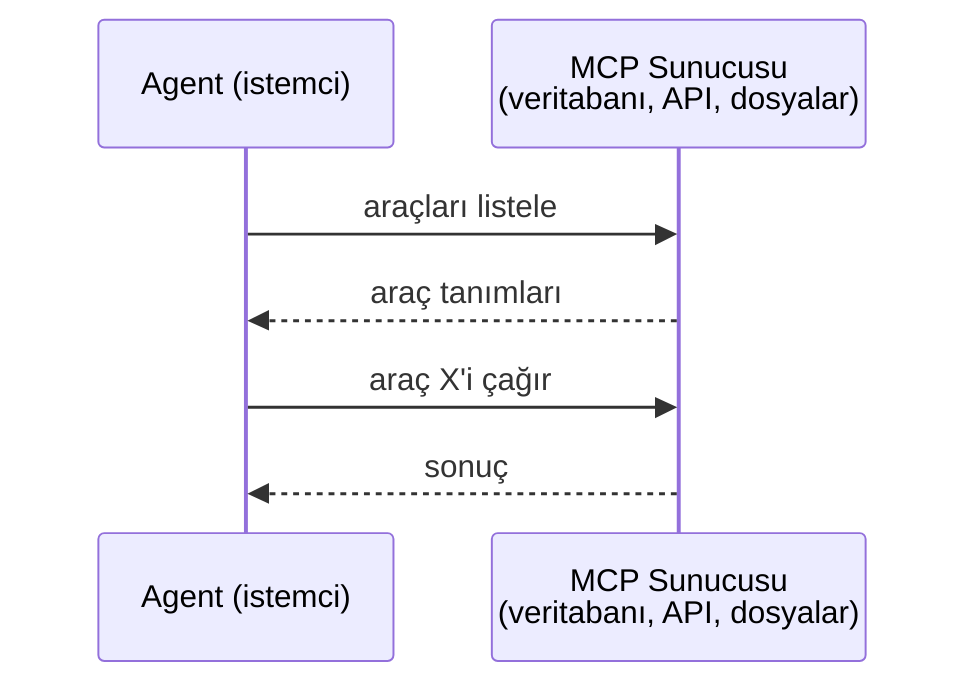

MCP, **agent-araç** iletişimidir. Agent'ların birbirleriyle konuşmasına yardımcı olmaz.

### A2A (Agent2Agent Protokolü)

**Yaratan:** Google (artık Linux Foundation altında `lf.a2a.v1`)
**Spesifikasyon sürümü:** 1.0.0
**Problem:** Otonom agent'lar birbirleriyle nasıl işbirliği yapar, müzakere eder ve görevleri birbirine devreder?

A2A, **eşler arası agent işbirliği** protokolüdür. MCP bir agent'ı araçlara bağlarken, A2A bir agent'ı diğer agent'lara bağlar. Her agent iyi bilinen bir URL'de bir **Agent Card** yayınlar ve diğer agent'lar onu keşfeder, onunla müzakere eder ve ona görev devreder.

#### A2A Nasıl Çalışır

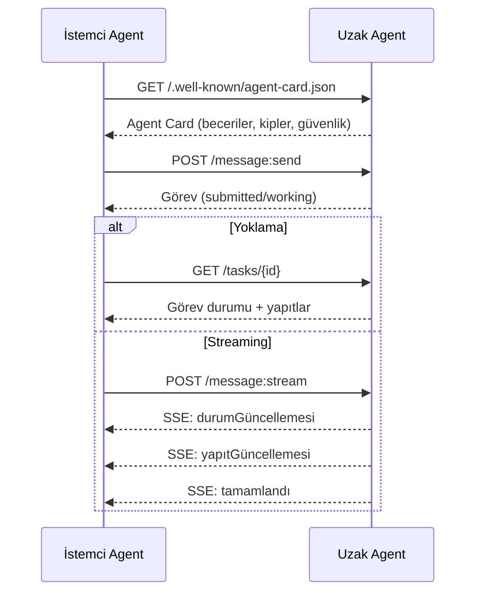

#### Gerçek Agent Card

A2A Agent Card'ı pratikte böyle görünür. `GET /.well-known/agent-card.json` adresinde sunulur:

```json
{
  "name": "Research Agent",
  "description": "Searches documentation and summarizes findings",
  "version": "1.0.0",
  "supportedInterfaces": [
    {
      "url": "https://research-agent.example.com/a2a/v1",
      "protocolBinding": "JSONRPC",
      "protocolVersion": "1.0"
    },
    {
      "url": "https://research-agent.example.com/a2a/rest",
      "protocolBinding": "HTTP+JSON",
      "protocolVersion": "1.0"
    }
  ],
  "provider": {
    "organization": "Your Company",
    "url": "https://example.com"
  },
  "capabilities": {
    "streaming": true,
    "pushNotifications": false
  },
  "defaultInputModes": ["text/plain", "application/json"],
  "defaultOutputModes": ["text/plain", "application/json"],
  "skills": [
    {
      "id": "web-research",
      "name": "Web Research",
      "description": "Searches the web and synthesizes findings",
      "tags": ["research", "search", "summarization"],
      "examples": ["Research the latest changes in React 19"]
    },
    {
      "id": "doc-analysis",
      "name": "Documentation Analysis",
      "description": "Reads and analyzes technical documentation",
      "tags": ["docs", "analysis"],
      "inputModes": ["text/plain", "application/pdf"],
      "outputModes": ["application/json"]
    }
  ],
  "securitySchemes": {
    "bearer": {
      "httpAuthSecurityScheme": {
        "scheme": "Bearer",
        "bearerFormat": "JWT"
      }
    }
  },
  "security": [{ "bearer": [] }]
}
```

#### Açıklama

Bu, A2A spesifikasyonunun "iyi bilinen URL"de açıkça sunulan gerçek bir Agent Card'ıdır. Alanlar üç kritik rol üstlenir: `supportedInterfaces` aynı agent'ın birden fazla protokol bağlamasını (JSON-RPC, REST, gRPC) aynı anda konuşabilmesini sağlar; `skills` her beceriyi id, tag'ler, desteklenen girdi/çıktı MIME türleriyle tanımlar — istemci agent'ın uzak agent'ın isteğini işleyip işleyemeyeceğine karar vermesinin yolu budur; `security` client'a tek bir istek yapmadan önce hangi auth'u gerektirdiğini bildirir. Bu üç tasarım kararı birlikte A2A'nın temel keşif sözleşmesini oluşturur.

Fark etmeniz gereken kilit noktalar:
- **Skills (Beceriler)** bir agent'ın yapabilecekleridir. Her birinin bir kimliği, etiketleri ve desteklenen girdi/çıktı MIME türleri vardır. Bu, bir istemci agent'ın bu uzak agent'ın isteğini işleyip işleyemeyeceğine karar verdiği yerdir.
- **supportedInterfaces** birden fazla protokol bağlamasını listeler. Tek bir agent aynı anda JSON-RPC, REST ve gRPC konuşabilir.
- **Security** karta yerleşiktir. İstemci, tek bir istek yapmadan önce hangi auth'a ihtiyaç duyduğunu bilir.

#### Görev Yaşam Döngüsü

Görevler, A2A'daki temel iş birimleridir. Tanımlı durumlardan geçer:

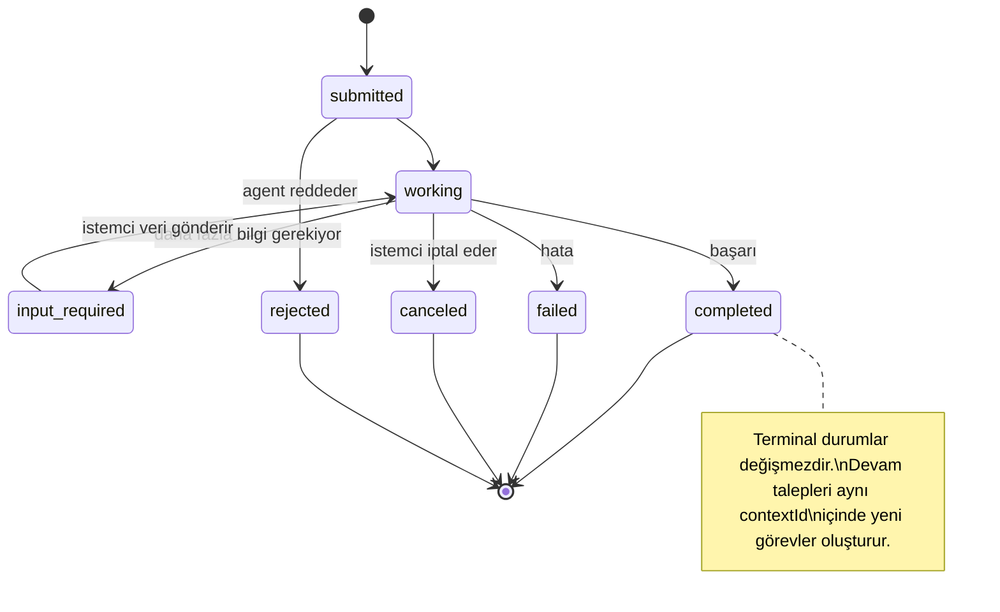

8 durumun tümü (spesifikasyon ayrıca sentinel olarak `UNSPECIFIED`'i de tanımlar, burada çıkarılmıştır):

| Durum | Terminal mi? | Anlamı |
|---|---|---|
| `TASK_STATE_SUBMITTED` | Hayır | Onaylandı, henüz işlenmiyor |
| `TASK_STATE_WORKING` | Hayır | Aktif olarak işleniyor |
| `TASK_STATE_INPUT_REQUIRED` | Hayır | Agent'ın istemciden daha fazla bilgiye ihtiyacı var |
| `TASK_STATE_AUTH_REQUIRED` | Hayır | Kimlik doğrulama gerekli |
| `TASK_STATE_COMPLETED` | Evet | Başarıyla tamamlandı |
| `TASK_STATE_FAILED` | Evet | Hata ile tamamlandı |
| `TASK_STATE_CANCELED` | Evet | Tamamlanmadan önce iptal edildi |
| `TASK_STATE_REJECTED` | Evet | Agent görevi reddetti |

Bir görev terminal bir duruma ulaştığında, değişmezdir. Başka mesaj yoktur. Devam talepleri aynı `contextId` içinde yeni bir görev oluşturur.

#### Kablo Biçimi

A2A, JSON-RPC 2.0 kullanır. Gerçek bir mesaj alışverişi böyle görünür:

**İstemci bir görev gönderir:**
```json
{
  "jsonrpc": "2.0",
  "id": 1,
  "method": "SendMessage",
  "params": {
    "message": {
      "messageId": "msg-001",
      "role": "ROLE_USER",
      "parts": [{ "text": "Research React 19 compiler features" }]
    },
    "configuration": {
      "acceptedOutputModes": ["text/plain", "application/json"],
      "historyLength": 10
    }
  }
}
```

**Agent görevle yanıt verir:**
```json
{
  "jsonrpc": "2.0",
  "id": 1,
  "result": {
    "task": {
      "id": "task-abc-123",
      "contextId": "ctx-xyz-789",
      "status": {
        "state": "TASK_STATE_COMPLETED",
        "timestamp": "2026-03-27T10:30:00Z"
      },
      "artifacts": [
        {
          "artifactId": "art-001",
          "name": "research-results",
          "parts": [{
            "data": {
              "findings": [
                "React 19 compiler auto-memoizes components",
                "No more manual useMemo/useCallback needed",
                "Compiler runs at build time, not runtime"
              ]
            },
            "mediaType": "application/json"
          }]
        }
      ]
    }
  }
}
```

**SSE ile streaming:**
```text
POST /message:stream HTTP/1.1
Content-Type: application/json
A2A-Version: 1.0

data: {"task":{"id":"task-123","status":{"state":"TASK_STATE_WORKING"}}}

data: {"statusUpdate":{"taskId":"task-123","status":{"state":"TASK_STATE_WORKING","message":{"role":"ROLE_AGENT","parts":[{"text":"Searching documentation..."}]}}}}

data: {"artifactUpdate":{"taskId":"task-123","artifact":{"artifactId":"art-1","parts":[{"text":"partial findings..."}]},"append":true,"lastChunk":false}}

data: {"statusUpdate":{"taskId":"task-123","status":{"state":"TASK_STATE_COMPLETED"}}}
```

#### Açıklama

Bu üç kablo biçimi birlikte A2A'nın üç farklı etkileşim modelini gösterir: ilk blok normal bir JSON-RPC isteği/yanıtı (`SendMessage` ile tek seferde gönder, tek yanıt al), ikinci blok tamamlanmış bir görevin zengin içeriğini (`artifacts` içinde yapılandırılmış JSON), üçüncü blok SSE üzerinden akan bir streaming oturumunu (`artifactUpdate` ile kademeli parçalar, sonunda `TASK_STATE_COMPLETED`). Bu kalıplar, bir A2A istemcisinin zaman uyumsuz (asenkron) yaşam döngüsünü nasıl yöneteceğini ve yapıtları (artifact) kademeli olarak nasıl toplayacağını tanımlar.

### ACP (Agent İletişim Protokolü)

**Yaratan:** IBM / BeeAI
**Spesifikasyon sürümü:** 0.2.0 (OpenAPI 3.1.1)
**Durum:** A2A altında Linux Foundation'a birleşiyor
**Problem:** Agent'lar tam denetlenebilirlik, oturum sürekliliği ve yörünge izleme ile nasıl iletişir?

ACP, **kurumsal protokol**dür. Pek çok özetin iddiasının aksine, ACP JSON-LD **kullanmaz**. OpenAPI aracılığıyla tanımlanmış düz bir REST/JSON API'sidir. Onu özel kılan şey **TrajectoryMetadata**'dır (Yörünge Üst Verisi): her agent yanıtı, onu üreten akıl yürütme adımlarının ve araç çağrılarının ayrıntılı bir günlüğünü taşıyabilir.

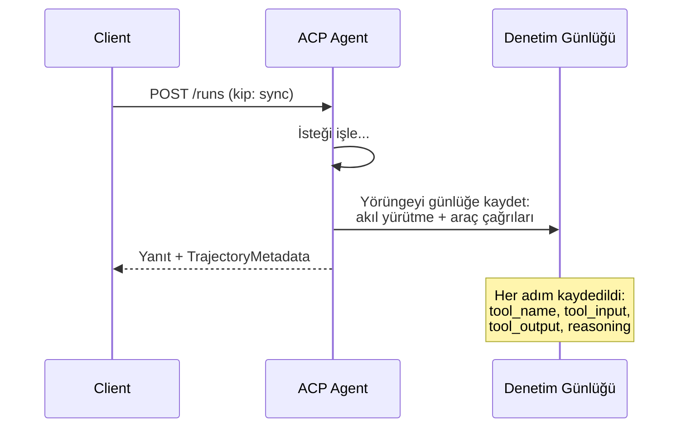

#### ACP'de Agent Keşfi

ACP dört keşif yöntemi tanımlar:

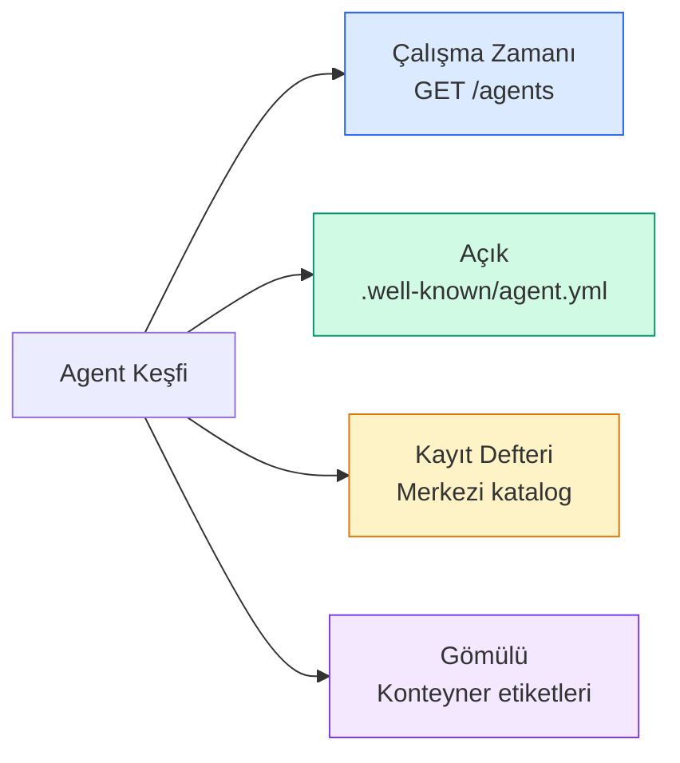

**AgentManifest** A2A'nın Agent Card'ından daha basittir:

```json
{
  "name": "summarizer",
  "description": "Summarizes documents with source citations",
  "input_content_types": ["text/plain", "application/pdf"],
  "output_content_types": ["text/plain", "application/json"],
  "metadata": {
    "tags": ["summarization", "RAG"],
    "framework": "BeeAI",
    "capabilities": [
      {
        "name": "Document Summarization",
        "description": "Condenses long documents into key points"
      }
    ],
    "recommended_models": ["llama3.3:70b-instruct-fp16"],
    "license": "Apache-2.0",
    "programming_language": "Python"
  }
}
```

#### Açıklama

ACP'nin `AgentManifest` şeması A2A'nın Agent Card'ına kıyasla kasıtlı olarak sade tutulmuştur: `name`, `description`, kabul edilen içerik türleri ve serbest biçimli `metadata` bloğu. Yetenekler düz bir dizi olarak listelenir, her biri sadece `name` ve `description` içerir — A2A'daki gibi tag'ler, örnekler veya `inputModes`/`outputModes` ayrımı yoktur. Bu sadelik, OpenAPI 3.1 ile bir REST API'si olarak doğrudan tanımlanabilmesini sağlar; A2A'nın zengin kart yapısı JSON-RPC ve SSE varsayımlarına dayanır.

#### Çalıştırma (Run) Yaşam Döngüsü

ACP "Runs" (Çalıştırmalar) kullanır, "Tasks" (Görevler) değil. Bir Run, üç kipli bir agent yürütmesidir:

| Kip | Davranış |
|---|---|
| `sync` | Engelleyen. Yanıt, tam sonucu içerir. |
| `async` | Hemen 202 döner. Durum için `GET /runs/{id}`'i yokla. |
| `stream` | SSE akışı. Olaylar, agent çalışırken ateşlenir. |

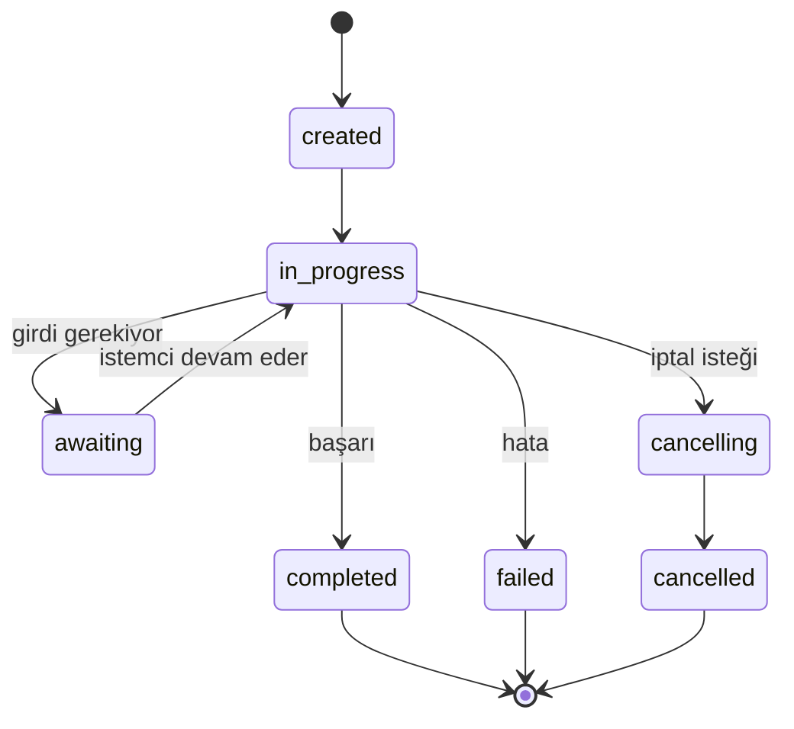

#### TrajectoryMetadata (Denetim İzi)

Bu, ACP'nin kilit farklılaştırıcısıdır. Her mesaj parçası, agent'ın tam olarak ne yaptığını gösteren üst veri içerebilir:

```json
{
  "role": "agent/researcher",
  "parts": [
    {
      "content_type": "text/plain",
      "content": "The weather in San Francisco is 72F and sunny.",
      "metadata": {
        "kind": "trajectory",
        "message": "I need to check the weather for this location",
        "tool_name": "weather_api",
        "tool_input": { "location": "San Francisco, CA" },
        "tool_output": { "temperature": 72, "condition": "sunny" }
      }
    }
  ]
}
```

Düzenlenmiş endüstriler için bu altındır. Her yanıt, kanıtlanabilir bir akıl yürütme zinciriyle gelir: hangi araçlar çağrıldı, hangi girdiler kullanıldı, hangi çıktılar alındı. Kara kutu yok.

ACP ayrıca kaynak atıfı için **CitationMetadata**'yı da destekler:

```json
{
  "kind": "citation",
  "start_index": 0,
  "end_index": 47,
  "url": "https://weather.gov/sf",
  "title": "NWS San Francisco Forecast"
}
```

### ANP (Agent Ağ Protokolü)

**Yaratan:** Açık kaynak topluluğu (kurucusu GaoWei Chang)
**Depo:** [github.com/agent-network-protocol/AgentNetworkProtocol](https://github.com/agent-network-protocol/AgentNetworkProtocol)
**Problem:** Farklı organizasyonlardan agent'lar merkezi bir otorite olmadan birbirlerine nasıl güvenir?

ANP, **merkezsiz kimlik protokolüdür**. W3C Decentralized Identifiers (DID'ler) ve uçtan uca şifreleme kullanarak güven inşa eder. A2A'dan farklı olarak agent'ları bilinen uç noktalar aracılığıyla keşfettiğiniz yerde, ANP agent'ların kimliklerini kriptografik olarak kanıtlamasına izin verir.

ANP'nin üç katmanı vardır:

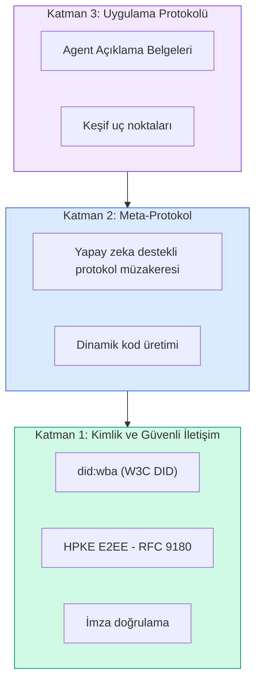

#### DID Belgeleri (Gerçek Yapı)

ANP, `did:wba` (Web-Based Agent) adlı özel bir DID yöntemi kullanır. `did:wba:example.com:user:alice` DID'i, `https://example.com/user/alice/did.json` adresine çözümlenir:

```json
{
  "@context": [
    "https://www.w3.org/ns/did/v1",
    "https://w3id.org/security/suites/jws-2020/v1",
    "https://w3id.org/security/suites/secp256k1-2019/v1"
  ],
  "id": "did:wba:example.com:user:alice",
  "verificationMethod": [
    {
      "id": "did:wba:example.com:user:alice#key-1",
      "type": "EcdsaSecp256k1VerificationKey2019",
      "controller": "did:wba:example.com:user:alice",
      "publicKeyJwk": {
        "crv": "secp256k1",
        "x": "NtngWpJUr-rlNNbs0u-Aa8e16OwSJu6UiFf0Rdo1oJ4",
        "y": "qN1jKupJlFsPFc1UkWinqljv4YE0mq_Ickwnjgasvmo",
        "kty": "EC"
      }
    },
    {
      "id": "did:wba:example.com:user:alice#key-x25519-1",
      "type": "X25519KeyAgreementKey2019",
      "controller": "did:wba:example.com:user:alice",
      "publicKeyMultibase": "z9hFgmPVfmBZwRvFEyniQDBkz9LmV7gDEqytWyGZLmDXE"
    }
  ],
  "authentication": [
    "did:wba:example.com:user:alice#key-1"
  ],
  "keyAgreement": [
    "did:wba:example.com:user:alice#key-x25519-1"
  ],
  "humanAuthorization": [
    "did:wba:example.com:user:alice#key-1"
  ],
  "service": [
    {
      "id": "did:wba:example.com:user:alice#agent-description",
      "type": "AgentDescription",
      "serviceEndpoint": "https://example.com/agents/alice/ad.json"
    }
  ]
}
```

Fark etmeniz gereken kilit noktalar:
- **Anahtar ayrımı** zorunludur. İmzalama anahtarları (secp256k1) şifreleme anahtarlarından (X25519) ayrıdır.
- **`humanAuthorization`** ANP'ye özgüdür. Bu anahtarlar, kullanılmadan önce açık insan onayı (biyometrik, parola, HSM) gerektirir. Para transferi gibi yüksek riskli işlemler bu yoldan geçer.
- **`keyAgreement`** anahtarları HPKE uçtan uca şifreleme (RFC 9180) için kullanılır.
- **service** bölümü Agent Description belgesine bağlanır.

#### ANP'de Güven Nasıl Çalışır

ANP bir web-of-trust veya endorsman grafiği **kullanmaz**. Güven iki taraflıdır ve etkileşim başına doğrulanır:

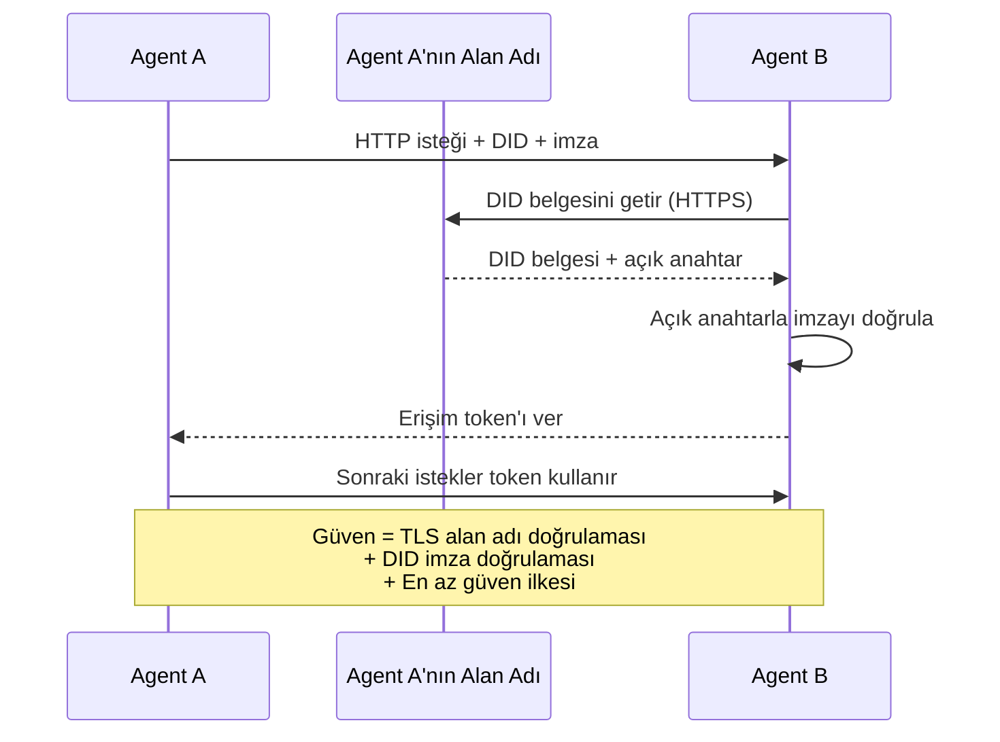

Güven üç kaynaktan gelir:
1. **Alan adı düzeyinde TLS** DID belgesi sunucusunu doğrular
2. **DID kriptografik imzaları** agent'ın kimliğini doğrular
3. **En az güven ilkesi** yalnızca minimum izinleri verir

Gossip tabanlı güven yayılımı veya PageRank puanlaması yoktur. Her agent'ı doğrudan DID'si aracılığıyla doğrularsınız.

#### Meta-Protokol Müzakereci

Bu, ANP'nin en yeni özelliğidir. Farklı ekosistemlerden iki agent karşılaştığında, önceden kabul edilmiş veri biçimlerine ihtiyaç duymazlar. Doğal dilde müzakere ederler:

```json
{
  "action": "protocolNegotiation",
  "sequenceId": 0,
  "candidateProtocols": "I can communicate using:\n1. JSON-RPC with hotel booking schema\n2. REST with OpenAPI 3.1 spec\n3. Natural language over HTTP",
  "modificationSummary": "Initial proposal",
  "status": "negotiating"
}
```

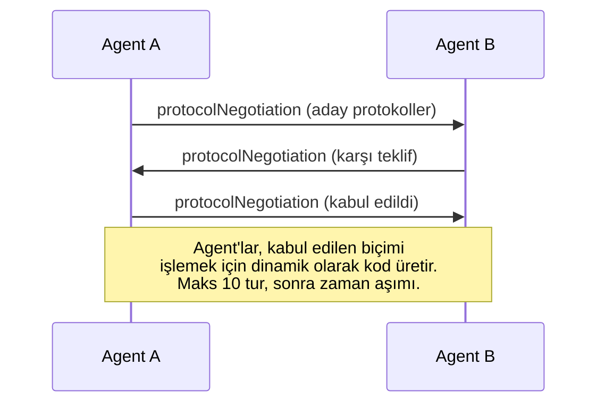

Agent'lar bir biçim üzerinde anlaşana kadar ileri geri gider (maks 10 tur), sonra onu işlemek için dinamik olarak kod üretir. Durum değerleri: `negotiating`, `rejected`, `accepted`, `timeout`.

Bu, daha önce birbirini hiç görmemiş iki agent'ın, kimse paylaşılan bir şema önceden tanımlamadan nasıl iletişim kuracağını anlayabileceği anlamına gelir.

### Karşılaştırma (Düzeltilmiş)

| | MCP | A2A | ACP | ANP |
|---|---|---|---|---|
| **Yaratan** | Anthropic | Google / Linux Foundation | IBM / BeeAI | Topluluk |
| **Spesifikasyon biçimi** | JSON-RPC | JSON-RPC / REST / gRPC | OpenAPI 3.1 (REST) | JSON-RPC |
| **Birincil kullanım** | Agent - Araç | Agent - Agent | Agent - Agent | Agent - Agent |
| **Keşif** | Araç listeleme | `/.well-known/agent-card.json` | `GET /agents`, `/.well-known/agent.yml` | `/.well-known/agent-descriptions`, DID hizmet uç noktaları |
| **Kimlik** | Örtük (yerel) | Güvenlik şemaları (OAuth, mTLS) | Sunucu düzeyinde | W3C DID (`did:wba`) E2EE ile |
| **Denetim izi** | YOK | Temel (görev geçmişi) | TrajectoryMetadata (araç çağrıları, akıl yürütme) | Biçimsel olarak belirtilmemiş |
| **Durum makinesi** | YOK | 9 görev durumu | 7 run durumu | YOK |
| **Streaming** | YOK | SSE | SSE | Taşıma-agnostik |
| **Benzersiz özellik** | Araç şemaları | Agent Cards + Skills | Yörünge denetim izi | Meta-protokol müzakeresi |
| **En iyi** | Araçlar ve veri | Dinamik işbirliği | Düzenlenmiş endüstriler | Organizasyonlar arası güven |
| **Durum** | Kararlı | Kararlı (v1.0) | A2A'ya birleşiyor | Aktif geliştirme |

### Birlikte Nasıl Çalışırlar

Bu protokoller birbirini dışlamaz. Gerçekçi bir kurumsal sistem birden fazlasını kullanır:

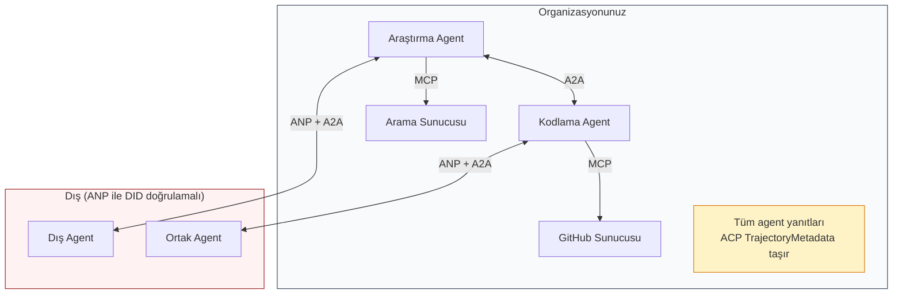

- **MCP** her agent'ı kendi araçlarına bağlar
- **A2A** agent'lar arası işbirliğini yönetir (dahili ve harici)
- **ACP** denetlenebilirlik için yanıtları yörünge üst verisiyle sarar
- **ANP** kontrolünüzde olmayan agent'lar için kimlik doğrulama sağlar

## İnşa Et

### Adım 1: Çekirdek Mesaj Türleri

Her multi-agent sistem bir mesaj biçimiyle başlar. Gerçek protokollerin kullandıklarını eşleyen türler tanımlarız:

```typescript
import crypto from "node:crypto";

type MessageRole = "user" | "agent";

type MessagePart =
  | { kind: "text"; text: string }
  | { kind: "data"; data: unknown; mediaType: string }
  | { kind: "file"; name: string; url: string; mediaType: string };

type TrajectoryEntry = {
  reasoning: string;
  toolName?: string;
  toolInput?: unknown;
  toolOutput?: unknown;
  timestamp: number;
};

type AgentMessage = {
  id: string;
  role: MessageRole;
  parts: MessagePart[];
  trajectory?: TrajectoryEntry[];
  replyTo?: string;
  timestamp: number;
};

function createMessage(
  role: MessageRole,
  parts: MessagePart[],
  replyTo?: string
): AgentMessage {
  return {
    id: crypto.randomUUID(),
    role,
    parts,
    replyTo,
    timestamp: Date.now(),
  };
}

function textMessage(role: MessageRole, text: string): AgentMessage {
  return createMessage(role, [{ kind: "text", text }]);
}
```

#### Açıklama

`MessagePart` ayrımcı birliği (discriminated union) üç modalityi temsil eder: metin, yapılandırılmış veri ve dosya — A2A ve ACP spesifikasyonlarının her ikisinin de birinci sınıf olarak modellediği aynı üç parça. `TrajectoryEntry` akıl yürütme + araç çağrısı girişini ACP'nin `TrajectoryMetadata` şemasıyla aynı yapıda tutar. `createMessage` ve `textMessage` yardımcıları her mesajı otomatik olarak bir UUID ve zaman damgasıyla sarar; elle id ve timestamp üretimini ortadan kaldırır.

Fark edin: `MessagePart` gerçek A2A ve ACP spesifikasyonlarında olduğu gibi multimodal'dır (metin, yapılandırılmış veri, dosyalar). `TrajectoryEntry` akıl yürütme zincirini yakalar, ACP'nin TrajectoryMetadata'sıyla eşleşir.

### Adım 2: A2A Agent Card ve Kayıt Defteri

Gerçek A2A spesifikasyonuyla eşleşen agent keşfi inşa edin:

```typescript
type Skill = {
  id: string;
  name: string;
  description: string;
  tags: string[];
  inputModes: string[];
  outputModes: string[];
};

type AgentCard = {
  name: string;
  description: string;
  version: string;
  url: string;
  capabilities: {
    streaming: boolean;
    pushNotifications: boolean;
  };
  defaultInputModes: string[];
  defaultOutputModes: string[];
  skills: Skill[];
};

class AgentRegistry {
  private cards: Map<string, AgentCard> = new Map();

  register(card: AgentCard) {
    this.cards.set(card.name, card);
  }

  discoverBySkillTag(tag: string): AgentCard[] {
    return [...this.cards.values()].filter((card) =>
      card.skills.some((skill) => skill.tags.includes(tag))
    );
  }

  discoverByInputMode(mimeType: string): AgentCard[] {
    return [...this.cards.values()].filter(
      (card) =>
        card.defaultInputModes.includes(mimeType) ||
        card.skills.some((skill) => skill.inputModes.includes(mimeType))
    );
  }

  resolve(name: string): AgentCard | undefined {
    return this.cards.get(name);
  }

  listAll(): AgentCard[] {
    return [...this.cards.values()];
  }
}
```

#### Açıklama

`AgentRegistry` sınıfı, A2A'nın iyi bilinen URL uç noktasının bellek içi bir simülasyonudur. Üç keşif yolu sunar: `discoverBySkillTag` bir beceri etiketiyle eşleşen tüm agent'ları bulur (gerçek A2A'da semantik etiket eşleştirmesi yapılır), `discoverByInputMode` belirli bir MIME türünü kabul edebilen agent'ları filtreler, `resolve` doğrudan ada göre bakar. `Skill` türündeki `tags` ve `inputModes`/`outputModes` alanları, gerçek A2A spesifikasyonundaki keşif sorgularının yönlendirildiği indekslerdir.

Bu, basit bir isim-yetenek eşlemesinden önemli ölçüde daha zengindir. Gerçek A2A spesifikasyonunun desteklediği gibi, agent'ları beceri etiketlerine, girdi MIME türlerine veya ada göre keşfedebilirsiniz.

### Adım 3: A2A Görev Yaşam Döngüsü

Tam görev durum makinesini inşa edin:

```typescript
type TaskState =
  | "submitted"
  | "working"
  | "input-required"
  | "auth-required"
  | "completed"
  | "failed"
  | "canceled"
  | "rejected";

const TERMINAL_STATES: TaskState[] = [
  "completed",
  "failed",
  "canceled",
  "rejected",
];

type TaskStatus = {
  state: TaskState;
  message?: AgentMessage;
  timestamp: number;
};

type Artifact = {
  id: string;
  name: string;
  parts: MessagePart[];
};

type Task = {
  id: string;
  contextId: string;
  status: TaskStatus;
  artifacts: Artifact[];
  history: AgentMessage[];
};

type TaskEvent =
  | { kind: "statusUpdate"; taskId: string; status: TaskStatus }
  | {
      kind: "artifactUpdate";
      taskId: string;
      artifact: Artifact;
      append: boolean;
      lastChunk: boolean;
    };

type TaskHandler = (
  task: Task,
  message: AgentMessage
) => AsyncGenerator<TaskEvent>;

class TaskManager {
  private tasks: Map<string, Task> = new Map();
  private handlers: Map<string, TaskHandler> = new Map();
  private listeners: Map<string, ((event: TaskEvent) => void)[]> = new Map();

  registerHandler(agentName: string, handler: TaskHandler) {
    this.handlers.set(agentName, handler);
  }

  subscribe(taskId: string, listener: (event: TaskEvent) => void) {
    const existing = this.listeners.get(taskId) ?? [];
    existing.push(listener);
    this.listeners.set(taskId, existing);
  }

  async sendMessage(
    agentName: string,
    message: AgentMessage,
    contextId?: string
  ): Promise<Task> {
    const handler = this.handlers.get(agentName);
    if (!handler) {
      const task = this.createTask(contextId);
      task.status = {
        state: "rejected",
        timestamp: Date.now(),
        message: textMessage("agent", `No handler for ${agentName}`),
      };
      return task;
    }

    const task = this.createTask(contextId);
    task.history.push(message);
    task.status = { state: "submitted", timestamp: Date.now() };

    this.processTask(task, handler, message).catch((err) => {
      task.status = {
        state: "failed",
        timestamp: Date.now(),
        message: textMessage("agent", String(err)),
      };
    });
    return task;
  }

  getTask(taskId: string): Task | undefined {
    return this.tasks.get(taskId);
  }

  cancelTask(taskId: string): boolean {
    const task = this.tasks.get(taskId);
    if (!task || TERMINAL_STATES.includes(task.status.state)) return false;
    task.status = { state: "canceled", timestamp: Date.now() };
    this.emit(taskId, {
      kind: "statusUpdate",
      taskId,
      status: task.status,
    });
    return true;
  }

  private createTask(contextId?: string): Task {
    const task: Task = {
      id: crypto.randomUUID(),
      contextId: contextId ?? crypto.randomUUID(),
      status: { state: "submitted", timestamp: Date.now() },
      artifacts: [],
      history: [],
    };
    this.tasks.set(task.id, task);
    return task;
  }

  private async processTask(
    task: Task,
    handler: TaskHandler,
    message: AgentMessage
  ) {
    task.status = { state: "working", timestamp: Date.now() };
    this.emit(task.id, {
      kind: "statusUpdate",
      taskId: task.id,
      status: task.status,
    });

    try {
      for await (const event of handler(task, message)) {
        if (TERMINAL_STATES.includes(task.status.state)) break;

        if (event.kind === "statusUpdate") {
          task.status = event.status;
        }
        if (event.kind === "artifactUpdate") {
          const existing = task.artifacts.find(
            (a) => a.id === event.artifact.id
          );
          if (existing && event.append) {
            existing.parts.push(...event.artifact.parts);
          } else {
            task.artifacts.push(event.artifact);
          }
        }
        this.emit(task.id, event);
      }
    } catch (err) {
      task.status = {
        state: "failed",
        timestamp: Date.now(),
        message: textMessage("agent", String(err)),
      };
      this.emit(task.id, {
        kind: "statusUpdate",
        taskId: task.id,
        status: task.status,
      });
    }
  }

  private emit(taskId: string, event: TaskEvent) {
    for (const listener of this.listeners.get(taskId) ?? []) {
      listener(event);
    }
  }
}
```

#### Açıklama

`TaskManager` A2A'nın yaşam döngüsünü üç kayıt (registry) ile uygular: `tasks` görev durumunu, `handlers` agent adına göre eşlenen async generator fonksiyonlarını, `listeners` ise abone olan istemcileri tutar. `processTask` içindeki `for await (const event of handler(...))` yapısı, agent'ın `statusUpdate` ve `artifactUpdate` olaylarını adım adım yield etmesini sağlar — bu, SSE streaming modelinin birebir eşdeğeridir. `TERMINAL_STATES` listesi ve döngüdeki `break` kontrolü, terminal duruma ulaşıldıktan sonra ek olayların yok sayılmasını garanti eder (A2A'nın değişmezlik kuralı).

Bu, gerçek A2A görev yaşam döngüsünü uygular: submitted, working, input-required, terminal durumlar. Handler'lar, SSE streaming modeliyle eşleşen olaylar (durum güncellemeleri ve yapıt parçaları) veren async generator'lardır.

### Adım 4: ACP Tarzı Denetim İzi

İletişimi yörünge izleme ile sarın:

```typescript
type AuditEntry = {
  runId: string;
  agentName: string;
  input: AgentMessage[];
  output: AgentMessage[];
  trajectory: TrajectoryEntry[];
  status: "created" | "in-progress" | "completed" | "failed" | "awaiting";
  startedAt: number;
  completedAt?: number;
  sessionId?: string;
};

class AuditableRunner {
  private log: AuditEntry[] = [];
  private handlers: Map<
    string,
    (input: AgentMessage[]) => Promise<{
      output: AgentMessage[];
      trajectory: TrajectoryEntry[];
    }>
  > = new Map();

  registerAgent(
    name: string,
    handler: (input: AgentMessage[]) => Promise<{
      output: AgentMessage[];
      trajectory: TrajectoryEntry[];
    }>
  ) {
    this.handlers.set(name, handler);
  }

  async run(
    agentName: string,
    input: AgentMessage[],
    sessionId?: string
  ): Promise<AuditEntry> {
    const entry: AuditEntry = {
      runId: crypto.randomUUID(),
      agentName,
      input: structuredClone(input),
      output: [],
      trajectory: [],
      status: "created",
      startedAt: Date.now(),
      sessionId,
    };
    this.log.push(entry);

    const handler = this.handlers.get(agentName);
    if (!handler) {
      entry.status = "failed";
      return entry;
    }

    entry.status = "in-progress";
    try {
      const result = await handler(input);
      entry.output = structuredClone(result.output);
      entry.trajectory = structuredClone(result.trajectory);
      entry.status = "completed";
      entry.completedAt = Date.now();
    } catch (err) {
      entry.status = "failed";
      entry.trajectory.push({
        reasoning: `Error: ${String(err)}`,
        timestamp: Date.now(),
      });
      entry.completedAt = Date.now();
    }
    return entry;
  }

  getFullAuditLog(): AuditEntry[] {
    return structuredClone(this.log);
  }

  getAuditLogForAgent(agentName: string): AuditEntry[] {
    return structuredClone(
      this.log.filter((e) => e.agentName === agentName)
    );
  }

  getAuditLogForSession(sessionId: string): AuditEntry[] {
    return structuredClone(
      this.log.filter((e) => e.sessionId === sessionId)
    );
  }

  getTrajectoryForRun(runId: string): TrajectoryEntry[] {
    const entry = this.log.find((e) => e.runId === runId);
    return entry ? structuredClone(entry.trajectory) : [];
  }
}
```

#### Açıklama

`AuditableRunner`, ACP'nin `TrajectoryMetadata` fikrini sarar: her agent çağrısı tam bir `AuditEntry` üretir — girdi, çıktı ve aradaki tüm akıl yürütme/araç adımları. `structuredClone` kullanımı, dışarıya dönen günlüklerin çağıran tarafından mutasyona uğratılamamasını garanti eder (denetim verisi için kritik). Sorgulama yöntemleri (`getFullAuditLog`, `getAuditLogForAgent`, `getAuditLogForSession`, `getTrajectoryForRun`) üç farklı eksen — agent, oturum, tek bir çalıştırma — boyunca denetim yapılmasını sağlar. Bu, düzenlenmiş iş yükleri için gerçek ACP dağıtımlarında kullanılan aynı erişim kalıplarıdır.

Her agent yürütmesi tam bir denetim girişi üretir: ne girdi, ne çıktı, ve arada araç çağrıları ile akıl yürütme adımlarının tam yörüngesi. Agent'a, oturuma veya tek bir çalıştırmaya göre sorgulayabilirsiniz.

### Adım 5: ANP Tarzı Kimlik Doğrulama

DID tabanlı kimlik ve doğrulama inşa edin:

```typescript
type VerificationMethod = {
  id: string;
  type: string;
  controller: string;
  publicKeyDer: string;
};

type DIDDocument = {
  id: string;
  verificationMethod: VerificationMethod[];
  authentication: string[];
  keyAgreement: string[];
  humanAuthorization: string[];
  service: { id: string; type: string; serviceEndpoint: string }[];
};

type AgentIdentity = {
  did: string;
  document: DIDDocument;
  privateKey: crypto.KeyObject;
  publicKey: crypto.KeyObject;
};

class IdentityRegistry {
  private documents: Map<string, DIDDocument> = new Map();

  publish(doc: DIDDocument) {
    this.documents.set(doc.id, doc);
  }

  resolve(did: string): DIDDocument | undefined {
    return this.documents.get(did);
  }

  verify(did: string, signature: string, payload: string): boolean {
    const doc = this.documents.get(did);
    if (!doc) return false;

    const authKeyIds = doc.authentication;
    const authKeys = doc.verificationMethod.filter((vm) =>
      authKeyIds.includes(vm.id)
    );

    for (const key of authKeys) {
      const publicKey = crypto.createPublicKey({
        key: Buffer.from(key.publicKeyDer, "base64"),
        format: "der",
        type: "spki",
      });
      const isValid = crypto.verify(
        null,
        Buffer.from(payload),
        publicKey,
        Buffer.from(signature, "hex")
      );
      if (isValid) return true;
    }
    return false;
  }

  requiresHumanAuth(did: string, operationKeyId: string): boolean {
    const doc = this.documents.get(did);
    if (!doc) return false;
    return doc.humanAuthorization.includes(operationKeyId);
  }
}

function createIdentity(domain: string, agentName: string): AgentIdentity {
  const did = `did:wba:${domain}:agent:${agentName}`;
  const { publicKey, privateKey } = crypto.generateKeyPairSync("ed25519");

  const publicKeyDer = publicKey
    .export({ format: "der", type: "spki" })
    .toString("base64");

  const keyId = `${did}#key-1`;
  const encKeyId = `${did}#key-x25519-1`;

  const document: DIDDocument = {
    id: did,
    verificationMethod: [
      {
        id: keyId,
        type: "Ed25519VerificationKey2020",
        controller: did,
        publicKeyDer,
      },
      {
        id: encKeyId,
        type: "X25519KeyAgreementKey2019",
        controller: did,
        publicKeyDer,
      },
    ],
    authentication: [keyId],
    keyAgreement: [encKeyId],
    humanAuthorization: [],
    service: [
      {
        id: `${did}#agent-description`,
        type: "AgentDescription",
        serviceEndpoint: `https://${domain}/agents/${agentName}/ad.json`,
      },
    ],
  };

  return { did, document, privateKey, publicKey };
}

function signPayload(identity: AgentIdentity, payload: string): string {
  return crypto
    .sign(null, Buffer.from(payload), identity.privateKey)
    .toString("hex");
}
```

#### Açıklama

Bu kod bloğu iki sorumluluğu ayırır. `IdentityRegistry` DID belgelerini depolar ve bir DID, imza, yük üçlüsü verildiğinde `verify` ile kriptografik doğrulama yapar — Node'un `crypto` modülüyle gerçek Ed25519 imza kontrolü. `requiresHumanAuth`, ANP'nin `humanAuthorization` dizisini sorgulayarak yüksek riskli bir işlemin açık insan onayı gerektirip gerektirmediğini belirler. `createIdentity` yardımcısı yeni bir agent için Ed25519 anahtar çifti üretir, `did:wba:<domain>:agent:<name>` formunda bir DID oluşturur ve üç farklı rol için ayrı anahtar referansları kaydeder: imzalama (`authentication`), anahtar anlaşması (`keyAgreement`) ve insan onayı (`humanAuthorization`). Bu üçlü ayrım, ANP'nin imzalama ve şifreleme anahtarlarını ayırma kuralının somut uygulamasıdır.

Bu, gerçek ANP kimlik modelini yansıtır: agent'ların ayrı kimlik doğrulama, anahtar anlaşması ve insan onay anahtarlarına sahip DID belgeleri vardır. `IdentityRegistry`, DID çözümlemesini simüle eder (üretimde bu, agent'ın alan adına HTTP getirmeleri olurdu).

### Adım 6: Protokol Ağ Geçidi

Dört protokolü birleşik bir sistemde birbirine bağlayın:

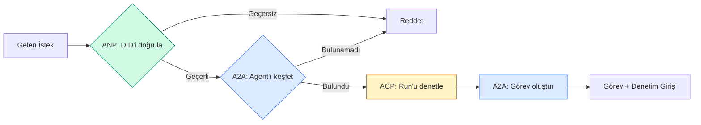

```typescript
class ProtocolGateway {
  private registry: AgentRegistry;
  private taskManager: TaskManager;
  private auditRunner: AuditableRunner;
  private identityRegistry: IdentityRegistry;

  constructor(
    registry: AgentRegistry,
    taskManager: TaskManager,
    auditRunner: AuditableRunner,
    identityRegistry: IdentityRegistry
  ) {
    this.registry = registry;
    this.taskManager = taskManager;
    this.auditRunner = auditRunner;
    this.identityRegistry = identityRegistry;
  }

  async delegateTask(
    fromDid: string,
    signature: string,
    targetAgent: string,
    message: AgentMessage,
    sessionId?: string
  ): Promise<{ task: Task; audit: AuditEntry } | { error: string }> {
    if (!this.identityRegistry.verify(fromDid, signature, message.id)) {
      return { error: "Identity verification failed" };
    }

    const card = this.registry.resolve(targetAgent);
    if (!card) {
      return { error: `Agent ${targetAgent} not found in registry` };
    }

    const audit = await this.auditRunner.run(
      targetAgent,
      [message],
      sessionId
    );
    const task = await this.taskManager.sendMessage(targetAgent, message);

    return { task, audit };
  }

  discoverAndDelegate(
    fromDid: string,
    signature: string,
    skillTag: string,
    message: AgentMessage
  ): Promise<{ task: Task; audit: AuditEntry } | { error: string }> {
    const candidates = this.registry.discoverBySkillTag(skillTag);
    if (candidates.length === 0) {
      return Promise.resolve({
        error: `No agents found with skill tag: ${skillTag}`,
      });
    }
    return this.delegateTask(
      fromDid,
      signature,
      candidates[0].name,
      message
    );
  }
}
```

#### Açıklama

`ProtocolGateway`, dört protokolün sıralı kapılarını tek bir `delegateTask` yönteminde birleştirir: önce ANP ile DID imzası doğrulanır, sonra A2A ile hedef agent kayıt defterinden çözümlenir, ardından ACP denetim run'u başlatılır, son olarak A2A görevi yaratılır. `discoverAndDelegate` yöntemi aynı akışa bir ön adım daha ekler: önce `skillTag` ile A2A keşfi yapılır, aday agent'lar bulunursa ilki seçilip delege edilir. Bu iki yöntem birlikte, A2A'nın "yetenek tabanlı yönlendirme" fikrini ANP'nin "kanıtlanmış kimlik" garantisiyle ve ACP'nin "tam denetim izi" gerekliliğiyle birleştiren tek bir giriş noktası oluşturur.

Ağ geçidi tek bir çağrıda dört şey yapar:
1. **ANP**: Çağıranın kimliğini DID imzası aracılığıyla doğrular
2. **A2A**: Hedef agent'ı keşfeder ve yetenekleri kontrol eder
3. **ACP**: Yürütmeyi yörüngeli bir denetim iziyle sarar
4. **A2A**: Tam yaşam döngüsü izlemeyle bir görev oluşturur

### Adım 7: Hepsini Birbirine Bağlayın

```typescript
async function protocolDemo() {
  const registry = new AgentRegistry();
  registry.register({
    name: "researcher",
    description: "Searches and summarizes findings",
    version: "1.0.0",
    url: "https://researcher.local/a2a/v1",
    capabilities: { streaming: true, pushNotifications: false },
    defaultInputModes: ["text/plain"],
    defaultOutputModes: ["text/plain", "application/json"],
    skills: [
      {
        id: "web-research",
        name: "Web Research",
        description: "Searches the web",
        tags: ["research", "search", "summarization"],
        inputModes: ["text/plain"],
        outputModes: ["application/json"],
      },
    ],
  });
  registry.register({
    name: "coder",
    description: "Writes code from specs",
    version: "1.0.0",
    url: "https://coder.local/a2a/v1",
    capabilities: { streaming: false, pushNotifications: false },
    defaultInputModes: ["text/plain", "application/json"],
    defaultOutputModes: ["text/plain"],
    skills: [
      {
        id: "code-gen",
        name: "Code Generation",
        description: "Generates code",
        tags: ["coding", "generation"],
        inputModes: ["text/plain", "application/json"],
        outputModes: ["text/plain"],
      },
    ],
  });

  const taskManager = new TaskManager();
  const auditRunner = new AuditableRunner();

  const researchTrajectory: TrajectoryEntry[] = [];

  taskManager.registerHandler(
    "researcher",
    async function* (task, message) {
      yield {
        kind: "statusUpdate" as const,
        taskId: task.id,
        status: { state: "working" as const, timestamp: Date.now() },
      };

      researchTrajectory.push({
        reasoning: "Searching for React 19 documentation",
        toolName: "web_search",
        toolInput: { query: "React 19 compiler features" },
        toolOutput: {
          results: ["react.dev/blog/react-19", "github.com/react/react"],
        },
        timestamp: Date.now(),
      });

      researchTrajectory.push({
        reasoning: "Extracting key findings from search results",
        toolName: "doc_analysis",
        toolInput: { url: "react.dev/blog/react-19" },
        toolOutput: {
          summary:
            "React 19 compiler auto-memoizes, no manual useMemo needed",
        },
        timestamp: Date.now(),
      });

      yield {
        kind: "artifactUpdate" as const,
        taskId: task.id,
        artifact: {
          id: crypto.randomUUID(),
          name: "research-results",
          parts: [
            {
              kind: "data" as const,
              data: {
                findings: [
                  "React 19 compiler auto-memoizes components",
                  "No more manual useMemo/useCallback needed",
                  "Compiler runs at build time, not runtime",
                ],
                sources: ["react.dev/blog/react-19"],
              },
              mediaType: "application/json",
            },
          ],
        },
        append: false,
        lastChunk: true,
      };

      yield {
        kind: "statusUpdate" as const,
        taskId: task.id,
        status: { state: "completed" as const, timestamp: Date.now() },
      };
    }
  );

  auditRunner.registerAgent("researcher", async () => ({
    output: [
      textMessage("agent", "React 19 compiler auto-memoizes components"),
    ],
    trajectory: researchTrajectory,
  }));

  const identityRegistry = new IdentityRegistry();

  const coderIdentity = createIdentity("coder.local", "coder");
  const researcherIdentity = createIdentity("researcher.local", "researcher");

  identityRegistry.publish(coderIdentity.document);
  identityRegistry.publish(researcherIdentity.document);

  const gateway = new ProtocolGateway(
    registry,
    taskManager,
    auditRunner,
    identityRegistry
  );

  console.log("=== Protokol Demosu ===\n");

  console.log("1. Agent Keşfi (A2A)");
  const researchAgents = registry.discoverBySkillTag("research");
  console.log(
    `   ${researchAgents.length} agent bulundu:`,
    researchAgents.map((a) => a.name)
  );

  console.log("\n2. Kimlik Doğrulama (ANP)");
  const message = textMessage("user", "Research React 19 compiler features");
  const signature = signPayload(coderIdentity, message.id);
  const verified = identityRegistry.verify(
    coderIdentity.did,
    signature,
    message.id
  );
  console.log(`   Coder DID: ${coderIdentity.did}`);
  console.log(`   İmza doğrulandı: ${verified}`);

  console.log("\n3. Görev Devretme (A2A + ACP + ANP)");
  const result = await gateway.delegateTask(
    coderIdentity.did,
    signature,
    "researcher",
    message,
    "session-001"
  );

  if ("error" in result) {
    console.log(`   Hata: ${result.error}`);
    return;
  }

  console.log(`   Görev ID: ${result.task.id}`);
  console.log(`   Görev durumu: ${result.task.status.state}`);
  console.log(`   Yapıtlar: ${result.task.artifacts.length}`);

  console.log("\n4. Denetim İzi (ACP)");
  console.log(`   Run ID: ${result.audit.runId}`);
  console.log(`   Durum: ${result.audit.status}`);
  console.log(`   Yörünge adımları: ${result.audit.trajectory.length}`);
  for (const step of result.audit.trajectory) {
    console.log(`     - ${step.reasoning}`);
    if (step.toolName) {
      console.log(`       Araç: ${step.toolName}`);
    }
  }

  console.log("\n5. Tam Denetim Günlüğü");
  const fullLog = auditRunner.getFullAuditLog();
  console.log(`   Toplam run: ${fullLog.length}`);
  for (const entry of fullLog) {
    const duration = entry.completedAt
      ? `${entry.completedAt - entry.startedAt}ms`
      : "devam ediyor";
    console.log(`   ${entry.agentName}: ${entry.status} (${duration})`);
  }
}

protocolDemo().catch((err) => {
  console.error("Protokol demosu başarısız:", err);
  process.exitCode = 1;
});
```

#### Açıklama

Bu `protocolDemo` fonksiyonu önceki yedi adımı uçtan uca birbirine bağlar: iki agent (`researcher` ve `coder`) `AgentRegistry`'ye kaydedilir, `researcher` için bir `TaskManager` handler'ı (async generator olarak) tanımlanır, iki agent için Ed25519 DID kimlikleri üretilip `IdentityRegistry`'ye yayınlanır, sonra tüm bileşenler `ProtocolGateway`'ye bağlanır. Demo, A2A beceri keşfinden DID imza doğrulamasına, görev devretmesinden ACP yörünge denetimine kadar dört protokol katmanını sırayla gözler önüne serer. Çıktı, gerçek bir üretim A2A/ACP/ANP akışının ne ürettiğini göstermek için terminale yazdırılır.

## Üretimde Ne Kırılır

Protokoller mutlu yolu çözer. İşte üretimde kırılan şeyler:

**Şema sürüklenmesi.** Agent A, `application/json` çıktısı reklamı yapan bir Agent Card yayınlar. Ama JSON şeması sürümler arasında değişir. Agent B eski biçimi ayrıştırır ve çöp alır. Çözüm: becerilerinizi ve çıktı şemalarınızı sürümleyin. A2A spesifikasyonu, bu nedenle Agent Card'larda `version`'ı destekler.

**Durum makinesi ihlalleri.** Bir agent handler'ı bir `completed` olayı verdikten sonra daha fazla yapıt vermeye çalışır. Görev değişmezdir (immutable). Kodunuz güncellemeleri sessizce düşürür veya hata fırlatır. Çözüm: vermeden önce terminal durumunu kontrol edin. Yukarıdaki `TaskManager`, terminal durumlardan sonra `break` ile bunu uygular.

**Güven çözümleme başarısızlıkları.** Agent A, Agent B'nin DID'ini doğrulamaya çalışır, ancak Agent B'nin alan adı kapalıdır. DID belgesi getirilemez. Açık başarısız mı olursunuz (doğrulanmamış agent'ları kabul et) yoksa kapalı mı başarısız olursunuz (her şeyi reddet)? ANP, en az güven ilkesiyle kapalı başarısız olmayı önerir.

**Yörünge şişmesi.** ACP yörünge günlüğü güçlüdür ama pahalıdır. Run başına 200 araç çağrısı yapan karmaşık bir agent, devasa denetim girişleri üretir. Çözüm: yörüngeyi yapılandırılabilir ayrıntı düzeylerinde (verbosity) günlüğe kaydedin. Uyum için araç adlarını ve IO'ları kaydedin, düzenlenmemiş iş yükleri için akıl yürütme adımlarını atlayın.

**Keşif gürültüsü (thundering herd).** 50 agent başlangıçta aynı anda `GET /agents`'ı sorgular. Çözüm: Agent Card'ları TTL ile önbelleğe alın, keşif aralıklarını kademelendirin veya yoklama yerine itme tabanlı kayıt kullanın.

## Kullan

### Gerçek Uygulamalar

**A2A** en olgundur. Google'ın [resmi spesifikasyonu](https://github.com/google/A2A) Linux Foundation altında açık kaynaktır. Python ve TypeScript için SDK'lar. Agent'larınızın dinamik keşif ve işbirliğine ihtiyacı varsa, buradan başlayın.

**ACP** A2A'ya birleşiyor. IBM'in [BeeAI projesi](https://github.com/i-am-bee/acp) ACP'yi REST-öncelikli bir alternatif olarak yarattı, ancak yörünge üst verisi kavramı A2A ekosistemine emiliyor. Taşıma olarak A2A kullansanız bile ACP kalıplarını (yörünge günlüğü, run yaşam döngüsü) kullanın.

**ANP** en deneysel olandır. [Topluluk deposu](https://github.com/agent-network-protocol/AgentNetworkProtocol) bir Python SDK'sına (AgentConnect) sahiptir. Meta-protokol müzakere kavramı gerçekten yenidir. Organizasyonlar arası agent dağıtımları için izlemeye değer.

**MCP** zaten Faz 13'te ele alınmıştır. Agent'larınızın araç kullanmasını istiyorsanız, MCP standarttır.

### Doğru Protokolü Seçmek

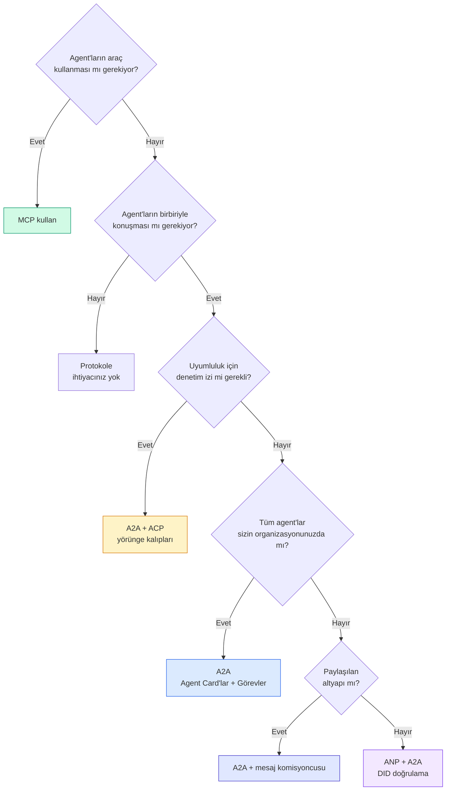

## Dağıt

Bu ders şunları üretir:
- `code/main.ts` -- dört protokol kalıbının tam uygulaması
- `outputs/prompt-protocol-selector.md` -- sisteminiz için protokol seçmenize yardımcı olan bir prompt

## Alıştırmalar

1. **Çok-hoplu görev devretme.** `TaskManager`'ı, bir agent handler'ının alt görevleri diğer agent'lara devredebileceği şekilde genişletin. Araştırmacı bir görev alır, "arama" ve "özetle" alt görevlerini iki uzman agent'a devreder, ikisinin de tamamlanmasını bekler, sonra sonuçları kendi yapıtlarına birleştirir.

2. **Streaming denetim izi.** `AuditableRunner`'ı streaming kipini destekleyecek şekilde değiştirin. Tam sonucu beklemek yerine, yörünge girişleri eklendikçe gerçek zamanlı olarak `AuditEntry` güncellemeleri verin. Denetim anlık görüntülerini üreten bir async generator kullanın.

3. **DID rotasyonu.** `IdentityRegistry`'ye anahtar rotasyonu ekleyin. Bir agent, `previousDid` referansını korurken güncellenmiş anahtarlarla yeni bir DID belgesi yayınlayabilmelidir. Doğrulayıcılar, bir tolerans süresi boyunca hem geçerli hem de önceki anahtardan gelen imzaları kabul etmelidir.

4. **Protokol müzakeresi.** ANP'nin meta-protokol kavramını uygulayın. İki agent, aday biçimlerle (örn. "JSON-RPC konuşabilirim" ve "REST tercih ederim") `protocolNegotiation` mesajları değiş tokuş eder. Maks 3 turdan sonra, bir biçim üzerinde anlaşırlar veya zaman aşımına uğrarlar. Kabul edilen biçim, hangi `TaskManager` veya `AuditableRunner` kullanacaklarını belirler.

5. **Hız sınırlı keşif.** Yapılandırılabilir TTL ile Agent Card aramalarını önbelleğe alan ve agent başına saniyedeki keşif sorgularını sınırlayan bir `RateLimitedRegistry` sarmalayıcısı ekleyin. Başlangıçta birbirini keşfeden 100 agent'lık bir gürültüyü simüle edin ve farkı ölçün.

## Anahtar Terimler

| Terim | İnsanlar ne diyor | Aslında ne anlama geliyor |
|-------|-------------------|--------------------------|
| MCP | "AI araçları için protokol" | Agent'ların araçları keşfedip kullanması için bir istemci-sunucu protokolü. Agent-araç, agent-agent değil. |
| A2A | "Google'ın agent protokolü" | Linux Foundation altında agent işbirliği için eşler arası bir protokol. Agent Card'lar ile keşif, 9 durumlu görev yaşam döngüsü, SSE ile streaming. JSON-RPC, REST ve gRPC bağlamalarını destekler. |
| ACP | "Kurumsal agent mesajlaşması" | IBM/BeeAI'nin yörüngeli TrajectoryMetadata ile agent run'ları için REST API'sı: her yanıt tam akıl yürütme ve araç çağrısı zincirini taşır. A2A'ya birleşiyor. |
| ANP | "Merkezsiz agent kimliği" | Kriptografik kimlik için `did:wba` (DID), E2EE için HPKE, ve daha önce birbirini hiç görmemiş agent'lar için yapay zeka destekli meta-protokol müzakeresi kullanan topluluk protokolü. |
| Agent Card | "Bir agent'ın kartviziti" | `/.well-known/agent-card.json` adresindeki becerileri, desteklenen MIME türlerini, güvenlik şemalarını ve protokol bağlamalarını tanımlayan JSON belgesi. |
| DID | "Merkezsiz Kimlik" | Agent'ın kendi alan adırende barındırılan kriptografik olarak doğrulanabilir kimlikler için W3C standardı. ANP `did:wba` yöntemini kullanır. |
| TrajectoryMetadata | "Denetim makbuzu" | Her agent yanıtına akıl yürütme adımlarını, araç çağrılarını ve bunların girdi/çıktılarını eklemek için ACP'nin mekanizması. |
| Meta-protokol | "Agent'lar nasıl konuşacaklarını müzakere eder" | Agent'ların veri biçimleri üzerinde dinamik olarak anlaşmak için doğal dil kullandığı, sonra onları işlemek için kod ürettiği ANP'nin yaklaşımı. |
| Task | "Bir iş birimi" | A2A'nın gönderimden tamamlanmaya kadar işi izleyen durum bilgisi olan nesnesi. Terminal olduğunda değişmezdir. |

## İleri Okuma

- [Google A2A spesifikasyonu](https://github.com/google/A2A) -- resmi spesifikasyon ve SDK'lar (v1.0.0, Linux Foundation)
- [IBM/BeeAI ACP spesifikasyonu](https://github.com/i-am-bee/acp) -- agent run'ları ve yörünge üst verisi için OpenAPI 3.1 spesifikasyonu
- [Agent Network Protocol](https://github.com/agent-network-protocol/AgentNetworkProtocol) -- DID tabanlı kimlik, E2EE, meta-protokol müzakeresi
- [Model Context Protocol belgeleri](https://modelcontextprotocol.io/) -- Anthropic'in MCP spesifikasyonu (Faz 13'te ele alınmıştır)
- [W3C Decentralized Identifiers](https://www.w3.org/TR/did-core/) -- ANP'nin temelini oluşturan kimlik standardı
- [RFC 9180 (HPKE)](https://www.rfc-editor.org/rfc/rfc9180) -- ANP'nin E2EE için kullandığı şifreleme şeması
- [FIPA Agent Communication Language](http://www.fipa.org/specs/fipa00061/SC00061G.html) -- modern agent protokollerinin akademik öncüsü
