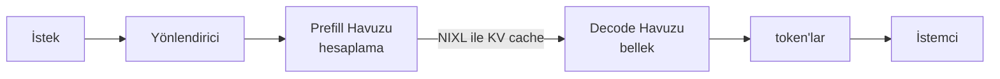

# Ayrıştırılmış Prefill/Decode — NVIDIA Dynamo ve llm-d

> Prefill (ön doldurma — istemin tümü için tek seferde hesaplama) hesaplama bağımlıdır (compute-bound), decode (çıktı üretimi) ise bellek bağımlıdır (memory-bound). İkisini aynı GPU'da çalıştırmak kaynaklardan birini boşa harcar. Ayrıştırma (disaggregation) bunları ayrı havuzlara böler ve KV cache'i (anahtar-değer önbelleği — transformer'ın önceki token'lardan hatırladığı bilgi) aralarında NIXL (RDMA/InfiniBand veya TCP yedek) üzerinden aktarır. NVIDIA Dynamo (GTC 2025 duyurusu, 1.0 GA) vLLM/SGLang/TRT-LLM üzerinde oturur — Planner Profiler + SLA Planner, prefill:decode oranlarını SLO'ları (Hizmet Düzeyi Hedefleri) karşılamak için otomatik eşler. NVIDIA bu civarda throughput kazanımları yayınlar — developer.nvidia.com (2025-06) GB200 NVL72 + Dynamo üzerinde DeepSeek-R1 MoE için orta gecikme rejiminde ~6 kat iyileşme gösterir ve Dynamo ürün sayfası (developer.nvidia.com, tarihsiz) GB300 NVL72 + Dynamo ile Hopper'a kıyasla 50 kata kadar MoE throughput reklamı yapar. "30 kat" rakamı tam yığın Blackwell + Dynamo + DeepSeek-R1 raporları üzerinden bir topluluk birleşimidir; tam olarak 30 kat diyen tek bir birincil kaynak bulamadık, yön gösterici bir iddia olarak ele alın. llm-d (Red Hat + AWS) Kubernetes-native'dir: prefill / decode / yönlendirici, rol başına HPA (Yatay Pod Otomatik Ölçekleyicisi) ile bağımsız Servisler. llm-d 0.5 hiyerarşik KV offloading (önbellek boşaltma), önbellek-farkında (cache-aware) LoRA yönlendirmesi, UCCL ağ iletişimi, sıfıra ölçekleme (scale-to-zero) ekler. Ekonomi: birden çok müşteri açıklamasının iç toplamı, ortak yerleşimli (colocated) servisten Dynamo ile ayrıştırılmışa geçişte 2 milyon dolarlık sınıf inference harcamasında %30-40 tasarruf (yani yıllık 600-800 bin $) öneriyor; spesifik 2M→600-800K$ rakamı tek bir yayınlanmış vaka çalışması değil, dahili birleşik — büyüklük merceği (anchor) olarak kullanın, referans alıntı olarak değil. Kısa prompt'lar (<512 token, kısa çıktı) aktarım maliyetini haklı çıkarmaz.

**Tür:** Öğren
**Diller:** Python (stdlib, basit ayrıştırılmış-vs-ortak-yerleşimli simülatör)
**Önkoşullar:** Phase 17 · 04 (vLLM Servis İç Yapısı), Phase 17 · 08 (Inference Metrikleri)
**Süre:** ~75 dakika

## Öğrenme Hedefleri

- Prefill ve decode'un neden farklı optimal GPU tahsisine sahip olduğunu açıklayın ve ortak yerleşim altındaki israfı nicelleştirin.
- Ayrıştırılmış mimariyi şematize edin: prefill havuzu, decode havuzu, NIXL üzerinden KV aktarımı, yönlendirici.
- Ayrıştırmanın işe yaramadığı koşulu sayın (kısa prompt'lar, kısa çıktılar).
- NVIDIA Dynamo'yu (yığın-üstü) llm-d'den (Kubernetes-native) ayırt edin ve her birini bir operasyonel bağlama eşleyin.

## Problem

Llama 3.3 70B'yi 8 H100 üzerinde çalıştırıyorsunuz. Karma iş yükü altında (uzun prompt'lar + kısa çıktılar), GPU'lar decode sırasında boşta kalır çünkü hesaplamanın çoğu prefill'e harcanmıştır. Farklı iş yükünde (kısa prompt'lar + uzun çıktılar), tam tersi olur. Ortak yerleşimli prefill + decode, her ikisini de fazla tedarik ettiğiniz anlamına gelir.

Bütçe etkisi: GPU süresinin %20-40'ı yanlış kaynakta israf ediliyor. Bellek bağımlı decode'u çalıştırmak için H100 hesaplama satın alıyorsunuz ya da hesaplama bağımlı prefill'i çalıştırmak için H100 HBM bant genişliği (HBM — GPU üzerindeki yüksek bant genişlikli bellek) satın alıyorsunuz. İkisi de pahalı israf.

Ayrıştırma, prefill ve decode'u her birinin darboğazına göre boyutlandırılmış ayrı havuzlara böler. KV cache, prefill havuzundan decode havuzuna yüksek bant genişlikliği bağlantı (interconnect) üzerinden aktarılır.

## Kavram

### Darboğazlar neden farklı

**Prefill** — transformer'ı tüm giriş prompt'u üzerinde tek ileri geçişte (forward pass) çalıştırır. Matris çarpımları baskındır; hesaplama bağımlı. H100 FP8 (8-bit kayan nokta) ~2000 TFLOPS (saniyede trilyon kayan nokta işlemi) kullanışlı throughput verir. Toplu iş (batch) verimliliği iyidir — tek ileri geçiş birçok token'ı işler.

**Decode** — her seferde bir token üretir, her yinelemede tüm ağırlıkları okur. Bellek bant genişliği bağımlı. HBM3 ~3 TB/s verir. Toplu iş verimliliği yalnızca yüksek eşzamanlılıkta iyidir — okunan ağırlıklar batch boyunca amorti edilir.

Ortak yerleşim: her ikisi için optimize edilmiş GPU'lar satın alırsınız. H100 ikisinde de iyidir ama her iki durumda da aynı parayı öder. Ölçekte, prefill havuzunu H100 / hesaplama-ağırlıklı üzerinde, decode havuzunu H200 / bellek-ağırlıklı üzerinde veya agresif nicemleme (quantization) ile istersiniz.

### Mimari

#### Açıklama

Bu diyagram, isteğin yönlendirici tarafından alındığını, yalnızca prompt'un prefill (hesaplama) havuzuna gönderildiğini, üretilen KV cache'in NIXL aracılığıyla decode (bellek) havuzuna aktarıldığını ve oradan token'ların istemciye aktığını gösterir. İki havuz ayrı GPU havuzlarıdır, bu nedenle KV transferi düğümler-arası bir adımdır.

NIXL, NVIDIA'nın düğümler-arası taşıma katmanıdır. RDMA/InfiniBand varsa kullanır, yoksa TCP yedek düşer. Aktarım gecikmesi gerçektir — tipik olarak 4K token prompt'unun 70B FP8'deki KV cache'i için 20-80 ms. Bu yüzden kısa prompt'lar ayrıştırmayı haklı çıkarmaz: aktarım vergisi tasarrufu aşar.

### Dynamo vs llm-d

**NVIDIA Dynamo** (GTC 2025 duyurusu, 1.0 GA):
- vLLM, SGLang, TRT-LLM üzerinde bir düzenleyici olarak oturur.
- Planner Profiler iş yükünü ölçer, SLA Planner prefill:decode oranlarını otomatik yapılandırır.
- Rust çekirdek, Python genişletilebilirliği.
- Throughput kazanımları: NVIDIA, orta gecikme rejiminde GB200 NVL72 + Dynamo üzerinde DeepSeek-R1 MoE için 6 kat raporlar (developer.nvidia.com, 2025-06); tam Blackwell + Dynamo + DeepSeek-R1 yığınlarında "30 kata kadar" topluluk raporları tek bir birincil kaynaktan yoksundur ve yön gösterici olarak ele alınmalıdır.
- GB300 NVL72 + Dynamo: Dynamo ürün sayfasına göre Hopper'a kıyasla 50 kata kadar MoE throughput (developer.nvidia.com, tarihsiz).

**llm-d** (Red Hat + AWS, Kubernetes-native):
- Prefill / decode / yönlendirici bağımsız Kubernetes Servisleri.
- Sıra derinliği (prefill) / KV kullanımı (decode) sinyalleriyle rol başına HPA.
- `topologyConstraint packDomain: rack`, prefill+decode kliklerini hızlı KV aktarımı için aynı Rafa paketler.
- llm-d 0.5 (2026): hiyerarşik KV offloading, önbellek-farkında LoRA yönlendirmesi, UCCL ağ iletişimi, sıfıra ölçekleme.

Yönetilen bir yığın-üstü düzenleyici istiyorsanız Dynamo'yu kullanın. Kubernetes-native temeller istiyorsanız ve CNCF ekosistemine bağlıysanız llm-d'yi kullanın.

### Ekonomi

İç birleşik (tek bir yayınlanmış vaka çalışması değil — büyüklük merceği):

- Ortak yerleşimli serviste yıllık 2 milyon dolarlık inference harcaması.
- Dynamo ile ayrıştırılmışa geçti.
- Aynı istek hacmi, aynı P99 gecikme SLA'sı.
- Rapor edilen tasarruf: yıllık 600-800 bin $ (%30-40 azalma).
- Yeni donanım yok.

Bu rakamı birden çok müşteri açıklamasından sentezliyoruz, tek bir alıntılanabilir vaka çalışmasından değil; en yakın yayınlanmış veri noktası, Dynamo KV yönlendirmesiyle Baseten'in 2 kat daha hızlı TTFT / %61 daha yüksek throughput'udur (baseten.co, 2025-10) ve VAST + CoreWeave'in %40-60 KV isabet oranında token başına %60-130 daha fazla çıktı projeksiyonudur (vastdata.com, 2025-12). Tasarruf, her havuzun doğru boyutlandırılmasından gelir; prefill-ağırlıklı iş yükleri (8K+ öneki olan RAG) dengeli olanlardan daha çok faydalanır.

### Ne Zaman Ayrıştırma Yapılmamalı

- Prompt'lar < 512 token ve çıktılar < 200 token: aktarım vergisi kazancı domine eder.
- Küçük küme (< 4 GPU): yeterli havuz çeşitliliği yok.
- Ekip, rol başına ölçeklemeyle iki GPU havuzunu işletemez: Dynamo yardımcı olur ama önemsiz değil.
- RDMA kumaş yok: TCP aktarım vergisi daha ağırdır.

### Yönlendirici, Phase 17 · 11 ile bütünleşir

Ayrıştırılmış yönlendiriciler KV-cache-farkındadır (Phase 17 · 11). Bir istek, önekini tutan decode havuzuna iner — eşleşme yoksa, prefill → decode olarak akar. İsabet oranı ve ayrıştırma birleşir — önbellek-farkında yönlendirici, yeni bir prefill'in gerekli olup olmadığını belirler.

### Blackwell üzerinde MoE, asıl sayıların olduğu yer

GB300 NVL72 + Dynamo, Hopper taban çizgilerine göre 50 kat MoE throughput gösterir. MoE (Karışım-Uzmanlar, Mixture of Experts — modelin her token için farklı uzman alt ağlarını etkinleştirdiği mimari) uzman yönlendirmesi prefill'de hesaplama-ağır ama decode'da bellek-ağır (uzman önbellekleri), bu yüzden ayrıştırma çifte kazançtır. 2026 sınır model servisi MoE-dominanttır (DeepSeek-V3, gelecekteki GPT-5 varyantları).

### Hatırlamanız gereken sayılar

Kıyaslama (benchmark) sayıları kayar — NVIDIA ve inference yığını her çeyrek güncellenmiş sonuçlar yayınlar. Alıntılamadan önce yeniden kontrol edin.

- GB200 NVL72 + Dynamo üzerinde DeepSeek-R1: orta gecikme rejiminde taban çizgisine göre ~6 kat throughput (developer.nvidia.com, 2025-06); tam Blackwell + Dynamo yığınlarında "30 kata kadar" topluluk iddiaları tek bir birincil kaynaktan yoksun yön gösterici toplamlardır.
- GB300 NVL72 + Dynamo: Hopper'a kıyasla 50 kata kadar MoE throughput (developer.nvidia.com, tarihsiz).
- Tasarruf merceği (iç birleşik, tek vaka çalışması değil): sabit SLA'da yıllık 2 milyon dolarlık harcamadan 600-800 bin $ tasarruf.
- Ayrıştırma eşiği: prompt'lar > 512 token + çıktılar > 200 token.
- NIXL üzerinden KV aktarımı: 4K prompt + 70B FP8'de 20-80 ms.

## Kullanım

`code/main.py`, ortak yerleşimli vs ayrıştırılmış servisi simüle eder. Throughput, istek başına maliyet ve prompt uzunluğu geçiş noktasını raporlar.

## Yaygınlaştırma

Bu ders `outputs/skill-disaggregation-decider.md` üretir. İş yükü ve küme verildiğinde, ayrıştırılıp ayrıştırılmayacağına karar verir.

## Alıştırmalar

1. `code/main.py`'yi çalıştırın. Hangi prompt uzunluğunda ayrıştırma, ortak yerleşimi geçer?
2. P99 önek uzunluğu 8K, çıktı 300 olan bir RAG servisi için prefill havuzunu ve decode havuzunu tasarlayın.
3. Saf-Kubernetes ekibi ve Python çalışma zamanı tercihi olmayan bir ekip için Dynamo vs llm-d: birini seçin.
4. KV aktarım maliyetini hesaplayın: 4K prefill + 70B FP8 = ~500 MB KV. RDMA 100 GB/s'te aktarım = 5 ms. TCP 10 GB/s'te = 50 ms. Hangisi SLA'nız için önemli?
5. MoE uzman yönlendirmesi KV erişim kalıplarını değiştirir. Token başına farklı uzmanlar etkinleştiren MoE ile ayrıştırma nasıl davranır?

## Anahtar Terimler

| Terim | İnsanların söylediği | Gerçek anlamı |
|-------|----------------------|---------------|
| Ayrıştırılmış servis | "prefill/decode ayır" | Her aşama için ayrı GPU havuzları |
| NIXL | "NVIDIA taşıma" | Dynamo'nun düğümler-arası KV aktarımı (RDMA/TCP) |
| NVIDIA Dynamo | "düzenleyici" | vLLM/SGLang/TRT-LLM için yığın-üstü koordinatör |
| llm-d | "Kubernetes native" | Red Hat + AWS K8s ayrıştırılmış yığını |
| Planner Profiler | "Dynamo otomatik yapılandırma" | İş yükünü ölçer, havuz oranlarını yapılandırır |
| SLA Planner | "Dynamo politikası" | SLO'ları karşılamak için prefill:decode'u otomatik eşler |
| `packDomain: rack` | "llm-d topolojisi" | Hızlı KV için prefill+decode'u aynı Rafa paketler |
| UCCL | "birleşik kolektif" | llm-d 0.5 ağ iletişim katmanı, sıfıra ölçekleme |
| MoE uzman yönlendirmesi | "token başına uzman" | DeepSeek-V3 kalıbı; ayrıştırma yardımcı olur |

## Ek Okuma

- [NVIDIA — Dynamo'yu Tanıtıyoruz](https://developer.nvidia.com/blog/introducing-nvidia-dynamo-a-low-latency-distributed-inference-framework-for-scaling-reasoning-ai-models/)
- [NVIDIA — Kubernetes'te Ayrıştırılmış LLM Inference](https://developer.nvidia.com/blog/deploying-disaggregated-llm-inference-workloads-on-kubernetes/)
- [TensorRT-LLM Ayrıştırılmış Servis blog](https://nvidia.github.io/TensorRT-LLM/blogs/tech_blog/blog5_Disaggregated_Serving_in_TensorRT-LLM.html)
- [llm-d GitHub](https://github.com/llm-d/llm-d)
- [llm-d 0.5 sürüm notları](https://github.com/llm-d/llm-d/releases)
