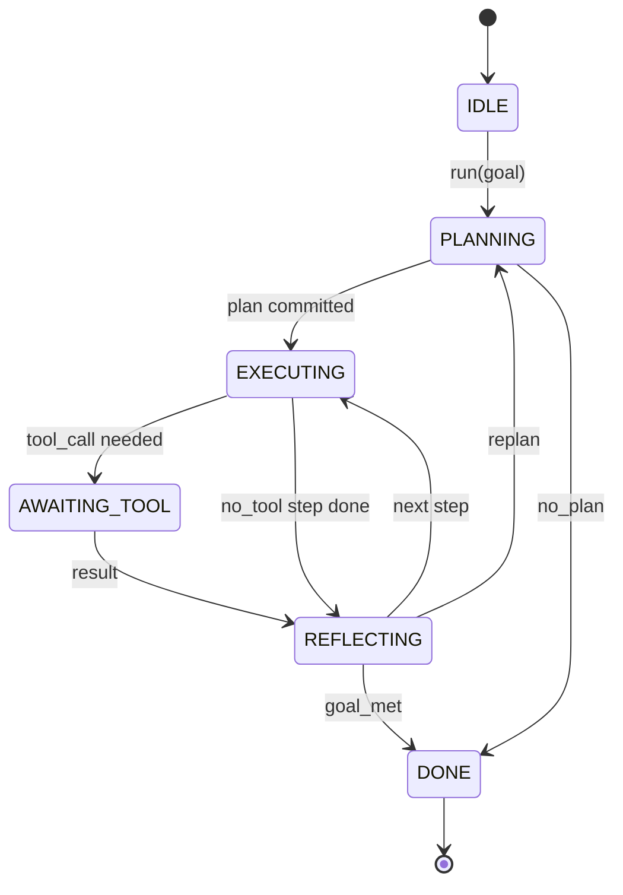

# Agent Çerçeve Döngü Sözleşmesi

> Çerçeve (harness) aslında ajanın kendisidir. Model bir yardımcı işlemcidir. Bu ders, herhangi bir modeli bağlayabileceğiniz döngü sözleşmesini sabitler.

**Tür:** Uygulama
**Diller:** Python
**Ön Koşullar:** Faz 13 ders 01-07, Faz 14 ders 01
**Süre:** ~90 dakika

## Öğrenme Hedefleri

- Ajan çerçeve (agent harness) döngüsünü, açık geçişli deterministik bir durum makinesi olarak belirlemek.
- Operatörün politika, telemetri ve koruma katmanlarını bağlayabileceği on yaşam döngüsü kanca (hook) konusunu uygulamak.
- Döngünün kontrolü çağırana bıraktığı ve taze girdiyle devam ettiği iki çekme noktasını (pull point) tanımlamak.
- Oturum başına bütçeleri (tur, araç çağrısı, duvar saati) aşıldığında kısmi durum sızdırmadan uygulamak.
- Aşağı akış UI ve izleyicilerinin döngüyü doğrudan incelemeden abone olabileceği on bir olay tipinden oluşan tipli bir akış yaymak.

## Çerçeve

Kırk tur boyunca gözetimsiz çalışan bir kodlama ajanı (coding agent) bir sohbet döngüsü değildir. Düğümlerine operatörün müdahale edebildiği, kenarlarını operatörün denetleyebildiği bir durum makinesidir. Sözleşmeyi bir kere yazdığınızda, modeli, aracı ya da politikayı değiştirmek artık bir yeniden yapılandırma değil, bir kayıt çağrısı olur.

Bu ders o sözleşmeyi inşa eder. Altı durum, on kanca konusu, iki çekme noktası, on bir olay tipi ve bir bütçe zarfı adlandırırız. Çerçevedeki her şey (araç kaydı, JSON-RPC taşıma katmanı, dağıtıcı, planlayıcı) bu biçime takılır.

## Durumlar

Döngünün altı durumu vardır. Beşi etkindir. Biri terminal durumdur.



#### Açıklama
Bu durum diyagramı ajan döngüsünün olası durumlarını ve aralarındaki geçişleri gösterir. `IDLE` tek yasal giriş noktası, `DONE` tek yasal çıkıştır. `AWAITING_TOOL` ise bir çekme noktası (pull point) üreten tek durumdur.

`IDLE` tek yasal giriş noktasıdır. `DONE` tek yasal çıkıştır. `AWAITING_TOOL` bir çekme noktası üreten tek durumdur. Diğer tüm geçişler dahilidir.

Durum makinesi deterministiktir. Aynı olay günlüğü verildiğinde, çerçeve aynı duruma yeniden girer. Bu özellik, oturumları modeli yeniden çağırmadan hata ayıklama amacıyla yeniden oynatmanıza izin veren şeydir.

## Kanca Konuları

Kancalar (hooks), operatörün döngüye açılan dikiş noktasıdır. Çerçeve on konu tetikler. Her konu herhangi bir sayıda abone kabul eder. Aboneler kayıt sırasına göre çalışır. Bir abone yükü değiştirebilir, turu iptal etmek için istisna fırlatabilir ya da sonraki adımı atlamak için bir sentinel (sentinel) döndürebilir.

```text
before_plan         after_plan
before_tool_call    after_tool_call
before_step         after_step
on_error
on_pause
on_budget_exceeded
on_complete
```

#### Açıklama
Bu liste, çerçevenin tetiklediği on kanca konusunu gösterir. Her konu belirli bir olay anında çağrılır ve operatörün politika, telemetri ve koruma katmanlarını bağlamasına izin verir.

Bu biçim, Claude Code, Cursor ve OpenCode'un 2025 ortası itibarıyla yakınsadığı şekli yansıtır. Adlar işlevseldir, markalı değildir. `rm -rf` komutunu engelleyen bir kanca `before_tool_call` içinde yaşar. OpenTelemetry span gönderen bir kanca `after_step` içinde yaşar. Duraklatılmış bir oturumu sürdüren kanca `on_pause` içinde yaşar.

## Çekme Noktaları

Döngü iki kez kontrolü bırakır. Birincisi `AWAITING_TOOL` üzerindeyken, araç sonucu olmadan ilerleyemediğinde. İkincisi `on_pause` üzerindeyken, bütçe tükendiğinde ya da bir kanca açıkça insan incelemesi istediğinde.

Çekme noktası bir istisna değildir. Bir dönüştür. Çağıran, çerçeve durumunu inceler, çerçevenin istediği şeyi alır ve `resume(payload)` çağırır. Çerçeve durduğu yerden devam eder. Bu yapı, bir Python üreteci (generator) ile aynı biçimdedir. Çekme noktası üzerinden taşıma katmanı sizin seçiminizdir. TUI'da tuş basışıdır. MCP üzerinden `tools/call`'dur. Bir kuyrukta iş yoklamasıdır.

## Olay Akışı

Döngü, sözleşmedeki belirli noktalarda olayları tipli bir akışa ekler. Akış yalnızca eklenebilir (append-only) biçimdedir ve aboneler herhangi bir konumdan yeniden oynatabilir. Uygulanan on bir olay tipi:

- `session.start` — `run(goal)` çağrıldığında bir kez yayılır
- `plan.draft` — planlayıcı taslak planı döndürdüğünde yayılır
- `plan.commit` — taslak etkin plan olarak işlendikten sonra yayılır
- `step.start` — her yürütme adımının başında yayılır
- `step.end` — her yürütme adımının sonunda yayılır
- `tool.call` — araç gerektiren bir adım kontrolü çağırana bıraktığında yayılır
- `tool.result` — araç sonucuyla resume edildiğinde yayılır
- `tool.error` — resume sırasında hata olduğunda ya da bir kanca çağrıyı iptal ettiğinde yayılır
- `budget.warn` — bir bütçe limitine ulaşıldığında yayılır
- `session.pause` — döngü bir duraklamada (bütçe ya da kanca) kontrolü bıraktığında yayılır
- `session.complete` — döngü `DONE`'a ulaştığında bir kez yayılır

Olaylar kanca yüklerini çiftlemez. Kancalar imperatiftir (değiştirir, iptal eder). Olaylar gözlemseldir (kaydeder, gönderir). Bunları dik (orthogonal) kabul edin.

## Bütçe Zarfı

Bir oturum üç limit taşır. Tur sayısı, araç çağrısı sayısı, duvar saati saniyesi. Her tur tur sayısını bir artırır. Her araç çağrısı araç çağrısı sayısını bir artırır. Duvar saati her durum geçişinde kontrol edilir. Herhangi bir limite ulaşıldığında, döngü `on_budget_exceeded` tetikler, `budget.warn` yayımlar, sonraki çekme noktasında bütçe-aşıldı nedeniyle `IDLE` durumuna geçer.

Bütçe bir kapatma düğmesi değildir. Bir bırakmadır. Çağıran, bütçeyi uzatarak devam etmeyi ya da oturumu kapatmayı seçer.

## Bu Dersin Yapmadıkları

Model çağırmaz. Gerçek araç kaydetmez. Bir taşıma katmanı uygulamaz. Bunlar sonraki dört derstir. Bu ders, sözleşmeyi sonraki dört dersin yeniden yazmadan takılabileceği şekilde sabitler.

`main.py` içindeki deterministik planlayıcı bir yer tutucudur. Üç adımlık, ikisi araç sonucu gerektiren sabit kodlanmış bir plan döndürür. Asıl mesele döngüdür, plan değil.

## Kodu Nasıl Okumalı

`HarnessLoop` ana sınıftır. Durumu tutar, kancaları tetikler, olayları yayar. `Budget` limitleri izler. `Event` akış üzerindeki tipli zarftır. `HookRegistry` dağıtım tablosudur. `_transition` durumu değiştiren tek fonksiyondur, dolayısıyla durum makinesi değişmezleri tek bir yerde yaşar.

`main.py` dosyasını baştan sona okuyun. Sonra `code/tests/test_loop.py` dosyasını okuyun. Testler her geçişi ve her kanca tetikleme sırasını sabitler.

## Daha İleriye

Üretimde bir çerçeve inşa etmenin en zor kısmı durum makinesi değildir. Sözleşmeyi uygulanabilir kılmaktır. Sözleşme planlayıcının sıcak yeniden yüklemesinden sağ çıkmalıdır. Bozuk JSON döndüren bir araçtan sağ çıkmalıdır. Kırk turluk bir oturumun üçte ikisinde `before_tool_call` içinde istisna fırlatan bir kancadan sağ çıkmalıdır. Bu dersteki testler bu hata modlarını çalıştırır. Çalıştırın. Kırın. Durum ekleyin.

Sonraki ders araç kaydını ekler. Ondan sonra JSON-RPC taşıma katmanı. Ondan sonra dağıtıcı. Yirmi dördüncü derse kadar, bu dosyadaki döngü gerçek bütçeler uygulanmış gerçek araçlara karşı gerçek bir plan çalıştırıyor olacak.
