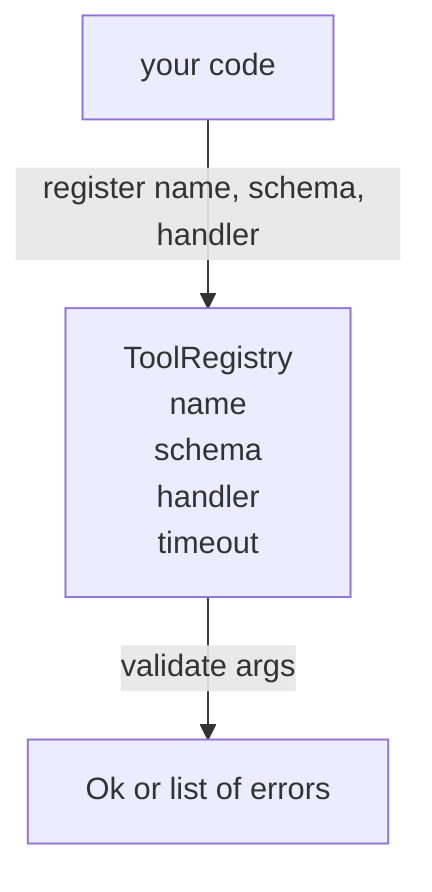

# Şema Doğrulamalı Araç Kaydı

> Ajanın doğrulayamadığı bir araç, ajanın çağıramayacağı bir araçtır. Araçları inşa etmeden önce kayıt (registry) ve şema denetçisini inşa edin.

**Tür:** Uygulama
**Diller:** Python
**Ön Koşullar:** Faz 13 ders 01-07, Faz 14 ders 01
**Süre:** ~90 dakika

## Öğrenme Hedefleri

- Dağıtıcının (dispatcher) bir kere sorup sonra güvenebileceği, araç adı → şema → işleyici (handler) eşlemesinin tipli kaydını tutmak.
- Araç çağrılarının gerçekten kullandığı anahtar kelimelerin yüzde doksanını kapsayan JSON Schema 2020-12 alt kümesini uygulamak.
- Modelin tek bir turda kendini düzeltebilmesi için kesin, json-pointer biçimli hata yolları döndürmek.
- Açık override olmadan yeniden kaydı reddetmek; çünkü sessiz üzerine yazmalar, üretim araç kataloglarının nasıl saptığının cevabıdır.
- Doğrulayıcıyı saf (I/O yok, zaman yok, genel değişken yok) tutmak, böylece yeniden oynatma günlüğü üzerinde yeniden çalıştırılabilsin.

## Neden Kayıt Araçtan Önce Gelir

2026'da bir kodlama ajanının, modelin tek bir bağlam penceresine sığdıramayacağı kadar çok kayıtlı aracı vardır. Önemsiz bir çerçeve iki yüz aracı kaydeder ve belirli bir turda on ila kırkını yüzeye çıkarır. Kayıt, "hangi araçlar var", "argümanları hangi biçimde alır" ve "hangi işleyiciyi çağırırım" sorularının tek doğru kaynağıdır. Bu üç yanıt sabitlendiğinde, çerçevenin geri kalanı tahmin etmeyi bırakabilir.

Kaçındığımız hata, şema olmadan işleyici göndermek ya da şema olmadan doğrulama yapmaktır. Her ikisi de yaygındır. Her ikisi de bir sonraki katmanı (yirmi üçüncü dersteki dağıtıcı) tek hata modu işleyicinin yığın izi (stack trace) olan bir tahmin oyununa dönüştürür.

## Bir Araç Kaydı Nasıl Görünür

```text
ToolRecord
  name        : str          (benzersiz, küçük harfli alfasayısal ve alt çizgi segmentleri, noktayla ayrılmış, örn. snake_case.segment.case)
  description : str          (tek satır, modele gösterilir)
  schema      : dict         (JSON Schema 2020-12 alt kümesi)
  handler     : Callable     (async veya sync, Any döndürür)
  idempotent  : bool         (dağıtıcı bunu yeniden deneme kararları için kullanır)
  timeout_ms  : int          (araç başına dağıtıcı varsayılanını geçersiz kılar)
```

#### Açıklama
Bu kayıt yapısı, aracın adını, şemasını, işleyicisini ve çeşitli meta verilerini tutar. Doğrulayıcı yalnızca şema alanıyla ilgilenir; işleyici onun için opaktır. Bu kasıtlı bir ayrımdır: şema veridir, işleyici koddur. Bunları karıştırmak, doğrulama mantığını işleyici içine koyma tuzağına çeker; bu da engellediğimiz hatadır.

Şema, doğrulayıcının dokunduğu tek alandır. İşleyici onun için opaktır. Bunları kasıtlı olarak ayırırız. Şema veridir. İşleyici koddur. Bunları karıştırmak, doğrulama mantığını işleyici içine koyma tuzağına çeker; bu da engellediğimiz hatadır.

## JSON Schema 2020-12 Alt Kümesi

Tam 2020-12 belirtimi bir makale niteliğindedir. Bize sekiz anahtar kelime gerekir.

```text
type           string / number / integer / boolean / object / array / null
properties     özellik adı -> şema eşlemesi
required       özellik adları listesi
enum           izin verilen ilkel değerler listesi
minLength      tamsayı, stringler için geçerli
maxLength      tamsayı, stringler için geçerli
pattern        ECMA-262 uyumlu regex, stringler için geçerli
items          her dizi öğesine uygulanan şema
```

#### Açıklama
Bu liste JSON Schema 2020-12'nin uyguladığımız alt kümesini oluşturur. Bir araç API'sının gerçekte ihtiyaç duyduğu her şeyi kapsar. Eklemeyeceğimiz anahtar kelimeler (oneOf, anyOf, allOf, $ref, koşullular) üretim şemalarında geçerlidir ama doğrulayıcıyı döngülü bir ağaç gezginine dönüştürür. Bir kayıt inşa ediyoruz, bir JSON Schema motoru değil.

Bu, bir araç API'sının gerçekten ihtiyaç duyduğu her şeyi kapsar. Eklemeyeceğimiz anahtar kelimeler (oneOf, anyOf, allOf, $ref, koşullular) üretim şemalarında geçerlidir ama doğrulayıcıyı döngülü bir ağaç gezginine dönüştürür. Bir kayıt inşa ediyoruz, bir JSON Schema motoru değil.

## Json Pointer Hata Yolları

Doğrulama başarısız olduğunda, doğrulayıcı bir hata listesi döndürür. Her hata girdi üzerinde bir json-pointer yolu taşır. İşaretçi, eğik çizgiyle öne çıkan özellik adları ve dizi indislerinin dizisidir.

```text
{"a": {"b": [1, 2, "x"]}}
                    ^
                    /a/b/2
```

#### Açıklama
Bu örnek json-pointer hata yolunun nasıl çalıştığını gösterir: bir dizideki belirli bir elemana `/a/b/2` yoluyla başvurulur. Model bu yolları cümlelerden daha iyi okur.

Model hata yollarını cümlelerden daha iyi okur. Bir şema `args.user.email` gerektiriyorsa ve model tamsayı geçtiyse, hata `/user/email` olmalı ve `expected_type: string` içermelidir. Model bunu doğal dil turu olmadan sonraki çağrıda düzeltir.

## Kayıt ve Geçersiz Kılma

`register(name, schema, handler, **opts)` varsayılan olarak yeniden kaydı reddeder. Değiştirmek için çağıranın `override=True` geçmesi gerekir. Bu operasyonel hijyendir. Kod tabanının iki parçasının sessizce aynı araç adını kaydetmesi, üretimde bulunması bir hafta süren türden bir hatadır.

Kayıt üç okuma yöntemi sunar. `get(name)` kaydı döndürür ya da istisna fırlatır. `validate(name, args)` bir `Ok` ya da hata listesi döndürür. `names()` araç adlarını kayıt sırasıyla döndürür.

## Doğrulayıcının Ne Olduğu ve Olmadığı

Şema ağacı üzerinde tek geçişlidir, özyinelemelidir. Safdır. İşleyicileri çağırmaz. Tür zorlaması yapmaz (string `"42"` sayı şemasını geçmez). Sessizce kesmez.

Bir güvenlik sınırı değildir. Kötü niyetli bir işleyici doğrulama geçtikten sonra yine kötü davranabilir. Yirmi üçüncü dersteki dağıtıcı zaman aşımı ve sandbox katmanları ekler. Kayıt biçimi ekler.

## Biçim



#### Açıklama
Bu diyagram, kodun araç kaydıyla nasıl etkileştiğini gösterir. Kod bir aracı kaydeder, kayıt doğrulama yapar ve sonuç olarak ya `Ok` ya da hata listesi döndürür.

## Kodu Nasıl Okumalı

`code/main.py` içinde `ToolRegistry`, `ToolRecord`, `ValidationError` ve sekiz doğrulayıcı fonksiyon tanımlanır. Doğrulayıcı `schema["type"]` üzerinden dağıtım yapar (ya da `enum` içeren bir şemayı tiplenmemiş enum denetimi olarak değerlendirir). Her tür doğrulayıcısı ya boş bir liste ya da bir `ValidationError` listesi döndürür. Üst düzey gezgin hataları birleştirir ve derinleştikçe yol segmentlerini öne ekler.

`code/tests/test_registry.py` kayıt, geçersiz kılma, doğrulama başarısı, yollarla birlikte doğrulama başarısızlığı ve alt kümedeki her anahtar kelimeyi kapsar.

## Daha İleriye

Bu ders yerleştikten sonra isteyeceğiniz iki uzantı, yerel tanımlar bloğuna karşı `$ref` çözümlemesi ve katı biçim için `additionalProperties: false`'dur. İkisi de küçüktür. İkisi de araç kataloğu elliyi geçtikçe eklenmek için yaygındır. Dersi tek bir okumada tutmak için dışarıda bıraktık.

Sonraki ders (yirmi ikinci), bu kaydı bir model istemcisine (model client) sunan JSON-RPC stdio taşıma katmanını inşa eder. Ondan sonraki ders (yirmi üçüncü), ikisini zaman aşımları ve yeniden denemelerle bir dağıtıcının arkasına sarar.
