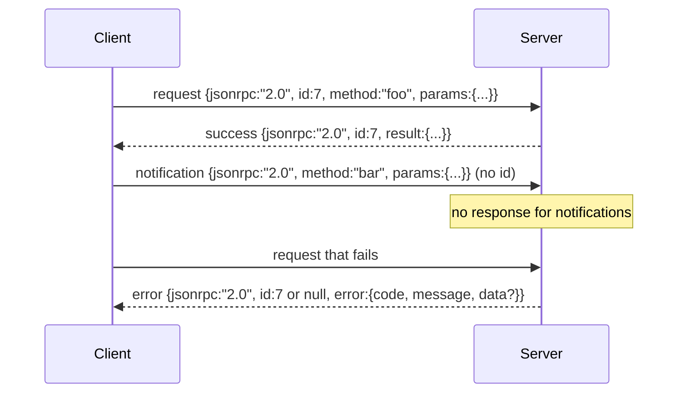

# Yeni Satırla Ayrılmış Stdio Üzerinden JSON-RPC 2.0

> Bir model istemcisi ile araç sunucusu arasındaki taşıma katmanı stdio üzerinden JSON-RPC'tir. Bir kere elle yazmak, her çerçeveleme katmanının ne için ödediğini öğretir.

**Tür:** Uygulama
**Diller:** Python
**Ön Koşullar:** Faz 13 ders 01-07, Faz 14 ders 01
**Süre:** ~90 dakika

## Öğrenme Hedefleri

- JSON-RPC 2.0'ı stdin ve stdout üzerinden yeni satırla ayrılmış JSON olarak konuşmak.
- Beş standart hata kodunu (-32700, -32600, -32601, -32602, -32603) eşlemek ve doğru anlamlarla sunmak.
- Yeni zarf anahtarı icat etmeden istek, yanıt, bildirim ve toplu işleri (batches) ayırt etmek.
- Akışın geri kalanını zehirlemeden her satır için bir ayrıştırma hatasını ele almak.
- Dersin alt süreç başlatmadan çalışması için `io. BytesIO` kullanarak kendi kendini sonlandıran bir demo inşa etmek.

## JSON-RPC Neden Lingua Franca Olarak Kalır

2026'da bir kodlama ajanı tek bir oturumda belki on iki araç sunucusuyla konuşur. Her sunucu ayrı bir süreç ya da uzak uç noktadır. Tel biçimi 2013'ten beri aynıdır. JSON-RPC 2.0 iki sayfalık bir belirtimdir. Alternatifler (gRPC, çağrı başına HTTP, özel ikili) JSON-RPC'nin yapmadığı bir ödünleşim dayatır: ya akış ya toplu iş ya da taşıma katmanı bağlılığı seçerler. JSON-RPC, stdio, soketler, websocket'ler ve HTTP boyunca simetriktir ve iki taraf da belirtimi onurlandırırsa istemci hiç görmediği bir sunucuyu yönetebilir.

Bu ders stdio varyantını inşa eder. Yeni satırla ayrılmış JSON. Her istek bir satır. Her yanıt bir satır. Taşıma katmanı sınırı `
`'dir.

## Tel Biçimi

Dört zarf biçimi vardır. İkisi istemci tarafından, ikisi sunucu tarafından söylenir.



#### Açıklama
Bu sıra diyagramı JSON-RPC tel biçimindeki dört zarf tipini gösterir: istek, başarı yanıtı, bildirim ve hata yanıtı. Bildirimin `id` içermediğine ve sunucunun buna yanıt vermediğine dikkat edin.

Bir bildirimin `id`'si yoktur. Sunucu buna yanıt vermemelidir. Bir sunucu bir bildirime yanıt döndürürse, istemci bunu bir çağrı noktasına eklemenin yoluna sahip değildir. Bu tek kural çerçeveleme matematiğini basit tutar.

Bir toplu iş, istek veya bildirim JSON dizisidir. Sunucu, her bildirim dışı girdi için bir tane olmak üzere, herhangi bir sırada bir yanıt dizisiyle yanıt verir. Toplu işteki her girdi bir bildirimse, sunucu hiçbir şey göndermez.

## Beş Hata Kodu

```text
-32700 Parse error JSON ayrıştırılamadı
-32600 Invalid Request Zarf biçimi yanlış
-32601 Method not found
-32602 Invalid params
-32603 Internal error
```

#### Açıklama
Bu liste JSON-RPC 2.0'ın beş standart hata kodunu ve anlamlarını gösterir. -32000 ile -32099 arasındaki kodlar sunucu tanımlı hatalar için ayrılmıştır.

-32000 ile -32099 arasındaki kodlar sunucu tanımlı hatalar için ayrılmıştır. Geri kalan her şey uygulama tanımlıdır. Ders beşinde kalır. İşleyiciniz istisna fırlatırsa, taşıma katmanı onu `data.exception` içinde istisna sınıfı adıyla birlikte -32603 olarak sarmalar.

Bir ayrıştırma hatasının özel bir kuralı vardır. Yanıttaki `id` `null`'dür, çünkü istek bir id çıkarmaya yetecek kadar ayrıştırılamamıştır.

## Yeni Satır Çerçeveleme ve BytesIO Demosu

Taşıma katmanı bir seferde bir satır okur. Bir satır, `
` dahil olmak üzere byte dizisidir. Bir satır ayrıştırılamazsa, taşıma katmanı `id: null` ile bir -32700 yanıtı yazar ve devam eder. Akış zehirlenmez. Sonraki satır taze ayrıştırılır.

Ders için `io. BytesIO` çiftini stdin ve stdout olarak sararız. Sunucu EOF'a kadar istekleri okur, her biri için yanıtlar yazar ve döner. İstemci yanıtları geri okur. Süreç başlatma yok. Zaman aşımı yok. Taşıma katmanı davranışı, Python'un `io` arayüzü aynı `.readline()` ve `.write()` sözleşmesini sunduğu için gerçek bir alt süreç borusuyla aynıdır.

## Yöntem Dağıtımı

Taşıma katmanı hangi yöntemlerin var olduğunu bilmez. Çerçevenin sağladığı çağrılabilir bir `handler(method, params)`'a devreder. İşleyici bir sonuç döndürür ya da istisna fırlatır. Üç istisna sınıfı belirli kodları sunar.

```text
MethodNotFound -> -32601
InvalidParams -> -32602
Başka her şey -> data içinde istisna adıyla -32603
```

#### Açıklama
Bu eşleme, taşıma katmanının işleyici istisnalarını nasıl JSON-RPC hata kodlarına dönüştürdüğünü gösterir. Her istisna tipi belirli bir hata koduyla eşleşir.

Taşıma katmanı hiçbir zaman bir araç kaydı görmez. Kayıt, işleyicinin arkasında oturur. Bu istediğimiz katmanlama. Taşıma katmanı JSON-RPC konuşur. Kayıt araç biçimlerini konuşur. Dağıtıcı (yirmi üçüncü ders) ikisini birbirine diker.

## Hatalarda Akış Davranışı

```text
istemci yazar sunucu okur sunucu yazar
--------------- ----------- -------------
{...geçerli istek...} ayrıştırma tamam {...yanıt, id eşleşir...}
{...bozuk json...} ayrıştırma başarısız {id:null, error: -32700}
{...geçerli istek...} ayrıştırma tamam {...yanıt, id eşleşir...}
{...method eksik...} geçersiz zarf {id:X, error: -32600}
```

#### Açıklama
Bu tablo hata durumlarında akış davranışını gösterir: bir satırdaki hata sonraki satırları etkilemez, taşıma katmanı okumaya devam eder.

Bozuk bir JSON satırı döngüyü durdurmaz. Eksik `method` alanı döngüyü durdurmaz. İşleyici istisnası döngüyü durdurmaz. Taşıma katmanı EOF'a kadar okumaya devam eder.

## Bildirimler ve Asimetrik Akışlar

Bir bildirim ateşle-unut biçimindedir. Çerçeve, ilerleme olayları, iptal sinyalleri ve günlük satırları için bildirimleri kullanır. Bildirimler, uzun süren bir aracın her güncelleme için yuvarlak yolculuk yapmadan durum güncellemelerini akıtmasının yoludur.

Ders bir giden bildirim yardımcısı `write_notification` uygular. Sunucu, bir istek uçuyorken ilerleme bildirmek için onu kullanır. Demo deseni gösterir: bir istek gelir, işleyici iki ilerleme bildirimi yayar, son olarak son yanıtı yazar.

## Kodu Nasıl Okumalı

`code/main.py` içinde `StdioTransport`, ayrıştırma yardımcısı (`parse_request`), üç yazma yardımcısı (`write_response`, `write_error`, `write_notification`) ve dağıtım döngüsü `serve` tanımlanır. Hata kodu sabitleri modül kapsamında yaşar.

`code/tests/test_transport.py` beş hata kodunu, bildirimleri (yanıt yazılmaz), toplu işleri (dizi girdi, dizi çıktı, bildirimler atlanır), bozuk JSON'ı (ayrıştırma hatası sonra devam) ve işleyicinin çağrı ortasında bildirim yazdığı asimetrik akışı kapsar.

## Daha İleriye

Bu taşıma katmanı sonraki dersler için yeterlidir. Üretim taşıma katmanları üç şey ekler. Yönlendirmeyi atlatan bir korelasyon id alanı (`id`'niz zaten bu, ama bir ağda bir dış izleme kimliğine de ihtiyacınız var). Bir iptal kanalı (uçan çağrının id'siyle `$/cancelRequest` gibi bir bildirim). Ve aynı soketin hem JSON-RPC hem de Streamable HTTP konuşabilmesi için içerik türü müzakere el sıkışması. Hiçbiri tel biçimini değiştirmez. Meta veri eklerler.
