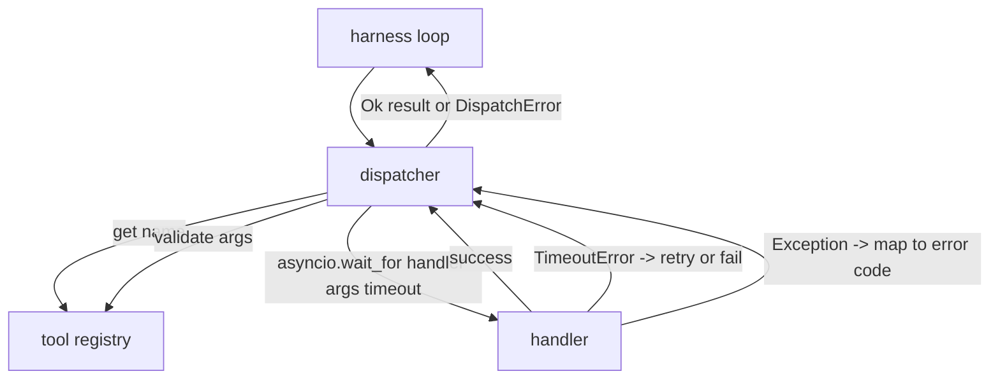
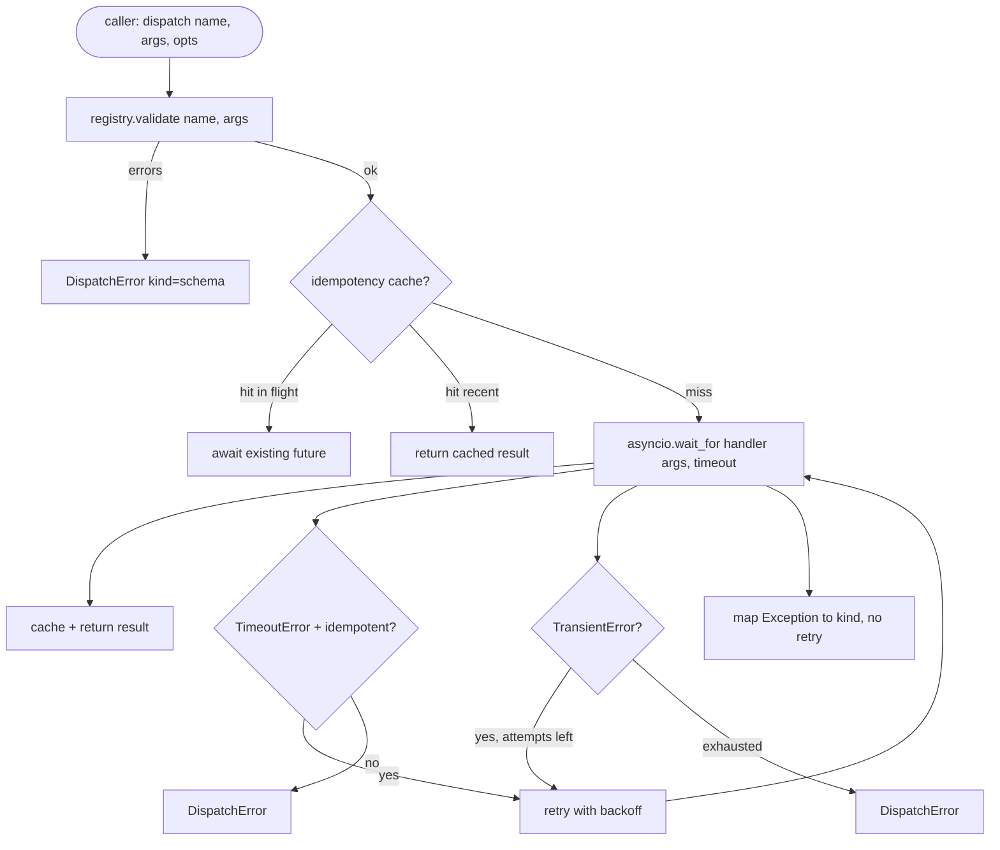

# Fonksiyon Çağrısı Dağıtıcısı

> Dağıtıcı, çerçevenin şemanın verdiği her sözün bedelini ödediği yerdir. Zaman aşımları, yeniden denemeler, çift çağrı eleme, hata eşlemesi. Hepsi tek bir dikiş noktasında.

**Tür:** Uygulama
**Diller:** Python
**Ön Koşullar:** Faz 13 ders 01-07, Faz 14 ders 01
**Süre:** ~90 dakika

## Öğrenme Hedefleri

- Bir araç işleyicisini, döngüyü askıda bırakmak yerine tipli bir hata döndüren çağrı başına zaman aşımına sarmak.
- Sarsıntı (jitter) ve maksimum deneme sayısı ile üstel geri çekilme (exponential backoff) yeniden denemesi uygulamak.
- Yavaş bir orijinalle yarışan bir yeniden denemenin iki kez çalışmaması için bir idempotency anahtarı (idempotency key) üzerinde yeniden denemeleri çift çağrıdan arındırmak.
- İşleyici istisnalarını ve taşıma hatalarını çerçeve döngüsünün zaten anladığı tek bir hata zarfına eşlemek.
- Kırk araç çağrısı birikmesinin olay döngüsünü tüketmemesi için paralel dağıtımı bir eşzamanlılık limitiyle sınırlamak.

## Dağıtıcının Bulunduğu Yer

Çerçeve döngüsü (yirmi ders) ile araç kaydı (yirmi bir ders) arasında. Taşıma katmanı (yirmi iki ders) döngüyü besler. Döngü bir araç çağrısını dağıtıcıya verir. Dağıtıcı kaydı çağırır, işleyiciyi çalıştırır ve ya bir sonuç ya da JSON-RPC biçimli bir hata zarfı döndürür.



#### Açıklama
Bu diyagram dağıtıcının çerçeve döngüsü, kayıt ve işleyici arasındaki konumunu gösterir. Dağıtıcı, kayıt doğrulaması yapar, zaman aşımı uygular ve hataları standart bir zarf biçimine dönüştürür.

Dağıtıcı, zamanlayıcılar, yeniden denemeler ve idempotency hakkında bilgi sahibi olan tek katmandır. Döngü bilmez. Kayıt bilmez. İşleyici bilmez. Bu yalıtım meselenin ta kendisidir.

## Zaman Aşımları

Her aracın varsayılan bir zaman aşımı vardır. Kayıt kaydı `timeout_ms` taşır. Çerçeve bir tane geçtiğinde dağıtıcı onu çağrı başına geçersiz kılmayla değiştirir. `asyncio.wait_for` kullanırız. Zaman aşımında, işleyici görevi iptal edilir ve dağıtıcı `DispatchError(kind="timeout")` döndürür.

Zaman aşımı, idempotent olmayan araçlar için varsayılan olarak yeniden denenebilir bir hata değildir. Zaman aşımına uğrayan bir `db.write` işlemi gerçekleşmiş ya da gerçekleşmemiş olabilir. Yeniden deneme yazmayı çiftler. Dağıtıcı, kayıt kaydındaki `idempotent` bayrağını onurlandırır. Idempotent araçlar yeniden dener. Idempotent olmayan araçlar denemez.

## Üstel Geri Çekilmeyle Yeniden Denemeler

Yeniden deneme politikası en fazla üç denemedir. Geri çekilme, sarsıntı ile üsteldir.

```text
deneme 1  -> gecikme 0
deneme 2  -> gecikme 0.1s * (1 + random[0..0.5])
deneme 3  -> gecikme 0.4s * (1 + random[0..0.5])
```

#### Açıklama
Bu formül yeniden denemeler arasındaki üstel geri çekilmeyi tanımlar. Sarsıntı (jitter) eki, çok sayıda istemci aynı anda yeniden denediğinde eşzamanlılık çakışmalarını önler.

Yalnızca `timeout` ve `transient` hataları yeniden denenir. `schema` hatası, `not_found` ya da `internal` hatası yeniden denemez. Şema hataları deterministiktir. Yeniden deneme sonucu değiştirmez ve bütçeyi yakar.

Yeniden deneme döngüsü çerçevenin bütçesine saygı gösterir. Çağıranın bütçesinde sıfır araç çağrısı kaldıysa, dağıtıcı ilk denemede hızlıca başarısız olur ve `kind="budget_exceeded"` döndürür.

## Idempotency Anahtarı ile Çift Çağrı Eleme

Orijinal hâlâ uçuyorken tetiklenen bir yeniden deneme, gerçek bir üretim hatasıdır. İlk çağrı dört virgül dokuz saniyede (zaman aşımının hemen altında) takılır. Yeniden deneme beş saniyede tetiklenir. Artık iki istek aynı arka uca karşı yarışır. Araç `payments.charge` ise, iki kez ücret alırsınız.

Dağıtıcı isteğe bağlı bir `idempotency_key` kabul eder. Aynı anahtar, bir çağrı geldiğinde uçuyorsa, dağıtıcı uçan future'ı bekler ve sonucunu döndürür. Önbellek, geç yeniden denemeleri emmeleri için tamamlandıktan sonra altmış saniye anahtarları tutar.

Anahtar, çağıranın sorumluluğundadır. Çerçeve onu planlayıcıdan türetir: `f"{step_id}:{tool_name}:{hash(args)}"`. Dağıtıcı anahtar icat etmez, çünkü anahtarı salt argümanlardan türetmek iki anlamsal olarak farklı çağrıyı aynı gösterir.

## Hata Zarfı

Başarısız bir dağıtım tek bir biçim döndürür.

```text
DispatchError
  kind        : "timeout" | "transient" | "schema" | "not_found" | "internal" | "budget_exceeded"
  message     : str
  attempts    : int
  jsonrpc_code: int   (-32601, -32602, -32603 biri)
```

#### Açıklama
Bu hata zarfı, dağıtıcının döndürdüğü standart hata biçimini tanımlar. Hata tipi, mesaj, deneme sayısı ve JSON-RPC kodu taşınır. Çerçeve döngüsü `kind` alanını sonraki duruma eşler. `schema` ve `not_found` `on_error`'a gider ve yeniden planlamayı tetikler. `timeout` ve `transient` `on_error`'a gider ve deneme sayısına bağlı olarak yeniden planlayabilir ya da planlamayabilir. `budget_exceeded` `on_budget_exceeded`'ı tetikler.

## Fan-out Üzerinde Eşzamanlılık Limiti

`gather(*calls)` tüm coroutine'leri eşzamanlı çalıştırır. Kırk araç çağrısıyla, bu kırk açık soket ya da kırk alt süreç borusudur. Çoğu arka uç, tek bir istemciden kırk paralel bağlantıyı sevmez.

Dağıtıcı `gather`'ı bir semafor içine sarar. Varsayılan eşzamanlılık limiti sekizdir. Her çağrı, dağıtmadan önce semaforu edinir ve tamamlandığında serbest bırakır. Çağıran `gather` biçimli çıktı görür ama gerçek zamanlama sınırlıdır.

## Bir Çağrı İçin Akış



#### Açıklama
Bu akış diyagramı tek bir araç çağrısının dağıtıcı içinden geçtiği tüm yolları gösterir. Doğrulama, idempotency önbelleği denetimi, zaman aşımlı deneme ve yeniden deneme kararları dahil her karar noktası açıkça gösterilir.

## Kodu Nasıl Okumalı

`code/main.py` içinde `Dispatcher`, `DispatchError` ve `TransientError` tanımlanır. Dağıtıcı yapım sırasında bir kayıt alır. Async `dispatch(name, args, ...)` tek giriş noktasıdır. Deneme başına zaman aşımları `_run_with_retries` içinde `asyncio.wait_for` kullanılarak satır içinde uygulanır. `gather_bounded(calls)` birçok dağıtımı eşzamanlılık limitiyle çalıştırır.

`code/tests/test_dispatcher.py` zaman aşımı tetiklenmesini, transient üzerinde yeniden denemeyi, şema hatasında yeniden deneme olmamasını, idempotency çift çağrı elemeyi (aynı anahtarla iki eşzamanlı çağrı tek bir işleyici çağrısına daralır) ve eşzamanlılık sınırlamasını (devrede olan semafor) kapsar.

Testler `asyncio.sleep(0)` ve deterministik `Counter` tabanlı işleyiciler kullanır, böylece milisaniyeler içinde biter ve duvar saati zamanlamasına bağlı olmaz.

## Daha İleriye

Üretim dağıtıcılarının eklediği iki uzantı. Birincisi, her geçişte yapılandırılmış günlükleme (çerçevenin olay akışı zaten bunu verir, ama dağıtıcı ayrıca `dispatch.attempt` ve `dispatch.retry` olayları da yaymalıdır). İkincisi, devre kesiciler: bir pencerede N başarısızlıktan sonra, bir araç bir soğuma süresi alır ve dağıtımlar işleyiciyi denemeden hemen `kind="circuit_open"` ile döner. İkisi de sözleşmeyi değiştirmeden bu dağıtıcının üzerine oturur.

Yirmi dördüncü ders, dağıtıcıyı dört parçayı birden hareket halinde göreceğiniz bir planla-ve-yürüt ajanına yapıştırır.
