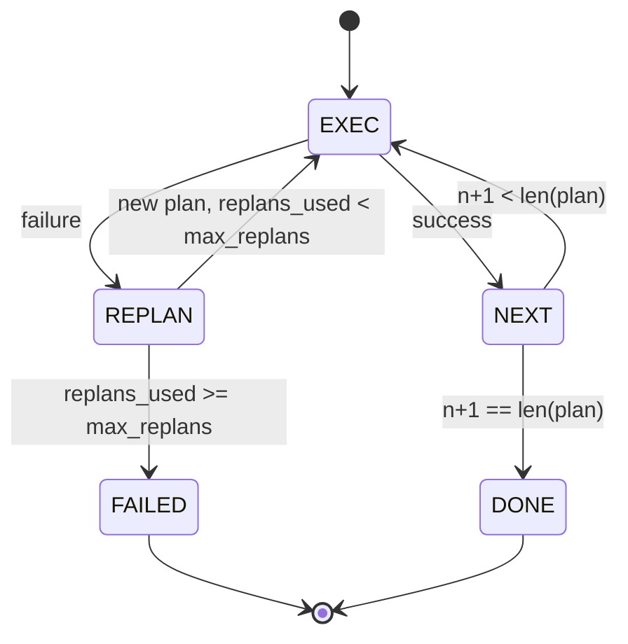

# Planla ve Yürüt Kontrol Akışı

> Başarısızlıktan sağ çıkamayan bir plan bir betiktir. Yeniden planlayabilen bir betik bir ajandır. Önce yeniden planlayıcıyı inşa edin.

**Tür:** Uygulama
**Diller:** Python
**Ön Koşullar:** Faz 13 ders 01-07, Faz 14 ders 01
**Süre:** ~90 dakika

## Öğrenme Hedefleri

- Bir planı, yürütücünün ilerleme ve sonuç üzerinde akıl yürütebileceği, tipli adımların sıralı listesi olarak temsil etmek.
- Adımları sırayla yürütmek ve kontrollü bir başarısızlık devrini planlayıcıya geri vermek.
- Önceki hatayı bağlamda tutarak mevcut imleçten (cursor) yeniden planlamak, böylece bir sonraki plan bilgilendirilmiş olur.
- Her revizyonda bir plan farkı (diff) yaymak, böylece aşağı akış bir izleyici ya da UI planın neden değiştiğini gösterebilir.
- İki bütçeyi uygulamak: sert bir adım tavanı ve sert bir yeniden planlama tavanı.

## Düşünce Zinciri Değil, Planla ve Yürüt

Bir düşünce zinciri (chain-of-thought) ajanı token yayınlar ve döngünün araç çağrısının nerede bittiğini tahmin etmesine izin verir. Bir planla-ve-yürüt ajanı önce yapılandırılmış bir plan yayınlar, sonra her adımı deterministik olarak yürütür. Plan, çerçevenin içini görüntüleyebileceği (introspect) veridir. Yürütme, çerçevenin bu veriyi bir dağıtıcı (dispatcher) üzerinden çalıştırmasıdır.

İki parça. Plan üreten bir planlayıcı. Planı çalıştıran bir yürütücü. İlginç olan iş, yürütücü bir başarısızlığa çarptığında olur. Üç seçenek:

```text
1. İptal (başarısız dön, hatayı yüzeye çıkar)
2. Atla (adımı başarısız işaretle, geri kalanıyla devam et)
3. Yeniden planla (hatayı planlayıcıya ver, imleçten yeni plan al)
```

#### Açıklama
Bu üç seçenek, yürütücünün bir adım başarısız olduğunda izleyebileceği yolları tanımlar. Yeniden planlama, bir betiği ajana dönüştüren seçenektir.

Yeniden planlama, bir betiği ajana dönüştüren şeydir.

## Adım Biçimi

```text
Step
 id : int (plan revizyonu içinde tek düze)
 tool_name : str
 args : dict
 expected_outcome: str (planlayıcının belirttiği başarı koşulu)
 result : Any | None
 error : str | None
```

#### Açıklama
Bu yapı, planlayıcının ürettiği her adımın veri biçimini tanımlar. `expected_outcome` alanı yürütücü tarafından zorlanmaz; yalnızca yeniden planlayıcı ve olay akışı için referans bilgisi taşır.

`expected_outcome` planlayıcının adım yanında yaydığı kısa bir cümledir. Yürütücü tarafından zorlanmaz. İki şey içindir: yeniden planlayıcı planı revize ederken onu okur; olay akışı onu yayar, böylece bir izleyici "bu adım X'i yapması gerekiyordu" gösterebilir.

## Planlayıcı Biçimi

```python
def planner(goal: str, history: list[Step], last_error: str | None) -> list[Step]:
 ...
```

Saf bir fonksiyon. `goal` kullanıcı hedefidir. `history` zaten yürütülen adımlardır (sonuçlar ve hatalarla doldurulur). `last_error` ilk çağrıda None, sonraki her çağrıda en son başarısızlık mesajıdır. Planlayıcı, imleçten başlayarak bir sonraki planı döndürür.

Planlayıcı yürütücüyü bilmez. Yeniden denemeleri bilmez. Zaman aşımlarını bilmez. Bir plan üretir. Hepsi bu.

## Yürütücü

Yürütücü küçük bir durum makinesidir. Her adım dağıtıcı (dispatcher) üzerinden çalışır. Sonuç üç şeyden biridir: başarı, başarısızlık-yeniden-planlanabilir, başarısızlık-ölümcül. Yeniden planlanabilir başarısızlıklar planlayıcıya geri gider. Ölümcül başarısızlıklar (bütçe aşıldı, yeniden planlama tavanı doldu) bir `FAILED` oturum sonucu döndürür.



#### Açıklama
Bu durum diyagramı yürütücünün adımlar arasında nasıl geçtiğini gösterir. Başarı durumunda bir sonraki adıma ilerler; başarısızlık durumunda yeniden planlama tetiklenir. Yeniden planlama tavanına ulaşıldığında oturum başarısız olarak sonlanır.

## Revizyonda Plan Farkları

Planlayıcı bir başarısızlıktan sonra yeni bir plan döndürdüğünde, yürütücü üç alanlı bir `plan.diff` olayı yayar.

```text
removed: eski planda olup yeni planda olmayan adım id'leri listesi
added : yeni planda olup eski planda olmayan adım id'leri listesi
revised: tool_name veya args'ı değişen adım id'leri listesi
```

#### Açıklama
Bu yapı plan farkı olayının biçimini tanımlar. Bir izleyici veya UI, kaldırılan adımları üzeri çizili, eklenenleri vurgulu gösterebilir. Amaç fark biçimi değil, revizyonun görünür bir olay olmasıdır.

Bir izleyici ya da UI bunu, kaldırılan adımların üzerini çizgili, eklenenlerin vurgulu gösterebilir. Amaç fark biçimi değil. Amaç, revizyonun sessiz bir yeniden yazma değil görünür bir olay olmasıdır.

## İki Bütçe, İkisi de Sert

`max_steps` tüm oturum boyunca toplam adım yürütmelerini sınırlar, yeniden planlamalar dahil. Varsayılan on ikidir. Her yeniden planlamada üç ekleyen, iki kez yeniden planlayan doğrusal beş adımlık bir plan on altı yürütmeye ulaşır ve bütçeyi aşar. Yürütücü yeniden planlamayı reddeder ve FAILED döndürür.

`max_replans` ilk plandan sonra planlayıcının çağrılma sayısını sınırlar. Varsayılan beştir. Bu daha önemli limittir. Aynı bozuk planı arka arkaya beş kez döndüren bir planlayıcı, adım bütçesi yakalayana kadar döngüye girer. Yeniden planlama tavanını sınırlamak başarısızlığı hızlandırır ve nedeni netleştirir.

## Bu Dersteki Deterministik Planlayıcı

Bu derste model çağırmıyoruz. Ders, `last_error`'a göre plan seçen deterministik bir planlayıcı sunar.

```text
last_error None ise -> dört adımlı plan yay
last_error X ile eşleşiyorsa -> X'in etrafından dolaşan üç adımlı plan yay
last_error Y ile eşleşiyorsa -> zarifçe vazgeçen iki adımlı plan yay
aksi halde -> [] döndür (yeniden planlanacak bir şey yok sinyali)
```

#### Açıklama
Bu mantık, deterministik planlayıcının hata mesajına göre nasıl farklı planlar ürettiğini gösterir. Yürütücünün her geçiş yolunu test etmek için yeterlidir.

Bu, yürütücünün her geçiş yolundaki davranışını test etmek için yeterlidir: başarı, bir kez yeniden planlama, iki kez yeniden planlama, yeniden planlama tükenmesi ve adım bütçesi tükenmesi.

## Sonuç Biçimi

```text
SessionResult
 status : "completed" | "failed"
 reason : str ("goal_met" | "step_budget" | "replan_budget" | "no_plan")
 history : list[Step]
 revisions : list[PlanDiff]
 events : list[Event]
```

#### Açıklama
Bu yapı oturum sonucunun veri biçimini tanımlar. Yirmi dersteki çerçeve döngüsü bu sonucu doğrudan okuyabilir. Yirmi üçüncü dersteki dağıtıcı her adımı yürütür. Yirmi birinci dersteki kayıt her adımın argümanlarını doğrular. Yirmi ikinci dersteki taşıma katmanı bu akışın tamamını bir model istemcisine (model client) JSON-RPC üzerinden sunardı.

## Kodu Nasıl Okumalı

`code/main.py` içinde `PlanExecuteAgent`, `Step`, `PlanDiff`, `SessionResult` ve deterministik planlayıcı tanımlanır. Yürütücü, bir `SessionResult` döndüren tek bir `run(goal)` yöntemidir. Plan farkı, adım id'lerini ve `(tool_name, args)` demetlerini karşılaştırarak hesaplanır.

`code/tests/test_agent.py` doğrusal başarıyı, bir kez yeniden planlayan ortada plan başarısızlığını, `failed:replan_budget` döndüren yeniden planlama tükenmesini, adım bütçesi tükenmesini ve plan farkı olay biçimini kapsar.

## Daha İleriye

Bunu gerçek bir modele bağladığınızda isteyeceğiniz iki uzantı. Birincisi, kısmi plan önbellekleme: altı adımdan ilk üçünde başarılı olan ve sonra başarısız olan bir planı yeniden çalıştırmak istemezsiniz. Yürütücü zaten geçmişi tutar; planlayıcının onu okuması yeterlidir. İkincisi, paralel dallar: mevcut yürütücü kesinlikle sıralıdır. Bağımsız bir dal yayan bir planlayıcı (`next_step` yerine `gather_step`), iki araç çağrısını dağıtıcı (dispatcher) üzerinden eşzamanlı çalıştırabilir.

İkisi de gerçek karmaşıklık ekler. İkisi de doğrusal yürütücü sabitlendikten sonra eklemek daha kolaydır. Bu dersin yaptığı budur.
