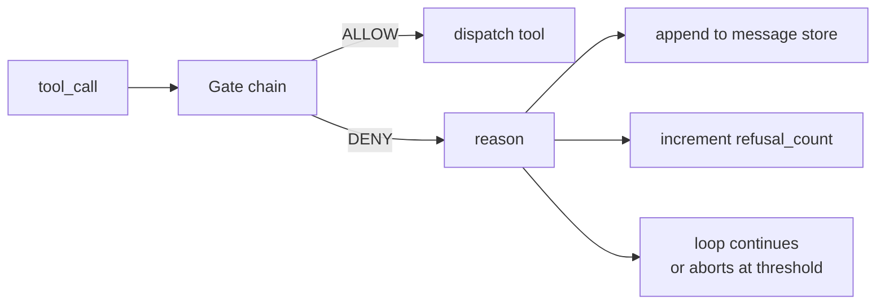
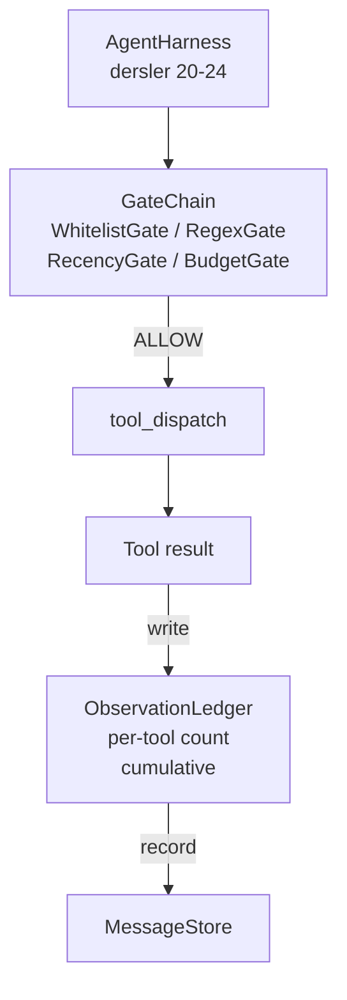

# Doğrulama Kapıları ve Gözlem Bütçesi

> Doğrulama katmanı olmayan bir ajan çerçevesi (agent harness), palto içinde bir dilektir. Bu ders, bir araç çağrısının çalışmasına izin verilip verilmediğine, çıktısının ne kadarının ajana gösterileceğine ve ajan çok fazla okuduğu için döngünün ne zaman durması gerektiğine karar veren deterministik kapı zincirini inşa eder. Zincir, küçük adlandırılmış kapıların bir fonksiyonu, artı modele gösterilen her token'ı izleyen bir gözlem defteridir.

**Tür:** Uygulama
**Diller:** Python (stdlib)
**Ön Koşullar:** Faz 19 · 20-24 (Ajan döngüsü, araç kaydı, mesaj deposu, istem oluşturucu, model yönlendiricisi), Faz 14 · 33 (talimatlar kısıt olarak), Faz 14 · 36 (kapsam sözleşmeleri), Faz 14 · 38 (doğrulama kapıları)
**Süre:** ~90 dakika

## Öğrenme Hedefleri

- Deterministik `evaluate(call)` yöntemiyle bir `VerificationGate` protokolü inşa etmek.
- Bütçe, yenilik, beyaz liste ve regex kapılarını kısa devre anlamıyla (short-circuit) bir zincire kompoze etmek.
- Her gözlemi araç ve tura göre anahtarlanan bir `ObservationLedger` üzerinden izlemek.
- Kümülatif gözlem bütçesi aşılacağı zaman bir araç çağrısını reddetmek.
- Aşağı akış gözlemlenebilirliğinin (observability) alabileceği yapılandırılmış bir `GateDecision` kaydı sunmak.

## Problem

Bir ajan çerçevesi (agent harness) modele araçları serbestçe çağırma izni verdiğinde, gerçek kullanımın ilk saatinde üç sınıf hata ortaya çıkar.

Birincisi sınırsız gözlemdir. 200K satırlık bir repo üzerinde bir grep, yarım milyon token çıktıyı sonraki tura döker. Model kilobayt başına bir eşleşme görür ve bağlamın geri kalanı boşa harcanır. Token faturası büyüktür ve ajan görevde daha kötü, daha iyi değildir.

İkincisi eskimiş yeniliktir. Uzun süren bir görev elli araç çağrısı biriktirir. Model, üçüncü turdaki ilk `read_file` çağrısını canlı durummuş gibi yeniden okur. Kırk yedinci turda yapılan düzenlemeler, istem oluşturucu en eski gözlemleri önce sıraladığı için hiç ortaya çıkmaz.

Üçüncüsü ayrıcalık sızmasıdır. Bir araştırma görevi `web_search` çağırarak başlar, sonra bir şekilde model bir araç adı uydurur ve çerçeve varsayılan olarak izin verici olduğu için `shell` çalıştırmaya başlar. Birisi izi (trace) okuyana kadar, /tmp içinde bir önemsiz dosya oturuyor ve özel bir API'ye curl çalıştırılmış.

Bir doğrulama kapısı, hayır diyen çerçeve bileşenidir. Model değildir. Yargıç değildir. `(call, history, ledger)` öğelerinin deterministik bir fonksiyonudur ve ya nedeniyle birlikte ALLOW ya da DENY döndürür. Neden günlüğe kaydedilir. Modele söylenir. Döngü devam eder ya da iptal olur.

## Kavram



#### Açıklama
Bu diyagram bir araç çağrısının kapı zincirinden geçişini gösterir. ALLOW durumunda araç dağıtılır, DENY durumunda red nedeni günlüğe kaydedilir ve red sayacı artırılır.

Bir kapı, `evaluate(call, ctx) -> GateDecision` yöntemi olan her şeydir. Zincir sıralı bir listedir. Değerlendirme ilk reddetmede kısa devre yapar. Sıra önemlidir: ucuz yapısal kapılar pahalı token sayma kapılarından önce çalışır.

Bu ders dört kapı sunar:

- `WhitelistGate`. İzin verilen araç adları açık bir kümedir. Dışındaki her şey reddedilir. Bu en ucuz kapıdır ve önce çalışır.
- `RegexGate`. Araç argümanları bir regex'e karşı eşleştirilir. İçlerinde `rm -rf` bulunan kabuk çağrılarını ya da dahili IP'lere HTTP çağrılarını reddetmek için kullanışlıdır. Çağrı yükü üzerinde saftır.
- `RecencyGate`. Model yalnızca son N turdan gelen gözlemleri görür. Daha eski gözlemler maskelenir. Kapı, sonucu zaten yaşlanmış bir gözlem penceresini uzatacak bir araç çağrısını reddeder.
- `BudgetGate`. Oturum boyunca modelin okuduğu kümülatif token'ların bir tavanı vardır. Defter tavana ulaşıldığını söylediğinde, sonraki her araç çağrısı reddedilir.

Gözlem defteri (observation ledger) defter tutma kısmıdır. Her başarılı araç çağrısı bir satır yazar: araç adı, tur, yayılan token'lar, kümülatif. Defter iki soruyu yanıtlar: model toplamda ne kadar gördü, X aracından ne kadar gördü. Bütçe kapısı birincisini okur. Alıştırma olarak yazacağınız araç başına bütçe kapısı ikincisini okur.

## Mimari



#### Açıklama
Bu mimari diyagram, ajan çerçevesinin kapı zincirine, dağıtıma, gözlem defterine ve mesaj deposuna nasıl bağlandığını gösterir.

Çerçeve zincire sorar. Zincir ya başını sallar ya da reddeder. Başını sallarsa, araç çalışır, defter ilerler ve sonuç mesaj deposuna eklenir. Reddederse, modele ret bir sistem mesajı olarak verilir ve döngü yeniden denemeye ya da iptale karar verir.

## Ne İnşa Edeceksiniz

Uygulama tek bir `main.py` artı testlerdir.

1. `Observation` ve `ToolCall` veri sınıfları (dataclass) tel biçimlerini tanımlar.
2. `ObservationLedger` `(turn, tool, tokens)` satırlarını kaydeder ve `cumulative()` ile `per_tool(name)`'i yanıtlar.
3. `GateDecision` `(allow, reason, gate_name)` taşır.
4. `VerificationGate` protokoldür. Her kapı `evaluate(call, ctx)` uygular.
5. `GateChain` sıralı bir listeyi sarar. Her kapıyı çağırır, ilk reddi döndürür ya da her kapı geçerse allow döndürür.
6. Demo küçük sentetik bir ajan döngüsü çalıştırır. Üç tur. Üçüncü tur bütçe kapısını tetikler ve döngü sıfır olmayan bir ret sayısıyla temiz bir red bildirir.

Token sayacı kasıtlı olarak aptalca bir `len(text) // 4` sezgisel yöntemidir (heuristic). Bu dersin amacı kapı tesisatıdır, tokenlayıcı (tokenizer) değil. Üretimde gerçek bir tokenlayıcı (tokenizer) yerleştirin.

## Zincir Sırasının Neden Önemli Olduğu

Reddetme, izin vermekten daha ucuzdur. `WhitelistGate` O(1) karma aramasında çalışır. `RegexGate` O(pattern * argv)'de çalışır. `RecencyGate` mesaj deposunun küçük bir dilimini okur. `BudgetGate` tüm defteri okur. Pahalı iş yapmadan önce reddedilen bir çağrının kısa devre yapabilmesi için onları artan maliyete göre sıralarsınız.

Onları patlama yarıçapına (blast radius) göre de sıralarsınız. Beyaz liste en güçlü iddiadır: bu araç sözleşmede yok. Regex kapısı sıradadır: bu argüman sözleşmede yok. Yenilik sonra gelir: çerçeve hâlâ önemsiyor ama çağrı yapısal olarak yasal. Bütçe en sondadır, çünkü tanım gereği yalnızca diğer her şey geçtiğinde tetiklenir.

## Bunun Track A'nın Geri Kalanıyla Nasıl Bileştiği

Önceki dersler size döngüyü, araç kaydını, mesaj deposunu, istem oluşturucuyu ve model yönlendiricisini verdi. Bu ders, model ile araçlar arasındaki katmanı ekler. Yirmi altıncı ders, kapı zinciri ALLOW dedikten sonra dağıtıcının araç çağrısını teslim ettiği sandbox'ı sunar. Yirmi yedinci ders, red sayılarını kalite sinyali olarak kaydeden eval çerçevesini sunar. Yirmi sekizinci ders, kapı kararlarını OpenTelemetry span'larına bağlar. Yirmi dokuzuncu ders, hepsini çalışan bir kodlama ajanına diker.

## Çalıştırma

```bash
cd phases/19-capstone-projects/25-verification-gates-observation-budget
python3 code/main.py
python3 -m pytest code/tests/ -v
```

#### Açıklama
Bu komutlar sırasıyla demoyu ve test paketini çalıştırır. Demo, her kapı kararını içeren tur tur bir iz yazdırır ve sıfır kodla çıkar. Testler, defteri, her kapıyı yalıtılmış olarak, zincir kısa devresini ve sentetik döngüyü uçtan uca kapsar.
