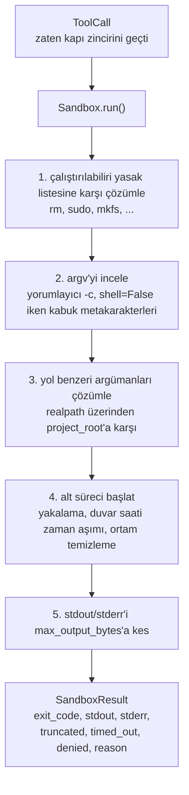
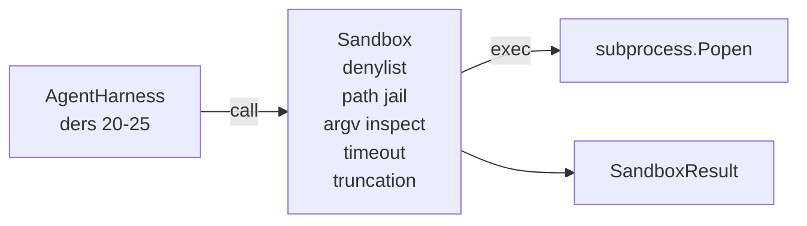

# Yasak Listeli ve Yol Kafesli Sandbox Çalıştırıcı

> Doğrulama kapısı, bir araç çağrısının çalışıp çalışmaması gerektiğine karar verir. Sandbox, çalıştığında ne olduğuna karar verir. Bu ders, tehlikeli çalıştırılabilir dosyaları reddeden, tehlikeli argv biçimlerini reddeden, her dosya yolunu bir proje köküne hapseden, aşırı büyük çıktıları kesen ve duvar saati zaman aşımında çığırından çıkmış süreçleri öldüren bir alt süreç (subprocess) çalıştırıcısı sunar. Model ile işletim sistemi arasında oturan iki katmandan ikincisidir.

**Tür:** Uygulama
**Diller:** Python (stdlib)
**Ön Koşullar:** Faz 19 · 25 (doğrulama kapıları ve gözlem bütçesi), Faz 14 · 33 (talimatlar kısıt olarak), Faz 14 · 38 (doğrulama kapıları)
**Süre:** ~90 dakika

## Öğrenme Hedefleri

- Zaman aşımı, yakalama ve kesme ile `subprocess.run` saran bir `Sandbox` sınıfı inşa etmek.
- Bir komutu ada göre yasak listesine karşı, yapıya göre ise bir argv denetçisine karşı reddetmek.
- Beyan edilen bir proje kökünün dışında çözümlenen herhangi bir yol argümanını reddetmek.
- Kabuk modu kapalıyken kabuk metakarakterlerini reddetmek.
- Aşağı akış gözlemlenebilirliği ve eval çerçevesinin alabileceği yapılandırılmış bir `SandboxResult` döndürmek.

## Problem

Kabuk çağırabilen bir kodlama ajanı tek bir turda arka kapılar kurabilir, anahtarları sızdırabilir, bir geliştirici dizüstü bilgisayarını tuğla edebilir ve bulut faturası yığabilir. En az maliyetli savunma kabuk vermemektir. İkinci en az maliyetli savunma, kesin bir desen listesine hayır diyen bir sandbox'tır.

Ajan izlerinde (traces) üç sınıf başarısızlık tekrarlar.

Birincisi tehlikeli çalıştırılabilir dosyalardır. Bir yol sorununu düzeltmek için baskı altındaki bir model `sudo`, `chmod -R 777`, `rm -rf`, `mkfs`, `dd` deneyecektir. Bunların hiçbiri bir ajan çalıştırmasında yeri yoktur. Yasak listesi (denylist) bunları ada ve diğer adlara (alias) göre yakalar.

İkincisi argv hileleridir. Kabuk yok diye söylenmiş bir model saldırıyı bir yorumlayıcı (interpreter) üzerinden geçirir: `python3 -c "import os; os.system('rm -rf /')"`, `bash -c '...'`, `node -e '...'`, `perl -e '...'`. Sandbox'ın, `-c` benzeri bir bayrakla çalıştırılan herhangi bir yorumlayıcının fazladan adımlı bir kabuk çağrısı olduğunu bilmesi gerekir.

Üçüncüsü yol kaçışıdır. Modele `./src/main.py` okuması söylenir ve bunun yerine `../../etc/passwd` okur. Sandbox, her yol argümanını `os.path.realpath` üzerinden çözümleyerek ve öneki doğrulayarak kafese alır.

Sandbox, işletim sistemi anlamında bir güvenlik sınırı değildir. Kod yürütme yetkisi olan kararlı bir saldırgan yine kırabilir. Sandbox, geliştirme zamanı bir koruma katmanıdır: yaygın başarısızlık modlarını gürültülü kılar ve ajanın salt beceriksizlikten zarar vermesini durdurur.

## Kavram



#### Açıklama
Bu diyagram sandbox'ın beş aşamalı işlem hattını gösterir: yasak listesi denetimi, argv incelemesi, yol kafesi, alt süreç başlatma ve çıktı kesme. Her aşama başarısız olursa sonraki aşamaya geçilmez.

Sandbox'ın dört reddetme ekseni vardır: ad, argv, yol, yapı. Her eksen, henüz alt süreç olmadan, çağrının saf bir fonksiyonudur. Alt süreç, yalnızca her eksen geçtikten sonra başlatılır.

`SandboxResult` çıkış kodları geleneksel olanlardır: 0 başarı, sıfır olmayan başarısızlık, artı reddedildi (-100), zaman aşımı (-101) ve kesildi (çıkış kodu gerçek olan, bir bayrak ayarlı) için üç sentinel kod. Aşağı akış dersleri bu yapılandırılmış sonucu stderr ayrıştırmak yerine okur.

## Mimari



#### Açıklama
Bu mimari diyagram, ajan çerçevesinin sandbox'a nasıl çağrı gönderdiğini ve sandbox'ın sonuç ürettiğini gösterir. Popen ile gerçek alt süreç yürütülür.

Yasak listesi, çalıştırılabilir temel adlarının bir frozenset'idir. Diğer adlar (`/bin/rm`, `/usr/bin/rm`) aynı temel ada çözümlenir. Argv denetçisi yorumlayıcı biçimini bilir: argv[0]'ı bir yorumlayıcı olan ve sonraki herhangi bir argümanı `-c` ya da `-e` ile başlayan herhangi bir argv reddedilir. Kabuk metakarakterleri (`;`, `|`, `&`, `>`, `<`, ters tırnak, `$()`) çağrı açıkça bir kabuk istemediğinde reddedilmeye neden olur.

Yol kafesi en ince parçadır. Sandbox yapım sırasında bir `project_root` kabul eder. `/` içeren ya da var olan bir dosyayla eşleşen herhangi bir argüman `os.path.realpath` üzerinden normalleştirilir, sonra proje kökünün realpath'ine karşı kontrol edilir. Çözümlenen hedef kökün altında değilse, reddedilme. Symlink kaçış denemeleri (proje kökünde dışarıya işaret eden bir symlink) literal yol yerine realpath kontrol edilerek engellenir.

## Ne İnşa Edeceksiniz

Uygulama `main.py` artı bir tests dizinidir.

1. `SandboxResult` veri sınıfı (dataclass): exit_code, stdout, stderr, truncated, timed_out, denied, reason, duration_ms.
2. `SandboxConfig` veri sınıfı (dataclass): project_root, max_output_bytes, timeout_seconds, denylist, interpreter_block.
3. `Sandbox` sınıfı: `run(argv, *, shell=False, cwd=None)` bir `SandboxResult` döndürür.
4. Dahili reddetme yardımcıları: `_check_executable_denylist`, `_check_argv_interpreter`, `_check_shell_metachars`, `_check_path_jail`.
5. Açık bir `truncated` bayrağı ve yakalanan akışta bir işaret satırı ile çıktı kesme.
6. Alttaki demo: yasal ve düşmanca çağrılar dizisi. Her biri sonucuyla birlikte gösterilir.

Sandbox varsayılan olarak `shell=False` ve `capture_output=True` ile `subprocess.run` kullanır. Duvar saati zaman aşımı `timeout` argümanını kullanır; `TimeoutExpired` üzerine, sandbox süreç grubunu öldürür ve bir SandboxResult sentezler.

## Bunun Neden Gerçek Bir Sandbox Olmadığı

Ders sandbox'ı namespace, cgroups, seccomp, gVisor, Firecracker ya da herhangi bir çekirdek düzeyinde yalıtım kullanmaz. Alt sürecin yapabileceği her şeyi sandbox da yapabilir. Koruma yapısaldır: ajana en yaygın tehlikeli çağrılar reddedilir ve gürültülü red, sessizce çalışmak yerine gözlemlenebilirliğe (observability) gider.

Üretim ajanları için üzerine katmanlar eklersiniz: ayrıcalıksız bir Docker konteynerinin içinde çalıştırın, bir microVM'in içinde çalıştırın, yetenekleri bırakın, proje kökünü salt okunur ve bir scratch dizinini okunur-yazılır bağlayın, bellek ve CPU üzerinde ulimit koyun, ortamı bilinen güvenli bir beyaz listeye temizleyin. Yirmi dokuzuncu ders bunlardan bazılarını yapar. İşletim sistemi yalıtımı bu dersin kapsamı dışındadır.

## Çalıştırma

```bash
cd phases/19-capstone-projects/26-sandbox-runner-denylist
python3 code/main.py
python3 -m pytest code/tests/ -v
```

#### Açıklama
Bu komutlar sırasıyla demoyu ve test paketini çalıştırır. Demo bir geçici dizin oluşturur, içine temiz bir dosya bırakır, sonra yasal ve düşmanca çağrılardan oluşan bir batarya çalıştırır. Yasal çağrılar başarılı olur. Reddedilen çağrılar `denied=True` ve bir nedenle SandboxResult döndürür. Zaman aşımları `timed_out=True` döndürür. Kesme `truncated=True` ayarlar. Demo sonuçların JSON tablosunu yazdırır ve sıfır kodla çıkar.
