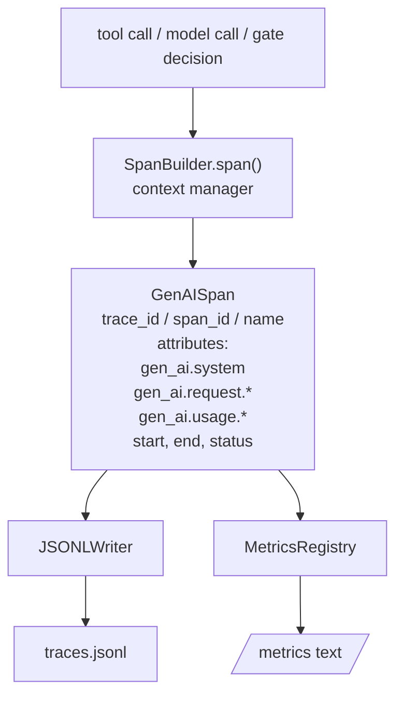
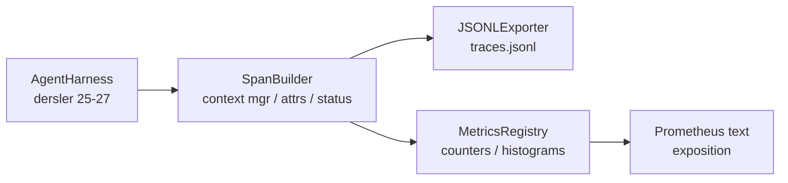

# OpenTelemetry GenAI Span'ları ve Prometheus Metrikleri ile Gözlemlenebilirlik

> Gözlemlenebilirlik olmayan bir ajan çerçevesi (agent harness) para harcayan bir kara kutu. Bu ders, OpenTelemetry GenAI semantik kurallarına (semantic conventions) uygun kayıtlar yayan, satır başına bir span olacak şekilde JSON-Lines dosyasına yazan ve Prometheus metrik biçiminde sayaçlar ve histogramlar sunan bir span oluşturucusunu elle yazar. Her şey stdlib Python'dur ve çevrimdışı çalışır.

**Tür:** Uygulama
**Diller:** Python (stdlib)
**Ön Koşullar:** Faz 19 · 25 (doğrulama kapıları), Faz 19 · 26 (sandbox), Faz 19 · 27 (eval çerçevesi), Faz 13 · 20 (OpenTelemetry GenAI), Faz 14 · 23 (OTel GenAI kuralları)
**Süre:** ~90 dakika

## Öğrenme Hedefleri

- OpenTelemetry GenAI semantik kurallarına göre biçimlendirilmiş bir span veri sınıfı inşa etmek.
- Satır başına kendi kendine yeten bir span yazan bir JSONL ihracatçısı uygulamak.
- Etiketlerle (labels) sayaçlar ve histogramlar ile Prometheus metin-biçim sunumunu inşa etmek.
- Herhangi bir çağrılabiliri süre, durum ve istisna kaydeden bir span bağlam yöneticisine sarmak.
- Yayılan span'ların `json.loads` üzerinden yuvarlak yol (round-trip) yaptığını ve belirtim biçimiyle eşleştiğini doğrulamak.

## Problem

Üretimdeki bir kodlama ajanı her turda üç sınıf yapıt üretir: bir model çağrısı, bir araç yürütmesi ve bir doğrulama kapısı kararı. Yapılandırılmış telemetri olmadan bunların hiçbiri kullanışlı değildir.

Birinci başarısızlık modu eksik izdir (missing trace). Salı günü bir şeyler ters gitti ama tek kayıt 500 satırlık bir sohbet günlüğü. Hangi aracın çalıştığının, ne kadar sürdüğünün, isteme kaç token girdiğinin ya da kapının bir şeyi reddedip reddetmediğinin kaydı yok. Ajan yazarı tahmin etmek zorunda.

İkinci başarısızlık modu ayrıştırılamayan izdir. Çerçeve span'ları yazdı ama kendi özel alan adlarını kullandı. Grafana, Honeycomb, Jaeger ya da yerel CLI'da hiçbir şey onları okuyamaz. Ekip yığınındaki hangi araç varsa boşa harcanır çünkü span'lar standart dışıdır.

Üçüncü başarısızlık modu toplanmamış metriktir. İzde bir yavaş araç çağrısını görebilirsiniz, ama "son bir saatte read_file çağrılarının p95 gecikmesi nedir?" sorusunu yanıtlayamazsınız çünkü metrik yok, yalnızca izler var.

OpenTelemetry GenAI semantik kuralları tam olarak bunun için var. LLM çerçeveleri arasında span yayıcılarının paylaştığı küçük bir standart öznitelik kümesi tanımlar. Çerçeveniz bu öznitelikleri yazarsa, her OTel uyumlu arka uç onları okuyabilir.

## Kavram



#### Açıklama
Bu diyagram, çağrıların span oluşturucudan geçerek JSONL izlerine ve Prometheus metriklerine nasıl aktığını gösterir. Her span, GenAI semantik kurallarına uygun öznitelikler taşır.

Çerçevedeki her işlem bir span üretir. Bir span'ın bir iz kimliği (tüm ajan çağrısı), bir span kimliği (bu tek işlem), bir ad (örn. `gen_ai.chat`, `gen_ai.tool.execution`), GenAI kurallarını izleyen öznitelikler, bir başlangıç ve bitiş zamanı ve bir durumu vardır.

GenAI kuralları bu öznitelik anahtarlarını standartlaştırır: `gen_ai.system` (hangi sağlayıcı, örn. `anthropic`, `openai`), `gen_ai.request.model` (model kimliği), `gen_ai.request.max_tokens`, `gen_ai.usage.input_tokens`, `gen_ai.usage.output_tokens`, `gen_ai.response.model`, `gen_ai.response.id`, `gen_ai.operation.name`, artı araç-spesifik anahtarlar `gen_ai.tool.name` ve `gen_ai.tool.call.id`.

İhracatçı JSONL yazar. Satır başına bir JSON nesnesi. Bu, aşağı akış araçlarının akıtabileceği, grep yapabileceği ve içe aktarabileceği en basit olası biçimdir. Gerçek bir OTel ihracatçısı OTLP gRPC konuşur; dersin JSONL ihracatçısı çevrimdışı eşdeğeridir ve her iş istasyonunda sıfır kodla çıkar.

Metrikler izlerin yanında yaşar. Bir sayaç her araç çağrısında artar: `tools_called_total{tool="read_file"}`. Bir histogram gözlemlenen gecikmeyi kaydeder: `tool_latency_ms{tool="read_file"}`. İkisi de Prometheus metin sunum biçimine serileştirilir, bu da çekme tabanlı metrikler için fiili standarttır.

## Mimari



#### Açıklama
Bu mimari diyagram, ajan çerçevesinin span oluşturucu, JSONL ihracatçısı ve metrik kaydı ile etkileşimini gösterir.

Span oluşurken küçük bir sınıftır ve `span(name, attrs)` yöntemi bir bağlam yöneticisi döndürür. Bağlam yöneticisi, girişte başlangıç zamanını, çıkışta bitiş zamanını kaydeder, bir istisna fırlatıldıysa iliştirir ve son hâline getirilen span'ı ihracatçıya iletir.

Metrik kaydı iki sözlüktür. Sayaçlar `{(name, frozen_labels): int}` biçimindedir. Histogramlar ham örnekleri bir listede tutar ve sunum zamanında Prometheus histogram kovalarına serileştirir.

## Ne İnşa Edeceksiniz

`main.py` şunları sunar:

1. `GenAISpan` veri sınıfı (dataclass): trace_id, span_id, parent_span_id, name, attributes, start_unix_nano, end_unix_nano, status, status_message, events.
2. `span(name, attrs, parent=None)` bağlam yöneticisiyle `SpanBuilder` sınıfı.
3. `export(span)` ile bir satır ekleyen `JSONLExporter` sınıfı.
4. `Counter` ve `Histogram` sınıfları artı `MetricsRegistry`.
5. Metin-biçim çıktı üreten `prometheus_exposition(registry)`.
6. Bir span yayan ve metrikleri güncelleyen `wrap_tool_call(name)` dekoratörü.
7. Demo: eksiksiz bir ajan çağrısı sentezler (araç span'ları etrafında gen_ai.chat span'ı), traces.jsonl yazar, Prometheus sunumunu yazdırır, sıfır kodla çıkar.

Span kimliği ve iz kimliği 16 baytlık onaltılık stringlerdir, `os.urandom`'dan üretilir. Bu, OTel'in W3C izleme bağlamıyla eşleşir. İhracatçı asla fırlatmaz; G/Ç hataları yüzeye çıkar ama çerçeve çalışmaya devam eder.

Histogram, sabit bir kova kümesine sahiptir (milisaniye cinsinden gecikme için OTel varsayılanı: 5, 10, 25, 50, 100, 250, 500, 1000, 2500, 5000, 10000, +Inf). Örnekler liste olarak saklanır; sunum, kova başına sayıları isteğe bağlı hesaplar.

## Neden opentelemetry-sdk Yerine El Yapımı

OTel Python SDK'sı gerçek bir bağımlılıktır. Ayrıca binlerce satır kod, OTLP ihracatçısı için birden çok süreç ve bir ders bütçesini aşan bir çalışma zamanı maliyeti. El yapımı sürüm tel biçimini öğretir. Üretimde aynı öznitelikleri gerçek SDK'ya bağlarsınız ve OTLP ihracatçısını, toplu işlemeyi ve kaynak algılamayı ücretsiz alırsınız.

Kurallar kararlıdır. Dersin yaydığı tel biçimi 2030'da da ayrıştırmaya devam edecek çünkü OTel GenAI öznitelik adlarını asla kırmaz; yalnızca yenilerini ekler.

## Bunun Track A'nın Geri Kalanıyla Nasıl Bileştiği

Yirmi beşinci ders kapı zincirini üretti. Yirmi altıncı ders sandbox'ı üretti. Yirmi yedinci ders eval çerçevesini üretti. Yirmi sekizinci ders üçünü de gözlemlenebilir kılar. Yirmi dokuzuncu ders, uçtan uca deminin her adımını span'lara sarar ve sonunda Prometheus metnini yazdırır.

## Çalıştırma

```bash
cd phases/19-capstone-projects/28-observability-otel-traces
python3 code/main.py
python3 -m pytest code/tests/ -v
```

#### Açıklama
Bu komutlar sırasıyla demoyu ve test paketini çalıştırır. Demo, dersin çalışma dizininde bir `traces.jsonl` yayar (sonda temizlenir), sonra üç span'dan bir örnek yazdırır, sonra sayaçlar ve histogramlar için Prometheus sunumunu yazdırır. Testler, span'ların yuvarlak yol (round-trip) serileştirildiğini, kanonik GenAI özniteliklerinin var olduğunu, sayaçların doğru arttığını ve histogram sunumunun beklenen kova sayılarını içerdiğini doğrular.
