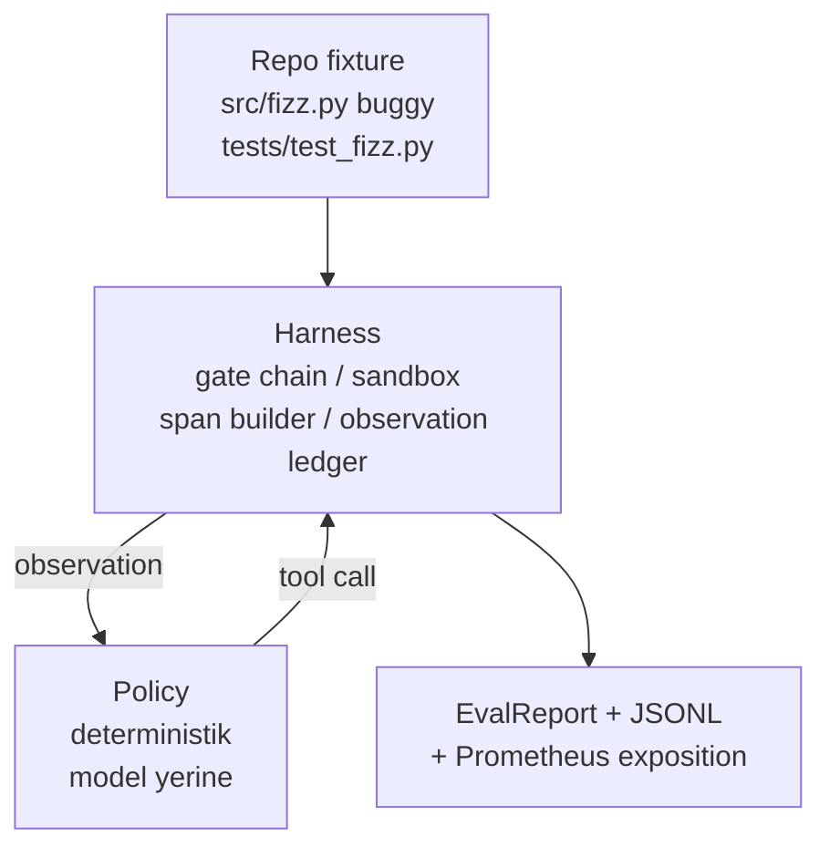
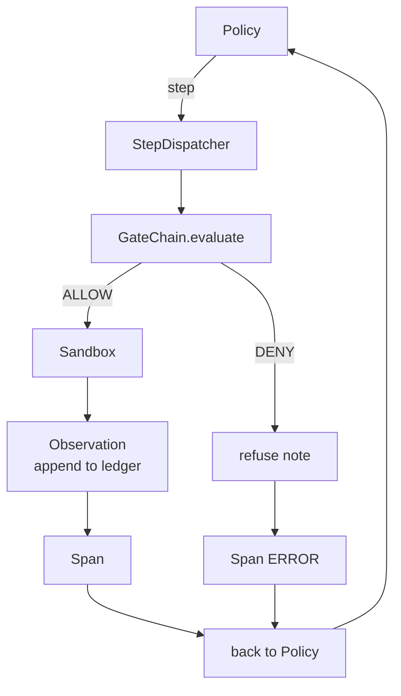

# Çerçeve Üzerinde Uçtan Uca Kodlama Ajanı

> Track A'nın karşılığı. Bu ders, kapı zincirini, sandbox'ı, eval çerçevesini ve OTel span'larını, çok dosyalı bir Python projesindeki gerçek (küçük, sabit ölçekli) bir hatayı düzelten çalışan bir kodlama ajanına diker. Ajan bir LLM değil deterministik bir politikadır; ikame, dersi tekrarlanabilir kılar ve başından beri çerçevenin ilginç kısım olduğunu gösterir. Sözleşme aynıdır: gerçek bir model politikanın dikiş noktasında takılır.

**Tür:** Uygulama
**Diller:** Python (stdlib)
**Ön Koşullar:** Faz 19 · 25 (doğrulama kapıları), Faz 19 · 26 (sandbox), Faz 19 · 27 (eval çerçevesi), Faz 19 · 28 (gözlemlenebilirlik), Faz 14 · 38 (doğrulama kapıları), Faz 14 · 41 (gerçek repolar için tezgah), Faz 14 · 42 (ajan tezgahı capstone)
**Süre:** ~90 dakika

## Öğrenme Hedefleri

- Kapı zincirini, sandbox'ı, eval çerçevesini ve span oluşturucuyu tek bir ajan döngüsünde kompoze etmek.
- read_file, run_tests ve write_file kullanarak bir sabit hatayı (fixture bug) düzelten deterministik bir politika uygulamak.
- Uçtan uca bir çalıştırmada küresel bir adım bütçesi ve bir gözlem token bütçesi uygulamak.
- Tam çalıştırma için eksiksiz OTel GenAI izleri ve Prometheus metrikleri yaymak.
- Ajanın sabit göreyi (fixture) 12 adımdan az ve yasal araçlarda sıfır kapı tetiklemesiyle çözdüğünü doğrulamak.

## Problem

Çoğu ajan demosu yalıtımda çalışır: tek başına bir sandbox, tek başına bir eval çerçevesi, tek başına bir span yayıcı. İyi görünürler. Birleştirin ve dikiş yerleri ortaya çıkar.

Kapı zinciri ALLOW der ama sandbox, zincirin öngörmediği bir nedenle reddeder. Eval çerçevesi bir geçiş kaydeder ama OTel span'ları, ajanın kullandığını iddia ettiği aracı kapının reddettiğini söyler. Prometheus sayacı bir kez artması gerekirken iki kez artar. Gözlem bütçesi aşılır ama bütçe zincirde izlendiği için ajan devam eder ve sandbox bilmez.

Bu ders tüm track için entegrasyon testidir. Ajanın sırayla dört şey yapması gerekir: projeyi oku, testleri çalıştır, test başarısızlığından hatayı belirle, düzeltmeyi yaz, testleri yeniden çalıştır ve dur. Her işlem kapı zincirinden geçer. Her araç yürütmesi sandbox'tan geçer. Her adım bir span'a sarılır. Eval çerçevesi her şeyi sonda puanlar.

## Kavram



#### Açıklama
Bu diyagram uçtan uca demoyu gösterir: bir repo sabit göresi (fixture), deterministik bir politika, çerçeve ve nihai çıktılar (eval raporu, JSONL izleri, Prometheus metin sunumu).

Ajanın politikası bir durum makinesidir. Beş durum.

`SURVEY`: ajan proje listesini okur. Sonraki durum `RUN_TESTS`'tir.

`RUN_TESTS`: ajan test komutunu çalıştırır. Testler geçerse, durum makinesi başarıyla durur. Aksi takdirde sonraki durum `INSPECT`'tir.

`INSPECT`: ajan başarısız olan kaynak dosyayı okur. Sonraki durum `FIX`'tir.

`FIX`: ajan düzeltilmiş dosyayı yazar. Sonraki durum `VERIFY`'dir.

`VERIFY`: ajan test komutunu yeniden çalıştırır. Testler geçerse, başarıyla durur. Aksi takdirde başarısızlıkla durur.

Her durum bir araç çağrısına karşılık gelir. Her araç çağrısı kapı zincirinden geçer. Bir araç çağrısı reddedilirse, ajan izde reddi raporlar ve durur.

Sabit hata, `fizz.py` içinde off-by-one hatasıdır. Deterministik politika, test başarısızlık mesajından bir regex ile hatayı algılar ve düzeltilmiş dosyayı yayar. Politikayı bir LLM ile değiştirmek çerçeve sözleşmesini değiştirmez.

## Mimari



#### Açıklama
Bu mimari diyagramda politika adımları bir adım dağıtıcısına, oradan kapı zincirine, ALLOW durumunda sandbox'a, sonra gözlem defterine ve span yayıcıya akar. DENY durumunda ise red notu span'a hata olarak yazılır.

Ders kendi kendine yeterlidir. Her önceki ders ilkeli, `main.py` içinde minimum ölçekte yeniden uygulanır (kapı, sandbox, defter, span), böylece ders kardeşleri içe aktarmadan çalışır. Adlar, kavramsal eşlemenin kesin olması için yirmi beş-yirmi sekiz dersleriyle tam olarak eşleşir.

## Ne İnşa Edeceksiniz

`main.py` şunları sunar:

1. Yirmi beş-yirmi sekiz dersleriyle aynı adlara sahip minimum çerçeve ilkelleri: `GateChain`, `Sandbox`, `ObservationLedger`, `SpanBuilder`, `MetricsRegistry`.
2. Beş durumlu durum makinesiyle `CodingAgentPolicy` sınıfı.
3. `Repo` yardımcısı: paketlenmiş hatalı sabit göreyi (fixture) içeren bir scratch dizini hazırlar.
4. `AgentRun` sınıfı: politikayı sürer, çerçeve üzerinden dağıtır, bir `AgentRunReport` döndürür.
5. Paketlenmiş bir sabit göre (fixture) (`fixture_repo/`), src/fizz.py, tests/test_fizz.py ve eval çerçevesi için bir expected/ ağacı ile.
6. Demo: politikayı uçtan uca çalıştırır, adım adım izi yazdırır, geçişi doğrular, metrikleri yazdırır.

Paketlenmiş sabit göre, yirmi yedinci dersin görev yapısıyla aynı biçimdedir: hatalı bir dosya ve bir testler dosyası. Test başarısızlık mesajı, deterministik politikanın düzeltmeyi belirlemesi için yeterli bilgi içerir. Gerçek bir LLM aynı işi daha yavaş ve daha geniş geri çağırmayla yapardı, ama çerçevenin beklentilerini değiştirmezdi.

## Politikanın Neden LLM Olmadığı

Gerçek bir LLM bir API anahtarı, bir ağ çağrısı ve doğrulanamaz stokastiklik gerektirir. Dersin önemsediği kısım çerçevedir. Deterministik bir politika koymak, dersin sıfır dış bağımlılıkla herhangi bir geliştirici dizüstü bilgisayarında çalışmasını sağlar ve test paketinin tam adım sayılarını doğrulamasına izin verir.

Dersin politikası, bir LLM ajanının yaptığının sıkı bir alt kümesidir. Politika repoyu okur, başarısız testi görür, satırı belirler ve bir düzeltme yayar. Bir LLM aynı döngüden aynı çerçeve sözleşmesiyle geçer; defter tutma aynıdır.

## Demo'nun Doğruladıkları

Uçtan uca demo, çıkış zamanında beş şeyi doğrular ve test paketi bunları programatik olarak yeniden doğrular.

Politika, sabit göreyi (fixture) 12 adımdan azda çözdü.

Gözlem bütçesi hiç aşılmadı.

Yasal araçlarda sıfır kapı reddi tetiklendi. (Ajan hiçbir zaman reddedilen bir araç adı uydurmadı.)

Her adımın traces.jsonl'de karşılık gelen bir span'ı var.

Prometheus sunumu, bir `tools_called_total{tool="read_file"}` girdisi ve bir `tool_latency_ms` histogram'ı içeriyor.

## Bunun Track A'nın Geri Kalanıyla Nasıl Bileştiği

Bu ders entegrasyondur. Yirmi beşinci ders kapı zincirini yazdı. Yirmi altıncı ders sandbox'ı yazdı. Yirmi yedinci ders eval çerçevesini yazdı. Yirmi sekizinci ders gözlemlenebilirliği yazdı. Yirmi dokuzuncu ders, bir sistem olarak çalıştıklarını kanıtlar. Gerçek bir ajan çerçevesi buradan genişler: deterministik politikayı bir modelle, paketlenmiş sabit göreyi gerçek-repo göreviyle, JSONL ihracatçısını OTLP ile değiştirin.

## Çalıştırma

```bash
cd phases/19-capstone-projects/29-end-to-end-coding-task-demo
python3 code/main.py
python3 -m pytest code/tests/ -v
```

#### Açıklama
Bu komutlar sırasıyla demoyu ve test paketini çalıştırır. Demo, adım başına bir izi, son eval raporunu ve Prometheus sunumunu yazdırır. Çıkış kodu sıfırdır. Testler, politika durum geçişlerini, sentetik araç çağrılarındaki kapı redlerini, paketlenmiş sabit göre (fixture) üzerinde uçtan uca çalıştırmayı ve adım bütçesi değişmezlerini kapsar.
