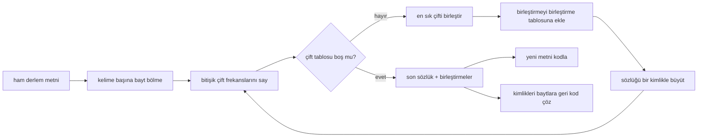
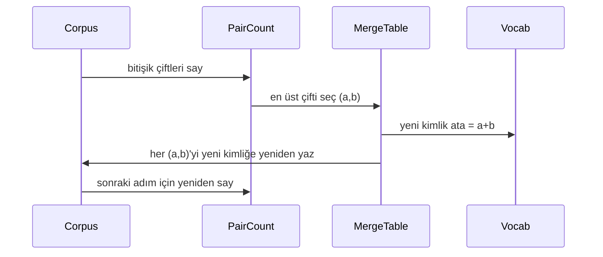

# Sıfırdan BPE Tokenizer

> Bayt girdi, kimlikler çıktı, kimlikler aynı baytlara geri dönüyor. Her modern metin modelinin hâlâ başlangıç noktası olan tokenlayıcıyı (tokenizer) inşa edin.

**Tür:** Uygulama
**Diller:** Python
**Ön Koşullar:** Faz 04 dersleri, Faz 07 transformer dersleri
**Süre:** ~90 dakika

## Öğrenme Hedefleri

- Ham bir metin derleminden (corpus), en sık bitişik sembol çiftini tekrar tekrar birleştirerek bir Byte-Pair Encoding sözlüğü eğitmek.
- Deterministik bir birleştirme (merge) tablosu uygulamak ve taze metne uygulayarak bir alt-kelime kimliği akışı üretmek.
- Keyfi UTF-8 girdisini kimliklere ve bilgi kaybı olmadan geri dönüştürmek.
- Özel token'ları (`<|endoftext|>`, `<|pad|>`) ayırmak ve korumak, böylece eğitim ve kod çözmede hayatta kalsınlar.
- Neden bayt düzeyinde bir alfabenin genel amaçlı bir tokenlayıcı (tokenizer) için doğru taban olduğunu tartışmak.

## Çerçeve

Bir dil modeli asla metin görmez. Tamsayılar görür. Bir string'den bir tamsayı listesine ve geriye giden harita tokenlayıcıdır (tokenizer). Bu katmanı yanlış alın, eğitim çalıştırmasındaki her kayıp eğrisi yanlış şeyi ölçer.

Genel metin modelleri için baskın alt-kelime tokenlayıcıları (subword tokenizers) ailesi Byte-Pair Encoding'dir (BPE). Fikir küçüktür. Bilinen bir alfabeden başlayın. Eğitim derleminde en sık görünen bitişik sembol çiftini bulun. Onu yeni bir sembolde birleştirin. Sözlük hedef boyuta ulaşana kadar tekrarlayın. Yeni metni kodlama, aynı birleştirme listesini aynı sırada yeniden kullanır.

Bayt düzeyinde varyantı inşa edeceğiz. Alfabe 256 ham bayttır, Unicode kod noktaları değil. Bu seçim, tokenlayıcının (tokenizer) bilinmeyen bir token'a düşmeden herhangi bir UTF-8 girdisini işlemesini sağlayan şeydir.

## İşlem Hattı

#### Açıklama
Bu diyagram BPE eğitimi ve çıkarım işlem hatlarını gösterir. Eğitim, çift sayımı ve birleştirme adımlarını tekrarlar; çıkarım, aynı birleştirme tablosunu taze metne uygular.

Eğitim tarafı ve çıkarım tarafı birleştirme tablosunu paylaşır. Bu paylaşım sözleşmedir. Çıkarım sırasında birleştirme sırasını değiştirirseniz, kimlik akışının farklı bir kodunu çözersiniz.

## Bayt Alfabesi

İlk 256 kimlik, 0x00 ile 0xFF arasındaki ham baytlar için ayrılmıştır. Bu, herhangi bir birleştirme olmadan önce her girdi stringinin sözlükte ifade edilebileceğini garanti eder. Bayt bloğundan sonra özel token'lar için küçük bir aralık ayırırız. Eğitim döngüsü, bunları önceden belirlenmiş akıştan tamamen uzak tuttuğumuz için bu kimlikleri birleştirme hedefleri olarak önermez.

Ön tokenleyici (pretokenizer), eğitim görmeden önce derlemi boşluk ve noktalama sınırlarında böler. Bu bölme olmadan, BPE birleştirme adımı mutlu bir şekilde kelime sınırlarını aşan birleştirmeler öğrenir ve sözlük yaygın tümceciklerle dolar. Bölme ile, birleştirmeler bir kelimenin içinde kalır ve sonuç genelleşir.

## Eğitim Döngüsü

Her eğitim adımı için döngü üç şey yapar. Derlemdeki her kelimeyi yürür ve mevcut sembollerin her bitişik çiftinin kaç kez göründüğünü, kelimenin kendisinin kaç kez göründüğüyle ağırlıklandırarak sayar. En yüksek sayıma sahip çifti seçer. O çiftin her oluşumunu, kimliği sözlükteki bir sonraki boş yuva olan yeni bir sembol olarak yeniden yazar. Sonra birleştirmeyi kaydeder.

#### Açıklama
Bu sıra diyagramı BPE eğitim döngüsünün tek bir adımını gösterir: çift sayımı, en sık çiftin seçimi, yeni kimlik atanması ve derlemin güncellenmesi.

Her adımın maliyeti, sembol dizileri listesi olarak ifade edilen derlemin boyutunda doğrusaldır. Bir milyon kelime ve on bin kimliklik bir hedef sözlük için, döngü saniyeler içinde tamamlanır çünkü birleştirmeler yerleştikçe sembol dizileri küçülür.

## Taze Metni Kodlama

Çıkarım birleştirme sayacını çağırmaz. Birleştirme tablosunu, öğrenildiği sırada uygular. Taze bir kelime için kodlayıcı bayt bölümünden başlar. Mevcut diziyi en düşük sıralı birleştirme (uygulanan en erken) için tarar. O birleştirmeyi gerçekleştirir. Yeniden tarar. Döngü, tablodan hiçbir birleştirme mevcut diziye uygulanmadığında sona erer.

Sıraya göre sıralama, kodlamayı deterministik yapan ve aynı girdi üzerinde eğitim davranışıyla eşleşen özelliktir. Önce öğrenilen birleştirme tablonun üstünde oturur ve önce uygulanır. İki birleştirme aynı konumda uygulanabilirse, sırası düşük olan kazanır.

## Özel Token'lar

Özel token'lar, bayt akışının asla üretemeyeceği kimliklerdir. Bunları elle ayırırız. Bu ders için ikisi yeterlidir.

- `<|endoftext|>` ön eğitim sırasında belgeleri ayırır. Modele "yeni bir belge burada başlıyor, öncekinin bağlamının sızmasına izin verme" der.
- `<|pad|>` kısa dizileri bir batch'in dikdörtgen bir tensör olabilmesi için doldurur. Kayıp maskesi eğitim sırasında onu gizler.

Kodlayıcı, girdide özel token'lara izin vermek için bir bayrak kabul eder. Bayrak kapalıyken, `<|endoftext|>` ve `<|pad|>` stringleri onları heceleyen baytlar olarak tokenleştirilir. Bayrak açıkken, değişmez stringler ayrılmış kimliklerine eşlenir ve hiçbir birleştirmeye tabi tutulmaz.

## Yuvarlak Yol Garantisi

Kodlama sonra kod çözme, girdi baytlarını tam olarak döndürmelidir. Kod çözücü, sırayla her kimliğin bayt genişlemesini birleştirir. Her kimlik ya bir ham bayt ya da daha önce bilinen iki kimliğin bitişik olduğundan, özyinelemeli genişleme her zaman ham baytlarda sonlanır. Kod çözme, o baytların hecelediği UTF-8 stringini döndürür.

Bu dersteki test paketi, özelliği görülmemiş bir cümlede, bir Unicode emoji içeren bir cümlede ve değişmez `<|endoftext|>` token'ı içeren bir cümlede denetler.

## Bu Dersin Yapmadıkları

En büyük üretim tokenlayıcılarının stilinde regex tabanlı bir ön tokenleyici (pretokenizer) inşa etmez. Buradaki ön tokenleyici (pretokenizer) küçük bir boşluk ve noktalama bölmesidir. Küçük bir eğitim derleminde anlamlı birleştirmeler üretmek ve ders zincirinin geri kalanıyla sözleşmenin aynı kalması için yeterlidir. Sonraki ders, tokenlayıcıyı (tokenizer) kara kutu olarak ele alır ve üzerine kayan pencere veri kümesini inşa eder.

Çift sayacını paralelleştirmez. Birkaç bin kelimelik bir derlem üzerinde Python'da bir döngü bir saniyenin çok altında biter. Daha büyük derlemler için belirgin hareket, kelime başına çiftleri paralel saymak ve indirgemektir.

## Kodu Nasıl Okumalı

`main.py` dört nesne tanımlar. `BPETokenizer` sözlüğü, birleştirme tablosunu ve özel token tablosunu tutar. `train` eğitim döngüsüdür. `encode` çıkarım yoludur. `decode` bayt birleştirmesidir. Alttaki demo, yerleşik bir derlemde küçük bir tokenlayıcı eğitir, elde tutulan bir cümleyi kodlar, kimlikleri geri kodlar ve ikisini de yazdırır. `code/tests/test_bpe.py` içindeki testler, yuvarlak yol (round-trip) özelliğini, özel token ayrımını ve birleştirme sırasını sabitler.

Demoyu çalıştırın. Sonra demoda hedef sözlük boyutunu 300'den 600'e değiştirin ve elde tutulan cümlenin kodlanmış uzunluğunun nasıl düştüğünü izleyin. O eğri, BPE sıkıştırma eğrisidir.
