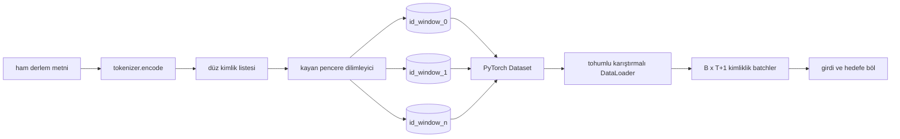
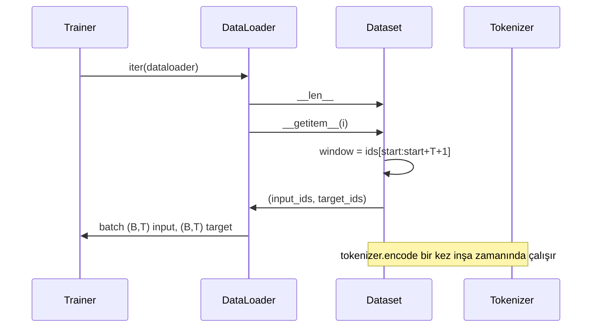

# Kayan Pencereli Tokenize Veri Kümesi

> Bir ön eğitim çalıştırması, token kimliklerinden gradyanlara bir fonksiyondur. Bu ders, kimlikleri içeri besleyen konveyörü inşa eder.

**Tür:** Uygulama
**Diller:** Python
**Ön Koşullar:** Faz 04 dersleri, Faz 07 transformer dersleri, bu fazın 30. dersi
**Süre:** ~90 dakika

## Öğrenme Hedefleri

- Ham bir derlemi, tokenlayıcıyı (tokenizer) bir kez çağırarak bir token kimliği akışına dönüştürmek.
- Kimlik akışını, yapılandırılabilir örtüşme adımıyla (overlap stride) sabit uzunluklu pencerelere bölmek.
- Sonraki-token tahmini için girdi ve hedef tensörleri döndüren bir PyTorch Dataset'i inşa etmek.
- Veri kümesini, dönem başına tohumlanan deterministik bir karıştırma ile bir DataLoader içine sarmak.
- Adım, fazlalık ve etkin veri kümesi boyutu arasındaki ödünleşimi tartışmak.

## Çerçeve

Bir ön eğitim çalıştırması aynı anda bir batch token kimliği okur ve modeli günceller. Her batch'in biçimi eğitim sözleşmesiyle sabitlenir. Nedensel (causal) bir dil modeli için, batch `(B, T)` girdi kimliklerini ve `(B, T)` hedef kimliklerini tutar; burada hedef, girdinin bir sola kaydırılmışıdır. Veri işlem hattının işi, birkaç gigabayt ham metin içerebilen bir derlemden o sözleşmeyi isteğe bağlı, deterministik ve tekrarlanabilir bir şekilde üretmektir.

Bu ders işlem hattını inşa eder. Önceki dersteki tokenlayıcı metni uzun düz bir kimlik listesine dönüştürür. Kayan pencere o listeyi eğitim örneklerine böler. Özel bir Dataset örnekleri tensör olarak sunar. Bir DataLoader onları toplar ve bilinen bir tohumla karıştırır.

## Biçim Sözleşmesi

Nedensel (causal) bir LM, `(B, T)` şeklinde kimlikleri tüketir; burada `B` batch boyutu, `T` bağlam uzunluğudur. `t` konumundaki hedef, `t+1` konumundaki girdiştir. Bu, her eğitim örneğinin `T+1` ham kimliği kapsadığı anlamına gelir. Pencere adımı (stride), art arda gelen örnekler arasındaki örtüşme miktarını kontrol eder.

#### Açıklama
Bu diyagram, ham metnin PyTorch Dataset ve DataLoader üzerinden batch'lere dönüşümünü gösterir. Her pencere, girdi-hedef çifti olarak dilimlenir.

Dilimleyici, derlemin sınırıyla asla çakışmaz. Son pencere `T+1` konumu dolduracak kadar kimliğe sahip değilse, dilimleyici onu düşürür. Kuyruğu `<|pad|>` ile doldurmak da geçerli bir seçimdir ama kayıp maskesini karmaşıklaştırır. Bu ders için düşürürüz.

## Neden Kayan Pencere

Bir ön eğitim derlemi, kimliklerin tek uzun akışıdır. Model yalnızca çakışmayan pencereleri görseydi, her eğitim örneği onu aynı `T` sınırlarını öğretirdi. Adımı ayarlamak, bu sınırları hareket ettirir, böylece model daha çeşitli sonraki-token tahmin görevleri görür.

`T` adımı, çakışmayan pencereler üretir. `T // 2` adımı, yüzde elli örtüşme üretir ve etkin veri kümesini iki katına çıkarır. `1` adımı, maksimum örtüşme üretir ve veri kümesini `T` katı artırır. Bedel, dönem başına daha fazla hesaplamadır. Yarar, daha fazla sınır çeşitliliğidir. Çoğu ön eğitim çalıştırması, bağlam uzunluğuna eşit bir adım kullanır, çünkü derlem zaten modelin tek bir dönemde bitiremeyeceği kadar büyüktür, dolayısıyla sınır çeşitliliği argümanı daha zayıftır.

## Dataset Sınıfı

Bir PyTorch Dataset'in iki gerekli yöntemi vardır. `__len__` örnek sayısını döndürür. `__getitem__` bir örneği bir tensör çifti olarak döndürür. Bizim Dataset'imiz, kodlanmış kimlik akışını ve adımı saklar. İçine indeksleme, pencerenin başlangıcını anında hesaplar, böylece bellek maliyeti, adımın kaç örnek ürettiğinden bağımsız olarak kimlik akışının tek bir kopyasıdır.

#### Açıklama
Bu sıra diyagramı, bir eğitim adımında Trainer, DataLoader, Dataset ve Tokenizer arasındaki etkileşimi gösterir. Tokenizer yalnızca inşa sırasında bir kez çalışır; eğitim döngüsü sırasında yalnızca tensör dilimleme yapılır.

Bir-kaydırma `__getitem__` içinde olur. Dataset `(input, target)` döndürür; burada `input = window[:-1]` ve `target = window[1:]`. İkisi de PyTorch long tensörleridir. Eğitim döngüsü onları temel gerçek olarak ele alır.

## Deterministik Karıştırma

`shuffle=True` ile bir DataLoader, PyTorch rastgele üretecinden (generator) okur. Dönem başına tohumlanan açık bir `torch. Generator` geçirerek, çalıştırma her yeniden başlatıldığında aynı karıştırmayı alırız. Bu özellik, yalnızca tek bir hiperparametrede farklılık gösteren iki çalıştırmayı karşılaştırmak istediğinizde önemlidir. Tohum olmadan, iki çalıştırma verileri farklı sırada görür ve kayıp eğrileri değişiklikle ilgisiz nedenlerle ayrılır.

Bu dersteki tohum sözleşmesi basittir. `epoch_seed = base_seed + epoch_index`. Taban tohum yapım sırasında geçirilir. Dönem indeksi, eğitimci tarafından her dönemin başında artırılır. Aynı taban tohumla bir yeniden çalıştırma, her dönemde aynı sırayı görür.

## Batch Örnekleyici

PyTorch'taki varsayılan örnekleyici, yerine koymadan (without replacement) düzgün rastgele indisler seçer. Bu, ön eğitim için istediğimiz şeydir. Küçük bir veri kümesi üzerinde ince ayar için sözleşme aynıdır. DataLoader, bir batch'i `__getitem__`'i `B` kez çağırarak ve sonuçları istifleyerek bir araya getirir. Her örnek yapı gereği aynı uzunlukta olduğundan, dolgu (padding) mantığı gerekmez.

Ders, basitlik için `num_workers=0` tutar. Üretim çalıştırmasında, işçiler (workers) `__getitem__` çağrılarını paralelleştirir. Bizim işlem hattımızda bu çoğunlukla bir no-op'tur, çünkü iş bellekteki bir tensörün dilimlenmesidir, ama aynı Dataset API'si işçileri düzgün destekler.

## Örnekleri Saymak

`N` uzunluğunda bir kimlik akışı, `T` bağlam uzunluğu ve `S` adımı için, örnek sayısı `max(0, 1 + (N - (T + 1)) // S)`'dir. Ders, hesaplamayı Dataset üzerinde statik bir yöntem olarak sunar, böylece eğitimci, dönem başına toplam adımları yinelemeden hesaplayabilir.

## Bu Dersin Yapmadıkları

Diskten akış (streaming) yapmaz. Derlem tamamen bellekte kodlanır ve tek bir tensör olarak tutulur. Birkaç milyon kimliklik bir derlem için bu, yüz megabaytın çok altındadır ve ders için doğru biçimdir. Disk akışı, depoyu değiştirip Dataset sözleşmesini koruyarak takılan ayrı bir kaygıdır.

Birden çok belge işlemez. Derlem, bir sürekli kimlik akışı olarak ele alınır. Sonraki belge sınırı, derlem birden çok belgeden inşa edildiğinde `<|endoftext|>` kimlikleri eklenerek kodlanır. Model sınırın etrafında tahmin etmeyi öğrenir.

## Kodu Nasıl Okumalı

`main.py` iki sınıf ve bir yardımcı tanımlar. `SlidingWindowDataset` PyTorch Dataset'idir. `make_dataloader` tohumlu bir üreteçle yapılandırılmış bir DataLoader döndürür. `_encode_corpus_to_ids` tek atışlık tokenleyıcı çağrısıdır. Alttaki demo, süreç içinde küçük bir tokenlayıcı inşa eder, yerleşik bir derlemi kodlar, veri kümesini ve dataloader'ı inşa eder, bir batch yazdırır ve biçim sözleşmesini doğrular. `code/tests/test_dataset.py` içindeki testler, pencere sayısı formülünü, bir-kaydırma özelliğini, deterministik karıştırmayı ve adım ödünleşimini sabitler.

Demoyu çalıştırın. Sonra bağlam uzunluğunu 16'dan 32'ye değiştirin ve dönem başına örnek sayısının nasıl düştüğünü izleyin. O sayı, dönem başına adım sayısı bütçenizdir.
