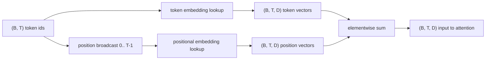
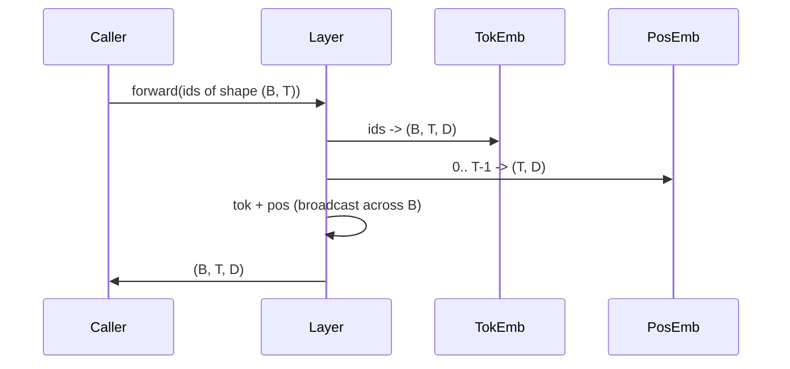

# Token ve Konumsal Gömme (Embeddings)

> Kimlikler tamsayıdır. Model vektör ister. Aralarında iki arama tablosu oturur ve konumsal olanın seçimi, modelin ne öğrenebileceğini şekillendirir.

**Tür:** Uygulama
**Diller:** Python
**Ön Koşullar:** Faz 04 dersleri, Faz 07 transformer dersleri, bu fazın 30 ve 31. dersleri
**Süre:** ~90 dakika

## Öğrenme Hedefleri

- Sözlük kimliklerini yoğun vektörlere eşleyen bir token-gömme arama tablosu inşa etmek.
- Konumla indekslenen öğrenilmiş bir konumsal-gömme arama tablosu inşa etmek.
- Parametresi olmayan, konumla indekslenen sabit bir sinüzoidal konumsal gömme inşa etmek.
- Token ve konumsal gömme'leri, bir transformer bloğu için tek bir girdiye kompoze etmek.
- Öğrenilmiş ve sinüzoidal gömme'leri, uzunluk genelleme ve parametre sayısı üzerinden karşılaştırmak.

## Çerçeve

Modelin bir token kimliğiyle ilk teması, token-gömme matrisindeki bir satır aramasıdır (row lookup). Matris, sözlük kimliği başına bir satıra ve model boyutu başına bir sütuna sahiptir. Arama, modelin geri kalanının kimliğin anlamı olarak ele aldığı bir vektörü döndürür. Geri yayılım (backprop), ileri geçişte kullanılan satırları günceller. Eğitim boyunca bu satırların geometrisi, benzerliği yönlerde kodlamayı öğrenir.

Salt token kimliklerinin sırası yoktur. Modelin, birinci konumun on yedinci konumdan farklı olduğunu söyleyen ikinci bir sinyale ihtiyacı vardır. Bu sinyal için iki baskın seçenek, öğrenilmiş bir konumsal gömme (ikinci bir arama tablosu, konum başına bir satır) ve sabit bir sinüzoidal konumsal gömmedir (parametresi olmayan bir matematik formülü). Seçimin sonuçları vardır. Öğrenilmiş tablo bir parametredir ve modelin eğitildiği maksimum bağlam uzunluğuyla sınırlıdır. Sinüzoidal tablo teoride parametre içermez ve formül herhangi bir konuma genişler, ama bu dersin `SinusoidalPositionalEmbedding`'i `max_context_length`'te sabit bir tabloyu önceden hesaplar ve `forward`'u o sınırın ötesinde istisna fırlatır; bu nedenle her iki modül de burada bir maksimum bağlam uzunluğu uygular. Model, tablo indeksleme için yeterince büyük olsa bile eğitim uzunluğunun ötesinde zorlanabilir.

Bu ders ikisini de inşa eder ve bir sonraki dersin dikkat bloğu için token gömme ile kompoze eder.

## Biçim Sözleşmesi

Gömme aşamasının girdisi, `(B, T)` şeklinde token kimliği batch'idir. Çıktı, `(B, T, D)` şeklinde bir tensördür; burada `D` model boyutudur. Her batch öğesinin aynı `T` bağlam uzunluğu vardır. Her konumun aynı `D` vektör boyutu vardır.



#### Açıklama
Bu diyagram, token kimliklerinin token vektörlerine, konumların konum vektörlerine nasıl arandığını ve sonra element bazında toplanarak tek bir girdi oluşturduğunu gösterir.

Kompozisyon bir toplamdır, bitiştirme (concatenation) değil. Toplam, `D`'yi ağ boyunca sabit tutar ve modelin her katmanda, her özellik için token anlamının mı yoksa konumun mu baskın olduğuna karar vermesine izin verir.

## Token Gömme Matrisi

Token gömme, `(V, D)` şeklinde bir parametre tensörüdür; burada `V` sözlük boyutudur. PyTorch bunu `nn. Embedding(V, D)` olarak sunar. Başlatmada (init) girişler küçük bir Gauss'tan çekilir, geleneksel olarak sıfır ortalama ve transformer ölçeğindeki modeller için yaklaşık `0.02` standart sapma ile. Tam başlatma değerinden çok, çalıştırmalar arasında tutarlı kalması daha önemlidir.

İleri geçiş tek bir indeksleme işlemidir. PyTorch, `(B, T)` int64 kimliklerini, satırları toplayarak `(B, T, D)` float'lara eşler. Geri geçiş, yalnızca ileri geçişte dokunulan satırlara gradyan biriktirir. Batch'te hiç görünmeyen iki satır, o adımda sıfır gradyan alır.

İnce bir detay. Token gömme ve modelin sonundaki çıktı projeksiyonu sıklıkla ağırlıkları paylaşır (weight tying). Bu olduğunda, her geri geçiş, çıktı tarafı üzerinden gömme'nin her satırına dokunur. Ders burada ikisini ayrı modüller olarak sunar, ama aynı matris tam modelde her iki rolü oynayabilir.

## Öğrenilmiş Konumsal Gömme

Öğrenilmiş konumsal gömme, `(max_context_length, D)` şeklinde ikinci bir `nn. Embedding`'dir. Arama, konum kimliği `0, 1, 2, ..., T-1` ile anahtarlanır. İleri geçiş, konum vektörünü batch boyutu boyunca yayar (broadcast).

Öğrenilmiş tablonun eksik yanı, model yalnızca `T-1`'e kadar eğitildiyse, konum `T`'de sorgulanamamasıdır. Satır yoktur. Bu şemayı kullanan üretim yalnızca çözücü (decoder-only) modelleri, maksimum bağlam uzunluğunu mimariye yerleştirir ve daha uzun girdileri işlemeyi reddeder.

## Sinüzoidal Konumsal Gömme

Sinüzoidal konumsal gömme, konumdan vektöre bir fonksiyondur. Konum `p` ve özellik `i` şunu üretir:

```python
angle = p / (10000 ** (2 * (i // 2) / D))
emb[p, 2k] = sin(angle)
emb[p, 2k + 1] = cos(angle)
```

#### Açıklama
Bu formül, sinüzoidal konumsal gömme'nin farklı boyutlarda farklı dalga boyları üretmesini sağlar. Çift indisler sin, tek indisler cos kullanır. Bu kombinasyon, göreli konum ofsetlerinin öğrenilmesini kolaylaştırır.

Fonksiyonun parametresi yoktur. Her konumun benzersiz bir vektörü vardır. Dalga boyu özellik boyutları boyunca geometrik olarak değişir, böylece düşük boyutlar kaba konumu, yüksek boyutlar ince konumu kodlar.

`sin` ve `cos`'un birlikte seçilmesinden kaynaklanan özellik, konum `p + k`'daki vektörün konum `p`'deki vektörün doğrusal bir fonksiyonu olmasıdır. Bu, dikkat (attention) katmanına göreli konum ofsetlerini öğrenmek için kolay bir yol sunar. Modelin "beş token geriye bak" ifadesini söylemek için ayrı bir parametreye ihtiyacı yoktur.

Ders, tam sinüzoidal tabloyu yapım sırasında bir kez hesaplar ve ileri geçiş zamanında ona indeksler.

## Kompozisyon

Girdi işlem hattı sırayla üç şey yapar. Token kimliklerini oku. Token vektörlerini ara. Konumsal vektörleri ekle. Toplamı döndür.



#### Açıklama
Bu sıra diyagramı, kompozisyon adımlarını ve boyutların nasıl yayıldığını gösterir. Konumsal tensör, batch boyutu boyunca otomatik olarak yayılır.

Toplam adımındaki yayma (broadcasting), `(T, D)` konumsal tensörünü batch boyutu boyunca çoğaltır. Konumsal tensör, unsqueeze sonrası `(1, T, D)` şekline sahip olduğu için PyTorch bunu otomatik olarak ele alır.

## Karşılaştırmalı Analiz

Ders, her iki varyantı aynı girdiler üzerinde çalıştırır ve iki tanısal (diagnostic) değer yazdırır.

Birincisi parametre sayısıdır. Öğrenilmiş varyant, token gömme üzerine `max_context_length * D` parametre ekler. Sinüzoidal varyant sıfır ekler.

İkincisi, komşu konumlardaki gömme'ler arasındaki kosinüs benzerliğidir. Sinüzoidal varyant, fonksiyon sürekli olduğu için pürüzsüz ve öngörülebilir bir düşüşe sahiptir. Başlatmadaki öğrenilmiş varyant, satırlar bağımsız çekildiği için rastgele benzerliğe yakındır. Eğitimden sonra, öğrenilmiş varyant tipik olarak benzer bir pürüzsüz yapı geliştirir, ama bu yapıyı veriden keşfetmesi gerekir.

## Bu Dersin Yapmadıkları

Döner (rotary) konumsal kodlama (RoPE) veya AliBi inşa etmez. Bunlar üretim transformer'larında modern seçeneklerdir. İkisi de buradaki gömme'lerle aynı biçim sözleşmesini izler (`(B, T, D)` şeklinde vektörlere konum-bağımlı dönüşüm uygular), ama dikkat projeksiyon adımında girdi yerine uygulanır. Sonraki ders dikkat bloğunu inşa eder ve isteğe bağlı uzantılardan biri, rotary'yi orada sorgu-anahtar (query-key) projeksiyonlarına katlamaktır.

Gömme'yi eğitmez. Eğitim bir kayıp (loss) gerektirir, bu bir model çıktısı gerektirir, bu dikkat ve bir LM kafası gerektirir. Bu sonraki ders ve ondan sonraki derstir.

## Kodu Nasıl Okumalı

`main.py` üç modül tanımlar. `TokenEmbedding` `nn. Embedding(V, D)`'yi sarar. `LearnedPositionalEmbedding` `nn. Embedding(L, D)`'yi sarar. `SinusoidalPositionalEmbedding` tabloyu önceden hesaplar ve onu bir buffer olarak sunar. `EmbeddingComposer` bir token gömme ve bir konumsal gömme'yi bağlar. Alttaki demo, şekilleri, parametre sayılarını ve komşu-konum benzerliği tanısal değerini yazdırır. `code/tests/test_embeddings.py` içindeki testler, şekli, yayma davranışını, parametre sayısını ve sinüzoidal formülü sabitler.

Demoyu çalıştırın. Sonra model boyutu `D`'yi 64'ten 32'ye değiştirin ve sinüzoidal dalga boyu bantlarının nasıl değiştiğini izleyin.
