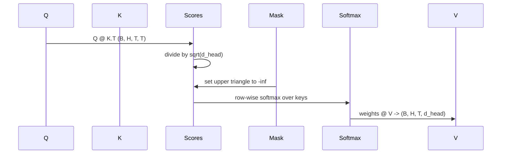

# Çok Kafalı Öz-Dikkat (Multi-Head Self-Attention)

> Tek doğrusal projeksiyon, üç görünüm, H paralel kafa, bir maske. Modelin gerçekten kullandığı gibi dikkat bloğu.

**Tür:** Uygulama
**Diller:** Python
**Ön Koşullar:** Faz 04 dersleri, Faz 07 transformer dersleri, bu fazın 30-32. dersleri
**Süre:** ~90 dakika

## Öğrenme Hedefleri

- Toplu bir Sorgu/Anahtar/Değer projeksiyonunu, H kafaya bölünmüş tek bir doğrusal katman olarak uygulamak.
- Doğru normalleştirme ve dtype işleme ile ölçekli dot-product dikkatini (scaled dot-product attention) hesaplamak.
- Bir konumun gelecekteki konumlara dikkat etmesini engelleyen nedensel (causal) bir maske uygulamak.
- Sabit bir girdi üzerinde kafa başına dikkat ağırlıklarını incelemek ve her kafanın neye baktığını tartışmak.
- Oyuncak bir görevde küçük bir dikkat bloğu eğitmek ve kayıp düşerken kafaların nasıl özelleştiğini izlemek.

## Çerçeve

Dikkat (attention), bir token'ın temsilinin aynı dizideki diğer token'lardan bilgi çekmesine izin veren fonksiyondur. Öz-dikkat (self-attention), sorguların, anahtarların ve değerlerin aynı girdiden türetildiği anlamına gelir. Çok kafalı (multi-head), projeksiyonun çıktısı bitiştirilmiş ve geri projekte edilen H paralel dikkat problemine bölündüğü anlamına gelir.

Verimli uygulama deseni, `D`'den `3 * D`'ye projekte eden ve H kafa boyutunda `D // H`'lik görünümlere bölünen tek bir doğrusal katmandır. Matmul, softmax ve ağırlıklı toplam, toplu tensör işlemleri olarak yapılır, böylece kafalar hızlandırıcıda paralel çalışır.

Bu ders o bloğu inşa eder. Ayrıca, aynı kodun yalnızca çözücü (decoder-only) bir dil modelindeki dikkat katmanı olarak çalışması için nedensel maskeyi ekler. Sonraki ders bloğu tam bir transformer'a yığar ve ondan sonraki ders onu eğitir.

## Biçim Sözleşmesi

Girdi `(B, T, D)`'dir. Çıktı `(B, T, D)`'dir. Maske `(T, T)` ya da ona yayılabilir. Blok içinde ara tensörler `(B, H, T, d_head)` şeklindedir; burada `d_head = D // H`. Kısıt `D % H == 0`'dır.

```mermaid
flowchart LR
    A["(B, T, D) input"] --> B[Linear D -> 3D]
    B --> C["split into Q, K, V"]
    C --> D["reshape to (B, H, T, d_head)"]
    D --> E["scores = Q @ K.T / sqrt(d_head)"]
    E --> F[apply causal mask]
    F --> G[softmax over keys]
    G --> H["context = weights @ V"]
    H --> I["reshape to (B, T, D)"]
    I --> J[output Linear D -> D]
    J --> K["(B, T, D) output"]
```

#### Açıklama
Bu diyagram çok kafalı öz-dikkat bloğunun adımlarını gösterir: girdi projeksiyonu, kafa bölünmesi, ölçekli puanlar, nedensel maskeleme, softmax, değerlerle ağırlıklı toplam, yeniden şekillendirme ve son projeksiyon.

İki doğrusal katman (QKV projeksiyonu ve çıktı projeksiyonu) bloktaki tek parametrelerdir. Maske, softmax, matmullar ve yeniden şekillendirmelerin tümü parametresizdir.

## QKV Bölünmesi

Saf (naive) uygulama, Q, K ve V için her biri ayrı birer doğrusal katman olmak üzere üç ayrı doğrusal katmana sahiptir. Verimli olan, `3 * D` özellik çıkaran ve sonucu bölen tek bir katmana sahiptir. İkisi, üç ayrı `(D, D)` ağırlık matrisi ile matmul'ün, onlardan yığılmış `(3D, D)` ağırlığı ile tek bir matmul'le tam olarak aynı olduğu için matematiksel olarak eşdeğerdir.

Verimli sürüm, hızlandırıcı üç matmul yerine bir tane başlattığı için daha hızlıdır. Ayrıca başlatılması daha kolaydır çünkü üç alt matris aynı parametre tensöründe yaşar ve birlikte başlatılabilir.

## Kafa Yeniden Şekillendirme

Bölmeden sonra, Q, K, V'nin her biri `(B, T, D)`'dir. Bunu H paralel dikkat problemine dönüştürmek için, `(B, T, H, d_head)` olarak yeniden şekillendirip `(B, H, T, d_head)` olarak transpose ederiz. Kafa boyutu artık batch boyutunun yanında oturur, böylece PyTorch kafa başına dikkati `B * H` bağımsız örnek üzerinde toplu bir işlem olarak ele alır.

`d_head` boyutu sonda kalır, böylece `Q @ K.transpose(-2, -1)` puan matmulu onu daraltır. Sonuç, `(B, H, T, T)` kafa başına dikkat puanlarıdır.

## Ölçekleme

Puanlar, softmax'tan önce `sqrt(d_head)`'e bölünür. Bu ölçekleme olmadan, dot ürünleri `d_head` büyüdükçe büyür ve softmax'ı, bir girişin neredeyse tüm kütleye sahip olduğu ve diğerlerinin yok denecek kadar az olduğu bir rejime iter. O rejimdeki gradyanlar küçüktür ve öğrenme durur. `sqrt(d_head)`'e bölmek, puanların varyansını kafa boyutları boyunca kabaca sabit tutar.

## Nedensel Maske

Yalnızca çözücü (decoder-only) bir dil modeli, bir sonraki token'ı tahmin ederken yalnızca geçmişe koşullandırabilir. Maske bunu uygular. Somut olarak, softmax'tan önce, `(T, T)` puan matrisinin diyagonalin üstündeki her girişi eksi sonsuz ile değiştirilir. Softmax'tan sonra o konumlar sıfır ağırlık alır.

#### Açıklama
Bu sıra diyagramı, dikkat puanlarının hesaplanması, ölçeklenmesi, maskelenmesi ve değerlerle birleştirilmesi adımlarını gösterir. Üst üçgen maskeleme, geleceğe bakışı engeller.

Maskeyi yapım sırasında bir buffer olarak kaydederiz, böylece modelle aynı aygıtta yaşar ve gradyan grafiğinin parçası olmaz. Maske, bloğun göreceği maksimum bağlam uzunluğunu kapsar. İleri geçiş sırasında, sol üst `(T, T)` köşesini dilimleriz.

## Çıktı Projeksiyonu

Kafa başına bağlam vektörlerinden `(B, H, T, d_head)` sonra, `(B, T, H, d_head)` olarak geri transpose ederiz, `(B, T, D)` olarak yeniden şekillendiririz ve son bir `(D, D)` doğrusal projeksiyon uygularız. Çıktı projeksiyonu, modelin kafaları karıştırmasına izin verir. O olmadan, H kafalar yalnızca sonraki katmanlar aracılığıyla yeniden birleşirdi ve blok yapay olarak kısıtlanırdı.

## Dikkat Ağırlığı İncelemesi

Ders, ileri geçişte bir `return_weights=True` bayrağı sunar. Ayarlandığında, blok, çıktıyla birlikte `(B, H, T, T)` şeklinde kafa başına dikkat ağırlıklarını döndürür. Demo, kısa bir girdide bir kafanın ağırlıklarının bir ısı haritasını yazdırır, böylece nedensel-üçgen yapıyı ve konum başına odağı görebilirsiniz.

Eğitilmiş bir modelde, farklı kafalar farklı desenler öğrenir. Bazı kafalar hemen önceki token'a dikkat eder. Bazı kafalar dizinin başına dikkat eder. Bazı kafalar dikkati neredeyse düzgün yayar. İnceleme kancası, bu yorumlanabilirlik çalışması için giriş noktasıdır.

## Eğitim Demosu

`main.py` alttaki demo, dikkat bloğunu küçük bir LM kafasına bağlar ve tüm şeyi bir tekrar (repeat) görevinde eğitir. Girdinin her satırı, bağlam boyunca çoğaltılan tek bir rastgele kimliktir. Hedef, bir kaydırılmış girdidir, böylece model sonraki token'ın önceki token ile aynı olduğunu öğrenmelidir. Kayıp, çapraz entropidir. H=4, D=32, T=12 ve 64'lük bir sözlükle, kayıp rastgele (yaklaşık `log(64) ~ 4.16`) seviyesinden CPU üzerinde üç dönemde `1.0`'ın çok altına düşer.

Demosunun amacı yararlı bir model eğitmek değildir. Amacı, gradyanların bloğun her parçasından aktığını ve kafaların, cevabın açık olduğu bir problemde bir şeyler öğrendiğini doğrulamaktır.

## Bu Dersin Yapmadıkları

İleri besleme (feed-forward) bloğu eklemez. Gerçek bir modeldeki transformer katmanı, artık bağlantı (residual connection) ve katman normalleştirmesi (layer norm) ile çevrelenmiş iki katmanlı bir MLP'yi takip eden dikkatten oluşur. Sonraki ders bunları ekler.

Döner (rotary) veya AliBi konumsal kodlaması uygulamaz. İkisi de QKV projeksiyon adımında aynı bloğa uygulanır, ama ayrı bir öğretim birimidir. Burada inşa edilen blok, matmul'den önce Q ve K'yi dönüştürerek ikisiyle uyumludur.

Çıkarım için KV önbellek uygulamaz. Anahtarları ve değerleri ileri geçişler arasında önbelleğe almak, otoregresif kod çözmeyi hızlı kılan optimizasyondur. K ve V tensörlerinin biçim sözleşmesini değiştirir ama Q'nunkini değiştirmez. Çıkarım dersine aittir.

## Kodu Nasıl Okumalı

`main.py` `MultiHeadSelfAttention` tanımlar. Sınıf, iki doğrusal katman ve kayıtlı bir maske buffer'ı tutar. İleri geçiş projekte eder, yeniden şekillendirir, puanlar, maskeler, softmax, ağırlıklandırır, yeniden şekillendirir ve tekrar projekte eder. Alttaki demo, dikkati token ve konumsal gömme'ler ve bir LM kafası ile saran küçük bir model inşa eder, onu bir kopyalama görevi üzerinde üç dönem eğitir ve kayıp eğrisini ve kafa başına dikkat ısı haritasını yazdırır. `code/tests/test_attention.py` içindeki testler, biçim sözleşmesini, nedensellik özelliğini, softmax özelliğini, kafa bölme özelliğini ve gradyan akışını sabitler.

Demoyu çalıştırın. Sonra `n_heads`'i 4'ten 8'e çıkarın (`d_model=32`'yi tutarak, böylece `d_head=4` olur) ve ısı haritasının nasıl değiştiğini izleyin.
