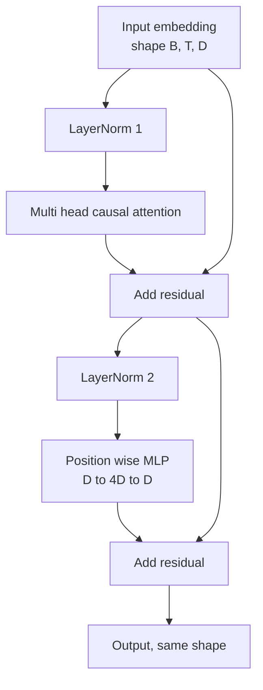
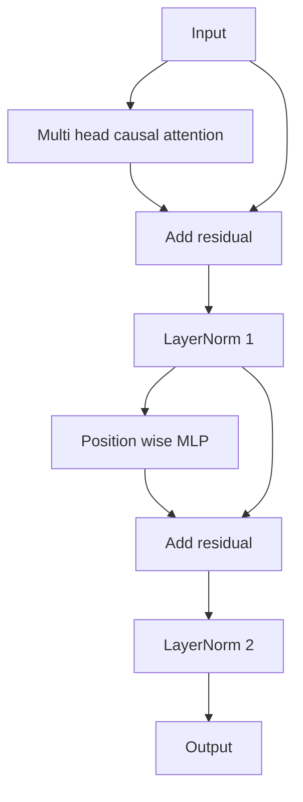

# Sıfırdan Transformer Bloğu

> Bir blok, her modern çözücü (decoder) LLM'nin birimidir. Katman normalleştirmesi (LayerNorm), çok kafalı dikkat, artık bağlantı (residual), MLP, artık bağlantı. Pre-LN varyantı warmup olmadan kararlı eğitilir. Post-LN varyantı orijinal makalenin gönderdiğidir. Bu ders ikisini yan yana inşa eder ve yaygın öğrenme oranlarında 12 katmanlı bir yığında hangisinin hayatta kaldığını gösterir.

**Tür:** Uygulama
**Diller:** Python
**Ön Koşullar:** Faz 19 ders 30-33 (tokenlayıcı, gömme'ler, dikkat matematiği, toplu veri yükleyici)
**Süre:** ~90 dakika

## Öğrenme Hedefleri

- Dört hareketli parçadan bir transformer bloğu PyTorch'ta inşa etmek: LayerNorm, çok kafalı nedensel dikkat, artık bağlantılar, konum-bilgili MLP.
- LayerNorm'ları iki yapılandırmada (pre-LN ve post-LN) yerleştirmek ve birinin warmup olmadan neden kararlı eğitildiğini açıklamak.
- Çok kafalı dikkat içinde nedensel maskeleme uygulamak, böylece token `i` token `j > i` olanları göremez.
- Her iki varyantta 12 katmanlı bir yığın üzerinden gradyan akışını izlemek ve sonucu el yordamıyla yorum yapmadan okumak.
- Bloğu, sonraki ders 124 milyon parametreli bir GPT'yi monte ettiğinde tak-çıkar (drop-in) bir birim olarak yeniden kullanmak.

## Problem

Bir transformer, bir bloğun tekrarından ibarettir. Bloğu bir kere yanlış alın, on iki kez tekrarlayın ve ilk dönemde ıraksayan ya da geri kalan yolda warmup hileleri gerektiren bir model gönderirsiniz. Bu derste göreceğiniz iki başarısızlık modu egzotik değildir. Bir öğrenci blokları safça yığdığında ilk seferde ortaya çıkarlar. Biri, dikkat katmanının geleceğe dikkat etmesidir. Diğeri, LayerNorm'un derinlikte artık sinyali evcilleştiremeyeceği bir yere yerleştirilmesidir.

Düzeltme bir kez gördüğünüzde mekaniktir. Bloğun tam olarak iki artık yolu ve tam olarak iki normalleştirme konumu vardır. Konumları doğru seçin ve yığının geri kalanı sadece defter tutmadır (bookkeeping).

## Kavram

Her yalnızca çözücü (decoder-only) transformer bloğu, `(batch, sequence, embedding)` şeklinde bir tensörü alan ve aynı şekilde bir tensörü döndüren bir fonksiyondur. İçeride, iki alt katman işi yapar.



#### Açıklama
Bu diyagram pre-LN varyantını gösterir. LayerNorm artık dalın içinde, alt katmandan önce oturur. Artık bağlantı, normalleştirilmemiş sinyali ileri taşır.

Bu, pre-LN varyantıdır. LayerNorm, artık dalının içinde, alt katmandan önce oturur. Artık bağlantı, normalleştirilmemiş sinyali ileri taşır.

Post-LN varyantı, LayerNorm'u artık toplamadan sonraya taşır.



#### Açıklama
Bu diyagram post-LN varyantını gösterir. LayerNorm'lar artık toplamadan sonra yerleşir. Bu, 2017 makalesinin orijinal tasarımıdır.

Biçim aynıdır. Eğitim davranışı değil. Post-LN ile, artık yolundan geri akan gradyanın LayerNorm'dan geçmesi gerekir. Derinlik on iki ve `3e-4` öğrenme oranında, o gradyan warmup zamanlaması gerektirecek kadar hızlı küçülür. Pre-LN, artık yolunu normalleştirilmemiş bırakır, böylece gradyanlar gömme katmanına temiz bir şekilde yayılır. Pre-LN, GPT-2 ve sonrasının bu nedenle gönderdiği yapılandırmadır.

### Nedensel çok kafalı dikkat

Dikkat alt katmanı, girdiyi üç yollu olarak sorgu, anahtar ve değer tensörlerine projekte eder. Her biri `(B, T, D)`'den `(B, H, T, D/H)`'a yeniden şekillendirilir; burada `H` kafa sayısıdır. Ölçekli dot ürün dikkati `softmax(Q K^T / sqrt(d_k))`'yi kafa başına hesaplar, üst üçgeni eksi sonsuza maskeler, maskeyi softmax aracılığıyla uygular, sonra `V` ile çarpar. Kafalar tek bir `(B, T, D)` tensörüne bitiştirilir ve bir kez daha projekte edilir. Modeli nedensel yapan tek parça maskedir. Maskeyi unutun ve hile yapan bir model eğitirsiniz.

### MLP

Konum-bilgili (position-wise) MLP, aynı iki katmanlı ağı her token'a bağımsız olarak uygular. Gizli genişlik, gömme genişliğinin dört katıdır, aktivasyon GELU'dur ve bir dropout ikinci doğrusalın ardından gelir. MLP içinde hiçbir token diğeriyle konuşmaz. Tüm token karıştırma dikkatte olur.

### Artık bağlantılar iki şey yapar

Gradyan yolunu derinlik boyunca toplamsal yapar, bu da gradyan normunu on iki katman boyunca ölçekte tutar. Ayrıca her bloğun, çalışan temsile tam bir değiştirme yerine toplamsal bir güncelleme öğrenmesine izin verirler. Her iki etki de bloğun ölçeklenmesinin nedenidir.

## İnşa Et

`code/main.py` şunları uygular:

- Öğrenilebilir ölçek ve kayma, yanlı eps (biased eps), token vektörü başına uygulanan `class LayerNorm`.
- `num_heads`, `head_dim = d_model // num_heads`, birleşik QKV projeksiyonu, kayıtlı nedensel maske, dikkat ve artık dropout ile `class MultiHeadAttention`.
- İki doğrusal katman, GELU aktivasyonu, dropout ile `class FeedForward`.
- İki varyant arasında geçiş yapan `pre_ln` bayrağıyla `class TransformerBlock`.
- Aynı girdilerle 6 katmanlı bir pre-LN yığını ve 6 katmanlı bir post-LN yığını inşa eden ve (a) çıktı şeklini, (b) bir geri geçişten sonra gömme'deki gradyan normunu yazdıran bir demo.

Çalıştırın:

```bash
python3 code/main.py
```

Çıktı: her iki yığında şekil denetimi, gradyan normları yan yana. Pre-LN yığınının gömme gradyanı, aynı öğrenme oranında post-LN yığınından bir büyüklük mertebesi daha büyüktür; bu, pre-LN'nin warmup olmadan eğittiğinin ampirik sinyalidir.

## Yığın

- Tensör matematiği, autograd ve `nn.Module` tesisatı için `torch`.
- Hayır `transformers`, hayır önceden eğitilmiş ağırlıklar. Blok ilkellerden uygulanır.

## Vahşi Doğadaki Üretim Desenleri

Üç desen, ders kitabı bloğunu gönderebileceğiniz bir şeye dönüştürür.

**Birleşik QKV projeksiyonu.** Üç ayrı doğrusal katman, üç çekirdek başlatma ve üç matmul'a mal olur. Genişliği `3 * d_model` olan tek bir doğrusal katman, aynı işi tek bir başlatmada yapar, sonra çıktıyı son eksen boyunca böler. Birleşik yol, her hızlandırıcıda daha hızlıdır ve GPT-2, LLaMA ve Mistral'ın referans uygulamalarının hepsinin gönderdiği şeyle eşleşir.

**Kayıtlı nedensel maske buffer'ı.** Maske yalnızca maksimum bağlam uzunluğuna bağlıdır. Yapım sırasında `register_buffer` ile bir kez ayırın, ileri geçiş başına etkin pencereyi dilimleyin ve çağrı başına ayırmayı atlayın. Bunu unutmak, uzun bağlamda maskeyi bir ayırıcı sıcak noktasına dönüştürür.

**İki yerde dropout, üç yerde değil.** Dropout, dikkat softmax'ından sonra (attention dropout) ve MLP'nin ikinci doğrusalından sonra (residual dropout) aittir. Artığın üzerindeki bir dropout, gradyanın derinlikte akmasına izin veren toplamsal kimliği bozar. Bazı erken uygulamalar bunu yanlış yaptı ve kırılgan eğitimle ödedi.

## Kullan

- Bu dersteki blok, otuz beşinci dersteki GPT montajına hiçbir değişiklik yapılmadan takılır.
- Pre-LN varyantı, her modern açık ağırlıklı LLM'nin kullandığı şeydir. Post-LN varyantı, orijinal 2017 dikkat makalesinin kullandığı şeydir. İkisini bilmek, karşılaşacağınız her çözücü mimarisini okumak için yeterlidir.
- GELU'yu SiLU ile değiştirin, LLaMA ailesi aktivasyonunu elde edersiniz. LayerNorm'u RMSNorm ile değiştirin, LLaMA ailesi normalleştirmesini elde edersiniz. Aynı iskelet.

## Alıştırmalar

1. Bloktaki her doğrusala bir `bias=False` bayrağı ekleyin. Modern açık ağırlıklı LLM'ler, doğrusal katmanlar üzerinde bias olmadan gönderilir. 12 katmanlı 768 boyutlu bir modelde kaç parametre tasarruf ettiğinizi ölçün.
2. `nn.LayerNorm`'u el yapımı bir RMSNorm ile değiştirin ve çıktı şeklinin değişmediğini doğrulayın.
3. İlk kafa için dikkat ağırlıklarını `(B, T, T)` tensörü olarak döndüren bir bayrak ekleyin. Üst üçgenin softmax'tan sonra sıfır olduğunu doğrulamak için çizin.
4. `(2, 16, 384)` tensörünü `H=6` ile her iki varyanttan geçiren ve ağırlıklar aynı şekilde başlatıldığında ve dropout sıfıra ayarlandığında ileri çıktıların farklı olduğunu doğrulayan bir sağlamlık denetimi inşa edin (örneğin, `not torch.allclose`).

## Anahtar Terimler

| Terim | İnsanların söylediği | Gerçek anlamı |
|------|------------------------|----------------|
| Pre-LN | "Pre norm" | Artık dalın içindeki, her alt katmandan önceki LayerNorm; artık, normalleştirilmemiş sinyali taşır |
| Post-LN | "Post norm" | Artık toplamadan sonraki LayerNorm; 2017 makalesinin gönderdiği ve warmup gerektiren |
| Nedensel maske | "Üçgen maske" | Token i'nin, j > i olduğunda token j'yi okuyamaması için dikkat logitlerinin üst üçgeninin eksi sonsuza ayarlandığı |
| Birleşik QKV | "Birleşik projeksiyon" | D genişliğinde üç doğrusal yerine 3D genişliğinde tek doğrusal; bir çekirdek, bir matmul |
| Artık akış (Residual stream) | "Atlama bağlantısı" | Her bloktan yukarıdan aşağıya akan normalleştirilmemiş tensör; her bloğun eklediği şey |

## Daha Fazla Okuma

- Bu bloğun altındaki dikkat matematiği için Faz 7 ders 02 (sıfırdan öz-dikkat).
- Aynı iskeletin kodlayıcı-çözücü sürümü için Faz 7 ders 05 (tam transformer).
- Bu bloğu bir eğitim yordamıyla süren Faz 10 ders 04 (ön eğitim mini GPT).
- Bu bloğun on iki tanesini bir GPT modeline yığan Faz 19 ders 35 (bu track).
