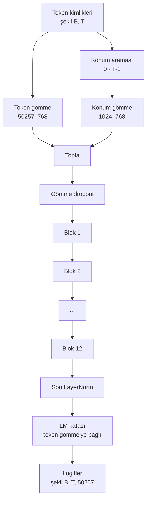
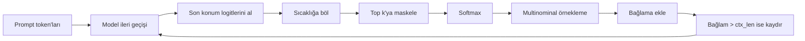

# GPT Model Montajı (Assembly)

> On iki blok yığılmış, bir token gömme, bir öğrenilmiş konum gömme, bir son LayerNorm ve bağlı bir dil modeli kafası (head). İşte tüm 124 milyon parametreli GPT modeli. Bu ders, bu parçaları çalışan bir sınıfta bir araya getirir, parametreleri sayarak modelin referans 124M şekliyle eşleştiğini doğrular ve multinominal örnekleme, sıcaklık ve top-k ile metin üretir.

**Tür:** Uygulama
**Diller:** Python
**Ön Koşullar:** Faz 19 ders 30 - 34
**Süre:** ~90 dakika

## Öğrenme Hedefleri

- 34. dersteki transformer bloğunu tam bir GPT modeline monte etmek: token gömme, konum gömme, N blok, son LayerNorm, dil modeli kafası.
- 124 milyon parametreli yapılandırmayı yeniden üretmek: vocab 50257, bağlam 1024, gömme 768, on iki kafa, on iki katman.
- Dil modeli kafası ağırlıklarını token gömme'ye bağlamak ve bunun neden bu ölçekte ~38 milyon parametre tasarruf ettiğini açıklamak.
- Bir prompt'tan, multinominal örnekleme, sıcaklık ölçekleme ve top-k kırpılması ile metin üretmek; bağlam uzunluğunu kayan pencere ile tutmak.
- Parametre sayısını ve ileri geçiş maliyetini 124M hedefine karşı ölçmek.

## Problem

Bir transformer bloğu tek başına hiçbir şey yapmaz. Token kimliklerini vektörlere dönüştürmeniz, konumsal bilgiyi karıştırmanız, onları yığından geçirmeniz ve tekrar sözlük logitlerine projekte etmeniz gerekir. Bu dört adımdan herhangi birini unutursanız, model ya ileri geçemez, konum bilgisinde kayar ya da konuşamaz.

Modelin şekli de önemlidir. Referans GPT-2 small, yukarıdaki yapılandırmada tam olarak 124 milyon parametredir. Sayılar sihirli değildir. Vocab 50257 çarpı gömme 768, token tablosudur. Konum 1024 çarpı 768, konum tablosudur. Blok başına yaklaşık 7 milyon parametreyle on iki blok, 84 milyondur. Son kafa, ağırlık bağlama (weight tying) ile token tablosunu yeniden kullanır. Parçaları topladığınızda 124 milyona ulaşırsınız. Parametre sayısı referansla eşleşmeyen bir model inşa etmek, bir şeyi yanlış bağladığınızın işaretidir.

## Kavram



#### Açıklama
Bu diyagram, kimliklerin vektörlere nasıl dönüştüğünü, konumların nasıl eklendiğini ve sonunda dil modeli kafasına nasıl bağlandığını gösterir. Ağırlık bağlama, LM kafası ve token gömme matrisinin aynı parametre tensörünü paylaşması anlamına gelir.

Token kimlikleri token vektörleri olur. Konum kimlikleri konum vektörleri olur. İkisi toplanır ve yığından geçirilir. Son LayerNorm, her modern varyantta hayatta kalan blokların dışındaki tek parçadır. LM kafası, ağırlık bağlamanın anlamı olan token gömme matrisini yeniden kullanır.

### Ağırlık bağlama (weight tying)

Token gömme, `(vocab, d_model)` şeklindedir. Dil modeli kafası, `d_model`'den geri `vocab`'a projekte etmesi gerekir. Bunlar birbirinin transpozudur. İkisini bağlamak, gerçekten aynı parametre tensörünü iki kez kullanmak anlamına gelir. Vocab 50257 ve `d_model` 768'de matris 38 milyon parametredir. Bağlanmamışsa iki kez ödersiniz. Bağlandığında bir kez ödersiniz ve ayrıca gömme ile kafanın birlikte güncellenmesi nedeniyle biraz daha temiz bir gradyan sinyali elde edersiniz.

### Konum gömme öğrenilmiştir, sinüzoidal değildir

GPT-2, öğrenilmiş bir konum gömme ile gönderilir. Konum tablosu, `(1024, 768)` şeklinde tek bir parametre tensörüdür. Model, her ileri geçişte konum 0'dan T-1'e kadar arar ve aramayı token gömme'ye ekler. Bu, en basit konum şemasıdır (RoPE, ALiBi, T5 göreli sapması alternatiflerdir) ve 124M referansının kullandığı şeydir.

### Üretim: sıcaklık, top-k, multinominal

Üretim otoregresiftir. Her adımda model, her konumda tam sözlük üzerinde logitler döndürür. Yalnızca son konumu alır, sıcaklığa bölersiniz, isteğe bağlı olarak top-k dışındaki tüm logitleri eksi sonsuza maskelersiniz, olasılıkları elde etmek için softmax uygularsınız ve ortaya çıkan dağılımdan bir token örneklerisiniz.



#### Açıklama
Bu diyagram, üretim döngüsünün her adımda bir token nasıl örneklediğini ve bağlamı nasıl yönettiğini gösterir. Sıcaklık ve top-k, dağılımın şeklini kontrol eder.

Üç düğme, üç farklı davranış. Sıcaklık sıfıra yakın, açgözlüye (greedy) çöker. Sıcaklık bir, modelin doğal dağılımıyla eşleşir. Top-k bir, açgözlüdür. Top-k kırk, uzun kuyruğu filtreler. Kombinasyonlar önemlidir; eğitim üzerine sonraki ders, üretimi niteliksel bir değerlendirme sinyali olarak kullanır.

## İnşa Et

`code/main.py` şunları uygular:

- 124M varsayılanlarıyla `class GPTConfig` veri sınıfı: `vocab_size=50257`, `context_length=1024`, `d_model=768`, `num_heads=12`, `num_layers=12`, `mlp_expansion=4`, `dropout=0.1`, `use_bias=True`, `weight_tying=True`.
- Token gömme, konum gömme, gömme dropout, on iki `TransformerBlock`, son LayerNorm ve bayrak ayarlandığında token gömme'ye bağlanan bir `lm_head` ile `class GPTModel`.
- Benzersiz parametre sayısını döndüren bir `count_parameters` yardımcısı (böylece ağırlık bağlama sayımda dikkate alınır).
- Sıcaklık, top-k, multinominal ve kayan pencere bağlamı yapan bir `generate` fonksiyonu.
- Modeli inşa eden, parametre sayısını referans 124M'nin yanına yazdıran ve boru hattının uçtan uca çalıştığını göstermek için sabit bir prompt'tan kısa bir dizi üreten bir demo.

Çalıştırın:

```bash
python3 code/main.py
```

#### Açıklama
Bu komut, demo betiğini çalıştırarak parametre sayımını yazdırır ve modelden bir örnek üretim alır. Çıktı, referans 124M sayımının yanında modelin kendi sayımını ve birkaç üretilen token kimliğini içerir.

Çıktı: parametre sayısı referans 124M'nin yanında, sabit bir prompt'tan üretilen token kimlikleri ve bağlama açıkken LM kafası ve token gömme'nin depolamayı paylaştığının onayı.

Demonun hızlı kalması için, betik aynı zamanda küçük bir yapılandırmayı (`d_model=64`, `num_layers=2`) uçtan uca çalıştırır ve üretilen token dizisini satır içi yazdırır. 124M yapılandırması inşa edilir, ancak yalnızca parametre sayımı ve bir ileri geçiş çalıştırılır.

## Yığın

- Tensör matematiği, autograd ve `nn.Module` tesisatı için `torch`.
- `code/main.py`, 34. dersteki aynı blok desenini yerel olarak yeniden uygular.

## Vahşi Doğadaki Üretim Desenleri

Üç desen, çalışan bir modelle gönderilebilir bir model arasındaki farkı yaratır.

**Artık projeksiyonları küçük başlat.** Dikkatin çıktı projeksiyonu ve MLP'nin ikinci doğrusu, doğrudan bir artık toplamaya beslenir. Bunları diğer tüm doğrusallarla aynı standart sapma ile başlatmak, artık akışını derinlikle büyütür ve son LayerNorm'u sıcak bir rejime iter. Bu iki projeksiyon için std'yi `1 / sqrt(2 * num_layers)` ile ölçeklendirin; artık akışı on iki katman boyunca sağlıklı bir aralıkta kalır.

**Konum kimliği tensörünü önbelleğe al, yeniden hesaplama.** `torch.arange(T)` her ileri geçişte yeni bellek ayırır. Maksimum bağlam için `__init__` içinde bir kez ayırın, çağrı başına ilk T girişi dilimleyin ve ayırıcı gidiş dönüşünü atlayın.

**Ağırlıkları parametre düzeyinde bağla, yalnızca kopyalama yaparak değil.** `lm_head.weight = token_embedding.weight` ayarlamak tensörü paylaşır; kopyalama paylaşmaz. Optimizer'ın tek bir parametreyi güncellemesi ve autograd grafiğinin tek bir birikime ihtiyacı vardır. Kopyalarsanız, kafa gömme'den uzaklaşır ve ağırlık bağlama size hiçbir şey kazandırmaz.

## Kullan

- Bu dersteki model sınıfı, sonraki dersin eğittiği modelle aynı şekildedir.
- Öğrenilmiş konum gömme'yi RoPE ile değiştirmek, bloğa veya kafaya dokunmadan LLaMA ailesini elde etmenizi sağlar.
- GELU'yu SiLU ile ve LayerNorm'u RMSNorm ile değiştirmek, LLaMA ailesinin geri kalan değişikliklerini elde etmenizi sağlar.
- Üretim fonksiyonu yalnızca bu modelle değil, herhangi bir logit kaynağıyla çalışır. 37. derste önceden eğitilmiş bir GPT-2 dosyasından logitleri çekebilir ve aynı üretim döngüsünü yeniden kullanabilirsiniz.

## Alıştırmalar

1. LM kafasını token gömme'den ayırın ve parametreleri yeniden sayın. Deltanın 50257 çarpı 768 = 38 milyon olduğunu doğrulayın.
2. Öğrenilmiş konum gömme'yi yapım zamanında hesaplanan bir sinüzoidal tablo ile değiştirin. Modelin hâlâ ileri geçtiğini ve parametre sayısının 786.432 azaldığını onaylayın.
3. Üretim için örneklemeyi atlayan ve argmax seçen bir `greedy=True` bayrağı ekleyin. Dizinin çalıştırmalar arasında deterministik olduğunu onaylayın.
4. Softmax'tan önce, prompt'ta veya üretilmiş geçmişte bulunan herhangi bir token'ın logitini bir sabite bölen bir `repetition_penalty` düğmesi ekleyin. Sabit bir prompt üzerinde, birden büyük değerlerin çıktıdaki tekrar sayılarını azalttığını gösterin.
5. `top_k`'nın yanına `top_p` (çekirdek) örnekleme ekleyin. Tutulan token'ların olasılıkları toplamının `top_p`'yi aştığını kontrol eden iki satırlık bir test ekleyin.

## Anahtar Terimler

| Terim | İnsanların söylediği | Gerçek anlamı |
|------|------------------------|----------------|
| Ağırlık bağlama (weight tying) | "Bağlı gömme'ler" | LM kafası ve token gömme'nin aynı parametre tensörünü paylaşması; vocab çarpı d_model parametre tasarrufu sağlar ve GPT-2 referansıyla eşleşir |
| Konum gömme | "Öğrenilmiş konumlar" | Token vektörlerine eklenen (bağlam uzunluğu, d_model) şeklinde ayrı bir tablo; uçtan uca öğrenilir |
| Kayan pencere bağlamı | "Bağlam sınırı" | Prompt artı üretilen token'lar bağlam uzunluğunu aştığında, en eski token'ları düşürerek aktif pencerenin sığmasını sağlama |
| Top-k örnekleme | "K kırpılması" | En yüksek değerli K logiti tut, geri kalanını eksi sonsuza maskele, kalanlar üzerinde softmax uygula |
| Sıcaklık | "Örnekleme sıcaklığı" | Softmax'tan önce logitleri T'ye böl; T birden küçük keskinleştirir, T bir eşit doğal dağılımı korur, T birden büyük düzleştirir |

## Daha Fazla Okuma

- Bu modelin yığdığı blok için Faz 19 ders 34.
- Bu modeli çapraz entropi kaybı ile süren eğitim döngüsü için Faz 19 ders 36.
- Önceden eğitilmiş GPT-2 ağırlıklarını tam olarak bu mimariye yüklemek için Faz 19 ders 37.
- Sonraki token tahmininin matematiği için Faz 7 ders 07 (GPT nedensel dil modelleme).
- Aynı mimarideki orijinal eğitim yordamı için Faz 10 ders 04 (ön eğitim mini GPT).
