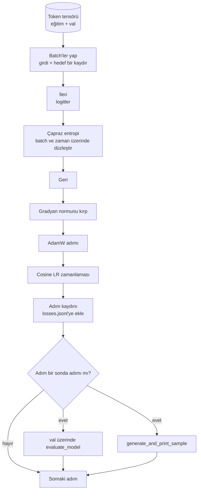

# Eğitim Döngüsü ve Değerlendirme

> Ölçmeyen bir döngü, yalan söyleyen bir döngüdür. Bu ders, GPT modelini süren eğitim döngüsünü inşa eder: ağırlık çürümesi (weight decay) bölünmüş AdamW, ısınma (warmup) artı kosinüs öğrenme oranı zamanlaması, bir `calc_loss_batch` yardımcısı, elde tutulan veri üzerinde bir `evaluate_model` geçişi, her K adımda niteliksel bir `generate_and_print_sample` sondası ve sonra çizebileceğiniz JSONL biçiminde bir kayıp günlüğü. Aynı iskelet, inşa edeceğiniz her çözücü (decoder) LLM'yi eğitir.

**Tür:** Uygulama
**Diller:** Python
**Ön Koşullar:** Faz 19 ders 30 - 35
**Süre:** ~90 dakika

## Öğrenme Hedefleri

- Sonraki token tahmini için doğru girdi ve hedef hizalamasıyla çapraz entropi kaybı hesaplayan bir eğitim döngüsü inşa etmek.
- Ağırlık tensörlerine uygulanan ve LayerNorm ya da bias tensörlerine uygulanmayan ağırlık çürümesi ile AdamW'yi yapılandırmak.
- Doğrusal ısınma ve kosinüs azalma ile bir öğrenme oranı zamanlaması uygulamak ve sonuçtaki öğrenme oranını zaman içinde okumak.
- `evaluate_model` ile elde tutulan bir bölünme üzerinde değerlendirme yapmak, böylece değerlendirme kaybı çalıştırmalar arasında karşılaştırılabilir olsun.
- Iraksama, kayıp eğrisinin yapacağından önce yakalamak için her K adımda sabit bir prompt'tan `generate_and_print_sample` ile niteliksel bir örnek üretmek.
- Adım başına kaybı JSONL'ye kalıcı kılmak, böylece eğitim günlüğünü yeniden yükleyebilir, çizebilir ve teslim edilebilir bir çıktı olarak gönderebilirsiniz.

## Problem

Kaybı yazdıran ama başka bir şey yapmayan bir eğitim betiği üç şekilde başarısız olur. Kaybın doğru nedenle düşüp düşmediğini söyleyemez (model eğitim kümesini aşırı öğrenmiş ve hiçbir şey öğrenmemiş olabilir). Bir ıraksamanın başlayıp başlamadığını söyleyemez (kayıp bir adım için sıçrayıp iyileşebilir, ya da bir adım için sıçrayıp çökebilir). Modelin ne öğrendiğini söyleyemez (kayıp bir skalerdir; üretilen örnek bir paragraftır). Üç başarısızlık da döngü ölçmediği sürece gizli kalır.

Bu dersteki döngü üç şekilde ölçer. Her adımda eğitim batch'i üzerinde kayıp. Her K adımda elde tutulan bir batch üzerinde kayıp. Her K adımda sabit bir prompt'tan üretilen bir devam. Eğitim günlüğü, çıktının döngünün tanıklığı olması için JSONL'ye yazılır.

## Kavram



#### Açıklama
Bu diyagram, eğitim döngüsünün ana bileşenlerini gösterir: batch'ler, ileri geçiş, kayıp, geri yayılım, optimizasyon adımı, LR zamanlaması, günlükleme ve periyodik değerlendirme.

İki bariz olmayan parça, kayıp hizalaması ve AdamW çürüme bölünmesidir.

### Kayıp hizalaması

Model, her konumda sonraki token'ı tahmin eder. Girdi batch'i `[t0, t1, t2, t3]` token'larıysa, hedef batch'i `[t1, t2, t3, t4]` olmalıdır. Çapraz entropi, düzleştirilmiş `(batch * seq, vocab)` şekli üzerinde, düzleştirilmiş `(batch * seq,)` hedefine karşı hesaplanır. Kaydırmayı unutursanız, modeli kendisini tahmin etmek üzere eğitirsiniz; bu, hiçbir faydalı şey öğrenmeden sıfır kayba yakınsar.

### AdamW çürüme bölünmesi

Ağırlık çürümesi, ağırlık tensörlerini düzenler ancak normalleştirme ölçeklerini veya bias'ları düzenlemez. Çürümeyi LayerNorm ölçeğine koymak, ölçeği yavaşça sıfıra sürükler ve normalleştirmeyi bozar. Bir bias'a çürüme koymak matematiksel olarak zararsızdır ama bir döngü israfıdır. Standart bölünme şudur: matris şeklindeki tensörler (doğrusal ağırlıklar, gömme tabloları) çürüme alır, ölçek veya kayma gibi görünen şeyler almaz.

### Isınma artı kosinüs zamanlaması

Isınma, öğrenme oranını birkaç yüz adımda sıfırdan hedefe yükseltir, böylece optimizer durumunun dolması için zaman tanır. Kosinüs azalma, kalan adımlar boyunca öğrenme oranını tekrar sıfıra doğru düşürür, böylece son faz ağırlıkları küçük bir adım boyutunda ince ayarlar. Kombinasyon, açık ağırlıklı LLM eğitiminde en yaygın zamanlamadır, çünkü ilk bin adımdaki ve son bin adımdaki kırılgan anların çoğunu ortadan kaldırır.

### Elde tutulan değerlendirme

`evaluate_model`, doğrulama bölünmesinden sabit sayıda batch çalıştırır, kaybı biriktirir, batch sayısına böler ve döner. Gradyan yok. Dropout yok. Sayı, aynı tohum ve aynı bölünme verildiğinde çalıştırmalar arasında yeniden üretilebilirdir. Eğitim kaybının yanında elde tutulan kaybı raporlamak, aşırı öğrenmeyi nasıl tespit edeceğinizdir.

### Niteliksel örnekleme, erken bir sinyal olarak

Eğitim kaybı güzelce düşen ama üretilen örneklerinin tümü aynı token olan bir model bozuktur. Kayıp eğrisi düz görünen ama üretilen örnekleri tutarlı kelimelere doğru keskinleşen bir model öğreniyordur. Niteliksel sonda, tam eğriyi okumaktan daha hızlı çalışır ve skalerin kaçırdığı modları yakalar.

## İnşa Et

`code/main.py` şunları uygular:

- Uzun bir token tensörünü girdi ve hedef çiftlerine dilimleyen `make_batches(token_ids, batch_size, context_length)`.
- İleri geçen, düzleştiren ve skaler çapraz entropiyi döndüren `calc_loss_batch(model, inputs, targets)`.
- Sabit sayıda doğrulama batch'ini gradsız yineleyen ve ortalama kaybı döndüren `evaluate_model(model, val_loader, max_batches)`.
- 35. dersin üretim fonksiyonunu sabit bir prompt üzerinde çalıştıran ve sonucu yazdıran `generate_and_print_sample(model, prompt, max_new_tokens)`.
- İki gruplu AdamW parametre listesini üreten `build_param_groups(model, weight_decay)`.
- Belirli bir adımda LR'yi döndüren `cosine_with_warmup(step, warmup_steps, total_steps, max_lr, min_lr)`.
- Döngüyü çalıştıran, `outputs/losses.jsonl`'yi kalıcı kılan ve her `eval_every` adımda değerlendirme kaybını ve bir örneği yazdıran `train(...)`.
- Sentez veri üzerinde küçük bir sayıda adım için küçük bir modeli eğiten, bir JSONL günlüğü yazan ve sonda noktalarında değerlendirme kaybını ve bir örneği yazdıran bir demo. Demo, CPU'da bir dakikadan çok daha kısa sürede çalışır.

Çalıştırın:

```bash
python3 code/main.py
```

#### Açıklama
Bu komut, eğitim döngüsü demolarını çalıştırır, JSONL günlüğüne yazar ve sonda noktalarında değerlendirme sonuçlarını yazdırır. Çıktı, her adımın kayıp değerini ve belirli aralıklarla üretilen örnekleri içerir.

Çıktı: adım başına kayıp satırı, her sonda adımında değerlendirme kaybı, her sonda adımında üretilmiş bir örnek ve satır başına `json.loads` ile yükleyebileceğiniz son bir `outputs/losses.jsonl`.

## Yığın

- Autograd, optimizer ve modüller için `torch`.
- `main.py`, 35. dersin `GPTModel`'ini ve destekleyici modülleri yerel olarak yeniden uygular.

## Vahşi Doğadaki Üretim Desenleri

Üç desen, ders kitabı döngüsünü bir gece boyunca çalışmaya bırakabileceğiniz bir şeye dönüştürür.

**Gradyan normu kırpma tartışılmaz.** Kötü bir batch (anomali veri, bir LR sıçraması, sayısal bir uç durum) saatlerce eğitimi silebilecek devasa bir gradyan üretir. `backward`'dan sonra ve `step`'ten önce `torch.nn.utils.clip_grad_norm_(params, max_norm=1.0)`, optimizer'ı güvenli bir aralıkta tutar. Kırpma değeri serbest bir parametredir; bir, çoğu kurulumda hayatta kalan varsayılandır.

**Yeniden başlatılabilir JSONL günlükleme, pickle edilmiş durum değil.** Adım başına kayıp kayıtlarını JSONL'de `{"step": int, "train_loss": float, "lr": float}` satırları olarak yazmak dayanıklıdır: herhangi bir çökme okunabilir bir çıktı bırakır, grep yapabilirsiniz, otuz satır Python ile çizebilirsiniz ve son adımı okuyarak eğitimi sürdürebilirsiniz. Pickle edilmiş durum, sizi dosyayı üreten tam modül düzenine bağlar ve bu, yeniden düzenlemeler arasında kırılgandır.

**Sabit bir dilimden alınan değerlendirme batch'leri.** Doğrulama token'ları, betik başlangıcında batch'lere dilimlenir, uçuş sırasında değil. Yeniden üretilebilirlik, değerlendirme batch'lerinin çalıştırmadan çalıştırmaya aynı olmasına bağlıdır; aksi takdirde iki çalıştırma arasındaki değerlendirme kaybını karşılaştırmak, modeli olduğu kadar batch karıştırmasını da ölçer.

## Kullan

- Bu dersteki döngü, gerçek veri üzerinde 124M'lik bir modeli eğiten aynı iskelettir. Sentez token tensörünü `datasets` tarzı bir yükleyici ile değiştirin ve döngü değişmeden çalışır.
- JSONL günlüğü, bir eğitim çalıştırmasını kanıta dönüştüren teslim edilebilir çıktıdır. Sonraki ders, yeni eğitilmiş bir kontrol noktasını önceden eğitilmiş bir kontrol noktasıyla karşılaştırmak için bir tane kullanır.
- Niteliksel örnek sondası, skaler kaybın değiştiremeyeceği tüm durumları yakalar.

## Alıştırmalar

1. Ölçek ve bias parametrelerinin çürüme olmayan gruba, doğrusal ve gömme ağırlıklarının çürüme grubuna yerleştirildiğini doğrulayan `weight_decay_groups()` birim testleri ekleyin.
2. Sentez rastgele token'ları küçük bir metin dosyasındaki baytlarla değiştirin, böylece demo okunabilir bir şey üzerinde eğitilir. Üretilen örneğin dosyada bulunan karakterleri kullandığını doğrulayın.
3. Kosinüs zamanlamasına `max_lr`'nin yüzde onu olan bir `min_lr` tabanı ekleyin ve yeniden çizin.
4. JSONL günlüğüne ek olarak her `eval_every` adımında bir kontrol noktası kaydedin. Model durumunu ve optimizer durumunu yeniden yükleyen bir `resume_from` bayrağı ekleyin.
5. Kaybın yanına adım başına iş hacmini (saniye başına token) günlüğe kaydedin ve sabit bir bantta kaldığını doğrulayın.

## Anahtar Terimler

| Terim | İnsanların söylediği | Gerçek anlamı |
|------|------------------------|----------------|
| Kayıp hizalaması | "Bir kaydır" | Konum 0.. T-1'deki girdi token'ları, konum 1.. T'deki hedef token'ları; çapraz entropi düzleştirilmiş şekiller üzerinde hesaplanır |
| Çürüme bölünmesi | "İki grup" | AdamW, matris şeklindeki tensörleri ağırlık çürümesiyle, ölçek veya bias tensörlerini çürüme olmadan alır |
| Isınma | "Rampa" | Öğrenme oranının sıfırdan hedefine sabit sayıda adımda tırmanması, böylece optimizer durumu dolabilir |
| Değerlendirme batch'leri | "Elde tutulan batch'ler" | Doğrulama token tensörünün sabit bir dilimi, betik başlangıcında bir kez dilimlenir, her sondada aynı şekilde kullanılır |
| Niteliksel sonda | "Örnek yazdırma" | Kaybın tek başına gizlediği başarısızlık modlarını yakalamak için her K adımda sabit bir prompt'tan yazdırılan kısa bir üretim |

## Daha Fazla Okuma

- Döngünün süreceği model için Faz 19 ders 35.
- Aynı modele önceden eğitilmiş ağırlıkları yüklemek için Faz 19 ders 37.
- Gerçek veri üzerindeki yordam için Faz 10 ders 04 (ön eğitim mini GPT).
- Çapraz entropi kaybının ötesindeki daha geniş değerlendirme yüzeyi için Faz 10 ders 10 (değerlendirme).
