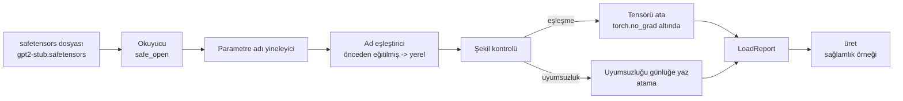

# Önceden Eğitilmiş Ağırlıkları Yükleme

> 124 milyon parametreli bir modeli sıfırdan eğitmek bir bütçe kararıdır; yayınlanmış bir kontrol noktasını yüklemek bir Salı günüdür. Bu ders, önceden eğitilmiş GPT-2 tarzı ağırlıkları bir safetensors dosyasından 35. dersteki tam mimariye yükler, parametre adı eşlemesini parça parça yürütür ve yüklemenin işe yaradığını kanıtlamak için sağlamlık olarak bir devam üretir. Ağ yok, üçüncü taraf yükleyici yok, opak sihir yok.

**Tür:** Uygulama
**Diller:** Python
**Ön Koşullar:** Faz 19 ders 30 - 36
**Süre:** ~90 dakika

## Öğrenme Hedefleri

- `safetensors` Python kütüphanesi ile bir safetensors dosyasını okumak ve tensör adlarını ve şekillerini incelemek.
- Her önceden eğitilmiş parametre adını 35. dersin GPT modelindeki bir parametre üzerine eşlemek.
- Yayınlanmış GPT-2 ağırlıkları ile bu izdeki model arasında farklılık gösteren iki adlandırma kuralını ele almak: `wte/wpe/h. N.attn.c_attn/c_proj` ve `mlp.c_fc/c_proj` ile yerel olarak adlandırılmış `tok_embed/pos_embed/blocks. N.attn.qkv/out_proj` ve `mlp.fc1/fc2`.
- Herhangi bir ağırlık atamasından önce şekil uyumsuzluğunu algılamak ve açık bir hata ile reddetmek.
- Yüklenen ağırlıklarla kısa bir devam üretmek ve token'ların yüklenen dağılımdan geldiğini, rastgele başlatılan dağılımdan değil, onaylamak.

## Problem

Yayınlanmış ağırlıklar, sizin mimariniz için paketlenmemiştir. Orijinal uygulamanın kullandığı adları taşırlar. Önceden eğitilmiş dosya, `(2304, 768)` şeklinde `transformer.h.0.attn.c_attn.weight` içerir; sizin modeliniz, `(2304, 768)` şeklinde `blocks.0.attn.qkv.weight` bekler (bu, farklı bir düzen kuralında aynı matristir) ya da modeliniz `nn. Linear` kullanır ve matrisi transpoze edilmiş olarak saklar. Aynı parametre, üç ince farklı kimlikle (ad, şekil, bayt düzeni) ortaya çıkar ve yükleyicinin üçünü de uzlaştırması gerekir.

Körü körüne kopyalayan bir yükleyici, doğru tensörü yanlış yere koyar ve saçma üreten bir model elde edersiniz. Şekil farklı olduğunda kopyalamayı reddeden ama hiçbir şey günlüğe yazmayan bir yükleyici, hangi tensörün başarısız olduğunu tahmin etmenizi bırakır. Bu dersteki yükleyici açıktır: her atama günlüğe kaydedilir, her şekil kontrol edilir ve bir `LoadReport`, ne olduğunu okuyabilmeniz için isabetleri, eksikleri ve şekil uyumsuzluklarını özetler.

## Kavram



#### Açıklama
Bu diyagram, yükleyicinin genel akışını gösterir: tensör adlarını oku, eşle, şekli kontrol et, ya ata ya da günlüğe yaz. Sonunda bir sağlamlık üretimi çalıştırılır.

Ad eşleştirici sadece bir string'den string'e bir fonksiyondur. Şekil kontrolü bir if'tir. Atama, `torch.no_grad()` içinde gerçekleşir, böylece autograd yüklemeyi izlemez. Rapor, her adın sonucunu tutar.

### GPT-2 adlandırma kuralı

Yayınlanmış GPT-2 ağırlıkları şu adlar altında yaşar:

| Önceden eğitilmiş ad | Şekil | Anlam |
|-----------------|-------|---------|
| `wte.weight` | (50257, 768) | Token gömme |
| `wpe.weight` | (1024, 768) | Konum gömme |
| `h. N.ln_1.weight` | (768,) | Blok N'deki LayerNorm 1 ölçeği |
| `h. N.ln_1.bias` | (768,) | Blok N'deki LayerNorm 1 kayması |
| `h. N.attn.c_attn.weight` | (768, 2304) | Birleşik QKV doğrusal ağırlık |
| `h. N.attn.c_attn.bias` | (2304,) | Birleşik QKV doğrusal bias |
| `h. N.attn.c_proj.weight` | (768, 768) | Dikkat çıktı projeksiyonu |
| `h. N.attn.c_proj.bias` | (768,) | Dikkat çıktı projeksiyonu bias |
| `h. N.ln_2.weight` | (768,) | LayerNorm 2 ölçeği |
| `h. N.ln_2.bias` | (768,) | LayerNorm 2 kayması |
| `h. N.mlp.c_fc.weight` | (768, 3072) | MLP fc1 ağırlık |
| `h. N.mlp.c_fc.bias` | (3072,) | MLP fc1 bias |
| `h. N.mlp.c_proj.weight` | (3072, 768) | MLP fc2 ağırlık |
| `h. N.mlp.c_proj.bias` | (768,) | MLP fc2 bias |
| `ln_f.weight` | (768,) | Son LayerNorm ölçeği |
| `ln_f.bias` | (768,) | Son LayerNorm kayması |

#### Açıklama
Bu tablo, yayınlanmış GPT-2 ağırlık dosyasındaki tensör adlarını ve karşılık gelen şekillerini özetler. Yükleyicinin bu isimleri modelin yerel adlarına dönüştürmesi gerekir.

Planlanması gereken iki sürpriz. `c_attn`, `c_proj`, `c_fc` doğrusalları, `nn. Linear.weight`'in beklediğine göre matrisin transpoze edilmiş haliyle saklanır. Yükleyici atama sırasında transpoze eder. LM kafası dosyada yoktur; model `wte` ile ağırlık bağlamaya güvenir, böylece kafa, `wte` yerine oturduktan sonra diğer adla ayarlanır.

### Yerel adlandırma kuralı

Bu izdeki model açıklayıcı adlar kullanır:

| Yerel ad | Anlam |
|------------|---------|
| `tok_embed.weight` | Token gömme |
| `pos_embed.weight` | Konum gömme |
| `blocks. N.ln1.scale` | Blok N'deki LayerNorm 1 ölçeği |
| `blocks. N.ln1.shift` | LayerNorm 1 kayması |
| `blocks. N.attn.qkv.weight` | Birleşik QKV |
| `blocks. N.attn.qkv.bias` | Birleşik QKV bias |
| `blocks. N.attn.out_proj.weight` | Dikkat çıktı projeksiyonu |
| `blocks. N.attn.out_proj.bias` | Çıktı projeksiyonu bias |
| `blocks. N.ln2.scale` | LayerNorm 2 ölçeği |
| `blocks. N.ln2.shift` | LayerNorm 2 kayması |
| `blocks. N.mlp.fc1.weight` | MLP fc1 |
| `blocks. N.mlp.fc1.bias` | MLP fc1 bias |
| `blocks. N.mlp.fc2.weight` | MLP fc2 |
| `blocks. N.mlp.fc2.bias` | MLP fc2 bias |
| `final_ln.scale` | Son LayerNorm ölçeği |
| `final_ln.shift` | Son LayerNorm kayması |

Eşleme sabit bir fonksiyondur. Ders, yükleyicinin yinelediği bir dict olarak gönderir.

### Stub fiktürü

Gerçek GPT-2 ağırlıkları 0,5 GB'dir. Demo bunları indirmez; ilk çalıştırmada, tam GPT-2 adlandırma kuralıyla ve 768 yerine `d_model` 192 olan 12 bloklu bir modele uygun şekillerle küçük bir safetensors fiktürü üretir. Fiktür, yükleyicideki her kod yolunu çalıştırmak için doğru yapıya sahiptir. Fiktürü gerçek dosyayla değiştirin ve yükleyici değişiklik yapılmadan çalışır.

## İnşa Et

`code/main.py` şunları uygular:

- Bu dersi kendi kendine yeterli kılmak için 35. dersin `GPTModel`'inin küçük bir kopyası.
- Katman başına girişleri genişleten `make_pretrained_to_local(num_layers)`.
- Adları yineleyen, eşleyen, şekli kontrol eden, conv1d tarzı ağırlıkları transpoze eden ve `torch.no_grad()` altında atayan `load_safetensors(model, path)`. Bir `LoadReport` döndürür.
- Tam önceden eğitilmiş adlandırma kuralıyla bir fiktür dosyası üreten `make_stub_safetensors(path, cfg)`.
- İlk çalıştırmada `outputs/gpt2-stub.safetensors` oluşturan, taze bir model inşa eden, rastgele başlatmadan bir üretilmiş devam yakalayan, stub'ı yükleyen, başka bir devam yakalayan, ikisini yazdıran ve ikisinin farklı olduğunu doğrulayan bir demo (yükleme gerçekten modeli değiştirdi).

Çalıştırın:

```bash
python3 code/main.py
```

Çıktı: fiktür yolu, ad başına yükleme günlüğü, bir `LoadReport` özeti, yüklemeden önce bir devam, yüklemeden sonra bir devam ve fiktüre bilerek eklenen tek bir kötü tensör üzerindeki bir şekil uyumsuzluğu, böylece başarısızlık yolu da çalıştırılır.

## Yığın

- Disk üzerindeki biçim ve akan okuyucu için `safetensors`.
- Model ve atama matematiği için `torch`.
- `transformers` yok, `huggingface_hub` yok, ağ çağrısı yok.

## Vahşi Doğadaki Üretim Desenleri

Üç desen, yükleyicinin sizin oluşturmadığınız ağırlıklarla temas halinde hayatta kalmasını sağlar.

**Herhangi bir atamadan önce dosyayı doğrula.** Dosyayı açın, her tensör adını dtype ve şekliyle listeleyin, eşlemeyi şekil kontrolleriyle tam olarak çalıştırın ve yalnızca başarı durumunda atamaya başlayın. Yarı yüklenmiş modeller sessiz başarısızlık makineleridir.

**Her atamayı kaynak adı ve hedef adıyla günlüğe kaydet.** Bir şey yanlış göründüğünde, günlük hangi tensörün nereye yerleştiğini söyler; alternatif olarak hex dökümlerini okumaktır. Bu dersteki `LoadReport` veri sınıfı, `loaded`, `missing`, `unexpected` ve `shape_mismatch` listelerini izler ve sonunda bir özet yazdırır.

**LM kafası, ayrı bir kopya değil, bir ağırlık bağlama diğer adıdır.** `tok_embed`'i yükledikten sonra `model.lm_head.weight = model.tok_embed.weight` ayarlamak kanonik desendir. Gömme matrisini taze bir `lm_head.weight` parametresine kopyalamak bağlamayı bozar ve parametre sayınızı sessizce ikiye katlar.

## Kullan

- Yükleyici, önceden eğitilmiş adlandırma kuralını kullanan herhangi bir safetensors dosyası için çalışır. Gerçek GPT-2 dosyaları (small / medium / large / xl) kod değişikliği olmadan çalışır; yalnızca model yapılandırması farklıdır.
- Aynı desen, ad haritasını güncelledikten sonra LLaMA, Mistral, Qwen ağırlıklarına genişler. Şekil kontrolleri ve rapor aynı kalır.
- Yüklemeden sonra sağlamlık üretimi hızlı bir kapıdır: yükleme sonrası örnekler yükleme öncesı örnekler gibi görünüyorsa, yükleme modeli değiştirmedi demektir, bu da eşlemenin her tensörü sessizce kaçırdığı anlamına gelir.

## Alıştırmalar

1. Her tensörü atama sırasında bir hedef dtype'a (`bfloat16`, `float16`, `float32`) dönüştüren yükleyiciye bir `dtype` argümanı ekleyin. `float32` bir modelin `bfloat16`'ya indirgenebileceğini ve hâlâ üretebileceğini doğrulayın.
2. `h. N` indisleri modelin `num_layers`'ıyla eşleşmeyen bir kontrol noktasını yüklemeyi reddeden bir `expected_layers` argümanı ekleyin.
3. Yükleyiciyi 35. dersin üretim fonksiyonuna bağlayın ve yan yana iki örnek üretin: biri rastgele başlatmadan, biri yüklenen fiktürden.
4. Bir dışa aktarma yolu ekleyin: mevcut model durumunu, önceden eğitilmiş adlandırma kuralını kullanarak taze bir safetensors dosyasına yazın. Yükleyicide gidiş-dönüşü yapın ve raporun sıfır şekil uyumsuzluğu olduğunu doğrulayın.
5. LLaMA adlandırma kuralını (bias yok, RMSNorm, birleşik qkv düzeni) ele almak için `NAME_MAP`'i genişletin ve ürettiğiniz bir stub LLaMA fiktüründe yükleyiciyi yeniden çalıştırın.

## Anahtar Terimler

| Terim | İnsanların söylediği | Gerçek anlamı |
|------|------------------------|----------------|
| Ad haritası | "Anahtar yeniden eşleme" | Önceden eğitilmiş tensör adlarından yerel parametre adlarına fonksiyon; genellikle bir döngüde katman indisi üzerinde genişletilen, giriş başına bir girişe sahip değişmez bir dict |
| Şekil uyumsuzluğu | "Kötü şekil" | Önceden eğitilmiş tensör eşlenen ad altında var, ancak boyutları yerel parametreyle uyuşmuyor; yükleyici atamayı reddeder ve çifti günlüğe yazar |
| Yüklemede transpoze | "Conv1d düzeni" | Yayınlanmış GPT-2, dikkat ve MLP projeksiyonlarını `nn. Linear`'ın beklediğinin transpoze halinde saklar; yükleyici atama sırasında transpoze eder |
| Ağırlık bağlama diğer adı | "Paylaşılan LM kafası" | `model.lm_head.weight = model.tok_embed.weight` ayarlayarak kafanın ve gömme'nin depolamayı paylaşmasını sağlama; kafa bu nedenle dosyada yok |
| Yükleme raporu | "Kapsam özeti" | `loaded`, `missing`, `unexpected` ve `shape_mismatch` listelerini izleyen küçük bir veri sınıfı; yazdırmak, yüklemenin başarılı olup olmadığını söylemenin yoludur |

## Daha Fazla Okuma

- Ağırlıkları alan mimari için Faz 19 ders 35.
- Aynı şekilde bir kontrol noktası üreten eğitim döngüsü için Faz 19 ders 36.
- Bellek kısıtlıyken yüklenen ağırlıklarla yapılacaklar için Faz 10 ders 11 (nicemleme).
- Yükleme ve çıkarım etrafındaki tam yaşam döngüsü için Faz 10 ders 13 (eksiksiz bir LLM boru hattı inşa etme).
