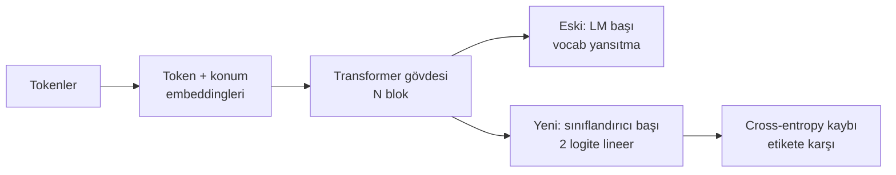
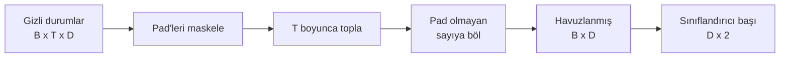
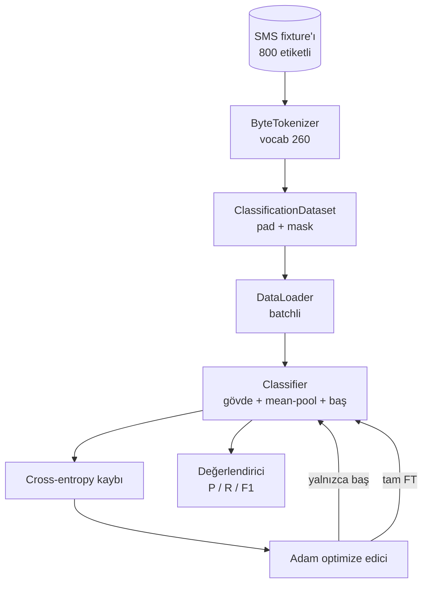

> **Orijinal İçerik:** [docs/en.md](https://github.com/rohitg00/ai-engineering-from-scratch/blob/main/phases/19-capstone-projects/38-classifier-finetuning/docs/en.md)

# Capstone Ders 38: Head Swap ile Sınıflandırıcı İnce Ayarı (Fine-Tuning)

> Track B'nin ilk capstone dersi. Önceden eğitilmiş bir dil modeli, self-attention bloklarından oluşan ve token tahmin başı ile biten bir yığındır. Spam ve ham ayrımı istediğinizde baş yanlış olur ama gövde çoğunlukla doğrudur. Bu derste başı söküyor, pooled (havuzlanmış) temsilin üzerine iki sınıflı bir lineer katman yapıştırıyor ve sınıflandırıcıyı iki farklı şekilde eğitiyoruz: yalnızca son katman ve tam ince ayar. Değerlendirme, ayrılmış bir bölünme üzerinde precision, recall ve F1 skorudur. Her stratejinin ne kazandırdığını ve neye mal olduğunu öğreneceksiniz.

**Tür:** Uygulama
**Diller:** Python (torch, numpy)
**Ön Koşullar:** Faz 19 dersleri 30-37 (NLP LLM track: tokenizer, embedding tablosu, attention (dikkat) bloğu, transformer gövdesi, ön eğitim döngüsü, kontrol noktası, üretim, perplexity)
**Süre:** ~90 dakika

## Öğrenme Hedefleri

- Gövdeyi yeniden başlatmadan dil modeli başını bir sınıflandırma başı ile değiştirme.
- Eğitim döngüsünü paylaşan iki eğitim rejimi uygulamak: dondurulmuş gövde (yalnızca baş) ve tam ince ayar.
- Tokenizer farkındalığı olan, padding yapan, padding maskeleyen ve attention çıktısını havuzlayan bir veri hattı kurmak.
- Ham logits üzerinden precision (kesinlik), recall (duyarlılık), F1 ve karışıklık matrisini (confusion matrix) hesaplamak.
- Parametre sayısı, eğitim süresi ve tavan payı (headroom) arasındaki dengeyi tartışmak.

## Sorun

Genel bir derlem (corpus) üzerinde küçük bir transformer'ı önceden eğittiniz. Çıktı başı, son gizli durumu 1000 tokenlik bir kelime dağarcığına yansıtır. Şimdi elinizde spam veya ham olarak etiketlenmiş 800 SMS mesajı var ve ikili bir sınıflandırıcı istiyorsunuz. Üç seçenek var.

Yanlış seçenek, 800 örnek üzerinde sıfırdan yeni bir sınıflandırıcı eğitmektir. Önceden eğitilmiş modelin gövdesi zaten yararlı yapı kodluyor: kelime kimliği, konum, basit birlikte bulunma (co-occurrence). Bunu çöpe atmak, onu inşa eden hesaplamayı boşa harcamak demektir.

İki doğru seçenek, gövdenin dondurulduğu head swap ve gövdenin eğitilebilir olduğu head swap'tır. Yalnızca baş eğitimi hızlıdır, bellekte neredeyse bedavadır ve bu kadar az veriyle nadiren aşırı öğrenir (overfit). Tam ince ayar daha yavaştır, küçük veriyle aşırı öğrenebilir, ancak downstream alanı ön eğitim derleminden saptığında daha yüksek doğruluğa ulaşır.

Bu ders ikisini de kurar, böylece aynı fixture (sabit test verisi) üzerinde karşılaştırabilirsiniz.

## Kavram

Model, `f_theta(tokens) -> hidden_states` fonksiyonudur. Baş, `g_phi(hidden) -> logits` fonksiyonudur. Baş değiştirmek, `theta`'yı tutmak ve `g_phi`'yi değiştirmek demektir. Gövdenin parametreleri pahalı kısımdır. Baş, tek bir lineer katmandır.

İki eğitilebilir parametre kümesi önemlidir:

- `theta` (gövde): her attention bloğu için on binlerce ağırlık.
- `phi` (baş): `hidden_dim * num_classes` ağırlık artı bir bias.

Yalnızca baş eğitiminde `phi`'ye karşı gradyan hesaplar, `theta`'ya karşı gradyanları sıfırlarsınız. PyTorch, gövde parametrelerinde `requires_grad=False` ayarlayarak bunu yapmanıza izin verir. Optimize edici yalnızca başı görür ve gövde donmuş kalır.

Tam ince ayarda gradyanların tüm yığın boyunca geri akmasına izin verirsiniz. Gövdenin ağırlıkları, sınıflandırma amaç fonksiyonuna uyacak şekilde kayar. Risk, küçük veri üzerinde feci unutmadır (catastrophic forgetting): gövdenin ön eğitimi, aşırı öğrenme gürültüsüyle yıkanır.

## Havuzlama Sorusu

Bir sınıflandırıcının, token başına bir vektör değil, dizi başına bir vektör gerekir. Üç yaygın seçenek:

- **Mean pool (ortalama havuz)**: gizli durumları dizi boyunca, attention maskesiyle ağırlıklandırılmış şekilde ortalama.
- **CLS pool**: özel bir token'ı başa ekleyin ve yalnızca onun çıktısını kullanın. BERT'in yaptığı budur.
- **Last-token pool**: son padding olmayan tokenı kullanın. GPT sınıfı sınıflandırıcıların yaptığı budur.

Bu derste, açık attention maskesi ağırlıklandırmasıyla ortalama havuzlama kullanılır. En basitidir, dizi uzunlukları arasında kararlı bir sinyal verir ve bir CLS tokenının önceden eğitilmesini gerektirmez.

## Veri

Etiketlenmiş 800 SMS mesajı, 400 spam ve 400 ham olacak şekilde dengeli biçimde, `code/main.py` içinde deterministik olarak üretilir. Üreteç sabit bir seed kullanır, şablonlar seçer ve slot dolguları yerleştirir, 5 ile 25 token uzunluğunda mesajlar üretir. Gerçek veri kümelerinin bu fixture'ın sahip olmadığı gürültüsü vardır. Fixture'ın amacı tekrarlanabilirliktir.

Veri, 80/20 bölünür: 640 eğitim, 160 test. Bölünmeler katmanlıdır (stratified), böylece test kümesi 50/50 dengesini korur. Bilinen dengeli bir ayrılmış küme, precision ve recall'ın dürüst sayılar olarak okunmasını sağlar.

## Metrikler

Pozitif sınıf olarak 1. sınıfla (spam) ikili sınıflandırma. Sayımlar:

- `TP`: spam tahmin edildi, spam idi.
- `FP`: spam tahmin edildi, ham idi.
- `FN`: ham tahmin edildi, spam idi.
- `TN`: ham tahmin edildi, ham idi.

Üç başlık metriği:

- `precision = TP / (TP + FP)`. Spam olarak işaretlenen mesajların gerçekten ne kadarı spam?
- `recall = TP / (TP + FN)`. Gerçek spam'lerin ne kadarı model tarafından işaretlendi?
- `F1 = 2 * P * R / (P + R)`. İkisinin harmonik ortalaması.

Karışıklık matrisi, dört sayımı 2x2 ızgara olarak yazdırır. Demo bunu her iki eğitim rejimi için stdout'a yazar.

## Mimari

Gövde, bilinçli olarak küçük bir transformer'dır: vocab 260, hidden 64, 4 baş, 2 blok, maksimum dizi 32. CPU'da doksan saniye içinde her iki rejimi de yakınsamaya (convergence) eğitecek kadar küçüktür. Derste önceden eğitilmez; bunun yerine `pretrain_quick` yardımcısı, gövdeye anlamlı bir başlangıç noktası vermek için aynı fixture'ın metni üzerinde beş epoch LM eğitimi yapar. Bu, dersi kendi kendine yeterli tutar.

## Ne inşa edeceksiniz

Uygulama, bir `main.py` artı bir test modülüdür (`code/tests/test_main.py`).

1. `ByteTokenizer`: byte'ları id'lere eşler, bir pad id ayırır.
2. `Block`: çok başlı dikkat (multi-head attention) ve bir feed-forward katmanı ile bir transformer bloğu. Pre-norm.
3. `LMBody`: token + konum embeddingleri artı blok yığını. Gizli durumları döndürür.
4. `MeanPool`: dizi ekseni üzerinde maske ağırlıklı ortalama.
5. `Classifier`: gövde, havuz, lineer baş. Gövde, rejimler arasında aynı örnektir.
6. `freeze_body` ve `unfreeze_body`: gövde parametrelerinde `requires_grad` durumunu değiştirir.
7. `train_classifier`: bir paylaşılan döngü. Modeli ve eğitilebilir parametre grubu için yapılandırılmış bir optimize ediciyi kabul eder.
8. `evaluate`: test kümesini çalıştırır ve `Metrics(precision, recall, f1, confusion)` döndürür.
9. `run_demo`: gövdeyi kısa süre önceden eğitir, sonra yalnızca baş ve tam eğitir, değerlendirir, her iki raporu yazdırır ve sıfırla çıkar.

## Karşılaştırma neden önemli

Yalnızca baş rejimi genellikle daha hızlı eğitilir ve daha zarif bir şekilde eksik öğrenir. Bu fixture üzerinde, yalnızca baş eğitiminin yirmi epoch'undan sonra genellikle precision'ın 0.9'a, recall'ın 0.85'e yakın olduğunu görürsünüz. Tam ince ayar yaklaşık üç kat daha uzun sürer ve rastgele seed'e bağlı olarak her iki yönde birkaç puan farkla biter.

Ders bir kazanan seçmez. Sayıları ve maliyeti okumayı öğretir. 800 örnek ve küçük bir gövdede, yalnızca baş doğru seçimdir. 80.000 örnek ve daha büyük bir gövdede, tam ince ayar geri dönmeye başlar. Bu dersten alacağınız sözleşme, API'dir: aynı `train_classifier` fonksiyonu her ikisini de ele alır ve geçiş tek bir çağrıdır.

## Genişletme hedefleri

- Yalnızca son bloğu çözen üçüncü bir rejim ekleyin. Buna bazen kısmi ince ayar denir. Tam FT'den daha ucuzdur ve yalnızca baş'tan daha fazla öğrenir.
- Bir öğrenme oranı zamanlayıcısı (scheduler) ekleyin. Başta kosinüs zamanlaması artı gövdede daha küçük sabit bir oran, yaygın bir üretim kurulumudur.
- Ortalama havuzu, öğrenilmiş bir dikkat havuzu ile değiştirin: bir öğrenilmiş sorgu ile küçük bir dikkat katmanı. Bu, daha uzun dizilerde sıklıkla ortalama havuzdan daha iyi performans gösterir.

Uygulama size kancaları verir. Testler sözleşmeyi sabitler. Sayılar sizin ilerletmeniz içindir.
