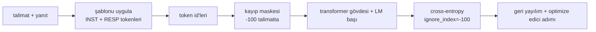
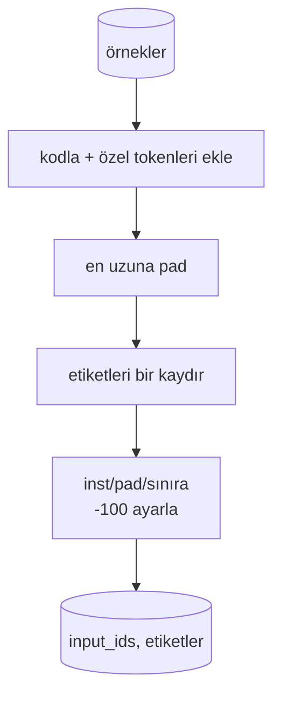
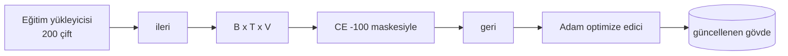

> **Orijinal İçerik:** [docs/en.md](https://github.com/rohitg00/ai-engineering-from-scratch/blob/main/phases/19-capstone-projects/39-instruction-tuning-sft/docs/en.md)

# Capstone Ders 39: Denetimli İnce Ayar ile (Supervised Fine-Tuning) Talimat Ayarı

> Önceden eğitilmiş bir temel model bir diziyi genişletebilir ancak bir talimatı takip edemez. Denetimli ince ayar (SFT) bunu düzelten en küçük değişikliktir: modele bir talimat ve istenen bir yanıt örnekleri çifti verilir ve gövde yanıt tokenlerini tahmin edecek şekilde eğitilir. Püf noktası, kaybın yalnızca yanıtı saymasını istemenizdir, talimatı değil. Bu ders, `ignore_index=-100` ile talimat tokenlerini maskeleyen özel bir collate fonksiyonuyla Alpaca tarzı bir SFT döngüsü kurar, 200 talimat-yanıt çifti üzerinde eğitir ve held-out bir bölünme üzerinde exact-match (tam eşleşme) ile değerlendirir.

**Tür:** Uygulama
**Diller:** Python (torch, numpy)
**Ön Koşullar:** Faz 19 dersleri 30-37 (NLP LLM track: tokenizer, embedding tablosu, attention (dikkat) bloğu, transformer gövdesi, ön eğitim döngüsü, kontrol noktası, üretim, perplexity)
**Süre:** ~90 dakika

## Öğrenme Hedefleri

- Eşleştirilmiş talimat-yanıt verisini açık sınır tokenleri ile tek bir nedensel (causal) diziye biçimlendirme.
- Cross-entropy'nin yalnızca yanıt tokenlerini sayması için talimat tokenlerini maskeleyen bir collate fonksiyonu kurmak.
- SFT amaç fonksiyonu altında küçük bir transformer gövdesi eğitmek ve değerlendirme metriğinin ilerleyişini izlemek.
- Yanıt başlangıç sınırına saygı gösteren açgözlü (greedy) ve sıcaklık örneklemeli üretimi uygulamak.
- Üretilen tamamlamalarda held-out exact-match hesaplamak.

## Sorun

Sonraki token tahmini üzerinde eğitilmiş bir temel modelin, talimatın ne olduğuna dair hiçbir fikri yoktur. Ona `"Fransa'nın başkenti nedir?"` dizisini gösterin; soruyu sürdürür veya yeni bir cümle uydurur. Modelin dili vardır ama format sözleşmesi yoktur.

SFT sözleşmesi bir dize şablonudur. Her eğitim örneği, üç bölgeli tek bir dizi haline gelir:

```text
<INST> Fransa'nın başkenti nedir? <RESP> Fransa'nın başkenti Paris'tir.
```

Sınır tokenleri, eğitim zamanında ayrılmış özel tokenlerdir. Model, `<RESP>`'ten sonra gelen her şeyin yanıt olduğunu ve yanıtın puanlanacak kısım olduğunu öğrenir. Temel modelin sonraki token amacı hâlâ geçerlidir; yalnızca her örneğin bu şekle sahip olduğu bir derlem üzerinde eğitilir.

Ama bir tuzak var. Tüm diziyi sıradan bir cross-entropy kaybına verirseniz, modeli talimat tokenlerini de tahmin edecek şekilde eğitmiş olursunuz. Talimat zaten verilmiştir. Bu konumlarda sıfır gradyan istiyorsunuz. Düzeltme maskedir.

## Kavram



`ignore_index`, `torch.nn.functional.cross_entropy`'nin bir özelliğidir. `ignore_index`'e eşit her hedef konumu, sıfır kayıp ve sıfır gradyan katkıda bulunur. PyTorch'taki kural `-100`'dür. Collat fonksiyonu, her örnek için iki tensör kurar: `input_ids` (tam dizi) ve `labels` (`input_ids`'in bir kopyası, talimat konumlarında `-100` ile üzerine yazılmış).

Model, ileri geçişte tüm diziyi görür; dikkat talimata yönelebilir. Kayıp yalnızca yanıt tokenlerini sayar. Tam olarak istediğiniz şey budur: talimata koşullan, yanıtı tahmin et.

## Veri

İki yüz talimat-yanıt çifti, `main.py` içinde deterministik olarak üretilir. Altı görev türünü kapsarlar:

- olgusal tek atış (X'in başkenti)
- aritmetik
- liste çıkarma
- tek cümlelik özet
- kod (print, sort)
- tanım

Her görevin şablonlu bir talimatı ve deterministik bir yanıtı vardır. Bu kasıtlı olarak basittir. Exact-match kırılgandır ve ders, doğru yanıtın tek bir belirli dize olduğu bir fixture kullanır. Gerçek SFT veri kümelerinin bulanık metriklere ihtiyacı vardır; ilke aynıdır.

Bölünmeler 160 eğitim, 40 testtir. Test kümesi altı görev türünün tümünü kapsar, böylece kategori başına exact-match raporlanabilir.

## Tokenleştirme ve Padding

Tokenizer, üç ayrılmış özel token ile byte düzeyindedir:

- `INST_ID = 256`: talimat bölgesinin başını işaretler.
- `RESP_ID = 257`: talimat ve yanıt arasındaki sınırı işaretler.
- `PAD_ID = 258`: değişken uzunluktaki batchler için padding.

Dizi `[INST] talimat_byte'ları [RESP] yanıt_byte'ları [PAD]*` şeklindedir. Collat fonksiyonu:

1. Her örneği tokenleştirir.
2. Batchteki her örneği batchteki en uzun diziye kadar padler.
3. `labels` = `input_ids`'i bir kaydırarak (nedensel LM hedefi) oluşturur, şu değişikliklerle:
 - Talimat bölgesi `-100` ile değiştirilir.
 - Padding bölgesi `-100` ile değiştirilir.
 - `RESP_ID` sınır konumunun kendisi `-100` ile değiştirilir (modeli sınır tokenini tahmin edecek şekilde eğitmezsiniz; onu izleyen şeyi tahmin eder).



Kaydırma, standart nedensel hiledir: `input_ids`'in `i` konumu, `i+1` konumundaki tokeni tahmin eder, dolayısıyla `labels[i] = input_ids[i+1]` (girişten son konum düşürülür, hedeften ilk düşürülür). Maske, kaydırmadan sonra doğru konumlara inmesi için uygulanır.

## Eğitim



Döngü, standart PyTorch SFT döngüsüdür. Adam, öğrenme oranı yaklaşık 3e-4 ila 1e-3, bu fixture üzerinde on ila yirmi epoch, zamanlayıcı yok. Model, CPU'da iki dakika içinde yakınsamaya eğitmek için yeterince küçüktür (hidden 96, 2 blok, maksimum uzunluk 64).

Her beşinci epoch'ta döngü, held-out küme üzerinde küçük bir değerlendirme geçişi çalıştırır ve exact-match yazdırır. Exact-match'in birinci epoch'ta 0.0'dan on beşinci epoch'ta 0.85 gibi bir değere geçişini izlemek dersin ödülüdür: modelin formatı ve yanıtları aynı anda öğrendiğini görebilirsiniz.

## Üretim

Değerlendirme zamanında model, `[INST] talimat_byte'ları [RESP]` talimat önekinialır ve şu durumlardan biri gerçekleşene kadar token üretir:

- dizi `max_len`'e ulaşır, veya
- model özel bir durdurma sezgiseli yayar: art arda iki cümle sonu byte'ı (`.`, `!`, `?`).

Ders, açgözlü kod çözme artı isteğe bağlı bir sıcaklık örnekleyicisi sunar. Exact-match açgözlü kullanır çünkü sıcaklık metriği stokastik yapardı. Gerçek sistemler sıklıkla örnekler, sonra bulanık yargılar; bu hat 41. derstir.

## Exact-Match Değerlendirmesi

Exact-match en katı metin metriğidir. Tahmin edilen yanıt dizesi normalize edilir (küçük harf, boşlukları kırp, çift boşlukları daralt) ve referans yanıtla, aynı şekilde normalize edilerek karşılaştırılır. Metrik, örnek başına 1 veya 0'dır. Toplam, ortalamadır.

Gerçek SFT hatları, exact-match'i token düzeyinde F1 (ders 41) ve bir yargıç modeliyle tamamlar. Exact-match, belirsiz olmadığı için faydalı olmaya devam eder; 0.7 derse, test talimatlarının tam olarak yüzde 70'i referans yanıtı karakter karakter üretmiştir.

## Ne inşa edeceksiniz

Uygulama, bir `main.py` artı testlerdir.

1. `InstructionTokenizer`: ayrılmış özel tokenlerle byte düzeyinde kodlayıcı. Bir talimat önekini veya tam bir çifti kodlar.
2. `make_dataset`: sabit bir seed ile altı görev türü üzerinden 200 çift üretir.
3. `SFTDataset`: örnek başına `(input_ids, labels)` döndürür, maske zaten hazırlanmıştır.
4. `sft_collate`: dinamik padding, batch tensörünü kurar, talimat ve pad konumlarında `-100` ayarlar.
5. `TinyGPT`: transformer gövdesi artı bağlı veya bağlı olmayan LM başı.
6. `train_sft`: SFT döngüsü, epoch başına değerlendirme kancalarıyla.
7. `generate`: bir önekten nedensel kod çözme, açgözlü veya örneklemeli, durdurma sezgiseliyle.
8. `exact_match`: normalize edilmiş dize karşılaştırması, `[0, 1]` aralığında float döndürür.
9. `run_demo`: veriyi kurar, yirmi epoch eğitir, değerlendirir, kategori başına bir döküm yazdırır, başarı durumunda sıfırla çıkar.

## Maske neden önemli

Maske olmadan kayıp, talimat tokenlerini hedef olarak ele alır. Model talimatı tahmin etmeyi öğrenir. Bu farklı bir amaç fonksiyonudur ve iki şekilde daha kötü bir model üretir. Birincisi, model kapasitesi, kullanıcının her zaman sağladığı girdileri yeniden oluşturmak için harcanır. İkincisi, çoğu batchte talimat tokenleri yanıt tokenlerinden sayıca fazladır; umursadığınız kısımdaki optimize edicinin etkin öğrenme oranı, amaçladığınızdan daha düşüktür. Maske bir cila değildir; amaç fonksiyonunun kendisidir.

## Genişletme hedefleri

- Bir öğrenme oranı ısınması (warmup) ve ardından kosinüs azalma ekleyin. SFT, öğrenme oranına ön eğitimden daha duyarlıdır.
- Token başına kayıp loglaması ekleyin ve eğitim boyunca kayıp eğrisini çizin. İlk epochların şablon tokenleri (`<RESP>`, yaygın önekler) tarafından domine edildiğini, sonraki epochların gerçek yanıt tokenleri tarafından domine edildiğini fark edin.
- Değerlendirmeyi BLEU-1 veya chrF'ye genişletin. Exact-match, aynı yanıtla pararafraz üreten modelleri hafife alır.
- Çok turlu (multi-turn) biçimlendirmeyle bir sohbet şablonu ekleyin ve takip sorularını içeren bir fixture üzerinde eğitin.

Uygulama size format sözleşmesini, maskeyi ve döngüyü verir. Temel modelden talimat takipçisine geçiş, tek bir collate fonksiyonudur.
