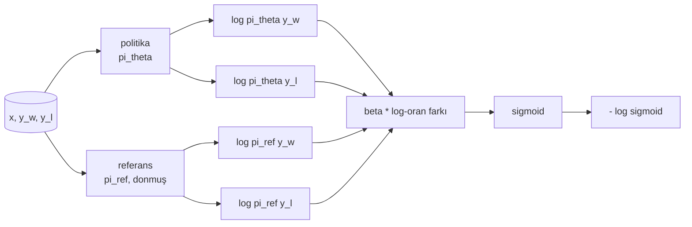
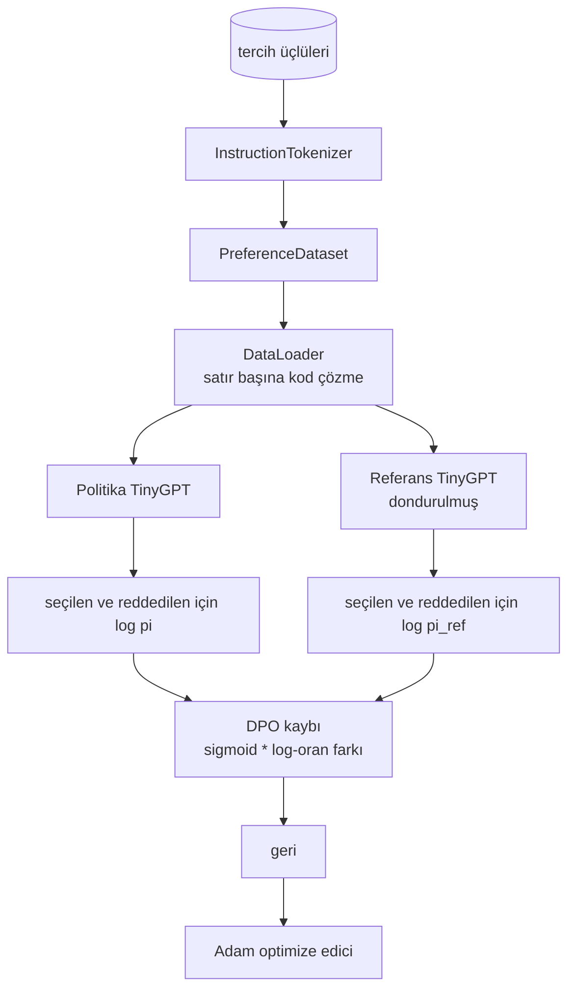

> **Orijinal İçerik:** [docs/en.md](https://github.com/rohitg00/ai-engineering-from-scratch/blob/main/phases/19-capstone-projects/40-dpo-from-scratch/docs/en.md)

# Capstone Ders 40: Sıfırdan Doğrudan Tercih Optimizasyonu (Direct Preference Optimization — DPO)

> Ödül modelleri (reward model) ve PPO, klasik RLHF yığınının parçalarıdır. DPO bu yığını, politikayı (policy) doğrudan tercih çiftlerine karşı yerleştiren tek bir denetimli kayba (supervised loss) indirir. Bu ders, DPO kaybını ödül farkı kimliğinden türetir, çalışan bir referans modeli ve politika modeli sunar, token başına log-olasılıkları hesaplar ve seçilmiş ve reddedilmiş tamamlamalardan oluşan bir tercih fixture'ı üzerinde küçük bir transformer eğitir. Testler, kayıp matematiğini ve gradyan yönünü sabitler, böylece uygulamanın makaleyle eşleştiğini bilirsiniz.

**Tür:** Uygulama
**Diller:** Python (torch, numpy)
**Ön Koşullar:** Faz 19 dersleri 30-37 (NLP LLM track: tokenizer, embedding tablosu, attention (dikkat) bloğu, transformer gövdesi, ön eğitim döngüsü, kontrol noktası, üretim, perplexity)
**Süre:** ~90 dakika

## Öğrenme Hedefleri

- DPO kaybını, ölçeklendirilmiş log-oranı farkı üzerinden bir sigmoid olarak türetmek ve onu örtük ödüle (implicit reward) bağlamak.
- Dondurulmuş bir referans ve eğitilebilir bir politikadan oluşan bir referans modeli + politika modeli çifti kurmak.
- Her iki model altında dizi düzeyinde log-olasılıkları hesaplamak, prompt tokenlerini maskelemek.
- Politikayı `(prompt, chosen, rejected)` üçlüleri üzerinde eğitmek ve reddedilen log-olasılığa göre seçilen log-olasılığın yükselişini izlemek.
- Davranışı, kayıp matematiği, gradyan işareti ve referans değişmezliği üzerine testlerle sabitlemek.

## Sorun

Bir SFT modeliniz var. Talimatları takip eder, ancak çıktıları dengesizdir; bazı tamamlamalar net, bazıları fazla sözcüklü veya yanlış. Ayrıca küçük bir tercih çifti veri kümeniz var: aynı prompt için bir insan bir tamamlamayı seçilmiş, diğerini reddedilmiş olarak işaretlemiş.

Klasik RLHF yanıtı, iki aşamalı bir hattır. Tercihler üzerine bir ödül modeli eğitin. PPO ile politikayı ödüle karşı optimize edin. Bu işe yarar ancak pahalıdır: PPO sırasında bellekte iki model, politikayı referansa yakın tutmak için KL kontrolü, ödül modeli kırılgan olduğunda ödül hackleme (reward hacking).

DPO her iki aşamayı tek bir denetimli kayıpla değiştirir. Ödül modeli açıkça hiç var olmaz. Politika, SFT referansına doğru açık bir KL cezasıyla, doğrudan tercih çiftleri üzerinde eğitilir. Bradley-Terry tercih modeli altında aynı optimal çözüm, çok daha az kod.

## Kavram

Bradley-Terry modelinden başlayın. Bir `x` promptu ve iki tamamlama `y_w` (seçilmiş) ve `y_l` (reddedilmiş) verildiğinde, insanın `y_w`'yi tercih etme olasılığı:

```text
P(y_w > y_l | x) = sigmoid( r(x, y_w) - r(x, y_l) )
```

Burada `r` gizli bir ödül fonksiyonudur. RLHF önce tercihlerden `r` uydurur, sonra bir `pi` politikasını KL çapasıyla `r`'yi en üst düzeye çıkaracak şekilde eğitir:

```text
max_pi E_{x, y~pi} [ r(x, y) ] - beta * KL(pi || pi_ref)
```

DPO türetmesi, bu amaç altında optimal politika `pi*`'nin `r` cinsinden kapalı bir formu olduğunu gözlemler:

```text
pi*(y | x) = (1/Z(x)) * pi_ref(y | x) * exp( r(x, y) / beta )
```

`r` için yeniden düzenleyin:

```text
r(x, y) = beta * ( log pi*(y | x) - log pi_ref(y | x) ) + beta * log Z(x)
```

`log Z(x)` terimi hem `y_w` hem de `y_l` için aynıdır (`x`'e bağlıdır, `y`'ye değil), dolayısıyla tercih farkını hesapladığınızda iptal olur:

```text
r(x, y_w) - r(x, y_l) = beta * ( log pi_theta(y_w|x) - log pi_ref(y_w|x)
 - log pi_theta(y_l|x) + log pi_ref(y_l|x) )
```

Bradley-Terry sigmoidine yerleştirin ve tercih çiftleri üzerinden negatif log olabilirliği alın:

```text
L_DPO(theta) = - E_{(x, y_w, y_l)} [
 log sigmoid( beta * ( log pi_theta(y_w|x) - log pi_ref(y_w|x)
 - log pi_theta(y_l|x) + log pi_ref(y_l|x) ) )
]
```

Bu, kayıptır. Örnek başına dört log-olasılıktan hesaplanan tek bir skaler üzerinden bir sigmoid. Ayrı bir ödül modeli yok. PPO yok. Kayıpta KL terimi yok; KL kısıtı, kapalı form türetmesine yapısal olarak eklenmiştir.



## Gradyanın İşareti

Herhangi bir eğitim koşusundan önce faydalı bir sağlamlık kontrolü. `log pi_theta(y_w | x)` cinsinden gradyanı alın:

```text
d L_DPO / d log pi_theta(y_w | x) = - beta * (1 - sigmoid(z))
```

Burada `z`, sigmoid'in argümanıdır. Bu, tüm `z` için negatiftir; bu, politikanın seçilen tamamlamanın log-olasılığını artırmasının kaybı azalttığı anlamına gelir. Simetrik olarak, `log pi_theta(y_l | x)` cinsinden gradyan pozitiftir: reddedilen log-olasılığı artırmak kaybı artırır. Eğitim seçileni yukarı, reddedileni aşağı iter. Referans donmuştur; hareket etmez.

## Veri

Dersle birlikte on iki tercih üçlüsü gelir. Her biri `(prompt, chosen, rejected)` şeklindedir. Seçilen tamamlama kısa ve kesindir. Reddedilen, fazla sözcüklü, konu dışı veya yanlıştır. Çiftler, ders 39'daki aynı görev ailelerini (başkent, aritmetik, liste) kapsar, böylece bir SFT tabanından başlayan politika makul bir başlangıç noktasına sahip olur.

Fixture kasıtlı olarak küçüktür. DPO üretimde on binlerce çift üzerinde çalışır; burada amaç, kayıp matematiğinin ve döngünün uçtan uca küçük bir veri kümesinde çalışması ve seçilen-reddedilen log-olasılık farkının gözle görülür biçimde büyümesidir.

## Referans Değişmezliği

Bir DPO uygulaması, referans modeli dikkatli ele almalıdır. Referans, SFT modelinin dondurulmuş halidir. Üç özellik tutulmalıdır:

- Referans parametreleri hiçbir zaman gradyan almaz.
- Referans log-olasılıkları, epoch'lar arasında değişmez.
- Politika, referansla aynı ağırlıklardan başlar. (Optimal `theta`, referans artı öğrenilmiş bir güncellemedir; politikayı referansın bir kopyası olarak başlatmak iyi tanımlanmış bir başlangıçtır.)

Uygulama bunları şu şekilde zorlar:

- İleri geçişlerde referansı `torch.no_grad()` ile sarmalama.
- Her referans parametresinde `requires_grad=False` ayarlama.
- Referans kurulduktan sonra `policy.load_state_dict(reference.state_dict())` aracılığıyla politikayı oluşturma.

## Mimari



Model, ders 39'da kullanılan aynı TinyGPT'tir (yalnızca çözücü, nedensel, byte tokenizer'ı). Referans ve politika aynı mimariyi paylaşır; politikanın ağırlıkları eğitim altında referanstan saparken referans sabit kalır.

## Ne inşa edeceksiniz

Uygulama, bir `main.py` artı testlerdir.

1. `InstructionTokenizer`: `INST` ve `RESP` özel tokenleri ile byte tokenizer'ı. Ders 39 ile aynı şekil.
2. `TinyGPT`: yalnızca çözücü transformer. 39'u atlamış olsanız bile dersin kendi kendine yeterli olması için aynı şekil.
3. `make_preferences`: on iki `(prompt, chosen, rejected)` üçlüsü döndürür.
4. `sequence_log_prob`: model, bir prompt öneki ve bir tamamlama verildiğinde, tamamlama üzerinde sonraki token log-olasılıklarının toplamını döndürür (prompt konumu katkısı yoktur).
5. `dpo_loss`: dört log-olasılığı ve `beta`'yı alır, örnek başına kayıp tensörünü ve loglama için örtük ödül farkını döndürür.
6. `train_dpo`: politika ve referans altında seçilen ve reddedilen log-olasılıklarını hesaplayan, kaybı uygulayan ve Adam'ı adımlayan epoch başına döngü.
7. `evaluate_margins`: herhangi bir noktada politika altında ortalama seçilen-reddedilen log-olasılık farkını döndürür.
8. `run_demo`: küçük bir ısınma ön eğitiminden referans ve politikayı kurar, ağırlıkları kopyalar, otuz adım eğitir, adım başına kaybı ve farkı yazdırır, başarı durumunda sıfırla çıkar.

## DPO neden işe yarar

DPO, ödül parametreleştirmesine kadar Bradley-Terry tercih modeli altında RLHF ile matematiksel olarak eşdeğerdir. Örtük ödül `r(x, y) = beta * (log pi(y|x) - log pi_ref(y|x))`, tercihlerden `x`'in bir fonksiyonuna kadar tanınabilirdir ve bu, farkta iptal olur. Kapalı form politikası, açık ödül modelini atlamanıza izin verir. KL kısıtı yapısal olarak uygulanır: `pi`'nin `pi_ref`'den her sapması log-oranı büyütür ve sigmoid'i doyurur; bu, politika çok uzaklaştığında gradyanı söndürür. Referans, sizin güvenlik ağınızdır.

## Genişletme hedefleri

- Log-olasılık toplamına bir uzunluk normalizasyonu ekleyin: tamamlama uzunluğuna bölün. Uzunluk yanlılığı, bilinen bir DPO başarısızlık modudur; burada model, log-olasılıkları mutlak terimlerle daha büyük olduğu için kısa tamamlamaları tercih eder.
- Kaybın IPO varyantını ekleyin: sigmoid + log yerine `(z - 1)^2` kullanın. Fixture üzerinde yakınsamayı karşılaştırın.
- Sert seçilen-reddedilen etiketi ile tek düze 0.5 arasında enterpolasyon yapan bir etiket yumuşatma parametresi ekleyin.
- Referansı, daha küçük ve ucuz bir modelle değiştirin (bilgi damıtma lezzeti).

Uygulama size kaybı, referans değişmezliğini ve eğitim döngüsünü verir. Matematik derstir. Kod, matematiği somutlaştırır.
