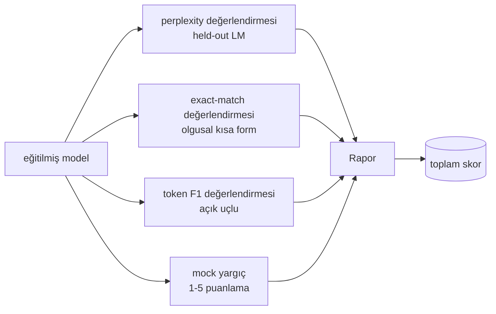
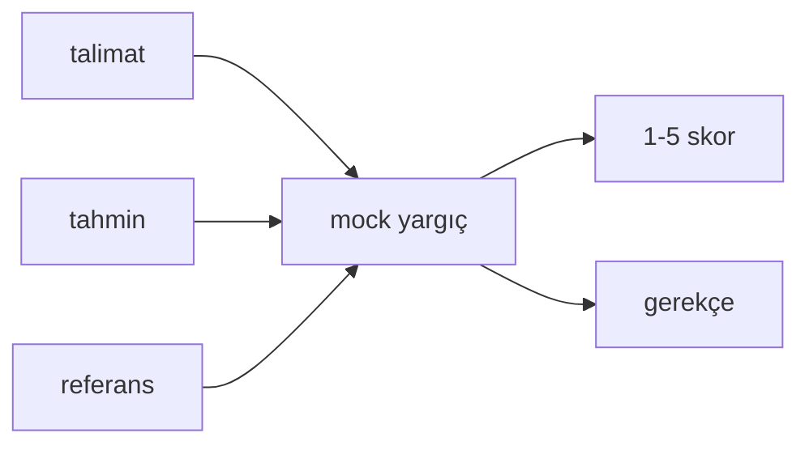
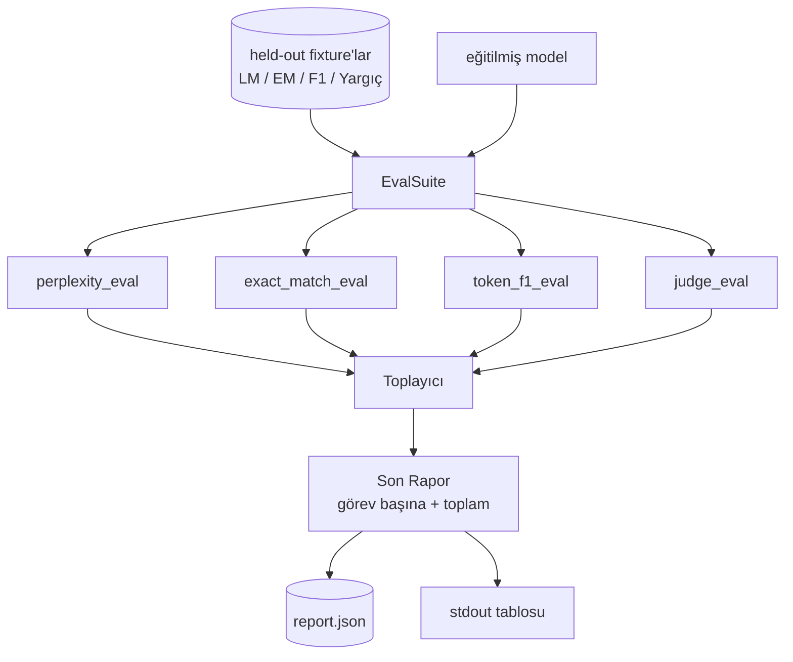

> **Orijinal İçerik:** [docs/en.md](https://github.com/rohitg00/ai-engineering-from-scratch/blob/main/phases/19-capstone-projects/41-eval-pipeline/docs/en.md)

# Capstone Ders 41: Tam Değerlendirme Hattı

> Eğitim, kayıp eğrileriyle izleyebildiğiniz kısımdır. Değerlendirme, tasarlamak zorunda olduğunuz kısımdır. Bu ders, eğitilmiş herhangi bir dil modelini alan, üzerinde dört heterojen değerlendirme çalıştıran, sonuçları görev başına bir raporda toplayan ve döngünün ağ olmadan çalışması için yerel bir mock LLM-as-judge (yargıç modeli) sunan birleşik bir eval hattı kurar. Dört değerlendirme, gönderilen her modelin ihtiyaç duyduğu boyutları kapsar: dil modelleme (perplexity), kısa form doğruluğu (exact-match), açık form benzerliği (token F1) ve niteliksel puanlama (yargıç).

**Tür:** Uygulama
**Diller:** Python (torch, numpy)
**Ön Koşullar:** Faz 19 dersleri 30-37 (NLP LLM track: tokenizer, embedding tablosu, attention (dikkat) bloğu, transformer gövdesi, ön eğitim döngüsü, kontrol noktası, üretim, perplexity)
**Süre:** ~90 dakika

## Öğrenme Hedefleri

- Küçük bir transformer üzerinde, maskedeli token muhasebesiyle held-out perplexity hesaplamak.
- Kısa form olgusal promptlarında exact-match değerlendirmesi çalıştırmak.
- Normalizasyonla tahmin ve referans dizeleri arasında token düzeyinde F1 hesaplamak.
- Çıktıları 1-5 ölçeğinde puanlayan yerel bir mock LLM-as-judge kurmak.
- Dört değerlendirmeyi tek bir ağırlıklı raporda, görev başına dökümle toplamak.

## Sorun

Tek bir metrik bir dil modelini asla tam tanımlamaz. Perplexity, modelin dil dağılımına ne kadar iyi uyduğunu söyler, ancak soruları yanıtlayıp yanıtlamadığı hakkında bir şey söylemez. Exact-match, modelin referans diziyi üretip üretmediğini söyler, ancak doğru parafrazları cezalandırır. Token F1, parafrazı affeder, ancak yanlış içerikle sözcüksel örtüşme ile kandırılır. LLM-as-judge niteliksel boyutları yakalar, ancak pahalı ve stokastiktir.

Gerçekten istediğiniz hat, dördüne de sahip olandır. Her değerlendirme, diğerlerinin kaçırdığı bir boyutu kapsar. Her biri, o metrik için şekillendirilmiş farklı bir held-out veri alt kümesi üzerinde çalışır. Son rapor, görev başına sayıları yan yana ve bir toplam gösterir, böylece bir incelemeci bir bakışta modelin hangi ödünleşimleri yaptığını görebilir.

Bu ders, o hattı tek bir dosyada uçtan uca kurar.

## Kavram

Her değerlendirme, `(model, dataset) -> EvalResult` fonksiyonudur. Sonuç, metrik değerini, inceleme için örnek başına ayrıntıları ve toplam için bir adı taşır. Hat, hangi değerlendirmelerin çalıştırılacağını ve nasıl ağırlıklandırılacağını söyleyen bir config ile bunları oluşturur.

## Perplexity, doğru hesaplanmış

Perplexity, `exp(token başına ortalama negatif log-olabilirlik)` değeridir. Uygulamanın iki tuzağı var:

- Ortalama, gerçek token konumları üzerinden olmalıdır, batch * dizi üzerinden değil. Padding tokenleri paydadan çıkarılmalıdır, aksi takdirde perplexity olması gerekenden daha iyi görünür.
- Model bir sonraki tokeni tahmin eder, dolayısıyla `i` konumundaki logits, `i+1` konumundaki tokeni tahmin eder. Buradaki off-by-one hataları sessizdir: kayıp hâlâ eğitir, ancak metrik anlamsız hale gelir.

Değerlendirme, pad olmayan konumlar üzerinde `-log p(token)` toplamlarını ve batch başına bir token sayısını hesaplar, sonra sonda böler. Bu, batch başına perplexity'leri ortalayarak (kısa dizileri hafife alan) sayısal olarak daha güvenlidir ve ders kitabı tanımıyla eşleşir.

## Exact-match, normalizasyonla

Hat, karşılaştırmadan önce hem tahmini hem referansı normalize eder:

- Küçük harfe çevir.
- Çevreleyen boşlukları kırp.
- Dahili boşluk dizilerini tek boşluğa daralt.
- Her iki taraf yalnızca noktalama ile farklıysa, sondaki terminal noktalamayı (`.`, `!`, `?`) düşür.

Normalizasyon, exact-match'i pratikte faydalı kılar. `"Paris"` diyen model doğrudur; `"Paris."` diyen de doğrudur; `" paris "` diyen de doğrudur. Metrik, yine de yanıtın normalizasyondan sonra aynı dize olmasını gerektirir.

## Token F1, doğru yol

Token F1, token çantası üzerinde hesaplanan precision ve recall'ın harmonik ortalamasıdır. Adımlar:

1. Tahmin ve referansı normalize et (exact-match ile aynı kurallar).
2. Her birini bir token listesine böl (boşluk tokenleştirmesi).
3. Çoklu küme kesişimini say.
4. Precision = `kesişim_sayısı / len(tahmin_tokenleri)`. Recall = `kesişim_sayısı / len(referans_tokenleri)`. F1 = harmonik ortalama.

Hem tahmin hem referans boşsa, F1 1'dir (boş eşleşme). Yalnızca biri boşsa, F1 0'dır. Bu örüntü, SQuAD değerlendirme referansıyla eşleşir ve parafrazlar arasında kararlı sayılar üretir.

## Yerel Mock LLM-as-Judge

Gerçek bir yargıç, bir API'nin arkasındaki bir sınır modelidir. Bu ders için yargıç çevrimdışı çalışmalıdır. Mock yargıç, bir talimat, modelin tahmini ve referansı alan ve `{1, 2, 3, 4, 5}` kümesinde bir skor artı tek satırlık bir gerekçe döndüren deterministik bir puanlayıcıdır. Puanlama kuralları açıktır:

- Normalleştirilmiş tahmin, normalleştirilmiş referansa eşitse 5.
- Tahmin ve referans arasındaki token F1 en az 0.8 ise 4.
- Token F1 `[0.5, 0.8)` aralığındaysa 3.
- Token F1 `[0.2, 0.5)` aralığındaysa 2.
- Aksi halde 1.

Bu gerçek bir yargıç değildir, ancak doğru arayüze sahiptir. Daha sonra bir fonksiyonu değiştirerek gerçek bir model takın. Hat umursamaz.

## Toplama

Toplam, normalize edilmiş değerlendirme skorlarının ağırlıklı ortalamasıdır. Her değerlendirme kendi sayısını `[0, 1]` aralığında raporlar:

- Perplexity: `1 / (1 + log(perplexity))` olarak normalize et. 1 perplexity 1'e, sonsuz 0'a eşlenir.
- Exact-match: zaten `[0, 1]` aralığında.
- Token F1: zaten `[0, 1]` aralığında.
- Yargıç: 5'e böl.

Ağırlıklar yapılandırılabilir. Varsayılan karışım 0.2 perplexity, 0.3 exact-match, 0.3 token F1, 0.2 yargıçtır. Ağırlıkların seçimi bir ürün kararıdır; ders, deney yapabilmeniz için düğmeyi açık tutar.

## Mimari

`EvalSuite` ince bir orkestratördür. Her bireysel değerlendirme, `(model, tokenizer, dataset, config)` alan ve bir `EvalResult` döndüren serbest bir fonksiyondur. `Toplayıcı`, sonuçları toplar ve son raporu üretir. Demo tabloyu yazdırır ve downstream CI'ın alabileceği bir JSON kopyası yazar.

## Ne inşa edeceksiniz

Uygulama, bir `main.py` artı testlerdir.

1. `TinyGPT`: ders 38-40'da kullanılan aynı yalnızca çözücü mimarisi, dersin tek başına durabilmesi için dahil.
2. `InstructionTokenizer`: INST / RESP / PAD özel tokenleri ile byte tokenizer'ı.
3. Dört fixture: bir LM derlemi, bir EM kümesi, bir F1 kümesi ve bir yargıç kümesi. Her biri yirmi örnek, deterministik.
4. `perplexity_eval`: perplexity değeri ve token başına kayıp histogramı ile `EvalResult` döndürür.
5. `exact_match_eval`: ortalama EM ve örnek başına kayıtlar döndürür.
6. `token_f1_eval`: ortalama token F1 ve örnek başına kayıtlar döndürür.
7. `mock_judge` ve `judge_eval`: örnek başına skor ve gerekçe, küme boyunca ortalama skor.
8. `Aggregator.normalise`: değerlendirme başına normalizasyon kuralı.
9. `Aggregator.aggregate`: ağırlıklı ortalama ve birleştirilen rapor.
10. `run_demo`: küçük bir modeli kısa süre eğitir, dört değerlendirmeyi çalıştırır, rapor tablosunu yazdırır ve JSON'ı yazar, başarı durumunda sıfırla çıkar.

## Raporu okumak

Raporun üç katmanı vardır. En üstte toplam skordur. Altında dört değerlendirme başına sayılar vardır. Onların altında tanılama için örnek başına dökümler vardır. Başarısız bir CI çalıştırması genellikle toplamı ister, ancak bir gerilemeyi kovalayan incelemeci, modelin hangi girdilerde yanlış yaptığını görmek için örnek başına dökümü ister.

JSON çıktısı, bir CI panosunun sürümler arasında trend çizgileri çizebilmesi için kararlı anahtarlar kullanır. Terminalde bakan insanlar için güzel yazdırılan tablo yapılır.

## Genişletme hedefleri

- Bir kalibrasyon değerlendirmesi ekleyin: modelin softmax olasılıkları doğruluğuyla eşleşiyor mu? Tahminleri güvene göre gruplayın ve her grup için ampirik doğruluğu rapor edin.
- Bir sağlamlık değerlendirmesi ekleyin: her örneği bir pertürbasyon (yazım hatası, parafraz, dikkat dağıtıcı) ile etiketleyin ve pertürbasyon başına metrik düşüşünü rapor edin.
- Mock yargıcı, bir HTTP çağrısının arkasındaki gerçek bir modelle değiştirin. Fonksiyon imzası değişmez.
- Görev başına ağırlık öğrenimi ekleyin: sabit ağırlıklar yerine, modeller üzerindeki bir hedef tercih sırasına ağırlıklar uydurun.

Uygulama size dört değerlendirmeyi, toplayıcıyı ve raporu verir. Gerçek değerlendirme hatları bunun üzerine daha birçok boyut ekler; örüntü aynı kalır: değerlendirme başına bir fonksiyon, bir toplayıcı, bir rapor.
