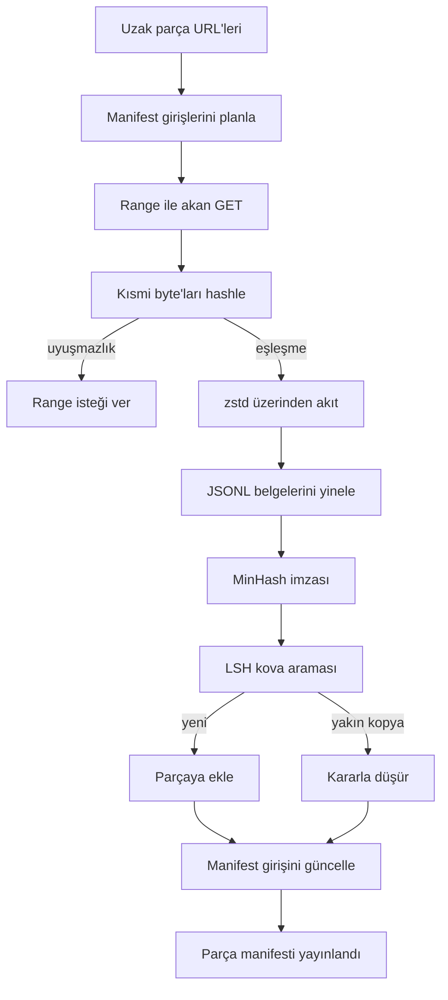

> **Orijinal İçerik:** [docs/en.md](https://github.com/rohitg00/ai-engineering-from-scratch/blob/main/phases/19-capstone-projects/42-large-corpus-downloader/docs/en.md)

# Büyük Derlem İndiricisi

> Bir dil modelini eğitmek, ileri geçişten çok daha önce başlar. Derlemin disk üzerine inmesi, açılması, kopyaların kaldırılması ve ağ yüzde 4'te düşmeden önce devam etme hikâyesinin çözülmüş olması gerekir. Bu ders, sıkıştırılmış parçaları (shard) çeken, Zstandard ile anında açan, MinHash ve yerelliğe duyarlı hash ile benzer kopyaları parmak iziyle imzalayan ve hattın geri kalanının güvenebileceği bir parça manifesti yazan akan bir indirici kurar.

**Tür:** Uygulama
**Diller:** Python
**Ön Koşullar:** Faz 19 dersleri 30-37
**Süre:** ~90 dakika

## Öğrenme Hedefleri

- `urllib` ile uzak parçaları aktarın ve `zstandard` ile tüm dosyayı belleğe almadan açın.
- Doğrulanmış bir byte ofsetine karşı HTTP `Range` istekleri vererek kısmi indirmeleri sürdürün.
- Belge başına bir MinHash imzası kurun ve onu LSH ile kovalayın, böylece benzer kopyalar çarpışır.
- İçerik hash'i, byte boyutu, belge sayısı ve kopyasızlık (dedup) kararı ile bir parça manifesti yayınlayın.

## Sorun

200 GB'lik bir derlem üzerinde ilk kez eğitim yaptığınızda, ağ yüzde 41'te düşer ve betik bir `urllib` istisnasıyla çıkar. İkinci kez yüzde 78'de düşer. Yüzde 99'a geldiğinizde döngüyü üç kez yeniden yazmışsınızdır. Dakika birinden itibaren tasarlamanız gereken iki başarısızlık, kısmi indirme sürdürme ve kopya belge kaldırmadır. İkisinin de iyi bilinen çözümleri var; ikisi de rutin olarak atlanır çünkü hat tek satırlık bir `requests.get` çağrısı olarak başlar ve dişler çıkar.

Sürdürme bir HTTP sorunudur. Sunucunun `Range`'i onurlandırması, istemcinin disk üzerindeki bir kayda karşı doğrulanmış ofseti izlemesi ve doğrulanmış ofsetin süreç ölümünden sağ çıkması gerekir. Ofset ve dosya bir byte bile ayrılırsa, sürdürülen indirme çöp yazar ve derlem yalnızca tokenleştirme sırasında ortaya çıkan bir şekilde bozulur.

Kopyasızlık bir imza sorunudur. Tam-hash kopyasızlık, benzer kopyaları kaçırır: aynı Wikipedia makalesi üç farklı boilerplate altbilgisiyle, aynı kod dosyası farklı bir lisans başlığıyla, aynı blog yazısı her bağlantıda bir izleme parametresiyle görünür. MinHash artı LSH, bunları alt-lineer maliyetle yakalar. Maliyet, belge başına bir imza ve imza başına bir kova aramasıdır.

## Kavram



### `urllib` ile akış

Standart kütüphane `urllib.request.urlopen`, dosya benzeri bir nesne döndürür. Bunu bir `zstandard.ZstdDecompressor().stream_reader` içine sarın ve byte'lar ağdan açıcı üzerinden belge yineleyicisine akar; sıkıştırılmış parça veya açılmış parça bellekte hiç gerçekleşmez. Tek bellek maliyeti, satır arabelleği, geçerli belge için MinHash imzası ve LSH dizinidir.

### `Range` ile sürdürme

İndirici, parça başına iki dosya yazar: parçanın kendisi ve bir `.partial.json` kontrol noktası. Kontrol noktası `verified_bytes`, `expected_size`, `sha256_prefix` (ilk `verified_bytes` byte üzerinden hesaplanır) ve kaynak URL'sini kaydeder. Başlangıçta indirici kontrol noktasını okur, disk üzerindeki byte'lar üzerinden `sha256_prefix`'i yeniden hesaplar ve yalnızca yeniden hesaplanan hash eşleşirse sürdürür. Hash yanlışsa, kısmi dosya atılır ve indirme byte sıfırdan yeniden başlar. Sessiz bozulma, doğrulanmış byte'ların kontrol edildiği, varsayılmadığı için imkansızdır.

### MinHash artı LSH

MinHash, iki kümenin Jaccard benzerliğini sabit uzayda tahmin eder. Bir belge için küme, metninin shingle'larıdır (örtüşen n-gram'lar). İmza, bağımsız hash fonksiyonu başına minimum olmak üzere `k` minimum hash değeridir. Jaccard benzerliği `s` olan iki belge, imzanın herhangi bir tek bileşeninde `s` olasılıkla anlaşır.

LSH daha sonra `k` bileşenlerini her biri `r` satırlık `b` banda gruplar, burada `k = b * r`. İki belge, `1 - (1 - s^r)^b` olasılıkla en az bir bantta çarpışır; bu, `(b, r)`'yi ayarladığınız `s` değeri etrafında keskin bir eşiktir. Tipik derlem kopyasızlık için eşik `s = 0.8`'dir ve LSH araştırma literatürüne `k = 128`, `b = 32`, `r = 4` ile ulaşılır.

### Sözleşme olarak parça manifesti

İndiricinin tek dayanıklı çıktısı manifesttir. Manifest, parça başına URL'yi, açılmış byte sayısını, belge sayısını, kopyasızlıktan sonra benzersiz belge sayısını ve son parça dosyasının sha256'sını tutar. Downstream tokenleştirme, dizin listesini değil manifesti okur. Bir parça eksikse veya sha256'sı yanlışsa, manifest sonraki aşamaya başlamayı reddetmesini söyler. Manifest, "veri indirildi" ile "veri indirildi ve doğrulanabilir" arasındaki belirleyici kenardır.

## İnşa Et

`code/main.py` şunları uygular:

- `ShardPlanner` - bir parça URL'leri listesini okur ve planlanmış manifest girişleri üretir.
- `StreamingDownloader` - isteğe bağlı `Range` ile bir `urllib` akışı açar, geçici bir dosyaya yazar, `.partial.json` kontrol noktasını her chunk'ta günceller ve sürdürmede sha256 önekini doğrular.
- `ZstdDocIterator` - dosya benzeri akışı `zstandard.ZstdDecompressor` içine sarar ve satır başına bir belge verir.
- `MinHasher` - sabit bir hash seed ailesi kullanarak bir dize için `k` bileşenli imza üretir.
- `LSHIndex` - imzaları banda göre kovalar ve çarpışmaları rapor eder.
- `Dedup` - hasher ve dizini birleştirerek her belgeyi `keep` veya `near_duplicate` olarak, eşleşen parça kimliğiyle birlikte etiketler.
- `ManifestWriter` - parça başına istatistikleri toplar ve `manifest.json` yazar.

Dosyanın altındaki bir demo, disk üzerinde küçük bir sentetik derlem kurar, onu `zstandard` ile sıkıştırır, bir `file://` URL'si üzerinden indirir, kopyasızlık yapar ve manifesti yazdırır.

Çalıştırın:

```bash
python3 code/main.py
```

Betik sıfırla çıkar ve bir manifest özeti yazdırır.

## Üretim Örüntüleri

Dört örüntü, bu dersi gerçek derlemlere ölçekler.

**Yazmadan önce kontrol noktası.** `.partial.json`, byte'lar parçaya eklenmeden önce `fsync` edilmelidir. Aksi takdirde, bir güç kaybı sırayı tersine çevirir: disk üzerinde parça byte'ları, onlar olmadan kontrol noktası, sonraki sürdürme, olduğundan daha az doğrulanmış byte'a inanır, kopyalanan sonek byte'ları dosyayı bozar. Önce kontrol noktası, sonra yazma. Bu, write-ahead log ile aynı disiplindir.

**Parçalı LSH dizini.** Tüm derlem üzerinde tek bir LSH dizini, 200 GB ölçeğinde RAM'e sığmaz. LSH dizinini ilk bant hash'ine göre bölümlendirin, bölümleri diskte saklayın ve yeni bir imzanın ineceği bölüme danışın. Maliyet, belge başına bir fazladan disk okumasıdır; fayda, LSH dizininin artık sert bir bellek tavanı olmamasıdır.

**Silme değil, mezar taşı.** Düşürülen kopyalar, manifeste `near_duplicate` kararı ve çarpıştıkları belgenin parça kimliğiyle kaydedilir. Onları silmek, kopya ile koruyucu arasındaki bağı kaybeder. Mezar taşı koymak, denetim izini korur ve downstream bir geçişin eşik hakkındaki fikrini değiştirmesine izin verir.

**Manifestte parça başına sha256, artı bir manifest sha256.** Manifestin kendisi bir içerik hash'i alır. Downstream aşamalar, per-parça girişlerine güvenmeden önce manifest hash'ini doğrular. Bu olmadan, manifest sessiz saldırı yüzeyidir: tek bir dosyayı düzenleyebilen bir saldırgan tüm hattı bozabilir.

## Kullan

Üretim örüntüleri:

- **Her CI çalıştırmasında sürdür.** CI çalıştırıcıları kısa ömürlüdür. İndirici, her çalıştırmada taze bir disk varsaymalı ve önbellek veya uzak kaynaktan kurtarmalıdır. `--cache-dir` birinci sınıf bir bayraktır.
- **Tokenleştirmeden önce kopyasızlık yap.** Tokenleştirme pahalıdır. Aynı belge üzerinde iki kez çalıştırmak, aynı kayıp eğrisi için iki kat maliyettir. Kopyasızlık, tokenleştirmenin upstream'idir, downstream'i değil.
- **Manifesti birleştirme geçidi olarak kullan.** Eğitim çalıştırması, manifest sha256'sını sabitlenmiş bir commit'ten okur. Yeni bir veri kümesi sürümü, yeni bir manifest commit'i gerektirir. Kod ile veri arasındaki bağ, söylenti değil git'tir.

## Gönder

`outputs/skill-corpus-downloader.md`, gerçek bir projede, hangi URL'lerin indiriciyi beslediğini, kontrol noktası dizininin nasıl düzenlendiğini, kopyasızlığın hangi shingle genişliğini ve `(k, b, r)` üçlüsünü kullandığını ve manifestin sürüm kontrolünde nerede yaşadığını açıklardı. Bu ders motoru gönderir.

## Alıştırmalar

1. Bir `--shingle-width` bayrağı ekleyin ve 3, 5, 9 genişliklerinde kopyasızlık kararının nasıl değiştiğini ölçün. Seçilen varsayılanı savunun.
2. Sihirli byte'ları koklayarak gzip desteğini zstd'nin yanına ekleyin. İndirici, çağıranın codec'i belirtmesini gerektirmemelidir.
3. Kontrol noktası bulunamazsa taze bir indirmeyi reddeden bir `--resume-only` modu ekleyin. CI'da bir çalıştırmanın yanlışlıkla 200 GB'ı yeniden çekmesini engellemek için faydalıdır.
4. LSH dizinini bir shelf veya sqlite dosyasına taşıyın ve bellek içi varyanta karşı çıktıyı ölçün.
5. Başlangıçta bir manifest sha256 kontrolü ekleyin. İndirici, disk üzerindeki manifest `manifest.lock` içindeki manifest hash'i ile aynı fikirde değilse kapalı başarısız olmalıdır.

## Temel Terimler

| Terim | İnsanların söylediği | Gerçekte ne anlama geldiği |
|-------|---------------------|--------------------------|
| Parça (Shard) | "Bir dosya" | Kendi sha256'sı olan, sürdürme ve kopyasızlık birimi olarak kullanılan derlemin kendi kendine yeterli bir dilimi |
| MinHash imzası | "Parmak izi" | Her bileşeni küme üzerindeki tek bir bağımsız hash'in minimumu olan bir kümenin `k` bileşenli eskizi |
| LSH bandı | "Kova" | Çarpışma tespiti için tek bir kova anahtarı olarak kullanılan `r` imza bileşeninden oluşan bir grup |
| Doğrulanmış byte'lar | "Sürdürme ofseti" | sha256 öneki kontrol noktasıyla eşleşen disk üzerindeki byte'lar; sürdürme için tek güvenli ofset |
| Manifest | "Dizin" | İndiricinin ürettiği şeyin, içerik hash'leri dahil, tek dayanıklı kaydı |

## İleri Okuma

- [RFC 7233](https://datatracker.ietf.org/doc/html/rfc7233) - HTTP Range istekleri, sürdürme protokolü
- [Zstandard format belirtimi](https://datatracker.ietf.org/doc/html/rfc8478) - akan açmayı güvenli kılan çerçeve formatı
- [MinHash](https://en.wikipedia.org/wiki/MinHash) - bu dersin kullandığı imza ailesi
- [Yerelliğe duyarlı hash](https://en.wikipedia.org/wiki/Locality-sensitive_hashing) - kopyasızlık eşiğinin arkasındaki bantlama şeması
- Faz 19 · 43 - indiricinin beslediği HDF5 tokenleştirilmiş derlem
- Faz 19 · 44 - derlem üzerinde eğitim yapan kosinüs zamanlaması
- Faz 19 · 45 - zamanlamayı tüketen AMP döngüsü
