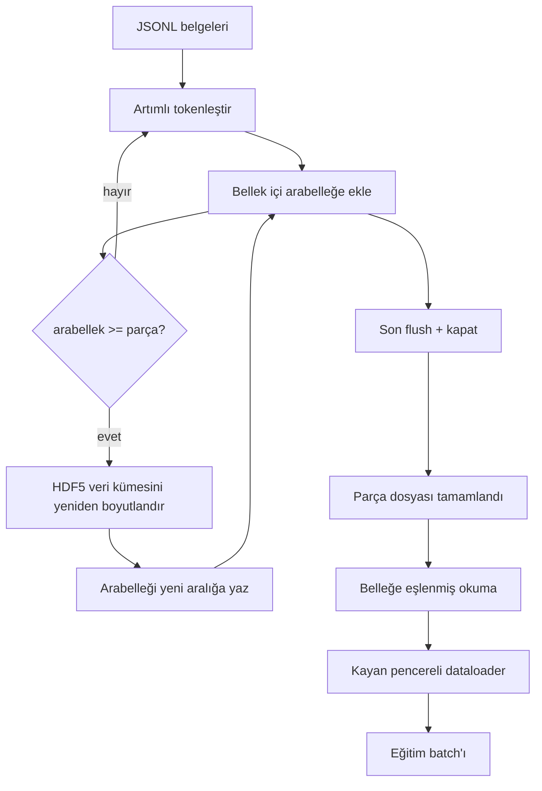

> **Orijinal İçerik:** [docs/en.md](https://github.com/rohitg00/ai-engineering-from-scratch/blob/main/phases/19-capstone-projects/43-hdf5-tokenized-corpus/docs/en.md)

# HDF5 Tokenleştirilmiş Derlem

> İndirilen derlem, eğiticinin satır hızında akılabileceği bir düzende diske inmelidir. Disk üzerindeki JSONL, 16 veri yükleyici (dataloader) işçisinde hayatta kalmaz. Yeniden boyutlandırılabilir, parçalı (chunked) tamsayı veri kümesi (dataset) ile HDF5 hayatta kalır. Bu ders, akan tokenleştirmeyi yeniden boyutlandırılabilir bir HDF5 veri kümesine, birden çok dosyaya parçalı yazmaya, eğitim zamanında belleğe eşlenmiş (memory-mapped) okumaya ve doğru paketlemeyle sabit uzunlukta diziler üreten kayan pencereli bir dataloader'a dönüştürür.

**Tür:** Uygulama
**Diller:** Python
**Ön Koşullar:** Faz 19 dersleri 30-37
**Süre:** ~90 dakika

## Öğrenme Hedefleri

- Belgeleri deterministik parçalama ile yeniden boyutlandırılabilir bir HDF5 tamsayı veri kümesine aktarın.
- Yükü birden çok HDF5 dosyasına bölerek yazın, böylece başarısızlık sınırlı olur ve paralellik mümkün olur.
- Token'ları HDF5'in sayfa önbelleği destekli parçalı düzeni üzerinden geri okuyun, böylece dataloader yalnızca batch zamanında batch arabelleklerine kopyalar.
- Açık paketleme kurallarıyla sabit uzunlukta eğitim dizileri yayan kayan pencereli bir dataloader uygulayın.

## Sorun

Modern bir dil modeli eğitim çalıştırması, onlarca işçi boyunca saniyede yüz binlerce örnekte token okur. Disk üzerindeki JSONL, ilk soğuk önbellek sayfa hatasında ölür: JSON ayrıştırıcısı yavaştır, belge sınırları adreslenebilir değildir ve "4.217.884 örneğini örnekle" aramak dosyanın taranmasını gerektirir. İyi sıkıştıran Parquet bile kötü bir uyumdur çünkü eğitici sütunlar değil, O(1) rastgele erişimli düz bir token akışı ister.

HDF5, parçalı, yeniden boyutlandırılabilir, yalnızca tamsayı bir veri kümesi sunduğu için uyar, çünkü parçaları okuma zamanında sayfa önbelleği dostudur. Eğitici `tokens[3,200,000 : 3,200,8192]` dilimini ister ve HDF5 istenen hiperdüzlemi sayfa önbelleğinden yeni tahsis edilmiş bir NumPy dizisine kopyalar. Maliyet, işçi başına bir açık dosya tanıtıcısı ve parça boyutunda bir sayfa önbelleği ayak izidir; bu, JSONL kod çözme maliyetine kıyasla ihmal edilebilir.

İnşa sorunu, yazma tarafını dürüst tutmaktır. Yeniden boyutlandırılabilir veri kümeleri kötüye kullanım için kolaydır: belgeleri birer birer yazın ve HDF5 dosyası kullanılamayacak kadar parçalanır. Tüm belgeleri tek bir yeniden boyutlamada yazın ve bir süreç ölümü tüm parçayı kaybeder. Doğru disiplin, arabellek-sonra-genişlet'tir; arabellek boyutu parça boyutuyla eşleşir ve yükü dosyalara bölen parçalı bir yazma, çökmede en fazla bir parçayı kaybeder.

## Kavram



### Yeniden boyutlandırılabilir HDF5, doğru yapılmış

Token veri kümesi `maxshape=(None,)` ve sabit `chunks=(chunk_size,)` ile oluşturulur. Yazma, tokenleri uzunluğu `chunk_size` olan bir NumPy dizisinde arabelleğe alarak ilerler. Arabellek dolduğunda, veri kümesi tam olarak `chunk_size` kadar yeniden boyutlandırılır ve arabellek yeni aralığa yazılır. Parça sonunda, kalan arabellek son bir kısmi aralığa yazılır. Her yazma, sonuncusu dışında bitişik ve parça hizalıdır; bu sonuncuyu okuyucuya parçanın HDF5 özniteliklerinde kaydedilen `token_count`'ta keseceği söylenir.

### Parçalı yazma

Tek bir HDF5 dosyası tek bir başarısızlık noktasıdır. Hat, parçaları paralel yazar: Faz 19 ders 42'den gelen her giriş parçası bir HDF5 çıkış parçası üretir. Bir `shards.json` dizini, parça başına dosya yolunu, token sayısını, belge sayısını ve tokenler üzerinden bir sha256'yı kaydeder. Eğitici, küresel ofsetleri hesaplamak ve derlemi doğrulamak için `shards.json`'ı okur.

### Belleğe eşlenmiş okuma

Eğitim zamanında her işçi, HDF5 dosyalarının kendi payını `swmr=True` modunda açar ve `tokens[start:stop]` ister. HDF5'in parça düzeni, parça sıcak olduğunda bunu sayfa önbelleği destekli bir okuma yapar. İşçi tüm dosyayı hiç gerçekleştirmez: dilim, dataloader'ın batch arabelleğine kopyalanır, ardından dataloader onu batch zamanında pinli bellek (pinned memory) eğitim tensörüne kopyalar. Kısayolda parça geçişi başına bir sistem çağrısı vardır; geri kalan her şey RAM erişimidir.

### Kayan pencereli dataloader

Dataloader, eğitim dizisi uzunluğunu bilen tek aşamadır. Küresel token akışında rastgele bir başlangıç indeksi seçer, `window_size + 1` token okur ve `(input, target) = (tokens[:-1], tokens[1:])` döndürür. Belge sınırları uygulanmaz: bir pencere iki belgeyi aşabilir, aralarında modelin ayırıcıyı kullanmayı öğrenmesi için açık bir `boundary_token_id` ile. Bu standart paketleme kuralıdır; aynı zamanda bir başlangıç seviyesindekinin unuttuğu kuraldır; sonunda derlemin yüzde 8'i eğitim sınır tokenleri, yüzde 92'si doğal metin olan bir veri kümesiyle karşılaşır.

## İnşa Et

`code/main.py` şunları uygular:

- `Tokenizer` - demo için yeterince iyi, byte düzeyinde deterministik bir tokenizer. Arayüz `encode(text) -> list[int]` ve `vocab_size`'tır.
- `HDF5ShardWriter` - yeniden boyutlandırılabilir bir tamsayı veri kümesi açar, tokenleri parça boyutuna arabelleğe alır, sabit boyutlu adımlarla yeniden boyutlandırır ve yazar, kapatmada `token_count` ve `sha256`'yı HDF5 öznitelikleri olarak kaydeder.
- `ShardedTokenizationPipeline` - giriş belgelerini yineler, bir yazara yönlendirir ve bir `shards.json` dizini yayınlar.
- `MmapTokenStore` - parça dosyalarını belleğe eşlenmiş okumalar için açar, küresel ofsetleri hesaplar, tek bir `get_slice(start, stop)` API'si sunar.
- `SlidingWindowDataloader` - küresel akıştan rastgele pencereler seçer ve `(input_ids, target_ids)` NumPy dizileri verir.

Dosyanın altındaki bir demo, bellek içi küçük bir derlem kurar, onu iki parçaya tokenleştirir, onları bellek eşlemesi ile açar, dataloader'ı 10 batch için çalıştırır ve batch başına şekli ve bir sağlama toplamını yazdırır.

Çalıştırın:

```bash
python3 code/main.py
```

Betik sıfırla çıkar ve batch sağlama toplamlarını yazdırır.

## Üretim Örüntüleri

Dört örüntü, bu dersi gerçek bir eğitim çalıştırmasına ölçekler.

**Parça boyutu, tipik okumaya eşittir.** Eğitici, örnek başına `window_size + 1` token okur. HDF5 parçasını `window_size`'ın bir katına ayarlayın ve okumalar sayfa önbelleği hizalı olur. Uyuşmayan parçalar, her örnek iki parçaya dokunduğu için çıktıyı yarıya indirir.

**Token sayısı veri kümesinde değil, özniteliklerde.** Veri kümesinin son dilimi, parça boyutu belge sınırını tam bölmediği için kısmen dolu olabilir. Gerçek `token_count`'u veri kümesinin HDF5 özniteliği olarak saklayın ve okuyucuyu o değerde kestirin. Bu olmadan okuyucu, sıfır padlenmiş tokenlere geçer ve model sıfır tahmin etmeyi öğrenir.

**Paralel doğrulama ile parçalı sha256.** Her parçanın token byte'ları üzerinden kendi sha256'sı vardır. Eğitici, eğitim başlamadan önce tüm parçaları paralel doğrulayabilir. Yanlış bir sha256, çalıştırmayı on altı saat sonra üçüncü epoch'ta değil, başta erken başarısız kılar.

**Yazıcıda `libver="latest"` ile her iki tarafta `swmr=True`.** Single-Writer-Multiple-Reader modu, yazıcının `libver="latest"` ile açmasını, her veri kümesini baştan oluşturmasını ve ardından `file.swmr_mode = True` ayarlamasını gerektirir. Bundan sonra yazıcı, her yeniden boyutlandırmadan sonra `dataset.flush()` çağırmalıdır, böylece (`swmr=True` ile açılan) okuyucu işçileri tutarlı veri görür. `libver="latest"`'i atlamak veya yapısal değişikliklerden sonra SWMR'yi etkinleştirmek, "dosya kilitli" başarısızlıklarının yaygın bir kaynağıdır.

## Kullan

Üretim örüntüleri:

- **Kaynak parça başına bir HDF5.** İndirici (ders 42), URL başına bir parça yayar; tokenleştirme (bu ders), kaynak parça başına bir HDF5 yayar. 1:1 eşleme, sürdürme ve kısmi başarısızlık kurtarmayı önemsiz kılar.
- **Sınır tokeni kimliği.** Sınır tokeni, tokenizer vocab'unun bir parçasıdır ve dataloader'ın enjekte ettiği tek tokendir. Eğitim kaybı, modelin yok sayması gerekiyorsa sınır tokenini maskeler; aksi takdirde onu bir dizi ayırıcısı olarak kullanmayı öğrenir.
- **`shards.json` kaynağı olarak gerçeğin kaynağı.** Yeni bir parça eklemek, HDF5'i yazmak, sha256'sını hesaplamak ve bir giriş eklemek demektir. Eğitici dosyayı başlangıçta bir kez okur ve dizin listesine asla dokunmaz.

## Gönder

`outputs/skill-hdf5-tokenized-corpus.md`, gerçek bir projede, hangi tokenizer'ın hattı beslediğini, hangi parça boyutunun eğiticinin penceresiyle eşleştiğini, `shards.json`'ın sürüm kontrolünde nerede yaşadığını ve dataloader işçilerinin dosyalar arasında nasıl parçalandığını açıklardı. Bu ders motoru gönderir.

## Alıştırmalar

1. HDF5 yazara bir `--compression gzip` bayrağı ekleyin ve demo derleminde çıktı maliyetini ölçün. Seçilen varsayılanı savunun.
2. Kayan pencereli dataloader'a deterministik bir seed ekleyin ve aynı seed ile iki çalıştırmanın özdeş batchler ürettiğini doğrulayın.
3. Her parçayı okuyan, tokenleri üzerinden sha256'yı yeniden hesaplayan ve `shards.json` ile karşılaştıran bir `--validate` modu ekleyin. CI, eğitim başlamadan önce bunu çalıştırmalıdır.
4. Dataloader çıktısını, pencere boyutuna eşit, yarısı ve iki katı parça boyutlarında karşılaştırın. Sayfa önbelleği etkisini rapor edin.
5. Çok uzun belgeleri yazma zamanında kesen bir `--max-document-tokens` bayrağı ekleyin. Okuma zamanında karar vermeye karşı ödünleşimi savunun.

## Temel Terimler

| Terim | İnsanların söylediği | Gerçekte ne anlama geldiği |
|-------|---------------------|--------------------------|
| Yeniden boyutlandırılabilir veri kümesi | "Yalnızca ekleme" | `maxshape=(None,)` ile, parça boyutunda adımlarla `resize` çağrıları yoluyla büyüyen bir HDF5 veri kümesi |
| Parçalı düzen | "HDF5'in bunu nasıl sakladığı" | Çekirdeğin belleğe eşleyebileceği ve dataloader'ın bitişik okuyabileceği sabit boyutlu disk sayfaları |
| `swmr` modu | "Yazarken oku" | Dataloader işçilerinin dosyayı güvenle paylaşmasına izin veren Single-Writer-Multiple-Reader modu |
| Parça dizini | "shards.json" | Ofsetleri ve içerik hash'leri ile tüm token parçalarının dayanıklı dizini |
| Kayan pencere | "Eğitim örneği" | Eğiticinin bir-by-bir kaydırılmış hedefiyle eşleştirdiği küresel token akışının sabit uzunlukta bir dilimi |

## İleri Okuma

- [HDF5 parçalama belgeleri](https://docs.hdfgroup.org/hdf5/v1_14/) - bu dersin kullandığı parçalı, yeniden boyutlandırılabilir veri kümesi düzeni
- [h5py kullanıcı kılavuzu](https://docs.h5py.org/en/stable/) - HDF5 için Python bağlamaları
- [NumPy belleğe eşleme](https://numpy.org/doc/stable/reference/generated/numpy.memmap.html) - HDF5'in h5py üzerinden açtığı okuma tarafı temeli
- Faz 19 · 42 - bu dersin tokenleştirdiği indiricinin çıktısı
- Faz 19 · 44 - bu dataloader'ı tüketen kosinüs zamanlaması
- Faz 19 · 45 - eğitim adımını saran AMP döngüsü
