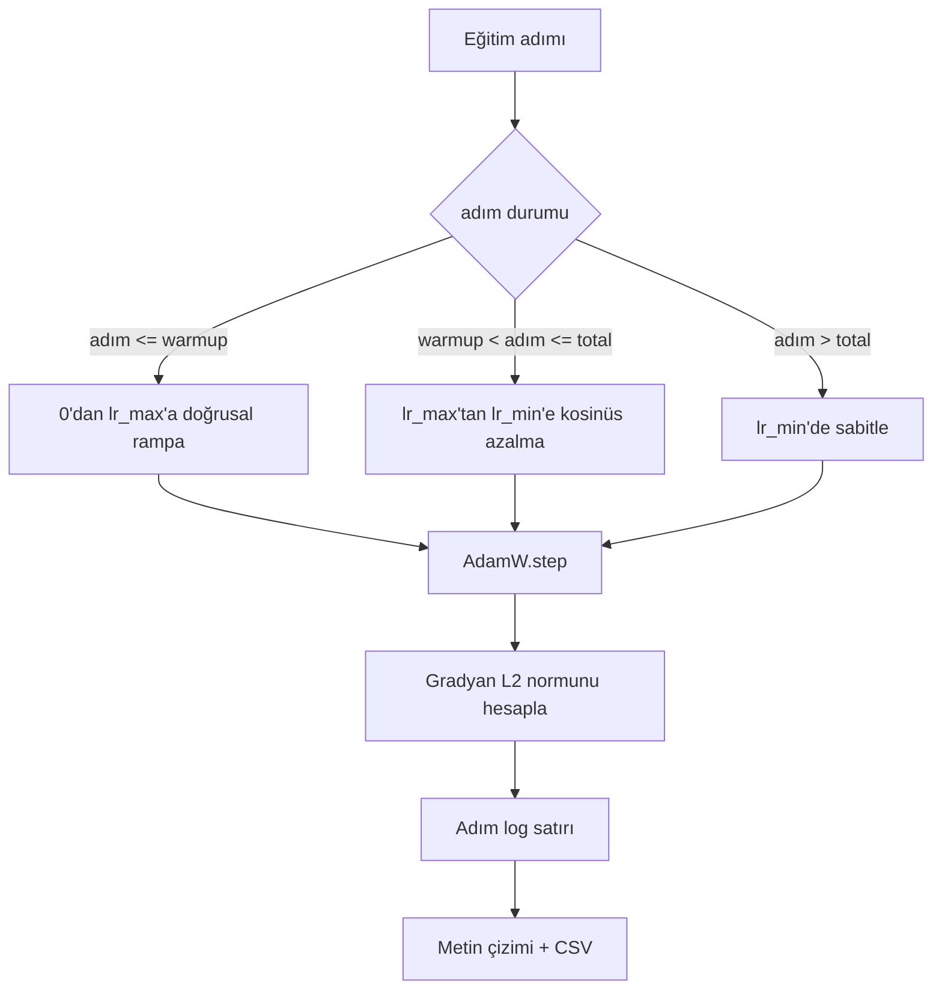

> **Orijinal İçerik:** [docs/en.md](https://github.com/rohitg00/ai-engineering-from-scratch/blob/main/phases/19-capstone-projects/44-cosine-lr-warmup/docs/en.md)

# Doğrusal Isınma ile Kosinüs Öğrenme Oranı

> Öğrenme oranı zamanlaması, kayıp fonksiyonundan sonra ikinci en önemli karardır. Kosinüs azalma ve doğrusal ısınma (warmup) ile AdamW, dil modeli eğitimi için modern varsayılandır, çünkü modelin kırılgan ilk bin güncellemesi sırasında küçük bir etkin adım boyutu görmesine, yapılandırılmış bir zirveye çıkmasına ve sıfıra doğru düzgün bir şekilde azalmasına izin verir. Bu ders, o zamanlamayı kurar, eğitim adımları boyunca eğriyi çizer, zamanlama yanına gradyan normlarını loglar ve zamanlamanın ısınma, zirve ve azalma sınırlarına saygı gösterdiğini kanıtlar.

**Tür:** Uygulama
**Diller:** Python
**Ön Koşullar:** Faz 19 dersleri 30-37
**Süre:** ~90 dakika

## Öğrenme Hedefleri

- Kosinüs öğrenme oranı zamanlamasıyla doğrusal ısınmalı bir AdamW optimize edici uygulamak.
- Zamanlamanın tam değerini, çalıştırmalar arasında kayan nokta kayması olmadan herhangi bir adımda hesaplamak.
- Eğitim sağlığının gözlemlenebilir olması için gradyan L2 normunu öğrenme oranının yanına loglamak.
- Zamanlamayı gözün okuyabileceği bir metin çizimine ve herhangi bir aracın tüketebileceği bir CSV'ye dönüştürmek.

## Sorun

İlk bin eğitim güncellemesi en gürültülü olanlardır. Modelin ağırlıkları hâlâ başlatmaya yakındır. Optimize edicinin çalışan ikinci moment tahmini kararlı hale gelmemiştir. Gradyan normu büyük ve gürültülüdür. Öğrenme oranı bu güncellemeler sırasında zirvesindeyse, model ya doğrudan ıraksar ya da asla kaçamayacağı bir kayıp platosuna yerleşir. İki iyi bilinen düzeltme, gradyan kırpma (Faz 19 ders 45'in konusu) ve küçük başlayıp yükselen bir öğrenme oranı zamanlamasıdır.

Isınmalı kosinüs zamanlamasının üç bölgesi vardır. Sıfır adımdan `warmup_steps` adımına kadar öğrenme oranı, sıfırdan yapılandırılmış zirve `lr_max`'a doğrusal olarak ölçeklenir. `warmup_steps` adımından `total_steps` adımına kadar öğrenme oranı, bir kosinüs eğrisinin üst yarısını izleyerek `lr_max`'tan `lr_min`'e azalır. `total_steps`'ten sonra öğrenme oranı, yanlış yapılandırılmış bir eğiticinin sessizce zamanlamadan çıkmaması için `lr_min`'e sabitlenir.

İnşa sorunu, zamanlamaların birer off-by-one ile kolayca yanlış yapılabilmesidir. Off-by-one, eğitim çalıştırmasının altıncı saatinde, modelin aşırı öğrenmeye başladığı anda yüzde 1 çok yüksek veya çok düşük bir öğrenme oranı olarak ortaya çıkar; bu, zamanlama sınırlarda kapsamlı test edilmedikçe görünmezdir.

## Kavram



### Isınma formülü

`[0, warmup_steps]` aralığında `step` için, `warmup_steps > 0` olmak üzere, öğrenme oranı `lr_max * step / warmup_steps`'tir. Dejenere `warmup_steps = 0` durumu "ısınma yok" olarak ele alınır: zamanlama sıfır adımda doğrudan `lr_max`'ta başlar ve hemen kosinüs azalmaya girer. Bazı test demetleri, zamanlamanın hâlâ kullanılabilir bir eğri ürettiğini kontrol etmek için `warmup_steps = 0` geçer.

### Kosinüs formülü

`(warmup_steps, total_steps]` aralığındaki `step` için, öğrenme oranı `lr_min + 0.5 * (lr_max - lr_min) * (1 + cos(pi * progress))` değeridir, burada `progress = (step - warmup_steps) / max(1, total_steps - warmup_steps)`. `step = warmup_steps`'te kosinüs `cos(0) = 1` değerini verir, bu da `lr_max` verir ve ısınma uç noktasıyla tam olarak eşleşir. `step = total_steps`'te kosinüs `cos(pi) = -1` değerini verir, bu da `lr_min` verir ve azalma uç noktasıyla tam olarak eşleşir.

Her iki uç noktadaki süreklilik tesadüf değildir. Zamanlamanın `step` üzerinde tek bir fonksiyon olarak uygulanmasının nedeni budur, birbirine yapıştırılmış üç farklı fonksiyon olarak değil. Yapıştırılmış bir zamanlama, `lr_max` ilk değiştirildiğinde bir sınırı kaybeder.

### Toplam adımlardan sonra taban

`step > total_steps` için öğrenme oranı `lr_min`'de kalır. Sözleşme açıktır: zamanlama hata vermez ve dış değer üretmez; tabana sabitlenir ve eğiticinin bir uyarı loglamasına izin verir. Eğitimi uzatması gereken eğiticiler, döngüyü değil zamanlamanın `total_steps`'ini değiştirir.

### Oranın yanında gradyan normu loglama

Eğitim sağlığının yarısı zamanlamadır. Diğer yarısı gradyan normudur. Eğitim döngüsü her adımda ikisini de loglar. Iraksayan bir eğitim çalıştırması, kayıptan önce gradyan normunun sıçradığını gösterir; iyi ayarlanmış bir ısınma, normu oranla doğrusal olarak yükseltir; çok agresif bir zirve, ısınmadan sonra normun yüksek kalması olarak ortaya çıkar. Disk üzerindeki veri kümesi `step, lr, grad_l2_norm, loss`'tur. CSV, tek dayanıklı kayıttır.

## İnşa Et

`code/main.py` şunları uygular:

- `CosineWithWarmup` - yapılandırılmış zamanlama üzerinde durumsuz bir `lr(step) -> float` fonksiyonu.
- `TrainState` - bir modeli, bir `AdamW` optimize ediciyi ve zamanlamayı tek bir adım fonksiyonuna sarar.
- `TrainState.step` - bir ileri geçiş, bir geri geçiş çalıştırır, gradyan L2 normunu loglar ve `lr(step)`'i optimize ediciye uygular.
- `plot_schedule_ascii` - zamanlamayı gözün okuyabileceği bir metin çizimi olarak oluşturur.
- `write_schedule_csv` - öğrenme oranıyla adım başına bir satır yayar.

Dosyanın altındaki bir demo, küçük bir `nn.Linear` modeli kurar, sabit bir giriş batchı üzerinde 20 adım eğitir ve adım başına öğrenme oranını, gradyan normunu ve kaybı yazdırır. Zamanlama, görsel sağlamlık kontrolü için ayrıca metin çizimi olarak oluşturulur.

Çalıştırın:

```bash
python3 code/main.py
```

Betik sıfırla çıkar ve adım başına eğitim logunu artı zamanlama çizimini yazdırır.

## Üretim Örüntüleri

Dört örüntü, zamanlamayı bir üretim yapıtına yükseltir.

**Zamanlama kodda değil, bir config'de yaşar.** Eğitici `warmup_steps`, `total_steps`, `lr_max`, `lr_min`'i git'e commitlenmiş bir YAML veya JSON config'den okur. Zamanlama, config içerik adresli olduğu için tekrarlanabilirdir; config PR diff'inin bir parçası olduğu için denetlenebilirdir.

**Adım sayacı tekdüze ve epoch'lardan ayrıştırılmıştır.** Bazı çerçeveler, veri kümesi parçalandığında veya dataloader yeniden başlatıldığında adımı ve epoch'u karıştırır. Zamanlama, `global_step`'i eğiticinin kontrol noktasından okur, yerel bir sayacdan değil. Sürdürülen bir çalıştırma, adım sayacı dayanıklı eksen olduğu için doğru zamanlama konumunda devam eder.

**Çalıştırma dizininde zamanlama çizimi.** Her eğitim çalıştırması, `outputs/lr_schedule.png`'yi (veya bu derste bir metin çizimini) çalıştırma dizinine yazar. Dizini gözden geçiren bir incelemeci, hiçbir şeyi yeniden çalıştırmadan zamanlamayı sağlamlık kontrolünden geçirebilir. Bu, yanlış yapılandırılmış-zamanlama sınıfı hatalarını PR zamanında yakalar.

**Log satırı şeması sabittir.** Sırayla `step, lr, grad_l2_norm, loss`. Downstream bir defter veya pano şemayı okur; bir sürüm yükseltmeden sütun adını değiştirmek, mevcut tüm panoları geçersiz kılar.

## Kullan

Üretim örüntüleri:

- **Her şeyden önce zirveyi tarayın.** `lr_max` en hassas düğmedir. Önce küçük bir modelde tarayın; optimal `lr_max`, model boyutuyla zayıf ölçeklenir, dolayısıyla küçük model taraması güçlü bir öncüldür.
- **Isınma, mutlak bir sayım değil, toplam adımların bir kesridir.** 200 milyon adımlık bir çalıştırma, 2.000 ısınma adımıyla zirvede neredeyse hemen başlar; 20.000 adımlık bir çalıştırma, aynı sayıyla yüzde 10 oranında ısınır. Isınma, bir kesir (tipik: yüzde 1-3) olarak yapılandırın, böylece zamanlama eğitim süresiyle ölçeklenir.
- **`lr_min` kasıtlı olarak sıfır değildir.** Zirvenin yüzde 10'u olan bir taban, uzun kuyruk sırasında optimize edicinin öğrenmeye devam etmesini sağlar. `lr_min = 0` zamanlaması, bir çizimde harika görünen ama aslında eğitimi bitirmemiş bir model üretir.

## Gönder

`outputs/skill-cosine-warmup.md`, gerçek bir projede, hangi config'in zamanlamayı taşıdığını, hangi eğitici adımının küresel sayacın okunduğunu ve hangi `lr_max` taramasının konuşlandırılan değeri ürettiğini açıklardı. Bu ders motoru gönderir.

## Alıştırmalar

1. Zamanlamanın ters kare kök varyantını ekleyin ve 200 adımlık bir oyuncak eğitim çalıştırmasında karşılaştırın. Hangi eğri daha düşük son kayıp üretir?
2. `total_steps / 2`'de ikinci bir ısınma ekleyen bir `--restart` bayrağı ekleyin. Sıcak yeniden başlatmaların oyuncak çalıştırmada iyileştirip iyileştirmediğini savunun.
3. Zamanlamanın sürekli olduğunu doğrulayan bir birim testi ekleyin: `[0, total_steps]` aralığındaki her adım için `|lr(step+1) - lr(step)|` farkı `lr_max / warmup_steps` ile sınırlıdır.
4. Zamanlamayı, çerçeve koduyla oluşturulacak şekilde `torch.optim.lr_scheduler.LambdaLR`'ye bağlayın. Ders düz bir adım fonksiyonu kullanır; sarmalayıcı neyi değiştirir?
5. `matplotlib` aracılığıyla gerçek bir çizim yazan bir `--plot-png` bayrağı ekleyin. CI çalıştırmaları için dersin metin çiziminin mi yoksa PNG'nin mi daha iyi varsayılan olduğunu savunun.

## Temel Terimler

| Terim | İnsanların söylediği | Gerçekte ne anlama geldiği |
|-------|---------------------|--------------------------|
| Isınma (Warmup) | "Yavaş başlangıç" | İlk `warmup_steps` güncellemesi boyunca sıfırdan `lr_max`'a doğrusal rampa |
| Kosinüs azalma | "Düzgün düşüş" | Kalan adımlar boyunca `lr_max`'tan `lr_min`'e üst yarı kosinüs eğrisi |
| Taban | "Eğitimden sonra" | Zamanlamanın `total_steps`'ten sonra sabitlediği sabit `lr_min` değeri |
| Gradyan normu | "Gradların L2'si" | Birleştirilmiş gradyan vektörünün Öklid normu, her adımda loglanır |
| Küresel adım | "Zamanlama ekseni" | Yeniden başlatmalarda hayatta kalan ve zamanlamayı yöneten tekdüze bir adım sayacı |

## İleri Okuma

- [Loshchilov ve Hutter, SGDR: Sıcak Yeniden Başlatmalı Stokastik Gradyan İnişi (arXiv 1608.03983)](https://arxiv.org/abs/1608.03983) - kosinüs zamanlamasının referans makalesi
- [Loshchilov ve Hutter, Ayrıştırılmış Ağırlık Azalma Düzenlileştirmesi (arXiv 1711.05101)](https://arxiv.org/abs/1711.05101) - AdamW'nin referans makalesi
- [PyTorch torch.optim.lr_scheduler](https://docs.pytorch.org/docs/stable/optim.html#how-to-adjust-learning-rate) - adım fonksiyonlarının çerçeve zamanlayıcılarıyla nasıl oluşturulacağı
- Faz 19 · 42 - bu zamanlamanın tükettiği derlemin indiricisi
- Faz 19 · 43 - zamanlamanın birlikte evrimleştiği dataloader
- Faz 19 · 45 - döngüdeki bir sonraki katman olan gradyan kırpma ve AMP
