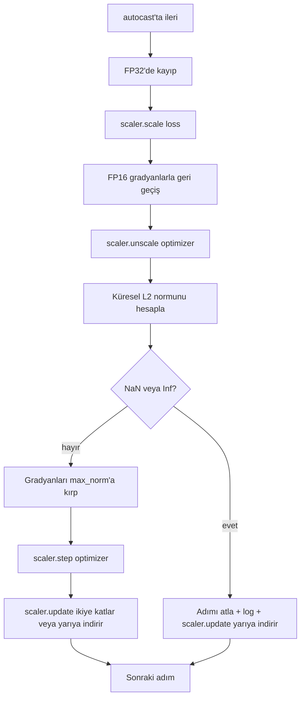

> **Orijinal İçerik:** [docs/en.md](https://github.com/rohitg00/ai-engineering-from-scratch/blob/main/phases/19-capstone-projects/45-gradient-clipping-amp/docs/en.md)

# Gradyan Kırpma ve Karışık Hassasiyet

> Önceki dersten gelen optimize edici ve zamanlama, gradyanların sağduyulu olduğunu varsayar. Genellikle değildir. Tek bir kötü batch, gradyan normunu üç büyüklük mertebesi kadar sıçratabilir. Karışık hassasiyetli eğitim, kayıp tarafında FP16 taşması (overflow) getirerek bunu güçlendirir. Bu ders, üretim eğitiminin onsuz gönderemeyeceği iki güvenlik kemerini kurar: yapılandırılmış küresel L2 normuna gradyan kırpma ve NaN ile Inf'i tespit eden, adımı temiz atlayan ve ölçekleme faktörünü adli inceleme için loglayan autocast ve GradScaler ile karışık hassasiyetli bir döngü.

**Tür:** Uygulama
**Diller:** Python
**Ön Koşullar:** Faz 19 dersleri 30-37
**Süre:** ~90 dakika

## Öğrenme Hedefleri

- Tüm parametre gradyanları üzerinde küresel L2 normunu hesaplamak ve yapılandırılmış eşiği aştığında yerinde kırpmak.
- FP16 ileri ve geri geçişlerinin taşmayı atlatması için bir eğitim adımını autocast ve bir GradScaler ile sarmak.
- Kayıp veya gradyanda NaN ve Inf'i tespit etmek, optimize edici adımını atlamak ve atlamayı loglamak.
- Uzun atlama dizilerinin hemen görünür olması için GradScaler'ın ölçekleme faktörünü her adımda rapor etmek.

## Sorun

Dün temiz çalışan bir eğitim çalıştırması, 8.217. adımda dikey giden bir kayıp eğrisi üretir. Suçlu, gradyan normu 4.200, önceki zirvenin yirmi katı olan tek bir batch'tir. Kırpma olmadan, optimize edici, modelin önceki saatte yaptığı her öğrenmeyi sıfırlayan bir adım uygular. Norm 1.0'da küresel bir L2 kırpma ile aynı batch, birim normlu bir güncelleme katkıda bulunur; kayıp trend çizgisinde kalır; çalıştırma hayatta kalır.

Karışık hassasiyetli eğitim, ileri geçişi ve geri geçişin çoğunu FP16'da hesaplayarak çıktıyı 2-3 kat artırır. Maliyet, FP16'nın dar bir üs aralığına sahip olmasıdır. FP16'da taşan tipik bir gradyan Inf olarak değerlendirilir, bu sonraki katmanlardan NaN olarak yayılır, bu da bir sonraki optimize edici adımında her ağırlığı NaN olarak ayarlar. PyTorch'un GradScaler'ı, geri geçişten önce kaybı büyük bir ölçekleme faktörüyle çarparak ve optimize edici adımından önce gradyanları aynı faktöre bölerek bunu çözer. Herhangi bir gradyan ölçek kaldırma zamanında Inf veya NaN ise, scaler adımı atlar ve ölçekleme faktörünü yarıya indirir; önceki N adım temizse scaler faktörü ikiye katlar. Eğitim boyunca faktör, FP16 aralığının izin verdiği en yüksek değeri bulur.

İnşa sorunu, ikisini doğru bağlamaktır. Ölçeklemeden önce kırpın ve eşik ölçeklenmiş gradyanlar üzerindedir; ölçek kaldırmadan sonra kırpın ve GradScaler üzerindeki işlem sırası önemlidir. Doğru sıra: `scaler.scale(loss).backward()`, sonra `scaler.unscale_(optimizer)`, sonra `clip_grad_norm_`, sonra `scaler.step(optimizer)`, sonra `scaler.update()`. Başka herhangi bir sıra, sessizce bozuk bir döngü üretir.

## Kavram



### Küresel L2 normu

Küresel L2 normu, birleştirilmiş gradyan vektörünün Öklid normudur, parametre başına normu değil. PyTorch bunu `torch.nn.utils.clip_grad_norm_(parameters, max_norm)` olarak uygular. Fonksiyon, kırpma öncesi normu döndürür, böylece ders hem doğal hem kırpılmış değeri loglayabilir; bu, "her adımda kırpıyoruz" teşhisi için gereklidir.

### autocast ve GradScaler

`torch.amp.autocast(device_type)`, uygun işlemleri (çoğu matmul sınıfı işlem) FP16'da seçici olarak çalıştıran bağlam yöneticisidir. `torch.amp.GradScaler(device_type)`, geri geçişten önce kaybı ölçekleyen ve optimize edici adımından önce gradyanları ters ölçekleyen yardımcıdır. İkisi birlikte tasarlanmıştır; birini diğeri olmadan kullanmak, testin yakalaması gereken bir yapılandırma hatasıdır.

Ders, CPU autocast kullanır çünkü bu CI'da çalışan şeydir; aynı örüntü, `device_type="cpu"`'yu `device_type="cuda"` olarak değiştirerek CUDA'ya değişmeden aktarılır. CPU üzerinde GradScaler bir stub'tır (CPU autocast zaten varsayılan olarak BF16'da çalışır ve kayıp ölçeklemesi gerektirmez), ancak ders, bağlantının GPU döngüsüyle aynı olması için çağrı sitelerini içerir.

### NaN ve Inf tespiti

Tespit iki yerde olur. Birincisi, kaybın kendisi geri geçişten önce `torch.isfinite` ile kontrol edilir; Inf veya NaN kayıp, yararlı gradyanlar üretmez ve optimize ediciye girmeden atlanır. İkincisi, `scaler.unscale_(optimizer)`'dan sonra ders, ölçeği kaldırılmış gradyanları `has_non_finite_grad(...)` ile tarar ve herhangi bir Inf veya NaN'ı atlama olarak ele alır. İki kontrol birlikte hem ileri geçiş hem geri geçiş başarısızlık modlarını kapsar.

### Ölçekleme faktörü tanılaması

Ölçekleme faktörü, GradScaler'ın iç durumudur. Ders, her adımda `scaler.get_scale()` okur ve onu öğrenme oranı ve gradyan normunun yanına loglar. Sağlıklı bir çalıştırma, ölçekleme faktörünün iki kuvvetinde tırmanıp `2^17` veya `2^18` civarında doygunluğa ulaştığını gösterir. Huysuz bir çalıştırma, faktörün yüksek ve düşük değerler arasında salındığını gösterir; bu, modelin gradyanlarının bazen aralıkta bazen olmadığının sinyalidir. Teşhis, loglama olmadan görünmezdir.

## İnşa Et

`code/main.py` şunları uygular:

- `clip_global_l2_norm` - `torch.nn.utils.clip_grad_norm_` etrafında, hem kırpma öncesi hem sonrası normu döndüren bir sarmalayıcı.
- `has_non_finite_grad` - gradyanları NaN ve Inf için tarayan bir yardımcı.
- `AmpTrainState` - bir modeli, bir `AdamW` optimize ediciyi, bir GradScaler'ı ve bir autocast cihazını sarar. Tam kırpma, ölçekleme ve NaN'da atlama hattını çalıştıran bir `step(inputs, targets)` sunar.
- `StepLog` ve `SkipLog` - yapılandırılmış adım başına kayıtlar.
- 20 adım boyunca küçük bir `nn.Linear` modeli eğiten, atlama yolunu çalıştırmak için 5. adımda gradyana bir Inf enjekte eden ve ortaya çıkan logu yazdıran bir demo.

Çalıştırın:

```bash
python3 code/main.py
```

Betik sıfırla çıkar ve her satırı `STEP` veya `SKIP` olarak etiketlenmiş adım başına bir log yazdırır; en az bir satır `SKIP`'tir.

## Üretim Örüntüleri

Dört örüntü, döngüyü bir üretim eğitim adımına yükseltir.

**Atlama sayacı bir log satırı değil, bir uyarıdır.** Eğitim çalıştırması başına birkaç atlanan adım sağlıklıdır. Epoch başına yüzlerce atlama sert bir uyarıdır: model, FP16'nın tutamadığı bir rejimde ve döngü sessizce başarısız oluyor. Ders, 1.000 adımlık kayan bir atlama oranı izler ve üretimde yüzde 5'in üzerindeki bir oran için sayfa açar.

**Kırpma eşiği config'de yaşar.** `max_norm = 1.0`, dil modeli eğitimi için modern varsayılandır. Önce küçük bir modelde tarayın; daha büyük eşikler, modelin gerçekten zor batchlerden kurtulmasına izin verir; daha küçük eşikler, daha gürültülü bir kayıp eğrisi pahasına en kötü durumu sınırlar. Eşik, ders 44'ten gelen zamanlamayla aynı YAML veya JSON config'inde yer alır.

**Norm logu, zamanlama ile birlikte bir CSV'ye gider.** CSV sütunları `step, lr, grad_l2_pre_clip, grad_l2_post_clip, loss, skipped, skip_reason, scaler_scale`'dır. Dosyayı açan bir incelemeci, zamanlamayı, gradyan hikâyesini, ölçekleme faktörünü ve atlama sonucunu (nedeniyle) tek bir satırda görür. Sütunları dosyalar arasında bölmek, yanlış hizalanmış analizler için bir reçetedir.

**`scaler.update()` her adımda çalışır, atlama üzerinde bile.** Temiz bir adımda scaler, no-inf sayacını okur, artırır ve faktörü muhtemelen ikiye katlar. Atlanan bir adımda scaler, faktörü yarıya indirir ve sayacı sıfırlar. Atlama yolunda `update()`'i unutmak, "ölçekleme faktörü hiç değişmedi" hatasını üreten bug'dır.

## Kullan

Üretim örüntüleri:

- **Autocast cihazı, optimize edici cihazıyla eşleşir.** GPU eğitimi için `torch.amp.autocast(device_type="cuda")`; CPU için `torch.amp.autocast(device_type="cpu")`. Cihazları karıştırmak, iyi görünen ama öğrenmeyen bir kayıp eğrisi olarak ortaya çıkan sessiz bir tür hatası üretir.
- **Geri geçişten önce kayıp kontrolü.** `torch.isfinite(loss).all()` tek bir tensör azaltmasıdır; maliyeti ihmal edilebilirdir ve bir NaN kaybındaki tasarruflar tüm bir eğitim adımıdır. Her zaman çalıştırın.
- **`zero_grad` içinde `set_to_none=True`.** Gradyanları sıfır yerine `None` olarak ayarlar, bu da optimize edicinin etkilenmeyen parametre grupları için hesaplamayı atlamasına izin verir. Ayar, ücretsiz bir çıktı artışı ve hafif bir hata yüzeyi azalmasıdır.

## Gönder

`outputs/skill-clip-amp.md`, gerçek bir projede, hangi kırpma eşiğinin ve autocast cihazının eğitim adımını kullandığını, adım başına CSV'nin sürüm kontrolünde nerede yaşadığını ve üretim atlama oranı uyarı eşiğinin ne olduğunu açıklardı. Bu ders motoru gönderir.

## Alıştırmalar

1. Sentetik Inf enjeksiyonunu gerçek bir kayıp sıçramasıyla (bir batch'in hedefini 1e8 ile çarpın) değiştirin ve atlama yolunun tetiklendiğini doğrulayın.
2. autocast'ı FP16 yerine BF16'ya geçiren bir `--bf16` modu ekleyin. BF16, FP16'dan daha geniş bir üs aralığına sahiptir ve nadiren kayıp ölçeklemesi gerektirir; aynı demoda atlama oranının sıfıra düştüğünü doğrulayın.
3. Kırpma olmadığında gradyan-kırpma sarmalayıcısının kırpma öncesi ve sonrası normu doğru döndürdüğünü doğrulayan bir birim testi ekleyin.
4. Kayan pencereli bir atlama oranı hesaplaması ve oran yapılandırılmış bir eşiği 100 ardışık adım boyunca aşarsa çalıştırmayı başarısız kılan bir CLI bayrağı ekleyin.
5. Döngüyü, kanonik CSV'yi (`step, lr, grad_l2_pre_clip, grad_l2_post_clip, loss, skipped, skip_reason, scaler_scale`) yazacak şekilde bağlayın ve dosyanın her satırdan sonra flush ederek bir Ctrl-C'den sağ çıktığını doğrulayın.

## Temel Terimler

| Terim | İnsanların söylediği | Gerçekte ne anlama geldiği |
|-------|---------------------|--------------------------|
| Küresel L2 normu | "Kırpma hedefi" | Tüm eğitilebilir parametreler boyunca birleştirilmiş gradyan vektörünün Öklid normu |
| autocast | "Karışık hassasiyet" | Bir `with` bloğu içinde uygun işlemlerin seçici FP16 (veya BF16) yürütülmesi |
| GradScaler | "Kayıp ölçekleyici" | Geri geçişten önce kaybı çarpan ve optimize edici adımından önce gradyanları ters ölçekleyen yardımcı |
| Atlama | "Kötü adım" | Gradyan veya kayıp sonlu olmadığı için reddedilen bir optimize edici adımı; scaler faktörü yarıya indirir |
| Ölçekleme faktörü | "Scaler durumu" | GradScaler'ın mevcut çarpanı; temiz uzunluklardan sonra ikiye katlanır ve her atlama üzerinde yarıya iner |

## İleri Okuma

- [Micikevicius ve ark., Karışık Hassasiyetli Eğitim (arXiv 1710.03740)](https://arxiv.org/abs/1710.03740) - orijinal kayıp ölçekleme önerisi
- [Pascanu, Mikolov, Bengio, YINLEM AĞLARININ EĞİTİMİNİN ZORLUĞU ÜZERİNE (arXiv 1211.5063)](https://arxiv.org/abs/1211.5063) - gradyan kırpma referans makalesi
- [PyTorch torch.amp.GradScaler](https://docs.pytorch.org/docs/stable/amp.html) - bu dersin sardığı scaler API'si
- [PyTorch torch.nn.utils.clip_grad_norm_](https://docs.pytorch.org/docs/stable/generated/torch.nn.utils.clip_grad_norm_.html) - bu dersin kullandığı kırpma temeli
- Faz 19 · 42 - döngüyü besleyen derlemin indiricisi
- Faz 19 · 43 - döngünün tükettiği dataloader
- Faz 19 · 44 - bu döngünün oluşturduğu zamanlama
